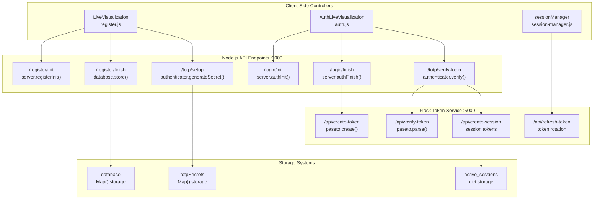
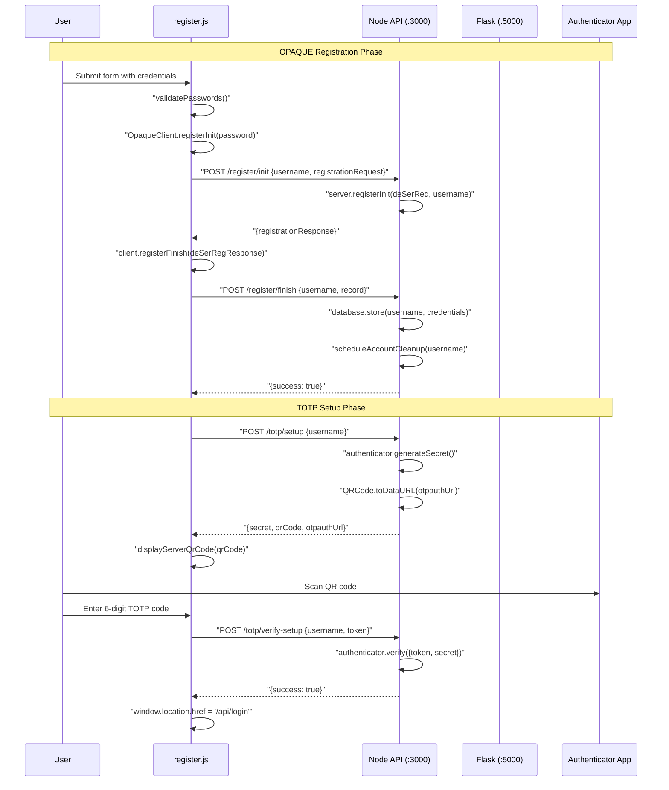
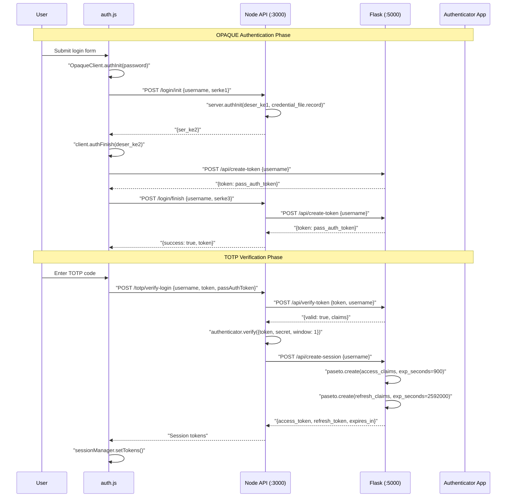
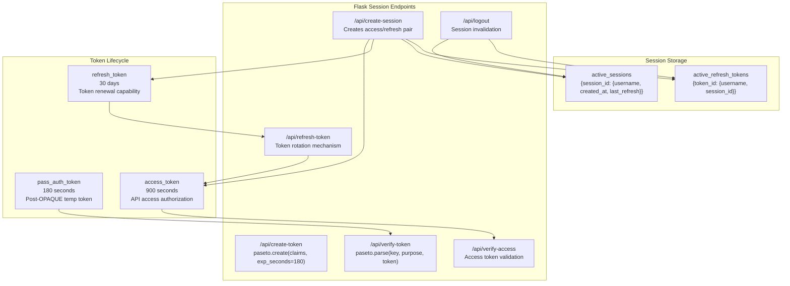

# Authentication Workflows

> **Relevant source files**
> * [back-end/main.py](https://github.com/RogueElectron/Cypher/blob/7b7a1583/back-end/main.py)
> * [back-end/node_internal_api/app.js](https://github.com/RogueElectron/Cypher/blob/7b7a1583/back-end/node_internal_api/app.js)
> * [back-end/src/auth.js](https://github.com/RogueElectron/Cypher/blob/7b7a1583/back-end/src/auth.js)
> * [back-end/src/register.js](https://github.com/RogueElectron/Cypher/blob/7b7a1583/back-end/src/register.js)

## Purpose and Scope

This document provides comprehensive documentation of the authentication workflows implemented in the Cypher system. It covers the complete user journey from registration through login and session management, detailing the cryptographic protocols, user interface interactions, and backend service coordination that enable secure zero-knowledge authentication.

For technical implementation details of individual services, see [Backend Services](/RogueElectron/Cypher/documentation/2.1-backend-services). For security architecture and cryptographic protocols, see [Security Model](/RogueElectron/Cypher/documentation/2.3-security-model).

## Overview of Authentication Workflows

The Cypher authentication system implements two primary user workflows:

1. **User Registration Process** - OPAQUE protocol registration followed by TOTP setup and verification
2. **User Login Process** - OPAQUE authentication followed by TOTP verification and session token creation

Both workflows utilize a dual-backend architecture where the Node.js service handles cryptographic operations and the Flask service manages token lifecycle. Each workflow includes live visualization components that provide real-time feedback to users about the security operations being performed.

## Authentication Architecture Overview

This diagram shows the complete authentication architecture with actual code entities and their relationships across both workflows.

Sources: [back-end/src/register.js L79-L500](https://github.com/RogueElectron/Cypher/blob/7b7a1583/back-end/src/register.js#L79-L500)

 [back-end/src/auth.js L86-L474](https://github.com/RogueElectron/Cypher/blob/7b7a1583/back-end/src/auth.js#L86-L474)

 [back-end/node_internal_api/app.js L118-L464](https://github.com/RogueElectron/Cypher/blob/7b7a1583/back-end/node_internal_api/app.js#L118-L464)

 [back-end/main.py L36-L334](https://github.com/RogueElectron/Cypher/blob/7b7a1583/back-end/main.py#L36-L334)

## User Registration Process

The registration workflow implements a two-phase process combining OPAQUE password registration with TOTP two-factor authentication setup.

### Registration Sequence Flow

### OPAQUE Registration Implementation

The OPAQUE registration phase begins when the user submits the registration form, handled by the `register-form` event listener [back-end/src/register.js L228-L354](https://github.com/RogueElectron/Cypher/blob/7b7a1583/back-end/src/register.js#L228-L354)

:

1. **Input Validation**: The `validatePasswords()` function [back-end/src/register.js L210-L220](https://github.com/RogueElectron/Cypher/blob/7b7a1583/back-end/src/register.js#L210-L220)  ensures password strength requirements and confirmation matching.
2. **Client Key Generation**: An `OpaqueClient` instance generates a blinded password request using `registerInit(password)` [back-end/src/register.js L265-L267](https://github.com/RogueElectron/Cypher/blob/7b7a1583/back-end/src/register.js#L265-L267)  which never exposes the plaintext password.
3. **Server Registration Init**: The serialized request is sent to `/register/init` [back-end/node_internal_api/app.js L118-L149](https://github.com/RogueElectron/Cypher/blob/7b7a1583/back-end/node_internal_api/app.js#L118-L149)  where `server.registerInit(deSerReq, username)` processes the blinded password.
4. **Registration Completion**: The client completes the protocol with `registerFinish(deSerRegResponse)` [back-end/src/register.js L304-L306](https://github.com/RogueElectron/Cypher/blob/7b7a1583/back-end/src/register.js#L304-L306)  creating the final registration record.
5. **Credential Storage**: The server stores credentials via `database.store(username, Uint8Array.from(credential_file.serialize()))` [back-end/node_internal_api/app.js L173](https://github.com/RogueElectron/Cypher/blob/7b7a1583/back-end/node_internal_api/app.js#L173-L173)
6. **Cleanup Scheduling**: `scheduleAccountCleanup(username)` [back-end/node_internal_api/app.js L177](https://github.com/RogueElectron/Cypher/blob/7b7a1583/back-end/node_internal_api/app.js#L177-L177)  schedules automatic deletion of unverified accounts after `VERIFICATION_TIMEOUT` (5 minutes).

### TOTP Setup Implementation

After successful OPAQUE registration, the system transitions to TOTP setup:

1. **Secret Generation**: The `/totp/setup` endpoint [back-end/node_internal_api/app.js L302-L334](https://github.com/RogueElectron/Cypher/blob/7b7a1583/back-end/node_internal_api/app.js#L302-L334)  calls `authenticator.generateSecret()` to create a unique TOTP secret.
2. **QR Code Creation**: `QRCode.toDataURL(otpauthUrl)` generates a scannable QR code containing the OTPAUTH URI for authenticator apps.
3. **User Interface Update**: `displayServerQrCode(qrCodeDataURL, otpauthUrl)` [back-end/src/register.js L392-L408](https://github.com/RogueElectron/Cypher/blob/7b7a1583/back-end/src/register.js#L392-L408)  renders the QR code and provides manual entry options.
4. **Verification Process**: The user enters a TOTP code, verified via `/totp/verify-setup` [back-end/node_internal_api/app.js L336-L361](https://github.com/RogueElectron/Cypher/blob/7b7a1583/back-end/node_internal_api/app.js#L336-L361)  using `authenticator.verify({token, secret})`.
5. **Account Activation**: Successful TOTP verification clears the cleanup timeout and completes registration.

Sources: [back-end/src/register.js L228-L500](https://github.com/RogueElectron/Cypher/blob/7b7a1583/back-end/src/register.js#L228-L500)

 [back-end/node_internal_api/app.js L118-L361](https://github.com/RogueElectron/Cypher/blob/7b7a1583/back-end/node_internal_api/app.js#L118-L361)

## User Login Process

The login workflow implements a multi-stage authentication process that separates password verification from two-factor authentication using temporary tokens.

### Login Sequence Flow

### OPAQUE Authentication Implementation

The login process starts with the `login-form` event listener [back-end/src/auth.js L214-L378](https://github.com/RogueElectron/Cypher/blob/7b7a1583/back-end/src/auth.js#L214-L378)

:

1. **KE1 Generation**: An `OpaqueClient` creates the first key exchange message via `authInit(password)` [back-end/src/auth.js L245-L247](https://github.com/RogueElectron/Cypher/blob/7b7a1583/back-end/src/auth.js#L245-L247)  which blinds the password for transmission.
2. **Server Authentication Init**: The `/login/init` endpoint [back-end/node_internal_api/app.js L194-L231](https://github.com/RogueElectron/Cypher/blob/7b7a1583/back-end/node_internal_api/app.js#L194-L231)  retrieves stored credentials with `database.lookup(username)` and calls `server.authInit(deser_ke1, credential_file.record, credential_file.credential_identifier)`.
3. **Session Storage**: The server stores the expected KE3 value in `global.userSessions.set(username, expected)` for later verification.
4. **Client Authentication Finish**: The client processes KE2 with `client.authFinish(deser_ke2)` [back-end/src/auth.js L286-L288](https://github.com/RogueElectron/Cypher/blob/7b7a1583/back-end/src/auth.js#L286-L288)  generating the session key and KE3 proof.
5. **Temporary Token Creation**: The `/login/finish` endpoint [back-end/node_internal_api/app.js L235-L298](https://github.com/RogueElectron/Cypher/blob/7b7a1583/back-end/node_internal_api/app.js#L235-L298)  verifies the KE3 proof and calls Flask's `/api/create-token` [back-end/main.py L36-L56](https://github.com/RogueElectron/Cypher/blob/7b7a1583/back-end/main.py#L36-L56)  to create a `pass_auth_token` with 180-second expiration.

### TOTP Verification and Session Creation

After successful OPAQUE authentication, the system requires TOTP verification:

1. **Token Validation**: The `/totp/verify-login` endpoint [back-end/node_internal_api/app.js L363-L464](https://github.com/RogueElectron/Cypher/blob/7b7a1583/back-end/node_internal_api/app.js#L363-L464)  first validates the temporary token by calling Flask's `/api/verify-token` [back-end/main.py L58-L93](https://github.com/RogueElectron/Cypher/blob/7b7a1583/back-end/main.py#L58-L93)
2. **TOTP Code Verification**: The system calls `authenticator.verify({token, secret, window: 1})` with the user's TOTP code and stored secret from `totpSecrets.get(username)`.
3. **Cleanup Unverified Account**: Successful TOTP verification clears any pending account cleanup with `clearTimeout(unverifiedAccounts.get(username))`.
4. **Session Token Creation**: The server calls Flask's `/api/create-session` [back-end/main.py L94-L151](https://github.com/RogueElectron/Cypher/blob/7b7a1583/back-end/main.py#L94-L151)  to create long-lived access and refresh tokens using separate PASETO keys.
5. **Frontend Token Storage**: The `sessionManager.setTokens()` function stores the tokens securely and clears the temporary `pass_auth_token`.

### Token Management Details

The Flask service creates two types of session tokens:

| Token Type | Duration | Key | Claims |
| --- | --- | --- | --- |
| `access_token` | 900 seconds | `session_key` | `{username, session_id, type: 'access', iat}` |
| `refresh_token` | 2592000 seconds | `refresh_key` | `{username, session_id, type: 'refresh', token_id, iat}` |

Both tokens are created using `paseto.create()` with automatic expiration handling.

Sources: [back-end/src/auth.js L214-L474](https://github.com/RogueElectron/Cypher/blob/7b7a1583/back-end/src/auth.js#L214-L474)

 [back-end/node_internal_api/app.js L194-L464](https://github.com/RogueElectron/Cypher/blob/7b7a1583/back-end/node_internal_api/app.js#L194-L464)

 [back-end/main.py L36-L151](https://github.com/RogueElectron/Cypher/blob/7b7a1583/back-end/main.py#L36-L151)

## Session Management

The session management system handles token lifecycle through Flask's token service with in-memory storage and automatic cleanup mechanisms.

### Session Token Architecture

### Session Creation Process

The `/api/create-session` endpoint [back-end/main.py L94-L151](https://github.com/RogueElectron/Cypher/blob/7b7a1583/back-end/main.py#L94-L151)

 implements secure session establishment:

1. **Session ID Generation**: Uses `secrets.token_urlsafe(32)` to create a unique session identifier.
2. **Access Token Creation**: Creates an access token with claims `{username, session_id, type: 'access', iat: current_time}` using `paseto.create(key=session_key, purpose='local', claims=access_claims, exp_seconds=900)`.
3. **Refresh Token Creation**: Creates a refresh token with a unique `token_id` using `secrets.token_urlsafe(32)` and longer expiration.
4. **Session Storage**: Stores session metadata in `active_sessions[session_id]` and refresh token data in `active_refresh_tokens[refresh_token_id]`.

### Token Refresh Mechanism

The `/api/refresh-token` endpoint [back-end/main.py L153-L239](https://github.com/RogueElectron/Cypher/blob/7b7a1583/back-end/main.py#L153-L239)

 implements secure token rotation:

1. **Refresh Token Validation**: Parses the refresh token with `paseto.parse(key=refresh_key, purpose='local', token=refresh_token)` and validates claims.
2. **Session Verification**: Confirms the session exists in `active_sessions` and matches the token's `session_id`.
3. **Token Rotation**: Removes the old refresh token from `active_refresh_tokens` and creates new access/refresh token pairs.
4. **Session Update**: Updates `active_sessions[session_id]['last_refresh']` with the current timestamp.

### Logout and Session Cleanup

The `/api/logout` endpoint [back-end/main.py L283-L334](https://github.com/RogueElectron/Cypher/blob/7b7a1583/back-end/main.py#L283-L334)

 provides comprehensive session termination:

1. **Token Parsing**: Attempts to extract session information from either access or refresh tokens using `paseto.parse()`.
2. **Session Removal**: Removes the session from `active_sessions` and collects all associated refresh tokens.
3. **Complete Cleanup**: Iterates through `active_refresh_tokens` to remove all tokens associated with the session ID.

### Live Visualization Integration

Both workflows include comprehensive live visualization through dedicated controllers:

* **Registration**: `LiveVisualization` class [back-end/src/register.js L79-L146](https://github.com/RogueElectron/Cypher/blob/7b7a1583/back-end/src/register.js#L79-L146)  with `registrationSteps` [back-end/src/register.js L12-L76](https://github.com/RogueElectron/Cypher/blob/7b7a1583/back-end/src/register.js#L12-L76)
* **Authentication**: `AuthLiveVisualization` class [back-end/src/auth.js L86-L153](https://github.com/RogueElectron/Cypher/blob/7b7a1583/back-end/src/auth.js#L86-L153)  with `authenticationSteps` [back-end/src/auth.js L19-L83](https://github.com/RogueElectron/Cypher/blob/7b7a1583/back-end/src/auth.js#L19-L83)

Key visualization methods include:

* `activateStep(stepId)`: Highlights current operation
* `completeStep(stepId)`: Marks operations as completed
* `updateSecurityStatus(message, type)`: Provides security explanations

Sources: [back-end/main.py L94-L334](https://github.com/RogueElectron/Cypher/blob/7b7a1583/back-end/main.py#L94-L334)

 [back-end/src/register.js L79-L146](https://github.com/RogueElectron/Cypher/blob/7b7a1583/back-end/src/register.js#L79-L146)

 [back-end/src/auth.js L86-L153](https://github.com/RogueElectron/Cypher/blob/7b7a1583/back-end/src/auth.js#L86-L153)