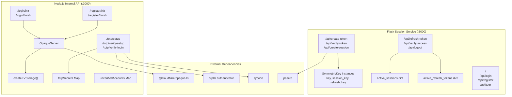
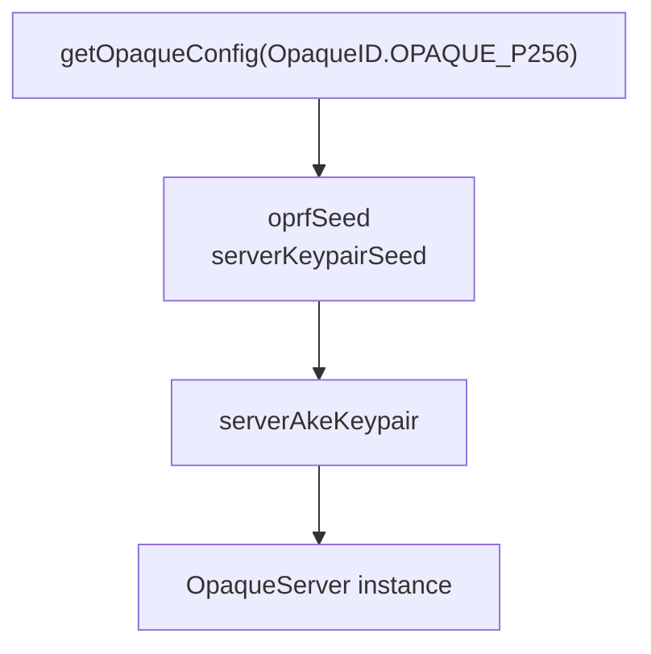
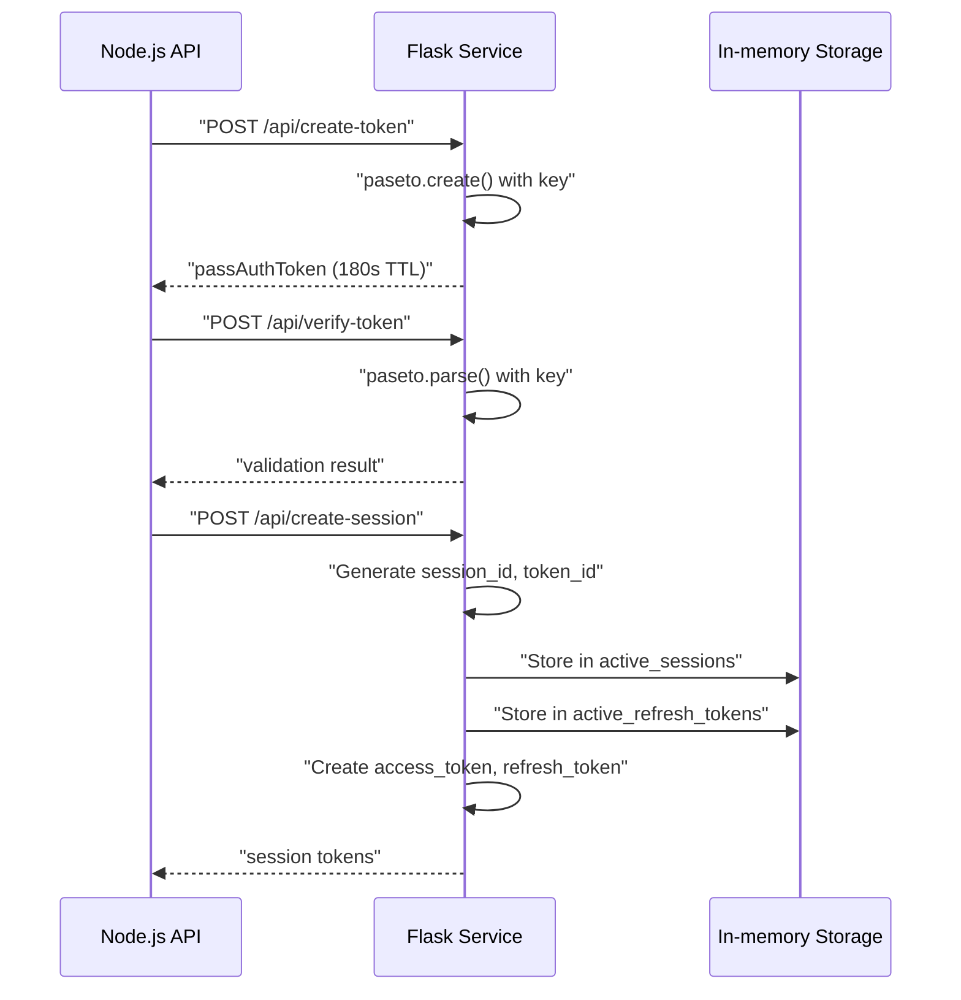
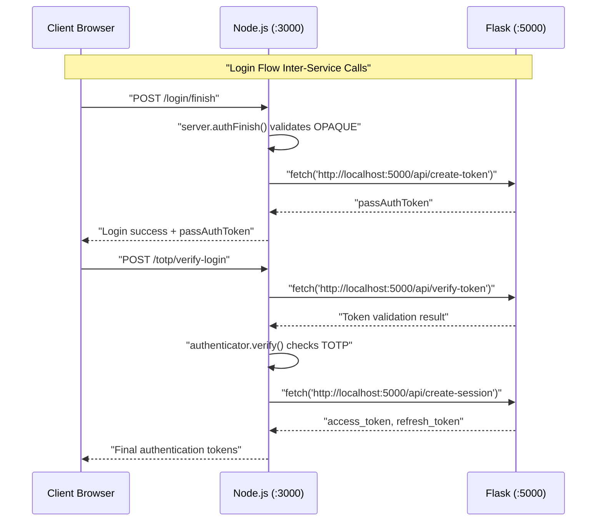

# Backend Services

> **Relevant source files**
> * [back-end/main.py](https://github.com/RogueElectron/Cypher/blob/7b7a1583/back-end/main.py)
> * [back-end/node_internal_api/app.js](https://github.com/RogueElectron/Cypher/blob/7b7a1583/back-end/node_internal_api/app.js)

This document details the dual-backend architecture that powers the Cypher authentication system. It covers the Node.js Internal API responsible for cryptographic operations and the Flask Session Service that manages token lifecycle and user sessions. For client-side components that interact with these services, see [Frontend Components](/RogueElectron/Cypher/2.2-frontend-components). For the security protocols implemented by these services, see [Security Model](/RogueElectron/Cypher/2.3-security-model).

## Service Overview

The Cypher system employs a separation of concerns architecture with two distinct backend services running on different ports, each handling specific aspects of the authentication workflow.

### Service Architecture



Sources: [back-end/node_internal_api/app.js L1-L469](https://github.com/RogueElectron/Cypher/blob/7b7a1583/back-end/node_internal_api/app.js#L1-L469)

 [back-end/main.py L1-L339](https://github.com/RogueElectron/Cypher/blob/7b7a1583/back-end/main.py#L1-L339)

### Service Responsibilities

| Service | Port | Primary Responsibilities | Key Dependencies |
| --- | --- | --- | --- |
| Node.js Internal API | 3000 | OPAQUE protocol operations, TOTP management, user registration | `@cloudflare/opaque-ts`, `otplib`, `qrcode` |
| Flask Session Service | 5000 | PASETO token lifecycle, session management, HTML template serving | `paseto`, `flask` |

Sources: [back-end/node_internal_api/app.js L467-L469](https://github.com/RogueElectron/Cypher/blob/7b7a1583/back-end/node_internal_api/app.js#L467-L469)

 [back-end/main.py L337-L338](https://github.com/RogueElectron/Cypher/blob/7b7a1583/back-end/main.py#L337-L338)

## Node.js Internal API

The Node.js service handles cryptographic operations and never sees plaintext passwords due to the OPAQUE protocol's zero-knowledge design.

### Core Components

#### OPAQUE Configuration

The service initializes OPAQUE protocol components using the P-256 elliptic curve configuration:



Sources: [back-end/node_internal_api/app.js L74-L112](https://github.com/RogueElectron/Cypher/blob/7b7a1583/back-end/node_internal_api/app.js#L74-L112)

#### Storage Systems

Three in-memory storage mechanisms handle different data types:

* `database` (KVStorage): Stores serialized `CredentialFile` objects containing user registration records
* `totpSecrets` (Map): Maps usernames to TOTP secrets for two-factor authentication
* `unverifiedAccounts` (Map): Tracks accounts pending TOTP verification with cleanup timeouts

Sources: [back-end/node_internal_api/app.js L45-L101](https://github.com/RogueElectron/Cypher/blob/7b7a1583/back-end/node_internal_api/app.js#L45-L101)

### API Endpoints

#### Registration Flow Endpoints

**POST /register/init**

* Accepts `username` and `registrationRequest` (serialized OPAQUE client request)
* Returns `registrationResponse` after calling `server.registerInit()`
* Validates username uniqueness against `database.lookup()`

**POST /register/finish**

* Accepts `record` (serialized RegistrationRecord) and `username`
* Creates `CredentialFile` and stores in `database` via `database.store()`
* Schedules account cleanup via `scheduleAccountCleanup()`

Sources: [back-end/node_internal_api/app.js L118-L192](https://github.com/RogueElectron/Cypher/blob/7b7a1583/back-end/node_internal_api/app.js#L118-L192)

#### Authentication Flow Endpoints

**POST /login/init**

* Accepts `serke1` (serialized KE1) and `username`
* Retrieves user `CredentialFile` from `database.lookup()`
* Returns serialized KE2 from `server.authInit()`
* Stores expected session key in `global.userSessions`

**POST /login/finish**

* Accepts `serke3` (serialized KE3) and `username`
* Completes OPAQUE authentication via `server.authFinish()`
* Calls Flask's `/api/create-token` endpoint on success
* Returns `passAuthToken` for subsequent TOTP verification

Sources: [back-end/node_internal_api/app.js L194-L298](https://github.com/RogueElectron/Cypher/blob/7b7a1583/back-end/node_internal_api/app.js#L194-L298)

#### TOTP Management Endpoints

**POST /totp/setup**

* Generates TOTP secret using `authenticator.generateSecret()`
* Creates QR code via `QRCode.toDataURL()`
* Stores secret in `totpSecrets` map

**POST /totp/verify-setup**

* Validates TOTP token using `authenticator.verify()`
* Confirms TOTP configuration during registration

**POST /totp/verify-login**

* Verifies `passAuthToken` against Flask's `/api/verify-token`
* Validates TOTP code and calls Flask's `/api/create-session`
* Returns final authentication tokens (`access_token`, `refresh_token`)

Sources: [back-end/node_internal_api/app.js L302-L464](https://github.com/RogueElectron/Cypher/blob/7b7a1583/back-end/node_internal_api/app.js#L302-L464)

## Flask Session Service

The Flask service manages PASETO token lifecycle and serves the web interface templates.

### Token Management System

#### Key Generation

Three symmetric keys handle different token types:

* `key`: Signs temporary pass-authentication tokens (180 second expiry)
* `session_key`: Signs access tokens (900 second expiry)
* `refresh_key`: Signs refresh tokens (30 day expiry)

Sources: [back-end/main.py L13-L15](https://github.com/RogueElectron/Cypher/blob/7b7a1583/back-end/main.py#L13-L15)

#### Session Storage

Two in-memory dictionaries track active user sessions:

* `active_sessions`: Maps `session_id` to user session metadata
* `active_refresh_tokens`: Maps `token_id` to refresh token details

Sources: [back-end/main.py L17-L18](https://github.com/RogueElectron/Cypher/blob/7b7a1583/back-end/main.py#L17-L18)

### Token Lifecycle Endpoints



Sources: [back-end/main.py L36-L151](https://github.com/RogueElectron/Cypher/blob/7b7a1583/back-end/main.py#L36-L151)

#### Core Token Operations

**POST /api/create-token**
Creates temporary authentication tokens after successful OPAQUE authentication:

* Claims: `username`, `pass_authed: true`
* Expiration: 180 seconds
* Used between OPAQUE completion and TOTP verification

**POST /api/verify-token**  

Validates temporary authentication tokens:

* Verifies token signature and expiration
* Confirms `username` and `pass_authed` claims match request

**POST /api/create-session**
Generates long-term session tokens after TOTP verification:

* Creates unique `session_id` and `refresh_token_id`
* Access token expires in 900 seconds, refresh token in 30 days
* Stores session metadata in `active_sessions`

Sources: [back-end/main.py L36-L151](https://github.com/RogueElectron/Cypher/blob/7b7a1583/back-end/main.py#L36-L151)

#### Session Maintenance Operations

**POST /api/refresh-token**
Implements token rotation for security:

* Validates existing refresh token against `active_refresh_tokens`
* Generates new access and refresh token pair
* Revokes old refresh token and updates `active_sessions.last_refresh`

**POST /api/verify-access**
Validates access tokens for protected resource access:

* Verifies token signature and `type: 'access'` claim
* Confirms session exists in `active_sessions`

**POST /api/logout**
Cleans up user session:

* Removes `session_id` from `active_sessions`
* Purges associated refresh tokens from `active_refresh_tokens`

Sources: [back-end/main.py L153-L334](https://github.com/RogueElectron/Cypher/blob/7b7a1583/back-end/main.py#L153-L334)

## Inter-Service Communication

The Node.js service makes HTTP requests to Flask endpoints during authentication workflows.

### Communication Flow



Sources: [back-end/node_internal_api/app.js L256-L287](https://github.com/RogueElectron/Cypher/blob/7b7a1583/back-end/node_internal_api/app.js#L256-L287)

 [back-end/node_internal_api/app.js L377-L455](https://github.com/RogueElectron/Cypher/blob/7b7a1583/back-end/node_internal_api/app.js#L377-L455)

### Request Patterns

The Node.js service makes synchronous HTTP calls using `fetch()` to Flask endpoints:

1. **Token Creation**: `POST /api/create-token` after successful OPAQUE authentication
2. **Token Verification**: `POST /api/verify-token` before TOTP validation
3. **Session Creation**: `POST /api/create-session` after TOTP verification

Error handling includes fallback responses when Flask service calls fail, ensuring graceful degradation.

Sources: [back-end/node_internal_api/app.js L256-L287](https://github.com/RogueElectron/Cypher/blob/7b7a1583/back-end/node_internal_api/app.js#L256-L287)

 [back-end/node_internal_api/app.js L377-L455](https://github.com/RogueElectron/Cypher/blob/7b7a1583/back-end/node_internal_api/app.js#L377-L455)

 [back-end/node_internal_api/app.js L421-L455](https://github.com/RogueElectron/Cypher/blob/7b7a1583/back-end/node_internal_api/app.js#L421-L455)

## Data Storage Architecture

Both services use in-memory storage suitable for development and testing environments.

### Storage Distribution

```

```

Sources: [back-end/node_internal_api/app.js L45-L82](https://github.com/RogueElectron/Cypher/blob/7b7a1583/back-end/node_internal_api/app.js#L45-L82)

 [back-end/main.py L13-L18](https://github.com/RogueElectron/Cypher/blob/7b7a1583/back-end/main.py#L13-L18)

### Data Lifecycle Management

**Registration Data**: User credentials stored as serialized `CredentialFile` objects in Node.js `database`, with TOTP secrets in separate `totpSecrets` map.

**Session Data**: Flask maintains session state in `active_sessions` with corresponding refresh token tracking in `active_refresh_tokens`.

**Cleanup Mechanisms**: Node.js implements automatic cleanup for unverified accounts via `scheduleAccountCleanup()` with 5-minute timeout. Flask implements session cleanup during logout operations.

Sources: [back-end/node_internal_api/app.js L84-L101](https://github.com/RogueElectron/Cypher/blob/7b7a1583/back-end/node_internal_api/app.js#L84-L101)

 [back-end/main.py L283-L334](https://github.com/RogueElectron/Cypher/blob/7b7a1583/back-end/main.py#L283-L334)