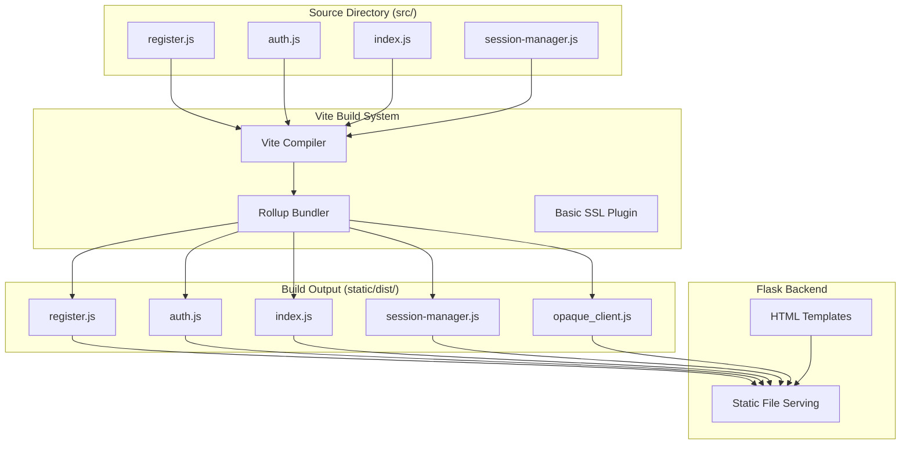
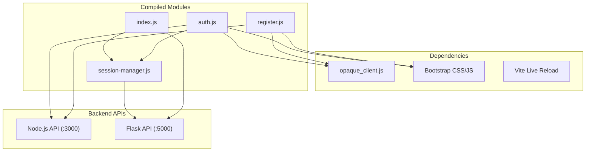
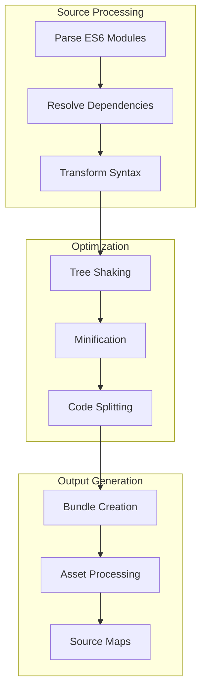

# Build System and Assets

> **Relevant source files**
> * [back-end/static/dist/auth.js](https://github.com/RogueElectron/Cypher/blob/7b7a1583/back-end/static/dist/auth.js)
> * [back-end/static/dist/register.js](https://github.com/RogueElectron/Cypher/blob/7b7a1583/back-end/static/dist/register.js)
> * [back-end/vite.config.js](https://github.com/RogueElectron/Cypher/blob/7b7a1583/back-end/vite.config.js)

This document covers the frontend build system for the Cypher authentication platform, including asset compilation, module bundling, and the relationship between source files and build artifacts. The build system uses Vite to compile client-side JavaScript modules into optimized bundles for production deployment.

For information about backend service configuration and deployment, see [Setup and Dependencies](/RogueElectron/Cypher/5.2-setup-and-dependencies). For details about the client-side component architecture, see [Frontend Components](/RogueElectron/Cypher/2.2-frontend-components).

## Build Configuration

The Cypher system uses Vite as its primary build tool for compiling and bundling frontend JavaScript modules. The build configuration is defined in [back-end/vite.config.js L1-L35](https://github.com/RogueElectron/Cypher/blob/7b7a1583/back-end/vite.config.js#L1-L35)

 which establishes the compilation pipeline for all client-side assets.

### Build Input and Output Mapping

The build system processes four main entry points from the source directory and outputs corresponding compiled modules:

| Source File | Build Output | Purpose |
| --- | --- | --- |
| `src/register.js` | `static/dist/register.js` | User registration workflow |
| `src/auth.js` | `static/dist/auth.js` | Login authentication flow |
| `src/index.js` | `static/dist/index.js` | Main application logic |
| `src/session-manager.js` | `static/dist/session-manager.js` | Session token management |

The build configuration specifies `outDir: 'static/dist'` [back-end/vite.config.js L9](https://github.com/RogueElectron/Cypher/blob/7b7a1583/back-end/vite.config.js#L9-L9)

 as the output directory, with `emptyOutDir: true` [back-end/vite.config.js L10](https://github.com/RogueElectron/Cypher/blob/7b7a1583/back-end/vite.config.js#L10-L10)

 to ensure clean builds.

**Build Flow Architecture**



Sources: [back-end/vite.config.js L11-L23](https://github.com/RogueElectron/Cypher/blob/7b7a1583/back-end/vite.config.js#L11-L23)

## Asset Compilation Process

### Module Bundling Configuration

The build system uses Rollup options [back-end/vite.config.js L11-L23](https://github.com/RogueElectron/Cypher/blob/7b7a1583/back-end/vite.config.js#L11-L23)

 to control how modules are bundled and named. The configuration specifies:

* `entryFileNames: '[name].js'` [back-end/vite.config.js L19](https://github.com/RogueElectron/Cypher/blob/7b7a1583/back-end/vite.config.js#L19-L19)  - Preserves original entry point names
* `chunkFileNames: '[name].js'` [back-end/vite.config.js L20](https://github.com/RogueElectron/Cypher/blob/7b7a1583/back-end/vite.config.js#L20-L20)  - Names dynamic import chunks
* `assetFileNames: '[name].[ext]'` [back-end/vite.config.js L21](https://github.com/RogueElectron/Cypher/blob/7b7a1583/back-end/vite.config.js#L21-L21)  - Handles CSS and other assets

### OPAQUE Client Integration

The compiled modules demonstrate sophisticated dependency management, particularly for the OPAQUE cryptographic library. Both built files import OPAQUE functionality:

```
import{g as F,O as x,a as $,K as B}from"./opaque_client.js"
```

This import pattern shows how Vite processes and optimizes the OPAQUE protocol implementation, creating minified variable names while preserving functionality.

**Module Dependency Graph**



Sources: [back-end/static/dist/auth.js L1](https://github.com/RogueElectron/Cypher/blob/7b7a1583/back-end/static/dist/auth.js#L1-L1)

 [back-end/static/dist/register.js L1](https://github.com/RogueElectron/Cypher/blob/7b7a1583/back-end/static/dist/register.js#L1-L1)

## Development Server Configuration

### SSL and Proxy Setup

The Vite development server includes SSL support through the `basicSsl()` plugin [back-end/vite.config.js L6](https://github.com/RogueElectron/Cypher/blob/7b7a1583/back-end/vite.config.js#L6-L6)

 and configures a proxy for API routes [back-end/vite.config.js L27-L34](https://github.com/RogueElectron/Cypher/blob/7b7a1583/back-end/vite.config.js#L27-L34)

:

```yaml
proxy: {
  '/api': {
    target: 'http://localhost:5000',
    changeOrigin: true,
    secure: false
  }
}
```

This configuration ensures that `/api` requests from the development frontend are proxied to the Flask backend service running on port 5000, while maintaining HTTPS for the frontend development server.

### Build Artifacts Analysis

The compiled JavaScript files demonstrate several build optimizations:

1. **Module Minification**: Variable names are shortened (`F`, `x`, `$`, `B` for OPAQUE functions)
2. **Tree Shaking**: Only used OPAQUE functions are imported
3. **Code Splitting**: Dynamic imports for session management functionality
4. **Asset Optimization**: CSS and static assets are processed with consistent naming

The auth.js build artifact [back-end/static/dist/auth.js L1-L24](https://github.com/RogueElectron/Cypher/blob/7b7a1583/back-end/static/dist/auth.js#L1-L24)

 shows how Vite processes complex authentication workflows, including live visualization steps and OPAQUE protocol integration, into optimized production code.

**Build Optimization Pipeline**



Sources: [back-end/vite.config.js L8-L24](https://github.com/RogueElectron/Cypher/blob/7b7a1583/back-end/vite.config.js#L8-L24)

 [back-end/static/dist/auth.js L1-L24](https://github.com/RogueElectron/Cypher/blob/7b7a1583/back-end/static/dist/auth.js#L1-L24)

 [back-end/static/dist/register.js L1-L37](https://github.com/RogueElectron/Cypher/blob/7b7a1583/back-end/static/dist/register.js#L1-L37)

## Integration with Backend Services

The build system coordinates with both backend services through different mechanisms:

* **Flask Static Serving**: Built assets in `static/dist/` are served by Flask's static file handler
* **API Proxy**: Development server proxies `/api` routes to Flask on port 5000
* **Direct API Calls**: Compiled JavaScript makes direct calls to Node.js API on port 3000

This architecture ensures that the frontend build artifacts can communicate with both the session management service (Flask) and the cryptographic operations service (Node.js) regardless of deployment environment.

Sources: [back-end/vite.config.js L27-L34](https://github.com/RogueElectron/Cypher/blob/7b7a1583/back-end/vite.config.js#L27-L34)

 [back-end/static/dist/auth.js L1-L24](https://github.com/RogueElectron/Cypher/blob/7b7a1583/back-end/static/dist/auth.js#L1-L24)