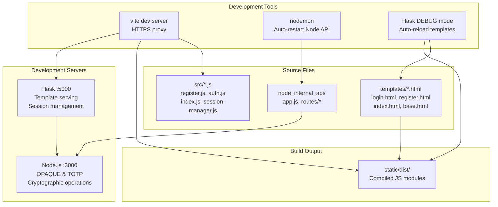
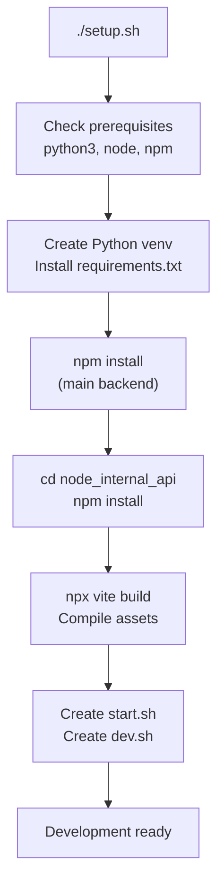
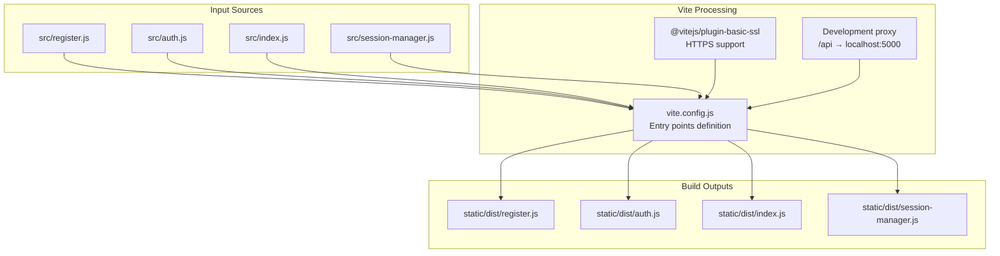
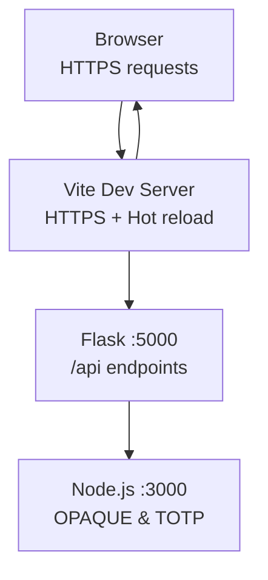

# Development Guide

> **Relevant source files**
> * [back-end/setup.sh](https://github.com/RogueElectron/Cypher/blob/7b7a1583/back-end/setup.sh)
> * [back-end/vite.config.js](https://github.com/RogueElectron/Cypher/blob/7b7a1583/back-end/vite.config.js)

This guide provides comprehensive information for developers working on the Cypher authentication system. It covers development environment setup, build processes, and development workflows.

For detailed information about the build system and asset compilation, see [Build System and Assets](/RogueElectron/Cypher/5.1-build-system-and-assets). For comprehensive setup instructions and dependency management, see [Setup and Dependencies](/RogueElectron/Cypher/5.2-setup-and-dependencies).

## Development Environment Overview

The Cypher development environment consists of multiple coordinated services and build processes. The system uses a dual-backend architecture with separate development workflows for the Flask session service and Node.js internal API.

### Development Architecture

Sources: [back-end/vite.config.js L1-L35](https://github.com/RogueElectron/Cypher/blob/7b7a1583/back-end/vite.config.js#L1-L35)

 [back-end/setup.sh L78-L91](https://github.com/RogueElectron/Cypher/blob/7b7a1583/back-end/setup.sh#L78-L91)

## Quick Start Guide

The development environment provides automated setup and startup scripts for rapid development iteration.

### Setup Process

Sources: [back-end/setup.sh L1-L97](https://github.com/RogueElectron/Cypher/blob/7b7a1583/back-end/setup.sh#L1-L97)

### Startup Scripts

The setup process generates two startup scripts with different development modes:

| Script | Mode | Flask | Node.js | Use Case |
| --- | --- | --- | --- | --- |
| `dev.sh` | Development | `FLASK_DEBUG=1 python main.py` | `npx nodemon app.js` | Active development |
| `start.sh` | Production | `python main.py` | `node app.js` | Testing/demo |

Both scripts:

* Start Flask on `http://127.0.0.1:5000`
* Start Node.js API on `http://localhost:3000`
* Handle graceful shutdown with `Ctrl+C`

Sources: [back-end/setup.sh L63-L91](https://github.com/RogueElectron/Cypher/blob/7b7a1583/back-end/setup.sh#L63-L91)

## Build System Integration

The Vite build system handles frontend asset compilation and development server functionality. During development, it provides hot module replacement and API proxying.

### Build Configuration

Sources: [back-end/vite.config.js L1-L35](https://github.com/RogueElectron/Cypher/blob/7b7a1583/back-end/vite.config.js#L1-L35)

The `vite.config.js` defines four entry points corresponding to the main client-side modules:

* `register`: User registration workflow
* `auth`: Login authentication workflow
* `index`: Main application interface
* `session-manager`: Token lifecycle management

## Development Workflow

### File Structure for Development

The key development files are organized as follows:

| Directory | Purpose | Key Files |
| --- | --- | --- |
| `src/` | Frontend source modules | `register.js`, `auth.js`, `index.js`, `session-manager.js` |
| `templates/` | Jinja2 HTML templates | `login.html`, `register.html`, `index.html`, `base.html` |
| `node_internal_api/` | Node.js cryptographic API | `app.js`, route handlers |
| `static/dist/` | Compiled frontend assets | Generated by Vite build |

### Development Server Configuration

The development environment uses HTTPS with SSL certificates and API proxying:

Sources: [back-end/vite.config.js L25-L34](https://github.com/RogueElectron/Cypher/blob/7b7a1583/back-end/vite.config.js#L25-L34)

The `server.proxy` configuration in `vite.config.js` routes `/api` requests to the Flask service running on port 5000, enabling seamless development without CORS issues.

### Dependencies and Prerequisites

The system requires specific runtime dependencies that are checked during setup:

* **Python 3**: For Flask session service and PASETO token handling
* **Node.js**: For cryptographic operations and OPAQUE protocol implementation
* **npm**: For JavaScript dependency management

Dependencies are managed in two separate `package.json` files:

* Root level: Vite build system and frontend dependencies
* `node_internal_api/`: Cryptographic libraries and Node.js API dependencies

Sources: [back-end/setup.sh L23-L39](https://github.com/RogueElectron/Cypher/blob/7b7a1583/back-end/setup.sh#L23-L39)