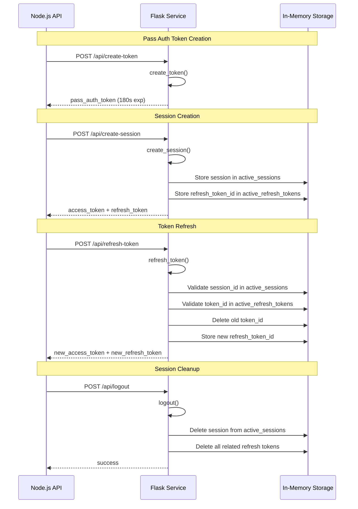
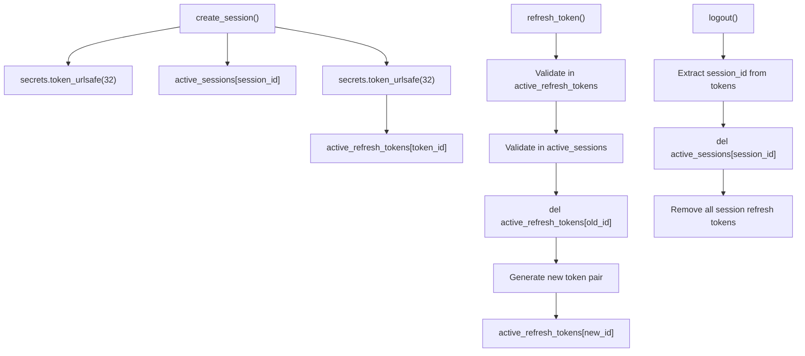

# Flask Session Service

> **Relevant source files**
> * [back-end/main.py](https://github.com/RogueElectron/Cypher/blob/7b7a1583/back-end/main.py)
> * [back-end/requirements.txt](https://github.com/RogueElectron/Cypher/blob/7b7a1583/back-end/requirements.txt)

## Purpose and Scope

This document covers the technical implementation of the Flask service that manages PASETO tokens, session lifecycle, and user authentication state in the Cypher authentication system. The Flask service operates on port 5000 and serves as the session management backend, complementing the Node.js Internal API which handles cryptographic operations.

For information about the Node.js cryptographic service, see [4.1](/RogueElectron/Cypher/4.1-node.js-internal-api). For details about client-side session handling, see [4.3](/RogueElectron/Cypher/4.3-client-side-components).

## Service Architecture

The Flask session service implements a stateful session management system using PASETO tokens and in-memory storage. The service maintains three distinct cryptographic keys and two storage dictionaries to track active sessions and refresh tokens.

### Core Components Architecture

```mermaid
flowchart TD

FlaskApp["Flask Application (main.py)"]
TemplateRoutes["Template Routes"]
APIRoutes["API Routes"]
TokenManager["Token Management System"]
SessionStore["Session Storage"]
IndexRoute["/"]
LoginRoute["/api/login"]
RegisterRoute["/api/register"]
TOTPRoute["/api/totp"]
CreateToken["/api/create-token"]
VerifyToken["/api/verify-token"]
CreateSession["/api/create-session"]
RefreshToken["/api/refresh-token"]
VerifyAccess["/api/verify-access"]
Logout["/api/logout"]
PasetoKeys["PASETO Keys"]
TokenValidation["Token Validation"]
TokenCreation["Token Creation"]
key["key (SymmetricKey)"]
session_key["session_key (SymmetricKey)"]
refresh_key["refresh_key (SymmetricKey)"]
active_sessions["active_sessions (dict)"]
active_refresh_tokens["active_refresh_tokens (dict)"]

FlaskApp --> TemplateRoutes
FlaskApp --> APIRoutes
FlaskApp --> TokenManager
FlaskApp --> SessionStore
TemplateRoutes --> IndexRoute
TemplateRoutes --> LoginRoute
TemplateRoutes --> RegisterRoute
TemplateRoutes --> TOTPRoute
APIRoutes --> CreateToken
APIRoutes --> VerifyToken
APIRoutes --> CreateSession
APIRoutes --> RefreshToken
APIRoutes --> VerifyAccess
APIRoutes --> Logout
TokenManager --> PasetoKeys
TokenManager --> TokenValidation
TokenManager --> TokenCreation
PasetoKeys --> key
PasetoKeys --> session_key
PasetoKeys --> refresh_key
SessionStore --> active_sessions
SessionStore --> active_refresh_tokens
```



Sources: [back-end/main.py L1-L337](https://github.com/RogueElectron/Cypher/blob/7b7a1583/back-end/main.py#L1-L337)

## PASETO Token Management

The service implements a three-tier PASETO token system with distinct purposes and lifespans:

| Token Type | Key Used | Purpose | Lifespan | Storage |
| --- | --- | --- | --- | --- |
| Pass Auth Token | `key` | Temporary authentication bridge | 180 seconds | Not stored |
| Access Token | `session_key` | Active session access | 900 seconds (15 minutes) | Not stored |
| Refresh Token | `refresh_key` | Session renewal | 2,592,000 seconds (30 days) | `active_refresh_tokens` |

### Token Lifecycle Flow



Sources: [back-end/main.py L36-L56](https://github.com/RogueElectron/Cypher/blob/7b7a1583/back-end/main.py#L36-L56)

 [back-end/main.py L94-L151](https://github.com/RogueElectron/Cypher/blob/7b7a1583/back-end/main.py#L94-L151)

 [back-end/main.py L153-L239](https://github.com/RogueElectron/Cypher/blob/7b7a1583/back-end/main.py#L153-L239)

 [back-end/main.py L283-L334](https://github.com/RogueElectron/Cypher/blob/7b7a1583/back-end/main.py#L283-L334)

## API Endpoints

The Flask service exposes eight endpoints divided into template serving and session management functions:

### Template Routes

| Route | Function | Purpose |
| --- | --- | --- |
| `/` | `serve_index()` | Serves `index.html` template |
| `/api/login` | `serve_login()` | Serves `login.html` template |
| `/api/register` | `serve_register()` | Serves `register.html` template |
| `/api/totp` | `serve_totp()` | Serves `totp.html` template |

### Session Management API

#### Token Creation and Validation

**`POST /api/create-token`** - Creates temporary pass authentication tokens

* Input: `username`
* Creates PASETO token with `pass_authed: True` claim
* Token expires in 180 seconds
* Used as bridge between OPAQUE auth and TOTP verification

**`POST /api/verify-token`** - Validates pass authentication tokens

* Input: `token`, `username`
* Verifies token signature and expiration
* Validates `pass_authed` claim and username match
* Returns token validity and claims

#### Session Management

**`POST /api/create-session`** - Establishes user sessions

* Input: `username`
* Generates unique `session_id` using `secrets.token_urlsafe(32)`
* Creates access token (900s expiration) and refresh token (30 days)
* Stores session metadata in `active_sessions`
* Stores refresh token ID in `active_refresh_tokens`

**`POST /api/refresh-token`** - Refreshes expired access tokens

* Input: `refresh_token`
* Validates refresh token and session existence
* Revokes old refresh token and creates new token pair
* Implements token rotation security pattern

**`POST /api/verify-access`** - Validates access tokens

* Input: `access_token`
* Verifies token and associated session validity
* Returns user information if valid

**`POST /api/logout`** - Terminates user sessions

* Input: `access_token`, `refresh_token` (optional)
* Cleans up session from `active_sessions`
* Removes all associated refresh tokens

Sources: [back-end/main.py L20-L34](https://github.com/RogueElectron/Cypher/blob/7b7a1583/back-end/main.py#L20-L34)

 [back-end/main.py L36-L92](https://github.com/RogueElectron/Cypher/blob/7b7a1583/back-end/main.py#L36-L92)

 [back-end/main.py L94-L151](https://github.com/RogueElectron/Cypher/blob/7b7a1583/back-end/main.py#L94-L151)

 [back-end/main.py L153-L239](https://github.com/RogueElectron/Cypher/blob/7b7a1583/back-end/main.py#L153-L239)

 [back-end/main.py L241-L281](https://github.com/RogueElectron/Cypher/blob/7b7a1583/back-end/main.py#L241-L281)

 [back-end/main.py L283-L334](https://github.com/RogueElectron/Cypher/blob/7b7a1583/back-end/main.py#L283-L334)

## Session Lifecycle Management

The service implements comprehensive session tracking with two-level validation:

### Session Data Structure

```css
# active_sessions structure
{
    session_id: {
        'username': str,
        'created_at': float,  # timestamp
        'last_refresh': float  # timestamp
    }
}

# active_refresh_tokens structure  
{
    refresh_token_id: {
        'username': str,
        'session_id': str
    }
}
```

### Session Security Model



Sources: [back-end/main.py L94-L151](https://github.com/RogueElectron/Cypher/blob/7b7a1583/back-end/main.py#L94-L151)

 [back-end/main.py L153-L239](https://github.com/RogueElectron/Cypher/blob/7b7a1583/back-end/main.py#L153-L239)

 [back-end/main.py L283-L334](https://github.com/RogueElectron/Cypher/blob/7b7a1583/back-end/main.py#L283-L334)

## In-Memory Storage

The Flask service uses two dictionaries for session state management:

### Active Sessions Storage

The `active_sessions` dictionary tracks established user sessions:

* **Key**: `session_id` (32-byte URL-safe string)
* **Value**: Session metadata including username, creation time, and last refresh timestamp
* **Purpose**: Validates that access and refresh tokens belong to active sessions
* **Cleanup**: Removed during logout or when all refresh tokens for a session are revoked

### Active Refresh Tokens Storage

The `active_refresh_tokens` dictionary implements refresh token tracking:

* **Key**: `refresh_token_id` (32-byte URL-safe string from token claims)
* **Value**: Token metadata linking to username and session
* **Purpose**: Prevents refresh token reuse and enables token revocation
* **Cleanup**: Individual tokens removed during refresh; all session tokens removed during logout

### Storage Limitations

The current implementation uses in-memory storage with these characteristics:

* **Persistence**: All session data lost on service restart
* **Scalability**: Limited to single Flask instance memory
* **Cleanup**: No automatic cleanup of expired sessions (relies on token expiration)

Sources: [back-end/main.py L17-L18](https://github.com/RogueElectron/Cypher/blob/7b7a1583/back-end/main.py#L17-L18)

 [back-end/main.py L135-L144](https://github.com/RogueElectron/Cypher/blob/7b7a1583/back-end/main.py#L135-L144)

 [back-end/main.py L180-L229](https://github.com/RogueElectron/Cypher/blob/7b7a1583/back-end/main.py#L180-L229)

 [back-end/main.py L320-L329](https://github.com/RogueElectron/Cypher/blob/7b7a1583/back-end/main.py#L320-L329)