# Frontend Components

> **Relevant source files**
> * [back-end/src/auth.js](https://github.com/RogueElectron/Cypher/blob/7b7a1583/back-end/src/auth.js)
> * [back-end/src/index.js](https://github.com/RogueElectron/Cypher/blob/7b7a1583/back-end/src/index.js)
> * [back-end/src/register.js](https://github.com/RogueElectron/Cypher/blob/7b7a1583/back-end/src/register.js)
> * [back-end/src/session-manager.js](https://github.com/RogueElectron/Cypher/blob/7b7a1583/back-end/src/session-manager.js)
> * [back-end/static/dist/index.js](https://github.com/RogueElectron/Cypher/blob/7b7a1583/back-end/static/dist/index.js)
> * [back-end/static/dist/session-manager.js](https://github.com/RogueElectron/Cypher/blob/7b7a1583/back-end/static/dist/session-manager.js)

This document covers the client-side JavaScript architecture of the Cypher authentication system, including authentication logic, session management, live visualization components, and user interface controllers. For information about the backend services that these components interact with, see [Backend Services](/RogueElectron/Cypher/documentation/2.1-backend-services). For details about the build system and asset compilation, see [Build System and Assets](/RogueElectron/Cypher/documentation/5.1-build-system-and-assets).

## Architecture Overview

The frontend is organized into four main JavaScript modules that handle different aspects of the user experience. Each module is compiled by Vite into optimized bundles served to the browser.

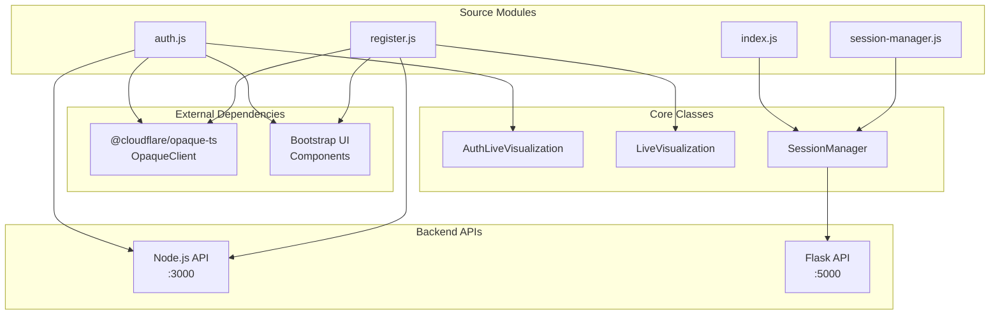

Sources: [back-end/src/auth.js L1-L475](https://github.com/RogueElectron/Cypher/blob/7b7a1583/back-end/src/auth.js#L1-L475)

 [back-end/src/register.js L1-L500](https://github.com/RogueElectron/Cypher/blob/7b7a1583/back-end/src/register.js#L1-L500)

 [back-end/src/index.js L1-L142](https://github.com/RogueElectron/Cypher/blob/7b7a1583/back-end/src/index.js#L1-L142)

 [back-end/src/session-manager.js L1-L230](https://github.com/RogueElectron/Cypher/blob/7b7a1583/back-end/src/session-manager.js#L1-L230)

## Authentication Components

### AuthLiveVisualization Class

The `AuthLiveVisualization` class provides real-time visual feedback during the OPAQUE authentication process. It manages a predefined sequence of authentication steps and updates the UI to show progress.

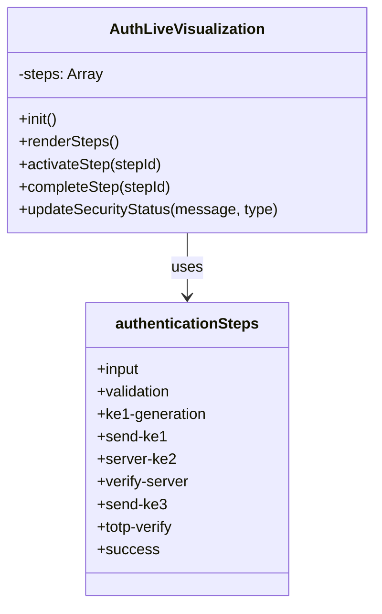

The class manages nine distinct steps in the authentication workflow [back-end/src/auth.js L19-L83](https://github.com/RogueElectron/Cypher/blob/7b7a1583/back-end/src/auth.js#L19-L83)

:

| Step ID | Title | Description |
| --- | --- | --- |
| `input` | Password Input | Local password entry without transmission |
| `validation` | Input Validation | Client-side credential validation |
| `ke1-generation` | Generate KE1 | OPAQUE key exchange message creation |
| `send-ke1` | Send Authentication Request | KE1 transmission to server |
| `server-ke2` | Server Response | Server KE2 message processing |
| `verify-server` | Verify Server | Server authentication and session key generation |
| `send-ke3` | Send Authentication Proof | KE3 proof transmission |
| `totp-verify` | 2FA Verification | TOTP code validation |
| `success` | Authentication Complete | Successful authentication confirmation |

Sources: [back-end/src/auth.js L86-L153](https://github.com/RogueElectron/Cypher/blob/7b7a1583/back-end/src/auth.js#L86-L153)

 [back-end/src/auth.js L19-L83](https://github.com/RogueElectron/Cypher/blob/7b7a1583/back-end/src/auth.js#L19-L83)

### OPAQUE Authentication Flow

The authentication process integrates the OPAQUE protocol through the `@cloudflare/opaque-ts` library. The flow coordinates between client-side cryptographic operations and server communication.

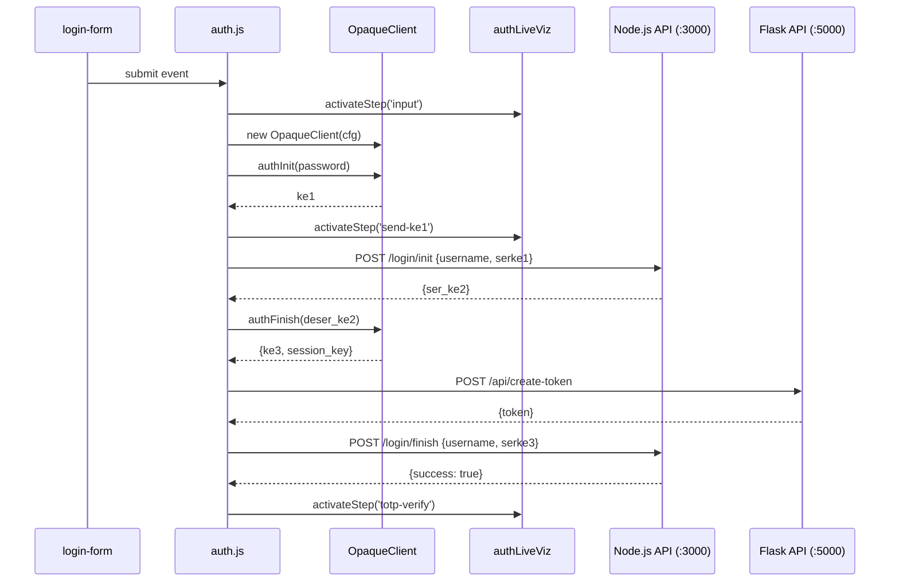

Sources: [back-end/src/auth.js L240-L361](https://github.com/RogueElectron/Cypher/blob/7b7a1583/back-end/src/auth.js#L240-L361)

 [back-end/src/auth.js L245-L247](https://github.com/RogueElectron/Cypher/blob/7b7a1583/back-end/src/auth.js#L245-L247)

 [back-end/src/auth.js L254-L264](https://github.com/RogueElectron/Cypher/blob/7b7a1583/back-end/src/auth.js#L254-L264)

### TOTP Integration

The authentication component handles Two-Factor Authentication (TOTP) verification as the final step in the login process. After successful OPAQUE authentication, users must provide a time-based code.

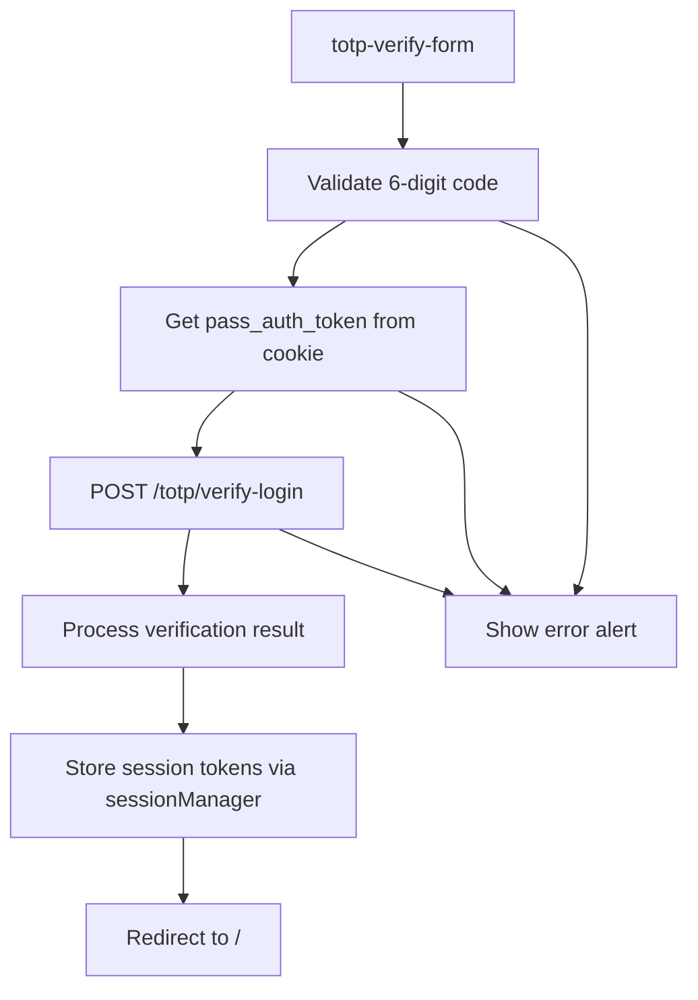

Sources: [back-end/src/auth.js L381-L463](https://github.com/RogueElectron/Cypher/blob/7b7a1583/back-end/src/auth.js#L381-L463)

 [back-end/src/auth.js L415-L426](https://github.com/RogueElectron/Cypher/blob/7b7a1583/back-end/src/auth.js#L415-L426)

 [back-end/src/auth.js L441-L451](https://github.com/RogueElectron/Cypher/blob/7b7a1583/back-end/src/auth.js#L441-L451)

## Registration Components

### LiveVisualization Class

The registration process uses a separate `LiveVisualization` class that follows the same pattern as authentication but handles the registration workflow steps.

```mermaid
flowchart TD

input["input<br>Password Input"]
validation["validation<br>Input Validation"]
generateKeys["generate-keys<br>Generate Keys"]
regRequest["registration-request<br>Registration Request"]
serverResponse["server-response<br>Server Response"]
finalize["finalize<br>Finalize Registration"]
totpSetup["totp-setup<br>2FA Setup"]
totpVerify["totp-verify<br>Verify 2FA"]
success["success<br>Registration Complete"]

subgraph subGraph0 ["Registration Steps"]
    input
    validation
    generateKeys
    regRequest
    serverResponse
    finalize
    totpSetup
    totpVerify
    success
    input --> validation
    validation --> generateKeys
    generateKeys --> regRequest
    regRequest --> serverResponse
    serverResponse --> finalize
    finalize --> totpSetup
    totpSetup --> totpVerify
    totpVerify --> success
end
```

The registration workflow includes OPAQUE protocol registration and mandatory TOTP setup [back-end/src/register.js L12-L76](https://github.com/RogueElectron/Cypher/blob/7b7a1583/back-end/src/register.js#L12-L76)

Sources: [back-end/src/register.js L79-L146](https://github.com/RogueElectron/Cypher/blob/7b7a1583/back-end/src/register.js#L79-L146)

 [back-end/src/register.js L12-L76](https://github.com/RogueElectron/Cypher/blob/7b7a1583/back-end/src/register.js#L12-L76)

### OPAQUE Registration Integration

Registration uses the `OpaqueClient.registerInit()` and `OpaqueClient.registerFinish()` methods to implement the OPAQUE registration protocol.

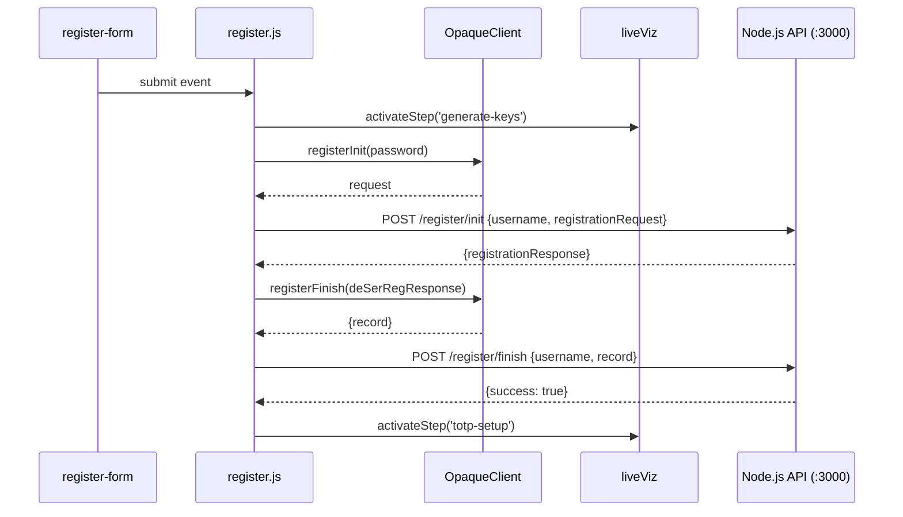

Sources: [back-end/src/register.js L260-L345](https://github.com/RogueElectron/Cypher/blob/7b7a1583/back-end/src/register.js#L260-L345)

 [back-end/src/register.js L265-L267](https://github.com/RogueElectron/Cypher/blob/7b7a1583/back-end/src/register.js#L265-L267)

 [back-end/src/register.js L274-L283](https://github.com/RogueElectron/Cypher/blob/7b7a1583/back-end/src/register.js#L274-L283)

### TOTP Setup Components

After successful OPAQUE registration, the system automatically initiates TOTP setup through the `generateTotpSecret()` function, which communicates with the Node.js API to create QR codes and secrets.

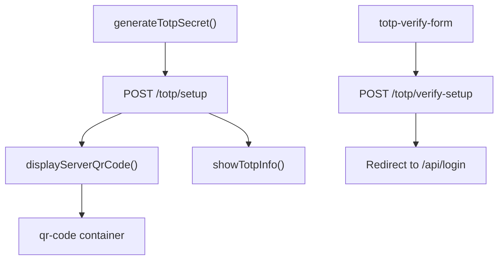

Sources: [back-end/src/register.js L357-L390](https://github.com/RogueElectron/Cypher/blob/7b7a1583/back-end/src/register.js#L357-L390)

 [back-end/src/register.js L392-L408](https://github.com/RogueElectron/Cypher/blob/7b7a1583/back-end/src/register.js#L392-L408)

 [back-end/src/register.js L416-L485](https://github.com/RogueElectron/Cypher/blob/7b7a1583/back-end/src/register.js#L416-L485)

## Session Management Component

### SessionManager Class

The `SessionManager` class handles the complete lifecycle of authentication tokens, including storage, refresh, and validation. It provides a centralized interface for managing user sessions across the application.

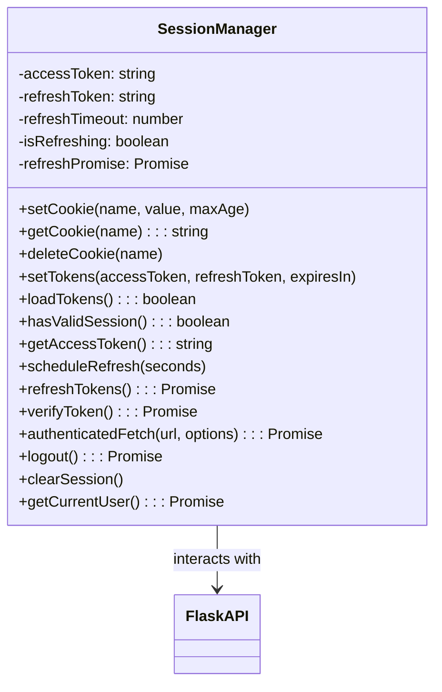

Sources: [back-end/src/session-manager.js L1-L221](https://github.com/RogueElectron/Cypher/blob/7b7a1583/back-end/src/session-manager.js#L1-L221)

### Token Lifecycle Management

The `SessionManager` implements automatic token refresh functionality that schedules refresh operations before token expiry and handles concurrent refresh attempts.

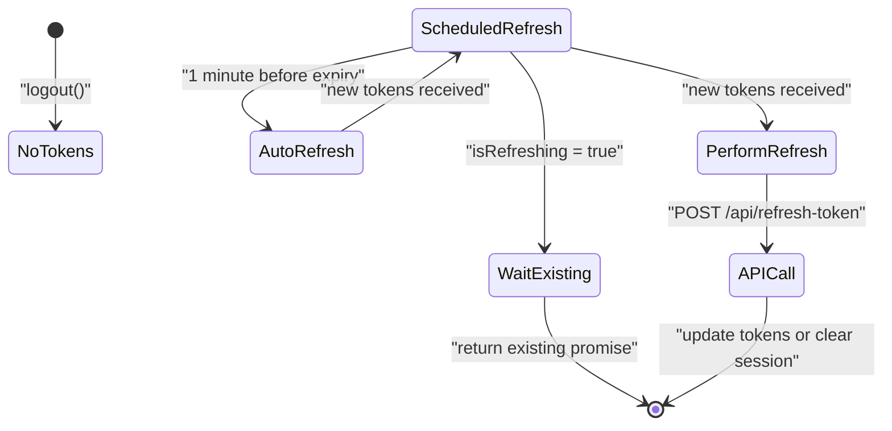

Sources: [back-end/src/session-manager.js L27-L38](https://github.com/RogueElectron/Cypher/blob/7b7a1583/back-end/src/session-manager.js#L27-L38)

 [back-end/src/session-manager.js L61-L69](https://github.com/RogueElectron/Cypher/blob/7b7a1583/back-end/src/session-manager.js#L61-L69)

 [back-end/src/session-manager.js L71-L121](https://github.com/RogueElectron/Cypher/blob/7b7a1583/back-end/src/session-manager.js#L71-L121)

### Authenticated Request Handling

The `authenticatedFetch()` method provides automatic token refresh for API requests that return 401 responses, ensuring seamless user experience.

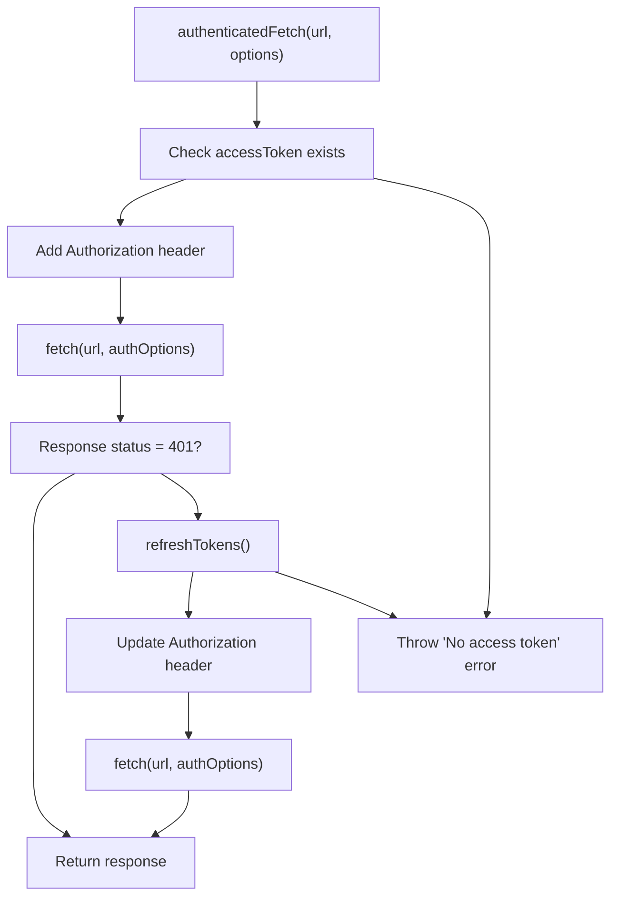

Sources: [back-end/src/session-manager.js L147-L174](https://github.com/RogueElectron/Cypher/blob/7b7a1583/back-end/src/session-manager.js#L147-L174)

## Home Page Component

### Dynamic UI Rendering

The `index.js` module manages the home page experience by checking authentication state and dynamically rendering appropriate content using the `SessionManager`.

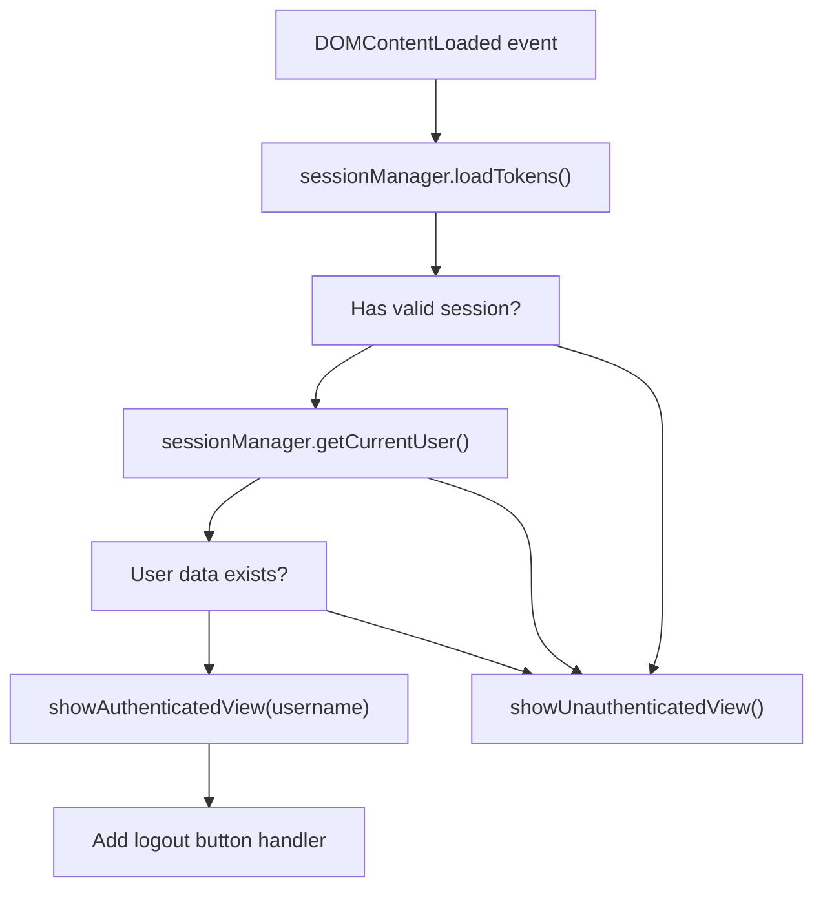

Sources: [back-end/src/index.js L3-L24](https://github.com/RogueElectron/Cypher/blob/7b7a1583/back-end/src/index.js#L3-L24)

 [back-end/src/index.js L26-L80](https://github.com/RogueElectron/Cypher/blob/7b7a1583/back-end/src/index.js#L26-L80)

 [back-end/src/index.js L82-L107](https://github.com/RogueElectron/Cypher/blob/7b7a1583/back-end/src/index.js#L82-L107)

### Logout Handling

The logout functionality integrates with the `SessionManager.logout()` method and provides visual feedback during the logout process.

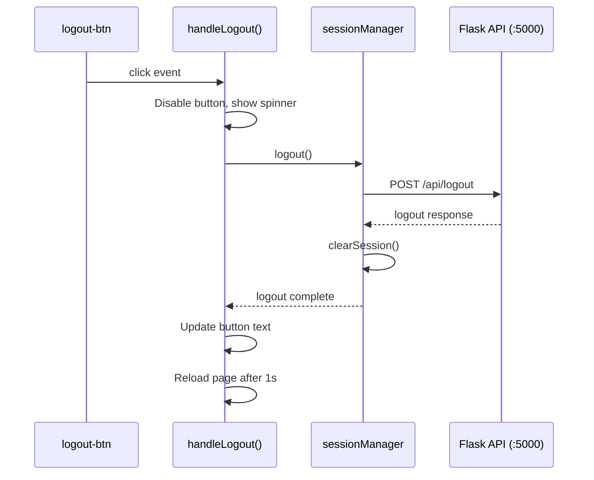

Sources: [back-end/src/index.js L109-L135](https://github.com/RogueElectron/Cypher/blob/7b7a1583/back-end/src/index.js#L109-L135)

 [back-end/src/session-manager.js L175-L191](https://github.com/RogueElectron/Cypher/blob/7b7a1583/back-end/src/session-manager.js#L175-L191)

## Utility Functions and UI Helpers

### Alert System

Both authentication and registration modules share common UI feedback patterns through utility functions that manage Bootstrap alert components.

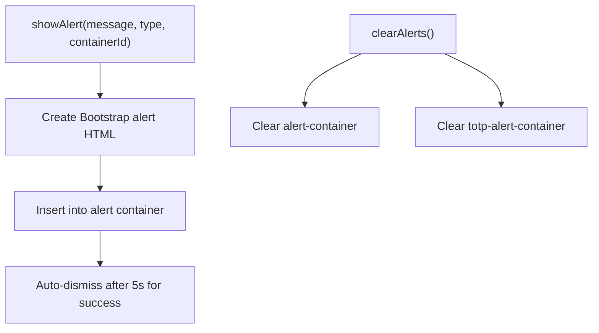

The `showAlert()` function accepts parameters for message content, alert type (`success` or `error`), and target container ID [back-end/src/auth.js L175-L198](https://github.com/RogueElectron/Cypher/blob/7b7a1583/back-end/src/auth.js#L175-L198)

 and [back-end/src/register.js L171-L197](https://github.com/RogueElectron/Cypher/blob/7b7a1583/back-end/src/register.js#L171-L197)

Sources: [back-end/src/auth.js L175-L198](https://github.com/RogueElectron/Cypher/blob/7b7a1583/back-end/src/auth.js#L175-L198)

 [back-end/src/register.js L171-L197](https://github.com/RogueElectron/Cypher/blob/7b7a1583/back-end/src/register.js#L171-L197)

 [back-end/src/auth.js L200-L203](https://github.com/RogueElectron/Cypher/blob/7b7a1583/back-end/src/auth.js#L200-L203)

 [back-end/src/register.js L199-L208](https://github.com/RogueElectron/Cypher/blob/7b7a1583/back-end/src/register.js#L199-L208)

### Input Validation and Formatting

Form inputs include client-side validation and formatting, particularly for TOTP codes which are restricted to 6-digit numeric input.

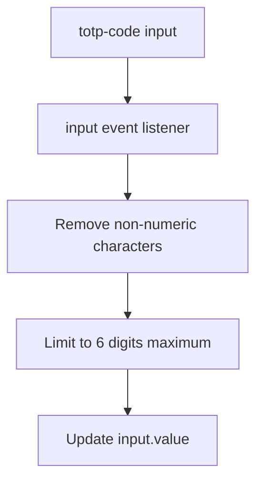

Sources: [back-end/src/auth.js L465-L473](https://github.com/RogueElectron/Cypher/blob/7b7a1583/back-end/src/auth.js#L465-L473)

 [back-end/src/register.js L488-L499](https://github.com/RogueElectron/Cypher/blob/7b7a1583/back-end/src/register.js#L488-L499)

## Build System Integration

The frontend components are processed by Vite and compiled into optimized bundles in the `back-end/static/dist/` directory. The compiled files maintain the same module structure but with minified code and optimized imports.

| Source Module | Compiled Output | Purpose |
| --- | --- | --- |
| `src/auth.js` | Not directly compiled | Loaded by HTML templates |
| `src/register.js` | Not directly compiled | Loaded by HTML templates |
| `src/index.js` | `dist/index.js` | Home page functionality |
| `src/session-manager.js` | `dist/session-manager.js` | Session management |

Sources: [back-end/static/dist/index.js L1-L74](https://github.com/RogueElectron/Cypher/blob/7b7a1583/back-end/static/dist/index.js#L1-L74)

 [back-end/static/dist/session-manager.js L1-L2](https://github.com/RogueElectron/Cypher/blob/7b7a1583/back-end/static/dist/session-manager.js#L1-L2)