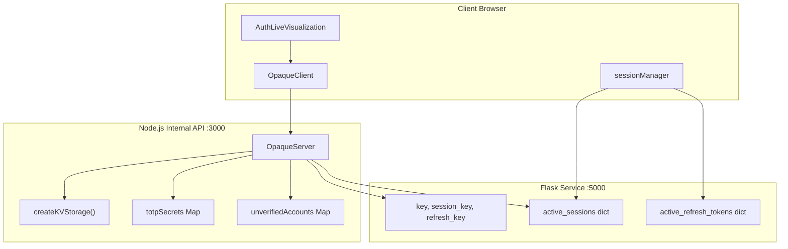
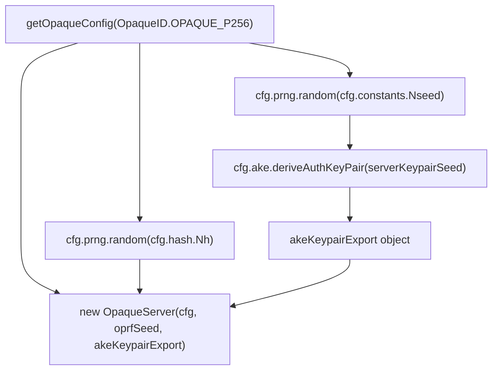
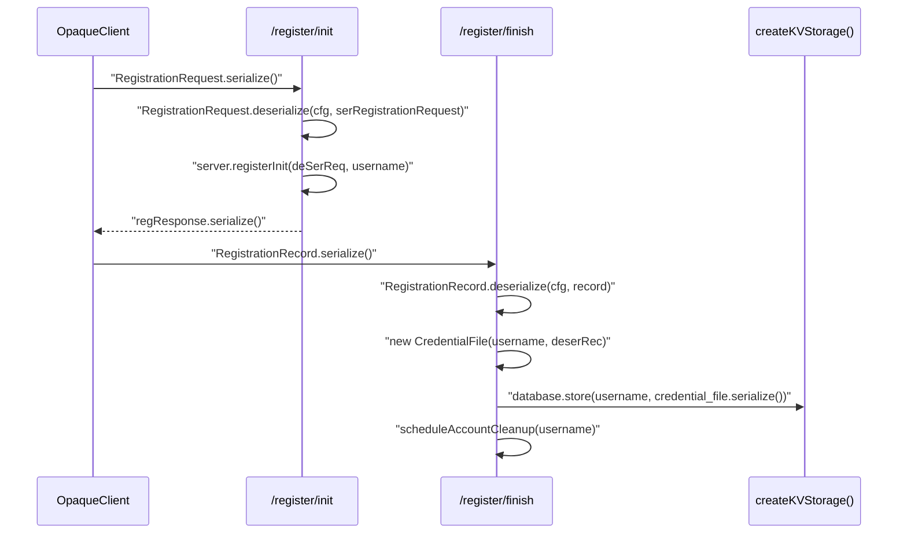
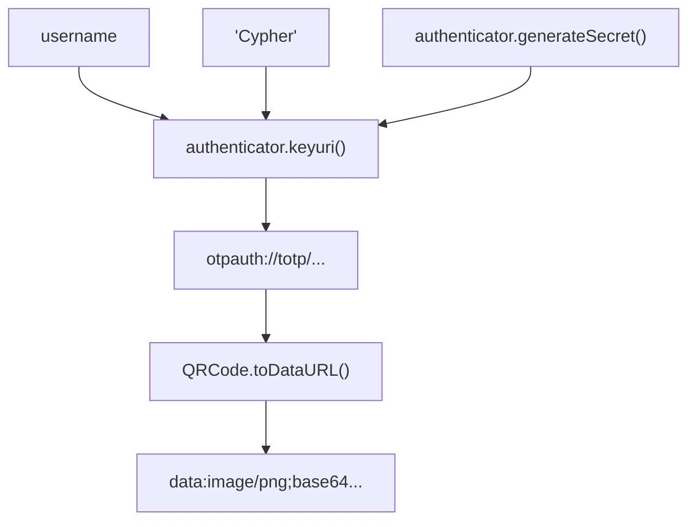
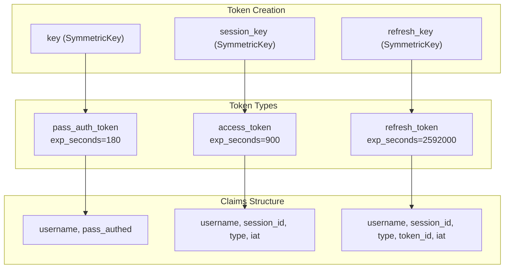
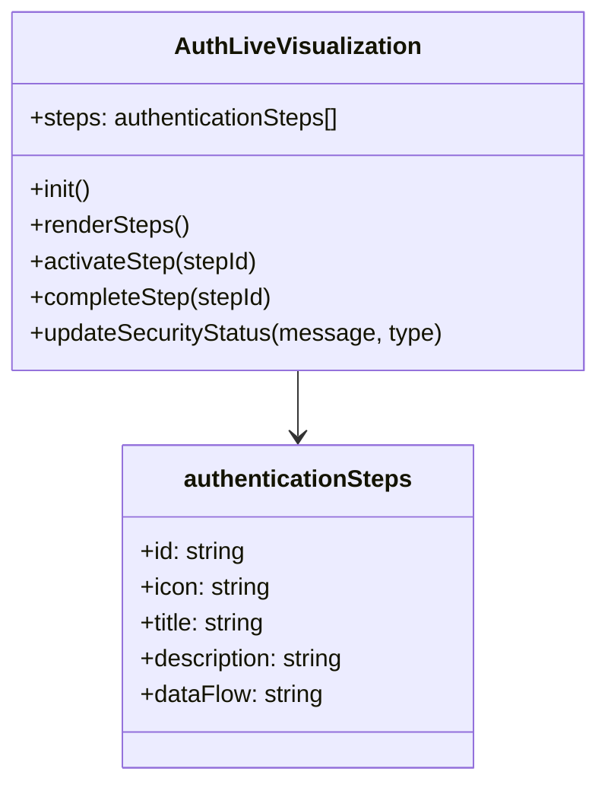
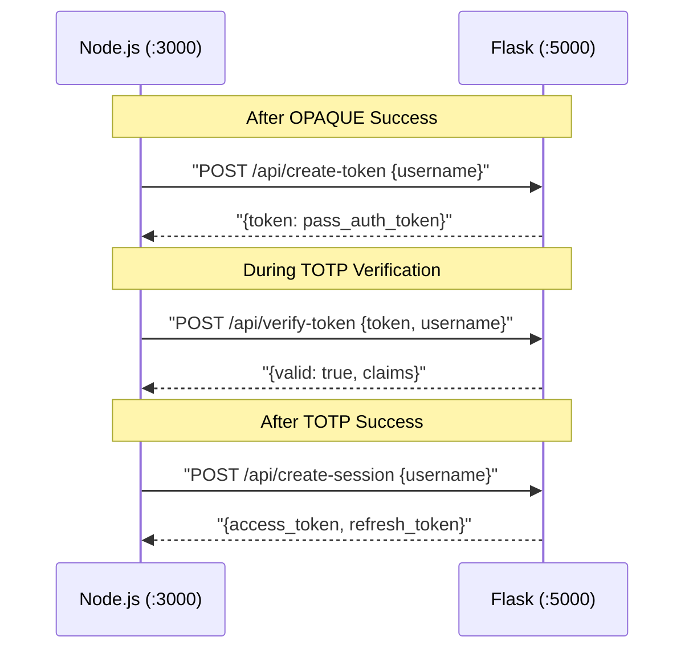

# Implementation Details

> **Relevant source files**
> * [back-end/main.py](https://github.com/RogueElectron/Cypher/blob/7b7a1583/back-end/main.py)
> * [back-end/node_internal_api/app.js](https://github.com/RogueElectron/Cypher/blob/7b7a1583/back-end/node_internal_api/app.js)
> * [back-end/src/auth.js](https://github.com/RogueElectron/Cypher/blob/7b7a1583/back-end/src/auth.js)

This document provides a technical deep dive into the implementation of each major component of the Cypher authentication system. It covers the core architectural patterns, data structures, and code entities that enable the zero-knowledge authentication flow.

For specific API documentation and endpoint details, see [Node.js Internal API](/RogueElectron/Cypher/4.1-node.js-internal-api) and [Flask Session Service](/RogueElectron/Cypher/4.2-flask-session-service). For frontend implementation specifics, see [Client-Side Components](/RogueElectron/Cypher/4.3-client-side-components).

## Core Architecture Implementation

The Cypher system implements a dual-backend architecture where cryptographic operations are isolated from session management. This separation enables specialized handling of OPAQUE protocol operations and PASETO token lifecycle management.

### Service Communication Pattern

**Sources:** [back-end/node_internal_api/app.js L1-L470](https://github.com/RogueElectron/Cypher/blob/7b7a1583/back-end/node_internal_api/app.js#L1-L470)

 [back-end/main.py L1-L339](https://github.com/RogueElectron/Cypher/blob/7b7a1583/back-end/main.py#L1-L339)

 [back-end/src/auth.js L1-L475](https://github.com/RogueElectron/Cypher/blob/7b7a1583/back-end/src/auth.js#L1-L475)

## Key Data Structures and Storage

### Node.js Storage Implementation

The Node.js service uses in-memory storage structures optimized for cryptographic operations:

| Storage Component | Type | Purpose | Key Methods |
| --- | --- | --- | --- |
| `database` | `createKVStorage()` | OPAQUE credentials | `store()`, `lookup()` |
| `totpSecrets` | `Map` | TOTP secrets per user | `set()`, `get()`, `delete()` |
| `unverifiedAccounts` | `Map` | Cleanup timeouts | `set()`, `has()`, `delete()` |
| `global.userSessions` | `Map` | OPAQUE expected values | `set()`, `get()`, `delete()` |

### Flask Storage Implementation

The Flask service manages token lifecycle with persistent session tracking:

| Storage Component | Type | Purpose | Cleanup Strategy |
| --- | --- | --- | --- |
| `active_sessions` | `dict` | Session metadata | Manual cleanup on logout |
| `active_refresh_tokens` | `dict` | Refresh token registry | Automatic cleanup on refresh |

**Sources:** [back-end/node_internal_api/app.js L45-L61](https://github.com/RogueElectron/Cypher/blob/7b7a1583/back-end/node_internal_api/app.js#L45-L61)

 [back-end/node_internal_api/app.js L79-L82](https://github.com/RogueElectron/Cypher/blob/7b7a1583/back-end/node_internal_api/app.js#L79-L82)

 [back-end/main.py L17-L18](https://github.com/RogueElectron/Cypher/blob/7b7a1583/back-end/main.py#L17-L18)

## OPAQUE Protocol Implementation

### Server-Side OPAQUE Configuration

The `OpaqueServer` instance is initialized with P-256 curve configuration and cryptographically secure random seeds for OPRF operations and AKE keypair generation.

**Sources:** [back-end/node_internal_api/app.js L74-L112](https://github.com/RogueElectron/Cypher/blob/7b7a1583/back-end/node_internal_api/app.js#L74-L112)

### Registration Flow Implementation

**Sources:** [back-end/node_internal_api/app.js L118-L192](https://github.com/RogueElectron/Cypher/blob/7b7a1583/back-end/node_internal_api/app.js#L118-L192)

## TOTP Implementation Details

### TOTP Secret Management

The system uses `otplib.authenticator` for TOTP operations with the following key functions:

* `authenticator.generateSecret()` - Creates base32-encoded secrets
* `authenticator.keyuri(username, service, secret)` - Generates otpauth:// URIs
* `authenticator.verify({token, secret, window})` - Validates TOTP codes with time window

### QR Code Generation Process

**Sources:** [back-end/node_internal_api/app.js L302-L334](https://github.com/RogueElectron/Cypher/blob/7b7a1583/back-end/node_internal_api/app.js#L302-L334)

## Token System Architecture

### PASETO Token Types and Keys

The Flask service implements three distinct token types using separate cryptographic keys:

**Sources:** [back-end/main.py L13-L15](https://github.com/RogueElectron/Cypher/blob/7b7a1583/back-end/main.py#L13-L15)

 [back-end/main.py L44-L56](https://github.com/RogueElectron/Cypher/blob/7b7a1583/back-end/main.py#L44-L56)

 [back-end/main.py L105-L133](https://github.com/RogueElectron/Cypher/blob/7b7a1583/back-end/main.py#L105-L133)

## Client-Side Authentication State Management

### Live Visualization System

The `AuthLiveVisualization` class provides real-time feedback during authentication flows:

The visualization tracks nine distinct steps from password input through 2FA completion, providing transparency into the zero-knowledge authentication process.

**Sources:** [back-end/src/auth.js L18-L153](https://github.com/RogueElectron/Cypher/blob/7b7a1583/back-end/src/auth.js#L18-L153)

### Session Token Management

Client-side token handling uses cookie storage with specific security attributes:

* `pass_auth_token` - `Max-Age=180; SameSite=Lax; Path=/`
* Session tokens managed via `sessionManager.setTokens()`
* Automatic cleanup of temporary tokens after session establishment

**Sources:** [back-end/src/auth.js L315-L451](https://github.com/RogueElectron/Cypher/blob/7b7a1583/back-end/src/auth.js#L315-L451)

## Inter-Service Communication Pattern

### Node.js to Flask API Calls

The Node.js service makes HTTP requests to Flask endpoints during authentication flows:

Each service maintains its specialized responsibilities while coordinating through well-defined API contracts.

**Sources:** [back-end/node_internal_api/app.js L256-L287](https://github.com/RogueElectron/Cypher/blob/7b7a1583/back-end/node_internal_api/app.js#L256-L287)

 [back-end/node_internal_api/app.js L376-L430](https://github.com/RogueElectron/Cypher/blob/7b7a1583/back-end/node_internal_api/app.js#L376-L430)

 [back-end/node_internal_api/app.js L421-L455](https://github.com/RogueElectron/Cypher/blob/7b7a1583/back-end/node_internal_api/app.js#L421-L455)

## Security Implementation Patterns

### Account Verification Timeout

The system implements automatic cleanup of unverified registrations:

* `VERIFICATION_TIMEOUT = 5 * 60 * 1000` (5 minutes)
* `scheduleAccountCleanup(username)` sets cleanup timeouts
* `unverifiedAccounts.has(username)` prevents premature cleanup
* Successful TOTP verification calls `clearTimeout()` and `unverifiedAccounts.delete()`

### CORS and Security Headers

Both services implement security hardening:

**Node.js Security:**

* `helmet()` with CSP configuration
* `xss-clean()` middleware
* CORS restricted to `localhost:5000`

**Flask Security:**

* CORS with `supports_credentials=True`
* Origin restrictions matching Node.js configuration

**Sources:** [back-end/node_internal_api/app.js L23-L70](https://github.com/RogueElectron/Cypher/blob/7b7a1583/back-end/node_internal_api/app.js#L23-L70)

 [back-end/node_internal_api/app.js L84-L101](https://github.com/RogueElectron/Cypher/blob/7b7a1583/back-end/node_internal_api/app.js#L84-L101)

 [back-end/main.py L11](https://github.com/RogueElectron/Cypher/blob/7b7a1583/back-end/main.py#L11-L11)