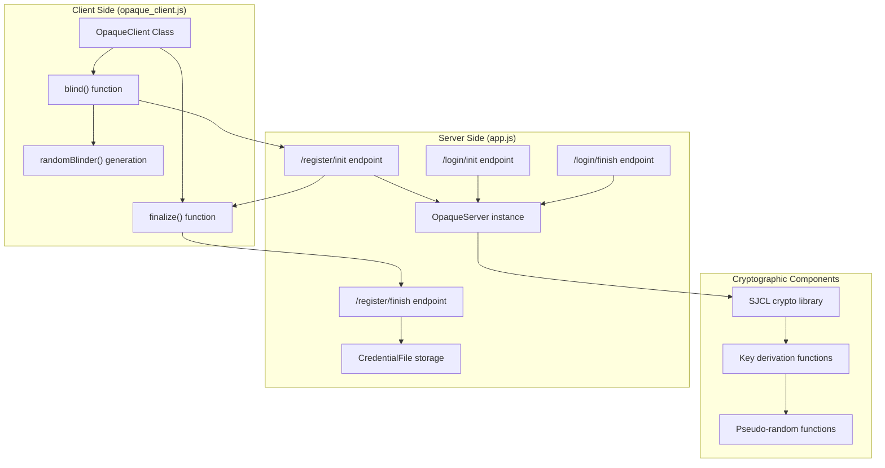
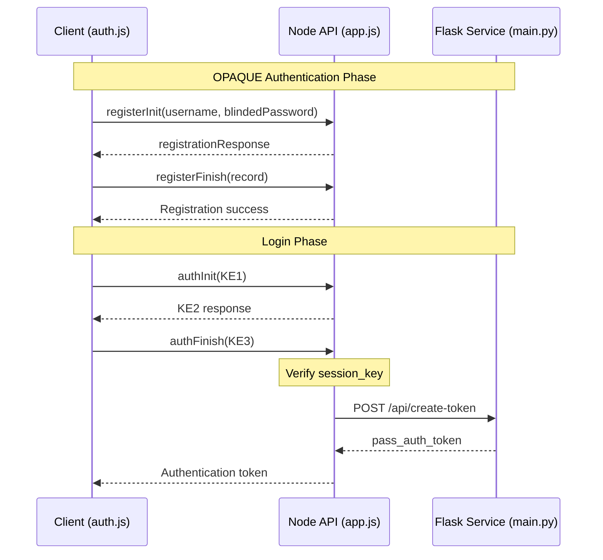
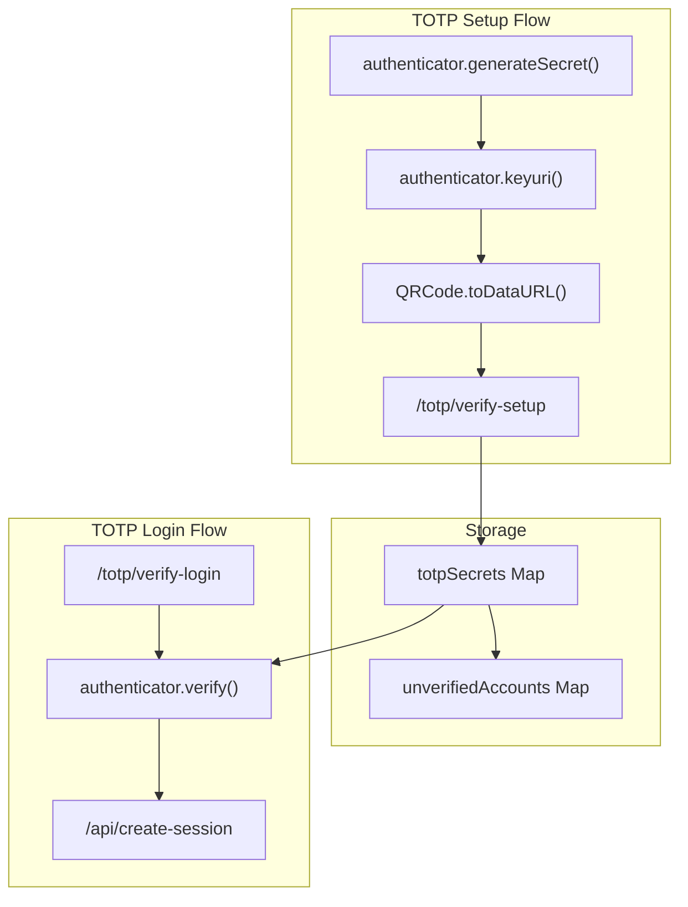
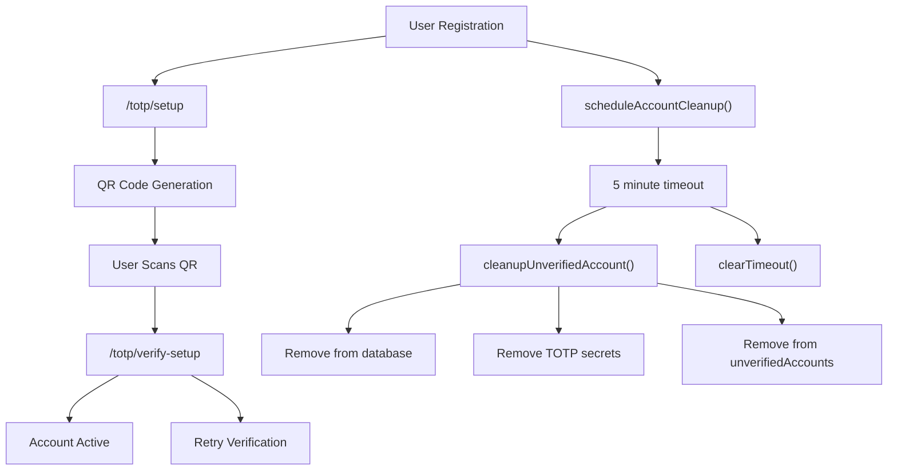
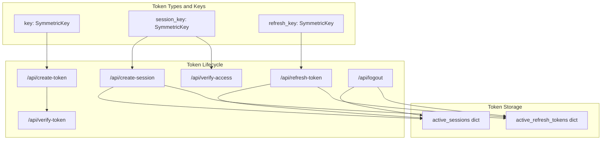
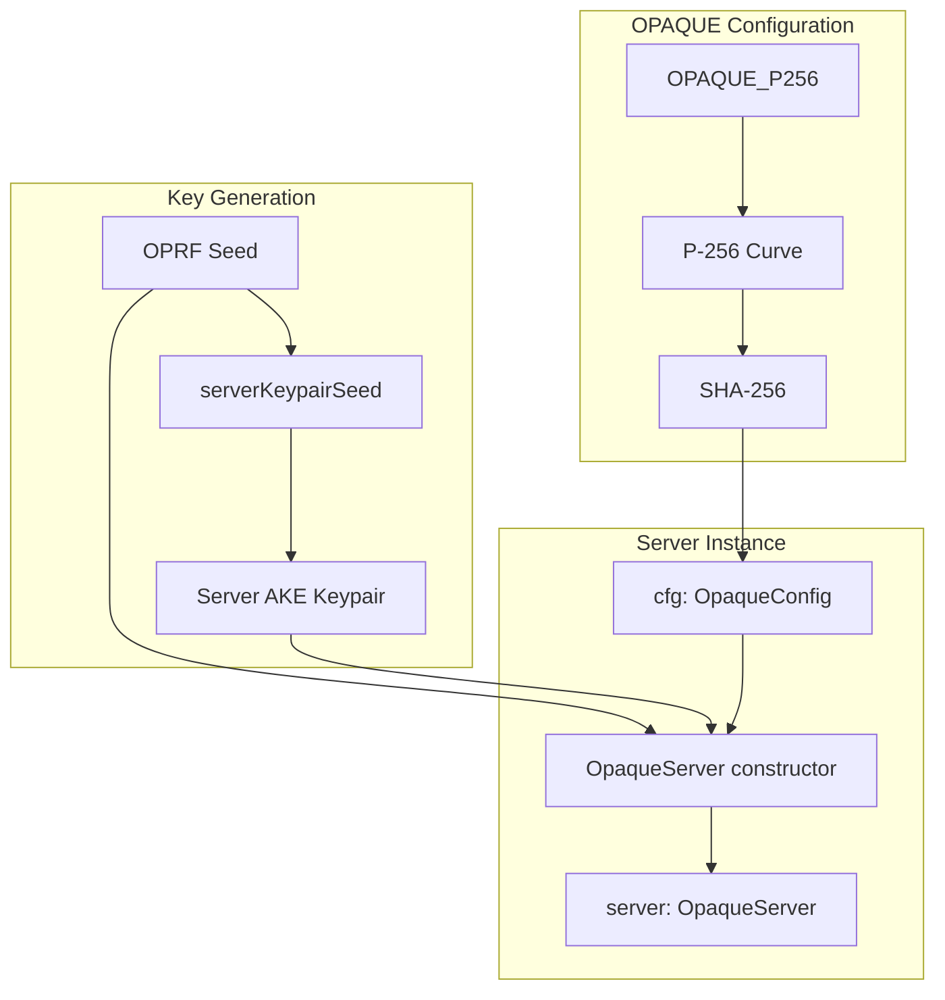
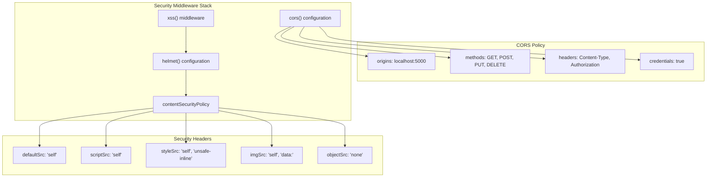
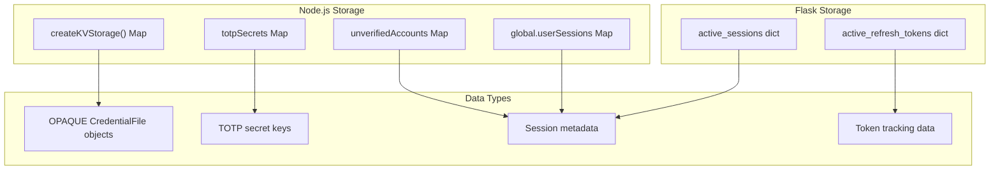

# Security Model

> **Relevant source files**
> * [back-end/main.py](https://github.com/RogueElectron/Cypher/blob/7b7a1583/back-end/main.py)
> * [back-end/node_internal_api/app.js](https://github.com/RogueElectron/Cypher/blob/7b7a1583/back-end/node_internal_api/app.js)
> * [back-end/static/dist/opaque_client.js](https://github.com/RogueElectron/Cypher/blob/7b7a1583/back-end/static/dist/opaque_client.js)

This document describes the cryptographic security architecture and authentication mechanisms implemented in the Cypher system. It covers the zero-knowledge authentication protocols, multi-factor authentication implementation, token-based session security, and data protection mechanisms.

For information about the authentication workflows and user flows, see [Authentication Workflows](/RogueElectron/Cypher/3-authentication-workflows). For implementation details of individual services, see [Implementation Details](/RogueElectron/Cypher/4-implementation-details).

## Zero-Knowledge Authentication Architecture

The Cypher system implements a zero-knowledge authentication model using the OPAQUE protocol, ensuring that user passwords are never transmitted or stored in plaintext on the server.

### OPAQUE Protocol Implementation

The OPAQUE implementation ensures that:

* Passwords are blinded on the client before transmission
* The server never receives plaintext passwords
* Authentication keys are derived through cryptographic protocols
* Password verification occurs without password exposure

Sources: [back-end/node_internal_api/app.js L108-L112](https://github.com/RogueElectron/Cypher/blob/7b7a1583/back-end/node_internal_api/app.js#L108-L112)

 [back-end/static/dist/opaque_client.js L1-L3](https://github.com/RogueElectron/Cypher/blob/7b7a1583/back-end/static/dist/opaque_client.js#L1-L3)

### Key Exchange and Session Establishment

The system implements a secure key exchange mechanism that generates session keys without exposing authentication credentials.

Sources: [back-end/node_internal_api/app.js L194-L298](https://github.com/RogueElectron/Cypher/blob/7b7a1583/back-end/node_internal_api/app.js#L194-L298)

 [back-end/main.py L36-L56](https://github.com/RogueElectron/Cypher/blob/7b7a1583/back-end/main.py#L36-L56)

## Multi-Factor Authentication System

### TOTP Implementation

The system enforces Time-based One-Time Password (TOTP) authentication as a mandatory second factor, implemented using the `otplib` authenticator module.

The TOTP system provides:

* RFC 6238 compliant time-based tokens
* QR code generation for authenticator app setup
* Token verification with configurable time windows
* Account cleanup for unverified registrations

Sources: [back-end/node_internal_api/app.js L302-L464](https://github.com/RogueElectron/Cypher/blob/7b7a1583/back-end/node_internal_api/app.js#L302-L464)

 [back-end/node_internal_api/app.js L80-L81](https://github.com/RogueElectron/Cypher/blob/7b7a1583/back-end/node_internal_api/app.js#L80-L81)

### Account Verification and Cleanup

Sources: [back-end/node_internal_api/app.js L84-L101](https://github.com/RogueElectron/Cypher/blob/7b7a1583/back-end/node_internal_api/app.js#L84-L101)

 [back-end/node_internal_api/app.js L415-L418](https://github.com/RogueElectron/Cypher/blob/7b7a1583/back-end/node_internal_api/app.js#L415-L418)

## Token-Based Session Security

### PASETO Token Architecture

The Flask service implements PASETO (Platform-Agnostic Security Tokens) for secure session management, providing authenticated encryption and preventing many classes of token-based attacks.

Sources: [back-end/main.py L13-L18](https://github.com/RogueElectron/Cypher/blob/7b7a1583/back-end/main.py#L13-L18)

 [back-end/main.py L94-L151](https://github.com/RogueElectron/Cypher/blob/7b7a1583/back-end/main.py#L94-L151)

### Token Security Features

The PASETO implementation provides multiple security layers:

| Feature | Implementation | Purpose |
| --- | --- | --- |
| **Symmetric Encryption** | `SymmetricKey.generate()` | Prevents token forgery |
| **Expiration Times** | `exp_seconds` parameter | Limits token lifetime |
| **Token Revocation** | `active_refresh_tokens` tracking | Enables logout functionality |
| **Session Binding** | `session_id` claims | Links access and refresh tokens |
| **Automatic Rotation** | Refresh token invalidation | Prevents replay attacks |

The token structure includes:

* **Pass Auth Tokens**: Short-lived (180s) for OPAQUE→TOTP transition
* **Access Tokens**: Medium-lived (900s) for API access
* **Refresh Tokens**: Long-lived (30 days) for session maintenance

Sources: [back-end/main.py L49-L56](https://github.com/RogueElectron/Cypher/blob/7b7a1583/back-end/main.py#L49-L56)

 [back-end/main.py L105-L133](https://github.com/RogueElectron/Cypher/blob/7b7a1583/back-end/main.py#L105-L133)

 [back-end/main.py L153-L239](https://github.com/RogueElectron/Cypher/blob/7b7a1583/back-end/main.py#L153-L239)

## Cryptographic Foundations

### OPAQUE Protocol Configuration

The system uses OPAQUE with P-256 elliptic curve cryptography for password-authenticated key exchange:

Sources: [back-end/node_internal_api/app.js L74-L112](https://github.com/RogueElectron/Cypher/blob/7b7a1583/back-end/node_internal_api/app.js#L74-L112)

### Cryptographic Key Management

The system implements secure key derivation and management:

* **OPRF Seeds**: Generated using cryptographically secure random number generation
* **Server Keypairs**: Derived using authenticated key exchange protocols
* **Session Keys**: Generated through OPAQUE key exchange protocols
* **TOTP Secrets**: Generated using `authenticator.generateSecret()`

Sources: [back-end/node_internal_api/app.js L75-L77](https://github.com/RogueElectron/Cypher/blob/7b7a1583/back-end/node_internal_api/app.js#L75-L77)

 [back-end/node_internal_api/app.js L310](https://github.com/RogueElectron/Cypher/blob/7b7a1583/back-end/node_internal_api/app.js#L310-L310)

## Security Middleware and Headers

### Express Security Configuration

The Node.js service implements comprehensive security middleware through Helmet and XSS protection:

Sources: [back-end/node_internal_api/app.js L23-L42](https://github.com/RogueElectron/Cypher/blob/7b7a1583/back-end/node_internal_api/app.js#L23-L42)

 [back-end/node_internal_api/app.js L65-L70](https://github.com/RogueElectron/Cypher/blob/7b7a1583/back-end/node_internal_api/app.js#L65-L70)

### Content Security Policy

The CSP configuration prevents common web vulnerabilities:

* Restricts resource loading to same-origin
* Blocks inline scripts (except where explicitly allowed)
* Prevents object/embed tag exploitation
* Enables upgrade of insecure requests

Sources: [back-end/node_internal_api/app.js L27-L37](https://github.com/RogueElectron/Cypher/blob/7b7a1583/back-end/node_internal_api/app.js#L27-L37)

## Data Protection Mechanisms

### In-Memory Storage Security

The system uses ephemeral in-memory storage to minimize data exposure:

The in-memory approach provides:

* **No persistent storage** of sensitive authentication data
* **Automatic cleanup** on service restart
* **Reduced attack surface** through ephemeral data handling
* **Session isolation** between service instances

Sources: [back-end/node_internal_api/app.js L45-L61](https://github.com/RogueElectron/Cypher/blob/7b7a1583/back-end/node_internal_api/app.js#L45-L61)

 [back-end/node_internal_api/app.js L79-L82](https://github.com/RogueElectron/Cypher/blob/7b7a1583/back-end/node_internal_api/app.js#L79-L82)

 [back-end/main.py L17-L18](https://github.com/RogueElectron/Cypher/blob/7b7a1583/back-end/main.py#L17-L18)

### Credential Protection

OPAQUE credentials are stored as serialized `CredentialFile` objects containing:

* Encrypted password verification data
* User identity binding
* Protocol-specific cryptographic parameters

The credentials never contain plaintext passwords and can only be used for zero-knowledge verification protocols.

Sources: [back-end/node_internal_api/app.js L171-L174](https://github.com/RogueElectron/Cypher/blob/7b7a1583/back-end/node_internal_api/app.js#L171-L174)

 [back-end/node_internal_api/app.js L213-L215](https://github.com/RogueElectron/Cypher/blob/7b7a1583/back-end/node_internal_api/app.js#L213-L215)