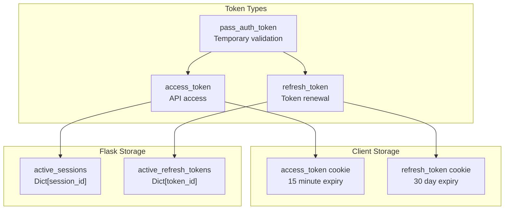
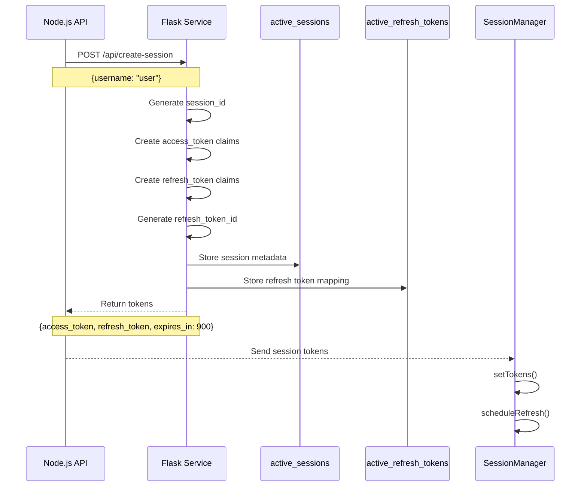
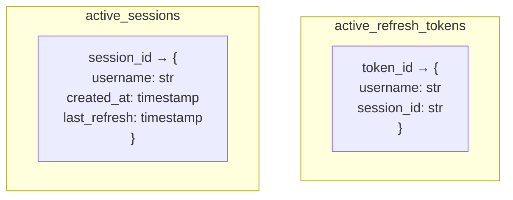
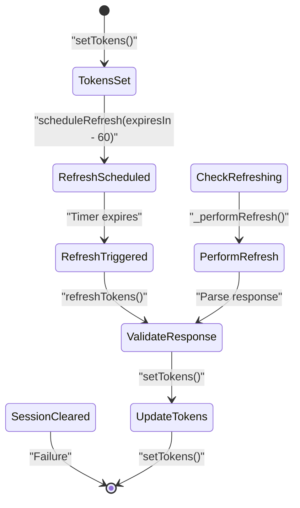
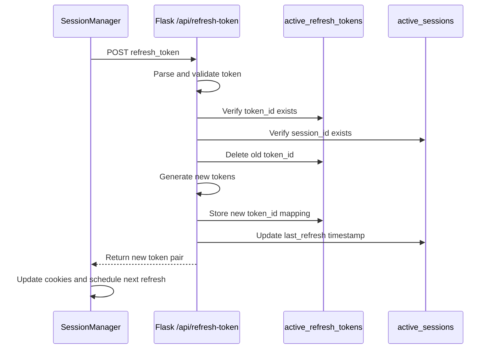
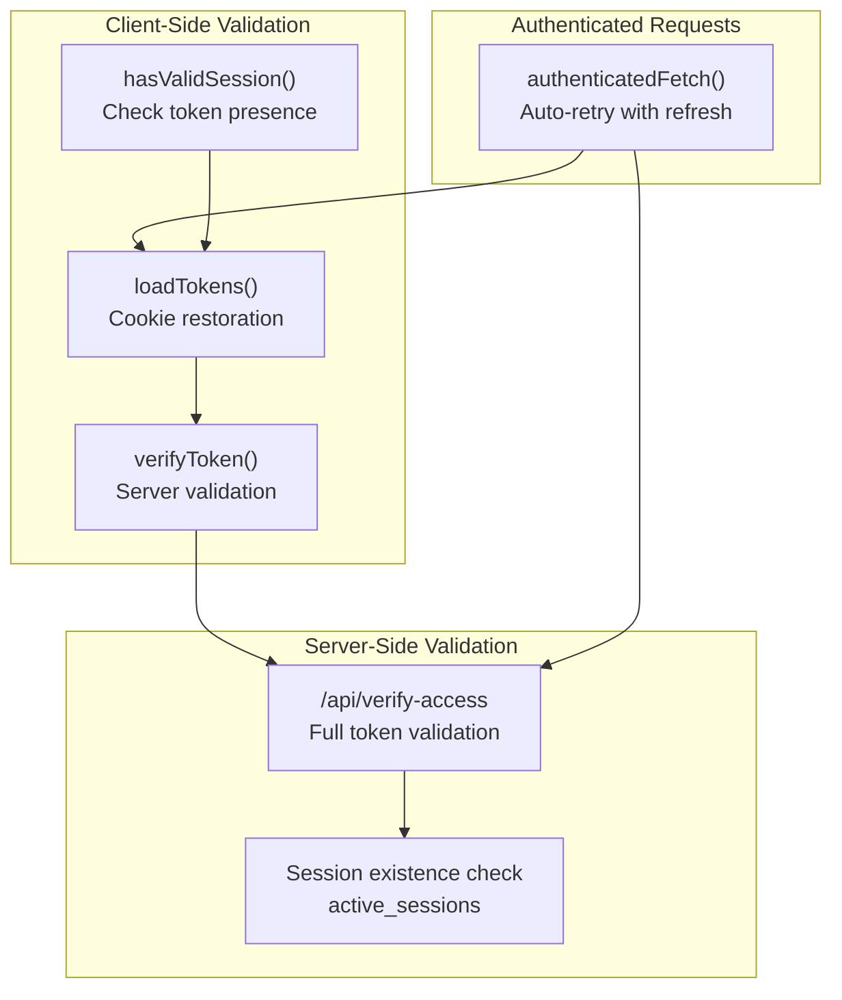
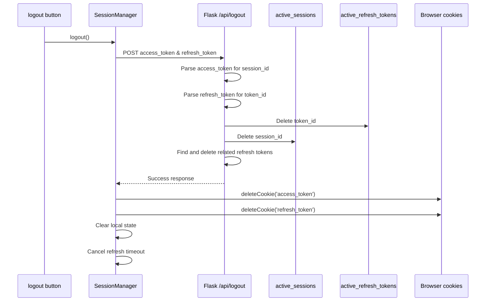

# Session Management

> **Relevant source files**
> * [back-end/main.py](https://github.com/RogueElectron/Cypher/blob/7b7a1583/back-end/main.py)
> * [back-end/src/index.js](https://github.com/RogueElectron/Cypher/blob/7b7a1583/back-end/src/index.js)
> * [back-end/src/session-manager.js](https://github.com/RogueElectron/Cypher/blob/7b7a1583/back-end/src/session-manager.js)
> * [back-end/static/dist/index.js](https://github.com/RogueElectron/Cypher/blob/7b7a1583/back-end/static/dist/index.js)
> * [back-end/static/dist/session-manager.js](https://github.com/RogueElectron/Cypher/blob/7b7a1583/back-end/static/dist/session-manager.js)

This document covers the session management system in Cypher, which handles user session persistence after successful authentication. The session management system is responsible for token lifecycle management, automatic token refresh, session validation, and logout procedures. This document focuses on post-authentication session handling; for authentication workflows, see [User Registration Process](/RogueElectron/Cypher/3.1-user-registration-process) and [User Login Process](/RogueElectron/Cypher/3.2-user-login-process).

## Token Types and Architecture

The Cypher session management system uses a multi-token architecture with three distinct token types, each serving a specific purpose in the authentication flow.

### Token Architecture Overview



Sources: [back-end/main.py L36-L56](https://github.com/RogueElectron/Cypher/blob/7b7a1583/back-end/main.py#L36-L56)

 [back-end/main.py L94-L151](https://github.com/RogueElectron/Cypher/blob/7b7a1583/back-end/main.py#L94-L151)

 [back-end/src/session-manager.js L27-L38](https://github.com/RogueElectron/Cypher/blob/7b7a1583/back-end/src/session-manager.js#L27-L38)

### Token Specifications

| Token Type | Purpose | Expiry | Storage | Key Used |
| --- | --- | --- | --- | --- |
| `pass_auth_token` | TOTP validation bridge | 3 minutes | Server-side only | `key` |
| `access_token` | API authentication | 15 minutes | HTTP cookie | `session_key` |
| `refresh_token` | Token renewal | 30 days | HTTP cookie | `refresh_key` |

The system uses separate PASETO symmetric keys for each token type to ensure cryptographic isolation between different security contexts.

Sources: [back-end/main.py L13-L15](https://github.com/RogueElectron/Cypher/blob/7b7a1583/back-end/main.py#L13-L15)

 [back-end/main.py L49-L54](https://github.com/RogueElectron/Cypher/blob/7b7a1583/back-end/main.py#L49-L54)

 [back-end/main.py L112-L133](https://github.com/RogueElectron/Cypher/blob/7b7a1583/back-end/main.py#L112-L133)

## Session Creation Process

Session creation occurs after successful OPAQUE authentication and TOTP verification. The Node.js service coordinates with the Flask service to establish a complete session.

### Session Creation Flow



The `create_session` endpoint generates a unique `session_id` using `secrets.token_urlsafe(32)` and stores session metadata in the `active_sessions` dictionary. Each refresh token receives a unique `token_id` for revocation tracking.

Sources: [back-end/main.py L94-L151](https://github.com/RogueElectron/Cypher/blob/7b7a1583/back-end/main.py#L94-L151)

 [back-end/src/session-manager.js L27-L38](https://github.com/RogueElectron/Cypher/blob/7b7a1583/back-end/src/session-manager.js#L27-L38)

### Session Storage Structure

The Flask service maintains two in-memory dictionaries for session tracking:



Sources: [back-end/main.py L17-L18](https://github.com/RogueElectron/Cypher/blob/7b7a1583/back-end/main.py#L17-L18)

 [back-end/main.py L135-L144](https://github.com/RogueElectron/Cypher/blob/7b7a1583/back-end/main.py#L135-L144)

## Token Lifecycle Management

The `SessionManager` class handles client-side token lifecycle, including automatic refresh scheduling and token validation.

### Automatic Refresh Mechanism

The system implements proactive token refresh to prevent authentication interruptions:



The refresh mechanism schedules automatic renewal 60 seconds before token expiry and handles concurrent refresh attempts using the `isRefreshing` flag and `refreshPromise` to prevent race conditions.

Sources: [back-end/src/session-manager.js L61-L90](https://github.com/RogueElectron/Cypher/blob/7b7a1583/back-end/src/session-manager.js#L61-L90)

 [back-end/src/session-manager.js L92-L121](https://github.com/RogueElectron/Cypher/blob/7b7a1583/back-end/src/session-manager.js#L92-L121)

### Refresh Token Exchange

The refresh process involves a complete token exchange where the old refresh token is invalidated and new tokens are issued:



Sources: [back-end/main.py L153-L239](https://github.com/RogueElectron/Cypher/blob/7b7a1583/back-end/main.py#L153-L239)

 [back-end/src/session-manager.js L92-L121](https://github.com/RogueElectron/Cypher/blob/7b7a1583/back-end/src/session-manager.js#L92-L121)

## Session Validation

The system provides multiple validation mechanisms for different use cases, from simple token presence checks to full server-side validation.

### Validation Methods



The `authenticatedFetch` method automatically handles 401 responses by attempting token refresh and retrying the request, providing transparent authentication for API calls.

Sources: [back-end/src/session-manager.js L53-L55](https://github.com/RogueElectron/Cypher/blob/7b7a1583/back-end/src/session-manager.js#L53-L55)

 [back-end/src/session-manager.js L122-L145](https://github.com/RogueElectron/Cypher/blob/7b7a1583/back-end/src/session-manager.js#L122-L145)

 [back-end/src/session-manager.js L147-L174](https://github.com/RogueElectron/Cypher/blob/7b7a1583/back-end/src/session-manager.js#L147-L174)

 [back-end/main.py L241-L281](https://github.com/RogueElectron/Cypher/blob/7b7a1583/back-end/main.py#L241-L281)

### Token Validation Flow

The `/api/verify-access` endpoint performs comprehensive validation:

1. Parse the PASETO token using the `session_key`
2. Validate token type is `access`
3. Extract username and session_id claims
4. Verify session exists in `active_sessions`
5. Cross-check username matches session record

Sources: [back-end/main.py L241-L281](https://github.com/RogueElectron/Cypher/blob/7b7a1583/back-end/main.py#L241-L281)

## Logout Process

The logout process ensures complete session cleanup on both client and server sides, with graceful error handling for various failure scenarios.

### Logout Sequence



The logout endpoint gracefully handles partial token availability - it attempts to extract session information from either the access token or refresh token if only one is available.

Sources: [back-end/main.py L283-L334](https://github.com/RogueElectron/Cypher/blob/7b7a1583/back-end/main.py#L283-L334)

 [back-end/src/session-manager.js L175-L204](https://github.com/RogueElectron/Cypher/blob/7b7a1583/back-end/src/session-manager.js#L175-L204)

 [back-end/src/index.js L109-L135](https://github.com/RogueElectron/Cypher/blob/7b7a1583/back-end/src/index.js#L109-L135)

## Error Handling and Recovery

The session management system implements comprehensive error handling to maintain security while providing a smooth user experience.

### Error Scenarios and Recovery

| Error Type | Trigger | Recovery Action | User Experience |
| --- | --- | --- | --- |
| Token Expiry | Access token expires naturally | Automatic refresh | Transparent |
| Refresh Failure | Refresh token invalid/expired | Clear session, redirect to login | Login required |
| Session Revocation | Server-side session cleanup | Clear local state | Login required |
| Network Errors | Request timeouts/failures | Retry with exponential backoff | Temporary loading state |
| Invalid Claims | Malformed token structure | Clear session immediately | Login required |

### Error Handling Implementation

The `SessionManager` implements defensive programming patterns:

```javascript
// Example from session-manager.js
try {
    const response = await this._performRefresh();
    return response;
} catch (error) {
    this.clearSession(); // Always clean up on error
    throw error;
}
```

All session-related errors result in immediate session cleanup to prevent inconsistent states. The system prioritizes security by failing closed - when in doubt, it clears the session and requires re-authentication.

Sources: [back-end/src/session-manager.js L82-L121](https://github.com/RogueElectron/Cypher/blob/7b7a1583/back-end/src/session-manager.js#L82-L121)

 [back-end/src/session-manager.js L193-L204](https://github.com/RogueElectron/Cypher/blob/7b7a1583/back-end/src/session-manager.js#L193-L204)

 [back-end/main.py L91-L92](https://github.com/RogueElectron/Cypher/blob/7b7a1583/back-end/main.py#L91-L92)

 [back-end/main.py L238-L239](https://github.com/RogueElectron/Cypher/blob/7b7a1583/back-end/main.py#L238-L239)