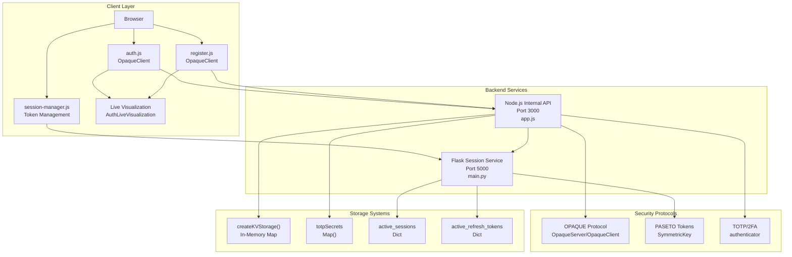
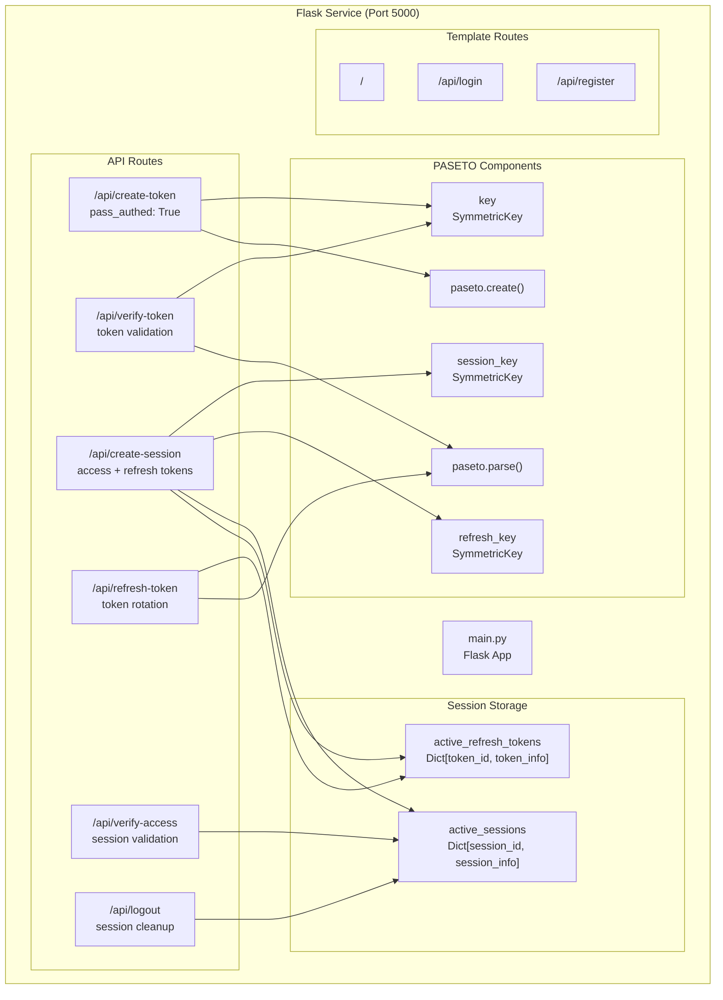
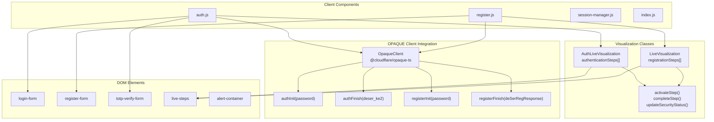
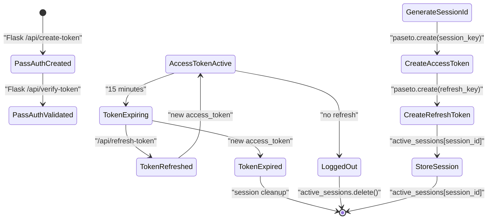
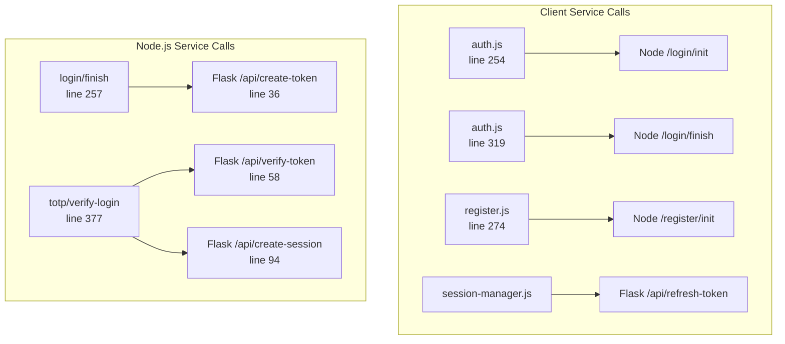

# System Architecture

> **Relevant source files**
> * [back-end/main.py](https://github.com/RogueElectron/Cypher/blob/7b7a1583/back-end/main.py)
> * [back-end/node_internal_api/app.js](https://github.com/RogueElectron/Cypher/blob/7b7a1583/back-end/node_internal_api/app.js)
> * [back-end/src/auth.js](https://github.com/RogueElectron/Cypher/blob/7b7a1583/back-end/src/auth.js)
> * [back-end/src/register.js](https://github.com/RogueElectron/Cypher/blob/7b7a1583/back-end/src/register.js)

This document explains the high-level architecture of the Cypher authentication platform, covering the dual-backend service design, client-side components, and inter-service communication patterns. The architecture implements a zero-knowledge authentication approach using the OPAQUE protocol combined with TOTP-based two-factor authentication.

For implementation details of individual services, see [Backend Services](/RogueElectron/Cypher/2.1-backend-services). For frontend component documentation, see [Frontend Components](/RogueElectron/Cypher/2.2-frontend-components). For the underlying security model, see [Security Model](/RogueElectron/Cypher/2.3-security-model).

## Architecture Overview

Cypher implements a distributed authentication system with two specialized backend services and a sophisticated client-side interface. The system separates cryptographic operations from session management to maintain security isolation while providing a seamless user experience.

### High-Level System Architecture



**Sources:** [back-end/node_internal_api/app.js L1-L470](https://github.com/RogueElectron/Cypher/blob/7b7a1583/back-end/node_internal_api/app.js#L1-L470)

 [back-end/main.py L1-L339](https://github.com/RogueElectron/Cypher/blob/7b7a1583/back-end/main.py#L1-L339)

 [back-end/src/auth.js L1-L475](https://github.com/RogueElectron/Cypher/blob/7b7a1583/back-end/src/auth.js#L1-L475)

 [back-end/src/register.js L1-L500](https://github.com/RogueElectron/Cypher/blob/7b7a1583/back-end/src/register.js#L1-L500)

## Service Architecture

The system employs a dual-backend architecture where each service handles distinct security concerns:

### Node.js Internal API Architecture

```mermaid
flowchart TD

AppJS["app.js<br>Express Server"]
OpaqueServer["OpaqueServer<br>cfg, oprfSeed, serverKeypairSeed"]
CredentialFile["CredentialFile<br>username, record"]
KE1["KE1.deserialize()"]
KE2["KE2.serialize()"]
KE3["KE3.deserialize()"]
Authenticator["authenticator<br>generateSecret(), verify()"]
QRCode["QRCode.toDataURL()"]
TOTPMap["totpSecrets<br>Map"]
Database["database<br>createKVStorage()"]
UnverifiedAccounts["unverifiedAccounts<br>Map"]
UserSessions["global.userSessions<br>Map"]
RegInit["/register/init"]
RegFinish["/register/finish"]
LoginInit["/login/init"]
LoginFinish["/login/finish"]
TOTPSetup["/totp/setup"]
TOTPVerifySetup["/totp/verify-setup"]
TOTPVerifyLogin["/totp/verify-login"]
FlaskService["Flask Service"]

LoginFinish --> FlaskService
TOTPVerifyLogin --> FlaskService

subgraph subGraph4 ["Node.js Service (Port 3000)"]
    AppJS
    RegInit --> OpaqueServer
    RegFinish --> Database
    LoginInit --> CredentialFile
    LoginFinish --> UserSessions
    TOTPSetup --> Authenticator
    TOTPSetup --> QRCode
    TOTPVerifySetup --> TOTPMap
    TOTPVerifyLogin --> TOTPMap

subgraph Routes ["Routes"]
    RegInit
    RegFinish
    LoginInit
    LoginFinish
    TOTPSetup
    TOTPVerifySetup
    TOTPVerifyLogin
end

subgraph Storage ["Storage"]
    Database
    UnverifiedAccounts
    UserSessions
end

subgraph subGraph1 ["TOTP Components"]
    Authenticator
    QRCode
    TOTPMap
end

subgraph subGraph0 ["OPAQUE Components"]
    OpaqueServer
    CredentialFile
    KE1
    KE2
    KE3
end
end
```



**Sources:** [back-end/node_internal_api/app.js L22-L112](https://github.com/RogueElectron/Cypher/blob/7b7a1583/back-end/node_internal_api/app.js#L22-L112)

 [back-end/node_internal_api/app.js L118-L464](https://github.com/RogueElectron/Cypher/blob/7b7a1583/back-end/node_internal_api/app.js#L118-L464)

### Flask Session Service Architecture



**Sources:** [back-end/main.py L10-L18](https://github.com/RogueElectron/Cypher/blob/7b7a1583/back-end/main.py#L10-L18)

 [back-end/main.py L36-L93](https://github.com/RogueElectron/Cypher/blob/7b7a1583/back-end/main.py#L36-L93)

 [back-end/main.py L94-L151](https://github.com/RogueElectron/Cypher/blob/7b7a1583/back-end/main.py#L94-L151)

 [back-end/main.py L153-L239](https://github.com/RogueElectron/Cypher/blob/7b7a1583/back-end/main.py#L153-L239)

## Client-Side Architecture

The frontend implements a modular JavaScript architecture with live visualization capabilities:

### Frontend Component Structure



**Sources:** [back-end/src/auth.js L86-L153](https://github.com/RogueElectron/Cypher/blob/7b7a1583/back-end/src/auth.js#L86-L153)

 [back-end/src/register.js L79-L146](https://github.com/RogueElectron/Cypher/blob/7b7a1583/back-end/src/register.js#L79-L146)

 [back-end/src/auth.js L19-L83](https://github.com/RogueElectron/Cypher/blob/7b7a1583/back-end/src/auth.js#L19-L83)

 [back-end/src/register.js L12-L76](https://github.com/RogueElectron/Cypher/blob/7b7a1583/back-end/src/register.js#L12-L76)

## Data Flow Architecture

The system implements a multi-phase authentication flow with clear separation between password authentication and session management:

### Authentication Data Flow

```mermaid
sequenceDiagram
  participant OpaqueClient
  participant (auth.js)
  participant Node.js API
  participant (app.js)
  participant Flask Service
  participant (main.py)
  participant Database
  participant (createKVStorage)

  note over OpaqueClient,(createKVStorage): Registration Phase
  OpaqueClient->>OpaqueClient: "registerInit(password)"
  OpaqueClient->>Node.js API: "POST /register/init
  Node.js API->>Node.js API: {username, registrationRequest}"
  Node.js API-->>OpaqueClient: "server.registerInit(deSerReq, username)"
  OpaqueClient->>OpaqueClient: "{registrationResponse}"
  OpaqueClient->>Node.js API: "registerFinish(deSerRegResponse)"
  Node.js API->>Database: "POST /register/finish
  note over OpaqueClient,(createKVStorage): Login Phase
  OpaqueClient->>OpaqueClient: {record, username}"
  OpaqueClient->>Node.js API: "database.store(username, credential_file)"
  Node.js API->>Database: "authInit(password)"
  Node.js API->>Node.js API: "POST /login/init
  Node.js API-->>OpaqueClient: {serke1, username}"
  OpaqueClient->>OpaqueClient: "database.lookup(username)"
  OpaqueClient->>Node.js API: "server.authInit(deser_ke1, credential_file)"
  Node.js API->>Flask Service: "{ser_ke2}"
  Flask Service-->>Node.js API: "authFinish(deser_ke2)"
  Node.js API-->>OpaqueClient: "POST /login/finish
  note over OpaqueClient,(createKVStorage): TOTP Phase
  OpaqueClient->>Node.js API: {serke3, username}"
  Node.js API->>Flask Service: "POST /api/create-token
  Flask Service-->>Node.js API: {username}"
  Node.js API->>Flask Service: "{token: pass_auth_token}"
  Flask Service->>Flask Service: "{success, token: pass_auth_token}"
  Flask Service-->>Node.js API: "POST /totp/verify-login
  Node.js API-->>OpaqueClient: {username, token, passAuthToken}"
```

**Sources:** [back-end/src/auth.js L240-L298](https://github.com/RogueElectron/Cypher/blob/7b7a1583/back-end/src/auth.js#L240-L298)

 [back-end/node_internal_api/app.js L194-L298](https://github.com/RogueElectron/Cypher/blob/7b7a1583/back-end/node_internal_api/app.js#L194-L298)

 [back-end/node_internal_api/app.js L363-L464](https://github.com/RogueElectron/Cypher/blob/7b7a1583/back-end/node_internal_api/app.js#L363-L464)

 [back-end/main.py L36-L56](https://github.com/RogueElectron/Cypher/blob/7b7a1583/back-end/main.py#L36-L56)

 [back-end/main.py L94-L151](https://github.com/RogueElectron/Cypher/blob/7b7a1583/back-end/main.py#L94-L151)

### Session Token Lifecycle



**Sources:** [back-end/main.py L94-L151](https://github.com/RogueElectron/Cypher/blob/7b7a1583/back-end/main.py#L94-L151)

 [back-end/main.py L153-L239](https://github.com/RogueElectron/Cypher/blob/7b7a1583/back-end/main.py#L153-L239)

 [back-end/main.py L283-L334](https://github.com/RogueElectron/Cypher/blob/7b7a1583/back-end/main.py#L283-L334)

## Component Communication Patterns

The architecture relies on specific communication patterns between services:

| Communication Type | Source | Destination | Protocol | Purpose |
| --- | --- | --- | --- | --- |
| OPAQUE Protocol | `auth.js` | `app.js` | HTTP POST | Password authentication |
| Token Creation | `app.js` | `main.py` | HTTP POST | Session initiation |
| Token Validation | `app.js` | `main.py` | HTTP POST | TOTP verification |
| Session Management | `session-manager.js` | `main.py` | HTTP POST | Token lifecycle |
| Template Serving | `main.py` | Browser | HTTP GET | UI delivery |

### Inter-Service Communication



**Sources:** [back-end/node_internal_api/app.js L256-L267](https://github.com/RogueElectron/Cypher/blob/7b7a1583/back-end/node_internal_api/app.js#L256-L267)

 [back-end/node_internal_api/app.js L376-L400](https://github.com/RogueElectron/Cypher/blob/7b7a1583/back-end/node_internal_api/app.js#L376-L400)

 [back-end/node_internal_api/app.js L421-L449](https://github.com/RogueElectron/Cypher/blob/7b7a1583/back-end/node_internal_api/app.js#L421-L449)

 [back-end/src/auth.js L254-L264](https://github.com/RogueElectron/Cypher/blob/7b7a1583/back-end/src/auth.js#L254-L264)

 [back-end/src/auth.js L319-L329](https://github.com/RogueElectron/Cypher/blob/7b7a1583/back-end/src/auth.js#L319-L329)

This architecture provides clear separation of concerns while maintaining secure communication channels between all system components. The dual-backend approach ensures that cryptographic operations remain isolated from session management, enhancing overall security posture.