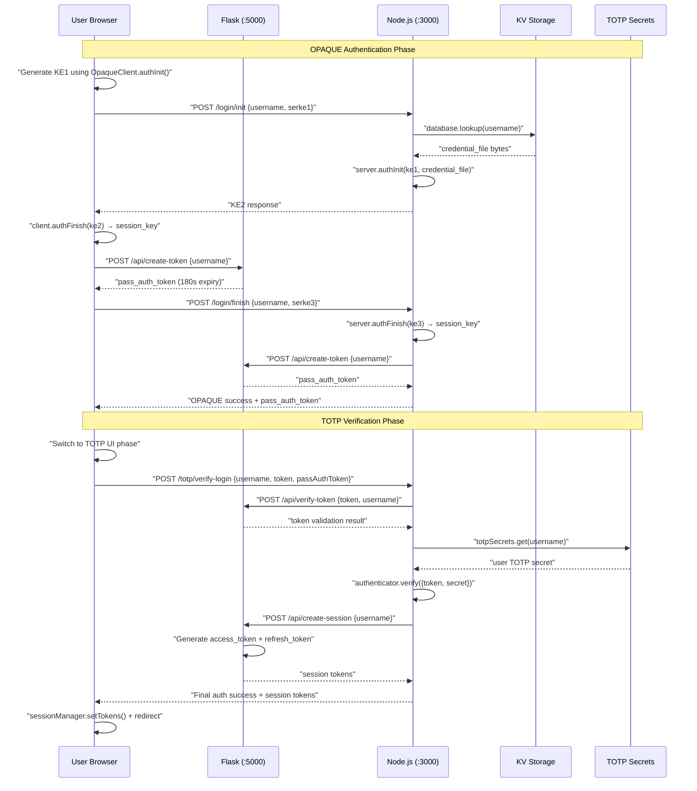
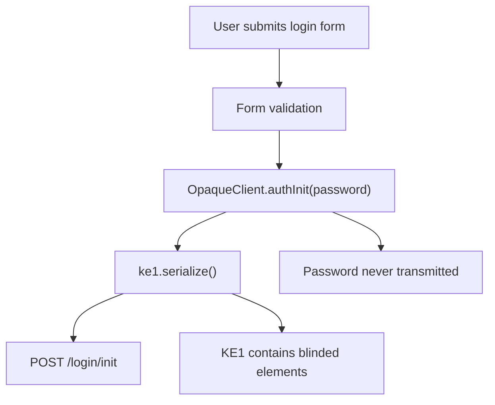
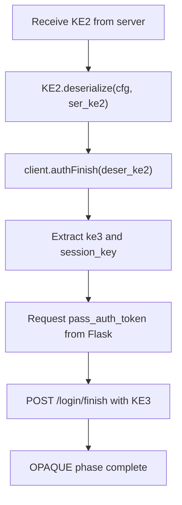
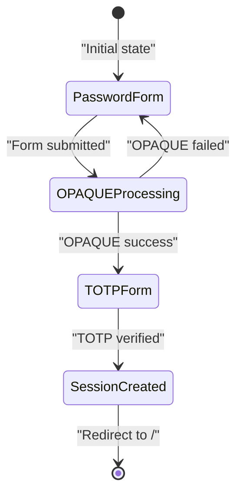
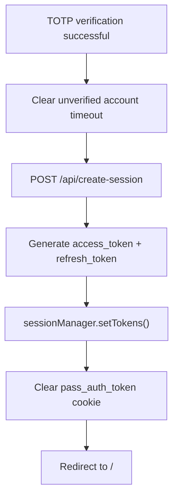
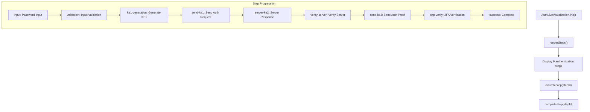

# User Login Process

> **Relevant source files**
> * [back-end/main.py](https://github.com/RogueElectron/Cypher/blob/7b7a1583/back-end/main.py)
> * [back-end/node_internal_api/app.js](https://github.com/RogueElectron/Cypher/blob/7b7a1583/back-end/node_internal_api/app.js)
> * [back-end/src/auth.js](https://github.com/RogueElectron/Cypher/blob/7b7a1583/back-end/src/auth.js)
> * [back-end/static/dist/auth.js](https://github.com/RogueElectron/Cypher/blob/7b7a1583/back-end/static/dist/auth.js)
> * [back-end/templates/login.html](https://github.com/RogueElectron/Cypher/blob/7b7a1583/back-end/templates/login.html)

This document describes the complete user login workflow in the Cypher authentication system, covering the dual-phase authentication process that combines OPAQUE zero-knowledge password authentication with TOTP two-factor authentication. The process involves coordination between the Node.js Internal API, Flask Session Service, and client-side authentication logic to establish secure user sessions.

For information about user registration and TOTP setup, see [User Registration Process](/RogueElectron/Cypher/documentation/3.1-user-registration-process). For details on session token lifecycle and management after login, see [Session Management](/RogueElectron/Cypher/documentation/3.3-session-management).

## Overview

The login process consists of two distinct phases:

1. **OPAQUE Authentication Phase**: Zero-knowledge password verification using the OPAQUE protocol
2. **TOTP Verification Phase**: Two-factor authentication using time-based codes

The process is orchestrated across multiple services and includes live visualization for user transparency.

Sources: [back-end/src/auth.js L18-L83](https://github.com/RogueElectron/Cypher/blob/7b7a1583/back-end/src/auth.js#L18-L83)

 [back-end/node_internal_api/app.js L194-L298](https://github.com/RogueElectron/Cypher/blob/7b7a1583/back-end/node_internal_api/app.js#L194-L298)

## System Components

### Backend Services

| Service | Port | Responsibility |
| --- | --- | --- |
| Node.js Internal API | 3000 | OPAQUE protocol operations, TOTP verification |
| Flask Session Service | 5000 | Token creation/verification, session management |

### Key Client Components

| Component | File | Purpose |
| --- | --- | --- |
| `AuthLiveVisualization` | auth.js | Live process visualization |
| Login form handler | auth.js | OPAQUE authentication flow |
| TOTP form handler | auth.js | Two-factor verification |

Sources: [back-end/node_internal_api/app.js L22-L79](https://github.com/RogueElectron/Cypher/blob/7b7a1583/back-end/node_internal_api/app.js#L22-L79)

 [back-end/main.py L10-L18](https://github.com/RogueElectron/Cypher/blob/7b7a1583/back-end/main.py#L10-L18)

 [back-end/src/auth.js L86-L153](https://github.com/RogueElectron/Cypher/blob/7b7a1583/back-end/src/auth.js#L86-L153)

## Login Flow Architecture

Sources: [back-end/src/auth.js L214-L377](https://github.com/RogueElectron/Cypher/blob/7b7a1583/back-end/src/auth.js#L214-L377)

 [back-end/node_internal_api/app.js L194-L298](https://github.com/RogueElectron/Cypher/blob/7b7a1583/back-end/node_internal_api/app.js#L194-L298)

 [back-end/node_internal_api/app.js L363-L464](https://github.com/RogueElectron/Cypher/blob/7b7a1583/back-end/node_internal_api/app.js#L363-L464)

## Phase 1: OPAQUE Authentication

### Client-Side KE1 Generation

The login process begins when the user submits credentials through the login form. The client-side code immediately generates the first key exchange message without transmitting the password.

The `OpaqueClient` from the `@cloudflare/opaque-ts` library handles the cryptographic operations locally in the browser.

Sources: [back-end/src/auth.js L241-L263](https://github.com/RogueElectron/Cypher/blob/7b7a1583/back-end/src/auth.js#L241-L263)

 [back-end/src/auth.js L1-L9](https://github.com/RogueElectron/Cypher/blob/7b7a1583/back-end/src/auth.js#L1-L9)

### Server-Side KE2 Response

The Node.js service processes the KE1 message using stored credential files and responds with KE2.

| Endpoint | `/login/init` |
| --- | --- |
| Method | POST |
| Handler | [app.js L194-L231](https://github.com/RogueElectron/Cypher/blob/7b7a1583/app.js#L194-L231) |
| Input | `{username, serke1}` |
| Output | `{ser_ke2}` |

The server retrieves the user's `CredentialFile` from the KV storage and uses `server.authInit()` to generate the KE2 response.

Sources: [back-end/node_internal_api/app.js L194-L231](https://github.com/RogueElectron/Cypher/blob/7b7a1583/back-end/node_internal_api/app.js#L194-L231)

 [back-end/node_internal_api/app.js L45-L61](https://github.com/RogueElectron/Cypher/blob/7b7a1583/back-end/node_internal_api/app.js#L45-L61)

### Authentication Completion

The client processes the KE2 response and generates the final KE3 proof message.

The `client.authFinish()` method generates both the KE3 proof and a session key that proves successful mutual authentication.

Sources: [back-end/src/auth.js L276-L361](https://github.com/RogueElectron/Cypher/blob/7b7a1583/back-end/src/auth.js#L276-L361)

 [back-end/node_internal_api/app.js L235-L298](https://github.com/RogueElectron/Cypher/blob/7b7a1583/back-end/node_internal_api/app.js#L235-L298)

## Phase 2: TOTP Verification

### UI Phase Transition

After successful OPAQUE authentication, the client interface switches from the password form to the TOTP verification form.

The interface elements are controlled through DOM manipulation in the success handler.

Sources: [back-end/src/auth.js L346-L356](https://github.com/RogueElectron/Cypher/blob/7b7a1583/back-end/src/auth.js#L346-L356)

 [back-end/templates/login.html L42-L61](https://github.com/RogueElectron/Cypher/blob/7b7a1583/back-end/templates/login.html#L42-L61)

### TOTP Code Verification

The TOTP verification process validates the temporary `pass_auth_token` before checking the authentication code.

| Endpoint | `/totp/verify-login` |
| --- | --- |
| Method | POST |
| Handler | [app.js L363-L464](https://github.com/RogueElectron/Cypher/blob/7b7a1583/app.js#L363-L464) |
| Input | `{username, token, passAuthToken}` |
| Validation Steps | Token verification → TOTP verification → Session creation |

The handler performs three critical operations:

1. Validates the temporary `pass_auth_token` with Flask
2. Verifies the TOTP code against the stored secret
3. Requests session token creation from Flask

Sources: [back-end/node_internal_api/app.js L363-L464](https://github.com/RogueElectron/Cypher/blob/7b7a1583/back-end/node_internal_api/app.js#L363-L464)

 [back-end/src/auth.js L382-L462](https://github.com/RogueElectron/Cypher/blob/7b7a1583/back-end/src/auth.js#L382-L462)

## Token Management Integration

### Temporary Token Flow

The login process uses a short-lived `pass_auth_token` to bridge the gap between OPAQUE completion and TOTP verification.

| Token Type | Purpose | Expiry | Storage |
| --- | --- | --- | --- |
| `pass_auth_token` | OPAQUE→TOTP bridge | 180 seconds | Browser cookie |
| `access_token` | Session access | 900 seconds | sessionManager |
| `refresh_token` | Token refresh | 30 days | sessionManager |

The temporary token is created by Flask's `/api/create-token` endpoint and verified before TOTP processing.

Sources: [back-end/main.py L36-L56](https://github.com/RogueElectron/Cypher/blob/7b7a1583/back-end/main.py#L36-L56)

 [back-end/main.py L58-L93](https://github.com/RogueElectron/Cypher/blob/7b7a1583/back-end/main.py#L58-L93)

 [back-end/src/auth.js L315-L317](https://github.com/RogueElectron/Cypher/blob/7b7a1583/back-end/src/auth.js#L315-L317)

### Session Token Creation

Upon successful TOTP verification, the Node.js service requests final session tokens from Flask.

The session creation endpoint generates both access and refresh tokens with proper expiration times.

Sources: [back-end/node_internal_api/app.js L420-L455](https://github.com/RogueElectron/Cypher/blob/7b7a1583/back-end/node_internal_api/app.js#L420-L455)

 [back-end/main.py L94-L151](https://github.com/RogueElectron/Cypher/blob/7b7a1583/back-end/main.py#L94-L151)

 [back-end/src/auth.js L441-L451](https://github.com/RogueElectron/Cypher/blob/7b7a1583/back-end/src/auth.js#L441-L451)

## Live Visualization System

### Authentication Step Tracking

The login process includes a live visualization system that shows users each step of the authentication process in real-time.

The visualization uses Bootstrap icons and CSS transitions to provide visual feedback during each authentication phase.

Sources: [back-end/src/auth.js L18-L83](https://github.com/RogueElectron/Cypher/blob/7b7a1583/back-end/src/auth.js#L18-L83)

 [back-end/src/auth.js L86-L153](https://github.com/RogueElectron/Cypher/blob/7b7a1583/back-end/src/auth.js#L86-L153)

 [back-end/templates/login.html L86-L98](https://github.com/RogueElectron/Cypher/blob/7b7a1583/back-end/templates/login.html#L86-L98)

### Security Status Updates

The system provides real-time security status messages to inform users about the zero-knowledge authentication process.

| Step | Security Message |
| --- | --- |
| KE1 Generation | "Generating key exchange message without exposing password" |
| Server Response | "Server responding with encrypted challenge using stored credentials" |
| Server Verification | "Verifying server authenticity and generating session key" |
| TOTP Phase | "OPAQUE authentication complete! Now verifying 2FA..." |

Sources: [back-end/src/auth.js L139-L152](https://github.com/RogueElectron/Cypher/blob/7b7a1583/back-end/src/auth.js#L139-L152)

 [back-end/src/auth.js L218-L344](https://github.com/RogueElectron/Cypher/blob/7b7a1583/back-end/src/auth.js#L218-L344)

## Error Handling and Security

### Authentication Failures

The system handles various failure scenarios with appropriate user feedback:

| Failure Type | Detection | User Message |
| --- | --- | --- |
| User not found | `database.lookup()` returns false | "User not found. Please register first." |
| Invalid password | OPAQUE `authFinish()` fails | "Invalid username or password." |
| Token expiry | `pass_auth_token` validation fails | "Password authentication token not found or expired" |
| Invalid TOTP | `authenticator.verify()` returns false | "Invalid TOTP code" |

Sources: [back-end/src/auth.js L362-L376](https://github.com/RogueElectron/Cypher/blob/7b7a1583/back-end/src/auth.js#L362-L376)

 [back-end/node_internal_api/app.js L207-L210](https://github.com/RogueElectron/Cypher/blob/7b7a1583/back-end/node_internal_api/app.js#L207-L210)

 [back-end/node_internal_api/app.js L372-L400](https://github.com/RogueElectron/Cypher/blob/7b7a1583/back-end/node_internal_api/app.js#L372-L400)

### Security Measures

The login process implements several security protections:

1. **Zero-Knowledge Authentication**: Passwords never transmitted in plaintext
2. **Token Expiration**: Short-lived temporary tokens (180 seconds)
3. **TOTP Window**: Limited time window for 2FA codes
4. **Session Validation**: Server-side session tracking with `active_sessions`
5. **CORS Protection**: Restricted origins and credential handling

Sources: [back-end/node_internal_api/app.js L64-L70](https://github.com/RogueElectron/Cypher/blob/7b7a1583/back-end/node_internal_api/app.js#L64-L70)

 [back-end/main.py L11](https://github.com/RogueElectron/Cypher/blob/7b7a1583/back-end/main.py#L11-L11)

 [back-end/node_internal_api/app.js L408-L412](https://github.com/RogueElectron/Cypher/blob/7b7a1583/back-end/node_internal_api/app.js#L408-L412)