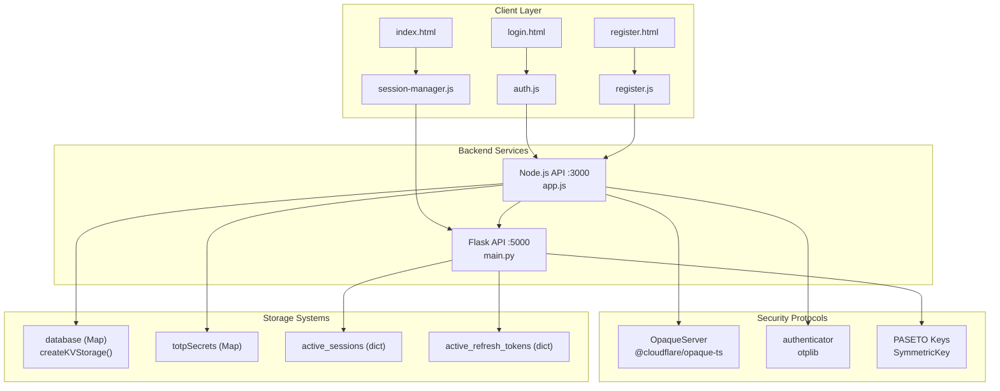
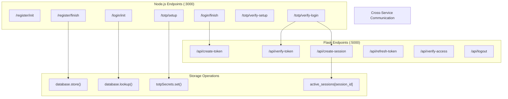
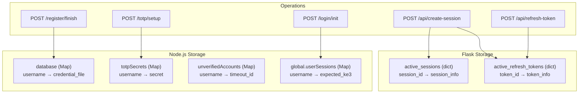

# Cypher Authentication System Overview

> **Relevant source files**
> * [back-end/main.py](https://github.com/RogueElectron/Cypher/blob/7b7a1583/back-end/main.py)
> * [back-end/node_internal_api/app.js](https://github.com/RogueElectron/Cypher/blob/7b7a1583/back-end/node_internal_api/app.js)
> * [back-end/templates/index.html](https://github.com/RogueElectron/Cypher/blob/7b7a1583/back-end/templates/index.html)

## Purpose and Scope

This document provides a high-level overview of the Cypher authentication system, covering its zero-knowledge security approach, dual-backend architecture, and core authentication workflows. It serves as an entry point for understanding the system's design principles and major components.

For detailed technical implementation of individual services, see [Backend Services](/RogueElectron/Cypher/2.1-backend-services). For step-by-step authentication workflows, see [Authentication Workflows](/RogueElectron/Cypher/3-authentication-workflows). For development environment setup, see [Development Guide](/RogueElectron/Cypher/5-development-guide).

## System Overview

Cypher is a next-generation authentication platform that implements zero-knowledge password authentication using the OPAQUE protocol combined with mandatory TOTP two-factor authentication. The system ensures that user passwords never leave the client device in plaintext, providing enhanced security compared to traditional authentication systems.

### Key Features

* **Zero-Knowledge Authentication**: Uses the OPAQUE protocol to ensure passwords never reach the server
* **Mandatory 2FA**: TOTP-based two-factor authentication required for all accounts
* **Secure Session Management**: PASETO tokens with automatic refresh capabilities
* **Live Process Visualization**: Real-time feedback during authentication workflows
* **Dual-Backend Architecture**: Separation of cryptographic operations and session management

Sources: [back-end/templates/index.html L26-L27](https://github.com/RogueElectron/Cypher/blob/7b7a1583/back-end/templates/index.html#L26-L27)

 [back-end/node_internal_api/app.js L1-L12](https://github.com/RogueElectron/Cypher/blob/7b7a1583/back-end/node_internal_api/app.js#L1-L12)

 [back-end/main.py L3-L4](https://github.com/RogueElectron/Cypher/blob/7b7a1583/back-end/main.py#L3-L4)

## System Architecture

### High-Level Component Architecture



Sources: [back-end/node_internal_api/app.js L22](https://github.com/RogueElectron/Cypher/blob/7b7a1583/back-end/node_internal_api/app.js#L22-L22)

 [back-end/main.py L10](https://github.com/RogueElectron/Cypher/blob/7b7a1583/back-end/main.py#L10-L10)

 [back-end/node_internal_api/app.js L45-L61](https://github.com/RogueElectron/Cypher/blob/7b7a1583/back-end/node_internal_api/app.js#L45-L61)

 [back-end/main.py L17-L18](https://github.com/RogueElectron/Cypher/blob/7b7a1583/back-end/main.py#L17-L18)

### API Endpoint Architecture



Sources: [back-end/node_internal_api/app.js L118](https://github.com/RogueElectron/Cypher/blob/7b7a1583/back-end/node_internal_api/app.js#L118-L118)

 [back-end/node_internal_api/app.js L151](https://github.com/RogueElectron/Cypher/blob/7b7a1583/back-end/node_internal_api/app.js#L151-L151)

 [back-end/node_internal_api/app.js L194](https://github.com/RogueElectron/Cypher/blob/7b7a1583/back-end/node_internal_api/app.js#L194-L194)

 [back-end/node_internal_api/app.js L235](https://github.com/RogueElectron/Cypher/blob/7b7a1583/back-end/node_internal_api/app.js#L235-L235)

 [back-end/main.py L36](https://github.com/RogueElectron/Cypher/blob/7b7a1583/back-end/main.py#L36-L36)

 [back-end/main.py L94](https://github.com/RogueElectron/Cypher/blob/7b7a1583/back-end/main.py#L94-L94)

 [back-end/main.py L153](https://github.com/RogueElectron/Cypher/blob/7b7a1583/back-end/main.py#L153-L153)

## Core Components

### Node.js Internal API

The Node.js service handles all cryptographic operations and serves as the primary authentication engine.

| Component | Purpose | Key Functions |
| --- | --- | --- |
| `OpaqueServer` | Zero-knowledge password authentication | `registerInit()`, `authInit()`, `authFinish()` |
| `authenticator` | TOTP operations | `generateSecret()`, `verify()`, `keyuri()` |
| `database` | User credential storage | `store()`, `lookup()` |
| `totpSecrets` | TOTP secret management | In-memory Map storage |

Sources: [back-end/node_internal_api/app.js L108-L112](https://github.com/RogueElectron/Cypher/blob/7b7a1583/back-end/node_internal_api/app.js#L108-L112)

 [back-end/node_internal_api/app.js L79-L80](https://github.com/RogueElectron/Cypher/blob/7b7a1583/back-end/node_internal_api/app.js#L79-L80)

 [back-end/node_internal_api/app.js L16](https://github.com/RogueElectron/Cypher/blob/7b7a1583/back-end/node_internal_api/app.js#L16-L16)

### Flask Session Service

The Flask service manages session lifecycle and token operations using PASETO tokens.

| Component | Purpose | Key Variables |
| --- | --- | --- |
| `key` | Pass-through token signing | `SymmetricKey.generate()` |
| `session_key` | Access token signing | `SymmetricKey.generate()` |
| `refresh_key` | Refresh token signing | `SymmetricKey.generate()` |
| `active_sessions` | Session state tracking | Dictionary mapping |
| `active_refresh_tokens` | Token revocation tracking | Dictionary mapping |

Sources: [back-end/main.py L13-L15](https://github.com/RogueElectron/Cypher/blob/7b7a1583/back-end/main.py#L13-L15)

 [back-end/main.py L17-L18](https://github.com/RogueElectron/Cypher/blob/7b7a1583/back-end/main.py#L17-L18)

## Security Model

### Authentication Flow Overview

The system implements a multi-stage authentication process combining OPAQUE protocol with TOTP verification:

```mermaid
sequenceDiagram
  participant Client
  participant Node.js (:3000)
  participant Flask (:5000)

  note over Client,Flask (:5000): Registration Phase
  Client->>Node.js (:3000): "POST /register/init"
  Node.js (:3000)->>Node.js (:3000): "server.registerInit()"
  Node.js (:3000)-->>Client: "registrationResponse"
  Client->>Node.js (:3000): "POST /register/finish"
  Node.js (:3000)->>Node.js (:3000): "database.store()"
  Client->>Node.js (:3000): "POST /totp/setup"
  Node.js (:3000)->>Node.js (:3000): "authenticator.generateSecret()"
  Node.js (:3000)-->>Client: "QR code + secret"
  note over Client,Flask (:5000): Login Phase
  Client->>Node.js (:3000): "POST /login/init"
  Node.js (:3000)->>Node.js (:3000): "server.authInit()"
  Node.js (:3000)-->>Client: "KE2 response"
  Client->>Node.js (:3000): "POST /login/finish"
  Node.js (:3000)->>Node.js (:3000): "server.authFinish()"
  Node.js (:3000)->>Flask (:5000): "POST /api/create-token"
  Flask (:5000)-->>Node.js (:3000): "pass_auth_token"
  Node.js (:3000)-->>Client: "temp token"
  Client->>Node.js (:3000): "POST /totp/verify-login"
  Node.js (:3000)->>Flask (:5000): "POST /api/verify-token"
  Node.js (:3000)->>Flask (:5000): "POST /api/create-session"
  Flask (:5000)-->>Node.js (:3000): "access + refresh tokens"
  Node.js (:3000)-->>Client: "session tokens"
```

Sources: [back-end/node_internal_api/app.js L141](https://github.com/RogueElectron/Cypher/blob/7b7a1583/back-end/node_internal_api/app.js#L141-L141)

 [back-end/node_internal_api/app.js L215](https://github.com/RogueElectron/Cypher/blob/7b7a1583/back-end/node_internal_api/app.js#L215-L215)

 [back-end/node_internal_api/app.js L247](https://github.com/RogueElectron/Cypher/blob/7b7a1583/back-end/node_internal_api/app.js#L247-L247)

 [back-end/node_internal_api/app.js L257-L263](https://github.com/RogueElectron/Cypher/blob/7b7a1583/back-end/node_internal_api/app.js#L257-L263)

 [back-end/node_internal_api/app.js L422-L429](https://github.com/RogueElectron/Cypher/blob/7b7a1583/back-end/node_internal_api/app.js#L422-L429)

### Token Lifecycle

The system uses a three-tier token approach:

1. **Pass-through tokens**: Short-lived (3 minutes) tokens issued after OPAQUE authentication
2. **Access tokens**: Session tokens (15 minutes) for API access
3. **Refresh tokens**: Long-lived (30 days) tokens for session renewal

| Token Type | Expiry | Purpose | Signing Key |
| --- | --- | --- | --- |
| Pass-through | 180 seconds | OPAQUE→TOTP bridge | `key` |
| Access | 900 seconds | API authentication | `session_key` |
| Refresh | 2592000 seconds | Token renewal | `refresh_key` |

Sources: [back-end/main.py L53](https://github.com/RogueElectron/Cypher/blob/7b7a1583/back-end/main.py#L53-L53)

 [back-end/main.py L116](https://github.com/RogueElectron/Cypher/blob/7b7a1583/back-end/main.py#L116-L116)

 [back-end/main.py L132](https://github.com/RogueElectron/Cypher/blob/7b7a1583/back-end/main.py#L132-L132)

## Data Flow and Storage

### In-Memory Storage Architecture



Sources: [back-end/node_internal_api/app.js L79-L82](https://github.com/RogueElectron/Cypher/blob/7b7a1583/back-end/node_internal_api/app.js#L79-L82)

 [back-end/node_internal_api/app.js L219-L220](https://github.com/RogueElectron/Cypher/blob/7b7a1583/back-end/node_internal_api/app.js#L219-L220)

 [back-end/main.py L135-L144](https://github.com/RogueElectron/Cypher/blob/7b7a1583/back-end/main.py#L135-L144)

 [back-end/main.py L194](https://github.com/RogueElectron/Cypher/blob/7b7a1583/back-end/main.py#L194-L194)

The system maintains complete separation between cryptographic credential storage (Node.js) and session management (Flask), ensuring that session compromises cannot directly expose authentication credentials.