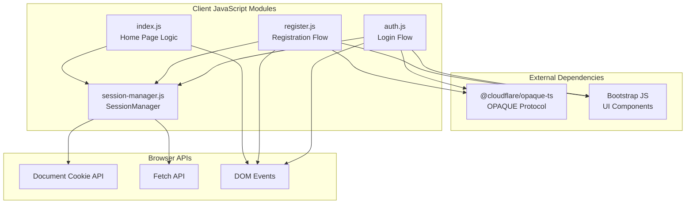
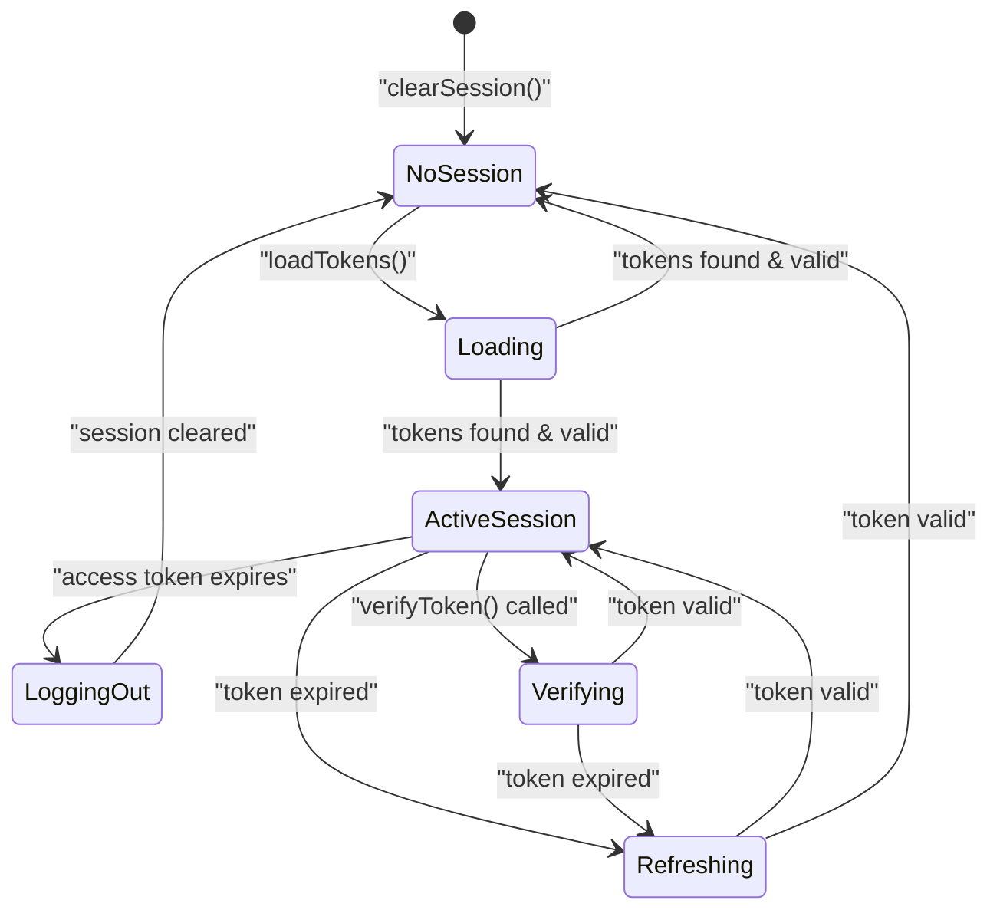
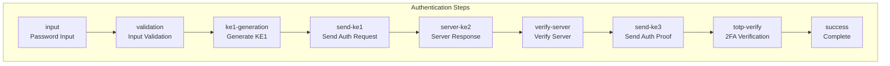
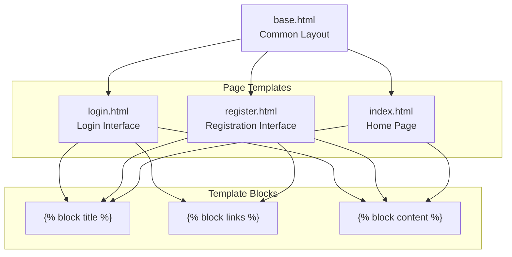
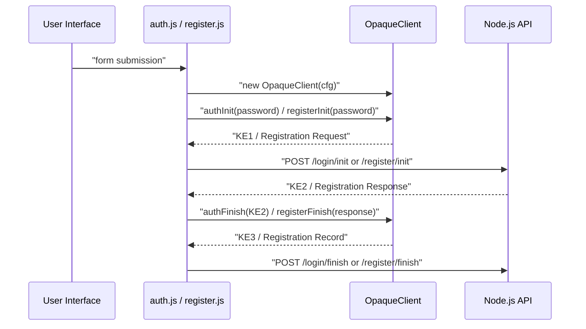

# Client-Side Components

> **Relevant source files**
> * [back-end/src/auth.js](https://github.com/RogueElectron/Cypher/blob/7b7a1583/back-end/src/auth.js)
> * [back-end/src/index.js](https://github.com/RogueElectron/Cypher/blob/7b7a1583/back-end/src/index.js)
> * [back-end/src/register.js](https://github.com/RogueElectron/Cypher/blob/7b7a1583/back-end/src/register.js)
> * [back-end/src/session-manager.js](https://github.com/RogueElectron/Cypher/blob/7b7a1583/back-end/src/session-manager.js)
> * [back-end/static/dist/index.js](https://github.com/RogueElectron/Cypher/blob/7b7a1583/back-end/static/dist/index.js)
> * [back-end/static/dist/session-manager.js](https://github.com/RogueElectron/Cypher/blob/7b7a1583/back-end/static/dist/session-manager.js)
> * [back-end/templates/base.html](https://github.com/RogueElectron/Cypher/blob/7b7a1583/back-end/templates/base.html)
> * [back-end/templates/index.html](https://github.com/RogueElectron/Cypher/blob/7b7a1583/back-end/templates/index.html)
> * [back-end/templates/login.html](https://github.com/RogueElectron/Cypher/blob/7b7a1583/back-end/templates/login.html)
> * [back-end/templates/register.html](https://github.com/RogueElectron/Cypher/blob/7b7a1583/back-end/templates/register.html)

This document covers the frontend JavaScript modules, HTML templates, live visualization system, and user interface components that comprise the client-side architecture of the Cypher authentication system. These components handle user interactions, cryptographic operations, session management, and provide real-time feedback during authentication processes.

For backend service implementations, see [Node.js Internal API](/RogueElectron/Cypher/4.1-node.js-internal-api) and [Flask Session Service](/RogueElectron/Cypher/4.2-flask-session-service). For build system configuration, see [Build System and Assets](/RogueElectron/Cypher/5.1-build-system-and-assets).

## JavaScript Module Architecture

The client-side JavaScript architecture consists of four core modules that handle different aspects of the authentication system:

| Module | Primary Responsibility | Key Classes/Functions |
| --- | --- | --- |
| `auth.js` | Login authentication workflow | `AuthLiveVisualization`, login form handler |
| `register.js` | User registration process | `LiveVisualization`, TOTP setup |
| `session-manager.js` | Token lifecycle management | `SessionManager` |
| `index.js` | Home page logic and user state | Authentication state display |



The modules communicate through ES6 imports and shared session state. Each module handles specific user workflows while maintaining separation of concerns.

**Sources:** [back-end/src/auth.js L1-L7](https://github.com/RogueElectron/Cypher/blob/7b7a1583/back-end/src/auth.js#L1-L7)

 [back-end/src/register.js L1-L10](https://github.com/RogueElectron/Cypher/blob/7b7a1583/back-end/src/register.js#L1-L10)

 [back-end/src/session-manager.js L1-L8](https://github.com/RogueElectron/Cypher/blob/7b7a1583/back-end/src/session-manager.js#L1-L8)

 [back-end/src/index.js L1-L2](https://github.com/RogueElectron/Cypher/blob/7b7a1583/back-end/src/index.js#L1-L2)

## Session Management System

The `SessionManager` class provides centralized token lifecycle management with automatic refresh capabilities:



The `SessionManager` class handles:

* **Token Storage**: Manages access and refresh tokens in secure HTTP cookies [back-end/src/session-manager.js L27-L38](https://github.com/RogueElectron/Cypher/blob/7b7a1583/back-end/src/session-manager.js#L27-L38)
* **Automatic Refresh**: Schedules token refresh 60 seconds before expiry [back-end/src/session-manager.js L61-L69](https://github.com/RogueElectron/Cypher/blob/7b7a1583/back-end/src/session-manager.js#L61-L69)
* **Request Authentication**: Provides `authenticatedFetch()` method with automatic token refresh [back-end/src/session-manager.js L147-L174](https://github.com/RogueElectron/Cypher/blob/7b7a1583/back-end/src/session-manager.js#L147-L174)
* **Session Verification**: Validates tokens with backend service [back-end/src/session-manager.js L122-L145](https://github.com/RogueElectron/Cypher/blob/7b7a1583/back-end/src/session-manager.js#L122-L145)

**Sources:** [back-end/src/session-manager.js L1-L230](https://github.com/RogueElectron/Cypher/blob/7b7a1583/back-end/src/session-manager.js#L1-L230)

## Live Visualization Components

Both authentication flows include sophisticated live visualization systems that show users the security process in real-time:

### Authentication Visualization System

The `AuthLiveVisualization` class manages the login process visualization:



The visualization system provides:

* **Step Activation**: `activateStep(stepId)` highlights current process step [back-end/src/auth.js L114-L129](https://github.com/RogueElectron/Cypher/blob/7b7a1583/back-end/src/auth.js#L114-L129)
* **Progress Tracking**: Visual indicators show completed, active, and pending steps [back-end/src/auth.js L130-L137](https://github.com/RogueElectron/Cypher/blob/7b7a1583/back-end/src/auth.js#L130-L137)
* **Security Messaging**: `updateSecurityStatus()` displays real-time security information [back-end/src/auth.js L139-L152](https://github.com/RogueElectron/Cypher/blob/7b7a1583/back-end/src/auth.js#L139-L152)
* **Data Flow Indicators**: Shows what data is transmitted at each step [back-end/src/auth.js L18-L83](https://github.com/RogueElectron/Cypher/blob/7b7a1583/back-end/src/auth.js#L18-L83)

### Registration Visualization System

The `LiveVisualization` class manages registration process feedback with similar functionality but different step definitions [back-end/src/register.js L12-L76](https://github.com/RogueElectron/Cypher/blob/7b7a1583/back-end/src/register.js#L12-L76)

**Sources:** [back-end/src/auth.js L18-L153](https://github.com/RogueElectron/Cypher/blob/7b7a1583/back-end/src/auth.js#L18-L153)

 [back-end/src/register.js L12-L146](https://github.com/RogueElectron/Cypher/blob/7b7a1583/back-end/src/register.js#L12-L146)

## HTML Template Structure

The template system uses Jinja2 inheritance with a base template and specialized pages:



### Base Template Features

The `base.html` template provides:

* **Dark Theme**: Bootstrap dark theme with custom CSS styling [back-end/templates/base.html L2](https://github.com/RogueElectron/Cypher/blob/7b7a1583/back-end/templates/base.html#L2-L2)
* **Navigation Bar**: Responsive navigation with brand logo [back-end/templates/base.html L20-L44](https://github.com/RogueElectron/Cypher/blob/7b7a1583/back-end/templates/base.html#L20-L44)
* **External Dependencies**: Bootstrap CSS/JS, Bootstrap Icons, Inter font [back-end/templates/base.html L8-L11](https://github.com/RogueElectron/Cypher/blob/7b7a1583/back-end/templates/base.html#L8-L11)
* **Animated Background**: CSS animated background element [back-end/templates/base.html L17](https://github.com/RogueElectron/Cypher/blob/7b7a1583/back-end/templates/base.html#L17-L17)

### Specialized Page Templates

Each page template extends the base and includes:

| Template | JavaScript Module | Key Features |
| --- | --- | --- |
| `login.html` | `dist/auth.js` | Login form, TOTP verification phase, live visualization sidebar |
| `register.html` | `dist/register.js` | Registration form, TOTP setup phase, QR code display |
| `index.html` | `dist/index.js` | Dynamic content based on authentication state |

**Sources:** [back-end/templates/base.html L1-L50](https://github.com/RogueElectron/Cypher/blob/7b7a1583/back-end/templates/base.html#L1-L50)

 [back-end/templates/login.html L1-L248](https://github.com/RogueElectron/Cypher/blob/7b7a1583/back-end/templates/login.html#L1-L248)

 [back-end/templates/register.html L1-L268](https://github.com/RogueElectron/Cypher/blob/7b7a1583/back-end/templates/register.html#L1-L268)

 [back-end/templates/index.html L1-L36](https://github.com/RogueElectron/Cypher/blob/7b7a1583/back-end/templates/index.html#L1-L36)

## Authentication Flow Components

### OPAQUE Protocol Integration

Both authentication modules integrate the OPAQUE protocol through `@cloudflare/opaque-ts`:



### TOTP Integration Components

Both flows include TOTP (Time-based One-Time Password) components:

* **QR Code Display**: Server-generated QR codes for authenticator app setup [back-end/src/register.js L392-L408](https://github.com/RogueElectron/Cypher/blob/7b7a1583/back-end/src/register.js#L392-L408)
* **Input Validation**: Restricts TOTP input to 6 digits [back-end/src/auth.js L465-L473](https://github.com/RogueElectron/Cypher/blob/7b7a1583/back-end/src/auth.js#L465-L473)  [back-end/src/register.js L487-L499](https://github.com/RogueElectron/Cypher/blob/7b7a1583/back-end/src/register.js#L487-L499)
* **Verification Workflow**: Coordinates with Node.js API for TOTP validation [back-end/src/auth.js L415-L435](https://github.com/RogueElectron/Cypher/blob/7b7a1583/back-end/src/auth.js#L415-L435)  [back-end/src/register.js L447-L466](https://github.com/RogueElectron/Cypher/blob/7b7a1583/back-end/src/register.js#L447-L466)

**Sources:** [back-end/src/auth.js L245-L289](https://github.com/RogueElectron/Cypher/blob/7b7a1583/back-end/src/auth.js#L245-L289)

 [back-end/src/register.js L265-L306](https://github.com/RogueElectron/Cypher/blob/7b7a1583/back-end/src/register.js#L265-L306)

## User Interface Components

### Alert System

A centralized alert system provides user feedback:

```javascript
// Utility function used across modules
function showAlert(message, type = 'success', containerId = 'alert-container')
```

The alert system features:

* **Auto-dismissal**: Success messages auto-dismiss after 5 seconds [back-end/src/auth.js L188-L197](https://github.com/RogueElectron/Cypher/blob/7b7a1583/back-end/src/auth.js#L188-L197)
* **Bootstrap Integration**: Uses Bootstrap alert components with icons [back-end/src/auth.js L175-L186](https://github.com/RogueElectron/Cypher/blob/7b7a1583/back-end/src/auth.js#L175-L186)
* **Multiple Containers**: Supports different alert containers for different page phases [back-end/src/register.js L171-L197](https://github.com/RogueElectron/Cypher/blob/7b7a1583/back-end/src/register.js#L171-L197)

### Form Handling

Form components provide:

* **Client-side Validation**: Input validation before submission [back-end/src/register.js L210-L220](https://github.com/RogueElectron/Cypher/blob/7b7a1583/back-end/src/register.js#L210-L220)
* **Loading States**: Button spinners during async operations [back-end/src/auth.js L235-L238](https://github.com/RogueElectron/Cypher/blob/7b7a1583/back-end/src/auth.js#L235-L238)
* **Progressive Enhancement**: JavaScript handles form submission with `action="javascript:void(0)"` [back-end/templates/login.html L26](https://github.com/RogueElectron/Cypher/blob/7b7a1583/back-end/templates/login.html#L26-L26)

### Sidebar Visualization Panel

The live visualization sidebar includes:

* **Toggle Functionality**: Hide/show sidebar controls [back-end/src/auth.js L156-L172](https://github.com/RogueElectron/Cypher/blob/7b7a1583/back-end/src/auth.js#L156-L172)
* **Responsive Design**: Only visible on xl+ breakpoints [back-end/templates/login.html L72](https://github.com/RogueElectron/Cypher/blob/7b7a1583/back-end/templates/login.html#L72-L72)
* **Security Status Indicator**: Real-time security messaging [back-end/templates/login.html L92-L97](https://github.com/RogueElectron/Cypher/blob/7b7a1583/back-end/templates/login.html#L92-L97)

**Sources:** [back-end/src/auth.js L174-L203](https://github.com/RogueElectron/Cypher/blob/7b7a1583/back-end/src/auth.js#L174-L203)

 [back-end/src/register.js L170-L208](https://github.com/RogueElectron/Cypher/blob/7b7a1583/back-end/src/register.js#L170-L208)

 [back-end/templates/login.html L72-L104](https://github.com/RogueElectron/Cypher/blob/7b7a1583/back-end/templates/login.html#L72-L104)

 [back-end/templates/register.html L92-L124](https://github.com/RogueElectron/Cypher/blob/7b7a1583/back-end/templates/register.html#L92-L124)

## Build System Integration

The client-side modules are processed by Vite and output to the `dist/` directory:

| Source Module | Built Output | Size Optimization |
| --- | --- | --- |
| `src/auth.js` | `dist/auth.js` | Minified, bundled |
| `src/register.js` | `dist/register.js` | Minified, bundled |
| `src/session-manager.js` | `dist/session-manager.js` | Minified, exports preserved |
| `src/index.js` | `dist/index.js` | Minified, bundled |

The built modules maintain ES6 module compatibility for inter-module imports while optimizing for production deployment.

**Sources:** [back-end/static/dist/index.js L1-L74](https://github.com/RogueElectron/Cypher/blob/7b7a1583/back-end/static/dist/index.js#L1-L74)

 [back-end/static/dist/session-manager.js L1-L2](https://github.com/RogueElectron/Cypher/blob/7b7a1583/back-end/static/dist/session-manager.js#L1-L2)