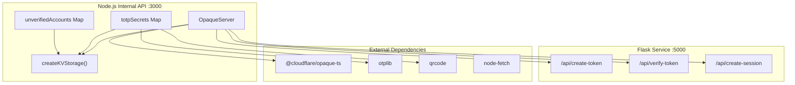
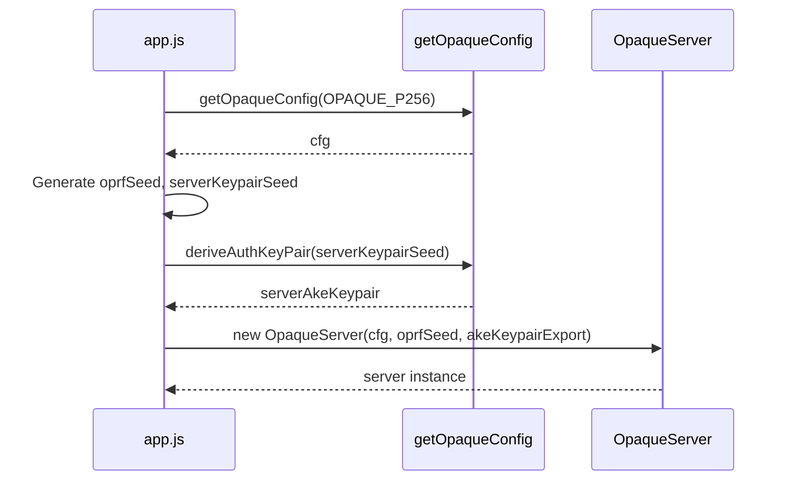
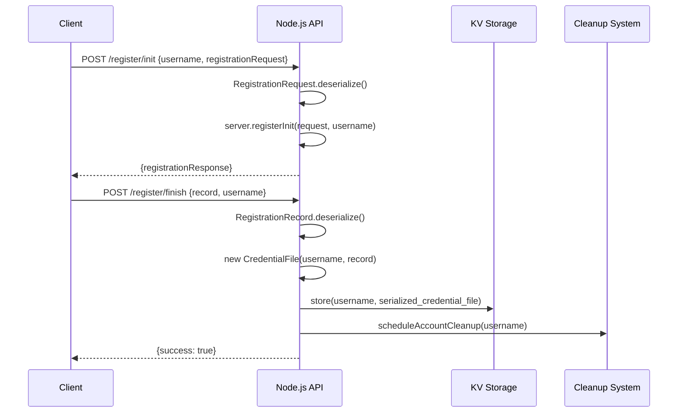
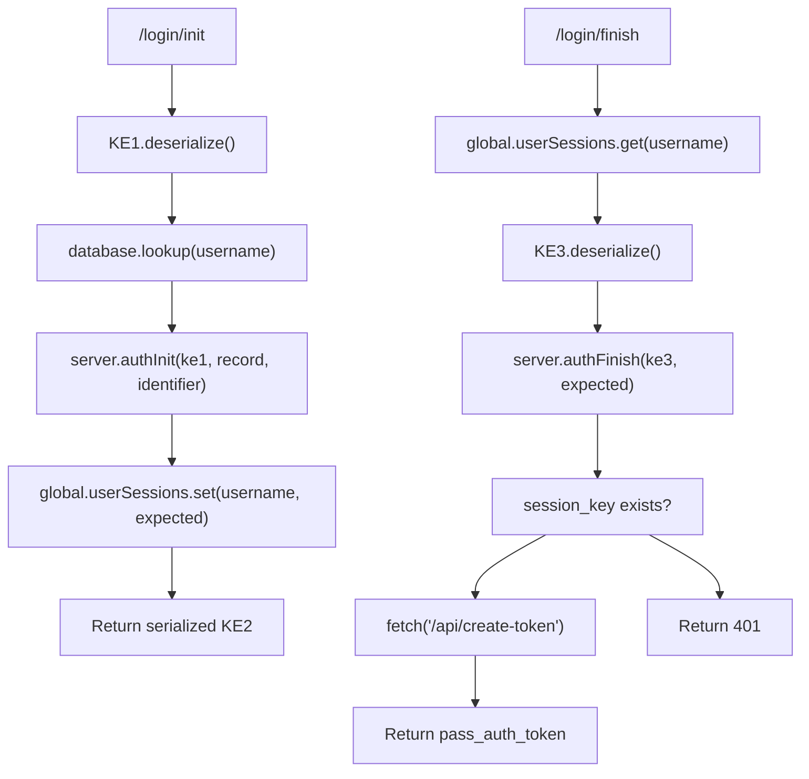
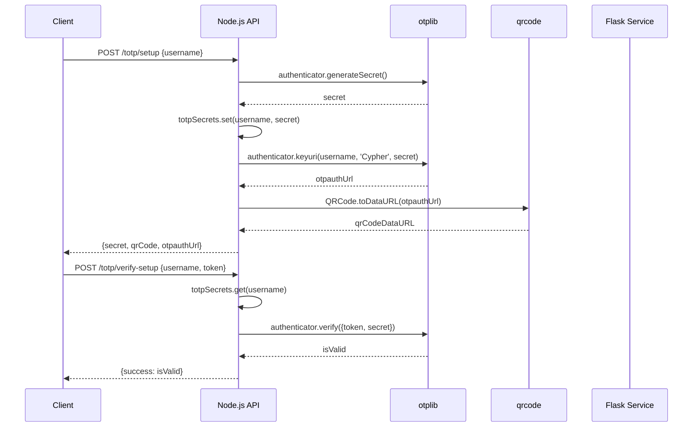
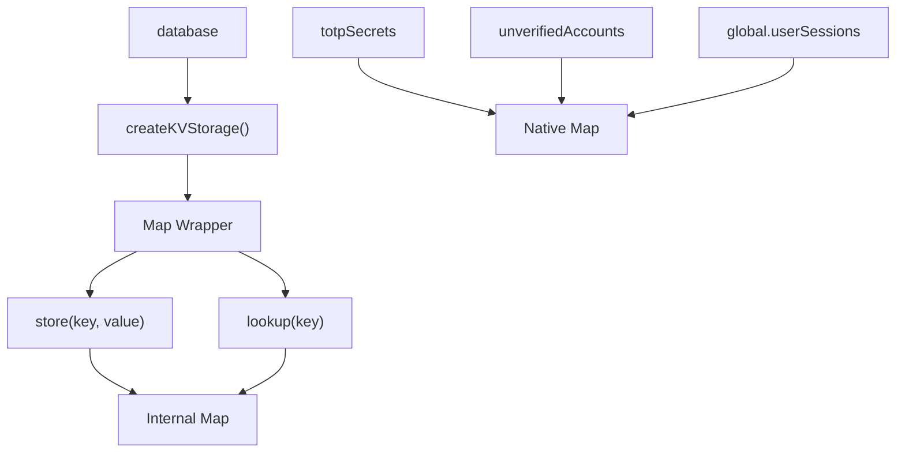
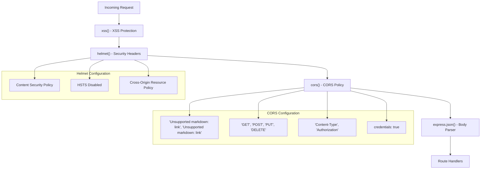
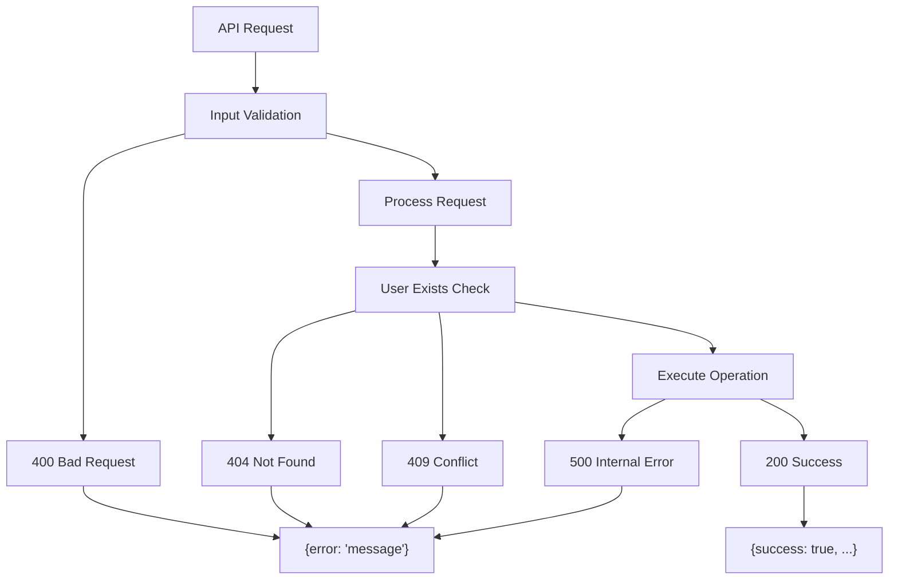

# Node.js Internal API

> **Relevant source files**
> * [back-end/node_internal_api/app.js](https://github.com/RogueElectron/Cypher/blob/7b7a1583/back-end/node_internal_api/app.js)
> * [back-end/node_internal_api/package-lock.json](https://github.com/RogueElectron/Cypher/blob/7b7a1583/back-end/node_internal_api/package-lock.json)
> * [back-end/node_internal_api/package.json](https://github.com/RogueElectron/Cypher/blob/7b7a1583/back-end/node_internal_api/package.json)
> * [back-end/package-lock.json](https://github.com/RogueElectron/Cypher/blob/7b7a1583/back-end/package-lock.json)
> * [back-end/package.json](https://github.com/RogueElectron/Cypher/blob/7b7a1583/back-end/package.json)

## Purpose and Scope

This document provides technical documentation for the Node.js Internal API service, which handles cryptographic authentication operations in the Cypher authentication system. The service implements the OPAQUE password-authenticated key exchange protocol and TOTP two-factor authentication, running on port 3000 as part of the dual-backend architecture.

For information about session token management and the Flask service integration, see [Flask Session Service](/RogueElectron/Cypher/4.2-flask-session-service). For client-side authentication workflow implementation, see [Client-Side Components](/RogueElectron/Cypher/4.3-client-side-components).

## Architecture Overview

The Node.js Internal API serves as the cryptographic core of the Cypher system, handling zero-knowledge password authentication and multi-factor authentication without ever seeing plaintext passwords.

### Core Components

The service is built around several key components implemented in [back-end/node_internal_api/app.js L1-L470](https://github.com/RogueElectron/Cypher/blob/7b7a1583/back-end/node_internal_api/app.js#L1-L470)

:

| Component | Purpose | Implementation |
| --- | --- | --- |
| `OpaqueServer` | OPAQUE protocol handler | Lines 108-112 |
| `database` | KV storage for credentials | Lines 45-61, 79 |
| `totpSecrets` | TOTP secret management | Line 80 |
| `unverifiedAccounts` | Account cleanup tracking | Line 81 |



Sources: [back-end/node_internal_api/app.js L1-L112](https://github.com/RogueElectron/Cypher/blob/7b7a1583/back-end/node_internal_api/app.js#L1-L112)

 [back-end/node_internal_api/package.json L11-L21](https://github.com/RogueElectron/Cypher/blob/7b7a1583/back-end/node_internal_api/package.json#L11-L21)

## OPAQUE Protocol Implementation

The service implements the OPAQUE protocol using the P256 curve configuration for zero-knowledge password authentication.

### Server Initialization

The OPAQUE server is initialized with cryptographic keys and configuration:



Sources: [back-end/node_internal_api/app.js L74-L112](https://github.com/RogueElectron/Cypher/blob/7b7a1583/back-end/node_internal_api/app.js#L74-L112)

### Registration Flow

The OPAQUE registration process involves two endpoints:

| Endpoint | Method | Purpose | Key Functions |
| --- | --- | --- | --- |
| `/register/init` | POST | Initialize registration | `server.registerInit()` |
| `/register/finish` | POST | Complete registration | Store `CredentialFile` |

#### Registration Process Flow



Sources: [back-end/node_internal_api/app.js L118-L192](https://github.com/RogueElectron/Cypher/blob/7b7a1583/back-end/node_internal_api/app.js#L118-L192)

### Authentication Flow

OPAQUE authentication uses a three-message protocol through two endpoints:

| Endpoint | Method | OPAQUE Stage | Key Operations |
| --- | --- | --- | --- |
| `/login/init` | POST | KE1 → KE2 | `server.authInit()` |
| `/login/finish` | POST | KE3 → Session | `server.authFinish()` |

#### Authentication Process Detail



Sources: [back-end/node_internal_api/app.js L194-L298](https://github.com/RogueElectron/Cypher/blob/7b7a1583/back-end/node_internal_api/app.js#L194-L298)

## TOTP Implementation

The service provides complete TOTP functionality for two-factor authentication using the `otplib` library.

### TOTP Endpoints

| Endpoint | Purpose | Key Function | Response |
| --- | --- | --- | --- |
| `/totp/setup` | Generate TOTP secret | `authenticator.generateSecret()` | QR code + secret |
| `/totp/verify-setup` | Verify initial TOTP | `authenticator.verify()` | Success/failure |
| `/totp/verify-login` | Verify login TOTP | Token validation + session creation | Session tokens |

### TOTP Setup Flow



Sources: [back-end/node_internal_api/app.js L302-L361](https://github.com/RogueElectron/Cypher/blob/7b7a1583/back-end/node_internal_api/app.js#L302-L361)

## Data Storage and Management

The service uses in-memory storage for development and testing purposes.

### KV Storage Implementation



Sources: [back-end/node_internal_api/app.js L45-L61](https://github.com/RogueElectron/Cypher/blob/7b7a1583/back-end/node_internal_api/app.js#L45-L61)

 [back-end/node_internal_api/app.js L79-L81](https://github.com/RogueElectron/Cypher/blob/7b7a1583/back-end/node_internal_api/app.js#L79-L81)

### Account Lifecycle Management

The service implements automatic cleanup for unverified accounts:

| Component | Purpose | Timeout |
| --- | --- | --- |
| `scheduleAccountCleanup()` | Schedule account deletion | 5 minutes |
| `cleanupUnverifiedAccount()` | Remove account data | Immediate |
| `VERIFICATION_TIMEOUT` | Cleanup timeout constant | 300000ms |

Sources: [back-end/node_internal_api/app.js L82-L101](https://github.com/RogueElectron/Cypher/blob/7b7a1583/back-end/node_internal_api/app.js#L82-L101)

## Security Configuration

The service implements multiple security layers through middleware and configuration.

### Security Middleware Stack



Sources: [back-end/node_internal_api/app.js L23-L72](https://github.com/RogueElectron/Cypher/blob/7b7a1583/back-end/node_internal_api/app.js#L23-L72)

## Flask Service Integration

The Node.js API integrates with the Flask service for token management operations.

### Token Management Flow

```mermaid
sequenceDiagram
  participant Node.js API
  participant Flask Service :5000

  note over Node.js API,Flask Service :5000: After successful OPAQUE authentication
  Node.js API->>Flask Service :5000: POST /api/create-token {username}
  Flask Service :5000-->>Node.js API: {token: pass_auth_token}
  note over Node.js API,Flask Service :5000: During TOTP verification
  Node.js API->>Flask Service :5000: POST /api/verify-token {token, username}
  Flask Service :5000-->>Node.js API: {valid: boolean}
  note over Node.js API,Flask Service :5000: After successful TOTP
  Node.js API->>Flask Service :5000: POST /api/create-session {username}
  Flask Service :5000-->>Node.js API: {access_token, refresh_token, expires_in}
```

Sources: [back-end/node_internal_api/app.js L256-L288](https://github.com/RogueElectron/Cypher/blob/7b7a1583/back-end/node_internal_api/app.js#L256-L288)

 [back-end/node_internal_api/app.js L376-L455](https://github.com/RogueElectron/Cypher/blob/7b7a1583/back-end/node_internal_api/app.js#L376-L455)

## Dependencies and Package Management

The service relies on several key Node.js packages for cryptographic and web functionality.

### Core Dependencies

| Package | Version | Purpose | Usage |
| --- | --- | --- | --- |
| `@cloudflare/opaque-ts` | ^0.7.5 | OPAQUE protocol | Authentication |
| `otplib` | ^12.0.1 | TOTP implementation | 2FA |
| `qrcode` | ^1.5.3 | QR code generation | TOTP setup |
| `express` | ^4.18.2 | Web framework | API endpoints |
| `node-fetch` | ^3.3.2 | HTTP requests | Flask integration |

### Security Dependencies

| Package | Purpose | Configuration |
| --- | --- | --- |
| `helmet` | Security headers | CSP, CORP policies |
| `xss-clean` | XSS protection | Request sanitization |
| `cors` | Cross-origin policy | Flask service whitelist |

Sources: [back-end/node_internal_api/package.json L11-L29](https://github.com/RogueElectron/Cypher/blob/7b7a1583/back-end/node_internal_api/package.json#L11-L29)

## Error Handling and Validation

The service implements comprehensive error handling across all endpoints with consistent response patterns.

### Error Response Patterns



Sources: [back-end/node_internal_api/app.js L125-L148](https://github.com/RogueElectron/Cypher/blob/7b7a1583/back-end/node_internal_api/app.js#L125-L148)

 [back-end/node_internal_api/app.js L306-L333](https://github.com/RogueElectron/Cypher/blob/7b7a1583/back-end/node_internal_api/app.js#L306-L333)