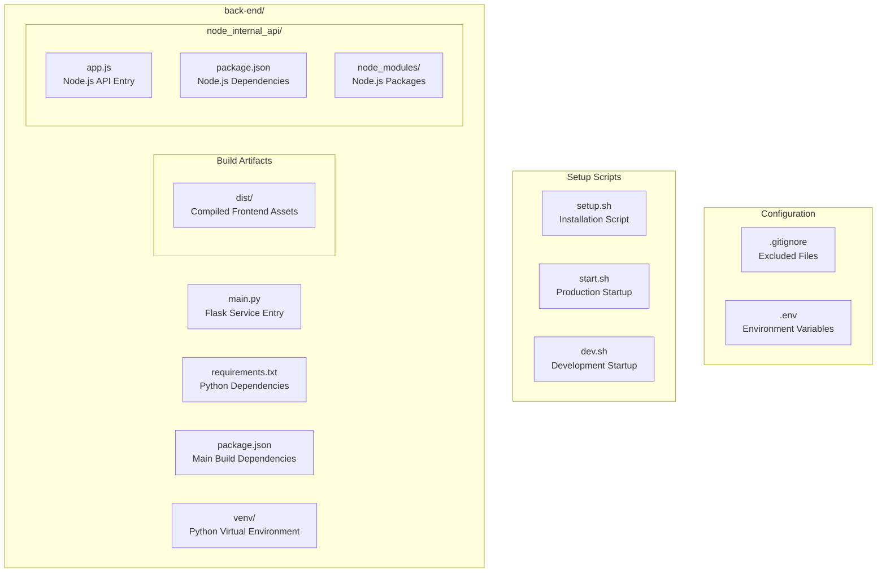
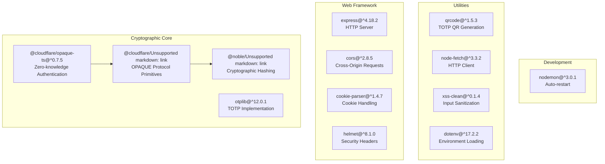
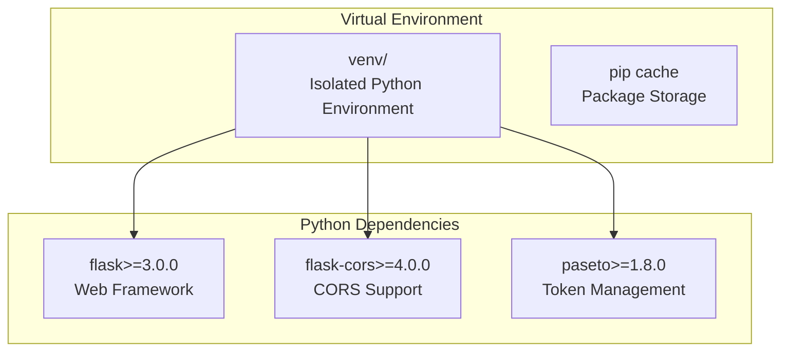
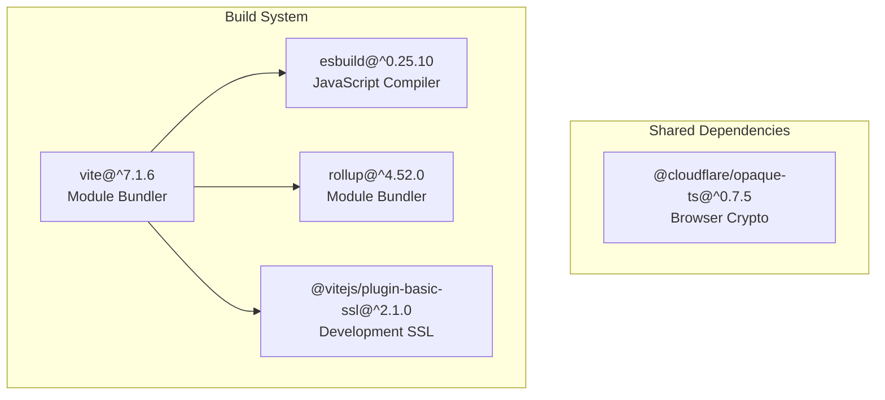
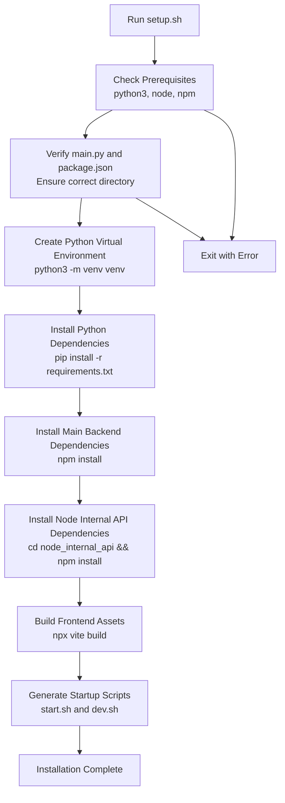
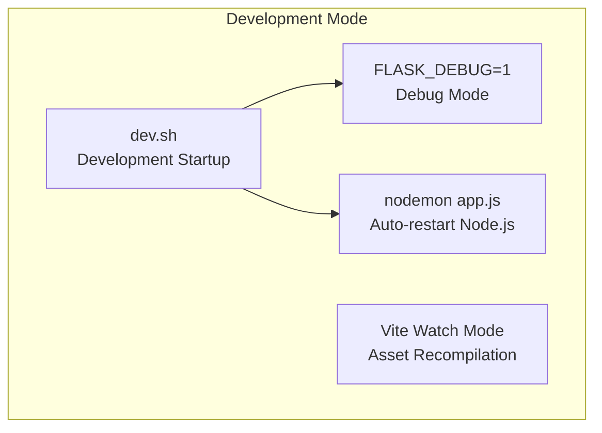
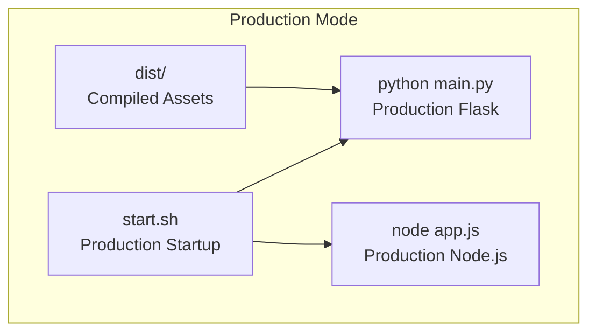

# Setup and Dependencies

> **Relevant source files**
> * [.gitignore](https://github.com/RogueElectron/Cypher/blob/7b7a1583/.gitignore)
> * [back-end/node_internal_api/package-lock.json](https://github.com/RogueElectron/Cypher/blob/7b7a1583/back-end/node_internal_api/package-lock.json)
> * [back-end/package-lock.json](https://github.com/RogueElectron/Cypher/blob/7b7a1583/back-end/package-lock.json)
> * [back-end/package.json](https://github.com/RogueElectron/Cypher/blob/7b7a1583/back-end/package.json)
> * [back-end/requirements.txt](https://github.com/RogueElectron/Cypher/blob/7b7a1583/back-end/requirements.txt)
> * [back-end/setup.sh](https://github.com/RogueElectron/Cypher/blob/7b7a1583/back-end/setup.sh)

This document provides a comprehensive guide to setting up the Cypher authentication system development environment and understanding its dependency architecture. It covers the installation process, dependency management for the dual-backend architecture, and configuration requirements for both development and production environments.

For information about the build system and asset compilation, see [Build System and Assets](/RogueElectron/Cypher/5.1-build-system-and-assets). For implementation details of the individual services, see [Implementation Details](/RogueElectron/Cypher/4-implementation-details).

## System Prerequisites

The Cypher authentication system requires specific runtime environments for its dual-backend architecture:

| Requirement | Version | Purpose |
| --- | --- | --- |
| Python 3 | >=3.x | Flask session service runtime |
| Node.js | >=14.0.0 | Internal API and build tooling |
| npm | Latest | Package management |

The Node.js version requirement is enforced in [back-end/node_internal_api/package-lock.json L25-L27](https://github.com/RogueElectron/Cypher/blob/7b7a1583/back-end/node_internal_api/package-lock.json#L25-L27)

 through the `engines` field.

Sources: [back-end/setup.sh L26-L38](https://github.com/RogueElectron/Cypher/blob/7b7a1583/back-end/setup.sh#L26-L38)

 [back-end/node_internal_api/package-lock.json L25-L27](https://github.com/RogueElectron/Cypher/blob/7b7a1583/back-end/node_internal_api/package-lock.json#L25-L27)

## Project Structure Overview

Sources: [.gitignore L1-L6](https://github.com/RogueElectron/Cypher/blob/7b7a1583/.gitignore#L1-L6)

 [back-end/setup.sh L61-L96](https://github.com/RogueElectron/Cypher/blob/7b7a1583/back-end/setup.sh#L61-L96)

## Dependency Architecture

The system employs a multi-layered dependency structure across three distinct runtime environments:

### Node.js Internal API Dependencies

The Node.js service handles all cryptographic operations, with `@cloudflare/opaque-ts` providing the core zero-knowledge authentication protocol implementation. The `otplib` package manages TOTP generation and verification for two-factor authentication.

Sources: [back-end/node_internal_api/package-lock.json L10-L27](https://github.com/RogueElectron/Cypher/blob/7b7a1583/back-end/node_internal_api/package-lock.json#L10-L27)

 [back-end/node_internal_api/package-lock.json L52-L93](https://github.com/RogueElectron/Cypher/blob/7b7a1583/back-end/node_internal_api/package-lock.json#L52-L93)

### Flask Service Dependencies

The Flask service manages session tokens using PASETO (Platform-Agnostic Security Tokens) for secure, stateless authentication tokens with built-in expiration and refresh capabilities.

Sources: [back-end/requirements.txt L1-L4](https://github.com/RogueElectron/Cypher/blob/7b7a1583/back-end/requirements.txt#L1-L4)

 [back-end/setup.sh L41-L48](https://github.com/RogueElectron/Cypher/blob/7b7a1583/back-end/setup.sh#L41-L48)

### Frontend Build Dependencies

The frontend build system uses Vite for fast development builds and production bundling, with the same OPAQUE library available for client-side cryptographic operations.

Sources: [back-end/package.json L1-L16](https://github.com/RogueElectron/Cypher/blob/7b7a1583/back-end/package.json#L1-L16)

 [back-end/package-lock.json L746-L757](https://github.com/RogueElectron/Cypher/blob/7b7a1583/back-end/package-lock.json#L746-L757)

## Installation Process Flow

The installation script [back-end/setup.sh L1-L97](https://github.com/RogueElectron/Cypher/blob/7b7a1583/back-end/setup.sh#L1-L97)

 performs environment validation, dependency installation across both backend services, frontend compilation, and startup script generation in a single automated process.

Sources: [back-end/setup.sh L23-L60](https://github.com/RogueElectron/Cypher/blob/7b7a1583/back-end/setup.sh#L23-L60)

## Development vs Production Configuration

### Development Environment

The development setup enables hot-reloading and debugging features:

Development startup script automatically activates the Python virtual environment and runs both services with development-specific configurations.

Sources: [back-end/setup.sh L78-L91](https://github.com/RogueElectron/Cypher/blob/7b7a1583/back-end/setup.sh#L78-L91)

### Production Environment

The production configuration optimizes for performance and security:

Production deployment serves pre-compiled static assets and runs both backend services without development tooling overhead.

Sources: [back-end/setup.sh L63-L77](https://github.com/RogueElectron/Cypher/blob/7b7a1583/back-end/setup.sh#L63-L77)

## Environment Configuration

### Ignored Files and Security

The `.gitignore` configuration ensures sensitive files and build artifacts remain excluded from version control:

| Path Pattern | Purpose |
| --- | --- |
| `/cyvenv` | Python virtual environment |
| `/back-end/node_modules` | Node.js dependencies |
| `/back-end/__pycache__` | Python bytecode cache |
| `/back-end/.env` | Environment variables |
| `/back-end/cypher_users.db` | User database |

Sources: [.gitignore L1-L6](https://github.com/RogueElectron/Cypher/blob/7b7a1583/.gitignore#L1-L6)

### Service Ports and Communication

The dual-backend architecture operates on distinct ports:

* **Flask Service**: `http://127.0.0.1:5000` - Session management and template serving
* **Node.js Internal API**: `http://localhost:3000` - Cryptographic operations and TOTP handling

Inter-service communication occurs through HTTP requests, with the Node.js service creating tokens that the Flask service validates and manages.

Sources: [back-end/setup.sh L72](https://github.com/RogueElectron/Cypher/blob/7b7a1583/back-end/setup.sh#L72-L72)

 [back-end/setup.sh L87](https://github.com/RogueElectron/Cypher/blob/7b7a1583/back-end/setup.sh#L87-L87)