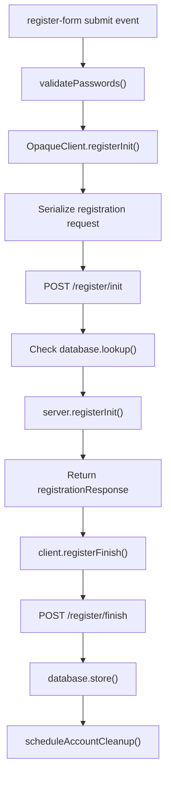
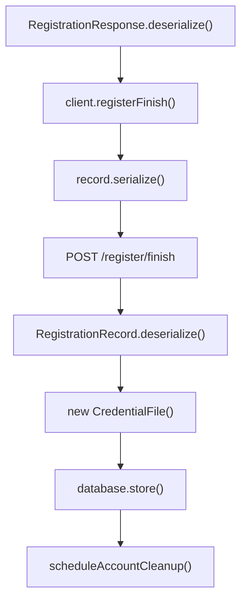
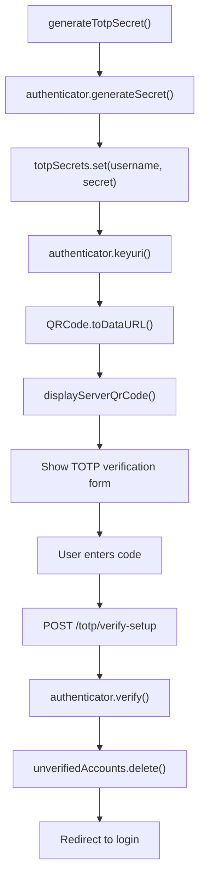
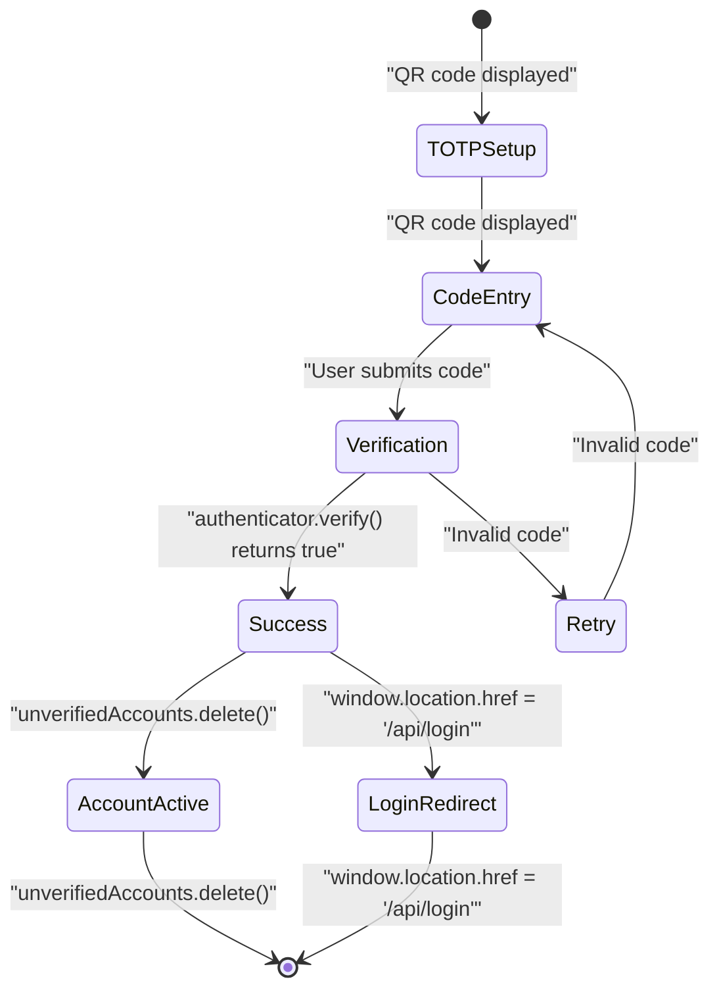
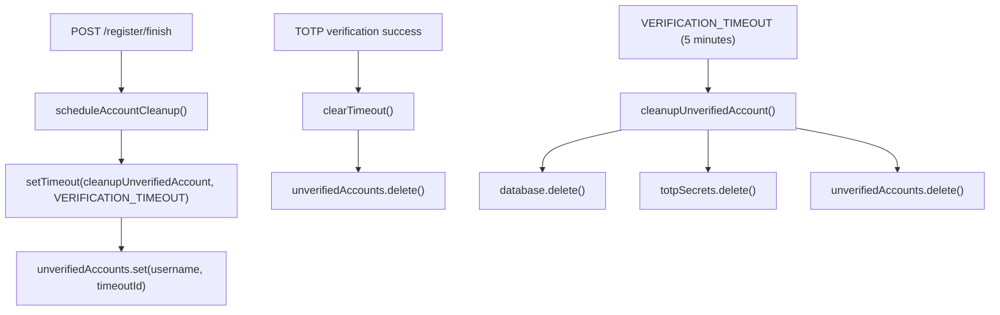
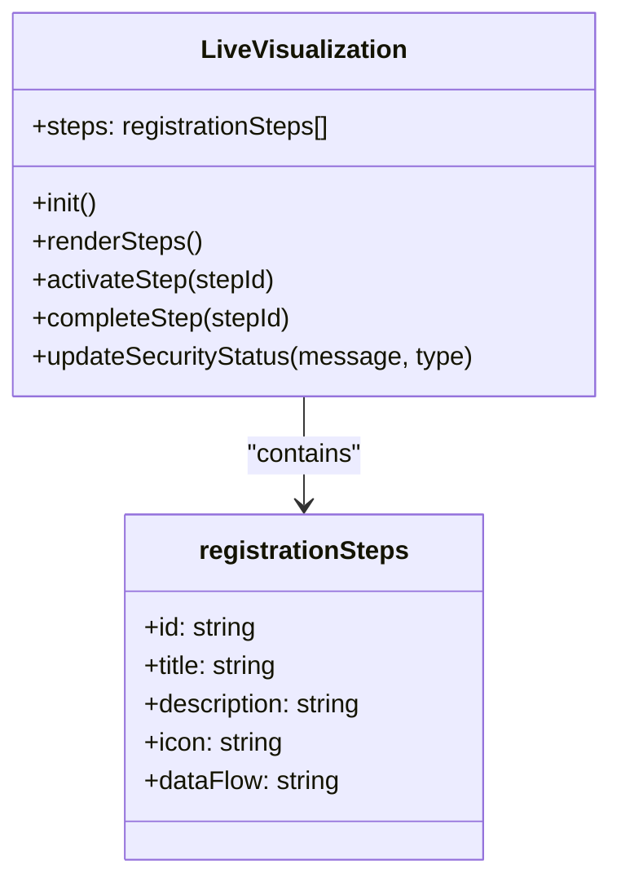
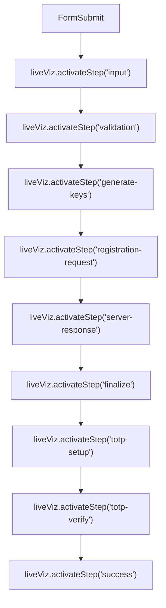

# User Registration Process

> **Relevant source files**
> * [back-end/node_internal_api/app.js](https://github.com/RogueElectron/Cypher/blob/7b7a1583/back-end/node_internal_api/app.js)
> * [back-end/src/register.js](https://github.com/RogueElectron/Cypher/blob/7b7a1583/back-end/src/register.js)
> * [back-end/static/dist/register.js](https://github.com/RogueElectron/Cypher/blob/7b7a1583/back-end/static/dist/register.js)
> * [back-end/templates/register.html](https://github.com/RogueElectron/Cypher/blob/7b7a1583/back-end/templates/register.html)

This document details the complete user registration workflow in the Cypher authentication system, including OPAQUE protocol registration, TOTP two-factor authentication setup, and live visualization components. The registration process implements zero-knowledge password authentication where user passwords are never transmitted in plaintext to the server.

For information about the login workflow, see [User Login Process](/RogueElectron/Cypher/3.2-user-login-process). For session management after registration, see [Session Management](/RogueElectron/Cypher/3.3-session-management).

## Registration Flow Overview

The user registration process consists of two main phases: OPAQUE protocol registration and TOTP setup. The system uses a dual-backend architecture where the Node.js Internal API handles cryptographic operations while the Flask service manages session tokens.

```

```

Sources: [back-end/node_internal_api/app.js L118-L192](https://github.com/RogueElectron/Cypher/blob/7b7a1583/back-end/node_internal_api/app.js#L118-L192)

 [back-end/src/register.js L222-L500](https://github.com/RogueElectron/Cypher/blob/7b7a1583/back-end/src/register.js#L222-L500)

## OPAQUE Registration Phase

The OPAQUE registration implements zero-knowledge password authentication where the server never sees the user's actual password. The process involves cryptographic blinding and key exchange operations.

### Registration Initialization

The registration begins when the user submits the form. The client-side `OpaqueClient` generates a blinded registration request:



The registration request is processed by the Node.js API at the `/register/init` endpoint, which deserializes the request and calls the OPAQUE server's registration initialization:

| Step | Client Action | Server Action | Data Flow |
| --- | --- | --- | --- |
| 1 | `client.registerInit(password)` | - | Password blinded locally |
| 2 | `POST /register/init` | `RegistrationRequest.deserialize()` | Blinded request sent |
| 3 | - | `server.registerInit(request, username)` | Server processes without seeing password |
| 4 | `RegistrationResponse.deserialize()` | `registrationResponse.serialize()` | Response returned |

Sources: [back-end/src/register.js L261-L283](https://github.com/RogueElectron/Cypher/blob/7b7a1583/back-end/src/register.js#L261-L283)

 [back-end/node_internal_api/app.js L118-L149](https://github.com/RogueElectron/Cypher/blob/7b7a1583/back-end/node_internal_api/app.js#L118-L149)

### Registration Completion

The client completes the OPAQUE registration by processing the server response and generating a registration record:



The server stores the registration record as a `CredentialFile` and schedules cleanup in case TOTP verification fails within the timeout period.

Sources: [back-end/src/register.js L304-L344](https://github.com/RogueElectron/Cypher/blob/7b7a1583/back-end/src/register.js#L304-L344)

 [back-end/node_internal_api/app.js L151-L192](https://github.com/RogueElectron/Cypher/blob/7b7a1583/back-end/node_internal_api/app.js#L151-L192)

## TOTP Setup Phase

After successful OPAQUE registration, the system automatically initiates TOTP (Time-based One-Time Password) setup for two-factor authentication. This phase is mandatory and must be completed to finalize account creation.

### TOTP Secret Generation

The system generates a TOTP secret and creates a QR code for easy setup with authenticator apps:



The TOTP setup process involves several key components:

| Component | Function | Location |
| --- | --- | --- |
| `totpSecrets` | Stores temporary TOTP secrets | [app.js L80](https://github.com/RogueElectron/Cypher/blob/7b7a1583/app.js#L80-L80) |
| `unverifiedAccounts` | Tracks accounts pending verification | [app.js L81](https://github.com/RogueElectron/Cypher/blob/7b7a1583/app.js#L81-L81) |
| `authenticator.generateSecret()` | Generates TOTP secret | [app.js L310](https://github.com/RogueElectron/Cypher/blob/7b7a1583/app.js#L310-L310) |
| `QRCode.toDataURL()` | Creates QR code image | [app.js L319](https://github.com/RogueElectron/Cypher/blob/7b7a1583/app.js#L319-L319) |

Sources: [back-end/src/register.js L357-L389](https://github.com/RogueElectron/Cypher/blob/7b7a1583/back-end/src/register.js#L357-L389)

 [back-end/node_internal_api/app.js L302-L334](https://github.com/RogueElectron/Cypher/blob/7b7a1583/back-end/node_internal_api/app.js#L302-L334)

### TOTP Verification

The user must verify their TOTP setup by entering a code from their authenticator app:



The verification endpoint validates the TOTP code and completes the registration process by removing the account from the unverified accounts list.

Sources: [back-end/src/register.js L418-L485](https://github.com/RogueElectron/Cypher/blob/7b7a1583/back-end/src/register.js#L418-L485)

 [back-end/node_internal_api/app.js L336-L361](https://github.com/RogueElectron/Cypher/blob/7b7a1583/back-end/node_internal_api/app.js#L336-L361)

## Account Verification and Cleanup

The system implements automatic cleanup for accounts that fail to complete TOTP verification within the timeout period.

### Cleanup Mechanism



The cleanup system uses these key functions:

* `scheduleAccountCleanup(username)`: Sets 5-minute timeout for account verification
* `cleanupUnverifiedAccount(username)`: Removes all traces of unverified account
* `VERIFICATION_TIMEOUT`: 5 minutes (300,000 ms) timeout constant

Sources: [back-end/node_internal_api/app.js L84-L101](https://github.com/RogueElectron/Cypher/blob/7b7a1583/back-end/node_internal_api/app.js#L84-L101)

## Live Visualization System

The registration process includes a real-time visualization system that shows users the security process steps as they occur.

### Visualization Components

The `LiveVisualization` class manages the step-by-step display of the registration process:



The visualization system displays nine distinct steps:

1. `input` - Password Input
2. `validation` - Input Validation
3. `generate-keys` - Generate Keys
4. `registration-request` - Registration Request
5. `server-response` - Server Response
6. `finalize` - Finalize Registration
7. `totp-setup` - 2FA Setup
8. `totp-verify` - Verify 2FA
9. `success` - Registration Complete

Sources: [back-end/src/register.js L12-L76](https://github.com/RogueElectron/Cypher/blob/7b7a1583/back-end/src/register.js#L12-L76)

 [back-end/src/register.js L79-L146](https://github.com/RogueElectron/Cypher/blob/7b7a1583/back-end/src/register.js#L79-L146)

### Step Activation Flow

The visualization activates steps in sequence as the registration proceeds:



Sources: [back-end/src/register.js L233-L470](https://github.com/RogueElectron/Cypher/blob/7b7a1583/back-end/src/register.js#L233-L470)

## Error Handling and User Feedback

The registration system implements comprehensive error handling with user-friendly feedback mechanisms.

### Error Types and Responses

| Error Type | Validation | Response Function | User Feedback |
| --- | --- | --- | --- |
| Missing fields | Client-side | `showAlert()` | "Please fill in all fields!" |
| Password mismatch | `validatePasswords()` | `showAlert()` | "Passwords do not match!" |
| Weak password | `validatePasswords()` | `showAlert()` | "Password must be at least 8 characters long!" |
| Username exists | Server `/register/init` | HTTP 409 | "Username already exists" |
| TOTP invalid | `authenticator.verify()` | `showAlert()` | "Invalid TOTP code" |

The `showAlert()` function provides consistent error and success messaging throughout the registration flow, with automatic dismissal for success messages after 5 seconds.

Sources: [back-end/src/register.js L171-L197](https://github.com/RogueElectron/Cypher/blob/7b7a1583/back-end/src/register.js#L171-L197)

 [back-end/src/register.js L210-L220](https://github.com/RogueElectron/Cypher/blob/7b7a1583/back-end/src/register.js#L210-L220)

 [back-end/node_internal_api/app.js L125-L137](https://github.com/RogueElectron/Cypher/blob/7b7a1583/back-end/node_internal_api/app.js#L125-L137)