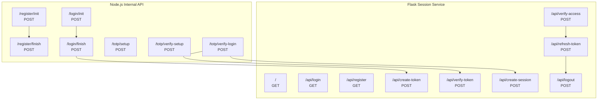
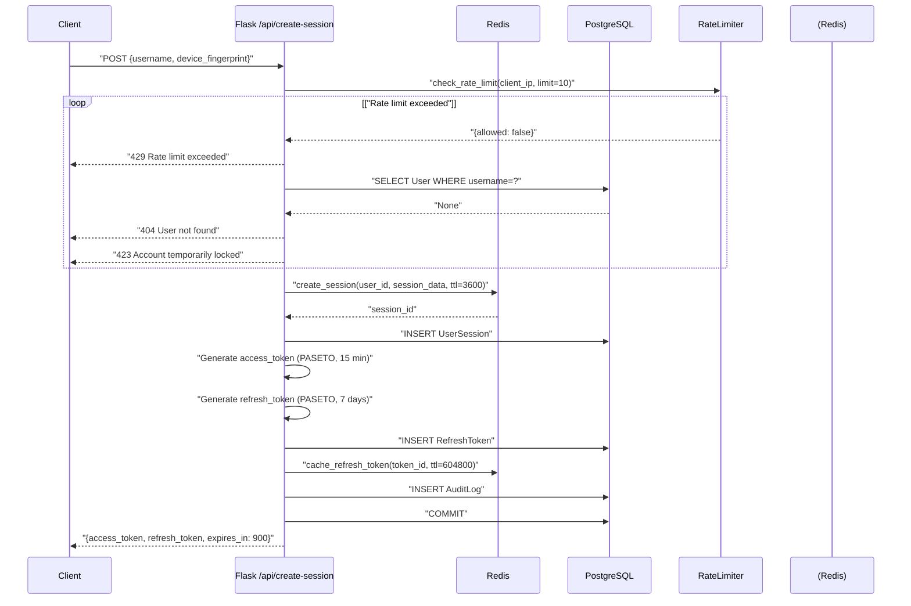

# API Reference

> **Relevant source files**
> * [back-end/main.py](https://github.com/RogueElectron/Cypher1/blob/c60431e6/back-end/main.py)
> * [back-end/node_internal_api/app.js](https://github.com/RogueElectron/Cypher1/blob/c60431e6/back-end/node_internal_api/app.js)

This document provides a complete reference for all HTTP API endpoints in the Cypher authentication platform. The system exposes two distinct API services: the **Node.js Internal API** (port 3000) for cryptographic operations (OPAQUE and TOTP), and the **Flask Session Service** (port 5000) for token management and frontend delivery.

For detailed implementation of authentication workflows using these endpoints, see [Authentication Workflows](/RogueElectron/Cypher1/3.4-authentication-workflows). For client-side usage patterns, see [Registration Flow](/RogueElectron/Cypher1/5.1-registration-flow-(client-side)), [Login Flow](/RogueElectron/Cypher1/5.2-login-flow-(client-side)), and [Session Manager Module](/RogueElectron/Cypher1/5.3-session-manager-module).

---

## Service Architecture

The Cypher platform separates API responsibilities across two backend services to isolate cryptographic operations from session management:

**API Service Endpoints**



**Sources:** [back-end/node_internal_api/app.js L1-L501](https://github.com/RogueElectron/Cypher1/blob/c60431e6/back-end/node_internal_api/app.js#L1-L501)

 [back-end/main.py L1-L564](https://github.com/RogueElectron/Cypher1/blob/c60431e6/back-end/main.py#L1-L564)

---

## Base URLs

| Service | Port | Base URL (Development) | Purpose |
| --- | --- | --- | --- |
| Node.js Internal API | 3000 | `http://localhost:3000` | OPAQUE protocol, TOTP operations |
| Flask Session Service | 5000 | `http://localhost:5000` | Token management, session control, frontend |

**CORS Configuration:**

* Both services accept requests from `http://localhost:5000` and `http://127.0.0.1:5000`
* Credentials enabled for cross-origin requests
* Configured in [back-end/node_internal_api/app.js L72-L77](https://github.com/RogueElectron/Cypher1/blob/c60431e6/back-end/node_internal_api/app.js#L72-L77)  and [back-end/main.py L29](https://github.com/RogueElectron/Cypher1/blob/c60431e6/back-end/main.py#L29-L29)

**Sources:** [back-end/node_internal_api/app.js L499-L501](https://github.com/RogueElectron/Cypher1/blob/c60431e6/back-end/node_internal_api/app.js#L499-L501)

 [back-end/main.py L562-L563](https://github.com/RogueElectron/Cypher1/blob/c60431e6/back-end/main.py#L562-L563)

---

## Node.js Internal API (Port 3000)

### Registration Endpoints

#### POST /register/init

Initiates OPAQUE password registration by processing the client's `RegistrationRequest` and returning a `RegistrationResponse`.

**Request Body:**

```json
{
  "username": "string (required)",
  "registrationRequest": "Uint8Array (serialized, required)"
}
```

**Response (200 OK):**

```json
{
  "registrationResponse": "Uint8Array (serialized)"
}
```

**Error Responses:**

| Status | Error Message | Condition |
| --- | --- | --- |
| 400 | "Missing required fields: username and registrationRequest" | Missing request parameters |
| 409 | "Username already exists" | Username already registered |
| 500 | "Registration initialization failed" | Server-side OPAQUE error |
| 503 | "Server not initialized yet" | OPAQUE server not ready |

**Implementation:** [back-end/node_internal_api/app.js L143-L175](https://github.com/RogueElectron/Cypher1/blob/c60431e6/back-end/node_internal_api/app.js#L143-L175)

**Sources:** [back-end/node_internal_api/app.js L143-L175](https://github.com/RogueElectron/Cypher1/blob/c60431e6/back-end/node_internal_api/app.js#L143-L175)

---

#### POST /register/finish

Completes OPAQUE registration by storing the `RegistrationRecord` (OPAQUE credential file) in the database.

**Request Body:**

```json
{
  "username": "string (required)",
  "record": "Uint8Array (serialized RegistrationRecord, required)"
}
```

**Response (200 OK):**

```json
{
  "success": true,
  "message": "Registration completed successfully"
}
```

**Error Responses:**

| Status | Error Message | Condition |
| --- | --- | --- |
| 400 | "Missing required fields: record and username" | Missing request parameters |
| 409 | "Username already exists" | Username already registered |
| 500 | "Registration completion failed" / "Failed to store user credentials" | Database storage failure |

**Side Effects:**

* Stores serialized `CredentialFile` in PostgreSQL `users` table
* Schedules account cleanup after 5 minutes if TOTP not verified
* Sets `unverifiedAccounts` timeout at [back-end/node_internal_api/app.js L103-L111](https://github.com/RogueElectron/Cypher1/blob/c60431e6/back-end/node_internal_api/app.js#L103-L111)

**Implementation:** [back-end/node_internal_api/app.js L177-L220](https://github.com/RogueElectron/Cypher1/blob/c60431e6/back-end/node_internal_api/app.js#L177-L220)

**Sources:** [back-end/node_internal_api/app.js L177-L220](https://github.com/RogueElectron/Cypher1/blob/c60431e6/back-end/node_internal_api/app.js#L177-L220)

 [back-end/node_internal_api/app.js L92-L111](https://github.com/RogueElectron/Cypher1/blob/c60431e6/back-end/node_internal_api/app.js#L92-L111)

---

### Login Endpoints

#### POST /login/init

Initiates OPAQUE authentication by processing the client's `KE1` message and returning `KE2`.

**Request Body:**

```json
{
  "username": "string (required)",
  "serke1": "Uint8Array (serialized KE1, required)"
}
```

**Response (200 OK):**

```json
{
  "ser_ke2": "Uint8Array (serialized KE2)"
}
```

**Error Responses:**

| Status | Error Message | Condition |
| --- | --- | --- |
| 400 | "Missing required fields: serke1 and username" | Missing request parameters |
| 404 | "client not registered in database" | User not found |
| 500 | "Login initialization failed" | Server-side OPAQUE error |

**Side Effects:**

* Stores `expected` value in `global.userSessions` Map for verification in `/login/finish`
* Session state stored at [back-end/node_internal_api/app.js L246-L248](https://github.com/RogueElectron/Cypher1/blob/c60431e6/back-end/node_internal_api/app.js#L246-L248)

**Implementation:** [back-end/node_internal_api/app.js L222-L259](https://github.com/RogueElectron/Cypher1/blob/c60431e6/back-end/node_internal_api/app.js#L222-L259)

**Sources:** [back-end/node_internal_api/app.js L222-L259](https://github.com/RogueElectron/Cypher1/blob/c60431e6/back-end/node_internal_api/app.js#L222-L259)

---

#### POST /login/finish

Completes OPAQUE authentication by verifying `KE3` and issuing an intermediate authentication token.

**Request Body:**

```json
{
  "username": "string (required)",
  "serke3": "Uint8Array (serialized KE3, required)"
}
```

**Response (200 OK):**

```json
{
  "success": true,
  "message": "Login successful",
  "token": "string (PASETO intermediate token, 3-minute TTL)"
}
```

**Error Responses:**

| Status | Error Message | Condition |
| --- | --- | --- |
| 400 | "No active session found" | No `expected` value from `/login/init` |
| 401 | "Authentication failed" | OPAQUE verification failed (wrong password) |
| 500 | "Contact server admin" | Token creation failure |

**Internal Service Calls:**

* Calls Flask `POST /api/create-token` at [back-end/node_internal_api/app.js L284-L290](https://github.com/RogueElectron/Cypher1/blob/c60431e6/back-end/node_internal_api/app.js#L284-L290)

**Side Effects:**

* Clears `global.userSessions` entry for username
* Issues 3-minute PASETO token via Flask service

**Implementation:** [back-end/node_internal_api/app.js L263-L325](https://github.com/RogueElectron/Cypher1/blob/c60431e6/back-end/node_internal_api/app.js#L263-L325)

**Sources:** [back-end/node_internal_api/app.js L263-L325](https://github.com/RogueElectron/Cypher1/blob/c60431e6/back-end/node_internal_api/app.js#L263-L325)

---

### TOTP Endpoints

#### POST /totp/setup

Generates a TOTP secret and QR code for authenticator app enrollment.

**Request Body:**

```json
{
  "username": "string (required)"
}
```

**Response (200 OK):**

```json
{
  "success": true,
  "secret": "string (base32-encoded TOTP secret)",
  "qrCode": "string (data URL for QR code image)",
  "otpauthUrl": "string (otpauth:// URI)"
}
```

**Error Responses:**

| Status | Error Message | Condition |
| --- | --- | --- |
| 400 | "Username is required" | Missing username |
| 500 | Generic error message | QR code generation failure |

**Side Effects:**

* Stores TOTP secret in memory (`totpSecrets` Map) temporarily
* Secret persists until verified or 5-minute timeout expires

**Implementation:** [back-end/node_internal_api/app.js L329-L361](https://github.com/RogueElectron/Cypher1/blob/c60431e6/back-end/node_internal_api/app.js#L329-L361)

**Sources:** [back-end/node_internal_api/app.js L329-L361](https://github.com/RogueElectron/Cypher1/blob/c60431e6/back-end/node_internal_api/app.js#L329-L361)

---

#### POST /totp/verify-setup

Verifies the TOTP code during initial registration setup.

**Request Body:**

```json
{
  "username": "string (required)",
  "token": "string (6-digit TOTP code, required)"
}
```

**Response (200 OK):**

```json
{
  "success": true,
  "message": "TOTP verification successful"
}
```

**Error Responses:**

| Status | Error Message | Condition |
| --- | --- | --- |
| 400 | "Username and token are required" | Missing parameters |
| 400 | "No TOTP secret found for user" | Secret not in `totpSecrets` Map |
| 400 | "Invalid TOTP code" | TOTP verification failed |
| 500 | Generic error message | Server-side error |

**Side Effects:**

* Calls `markAccountVerified()` at [back-end/node_internal_api/app.js L113-L126](https://github.com/RogueElectron/Cypher1/blob/c60431e6/back-end/node_internal_api/app.js#L113-L126)
* Stores TOTP secret in PostgreSQL via `database.storeTotpSecret()`
* Enables TOTP on user account via `database.enableTotp()`
* Clears account cleanup timeout

**Implementation:** [back-end/node_internal_api/app.js L363-L389](https://github.com/RogueElectron/Cypher1/blob/c60431e6/back-end/node_internal_api/app.js#L363-L389)

**Sources:** [back-end/node_internal_api/app.js L363-L389](https://github.com/RogueElectron/Cypher1/blob/c60431e6/back-end/node_internal_api/app.js#L363-L389)

 [back-end/node_internal_api/app.js L113-L126](https://github.com/RogueElectron/Cypher1/blob/c60431e6/back-end/node_internal_api/app.js#L113-L126)

---

#### POST /totp/verify-login

Verifies the TOTP code during login and creates a full session.

**Request Body:**

```json
{
  "username": "string (required)",
  "token": "string (6-digit TOTP code, required)",
  "passAuthToken": "string (intermediate auth token, required)"
}
```

**Response (200 OK):**

```json
{
  "success": true,
  "message": "TOTP login verification successful - session created",
  "access_token": "string (PASETO access token, 15-minute TTL)",
  "refresh_token": "string (PASETO refresh token, 7-day TTL)",
  "expires_in": 900
}
```

**Error Responses:**

| Status | Error Message | Condition |
| --- | --- | --- |
| 400 | "Username and token are required" | Missing username or TOTP code |
| 400 | "No TOTP secret found for user" | TOTP not configured |
| 400 | "Invalid TOTP code" | TOTP verification failed |
| 401 | "No authentication token found" | Missing intermediate token |
| 401 | "Invalid or expired authentication token" | Intermediate token validation failed |
| 500 | "Token verification failed" | Flask token service error |

**Internal Service Calls:**

1. Calls Flask `POST /api/verify-token` at [back-end/node_internal_api/app.js L405-L414](https://github.com/RogueElectron/Cypher1/blob/c60431e6/back-end/node_internal_api/app.js#L405-L414)
2. Calls Flask `POST /api/create-session` at [back-end/node_internal_api/app.js L453-L461](https://github.com/RogueElectron/Cypher1/blob/c60431e6/back-end/node_internal_api/app.js#L453-L461)

**TOTP Verification:**

* Uses 30-second time window with ±1 window tolerance (90 seconds total)
* Configuration at [back-end/node_internal_api/app.js L441-L445](https://github.com/RogueElectron/Cypher1/blob/c60431e6/back-end/node_internal_api/app.js#L441-L445)

**Side Effects:**

* Calls `markAccountVerified()` for first-time TOTP verification
* Creates session in Flask service with access and refresh tokens

**Implementation:** [back-end/node_internal_api/app.js L391-L496](https://github.com/RogueElectron/Cypher1/blob/c60431e6/back-end/node_internal_api/app.js#L391-L496)

**Sources:** [back-end/node_internal_api/app.js L391-L496](https://github.com/RogueElectron/Cypher1/blob/c60431e6/back-end/node_internal_api/app.js#L391-L496)

---

## Flask Session Service (Port 5000)

### Frontend Routes

#### GET /

Serves the main application page (`index.html`).

**Response (200 OK):**

* HTML content from `templates/index.html`

**Implementation:** [back-end/main.py L76-L78](https://github.com/RogueElectron/Cypher1/blob/c60431e6/back-end/main.py#L76-L78)

---

#### GET /api/login

Serves the login page (`login.html`).

**Response (200 OK):**

* HTML content from `templates/login.html`

**Implementation:** [back-end/main.py L80-L82](https://github.com/RogueElectron/Cypher1/blob/c60431e6/back-end/main.py#L80-L82)

---

#### GET /api/register

Serves the registration page (`register.html`).

**Response (200 OK):**

* HTML content from `templates/register.html`

**Implementation:** [back-end/main.py L84-L86](https://github.com/RogueElectron/Cypher1/blob/c60431e6/back-end/main.py#L84-L86)

---

#### GET /api/totp

Serves the TOTP setup page (`totp.html`).

**Response (200 OK):**

* HTML content from `templates/totp.html`

**Implementation:** [back-end/main.py L88-L90](https://github.com/RogueElectron/Cypher1/blob/c60431e6/back-end/main.py#L88-L90)

**Sources:** [back-end/main.py L76-L90](https://github.com/RogueElectron/Cypher1/blob/c60431e6/back-end/main.py#L76-L90)

---

### Token Management Endpoints

#### POST /api/create-token

Creates an intermediate authentication token valid for 3 minutes. Used to bridge OPAQUE completion and TOTP verification.

**Request Body:**

```json
{
  "username": "string (required)"
}
```

**Response (200 OK):**

```json
{
  "token": "string (PASETO v4.local token, 180-second TTL)"
}
```

**Error Responses:**

| Status | Error Message | Condition |
| --- | --- | --- |
| 400 | "Username required" | Missing username |

**Token Claims:**

```json
{
  "username": "string",
  "pass_authed": true
}
```

**Token Properties:**

* Signed with symmetric `key` (distinct from session keys)
* Expiration: 180 seconds (3 minutes)
* Purpose: `local` (PASETO v4.local protocol)

**Implementation:** [back-end/main.py L92-L112](https://github.com/RogueElectron/Cypher1/blob/c60431e6/back-end/main.py#L92-L112)

**Sources:** [back-end/main.py L92-L112](https://github.com/RogueElectron/Cypher1/blob/c60431e6/back-end/main.py#L92-L112)

 [back-end/main.py L32](https://github.com/RogueElectron/Cypher1/blob/c60431e6/back-end/main.py#L32-L32)

---

#### POST /api/verify-token

Validates an intermediate authentication token.

**Request Body:**

```json
{
  "token": "string (required)",
  "username": "string (required)"
}
```

**Response (200 OK):**

```json
{
  "valid": true,
  "claims": {
    "username": "string",
    "pass_authed": true
  }
}
```

**Error Responses:**

| Status | Error Message | Condition |
| --- | --- | --- |
| 400 | "Token required" / "Username required" | Missing parameters |
| 401 | "Token username mismatch" | Token username ≠ request username |
| 401 | "Token pass_authed claim missing" | `pass_authed` claim not true |
| 401 | "Invalid or expired token" | Token parsing/validation failure |

**Implementation:** [back-end/main.py L114-L148](https://github.com/RogueElectron/Cypher1/blob/c60431e6/back-end/main.py#L114-L148)

**Sources:** [back-end/main.py L114-L148](https://github.com/RogueElectron/Cypher1/blob/c60431e6/back-end/main.py#L114-L148)

---

### Session Management Endpoints

**Session Creation Flow**



**Sources:** [back-end/main.py L150-L304](https://github.com/RogueElectron/Cypher1/blob/c60431e6/back-end/main.py#L150-L304)

---

#### POST /api/create-session

Creates a new user session with access and refresh tokens.

**Request Body:**

```json
{
  "username": "string (required)",
  "device_fingerprint": "string (optional)"
}
```

**Response (200 OK):**

```json
{
  "success": true,
  "access_token": "string (PASETO v4.local, 15-minute TTL)",
  "refresh_token": "string (PASETO v4.local, 7-day TTL)",
  "expires_in": 900
}
```

**Error Responses:**

| Status | Error Message | Condition |
| --- | --- | --- |
| 400 | "Username required" | Missing username |
| 404 | "User not found" | User not in database or inactive |
| 423 | "Account temporarily locked" | User account locked due to failed attempts |
| 429 | "Rate limit exceeded" | >10 requests/minute from client IP |
| 500 | "Session creation failed" | Server-side error |

**Rate Limiting:**

* Limit: 10 requests per 60-second window
* Tracked by client IP address
* Category: `session_creation`
* Configuration: [back-end/main.py L161-L166](https://github.com/RogueElectron/Cypher1/blob/c60431e6/back-end/main.py#L161-L166)

**Access Token Claims:**

```json
{
  "username": "string",
  "user_id": "string (UUID)",
  "session_id": "string (UUID)",
  "type": "access",
  "iat": "number (Unix timestamp)"
}
```

**Refresh Token Claims:**

```json
{
  "username": "string",
  "user_id": "string (UUID)",
  "session_id": "string (UUID)",
  "type": "refresh",
  "token_id": "string (32-byte URL-safe)",
  "iat": "number (Unix timestamp)"
}
```

**Side Effects:**

1. Creates Redis session (TTL: 3600 seconds)
2. Inserts `UserSession` record in PostgreSQL
3. Inserts `RefreshToken` record in PostgreSQL
4. Caches refresh token in Redis (TTL: 7 days)
5. Updates `User.last_login_at` timestamp
6. Logs `session_created` event to `AuditLog`

**Implementation:** [back-end/main.py L150-L304](https://github.com/RogueElectron/Cypher1/blob/c60431e6/back-end/main.py#L150-L304)

**Sources:** [back-end/main.py L150-L304](https://github.com/RogueElectron/Cypher1/blob/c60431e6/back-end/main.py#L150-L304)

---

#### POST /api/verify-access

Validates an access token and returns session information.

**Request Body:**

```json
{
  "access_token": "string (required)"
}
```

**Response (200 OK):**

```json
{
  "valid": true,
  "username": "string",
  "user_id": "string (UUID)",
  "session_id": "string (UUID)"
}
```

**Error Responses:**

| Status | Error Message | Condition |
| --- | --- | --- |
| 400 | "Access token required" | Missing token |
| 401 | "Token blacklisted" | Token in blacklist (logged out) |
| 401 | "Invalid token type" | Token type ≠ "access" |
| 401 | "Invalid token claims" | Missing username, session_id, or user_id |
| 401 | "Session expired" | Session not in Redis or PostgreSQL |
| 401 | "Session mismatch" | Token username ≠ session username |
| 401 | "Invalid or expired token" | Token parsing/validation failure |
| 500 | "Token verification failed" | Server-side error |

**Verification Process:**

1. Check token blacklist in Redis ([back-end/main.py L317-L319](https://github.com/RogueElectron/Cypher1/blob/c60431e6/back-end/main.py#L317-L319) )
2. Parse and validate PASETO token
3. Verify token type is "access"
4. Check session in Redis (fast path)
5. Fallback to PostgreSQL if Redis miss
6. Restore session to Redis if found in PostgreSQL
7. Verify session username matches token

**Session Restoration:**

* If session found in PostgreSQL but not Redis, restores to Redis with 3600-second TTL
* Implementation: [back-end/main.py L346-L362](https://github.com/RogueElectron/Cypher1/blob/c60431e6/back-end/main.py#L346-L362)

**Implementation:** [back-end/main.py L306-L385](https://github.com/RogueElectron/Cypher1/blob/c60431e6/back-end/main.py#L306-L385)

**Sources:** [back-end/main.py L306-L385](https://github.com/RogueElectron/Cypher1/blob/c60431e6/back-end/main.py#L306-L385)

---

#### POST /api/refresh-token

Exchanges a refresh token for new access and refresh tokens. Implements one-time-use refresh token rotation.

**Request Body:**

```json
{
  "refresh_token": "string (required)"
}
```

**Response (200 OK):**

```json
{
  "success": true,
  "access_token": "string (new PASETO v4.local, 15-minute TTL)",
  "refresh_token": "string (new PASETO v4.local, 7-day TTL)",
  "expires_in": 900
}
```

**Error Responses:**

| Status | Error Message | Condition |
| --- | --- | --- |
| 400 | "Refresh token required" | Missing token |
| 401 | "Invalid token type" | Token type ≠ "refresh" |
| 401 | "Invalid refresh token claims" | Missing required claims |
| 401 | "Refresh token expired or invalid" | Token not in DB or expired |
| 401 | "Session expired" | Associated session not found/expired |
| 500 | "Token refresh failed" | Server-side error |

**Token Rotation Process:**

1. Parse and validate refresh token
2. Check token in PostgreSQL `RefreshToken` table
3. Mark old token as inactive (`is_active = False`)
4. Generate new access token (15 min TTL)
5. Generate new refresh token with unique `token_id`
6. Store new refresh token in PostgreSQL
7. Cache new refresh token in Redis
8. Return new token pair

**Security Properties:**

* **One-time use**: Old refresh token immediately deactivated at [back-end/main.py L429-L430](https://github.com/RogueElectron/Cypher1/blob/c60431e6/back-end/main.py#L429-L430)
* **Token family tracking**: `refreshed_from` field links token generations
* **Revocation**: Old token cannot be reused

**New Refresh Token Storage:**

```markdown
# PostgreSQL record
RefreshToken(
    token_id=new_token_id,
    user_id=user_id,
    session_id=session_id,
    token_hash=secrets.token_hex(16),
    expires_at=datetime.utcnow() + timedelta(days=7)
)

# Redis cache entry (7-day TTL)
cache_refresh_token(
    user_id=user_id,
    token_id=new_token_id,
    token_data=new_refresh_claims,
    ttl=604800
)
```

**Implementation:** [back-end/main.py L387-L512](https://github.com/RogueElectron/Cypher1/blob/c60431e6/back-end/main.py#L387-L512)

**Sources:** [back-end/main.py L387-L512](https://github.com/RogueElectron/Cypher1/blob/c60431e6/back-end/main.py#L387-L512)

---

#### POST /api/logout

Invalidates a user session and revokes all associated tokens.

**Request Body:**

```json
{
  "access_token": "string (optional)",
  "refresh_token": "string (optional)"
}
```

**Response (200 OK):**

```json
{
  "success": true
}
```

**Cleanup Process:**

1. Parse access token to extract `session_id`
2. Blacklist access token in Redis (TTL: 900 seconds)
3. Delete session from Redis
4. Revoke all refresh tokens for session in PostgreSQL
5. Deactivate session in PostgreSQL

**PostgreSQL Updates:**

```sql
UPDATE RefreshToken 
SET is_active = FALSE, is_revoked = TRUE 
WHERE session_id = ?

UPDATE UserSession 
SET is_active = FALSE 
WHERE session_id = ?
```

**Error Handling:**

* Logout errors are logged but not returned to client
* Always returns `{"success": true}` even if cleanup partially fails
* Rationale: Client should clear local tokens regardless of server state

**Implementation:** [back-end/main.py L514-L560](https://github.com/RogueElectron/Cypher1/blob/c60431e6/back-end/main.py#L514-L560)

**Sources:** [back-end/main.py L514-L560](https://github.com/RogueElectron/Cypher1/blob/c60431e6/back-end/main.py#L514-L560)

---

## Common Error Codes

### HTTP Status Code Reference

| Status Code | Description | Common Scenarios |
| --- | --- | --- |
| 200 | OK | Successful request |
| 400 | Bad Request | Missing required fields, invalid input |
| 401 | Unauthorized | Invalid credentials, expired token |
| 404 | Not Found | User not found, resource missing |
| 409 | Conflict | Username already exists |
| 423 | Locked | Account locked due to failed attempts |
| 429 | Too Many Requests | Rate limit exceeded |
| 500 | Internal Server Error | Server-side processing error |
| 503 | Service Unavailable | Service not initialized |

**Sources:** [back-end/node_internal_api/app.js L1-L501](https://github.com/RogueElectron/Cypher1/blob/c60431e6/back-end/node_internal_api/app.js#L1-L501)

 [back-end/main.py L1-L564](https://github.com/RogueElectron/Cypher1/blob/c60431e6/back-end/main.py#L1-L564)

---

### Error Response Format

All error responses follow a consistent JSON format:

```json
{
  "error": "string (human-readable error message)",
  "success": false
}
```

Rate limit errors include additional metadata:

```json
{
  "error": "Rate limit exceeded",
  "retry_after": "number (seconds until reset)"
}
```

**Sources:** [back-end/main.py L169-L172](https://github.com/RogueElectron/Cypher1/blob/c60431e6/back-end/main.py#L169-L172)

---

## Authentication Flow Diagram

**Complete API Call Sequence**

```mermaid
sequenceDiagram
  participant Client
  participant NodeAPI as Node.js API
  participant FlaskAPI as Flask API

  note over Client,FlaskAPI: "Phase 1: OPAQUE Registration"
  Client->>NodeAPI: "POST /register/init"
  NodeAPI-->>Client: {username, registrationRequest}"
  Client->>NodeAPI: "{registrationResponse}"
  NodeAPI-->>Client: "POST /register/finish"
  note over Client,FlaskAPI: "Phase 2: TOTP Setup"
  Client->>NodeAPI: {username, record}"
  NodeAPI-->>Client: "{success: true}"
  Client->>NodeAPI: "POST /totp/setup"
  NodeAPI-->>Client: {username}"
  note over Client,FlaskAPI: "Phase 3: OPAQUE Login"
  Client->>NodeAPI: "{secret, qrCode, otpauthUrl}"
  NodeAPI-->>Client: "POST /totp/verify-setup"
  Client->>NodeAPI: {username, token}"
  NodeAPI-->>Client: "{success: true}"
  FlaskAPI-->>Client: "POST /login/init"
  Client->>NodeAPI: {username, serke1}"
  note over Client,FlaskAPI: "Phase 4: TOTP Login & Session"
  Client->>NodeAPI: "{ser_ke2}"
  NodeAPI->>FlaskAPI: "POST /login/finish"
  FlaskAPI-->>NodeAPI: {username, serke3}"
  NodeAPI->>FlaskAPI: "POST /api/create-token"
  FlaskAPI-->>NodeAPI: {username}"
  NodeAPI-->>Client: "{token: pass_auth_token}"
  note over Client,FlaskAPI: "Phase 5: Token Refresh"
  Client->>FlaskAPI: "{success: true, token}"
  FlaskAPI-->>Client: "POST /totp/verify-login"
  Client->>FlaskAPI: {username, token, passAuthToken}"
  FlaskAPI-->>Client: "POST /api/verify-token"
  note over Client,FlaskAPI: "Phase 6: Logout"
  Client->>FlaskAPI: {token, username}"
  FlaskAPI-->>Client: "{valid: true}"


---

## Security Headers

Both services implement security middleware:

### Node.js Security (helmet)

Configured at [back-end/node_internal_api/app.js L28-L46](https://github.com/RogueElectron/Cypher1/blob/c60431e6/back-end/node_internal_api/app.js#L28-L46)

:

* **Content Security Policy (CSP):** * `defaultSrc: ["'self'"]` * `scriptSrc: ["'self'"]` * `styleSrc: ["'self'", "'unsafe-inline'"]` * `imgSrc: ["'self'", "data:"]` * `objectSrc: ["'none'"]` * `upgradeInsecureRequests: []`
* **HSTS:** Disabled (development)
* **Cross-Origin Policies:** * `crossOriginEmbedderPolicy: false` * `crossOriginOpenerPolicy: false` * `crossOriginResourcePolicy: "same-origin"`

### XSS Protection

Both services use `xss-clean` middleware:

* Node.js: [back-end/node_internal_api/app.js L27](https://github.com/RogueElectron/Cypher1/blob/c60431e6/back-end/node_internal_api/app.js#L27-L27)
* Flask: CORS configuration at [back-end/main.py L29](https://github.com/RogueElectron/Cypher1/blob/c60431e6/back-end/main.py#L29-L29)

**Sources:** [back-end/node_internal_api/app.js L18-L46](https://github.com/RogueElectron/Cypher1/blob/c60431e6/back-end/node_internal_api/app.js#L18-L46)

 [back-end/main.py L29](https://github.com/RogueElectron/Cypher1/blob/c60431e6/back-end/main.py#L29-L29)