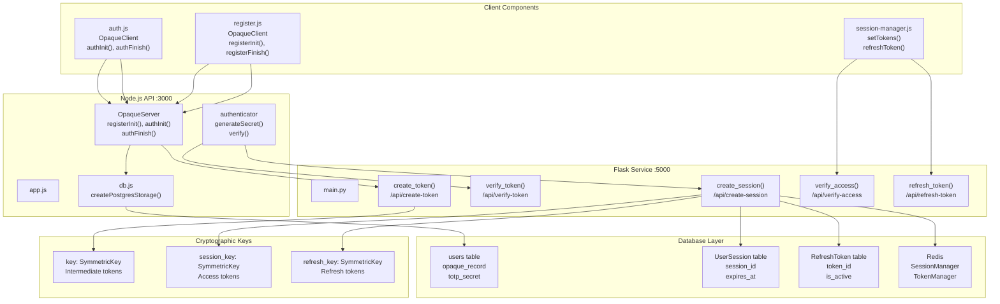
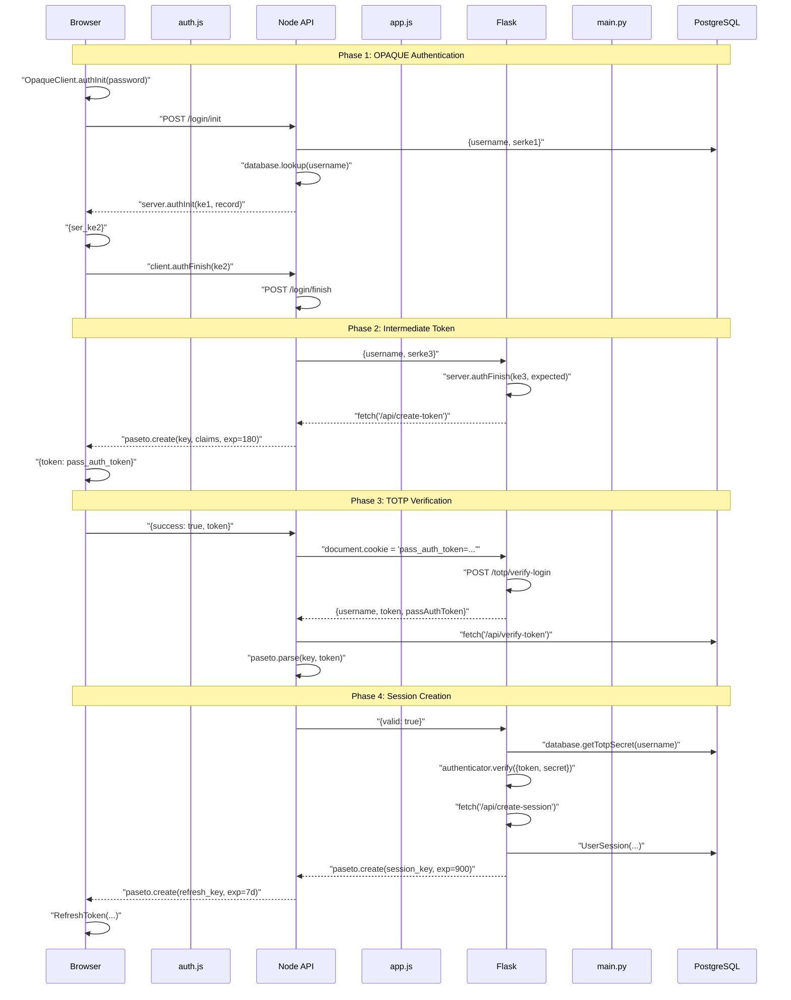
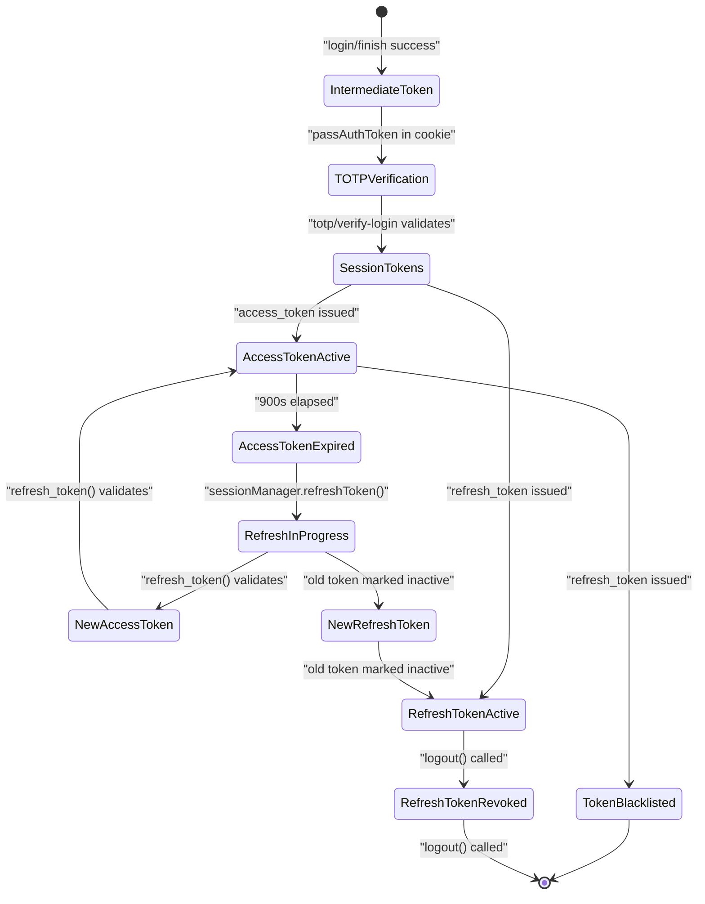
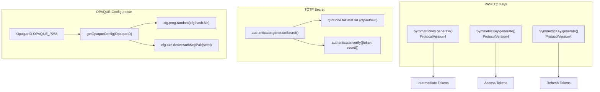
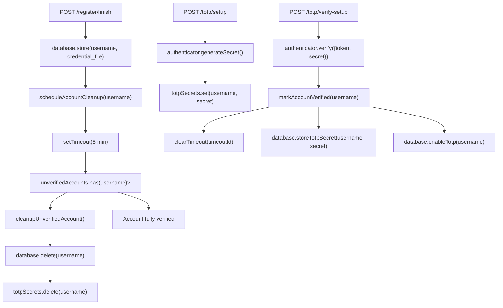

# Authentication System

> **Relevant source files**
> * [Documentation/Business-Model.md](https://github.com/RogueElectron/Cypher1/blob/c60431e6/Documentation/Business-Model.md)
> * [Documentation/Team-Roles.md](https://github.com/RogueElectron/Cypher1/blob/c60431e6/Documentation/Team-Roles.md)
> * [README.md](https://github.com/RogueElectron/Cypher1/blob/c60431e6/README.md)
> * [back-end/main.py](https://github.com/RogueElectron/Cypher1/blob/c60431e6/back-end/main.py)
> * [back-end/node_internal_api/app.js](https://github.com/RogueElectron/Cypher1/blob/c60431e6/back-end/node_internal_api/app.js)
> * [back-end/src/auth.js](https://github.com/RogueElectron/Cypher1/blob/c60431e6/back-end/src/auth.js)

## Purpose and Scope

This document provides a comprehensive overview of Cypher's zero-knowledge authentication system, including its security properties, architectural components, and cryptographic foundations. The authentication system implements a multi-phase security model that combines OPAQUE password-authenticated key exchange, TOTP two-factor authentication, and PASETO token-based session management.

For detailed information about specific subsystems:

* OPAQUE protocol implementation details, see [OPAQUE Protocol Implementation](/RogueElectron/Cypher1/3.1-opaque-protocol-implementation)
* TOTP setup and verification processes, see [TOTP Two-Factor Authentication](/RogueElectron/Cypher1/3.2-totp-two-factor-authentication)
* Token management and session lifecycle, see [Session and Token Management](/RogueElectron/Cypher1/3.3-session-and-token-management)
* Step-by-step authentication workflows, see [Authentication Workflows](/RogueElectron/Cypher1/3.4-authentication-workflows)

**Sources:** [Documentation/Business-Model.md](https://github.com/RogueElectron/Cypher1/blob/c60431e6/Documentation/Business-Model.md)

 [back-end/node_internal_api/app.js](https://github.com/RogueElectron/Cypher1/blob/c60431e6/back-end/node_internal_api/app.js)

 [back-end/main.py](https://github.com/RogueElectron/Cypher1/blob/c60431e6/back-end/main.py)

 [back-end/src/auth.js](https://github.com/RogueElectron/Cypher1/blob/c60431e6/back-end/src/auth.js)

## System Overview

The Cypher authentication system is built on three cryptographic pillars that work in sequence to establish user identity without ever exposing passwords to the server. The system separates cryptographic operations (handled by Node.js) from session management (handled by Flask), ensuring protocol isolation and minimizing attack surface.

The authentication flow progresses through four distinct phases:

1. **OPAQUE Password Authentication** - Zero-knowledge password verification using cryptographic blinding
2. **Intermediate Token Issuance** - Short-lived bridge token proving password authentication
3. **TOTP 2FA Verification** - Time-based one-time password validation
4. **Session Establishment** - PASETO token creation for stateless session management

**Sources:** [back-end/node_internal_api/app.js L1-L501](https://github.com/RogueElectron/Cypher1/blob/c60431e6/back-end/node_internal_api/app.js#L1-L501)

 [back-end/main.py L1-L564](https://github.com/RogueElectron/Cypher1/blob/c60431e6/back-end/main.py#L1-L564)

## Core Components

### Component Architecture



**Sources:** [back-end/node_internal_api/app.js L1-L137](https://github.com/RogueElectron/Cypher1/blob/c60431e6/back-end/node_internal_api/app.js#L1-L137)

 [back-end/main.py L28-L74](https://github.com/RogueElectron/Cypher1/blob/c60431e6/back-end/main.py#L28-L74)

 [back-end/src/auth.js L1-L10](https://github.com/RogueElectron/Cypher1/blob/c60431e6/back-end/src/auth.js#L1-L10)

### Service Responsibilities

| Service | Port | Primary Responsibilities | Key Files |
| --- | --- | --- | --- |
| **Node.js API** | 3000 | OPAQUE protocol operations, TOTP generation/verification, user credential storage | `app.js`, `db.js` |
| **Flask Service** | 5000 | PASETO token creation/validation, session management, rate limiting, HTML serving | `main.py`, `src/redis_manager.py` |
| **Client Modules** | N/A | OPAQUE client operations, token storage, automatic token refresh, UI orchestration | `auth.js`, `register.js`, `session-manager.js` |

**Sources:** [back-end/node_internal_api/app.js L26-L79](https://github.com/RogueElectron/Cypher1/blob/c60431e6/back-end/node_internal_api/app.js#L26-L79)

 [back-end/main.py L28-L29](https://github.com/RogueElectron/Cypher1/blob/c60431e6/back-end/main.py#L28-L29)

## Authentication Flow with Code Mappings



**Sources:** [back-end/src/auth.js L205-L459](https://github.com/RogueElectron/Cypher1/blob/c60431e6/back-end/src/auth.js#L205-L459)

 [back-end/node_internal_api/app.js L222-L496](https://github.com/RogueElectron/Cypher1/blob/c60431e6/back-end/node_internal_api/app.js#L222-L496)

 [back-end/main.py L92-L304](https://github.com/RogueElectron/Cypher1/blob/c60431e6/back-end/main.py#L92-L304)

## Token Types and Management

The system employs three distinct PASETO token types, each with dedicated cryptographic keys to prevent token confusion attacks and limit blast radius in case of key compromise.

### Token Type Specifications

| Token Type | Key Variable | Lifetime | Storage Location | Purpose | Generated By |
| --- | --- | --- | --- | --- | --- |
| **Intermediate Token** | `key` | 180 seconds | HttpOnly Cookie (`pass_auth_token`) | Bridges OPAQUE and TOTP phases | `create_token()` in [main.py L92-L112](https://github.com/RogueElectron/Cypher1/blob/c60431e6/main.py#L92-L112) |
| **Access Token** | `session_key` | 900 seconds (15 min) | HttpOnly Cookie (`access_token`) | Authorizes API requests | `create_session()` in [main.py L216-L230](https://github.com/RogueElectron/Cypher1/blob/c60431e6/main.py#L216-L230) |
| **Refresh Token** | `refresh_key` | 604800 seconds (7 days) | localStorage | One-time use token rotation | `create_session()` in [main.py L233-L249](https://github.com/RogueElectron/Cypher1/blob/c60431e6/main.py#L233-L249) |

**Sources:** [back-end/main.py L31-L249](https://github.com/RogueElectron/Cypher1/blob/c60431e6/back-end/main.py#L31-L249)

### Token Lifecycle



**Sources:** [back-end/main.py L150-L560](https://github.com/RogueElectron/Cypher1/blob/c60431e6/back-end/main.py#L150-L560)

## Security Architecture

### Zero-Knowledge Properties

The system's zero-knowledge properties are enforced through the OPAQUE protocol implementation, which ensures the server never learns or stores user passwords at any point in the authentication lifecycle.

**Key Security Guarantees:**

1. **Password Blindness** - Client-side password blinding in `OpaqueClient.authInit()` ensures plaintext passwords never transmit
2. **Server Ignorance** - Server only stores `opaque_record` (cryptographic commitment), not password hashes
3. **Mutual Authentication** - Both client and server verify each other's identity during key exchange
4. **Forward Secrecy** - Session keys derived independently for each authentication attempt
5. **Breach Resistance** - Database compromise reveals no authentication secrets

**Sources:** [back-end/node_internal_api/app.js L82-L137](https://github.com/RogueElectron/Cypher1/blob/c60431e6/back-end/node_internal_api/app.js#L82-L137)

 [back-end/src/auth.js L1-L245](https://github.com/RogueElectron/Cypher1/blob/c60431e6/back-end/src/auth.js#L1-L245)

### Cryptographic Configuration



**Sources:** [back-end/node_internal_api/app.js L82-L86](https://github.com/RogueElectron/Cypher1/blob/c60431e6/back-end/node_internal_api/app.js#L82-L86)

 [back-end/main.py L31-L34](https://github.com/RogueElectron/Cypher1/blob/c60431e6/back-end/main.py#L31-L34)

 [back-end/node_internal_api/app.js L337-L346](https://github.com/RogueElectron/Cypher1/blob/c60431e6/back-end/node_internal_api/app.js#L337-L346)

### Defense-in-Depth Layers

| Layer | Mechanism | Implementation | File References |
| --- | --- | --- | --- |
| **Protocol Isolation** | OPAQUE operations confined to Node.js service | `OpaqueServer` instance in Node.js, PASETO operations in Flask | [app.js L133-L137](https://github.com/RogueElectron/Cypher1/blob/c60431e6/app.js#L133-L137) <br>  [main.py L31-L34](https://github.com/RogueElectron/Cypher1/blob/c60431e6/main.py#L31-L34) |
| **Token Separation** | Three distinct symmetric keys prevent cross-token attacks | `key`, `session_key`, `refresh_key` | [main.py L31-L34](https://github.com/RogueElectron/Cypher1/blob/c60431e6/main.py#L31-L34) |
| **Rate Limiting** | Redis-backed request throttling | `get_rate_limiter().check_rate_limit()` | [main.py L161-L172](https://github.com/RogueElectron/Cypher1/blob/c60431e6/main.py#L161-L172) |
| **Token Blacklisting** | Invalidated tokens tracked in Redis | `get_token_manager().blacklist_token()` | [main.py L536](https://github.com/RogueElectron/Cypher1/blob/c60431e6/main.py#L536-L536) |
| **Session Expiry** | Multi-layer timeout enforcement | `expires_at` in database, TTL in Redis | [main.py L210-L211](https://github.com/RogueElectron/Cypher1/blob/c60431e6/main.py#L210-L211) |
| **One-Time Refresh** | Refresh tokens deactivated on use | `is_active = False` on rotation | [main.py L429](https://github.com/RogueElectron/Cypher1/blob/c60431e6/main.py#L429-L429) |
| **Input Sanitization** | XSS prevention middleware | `xss()` and `helmet()` in Node.js | [app.js L27-L46](https://github.com/RogueElectron/Cypher1/blob/c60431e6/app.js#L27-L46) |
| **CORS Restrictions** | Origin validation | `cors({origin: [...], credentials: true})` | [app.js L72-L77](https://github.com/RogueElectron/Cypher1/blob/c60431e6/app.js#L72-L77) <br>  [main.py L29](https://github.com/RogueElectron/Cypher1/blob/c60431e6/main.py#L29-L29) |

**Sources:** [back-end/node_internal_api/app.js L27-L77](https://github.com/RogueElectron/Cypher1/blob/c60431e6/back-end/node_internal_api/app.js#L27-L77)

 [back-end/main.py L29-L536](https://github.com/RogueElectron/Cypher1/blob/c60431e6/back-end/main.py#L29-L536)

## Registration Verification Flow

New user accounts require TOTP setup completion within a 5-minute window to prevent incomplete registrations from persisting.



**Sources:** [back-end/node_internal_api/app.js L92-L389](https://github.com/RogueElectron/Cypher1/blob/c60431e6/back-end/node_internal_api/app.js#L92-L389)

## Session Management Integration

The session system maintains dual storage in both Redis (performance) and PostgreSQL (durability), with automatic fallback on cache miss.

### Session Creation Process

The `create_session()` endpoint in Flask orchestrates session establishment across multiple storage layers:

1. **Rate Limit Check** - `get_rate_limiter().check_rate_limit()` validates request frequency ([main.py L161-L172](https://github.com/RogueElectron/Cypher1/blob/c60431e6/main.py#L161-L172) )
2. **User Validation** - Query `User` table for active, unlocked account ([main.py L178-L184](https://github.com/RogueElectron/Cypher1/blob/c60431e6/main.py#L178-L184) )
3. **Redis Session** - `get_session_manager().create_session()` with 3600s TTL ([main.py L196-L201](https://github.com/RogueElectron/Cypher1/blob/c60431e6/main.py#L196-L201) )
4. **PostgreSQL Session** - `UserSession` ORM object with matching `session_id` ([main.py L204-L213](https://github.com/RogueElectron/Cypher1/blob/c60431e6/main.py#L204-L213) )
5. **Access Token** - PASETO with `session_key`, 900s expiry ([main.py L216-L230](https://github.com/RogueElectron/Cypher1/blob/c60431e6/main.py#L216-L230) )
6. **Refresh Token** - PASETO with `refresh_key`, 7 day expiry ([main.py L233-L249](https://github.com/RogueElectron/Cypher1/blob/c60431e6/main.py#L233-L249) )
7. **Token Persistence** - `RefreshToken` in database, cache in Redis ([main.py L252-L271](https://github.com/RogueElectron/Cypher1/blob/c60431e6/main.py#L252-L271) )
8. **Audit Trail** - `AuditLog` entry for compliance ([main.py L277-L291](https://github.com/RogueElectron/Cypher1/blob/c60431e6/main.py#L277-L291) )

**Sources:** [back-end/main.py L150-L304](https://github.com/RogueElectron/Cypher1/blob/c60431e6/back-end/main.py#L150-L304)

### Token Refresh Mechanism

The token refresh endpoint implements one-time-use refresh tokens with automatic rotation to limit replay attack windows:

1. **Parse Refresh Token** - Validate with `refresh_key` ([main.py L398-L402](https://github.com/RogueElectron/Cypher1/blob/c60431e6/main.py#L398-L402) )
2. **Validate Claims** - Check `type`, `token_id`, `session_id` ([main.py L404-L415](https://github.com/RogueElectron/Cypher1/blob/c60431e6/main.py#L404-L415) )
3. **Database Lookup** - Query `RefreshToken` where `is_active=True` ([main.py L419-L423](https://github.com/RogueElectron/Cypher1/blob/c60431e6/main.py#L419-L423) )
4. **Mark Used** - Set `is_active=False`, `used_at=now()` ([main.py L429-L430](https://github.com/RogueElectron/Cypher1/blob/c60431e6/main.py#L429-L430) )
5. **Session Validation** - Verify session still exists in Redis/database ([main.py L433-L442](https://github.com/RogueElectron/Cypher1/blob/c60431e6/main.py#L433-L442) )
6. **Issue New Tokens** - Generate fresh access and refresh tokens ([main.py L447-L478](https://github.com/RogueElectron/Cypher1/blob/c60431e6/main.py#L447-L478) )
7. **Store New Refresh** - Create new `RefreshToken` with `refreshed_from` audit trail ([main.py L482-L493](https://github.com/RogueElectron/Cypher1/blob/c60431e6/main.py#L482-L493) )
8. **Cache Update** - Store in Redis with 7-day TTL ([main.py L496-L501](https://github.com/RogueElectron/Cypher1/blob/c60431e6/main.py#L496-L501) )

**Sources:** [back-end/main.py L388-L512](https://github.com/RogueElectron/Cypher1/blob/c60431e6/back-end/main.py#L388-L512)

## Security Event Logging

All authentication events are logged to the `AuditLog` table for compliance and forensic analysis:

```python
# Example from create_session()
audit_log = AuditLog(
    event_type='session_created',
    event_category='AUTH',
    severity='INFO',
    user_id=user.id,
    session_id=session_id,
    ip_address=client_ip,
    user_agent=request.headers.get('User-Agent', ''),
    success=True
)
audit_log.set_event_details({
    'session_duration': '15 minutes',
    'refresh_token_duration': '7 days'
})
```

**Sources:** [back-end/main.py L277-L291](https://github.com/RogueElectron/Cypher1/blob/c60431e6/back-end/main.py#L277-L291)

## Client-Side Visualization

The authentication process includes live visualization in the browser to demonstrate zero-knowledge properties to users. The `AuthLiveVisualization` class in `auth.js` provides real-time step indicators during login.

### Visualization Steps

The system tracks 9 distinct authentication steps:

1. **input** - Password entered locally
2. **validation** - Credential validation
3. **ke1-generation** - Client generates first key exchange message
4. **send-ke1** - KE1 transmitted to server
5. **server-ke2** - Server responds with KE2
6. **verify-server** - Client verifies server authenticity
7. **send-ke3** - Client sends authentication proof
8. **totp-verify** - 2FA code verification
9. **success** - Authentication complete

Each step is activated via `authLiveViz.activateStep(stepId)` and completed via `authLiveViz.completeStep(stepId)` throughout the authentication flow.

**Sources:** [back-end/src/auth.js L18-L459](https://github.com/RogueElectron/Cypher1/blob/c60431e6/back-end/src/auth.js#L18-L459)