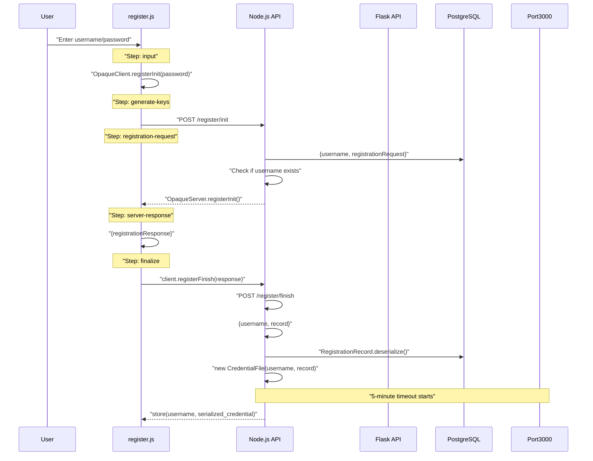
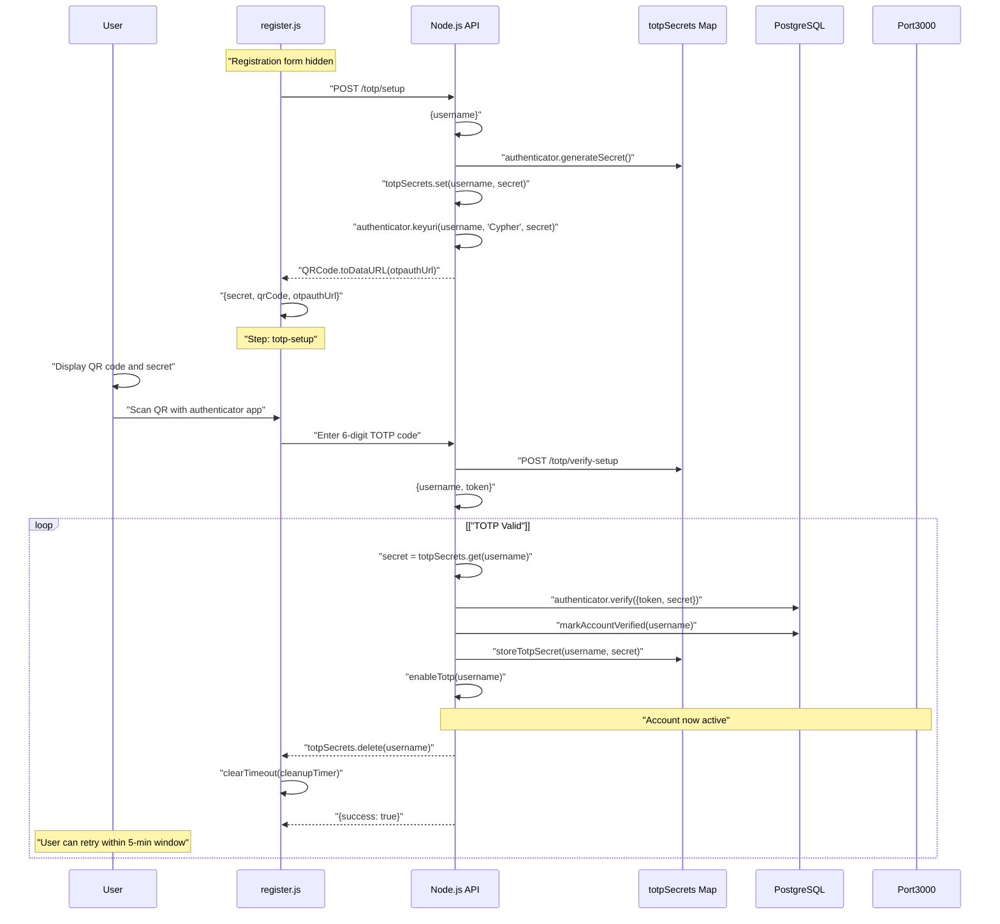
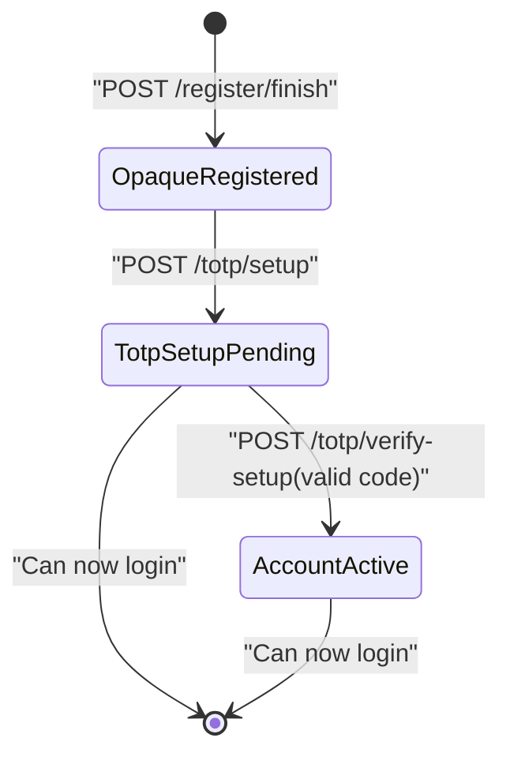
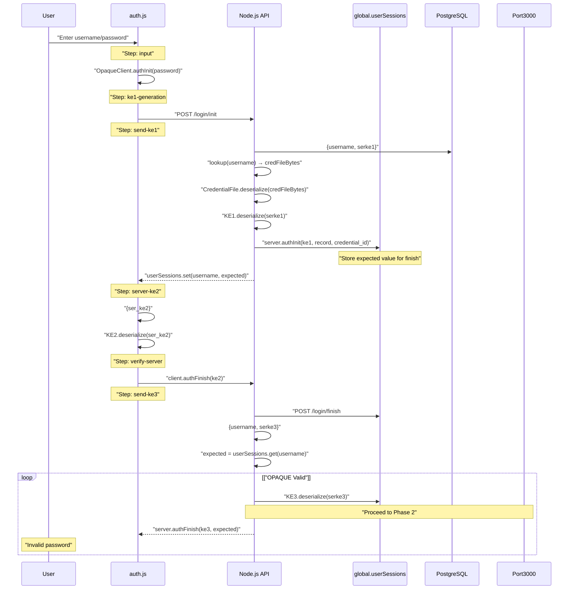
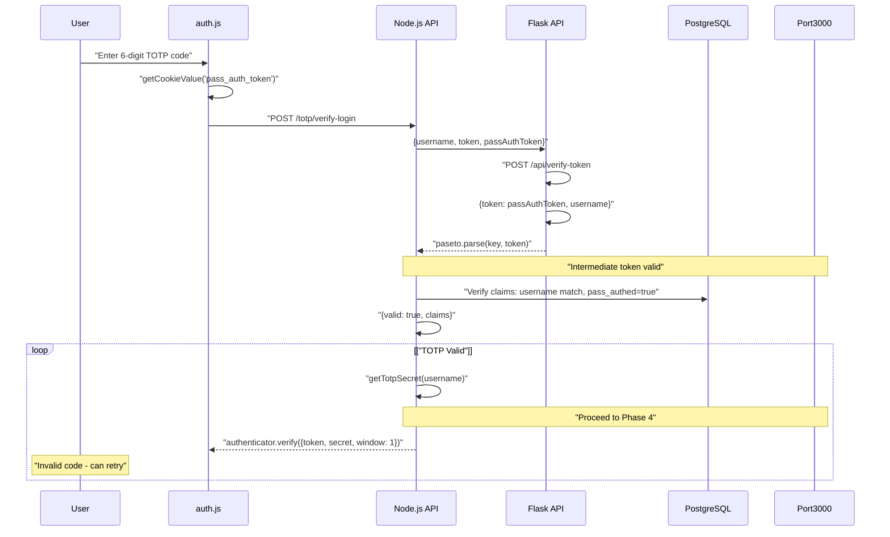
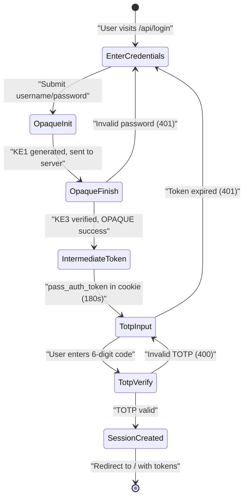
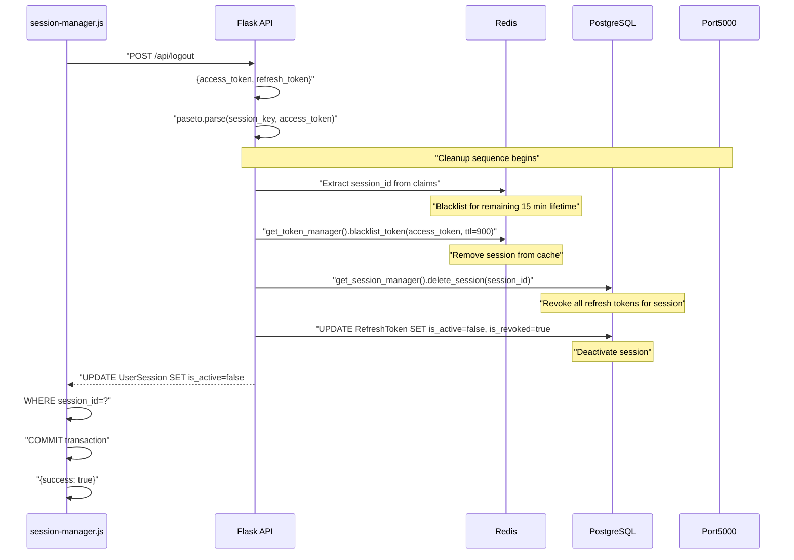
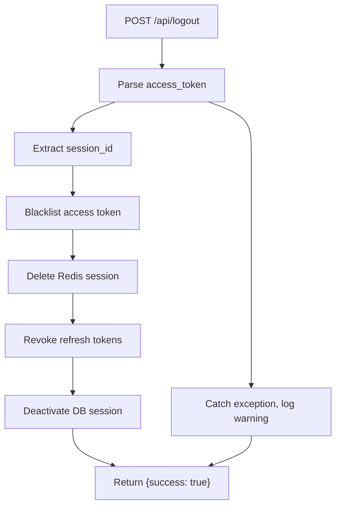

# Authentication Workflows

> **Relevant source files**
> * [back-end/main.py](https://github.com/RogueElectron/Cypher1/blob/c60431e6/back-end/main.py)
> * [back-end/node_internal_api/app.js](https://github.com/RogueElectron/Cypher1/blob/c60431e6/back-end/node_internal_api/app.js)
> * [back-end/src/auth.js](https://github.com/RogueElectron/Cypher1/blob/c60431e6/back-end/src/auth.js)
> * [back-end/src/register.js](https://github.com/RogueElectron/Cypher1/blob/c60431e6/back-end/src/register.js)

## Purpose and Scope

This document provides detailed step-by-step documentation of the three core authentication workflows in the Cypher platform: **registration**, **login**, and **logout**. Each workflow is documented with sequence diagrams, endpoint mappings, and code references to actual implementation files.

This page focuses on the **orchestration and sequencing** of authentication operations. For implementation details of the underlying cryptographic protocols, see [OPAQUE Protocol Implementation](/RogueElectron/Cypher1/3.1-opaque-protocol-implementation) and [TOTP Two-Factor Authentication](/RogueElectron/Cypher1/3.2-totp-two-factor-authentication). For token management mechanics, see [Session and Token Management](/RogueElectron/Cypher1/3.3-session-and-token-management). For client-side implementation details, see [Registration Flow (Client-Side)](/RogueElectron/Cypher1/5.1-registration-flow-(client-side)) and [Login Flow (Client-Side)](/RogueElectron/Cypher1/5.2-login-flow-(client-side)).

---

## Registration Workflow

The registration workflow implements a two-phase process: OPAQUE credential enrollment followed by mandatory TOTP setup. New users must complete both phases within a 5-minute window before the account becomes active.

### OPAQUE Registration Phase



**Sources:** [back-end/src/register.js L223-L356](https://github.com/RogueElectron/Cypher1/blob/c60431e6/back-end/src/register.js#L223-L356)

 [back-end/node_internal_api/app.js L143-L220](https://github.com/RogueElectron/Cypher1/blob/c60431e6/back-end/node_internal_api/app.js#L143-L220)

#### Key Endpoints and Functions

| Component | Endpoint/Function | Purpose | Code Reference |
| --- | --- | --- | --- |
| Client | `OpaqueClient.registerInit(password)` | Generate blinded password request | [register.js L266](https://github.com/RogueElectron/Cypher1/blob/c60431e6/register.js#L266-L266) |
| Client | `client.registerFinish(response)` | Complete OPAQUE protocol, generate record | [register.js L306](https://github.com/RogueElectron/Cypher1/blob/c60431e6/register.js#L306-L306) |
| Node.js | `POST /register/init` | Process initial registration request | [app.js L143-L175](https://github.com/RogueElectron/Cypher1/blob/c60431e6/app.js#L143-L175) |
| Node.js | `POST /register/finish` | Store credential file, start cleanup timer | [app.js L177-L220](https://github.com/RogueElectron/Cypher1/blob/c60431e6/app.js#L177-L220) |
| Node.js | `scheduleAccountCleanup(username)` | 5-minute timeout for TOTP setup | [app.js L103-L111](https://github.com/RogueElectron/Cypher1/blob/c60431e6/app.js#L103-L111) |
| Database | `database.store(username, credential)` | Persist OPAQUE record as base64 | [app.js L200](https://github.com/RogueElectron/Cypher1/blob/c60431e6/app.js#L200-L200) |

**Sources:** [back-end/src/register.js L260-L330](https://github.com/RogueElectron/Cypher1/blob/c60431e6/back-end/src/register.js#L260-L330)

 [back-end/node_internal_api/app.js L143-L220](https://github.com/RogueElectron/Cypher1/blob/c60431e6/back-end/node_internal_api/app.js#L143-L220)

### TOTP Setup Phase

After OPAQUE registration completes, the UI transitions from password entry to TOTP setup. The user has 5 minutes to complete this phase before the account is automatically deleted.



**Sources:** [back-end/src/register.js L360-L492](https://github.com/RogueElectron/Cypher1/blob/c60431e6/back-end/src/register.js#L360-L492)

 [back-end/node_internal_api/app.js L329-L389](https://github.com/RogueElectron/Cypher1/blob/c60431e6/back-end/node_internal_api/app.js#L329-L389)

#### TOTP Setup Components

| Component | Endpoint/Function | Purpose | Code Reference |
| --- | --- | --- | --- |
| Client | `generateTotpSecret()` | Request TOTP secret generation | [register.js L360-L397](https://github.com/RogueElectron/Cypher1/blob/c60431e6/register.js#L360-L397) |
| Client | `displayServerQrCode(qrCode, url)` | Render QR code image for scanning | [register.js L399-L415](https://github.com/RogueElectron/Cypher1/blob/c60431e6/register.js#L399-L415) |
| Node.js | `POST /totp/setup` | Generate secret, create QR code | [app.js L329-L361](https://github.com/RogueElectron/Cypher1/blob/c60431e6/app.js#L329-L361) |
| Node.js | `POST /totp/verify-setup` | Verify initial TOTP code | [app.js L363-L389](https://github.com/RogueElectron/Cypher1/blob/c60431e6/app.js#L363-L389) |
| Node.js | `markAccountVerified(username)` | Persist TOTP secret, enable account | [app.js L113-L126](https://github.com/RogueElectron/Cypher1/blob/c60431e6/app.js#L113-L126) |
| Node.js | `cleanupUnverifiedAccount(username)` | Delete account if TOTP not completed | [app.js L94-L101](https://github.com/RogueElectron/Cypher1/blob/c60431e6/app.js#L94-L101) |

**Sources:** [back-end/src/register.js L360-L492](https://github.com/RogueElectron/Cypher1/blob/c60431e6/back-end/src/register.js#L360-L492)

 [back-end/node_internal_api/app.js L329-L389](https://github.com/RogueElectron/Cypher1/blob/c60431e6/back-end/node_internal_api/app.js#L329-L389)

### Account State Transitions



**Sources:** [back-end/node_internal_api/app.js L92-L126](https://github.com/RogueElectron/Cypher1/blob/c60431e6/back-end/node_internal_api/app.js#L92-L126)

---

## Login Workflow

The login workflow consists of four sequential phases: OPAQUE authentication, intermediate token issuance, TOTP verification, and session establishment. All four phases must succeed for a user to gain access.

### Phase 1: OPAQUE Authentication



**Sources:** [back-end/src/auth.js L205-L356](https://github.com/RogueElectron/Cypher1/blob/c60431e6/back-end/src/auth.js#L205-L356)

 [back-end/node_internal_api/app.js L222-L325](https://github.com/RogueElectron/Cypher1/blob/c60431e6/back-end/node_internal_api/app.js#L222-L325)

### Phase 2: Intermediate Token Issuance

After successful OPAQUE authentication, an intermediate token (`pass_auth_token`) is created to bridge the gap between password verification and TOTP verification. This token has a 3-minute lifetime.

```

```

**Sources:** [back-end/node_internal_api/app.js L283-L314](https://github.com/RogueElectron/Cypher1/blob/c60431e6/back-end/node_internal_api/app.js#L283-L314)

 [back-end/main.py L92-L112](https://github.com/RogueElectron/Cypher1/blob/c60431e6/back-end/main.py#L92-L112)

 [back-end/src/auth.js L293-L352](https://github.com/RogueElectron/Cypher1/blob/c60431e6/back-end/src/auth.js#L293-L352)

#### Intermediate Token Flow

| Component | Endpoint/Function | Purpose | Code Reference |
| --- | --- | --- | --- |
| Node.js | Calls Flask after OPAQUE success | Request intermediate token | [app.js L284-L290](https://github.com/RogueElectron/Cypher1/blob/c60431e6/app.js#L284-L290) |
| Flask | `POST /api/create-token` | Issue PASETO token with 3-min TTL | [main.py L92-L112](https://github.com/RogueElectron/Cypher1/blob/c60431e6/main.py#L92-L112) |
| Flask | `paseto.create(key, claims, exp_seconds=180)` | Token with `pass_authed: true` claim | [main.py L105-L110](https://github.com/RogueElectron/Cypher1/blob/c60431e6/main.py#L105-L110) |
| Client | `document.cookie = 'pass_auth_token=...'` | Store token in cookie | [auth.js L313](https://github.com/RogueElectron/Cypher1/blob/c60431e6/auth.js#L313-L313) |

**Sources:** [back-end/node_internal_api/app.js L283-L314](https://github.com/RogueElectron/Cypher1/blob/c60431e6/back-end/node_internal_api/app.js#L283-L314)

 [back-end/main.py L92-L112](https://github.com/RogueElectron/Cypher1/blob/c60431e6/back-end/main.py#L92-L112)

### Phase 3: TOTP Verification



**Sources:** [back-end/src/auth.js L376-L458](https://github.com/RogueElectron/Cypher1/blob/c60431e6/back-end/src/auth.js#L376-L458)

 [back-end/node_internal_api/app.js L391-L496](https://github.com/RogueElectron/Cypher1/blob/c60431e6/back-end/node_internal_api/app.js#L391-L496)

 [back-end/main.py L114-L148](https://github.com/RogueElectron/Cypher1/blob/c60431e6/back-end/main.py#L114-L148)

#### TOTP Verification Components

| Component | Endpoint/Function | Purpose | Code Reference |
| --- | --- | --- | --- |
| Client | `getCookieValue('pass_auth_token')` | Retrieve intermediate token | [auth.js L405](https://github.com/RogueElectron/Cypher1/blob/c60431e6/auth.js#L405-L405) |
| Client | TOTP form submission handler | Send code + token to server | [auth.js L379-L458](https://github.com/RogueElectron/Cypher1/blob/c60431e6/auth.js#L379-L458) |
| Node.js | `POST /totp/verify-login` | Validate intermediate token + TOTP | [app.js L391-L496](https://github.com/RogueElectron/Cypher1/blob/c60431e6/app.js#L391-L496) |
| Flask | `POST /api/verify-token` | Verify intermediate token claims | [main.py L114-L148](https://github.com/RogueElectron/Cypher1/blob/c60431e6/main.py#L114-L148) |
| Node.js | `authenticator.verify({token, secret, window: 1})` | Verify 6-digit code (±30 sec window) | [app.js L441-L445](https://github.com/RogueElectron/Cypher1/blob/c60431e6/app.js#L441-L445) |

**Sources:** [back-end/src/auth.js L376-L458](https://github.com/RogueElectron/Cypher1/blob/c60431e6/back-end/src/auth.js#L376-L458)

 [back-end/node_internal_api/app.js L391-L496](https://github.com/RogueElectron/Cypher1/blob/c60431e6/back-end/node_internal_api/app.js#L391-L496)

### Phase 4: Session Establishment

After successful TOTP verification, the Node.js API requests session creation from Flask. Flask creates both Redis and PostgreSQL sessions, then issues access and refresh tokens.

```

```

**Sources:** [back-end/node_internal_api/app.js L452-L487](https://github.com/RogueElectron/Cypher1/blob/c60431e6/back-end/node_internal_api/app.js#L452-L487)

 [back-end/main.py L150-L304](https://github.com/RogueElectron/Cypher1/blob/c60431e6/back-end/main.py#L150-L304)

 [back-end/src/auth.js L436-L453](https://github.com/RogueElectron/Cypher1/blob/c60431e6/back-end/src/auth.js#L436-L453)

#### Session Creation Components

| Component | Endpoint/Function | Purpose | Code Reference |
| --- | --- | --- | --- |
| Node.js | Calls Flask after TOTP success | Request session creation | [app.js L453-L461](https://github.com/RogueElectron/Cypher1/blob/c60431e6/app.js#L453-L461) |
| Flask | `POST /api/create-session` | Create session, issue tokens | [main.py L150-L304](https://github.com/RogueElectron/Cypher1/blob/c60431e6/main.py#L150-L304) |
| Flask | `get_session_manager().create_session()` | Create Redis session with 1-hour TTL | [main.py L195-L201](https://github.com/RogueElectron/Cypher1/blob/c60431e6/main.py#L195-L201) |
| Flask | `UserSession(session_id, user_id, expires_at)` | Persist session to PostgreSQL | [main.py L204-L213](https://github.com/RogueElectron/Cypher1/blob/c60431e6/main.py#L204-L213) |
| Flask | `paseto.create(session_key, claims, exp_seconds=900)` | 15-minute access token | [main.py L225-L230](https://github.com/RogueElectron/Cypher1/blob/c60431e6/main.py#L225-L230) |
| Flask | `paseto.create(refresh_key, claims, exp_seconds=604800)` | 7-day refresh token | [main.py L244-L249](https://github.com/RogueElectron/Cypher1/blob/c60431e6/main.py#L244-L249) |
| Flask | `RefreshToken(token_id, session_id)` | Store refresh token in database | [main.py L252-L263](https://github.com/RogueElectron/Cypher1/blob/c60431e6/main.py#L252-L263) |
| Flask | `get_token_manager().cache_refresh_token()` | Cache refresh token in Redis | [main.py L266-L271](https://github.com/RogueElectron/Cypher1/blob/c60431e6/main.py#L266-L271) |
| Client | `sessionManager.setTokens(access, refresh, expires)` | Store tokens, schedule refresh | [auth.js L439-L443](https://github.com/RogueElectron/Cypher1/blob/c60431e6/auth.js#L439-L443) |

**Sources:** [back-end/main.py L150-L304](https://github.com/RogueElectron/Cypher1/blob/c60431e6/back-end/main.py#L150-L304)

 [back-end/src/auth.js L436-L453](https://github.com/RogueElectron/Cypher1/blob/c60431e6/back-end/src/auth.js#L436-L453)

### Complete Login Flow State Machine



**Sources:** [back-end/src/auth.js L205-L470](https://github.com/RogueElectron/Cypher1/blob/c60431e6/back-end/src/auth.js#L205-L470)

 [back-end/node_internal_api/app.js L222-L496](https://github.com/RogueElectron/Cypher1/blob/c60431e6/back-end/node_internal_api/app.js#L222-L496)

---

## Logout Workflow

The logout workflow performs comprehensive cleanup: access token blacklisting, session deletion from Redis, and session/token revocation in PostgreSQL.



**Sources:** [back-end/main.py L514-L560](https://github.com/RogueElectron/Cypher1/blob/c60431e6/back-end/main.py#L514-L560)

### Logout Cleanup Operations

| Component | Operation | Purpose | Code Reference |
| --- | --- | --- | --- |
| Client | Sends access + refresh tokens | Provide tokens for cleanup | [Session Manager](/RogueElectron/Cypher1/5.3-session-manager-module) |
| Flask | `paseto.parse(session_key, access_token)` | Extract session_id from token | [main.py L524-L531](https://github.com/RogueElectron/Cypher1/blob/c60431e6/main.py#L524-L531) |
| Flask | `get_token_manager().blacklist_token(token, ttl=900)` | Prevent access token reuse | [main.py L536](https://github.com/RogueElectron/Cypher1/blob/c60431e6/main.py#L536-L536) |
| Flask | `get_session_manager().delete_session(session_id)` | Remove Redis session | [main.py L539](https://github.com/RogueElectron/Cypher1/blob/c60431e6/main.py#L539-L539) |
| Flask | `UPDATE RefreshToken SET is_active=false, is_revoked=true` | Revoke all refresh tokens | [main.py L543-L546](https://github.com/RogueElectron/Cypher1/blob/c60431e6/main.py#L543-L546) |
| Flask | `UPDATE UserSession SET is_active=false` | Deactivate PostgreSQL session | [main.py L549-L551](https://github.com/RogueElectron/Cypher1/blob/c60431e6/main.py#L549-L551) |
| Client | Clear `localStorage` and cookies | Remove client-side tokens | [Session Manager](/RogueElectron/Cypher1/5.3-session-manager-module) |

**Sources:** [back-end/main.py L514-L560](https://github.com/RogueElectron/Cypher1/blob/c60431e6/back-end/main.py#L514-L560)

### Logout Error Handling

The logout endpoint returns success even if cleanup operations partially fail. This design prevents logout from failing due to already-expired sessions or corrupted tokens.



**Sources:** [back-end/main.py L554-L558](https://github.com/RogueElectron/Cypher1/blob/c60431e6/back-end/main.py#L554-L558)

---

## Workflow Comparison Table

| Workflow | Phases | Duration | Tokens Issued | Database Writes |
| --- | --- | --- | --- | --- |
| **Registration** | 2 (OPAQUE + TOTP) | ~2-5 minutes | None (account must login after) | `users.opaque_record`, `users.totp_secret` |
| **Login** | 4 (OPAQUE + Intermediate + TOTP + Session) | ~30-60 seconds | `pass_auth_token` (3 min), `access_token` (15 min), `refresh_token` (7 days) | `UserSession`, `RefreshToken`, `AuditLog`, `User.last_login_at` |
| **Logout** | 1 (Cleanup) | <1 second | None (tokens revoked) | `UserSession.is_active=false`, `RefreshToken.is_revoked=true` |

**Sources:** [back-end/src/register.js](https://github.com/RogueElectron/Cypher1/blob/c60431e6/back-end/src/register.js)

 [back-end/src/auth.js](https://github.com/RogueElectron/Cypher1/blob/c60431e6/back-end/src/auth.js)

 [back-end/main.py](https://github.com/RogueElectron/Cypher1/blob/c60431e6/back-end/main.py)

 [back-end/node_internal_api/app.js](https://github.com/RogueElectron/Cypher1/blob/c60431e6/back-end/node_internal_api/app.js)

---

## Error Recovery Patterns

### Registration Timeout Recovery

If TOTP setup is not completed within 5 minutes:

* `cleanupUnverifiedAccount()` deletes the OPAQUE record from PostgreSQL
* `totpSecrets.delete(username)` removes temporary secret from memory
* User must restart registration from the beginning

**Sources:** [back-end/node_internal_api/app.js L94-L111](https://github.com/RogueElectron/Cypher1/blob/c60431e6/back-end/node_internal_api/app.js#L94-L111)

### Login Retry Limits

The system does not implement login attempt limits at the workflow level, but rate limiting is enforced:

* Session creation rate limit: 10 requests per minute per IP
* Rate limit enforced by `get_rate_limiter().check_rate_limit()` in Flask

**Sources:** [back-end/main.py L161-L172](https://github.com/RogueElectron/Cypher1/blob/c60431e6/back-end/main.py#L161-L172)

### Token Expiration Handling

| Token Type | Expiration | Client Behavior | Server Behavior |
| --- | --- | --- | --- |
| `pass_auth_token` | 3 minutes | Stored in cookie, deleted after TOTP | Validated once during TOTP verification |
| `access_token` | 15 minutes | Auto-refreshed at 12 minutes via `sessionManager` | Blacklisted on logout, expires naturally |
| `refresh_token` | 7 days | One-time use, replaced on refresh | Marked `is_active=false` after use |

**Sources:** [back-end/main.py L92-L512](https://github.com/RogueElectron/Cypher1/blob/c60431e6/back-end/main.py#L92-L512)