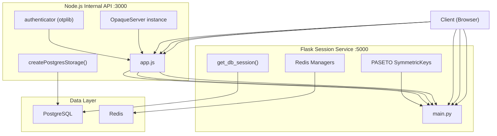
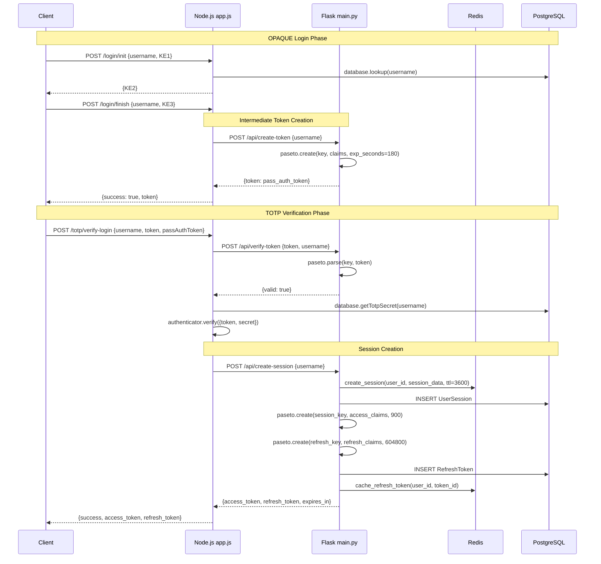
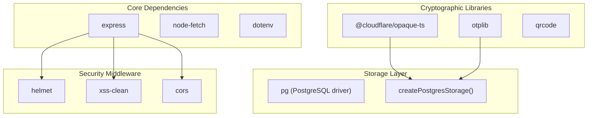

# Backend Services

> **Relevant source files**
> * [back-end/main.py](https://github.com/RogueElectron/Cypher1/blob/c60431e6/back-end/main.py)
> * [back-end/node_internal_api/app.js](https://github.com/RogueElectron/Cypher1/blob/c60431e6/back-end/node_internal_api/app.js)

## Purpose and Scope

This document provides an overview of the two backend services that comprise the Cypher authentication platform: the Flask Session Service and the Node.js Internal API. It explains their architectural relationship, responsibilities, inter-service communication patterns, and technology stacks.

For detailed information about specific endpoints and request/response formats, see [API Reference](/RogueElectron/Cypher1/4.3-api-reference). For implementation details of the Flask service, see [Flask Session Service](/RogueElectron/Cypher1/4.1-flask-session-service). For implementation details of the Node.js service, see [Node.js Internal API](/RogueElectron/Cypher1/4.2-node.js-internal-api).

## Architectural Separation

The Cypher platform employs a **dual-service architecture** that separates cryptographic operations from session management. This design isolates sensitive password-related cryptography in a dedicated Node.js service while delegating stateless token management to a Python Flask service.

### Service Communication Pattern



**Diagram: Service Architecture and Communication Flow**

Sources: [back-end/node_internal_api/app.js L1-L501](https://github.com/RogueElectron/Cypher1/blob/c60431e6/back-end/node_internal_api/app.js#L1-L501)

 [back-end/main.py L1-L564](https://github.com/RogueElectron/Cypher1/blob/c60431e6/back-end/main.py#L1-L564)

## Service Responsibilities

| Service | Port | Primary Role | Key Operations |
| --- | --- | --- | --- |
| **Node.js Internal API** | 3000 | Cryptographic operations | OPAQUE registration/login, TOTP generation/verification, User credential storage |
| **Flask Session Service** | 5000 | Session & token management | PASETO token issuance, Session lifecycle management, Token validation & rotation, Rate limiting |

### Node.js Internal API

The Node.js service handles all zero-knowledge cryptographic operations and user credential storage. It serves as the **cryptographic boundary** where passwords are never transmitted in plaintext.

**Core Components:**

* **OpaqueServer**: Instance of `@cloudflare/opaque-ts` configured with P-256 curve [back-end/node_internal_api/app.js L82-L137](https://github.com/RogueElectron/Cypher1/blob/c60431e6/back-end/node_internal_api/app.js#L82-L137)
* **authenticator**: TOTP token generation and verification via `otplib` [back-end/node_internal_api/app.js L16](https://github.com/RogueElectron/Cypher1/blob/c60431e6/back-end/node_internal_api/app.js#L16-L16)
* **createPostgresStorage()**: Database storage layer for OPAQUE records and TOTP secrets [back-end/node_internal_api/app.js L89](https://github.com/RogueElectron/Cypher1/blob/c60431e6/back-end/node_internal_api/app.js#L89-L89)

**Key Responsibilities:**

1. **OPAQUE Protocol Execution**: Handles `registerInit`, `registerFinish`, `authInit`, `authFinish` operations
2. **TOTP Management**: Generates secrets, creates QR codes, verifies 6-digit codes
3. **User Credential Storage**: Stores serialized `CredentialFile` objects containing `RegistrationRecord` data
4. **Intermediate Token Requests**: Calls Flask's `/api/create-token` after successful OPAQUE authentication [back-end/node_internal_api/app.js L284-L314](https://github.com/RogueElectron/Cypher1/blob/c60431e6/back-end/node_internal_api/app.js#L284-L314)
5. **Session Creation Delegation**: Calls Flask's `/api/create-session` after TOTP verification [back-end/node_internal_api/app.js L453-L487](https://github.com/RogueElectron/Cypher1/blob/c60431e6/back-end/node_internal_api/app.js#L453-L487)

Sources: [back-end/node_internal_api/app.js L1-L501](https://github.com/RogueElectron/Cypher1/blob/c60431e6/back-end/node_internal_api/app.js#L1-L501)

### Flask Session Service

The Flask service manages stateless sessions using PASETO tokens and coordinates with Redis for caching and rate limiting. It serves both as an **API service** and **static file server** for the frontend.

**Core Components:**

* **PASETO Keys**: Three `SymmetricKey` instances (`key`, `session_key`, `refresh_key`) for different token types [back-end/main.py L32-L34](https://github.com/RogueElectron/Cypher1/blob/c60431e6/back-end/main.py#L32-L34)
* **Redis Managers**: `get_session_manager()`, `get_token_manager()`, `get_rate_limiter()` [back-end/main.py L20](https://github.com/RogueElectron/Cypher1/blob/c60431e6/back-end/main.py#L20-L20)
* **SQLAlchemy ORM**: `get_db_session()` provides database sessions [back-end/main.py L18](https://github.com/RogueElectron/Cypher1/blob/c60431e6/back-end/main.py#L18-L18)

**Key Responsibilities:**

1. **Token Management**: Issues and validates three token types (intermediate, access, refresh)
2. **Session Lifecycle**: Creates, validates, and destroys user sessions
3. **Token Rotation**: Implements one-time-use refresh tokens with rotation [back-end/main.py L388-L512](https://github.com/RogueElectron/Cypher1/blob/c60431e6/back-end/main.py#L388-L512)
4. **Rate Limiting**: Prevents abuse via Redis-backed rate limiters [back-end/main.py L161-L172](https://github.com/RogueElectron/Cypher1/blob/c60431e6/back-end/main.py#L161-L172)
5. **Frontend Serving**: Serves HTML templates and static JavaScript bundles [back-end/main.py L76-L90](https://github.com/RogueElectron/Cypher1/blob/c60431e6/back-end/main.py#L76-L90)
6. **Audit Logging**: Records security events to `AuditLog` table [back-end/main.py L277-L291](https://github.com/RogueElectron/Cypher1/blob/c60431e6/back-end/main.py#L277-L291)

Sources: [back-end/main.py L1-L564](https://github.com/RogueElectron/Cypher1/blob/c60431e6/back-end/main.py#L1-L564)

## Inter-Service Communication

The services communicate via HTTP POST requests, with the Node.js API acting as a **client** to the Flask service for token operations.

### Token Flow Between Services



**Diagram: Inter-Service Token Flow During Login**

Sources: [back-end/node_internal_api/app.js L263-L325](https://github.com/RogueElectron/Cypher1/blob/c60431e6/back-end/node_internal_api/app.js#L263-L325)

 [back-end/node_internal_api/app.js L391-L496](https://github.com/RogueElectron/Cypher1/blob/c60431e6/back-end/node_internal_api/app.js#L391-L496)

 [back-end/main.py L92-L112](https://github.com/RogueElectron/Cypher1/blob/c60431e6/back-end/main.py#L92-L112)

 [back-end/main.py L114-L148](https://github.com/RogueElectron/Cypher1/blob/c60431e6/back-end/main.py#L114-L148)

 [back-end/main.py L150-L304](https://github.com/RogueElectron/Cypher1/blob/c60431e6/back-end/main.py#L150-L304)

### API Endpoints Used for Inter-Service Communication

| Endpoint | Called By | Purpose | Request Body | Response |
| --- | --- | --- | --- | --- |
| `POST /api/create-token` | Node.js | Create intermediate token after OPAQUE auth | `{username}` | `{token}` |
| `POST /api/verify-token` | Node.js | Validate intermediate token before TOTP | `{token, username}` | `{valid, claims}` |
| `POST /api/create-session` | Node.js | Create session after TOTP verification | `{username, device_fingerprint?}` | `{access_token, refresh_token, expires_in}` |

Sources: [back-end/main.py L92-L112](https://github.com/RogueElectron/Cypher1/blob/c60431e6/back-end/main.py#L92-L112)

 [back-end/main.py L114-L148](https://github.com/RogueElectron/Cypher1/blob/c60431e6/back-end/main.py#L114-L148)

 [back-end/main.py L150-L304](https://github.com/RogueElectron/Cypher1/blob/c60431e6/back-end/main.py#L150-L304)

## Technology Stack

### Node.js Internal API Stack



**Diagram: Node.js Service Dependency Graph**

**Key Libraries:**

* **express**: HTTP server framework [back-end/node_internal_api/app.js L14](https://github.com/RogueElectron/Cypher1/blob/c60431e6/back-end/node_internal_api/app.js#L14-L14)
* **@cloudflare/opaque-ts**: OPAQUE protocol implementation [back-end/node_internal_api/app.js L1-L12](https://github.com/RogueElectron/Cypher1/blob/c60431e6/back-end/node_internal_api/app.js#L1-L12)
* **otplib**: TOTP generation and verification [back-end/node_internal_api/app.js L16](https://github.com/RogueElectron/Cypher1/blob/c60431e6/back-end/node_internal_api/app.js#L16-L16)
* **qrcode**: QR code generation for authenticator apps [back-end/node_internal_api/app.js L17](https://github.com/RogueElectron/Cypher1/blob/c60431e6/back-end/node_internal_api/app.js#L17-L17)
* **helmet**: Security headers middleware [back-end/node_internal_api/app.js L19](https://github.com/RogueElectron/Cypher1/blob/c60431e6/back-end/node_internal_api/app.js#L19-L19)
* **xss-clean**: Input sanitization [back-end/node_internal_api/app.js L18](https://github.com/RogueElectron/Cypher1/blob/c60431e6/back-end/node_internal_api/app.js#L18-L18)
* **cors**: Cross-origin resource sharing [back-end/node_internal_api/app.js L15](https://github.com/RogueElectron/Cypher1/blob/c60431e6/back-end/node_internal_api/app.js#L15-L15)

Sources: [back-end/node_internal_api/app.js L1-L79](https://github.com/RogueElectron/Cypher1/blob/c60431e6/back-end/node_internal_api/app.js#L1-L79)

### Flask Session Service Stack

**Core Dependencies:**

* **Flask**: Web framework and template engine [back-end/main.py L1](https://github.com/RogueElectron/Cypher1/blob/c60431e6/back-end/main.py#L1-L1)
* **flask-cors**: CORS support for cross-origin requests [back-end/main.py L2](https://github.com/RogueElectron/Cypher1/blob/c60431e6/back-end/main.py#L2-L2)
* **paseto**: PASETO token creation and parsing [back-end/main.py L3-L5](https://github.com/RogueElectron/Cypher1/blob/c60431e6/back-end/main.py#L3-L5)
* **SQLAlchemy**: ORM for PostgreSQL database operations [back-end/main.py L18](https://github.com/RogueElectron/Cypher1/blob/c60431e6/back-end/main.py#L18-L18)
* **Redis**: Caching and rate limiting (accessed via `redis_manager`) [back-end/main.py L20](https://github.com/RogueElectron/Cypher1/blob/c60431e6/back-end/main.py#L20-L20)

**Initialization Sequence:**

The Flask service executes a multi-stage initialization process via `initialize_app()` [back-end/main.py L39-L69](https://github.com/RogueElectron/Cypher1/blob/c60431e6/back-end/main.py#L39-L69)

:

1. `init_encryption()`: Initialize encryption manager for sensitive data
2. `init_databases()`: Establish PostgreSQL connection and verify schema
3. `init_redis_managers()`: Connect to Redis and initialize managers
4. `Base.metadata.create_all()`: Ensure all database tables exist

Sources: [back-end/main.py L1-L74](https://github.com/RogueElectron/Cypher1/blob/c60431e6/back-end/main.py#L1-L74)

## Security Middleware Configuration

### Node.js Security Middleware

The Node.js service applies security middleware in the following order:

```markdown
# Security middleware stack (applied in order)
1. xss() - Input sanitization
2. helmet() - Security headers
3. cors() - Origin validation
```

**Helmet Configuration** [back-end/node_internal_api/app.js L28-L46](https://github.com/RogueElectron/Cypher1/blob/c60431e6/back-end/node_internal_api/app.js#L28-L46)

:

| Header/Policy | Configuration |
| --- | --- |
| `HSTS` | Disabled (handled by reverse proxy in production) |
| `Content-Security-Policy` | `default-src: 'self'`, `script-src: 'self'`, `img-src: 'self' data:` |
| `Cross-Origin-Embedder-Policy` | Disabled |
| `Cross-Origin-Opener-Policy` | Disabled |
| `Cross-Origin-Resource-Policy` | `same-origin` |

**CORS Configuration** [back-end/node_internal_api/app.js L72-L77](https://github.com/RogueElectron/Cypher1/blob/c60431e6/back-end/node_internal_api/app.js#L72-L77)

:

* **Allowed Origins**: `http://127.0.0.1:5000`, `http://localhost:5000`
* **Allowed Methods**: `GET`, `POST`, `PUT`, `DELETE`
* **Allowed Headers**: `Content-Type`, `Authorization`
* **Credentials**: Enabled

Sources: [back-end/node_internal_api/app.js L27-L77](https://github.com/RogueElectron/Cypher1/blob/c60431e6/back-end/node_internal_api/app.js#L27-L77)

### Flask Security Middleware

The Flask service implements security through:

* **CORS**: Same origin policy as Node.js service [back-end/main.py L29](https://github.com/RogueElectron/Cypher1/blob/c60431e6/back-end/main.py#L29-L29)
* **Rate Limiting**: Redis-backed request throttling via `get_rate_limiter()` [back-end/main.py L161-L172](https://github.com/RogueElectron/Cypher1/blob/c60431e6/back-end/main.py#L161-L172)
* **Token Blacklisting**: Revoked tokens tracked in Redis [back-end/main.py L317-L319](https://github.com/RogueElectron/Cypher1/blob/c60431e6/back-end/main.py#L317-L319)

Sources: [back-end/main.py L29](https://github.com/RogueElectron/Cypher1/blob/c60431e6/back-end/main.py#L29-L29)

 [back-end/main.py L161-L172](https://github.com/RogueElectron/Cypher1/blob/c60431e6/back-end/main.py#L161-L172)

## Database Integration

Both services connect to the same PostgreSQL database but manage different tables.

### Node.js Database Operations

The Node.js service uses `createPostgresStorage()` (defined in `db.js`) to interact with the `users` table:

**Operations:**

* `database.store(username, credentialFileBytes)`: Store OPAQUE registration record [back-end/node_internal_api/app.js L200](https://github.com/RogueElectron/Cypher1/blob/c60431e6/back-end/node_internal_api/app.js#L200-L200)
* `database.lookup(username)`: Retrieve user's OPAQUE record [back-end/node_internal_api/app.js L233](https://github.com/RogueElectron/Cypher1/blob/c60431e6/back-end/node_internal_api/app.js#L233-L233)
* `database.storeTotpSecret(username, secret)`: Store encrypted TOTP secret [back-end/node_internal_api/app.js L122](https://github.com/RogueElectron/Cypher1/blob/c60431e6/back-end/node_internal_api/app.js#L122-L122)
* `database.getTotpSecret(username)`: Retrieve TOTP secret for verification [back-end/node_internal_api/app.js L434](https://github.com/RogueElectron/Cypher1/blob/c60431e6/back-end/node_internal_api/app.js#L434-L434)
* `database.enableTotp(username)`: Mark TOTP as enabled for user [back-end/node_internal_api/app.js L123](https://github.com/RogueElectron/Cypher1/blob/c60431e6/back-end/node_internal_api/app.js#L123-L123)
* `database.delete(username)`: Remove user record [back-end/node_internal_api/app.js L97](https://github.com/RogueElectron/Cypher1/blob/c60431e6/back-end/node_internal_api/app.js#L97-L97)

Sources: [back-end/node_internal_api/app.js L89](https://github.com/RogueElectron/Cypher1/blob/c60431e6/back-end/node_internal_api/app.js#L89-L89)

 [back-end/node_internal_api/app.js L94-L126](https://github.com/RogueElectron/Cypher1/blob/c60431e6/back-end/node_internal_api/app.js#L94-L126)

### Flask Database Operations

The Flask service uses SQLAlchemy ORM via `get_db_session()` to manage session and token tables:

**Primary Tables:**

* `User`: User account information [back-end/main.py L178](https://github.com/RogueElectron/Cypher1/blob/c60431e6/back-end/main.py#L178-L178)
* `UserSession`: Active session tracking [back-end/main.py L204-L212](https://github.com/RogueElectron/Cypher1/blob/c60431e6/back-end/main.py#L204-L212)
* `RefreshToken`: Refresh token lifecycle management [back-end/main.py L252-L263](https://github.com/RogueElectron/Cypher1/blob/c60431e6/back-end/main.py#L252-L263)
* `AuditLog`: Security event logging [back-end/main.py L277-L291](https://github.com/RogueElectron/Cypher1/blob/c60431e6/back-end/main.py#L277-L291)

**Context Manager Pattern:**

```markdown
# Database operations use context manager for automatic cleanup
with get_db_session() as db_session:
    user = db_session.query(User).filter_by(username=username).first()
    # ... operations ...
    db_session.commit()
```

Sources: [back-end/main.py L177-L293](https://github.com/RogueElectron/Cypher1/blob/c60431e6/back-end/main.py#L177-L293)

## State Management

### Temporary State in Node.js

The Node.js service maintains temporary in-memory state for accounts undergoing registration:

| Store | Purpose | Cleanup |
| --- | --- | --- |
| `totpSecrets` (Map) | TOTP secrets during setup | Cleared after verification or 5-minute timeout [back-end/node_internal_api/app.js L90](https://github.com/RogueElectron/Cypher1/blob/c60431e6/back-end/node_internal_api/app.js#L90-L90) |
| `unverifiedAccounts` (Map) | Timeout IDs for cleanup | Cleared on verification or timeout [back-end/node_internal_api/app.js L91](https://github.com/RogueElectron/Cypher1/blob/c60431e6/back-end/node_internal_api/app.js#L91-L91) |
| `global.userSessions` (Map) | OPAQUE expected values during login | Cleared after `authFinish` [back-end/node_internal_api/app.js L247-L278](https://github.com/RogueElectron/Cypher1/blob/c60431e6/back-end/node_internal_api/app.js#L247-L278) |

**Cleanup Mechanism:**

The `scheduleAccountCleanup()` function sets a 5-minute timeout to delete unverified accounts [back-end/node_internal_api/app.js L103-L111](https://github.com/RogueElectron/Cypher1/blob/c60431e6/back-end/node_internal_api/app.js#L103-L111)

:

```javascript
// After registration/finish, user has 5 minutes to complete TOTP setup
scheduleAccountCleanup(username);

// Cleanup function removes:
// 1. Database user record
// 2. Temporary TOTP secret
// 3. Unverified account marker
```

Sources: [back-end/node_internal_api/app.js L90-L126](https://github.com/RogueElectron/Cypher1/blob/c60431e6/back-end/node_internal_api/app.js#L90-L126)

### Session State in Flask

Flask delegates session state to Redis and PostgreSQL:

* **Redis**: High-speed session cache with 1-hour TTL [back-end/main.py L196-L201](https://github.com/RogueElectron/Cypher1/blob/c60431e6/back-end/main.py#L196-L201)
* **PostgreSQL**: Persistent session records for disaster recovery [back-end/main.py L204-L212](https://github.com/RogueElectron/Cypher1/blob/c60431e6/back-end/main.py#L204-L212)

The `verify-access` endpoint implements fallback logic [back-end/main.py L343-L362](https://github.com/RogueElectron/Cypher1/blob/c60431e6/back-end/main.py#L343-L362)

:

1. Check Redis cache first (fast path)
2. If cache miss, query PostgreSQL
3. Restore session to Redis if found in database
4. Return error if session doesn't exist or is expired

Sources: [back-end/main.py L307-L385](https://github.com/RogueElectron/Cypher1/blob/c60431e6/back-end/main.py#L307-L385)

## Error Handling Patterns

### Node.js Error Responses

The Node.js service returns structured error responses:

```
// Missing fields (400)
{ error: 'Missing required fields: username and registrationRequest' }

// User exists (409)
{ error: 'Username already exists' }

// Not found (404)
{ error: 'client not registered in database' }

// Unauthorized (401)
{ error: 'Invalid or expired authentication token' }

// Server error (500)
{ error: error.message || 'Registration initialization failed' }
```

Sources: [back-end/node_internal_api/app.js L143-L496](https://github.com/RogueElectron/Cypher1/blob/c60431e6/back-end/node_internal_api/app.js#L143-L496)

### Flask Error Responses

The Flask service includes additional metadata in error responses:

```css
# Rate limit exceeded (429)
{
    'error': 'Rate limit exceeded',
    'retry_after': rate_limit['reset_time']
}

# Account locked (423)
{ 'error': 'Account temporarily locked' }

# Token errors (401)
{ 'valid': False, 'error': 'Invalid or expired token' }
```

Sources: [back-end/main.py L168-L172](https://github.com/RogueElectron/Cypher1/blob/c60431e6/back-end/main.py#L168-L172)

 [back-end/main.py L183-L184](https://github.com/RogueElectron/Cypher1/blob/c60431e6/back-end/main.py#L183-L184)

## Service Startup

Both services must be started in parallel for the system to function. The `start.sh` script manages this:

1. Verify Docker containers (PostgreSQL, Redis) are running
2. Activate Python virtual environment
3. Start Flask service on port 5000
4. Start Node.js service on port 3000
5. Capture PIDs for graceful shutdown

Sources: Deployment scripts referenced in high-level architecture diagrams