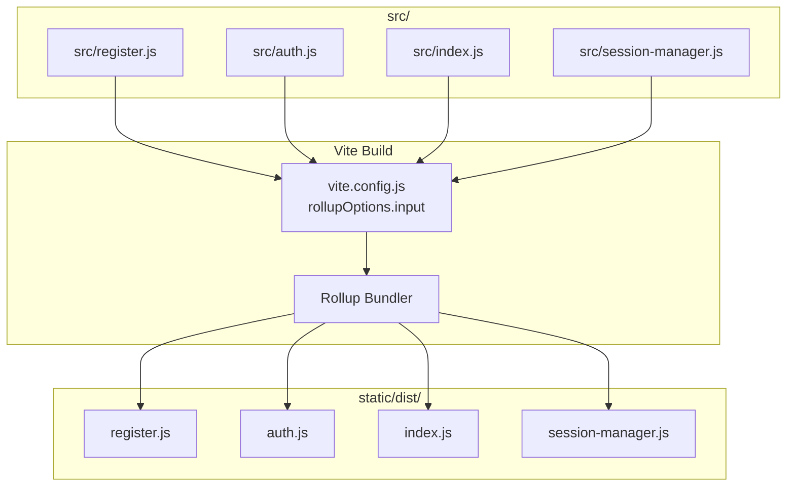
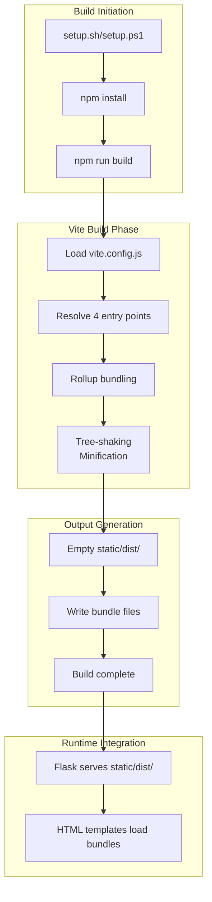
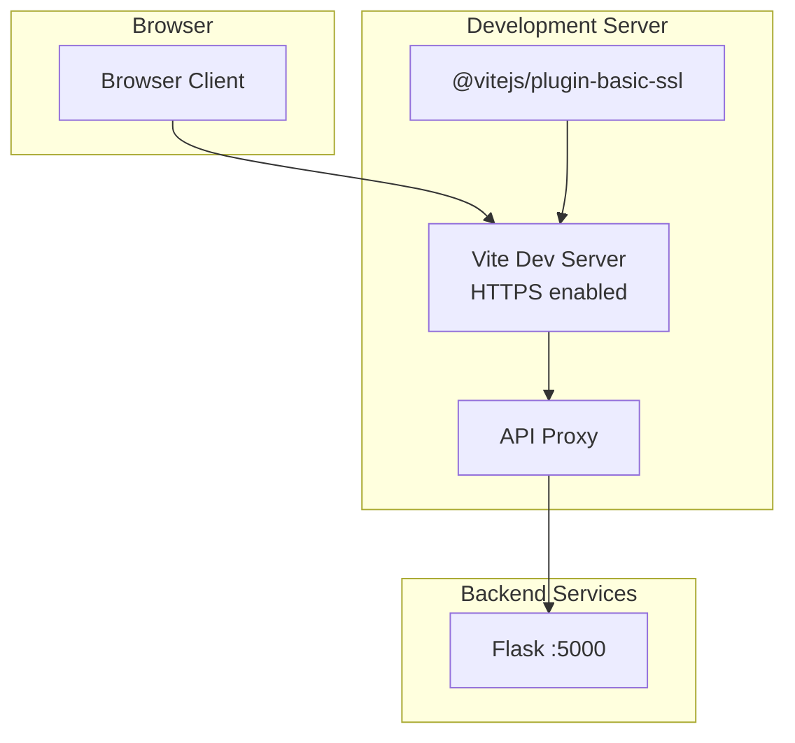
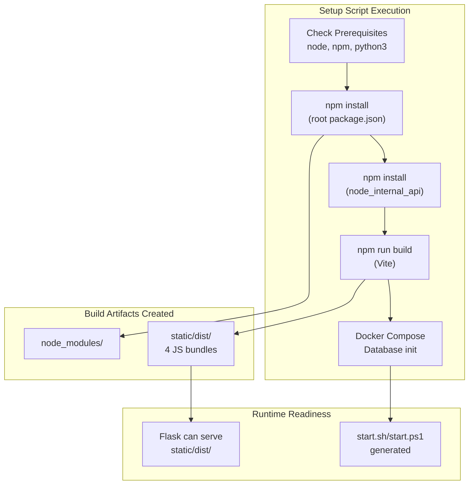

# Build System

> **Relevant source files**
> * [.gitignore](https://github.com/RogueElectron/Cypher1/blob/c60431e6/.gitignore)
> * [back-end/vite.config.js](https://github.com/RogueElectron/Cypher1/blob/c60431e6/back-end/vite.config.js)

## Purpose and Scope

This document describes the Vite-based build system used to compile and bundle the client-side JavaScript modules in the Cypher platform. The build system transforms source files in the `src/` directory into production-ready bundles in `static/dist/`, which are then served by the Flask application.

For information about running the built application, see [Running the Application](/RogueElectron/Cypher1/7.3-running-the-application). For details about the client-side modules themselves, see [Frontend Components](/RogueElectron/Cypher1/5-frontend-components).

**Sources:** [vite.config.js L1-L36](https://github.com/RogueElectron/Cypher1/blob/c60431e6/vite.config.js#L1-L36)

 [.gitignore L1-L7](https://github.com/RogueElectron/Cypher1/blob/c60431e6/.gitignore#L1-L7)

---

## Build Configuration Overview

The build system uses Vite as the bundler, configured through `vite.config.js`. Vite provides fast build times through native ES module support and Rollup-based production bundling.

### Key Configuration Elements

| Configuration Aspect | Value | Purpose |
| --- | --- | --- |
| Build Tool | Vite | Modern JavaScript bundler with fast HMR |
| Output Directory | `static/dist` | Flask static file directory |
| Entry Points | 4 modules | `register.js`, `auth.js`, `index.js`, `session-manager.js` |
| Plugin | `@vitejs/plugin-basic-ssl` | HTTPS support for development server |
| Bundler | Rollup | Production optimization and tree-shaking |

The build configuration is centralized in a single file at [vite.config.js L1-L36](https://github.com/RogueElectron/Cypher1/blob/c60431e6/vite.config.js#L1-L36)

**Sources:** [vite.config.js L1-L36](https://github.com/RogueElectron/Cypher1/blob/c60431e6/vite.config.js#L1-L36)

---

## Entry Points and Module Structure

### Build Entry Points

The build system defines four distinct entry points, each corresponding to a client-side module with specific responsibilities:



**Diagram: Entry Point to Output Mapping**

The input configuration is defined at [vite.config.js L12-L16](https://github.com/RogueElectron/Cypher1/blob/c60431e6/vite.config.js#L12-L16)

:

```yaml
input: {
  register: 'src/register.js',
  auth: 'src/auth.js',
  index: 'src/index.js',
  'session-manager': 'src/session-manager.js'
}
```

### Entry Point Responsibilities

| Entry Point | Source | Built Output | Loaded By | Purpose |
| --- | --- | --- | --- | --- |
| `register` | `src/register.js` | `static/dist/register.js` | `register.html` | OPAQUE registration + TOTP setup |
| `auth` | `src/auth.js` | `static/dist/auth.js` | `login.html` | OPAQUE login + TOTP verification |
| `session-manager` | `src/session-manager.js` | `static/dist/session-manager.js` | All pages | Token lifecycle management |
| `index` | `src/index.js` | `static/dist/index.js` | `index.html` | Main application UI |

**Sources:** [vite.config.js L12-L16](https://github.com/RogueElectron/Cypher1/blob/c60431e6/vite.config.js#L12-L16)

---

## Output Configuration

### File Naming Strategy

The build output uses deterministic file names without content hashes, configured at [vite.config.js L18-L22](https://github.com/RogueElectron/Cypher1/blob/c60431e6/vite.config.js#L18-L22)

:

```yaml
output: {
  entryFileNames: '[name].js',
  chunkFileNames: '[name].js',
  assetFileNames: '[name].[ext]'
}
```

This configuration ensures:

* **Predictable file paths**: HTML templates can reference `static/dist/auth.js` without cache-busting hashes
* **Simple versioning**: File names remain constant across builds
* **Flask integration**: No dynamic manifest parsing required

### Output Directory Structure

```
back-end/
├── static/
│   └── dist/              ← Build output (gitignored)
│       ├── register.js
│       ├── auth.js
│       ├── session-manager.js
│       └── index.js
├── src/                   ← Source files
│   ├── register.js
│   ├── auth.js
│   ├── session-manager.js
│   └── index.js
└── vite.config.js
```

The `static/dist` directory is excluded from version control via [.gitignore L6](https://github.com/RogueElectron/Cypher1/blob/c60431e6/.gitignore#L6-L6)

 and is recreated on each build due to `emptyOutDir: true` at [vite.config.js L10](https://github.com/RogueElectron/Cypher1/blob/c60431e6/vite.config.js#L10-L10)

**Sources:** [vite.config.js L9-L22](https://github.com/RogueElectron/Cypher1/blob/c60431e6/vite.config.js#L9-L22)

 [.gitignore L6](https://github.com/RogueElectron/Cypher1/blob/c60431e6/.gitignore#L6-L6)

---

## Build Pipeline

### Build Process Flow



**Diagram: Build Pipeline Execution Flow**

### Build Command

The build is triggered during setup via:

```
npm run build
```

This executes Vite's build process with the configuration at [vite.config.js L8-L24](https://github.com/RogueElectron/Cypher1/blob/c60431e6/vite.config.js#L8-L24)

### Build Output Characteristics

The Rollup bundler performs:

* **Module resolution**: Resolves `import` statements and dependencies
* **Tree-shaking**: Removes unused code paths
* **Minification**: Reduces file size for production
* **Code splitting**: Although not currently configured, Rollup supports chunk splitting

The `emptyOutDir: true` setting at [vite.config.js L10](https://github.com/RogueElectron/Cypher1/blob/c60431e6/vite.config.js#L10-L10)

 ensures clean builds by removing previous artifacts before each build.

**Sources:** [vite.config.js L8-L24](https://github.com/RogueElectron/Cypher1/blob/c60431e6/vite.config.js#L8-L24)

---

## Development Server Configuration

### HTTPS Development Server

The Vite development server is configured to run with HTTPS using the `@vitejs/plugin-basic-ssl` plugin:



**Diagram: Development Server Architecture**

### Server Configuration

Defined at [vite.config.js L25-L34](https://github.com/RogueElectron/Cypher1/blob/c60431e6/vite.config.js#L25-L34)

:

| Setting | Value | Purpose |
| --- | --- | --- |
| `https` | `true` | Enable HTTPS via `basicSsl()` plugin |
| `proxy['/api']` | `http://localhost:5000` | Forward API requests to Flask |
| `changeOrigin` | `true` | Modify request origin header |
| `secure` | `false` | Allow self-signed certificates |

The plugin configuration at [vite.config.js L5-L7](https://github.com/RogueElectron/Cypher1/blob/c60431e6/vite.config.js#L5-L7)

 loads `basicSsl()`, which generates a self-signed certificate for local HTTPS development.

### API Proxying

The development server proxies all `/api` requests to the Flask backend at `http://localhost:5000`. This enables:

* **CORS avoidance**: Same-origin requests during development
* **Simplified development**: No CORS configuration needed for local development
* **Production parity**: Matches production architecture where Flask serves both HTML and API

**Note:** The comment at [vite.config.js L29](https://github.com/RogueElectron/Cypher1/blob/c60431e6/vite.config.js#L29-L29)

 indicates the proxy target was changed from `:3000` to `:5000` to match Flask's port. The Node.js API on `:3000` is accessed directly by the client-side modules, not through the proxy.

**Sources:** [vite.config.js L5-L7](https://github.com/RogueElectron/Cypher1/blob/c60431e6/vite.config.js#L5-L7)

 [vite.config.js L25-L34](https://github.com/RogueElectron/Cypher1/blob/c60431e6/vite.config.js#L25-L34)

---

## Integration with Setup Pipeline

### Build System in Setup Flow



**Diagram: Build Integration in Setup Process**

The setup script (`setup.sh` or `setup.ps1`) executes the build as part of the initialization sequence:

1. **Dependency installation**: `npm install` downloads Vite and all build dependencies
2. **Build execution**: `npm run build` compiles the client-side modules
3. **Output verification**: The setup script ensures `static/dist/` contains the required bundles
4. **Service startup**: Generated startup scripts depend on built artifacts being present

### Build Artifact Cleanup

The `.gitignore` configuration at [.gitignore L6](https://github.com/RogueElectron/Cypher1/blob/c60431e6/.gitignore#L6-L6)

 excludes `static/dist/` from version control, meaning:

* **Fresh builds required**: Each deployment or local setup must run the build
* **No versioning of artifacts**: Only source files (`src/*.js`) are versioned
* **Clean repository**: Build outputs don't pollute the repository

**Sources:** [.gitignore L6](https://github.com/RogueElectron/Cypher1/blob/c60431e6/.gitignore#L6-L6)

---

## Build Dependencies

### NPM Package Dependencies

The build system requires several npm packages (defined in `package.json`, though not shown in the provided files):

| Package | Purpose |
| --- | --- |
| `vite` | Core build tool and development server |
| `@vitejs/plugin-basic-ssl` | HTTPS development server plugin |
| Rollup plugins | Bundling and optimization (included with Vite) |

These dependencies are installed in `node_modules/` (excluded from version control at [.gitignore L2](https://github.com/RogueElectron/Cypher1/blob/c60431e6/.gitignore#L2-L2)

 and [.gitignore L4](https://github.com/RogueElectron/Cypher1/blob/c60431e6/.gitignore#L4-L4)

).

### Client-Side Library Dependencies

The source modules (`src/*.js`) import external libraries that are bundled during the build:

* `@cloudflare/opaque-ts`: OPAQUE protocol implementation
* `otplib`: TOTP generation and verification
* `qrcode`: QR code generation for TOTP setup

These are resolved and bundled by Vite's Rollup bundler during the build process.

**Sources:** [.gitignore L2](https://github.com/RogueElectron/Cypher1/blob/c60431e6/.gitignore#L2-L2)

 [.gitignore L4](https://github.com/RogueElectron/Cypher1/blob/c60431e6/.gitignore#L4-L4)

---

## Production vs. Development Builds

### Build Mode Differences

| Aspect | Development (`vite dev`) | Production (`vite build`) |
| --- | --- | --- |
| Execution | Development server | One-time build |
| Output | In-memory modules | Files in `static/dist/` |
| Optimization | Minimal (fast rebuild) | Full (minification, tree-shaking) |
| Source Maps | Inline | Not configured |
| HTTPS | Yes (via `basicSsl`) | N/A (Flask serves files) |
| Hot Module Replacement | Enabled | N/A |

### Current Build Strategy

The repository uses **production builds exclusively** for both development and production environments:

* The `setup.sh` script runs `npm run build` regardless of environment
* The `dev.sh` script relies on the built files in `static/dist/`
* No development server mode is used in practice (Flask serves the built files)

This approach prioritizes:

* **Environment parity**: Development and production use identical bundles
* **Simplicity**: Single build path reduces configuration complexity
* **Flask integration**: Flask's static file serving works uniformly across environments

**Sources:** [vite.config.js L8-L24](https://github.com/RogueElectron/Cypher1/blob/c60431e6/vite.config.js#L8-L24)

 [vite.config.js L25-L34](https://github.com/RogueElectron/Cypher1/blob/c60431e6/vite.config.js#L25-L34)

---

## Build System Limitations and Design Decisions

### Design Decisions

1. **No content hashing**: File names don't include content hashes ([vite.config.js L18-L22](https://github.com/RogueElectron/Cypher1/blob/c60431e6/vite.config.js#L18-L22) ), simplifying template references but requiring manual cache busting if needed
2. **No code splitting**: All code for each entry point is bundled into a single file, increasing initial load size but reducing HTTP requests
3. **Manual build required**: Developers must run `npm run build` after modifying source files when using Flask directly (no HMR)
4. **Self-signed certificates**: The `basicSsl()` plugin generates self-signed certificates, requiring browser security exceptions in development

### Potential Improvements

The current build configuration could be enhanced with:

* **Content hashing**: `entryFileNames: '[name].[hash].js'` for cache invalidation
* **Code splitting**: Dynamic `import()` statements for lazy loading
* **Environment-specific builds**: Different configurations for development vs. production
* **Asset optimization**: Image compression and CSS minification plugins

However, these are not currently implemented, likely due to the relatively small codebase and prioritization of simplicity.

**Sources:** [vite.config.js L18-L22](https://github.com/RogueElectron/Cypher1/blob/c60431e6/vite.config.js#L18-L22)

 [vite.config.js L5-L7](https://github.com/RogueElectron/Cypher1/blob/c60431e6/vite.config.js#L5-L7)

---

## Summary

The Cypher build system uses Vite to transform four client-side JavaScript modules into production-ready bundles served by Flask. The configuration prioritizes simplicity and predictability through deterministic file naming and a single build path for all environments. The development server provides HTTPS support and API proxying, though the typical workflow relies on pre-built static files served by Flask rather than Vite's development server with HMR.

**Sources:** [vite.config.js L1-L36](https://github.com/RogueElectron/Cypher1/blob/c60431e6/vite.config.js#L1-L36)

 [.gitignore L1-L7](https://github.com/RogueElectron/Cypher1/blob/c60431e6/.gitignore#L1-L7)