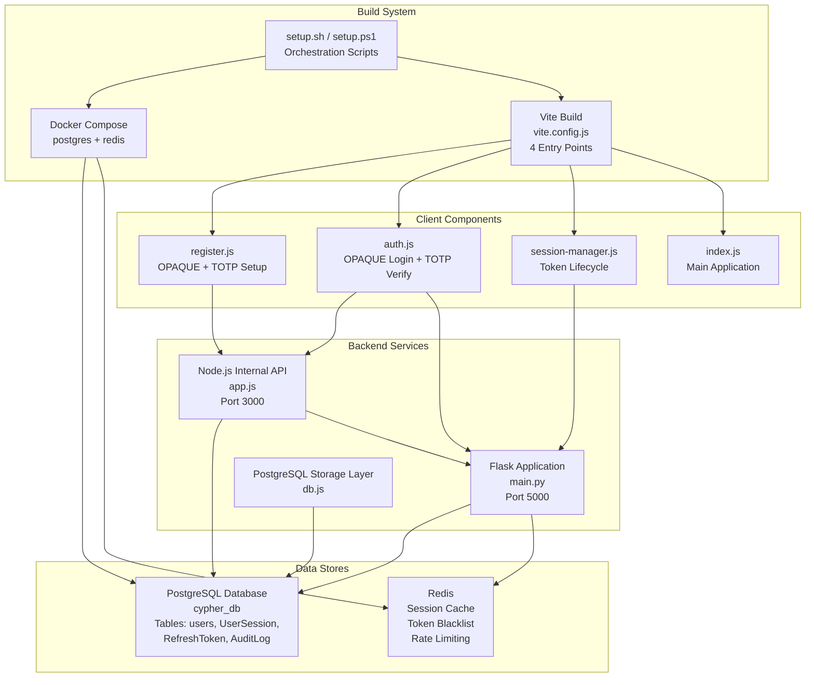
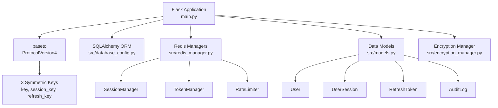
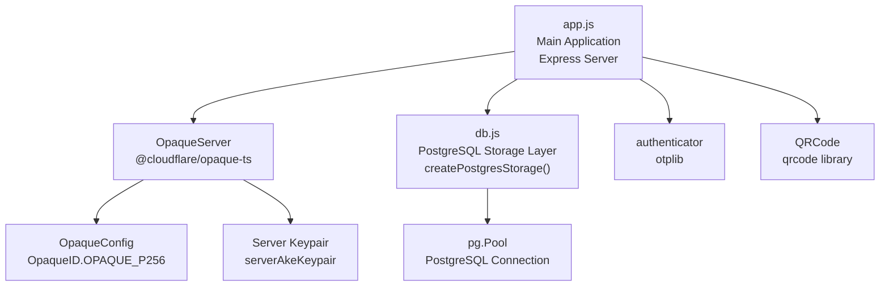
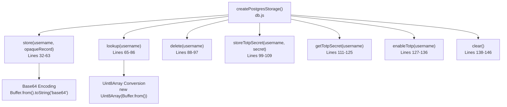
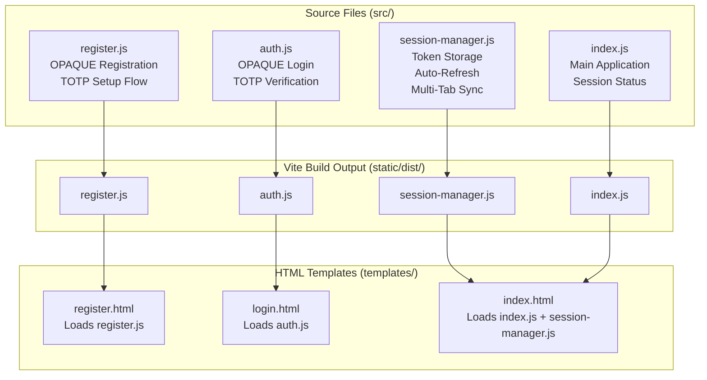
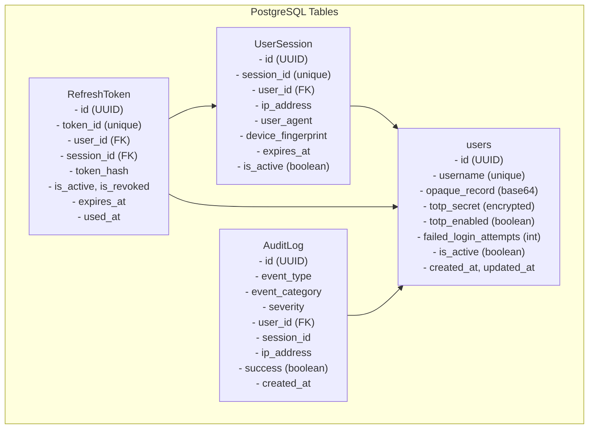
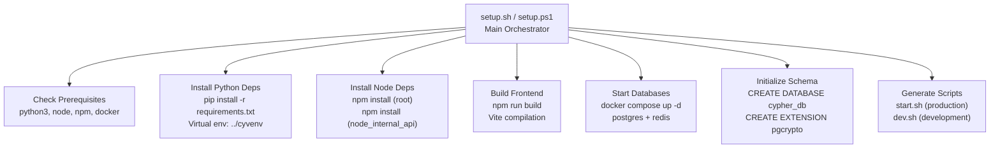
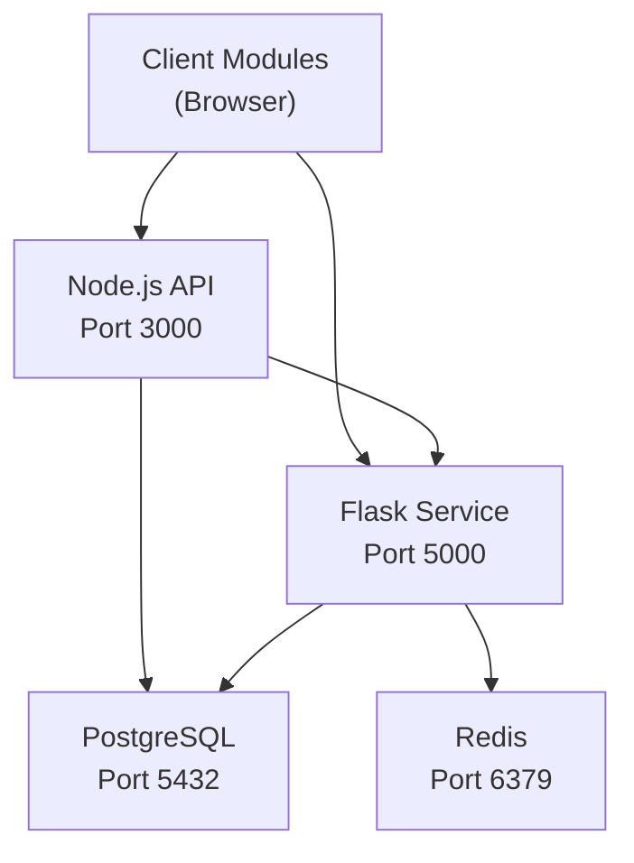

# Component Overview

> **Relevant source files**
> * [back-end/main.py](https://github.com/RogueElectron/Cypher1/blob/c60431e6/back-end/main.py)
> * [back-end/node_internal_api/app.js](https://github.com/RogueElectron/Cypher1/blob/c60431e6/back-end/node_internal_api/app.js)
> * [back-end/node_internal_api/db.js](https://github.com/RogueElectron/Cypher1/blob/c60431e6/back-end/node_internal_api/db.js)
> * [back-end/node_internal_api/package-lock.json](https://github.com/RogueElectron/Cypher1/blob/c60431e6/back-end/node_internal_api/package-lock.json)
> * [back-end/node_internal_api/package.json](https://github.com/RogueElectron/Cypher1/blob/c60431e6/back-end/node_internal_api/package.json)
> * [back-end/package-lock.json](https://github.com/RogueElectron/Cypher1/blob/c60431e6/back-end/package-lock.json)
> * [back-end/package.json](https://github.com/RogueElectron/Cypher1/blob/c60431e6/back-end/package.json)

## Purpose and Scope

This document provides a detailed inventory of the major system components that comprise the Cypher authentication platform. Each component is mapped to its corresponding code entities, dependencies, and technical implementation. For information about how these components communicate and exchange data, see [Data Flow and Communication Patterns](/RogueElectron/Cypher1/2.2-data-flow-and-communication-patterns). For detailed API endpoint specifications, see [API Reference](/RogueElectron/Cypher1/4.3-api-reference).

---

## System Components Map

The Cypher platform consists of five primary component categories: backend services, client-side modules, data stores, build tooling, and orchestration infrastructure.



**Sources:** [back-end/main.py L1-L564](https://github.com/RogueElectron/Cypher1/blob/c60431e6/back-end/main.py#L1-L564)

 [back-end/node_internal_api/app.js L1-L502](https://github.com/RogueElectron/Cypher1/blob/c60431e6/back-end/node_internal_api/app.js#L1-L502)

 [back-end/node_internal_api/db.js L1-L151](https://github.com/RogueElectron/Cypher1/blob/c60431e6/back-end/node_internal_api/db.js#L1-L151)

---

## Flask Session Service

The Flask application serves as the **token authority** and **session manager** for the platform, running on port 5000. It is implemented in a single Python module with modular imports for database and Redis management.

### Core Responsibilities

| Responsibility | Implementation Location |
| --- | --- |
| PASETO Token Creation | [main.py L92-L112](https://github.com/RogueElectron/Cypher1/blob/c60431e6/main.py#L92-L112) <br>  `create_token()` |
| PASETO Token Verification | [main.py L114-L149](https://github.com/RogueElectron/Cypher1/blob/c60431e6/main.py#L114-L149) <br>  `verify_token()` |
| Session Creation | [main.py L150-L305](https://github.com/RogueElectron/Cypher1/blob/c60431e6/main.py#L150-L305) <br>  `create_session()` |
| Access Token Verification | [main.py L307-L386](https://github.com/RogueElectron/Cypher1/blob/c60431e6/main.py#L307-L386) <br>  `verify_access()` |
| Token Refresh | [main.py L388-L513](https://github.com/RogueElectron/Cypher1/blob/c60431e6/main.py#L388-L513) <br>  `refresh_token()` |
| Logout/Cleanup | [main.py L515-L561](https://github.com/RogueElectron/Cypher1/blob/c60431e6/main.py#L515-L561) <br>  `logout()` |
| Template Serving | [main.py L76-L91](https://github.com/RogueElectron/Cypher1/blob/c60431e6/main.py#L76-L91) <br>  Route handlers |

### Technology Stack



### Key Configuration

The Flask service uses three distinct PASETO symmetric keys:

* **`key`**: Intermediate authentication token (3-minute lifetime) - [main.py L32](https://github.com/RogueElectron/Cypher1/blob/c60431e6/main.py#L32-L32)
* **`session_key`**: Access token (15-minute lifetime) - [main.py L33](https://github.com/RogueElectron/Cypher1/blob/c60431e6/main.py#L33-L33)
* **`refresh_key`**: Refresh token (7-day lifetime) - [main.py L34](https://github.com/RogueElectron/Cypher1/blob/c60431e6/main.py#L34-L34)

The service initializes on startup via `initialize_app()` [main.py L39-L69](https://github.com/RogueElectron/Cypher1/blob/c60431e6/main.py#L39-L69)

 which:

1. Initializes encryption manager
2. Connects to PostgreSQL and Redis
3. Creates database tables via SQLAlchemy
4. Verifies all subsystems are operational

**Sources:** [back-end/main.py L1-L564](https://github.com/RogueElectron/Cypher1/blob/c60431e6/back-end/main.py#L1-L564)

 [back-end/package.json L1-L17](https://github.com/RogueElectron/Cypher1/blob/c60431e6/back-end/package.json#L1-L17)

---

## Node.js Internal API

The Node.js service implements **cryptographic operations** (OPAQUE and TOTP) and acts as the **authentication gateway**, running on port 3000. It is the only component that handles password-related cryptography.

### Core Modules



### API Endpoints by Category

| Category | Endpoints | Implementation |
| --- | --- | --- |
| **OPAQUE Registration** | `POST /register/init``POST /register/finish` | [app.js L143-L220](https://github.com/RogueElectron/Cypher1/blob/c60431e6/app.js#L143-L220) |
| **OPAQUE Login** | `POST /login/init``POST /login/finish` | [app.js L222-L325](https://github.com/RogueElectron/Cypher1/blob/c60431e6/app.js#L222-L325) |
| **TOTP Management** | `POST /totp/setup``POST /totp/verify-setup``POST /totp/verify-login` | [app.js L329-L496](https://github.com/RogueElectron/Cypher1/blob/c60431e6/app.js#L329-L496) |

### OPAQUE Configuration

The server initializes OPAQUE with P-256 elliptic curve cryptography:

```javascript
// Line 82-87 in app.js
const cfg = getOpaqueConfig(OpaqueID.OPAQUE_P256);
const oprfSeed = cfg.prng.random(cfg.hash.Nh);
const serverKeypairSeed = cfg.prng.random(cfg.constants.Nseed);
const serverAkeKeypair = await cfg.ake.deriveAuthKeyPair(serverKeypairSeed);
```

The `OpaqueServer` instance [app.js L133-L137](https://github.com/RogueElectron/Cypher1/blob/c60431e6/app.js#L133-L137)

 is shared across all authentication requests and maintains cryptographic state.

### State Management

The Node.js API maintains three in-memory state stores:

| Store | Type | Purpose | Cleanup |
| --- | --- | --- | --- |
| `totpSecrets` | `Map<username, secret>` | Temporary TOTP secrets during setup | Cleared after verification [app.js L124](https://github.com/RogueElectron/Cypher1/blob/c60431e6/app.js#L124-L124) |
| `unverifiedAccounts` | `Map<username, timeoutId>` | Pending account verification | 5-minute timeout [app.js L92](https://github.com/RogueElectron/Cypher1/blob/c60431e6/app.js#L92-L92) |
| `global.userSessions` | `Map<username, expected>` | OPAQUE authentication state | Cleared after login [app.js L278](https://github.com/RogueElectron/Cypher1/blob/c60431e6/app.js#L278-L278) |

**Sources:** [back-end/node_internal_api/app.js L1-L502](https://github.com/RogueElectron/Cypher1/blob/c60431e6/back-end/node_internal_api/app.js#L1-L502)

 [back-end/node_internal_api/package.json L1-L31](https://github.com/RogueElectron/Cypher1/blob/c60431e6/back-end/node_internal_api/package.json#L1-L31)

---

## PostgreSQL Storage Layer

The Node.js API interacts with PostgreSQL through a dedicated storage module that abstracts database operations.

### Storage Interface

The `createPostgresStorage()` function [db.js L30-L148](https://github.com/RogueElectron/Cypher1/blob/c60431e6/db.js#L30-L148)

 returns an object implementing the following methods:



### Connection Pool

The storage layer uses a PostgreSQL connection pool [db.js L10-L19](https://github.com/RogueElectron/Cypher1/blob/c60431e6/db.js#L10-L19)

:

| Configuration | Value | Source |
| --- | --- | --- |
| Host | `process.env.POSTGRES_HOST` or `localhost` | [db.js L11](https://github.com/RogueElectron/Cypher1/blob/c60431e6/db.js#L11-L11) |
| Port | `process.env.POSTGRES_PORT` or `5432` | [db.js L12](https://github.com/RogueElectron/Cypher1/blob/c60431e6/db.js#L12-L12) |
| Database | `process.env.POSTGRES_DB` or `cypher_db` | [db.js L13](https://github.com/RogueElectron/Cypher1/blob/c60431e6/db.js#L13-L13) |
| User | `process.env.POSTGRES_USER` or `cypher_user` | [db.js L14](https://github.com/RogueElectron/Cypher1/blob/c60431e6/db.js#L14-L14) |
| Max Connections | `20` | [db.js L16](https://github.com/RogueElectron/Cypher1/blob/c60431e6/db.js#L16-L16) |
| Idle Timeout | `30000 ms` | [db.js L17](https://github.com/RogueElectron/Cypher1/blob/c60431e6/db.js#L17-L17) |

### OPAQUE Record Storage

OPAQUE records are stored as base64-encoded strings in the `users.opaque_record` column. The conversion happens at storage time [db.js L36](https://github.com/RogueElectron/Cypher1/blob/c60431e6/db.js#L36-L36)

:

```javascript
const opaqueRecordB64 = Buffer.from(opaqueRecord).toString('base64');
```

And reversal at lookup time [db.js L80-L81](https://github.com/RogueElectron/Cypher1/blob/c60431e6/db.js#L80-L81)

:

```javascript
const buffer = Buffer.from(opaqueRecordB64, 'base64');
return new Uint8Array(buffer);
```

**Sources:** [back-end/node_internal_api/db.js L1-L151](https://github.com/RogueElectron/Cypher1/blob/c60431e6/back-end/node_internal_api/db.js#L1-L151)

---

## Client-Side Components

The client-side codebase is written in vanilla JavaScript and compiled by Vite into four distinct bundles. These modules are loaded by HTML templates served by Flask.

### Module Structure



### Client Dependencies

Each client module imports the OPAQUE TypeScript library:

| Module | Primary Dependencies | Purpose |
| --- | --- | --- |
| `register.js` | `@cloudflare/opaque-ts` | Client-side OPAQUE registration protocol |
| `auth.js` | `@cloudflare/opaque-ts` | Client-side OPAQUE authentication protocol |
| `session-manager.js` | Native `fetch`, `localStorage`, `BroadcastChannel` | Token lifecycle management |
| `index.js` | `session-manager.js` | Application state coordination |

### Build Configuration

Vite is configured with four entry points in the build configuration:

| Entry Point | Source File | Output Location |
| --- | --- | --- |
| `register` | `src/register.js` | `static/dist/register.js` |
| `auth` | `src/auth.js` | `static/dist/auth.js` |
| `session-manager` | `src/session-manager.js` | `static/dist/session-manager.js` |
| `index` | `src/index.js` | `static/dist/index.js` |

The build system uses the `@vitejs/plugin-basic-ssl` plugin for HTTPS support during development, as referenced in [package.json L12](https://github.com/RogueElectron/Cypher1/blob/c60431e6/package.json#L12-L12)

**Sources:** [back-end/package.json L1-L17](https://github.com/RogueElectron/Cypher1/blob/c60431e6/back-end/package.json#L1-L17)

---

## Data Storage Components

The platform employs a **dual-storage architecture** combining PostgreSQL for durability and Redis for performance.

### PostgreSQL Schema

The PostgreSQL database (`cypher_db`) contains four primary tables managed by SQLAlchemy ORM models:



### Redis Cache Structure

Redis stores ephemeral session data with TTL-based expiration:

| Cache Type | Key Pattern | TTL | Purpose |
| --- | --- | --- | --- |
| Session Cache | `session:{session_id}` | 3600s (1 hour) | Fast session lookups |
| Token Blacklist | `blacklist:{access_token}` | 900s (15 min) | Revoked access tokens |
| Refresh Token Cache | `refresh:{token_id}` | 604800s (7 days) | Active refresh tokens |
| Rate Limit Counters | `ratelimit:{category}:{identifier}` | 60s | Request throttling |

The Redis managers are initialized via `init_redis_managers()` and accessed through singleton getters:

* `get_session_manager()` - Session CRUD operations
* `get_token_manager()` - Token blacklist and refresh cache
* `get_rate_limiter()` - Rate limiting checks

**Sources:** [back-end/main.py L18-L23](https://github.com/RogueElectron/Cypher1/blob/c60431e6/back-end/main.py#L18-L23)

 [back-end/node_internal_api/db.js L38-L50](https://github.com/RogueElectron/Cypher1/blob/c60431e6/back-end/node_internal_api/db.js#L38-L50)

---

## Build and Deployment Components

The platform uses a multi-stage setup process orchestrated by shell scripts and Docker Compose.

### Setup Scripts



### Docker Compose Services

The `docker-compose.yml` defines two services:

| Service | Image | Ports | Environment |
| --- | --- | --- | --- |
| `postgres` | `postgres:15` | `5432:5432` | `POSTGRES_DB=cypher_db``POSTGRES_USER=cypher_user``POSTGRES_PASSWORD=cypher_password` |
| `redis` | `redis:alpine` | `6379:6379` | Default configuration |

### Runtime Scripts

**Production Mode (`start.sh`)**:

1. Activate Python virtual environment: `source ../cyvenv/bin/activate`
2. Start Docker services: `docker compose up -d`
3. Launch Flask on port 5000: `python main.py &`
4. Launch Node.js on port 3000: `node node_internal_api/app.js &`
5. Capture PIDs for graceful shutdown

**Development Mode (`dev.sh`)**:

1. Same database setup
2. Flask with debug mode: `FLASK_DEBUG=1 python main.py &`
3. Node.js with hot reload: `nodemon node_internal_api/app.js &`

**Sources:** [back-end/package.json L1-L17](https://github.com/RogueElectron/Cypher1/blob/c60431e6/back-end/package.json#L1-L17)

 [back-end/node_internal_api/package.json L1-L31](https://github.com/RogueElectron/Cypher1/blob/c60431e6/back-end/node_internal_api/package.json#L1-L31)

---

## Component Dependency Matrix

The following table maps each component to its runtime and build dependencies:

| Component | Language | Runtime Dependencies | Build Dependencies | Port |
| --- | --- | --- | --- | --- |
| **Flask Service** | Python 3.x | `flask`, `flask-cors`, `paseto`, `sqlalchemy`, `redis`, `python-dotenv` | `requirements.txt` | 5000 |
| **Node.js API** | Node.js 14+ | `express`, `@cloudflare/opaque-ts`, `otplib`, `qrcode`, `pg`, `cors`, `helmet`, `xss-clean` | [node_internal_api/package.json L11-L22](https://github.com/RogueElectron/Cypher1/blob/c60431e6/node_internal_api/package.json#L11-L22) | 3000 |
| **Client Modules** | JavaScript ES6 | `@cloudflare/opaque-ts` (client-side) | `vite`, `@vitejs/plugin-basic-ssl` | N/A |
| **PostgreSQL** | SQL | N/A | Docker image `postgres:15` | 5432 |
| **Redis** | N/A | N/A | Docker image `redis:alpine` | 6379 |

### Cross-Component Communication



**Sources:** [back-end/main.py L1-L29](https://github.com/RogueElectron/Cypher1/blob/c60431e6/back-end/main.py#L1-L29)

 [back-end/node_internal_api/app.js L1-L46](https://github.com/RogueElectron/Cypher1/blob/c60431e6/back-end/node_internal_api/app.js#L1-L46)

 [back-end/node_internal_api/db.js L10-L28](https://github.com/RogueElectron/Cypher1/blob/c60431e6/back-end/node_internal_api/db.js#L10-L28)