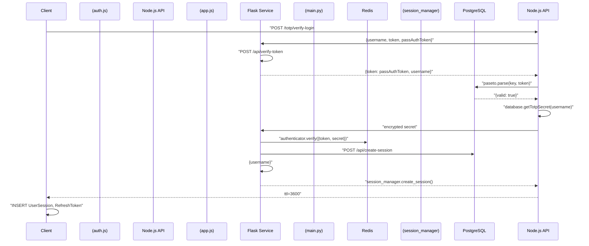
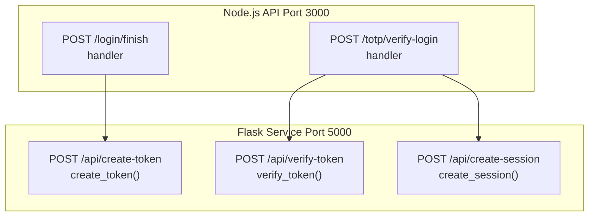
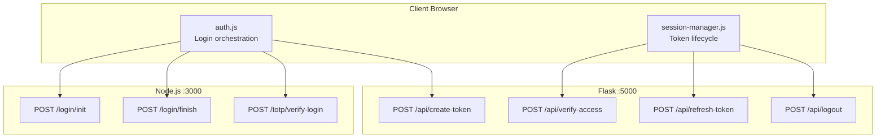
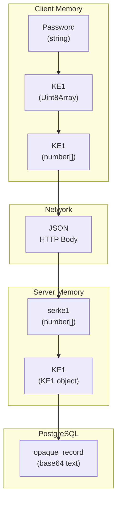
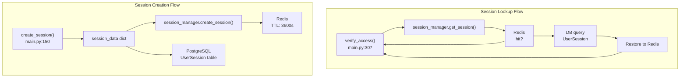
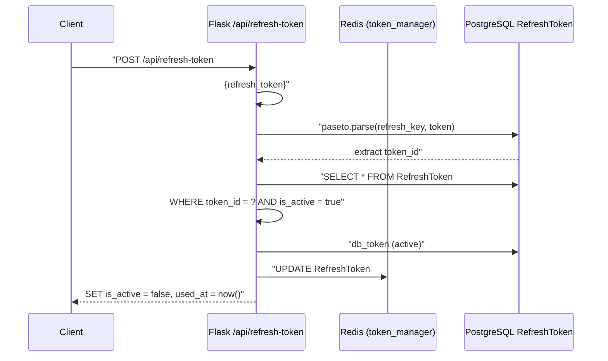
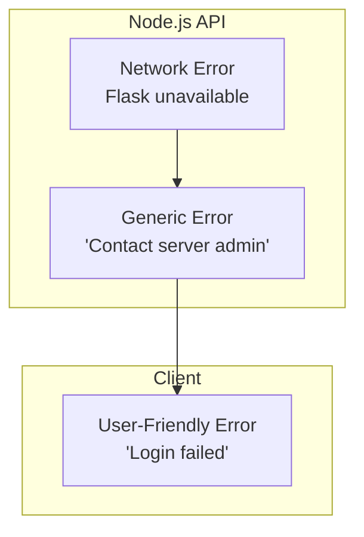
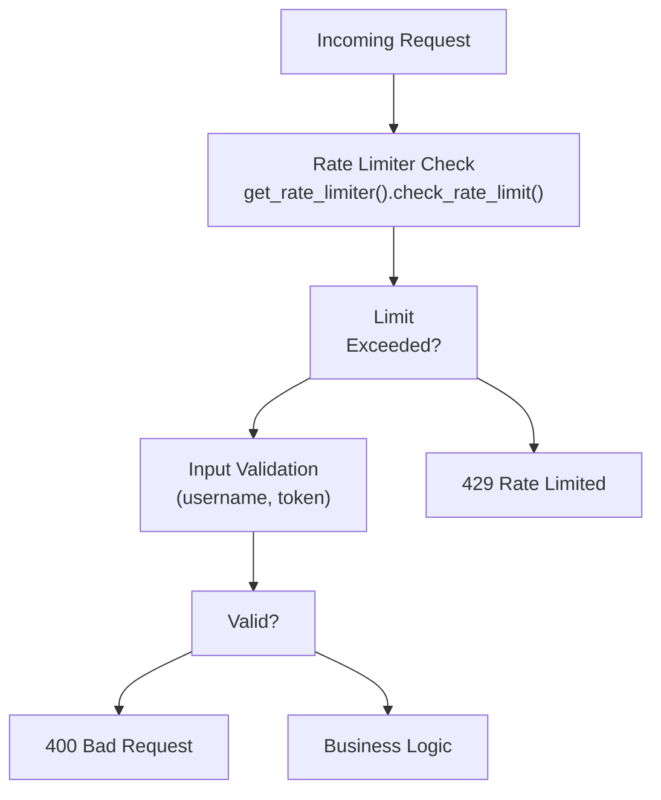

# Data Flow and Communication Patterns

> **Relevant source files**
> * [back-end/main.py](https://github.com/RogueElectron/Cypher1/blob/c60431e6/back-end/main.py)
> * [back-end/node_internal_api/app.js](https://github.com/RogueElectron/Cypher1/blob/c60431e6/back-end/node_internal_api/app.js)
> * [back-end/src/auth.js](https://github.com/RogueElectron/Cypher1/blob/c60431e6/back-end/src/auth.js)

## Purpose and Scope

This document describes how data flows through the Cypher authentication platform and the communication patterns between system components. It covers request-response cycles, inter-service coordination, data serialization formats, and state management strategies across the distributed architecture.

For details on individual components and their responsibilities, see [Component Overview](/RogueElectron/Cypher1/2.1-component-overview). For cryptographic protocol specifications, see [OPAQUE Protocol Implementation](/RogueElectron/Cypher1/3.1-opaque-protocol-implementation) and [TOTP Two-Factor Authentication](/RogueElectron/Cypher1/3.2-totp-two-factor-authentication). For complete API endpoint documentation, see [API Reference](/RogueElectron/Cypher1/4.3-api-reference).

---

## Communication Architecture Overview

The Cypher platform employs a **dual-service architecture** where the Node.js API (port 3000) and Flask service (port 5000) communicate via HTTP. The client (browser) initiates all workflows and orchestrates cross-service interactions.

### Service Responsibilities

| Service | Port | Primary Responsibility | Data Formats |
| --- | --- | --- | --- |
| **Node.js API** | 3000 | OPAQUE protocol operations, TOTP verification | Binary serialized (Uint8Array), JSON |
| **Flask Service** | 5000 | PASETO token management, session lifecycle | JSON, PASETO tokens |
| **Client (Browser)** | - | Workflow orchestration, cryptographic blinding | Binary (Uint8Array), JSON, cookies |

**Sources:** [back-end/node_internal_api/app.js L1-L501](https://github.com/RogueElectron/Cypher1/blob/c60431e6/back-end/node_internal_api/app.js#L1-L501)

 [back-end/main.py L1-L564](https://github.com/RogueElectron/Cypher1/blob/c60431e6/back-end/main.py#L1-L564)

---

## Request-Response Patterns

### OPAQUE Authentication Communication Flow

The OPAQUE authentication process involves **six HTTP requests** across two services, with the client performing local cryptographic operations between requests:

```mermaid
sequenceDiagram
  participant Client
  participant (auth.js)
  participant NodeAPI as Node.js API
  participant (app.js)
  participant Flask Service
  participant (main.py)
  participant PostgreSQL

  note over Client,(auth.js): "User enters password"
  Client->>Client: "OpaqueClient.authInit(password)
  Client->>Node.js API: → KE1"
  Node.js API->>PostgreSQL: "POST /login/init
  Node.js API->>Node.js API: {username, serke1}"
  Node.js API-->>Client: "database.lookup(username)
  Client->>Client: → credFileBytes"
  Client->>Flask Service: "CredentialFile.deserialize()
  Flask Service->>Flask Service: server.authInit()"
  Flask Service-->>Client: "{ser_ke2}"
  Client->>Node.js API: "KE2.deserialize()
  Node.js API->>Node.js API: client.authFinish()
  Node.js API->>Flask Service: → KE3"
  Flask Service-->>Node.js API: "POST /api/create-token
  Node.js API-->>Client: {username}"
```

**Key Communication Patterns:**

1. **Binary Serialization:** OPAQUE messages (KE1, KE2, KE3) are serialized to `Uint8Array` on the client [back-end/src/auth.js L245](https://github.com/RogueElectron/Cypher1/blob/c60431e6/back-end/src/auth.js#L245-L245)  transmitted as JSON arrays, and deserialized on the server [back-end/node_internal_api/app.js L242](https://github.com/RogueElectron/Cypher1/blob/c60431e6/back-end/node_internal_api/app.js#L242-L242)
2. **Inter-Service Token Creation:** The Node.js API makes an **internal HTTP call** to Flask to create the intermediate `pass_auth_token` [back-end/node_internal_api/app.js L284-L301](https://github.com/RogueElectron/Cypher1/blob/c60431e6/back-end/node_internal_api/app.js#L284-L301)
3. **Client-Side State Management:** The client stores the temporary token in a cookie with 180-second TTL [back-end/src/auth.js L313](https://github.com/RogueElectron/Cypher1/blob/c60431e6/back-end/src/auth.js#L313-L313)

**Sources:** [back-end/src/auth.js L239-L372](https://github.com/RogueElectron/Cypher1/blob/c60431e6/back-end/src/auth.js#L239-L372)

 [back-end/node_internal_api/app.js L222-L325](https://github.com/RogueElectron/Cypher1/blob/c60431e6/back-end/node_internal_api/app.js#L222-L325)

 [back-end/main.py L92-L112](https://github.com/RogueElectron/Cypher1/blob/c60431e6/back-end/main.py#L92-L112)

---

### TOTP Verification and Session Creation Flow

The second authentication phase involves TOTP verification and transitions to full session establishment:



**Data Flow Characteristics:**

1. **Token Verification Chain:** The intermediate `pass_auth_token` is verified via inter-service call [back-end/node_internal_api/app.js L405-L428](https://github.com/RogueElectron/Cypher1/blob/c60431e6/back-end/node_internal_api/app.js#L405-L428)  before TOTP validation proceeds.
2. **Dual Storage Pattern:** Sessions are written to **both** Redis (fast lookup) and PostgreSQL (persistence) simultaneously [back-end/main.py L195-L213](https://github.com/RogueElectron/Cypher1/blob/c60431e6/back-end/main.py#L195-L213)
3. **Token ID Separation:** The refresh token contains a unique `token_id` claim [back-end/main.py L233-L239](https://github.com/RogueElectron/Cypher1/blob/c60431e6/back-end/main.py#L233-L239)  while the actual token is never stored in the database—only its hash [back-end/main.py L256](https://github.com/RogueElectron/Cypher1/blob/c60431e6/back-end/main.py#L256-L256)

**Sources:** [back-end/src/auth.js L379-L458](https://github.com/RogueElectron/Cypher1/blob/c60431e6/back-end/src/auth.js#L379-L458)

 [back-end/node_internal_api/app.js L391-L496](https://github.com/RogueElectron/Cypher1/blob/c60431e6/back-end/node_internal_api/app.js#L391-L496)

 [back-end/main.py L150-L304](https://github.com/RogueElectron/Cypher1/blob/c60431e6/back-end/main.py#L150-L304)

---

## Inter-Service Communication Patterns

### Node.js → Flask Internal Calls

The Node.js API makes **three types** of internal HTTP requests to the Flask service:



| Source Endpoint | Target Endpoint | Payload | Purpose |
| --- | --- | --- | --- |
| `POST /login/finish` | `POST /api/create-token` | `{username}` | Create intermediate token after OPAQUE success |
| `POST /totp/verify-login` | `POST /api/verify-token` | `{token, username}` | Validate intermediate token before TOTP check |
| `POST /totp/verify-login` | `POST /api/create-session` | `{username}` | Create full session after TOTP verification |

**Error Handling Pattern:** If the Flask service is unreachable, the Node.js API returns a generic error without exposing internal details [back-end/node_internal_api/app.js L308-L314](https://github.com/RogueElectron/Cypher1/blob/c60431e6/back-end/node_internal_api/app.js#L308-L314)

:

```yaml
catch (tokenError) {
    console.error('Token creation failed:', tokenError);
    return res.status(500).json({
        success: false,
        message: 'Contact server admin'  // Generic error message
    });
}
```

**Sources:** [back-end/node_internal_api/app.js L284-L301](https://github.com/RogueElectron/Cypher1/blob/c60431e6/back-end/node_internal_api/app.js#L284-L301)

 [back-end/node_internal_api/app.js L405-L428](https://github.com/RogueElectron/Cypher1/blob/c60431e6/back-end/node_internal_api/app.js#L405-L428)

 [back-end/node_internal_api/app.js L453-L487](https://github.com/RogueElectron/Cypher1/blob/c60431e6/back-end/node_internal_api/app.js#L453-L487)

---

### Client → Multi-Service Orchestration

The client-side code in `auth.js` and `session-manager.js` orchestrates requests across both backend services:



**Communication Characteristics:**

* **CORS Configuration:** Both services allow cross-origin requests from `http://localhost:5000` and `http://127.0.0.1:5000` [back-end/node_internal_api/app.js L72-L77](https://github.com/RogueElectron/Cypher1/blob/c60431e6/back-end/node_internal_api/app.js#L72-L77)  [back-end/main.py L29](https://github.com/RogueElectron/Cypher1/blob/c60431e6/back-end/main.py#L29-L29)
* **Credential Inclusion:** All requests use `credentials: 'include'` to send cookies [back-end/src/auth.js L257](https://github.com/RogueElectron/Cypher1/blob/c60431e6/back-end/src/auth.js#L257-L257)
* **Error Propagation:** Fetch errors are caught and transformed into user-friendly messages [back-end/src/auth.js L357-L365](https://github.com/RogueElectron/Cypher1/blob/c60431e6/back-end/src/auth.js#L357-L365)

**Sources:** [back-end/src/auth.js L252-L326](https://github.com/RogueElectron/Cypher1/blob/c60431e6/back-end/src/auth.js#L252-L326)

 [back-end/src/auth.js L410-L420](https://github.com/RogueElectron/Cypher1/blob/c60431e6/back-end/src/auth.js#L410-L420)

---

## Data Transformation Patterns

### OPAQUE Message Serialization

OPAQUE protocol messages undergo multiple transformations as they traverse the system:



**Transformation Pipeline:**

1. **Client Generation:** `OpaqueClient.authInit(password)` produces a `KE1` object containing `Uint8Array` fields [back-end/src/auth.js L244](https://github.com/RogueElectron/Cypher1/blob/c60431e6/back-end/src/auth.js#L244-L244)
2. **Serialization:** `ke1.serialize()` converts to a plain number array for JSON compatibility [back-end/src/auth.js L245](https://github.com/RogueElectron/Cypher1/blob/c60431e6/back-end/src/auth.js#L245-L245)
3. **Network Transmission:** Standard JSON encoding over HTTP.
4. **Server Deserialization:** `KE1.deserialize(cfg, serke1)` reconstructs the typed object [back-end/node_internal_api/app.js L242](https://github.com/RogueElectron/Cypher1/blob/c60431e6/back-end/node_internal_api/app.js#L242-L242)
5. **Database Storage:** `CredentialFile` is serialized to `Uint8Array`, then converted to base64 for PostgreSQL text storage [back-end/node_internal_api/app.js L200](https://github.com/RogueElectron/Cypher1/blob/c60431e6/back-end/node_internal_api/app.js#L200-L200)

**Sources:** [back-end/src/auth.js L244-L245](https://github.com/RogueElectron/Cypher1/blob/c60431e6/back-end/src/auth.js#L244-L245)

 [back-end/node_internal_api/app.js L242](https://github.com/RogueElectron/Cypher1/blob/c60431e6/back-end/node_internal_api/app.js#L242-L242)

 [back-end/node_internal_api/app.js L197-L200](https://github.com/RogueElectron/Cypher1/blob/c60431e6/back-end/node_internal_api/app.js#L197-L200)

---

### PASETO Token Structure

PASETO tokens encapsulate different claim sets based on token type:

| Token Type | Key Used | Expiration | Claims | Storage Location |
| --- | --- | --- | --- | --- |
| **Intermediate** | `key` | 180s | `username`, `pass_authed` | Cookie |
| **Access** | `session_key` | 900s | `username`, `user_id`, `session_id`, `type`, `iat` | Cookie (HttpOnly) |
| **Refresh** | `refresh_key` | 7 days | `username`, `user_id`, `session_id`, `type`, `token_id`, `iat` | localStorage |

**Token Creation Pattern:**

```sql
# Intermediate token (Flask main.py:100-112)
claims = {'username': username, 'pass_authed': True}
token = paseto.create(key=key, purpose='local', claims=claims, exp_seconds=180)

# Access token (Flask main.py:216-230)
access_claims = {
    'username': username, 'user_id': str(user.id),
    'session_id': session_id, 'type': 'access', 'iat': current_time
}
access_token = paseto.create(key=session_key, purpose='local', 
                             claims=access_claims, exp_seconds=900)
```

**Validation Pattern:**

```css
# Token parsing (Flask main.py:323-327)
parsed = paseto.parse(key=session_key, purpose='local', token=access_token)
access_claims = parsed['message']
if access_claims.get('type') != 'access':
    return jsonify({'valid': False, 'error': 'Invalid token type'}), 401
```

**Sources:** [back-end/main.py L100-L112](https://github.com/RogueElectron/Cypher1/blob/c60431e6/back-end/main.py#L100-L112)

 [back-end/main.py L216-L230](https://github.com/RogueElectron/Cypher1/blob/c60431e6/back-end/main.py#L216-L230)

 [back-end/main.py L234-L249](https://github.com/RogueElectron/Cypher1/blob/c60431e6/back-end/main.py#L234-L249)

 [back-end/main.py L323-L333](https://github.com/RogueElectron/Cypher1/blob/c60431e6/back-end/main.py#L323-L333)

---

## State Management Data Flow

### Session Data: Redis vs PostgreSQL

The platform implements a **dual-storage pattern** with Redis as the primary cache and PostgreSQL as the persistent store:



**Session Data Structure:**

The `session_data` dictionary stored in Redis contains:

```
session_data = {
    'user_id': str(user.id),
    'username': username,
    'ip_address': client_ip,
    'user_agent': request.headers.get('User-Agent', ''),
    'device_fingerprint': data.get('device_fingerprint', '')
}
```

**Critical Pattern:** The same `session_id` returned from `session_manager.create_session()` is used for **both** Redis and PostgreSQL storage [back-end/main.py L195-L219](https://github.com/RogueElectron/Cypher1/blob/c60431e6/back-end/main.py#L195-L219)

 Earlier implementations generated separate IDs, causing "session mismatch" errors.

**Fallback Behavior:**

When a session is not found in Redis (cache miss or expiration), the system:

1. Queries PostgreSQL for the session [back-end/main.py L348-L354](https://github.com/RogueElectron/Cypher1/blob/c60431e6/back-end/main.py#L348-L354)
2. Validates the session is not expired [back-end/main.py L353](https://github.com/RogueElectron/Cypher1/blob/c60431e6/back-end/main.py#L353-L353)
3. Restores the session to Redis with a new 1-hour TTL [back-end/main.py L357-L362](https://github.com/RogueElectron/Cypher1/blob/c60431e6/back-end/main.py#L357-L362)

**Sources:** [back-end/main.py L187-L213](https://github.com/RogueElectron/Cypher1/blob/c60431e6/back-end/main.py#L187-L213)

 [back-end/main.py L343-L372](https://github.com/RogueElectron/Cypher1/blob/c60431e6/back-end/main.py#L343-L372)

---

### Token Lifecycle and Caching

Refresh tokens undergo a **one-time-use rotation pattern** with dual storage:



**Token Rotation Details:**

1. **Invalidation:** The old refresh token is marked `is_active = false` and `used_at` is timestamped [back-end/main.py L429-L430](https://github.com/RogueElectron/Cypher1/blob/c60431e6/back-end/main.py#L429-L430)
2. **Audit Trail:** The new token records `refreshed_from` in its metadata [back-end/main.py L489-L491](https://github.com/RogueElectron/Cypher1/blob/c60431e6/back-end/main.py#L489-L491)  creating a chain of token generations.
3. **Simultaneous Storage:** New refresh token is inserted into PostgreSQL and cached in Redis in a single transaction [back-end/main.py L482-L501](https://github.com/RogueElectron/Cypher1/blob/c60431e6/back-end/main.py#L482-L501)

**Blacklist Pattern:**

Access tokens are blacklisted upon logout with a TTL matching their remaining lifetime:

```css
# Blacklist access token (main.py:536)
get_token_manager().blacklist_token(access_token, ttl=900)

# Verify token not blacklisted (main.py:317-319)
if get_token_manager().is_token_blacklisted(access_token):
    return jsonify({'valid': False, 'error': 'Token blacklisted'}), 401
```

**Sources:** [back-end/main.py L388-L512](https://github.com/RogueElectron/Cypher1/blob/c60431e6/back-end/main.py#L388-L512)

 [back-end/main.py L536](https://github.com/RogueElectron/Cypher1/blob/c60431e6/back-end/main.py#L536-L536)

 [back-end/main.py L317-L319](https://github.com/RogueElectron/Cypher1/blob/c60431e6/back-end/main.py#L317-L319)

---

## Error Handling Patterns

### Cross-Service Error Propagation

Errors from inter-service calls are **transformed** to prevent information leakage:



**Example from TOTP verification:**

```
// Node.js catches Flask service errors (app.js:425-428)
catch (verifyError) {
    console.error('Token verification error:', verifyError);
    return res.status(500).json({ error: 'Token verification failed' });
}
```

The client further sanitizes this:

```javascript
// Client-side error handling (auth.js:357-365)
catch (error) {
    let errorMessage = error.message;
    if (error.message.includes('client not registered')) {
        errorMessage = 'User not found. Please register first.';
    } else if (error.message.includes('Authentication failed')) {
        errorMessage = 'Invalid username or password.';
    }
    showAlert(`Login failed: ${errorMessage}`, 'error');
}
```

**Sources:** [back-end/node_internal_api/app.js L425-L428](https://github.com/RogueElectron/Cypher1/blob/c60431e6/back-end/node_internal_api/app.js#L425-L428)

 [back-end/src/auth.js L357-L365](https://github.com/RogueElectron/Cypher1/blob/c60431e6/back-end/src/auth.js#L357-L365)

---

### Validation and Rate Limiting Flow

The Flask service performs **layered validation** before processing requests:



**Rate Limiting Pattern:**

```css
# Per-IP rate limiting (main.py:161-172)
rate_limit = get_rate_limiter().check_rate_limit(
    identifier=client_ip,
    limit=10,  # 10 requests per minute
    window_seconds=60,
    category="session_creation"
)

if not rate_limit['allowed']:
    return jsonify({
        'error': 'Rate limit exceeded',
        'retry_after': rate_limit['reset_time']
    }), 429
```

Rate limit counters are stored in Redis with automatic expiration matching the window size.

**Sources:** [back-end/main.py L161-L172](https://github.com/RogueElectron/Cypher1/blob/c60431e6/back-end/main.py#L161-L172)

---

## Summary

The Cypher platform's data flow architecture is characterized by:

1. **Service Separation:** OPAQUE/TOTP operations isolated in Node.js; token/session management in Flask
2. **Inter-Service HTTP:** Internal HTTP calls coordinate multi-phase authentication
3. **Binary Serialization:** OPAQUE messages use Uint8Array → number[] → JSON transformation
4. **Dual Storage:** Redis for performance, PostgreSQL for persistence and recovery
5. **Token Rotation:** One-time-use refresh tokens with audit trails
6. **Error Sanitization:** Multi-layer error transformation prevents information leakage
7. **Client Orchestration:** Browser-based JavaScript coordinates cross-service workflows

For implementation details of specific workflows, see [Authentication Workflows](/RogueElectron/Cypher1/3.4-authentication-workflows). For storage schema details, see [PostgreSQL Schema](/RogueElectron/Cypher1/6.1-postgresql-schema) and [Redis Caching and Rate Limiting](/RogueElectron/Cypher1/6.2-redis-caching-and-rate-limiting).