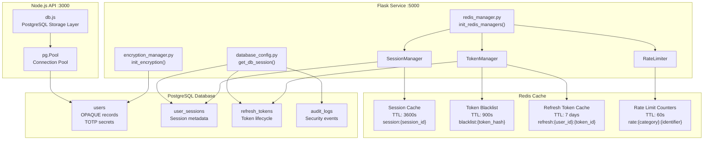
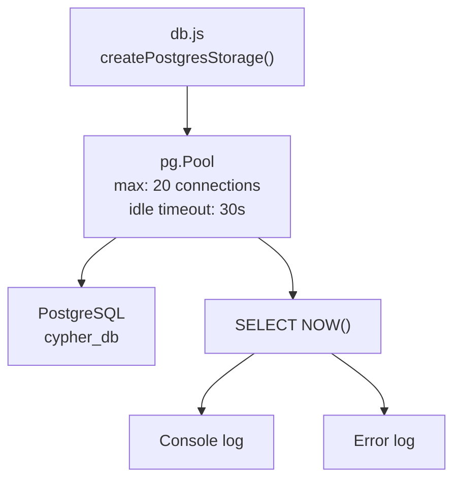
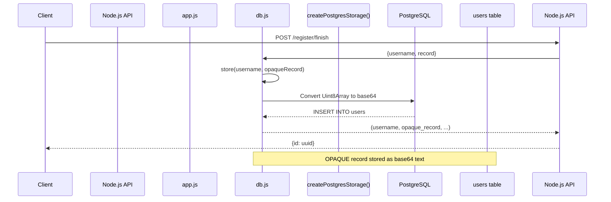
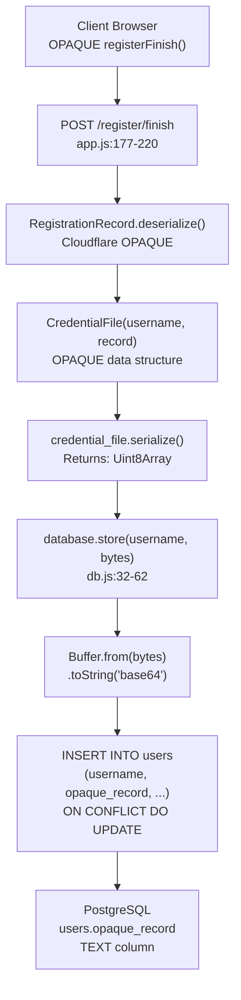
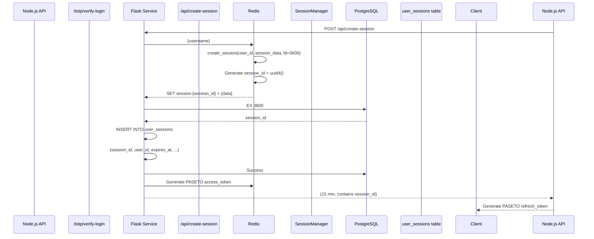
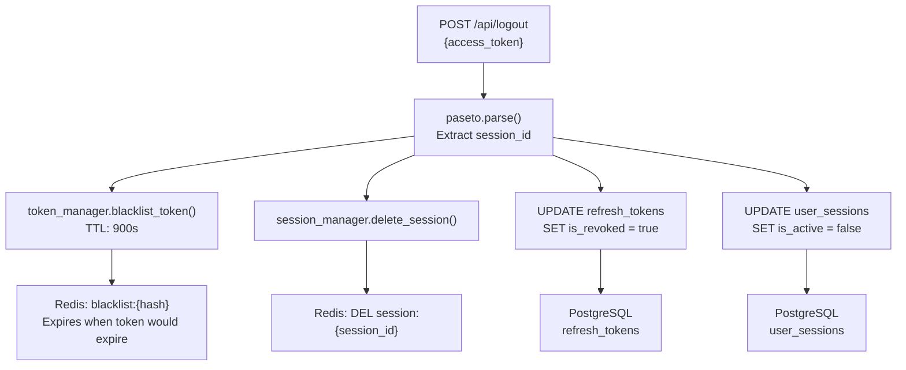
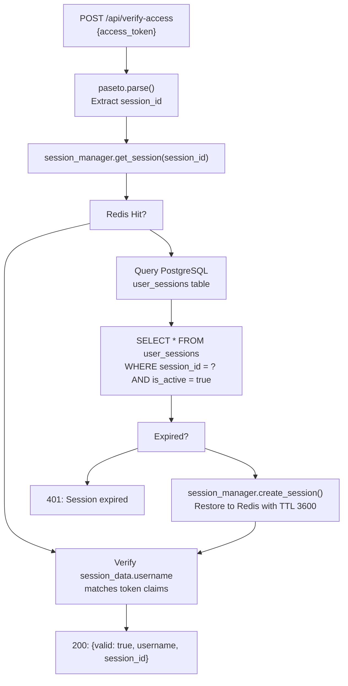
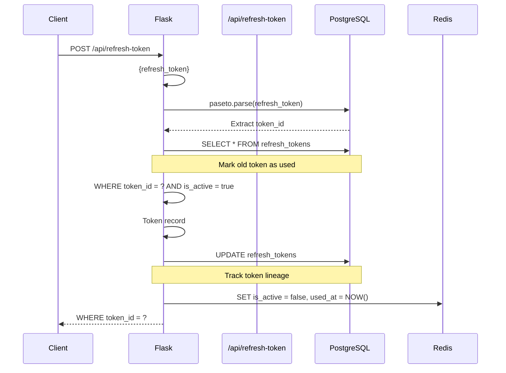
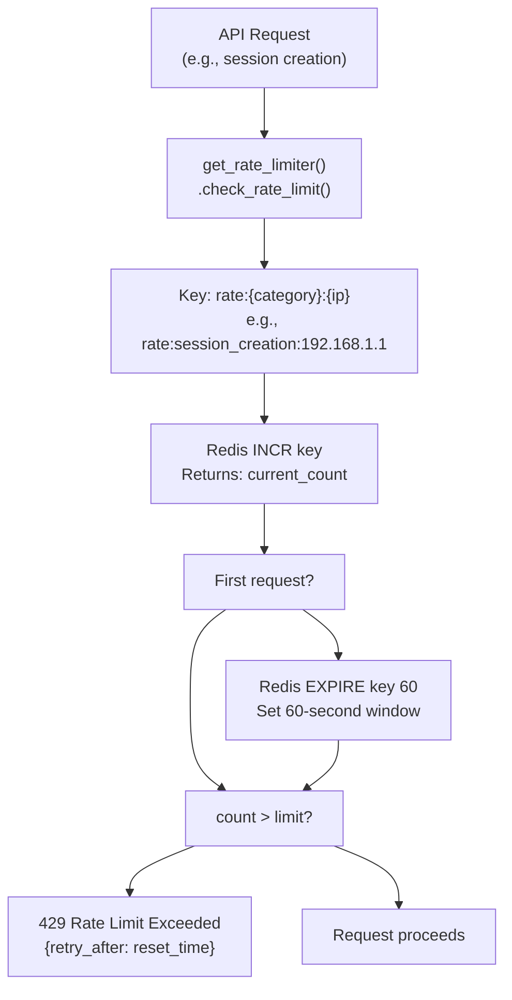
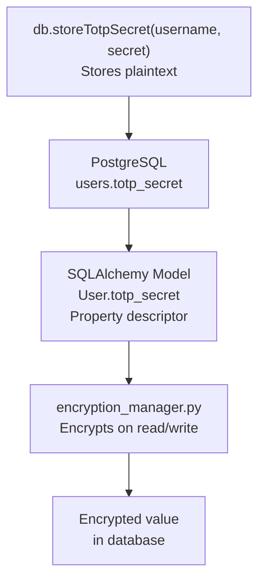

# Data Layer

> **Relevant source files**
> * [back-end/main.py](https://github.com/RogueElectron/Cypher1/blob/c60431e6/back-end/main.py)
> * [back-end/node_internal_api/app.js](https://github.com/RogueElectron/Cypher1/blob/c60431e6/back-end/node_internal_api/app.js)
> * [back-end/node_internal_api/db.js](https://github.com/RogueElectron/Cypher1/blob/c60431e6/back-end/node_internal_api/db.js)
> * [back-end/node_internal_api/package-lock.json](https://github.com/RogueElectron/Cypher1/blob/c60431e6/back-end/node_internal_api/package-lock.json)
> * [back-end/node_internal_api/package.json](https://github.com/RogueElectron/Cypher1/blob/c60431e6/back-end/node_internal_api/package.json)
> * [back-end/package-lock.json](https://github.com/RogueElectron/Cypher1/blob/c60431e6/back-end/package-lock.json)
> * [back-end/package.json](https://github.com/RogueElectron/Cypher1/blob/c60431e6/back-end/package.json)

## Purpose and Scope

This document describes the data storage architecture of the Cypher authentication platform, including the PostgreSQL schema for persistent storage and Redis caching strategy for performance optimization. It covers database table structures, data access patterns, and the dual-storage approach that balances durability with speed.

For information about the business models stored in these tables, see [PostgreSQL Schema](/RogueElectron/Cypher1/6.1-postgresql-schema). For Redis-specific caching operations and rate limiting, see [Redis Caching and Rate Limiting](/RogueElectron/Cypher1/6.2-redis-caching-and-rate-limiting).

---

## Overview

The Cypher platform implements a **dual-storage architecture** that separates concerns between durable persistence (PostgreSQL) and high-speed caching (Redis). This design provides both data integrity and performance optimization for authentication operations.

### Storage Responsibilities

| Component | Purpose | Primary Users | Key Features |
| --- | --- | --- | --- |
| **PostgreSQL** | Persistent storage of user data, sessions, tokens, and audit logs | Both Flask and Node.js services | ACID compliance, relational integrity, durable storage |
| **Redis** | High-speed caching and ephemeral data | Flask service | In-memory performance, TTL-based expiration, atomic operations |

### Architecture Principles

1. **PostgreSQL as Source of Truth**: All critical data (user credentials, session records, tokens) persists in PostgreSQL
2. **Redis as Performance Layer**: Frequently accessed data caches in Redis with appropriate TTLs
3. **Fallback Strategy**: Redis cache misses trigger PostgreSQL lookups with cache restoration
4. **Service-Specific Access**: Node.js uses raw SQL queries; Flask uses SQLAlchemy ORM

---

## Database Architecture Diagram



**Sources:** [back-end/node_internal_api/db.js L1-L151](https://github.com/RogueElectron/Cypher1/blob/c60431e6/back-end/node_internal_api/db.js#L1-L151)

 [back-end/main.py L17-L21](https://github.com/RogueElectron/Cypher1/blob/c60431e6/back-end/main.py#L17-L21)

---

## Database Connection Management

### PostgreSQL Connection Pool (Node.js)

The Node.js API establishes a connection pool to PostgreSQL for managing OPAQUE records and TOTP secrets.



**Configuration:**

* **Host**: `process.env.POSTGRES_HOST` (default: `localhost`)
* **Port**: `process.env.POSTGRES_PORT` (default: `5432`)
* **Database**: `process.env.POSTGRES_DB` (default: `cypher_db`)
* **User**: `process.env.POSTGRES_USER` (default: `cypher_user`)
* **Max Connections**: 20
* **Idle Timeout**: 30 seconds
* **Connection Timeout**: 2 seconds

**Sources:** [back-end/node_internal_api/db.js L9-L28](https://github.com/RogueElectron/Cypher1/blob/c60431e6/back-end/node_internal_api/db.js#L9-L28)

### SQLAlchemy Session Management (Flask)

The Flask service uses SQLAlchemy ORM with context-managed sessions to ensure proper connection lifecycle.

**Session Factory Pattern:**

* Sessions created via `get_db_session()` context manager
* Automatic commit on success, rollback on exception
* Connection cleanup guaranteed by context manager

**Sources:** [back-end/main.py L17-L21](https://github.com/RogueElectron/Cypher1/blob/c60431e6/back-end/main.py#L17-L21)

---

## Data Access Patterns

The platform uses two distinct data access patterns depending on the service making the request.

### Node.js Raw SQL Pattern



**Key Operations in db.js:**

| Method | SQL Operation | Purpose |
| --- | --- | --- |
| `store(username, opaqueRecord)` | `INSERT INTO users ... ON CONFLICT DO UPDATE` | Store/update OPAQUE registration record |
| `lookup(username)` | `SELECT opaque_record FROM users WHERE username = $1` | Retrieve OPAQUE record for authentication |
| `storeTotpSecret(username, secret)` | `UPDATE users SET totp_secret = $1` | Save TOTP secret after setup |
| `getTotpSecret(username)` | `SELECT totp_secret FROM users` | Retrieve TOTP secret for verification |
| `enableTotp(username)` | `UPDATE users SET totp_enabled = true` | Mark TOTP as activated |

**Data Encoding:**

* **OPAQUE records** stored as base64-encoded strings (converted from `Uint8Array`)
* **TOTP secrets** stored as plaintext strings (encryption handled by SQLAlchemy descriptor)

**Sources:** [back-end/node_internal_api/db.js L30-L151](https://github.com/RogueElectron/Cypher1/blob/c60431e6/back-end/node_internal_api/db.js#L30-L151)

 [back-end/node_internal_api/app.js L89-L90](https://github.com/RogueElectron/Cypher1/blob/c60431e6/back-end/node_internal_api/app.js#L89-L90)

### Flask ORM Pattern

```mermaid
sequenceDiagram
  participant Client
  participant Flask Service
  participant Main as main.py
  participant SQLAlchemy ORM
  participant get_db_session()
  participant models.py
  participant UserSession, RefreshToken
  participant PostgreSQL

  Client->>Flask Service: POST /api/create-session
  Flask Service->>Flask Service: Rate limit check
  Flask Service->>SQLAlchemy ORM: with get_db_session() as db
  SQLAlchemy ORM->>models.py: db.query(User).filter_by(username)
  models.py->>PostgreSQL: SELECT * FROM users WHERE username = ?
  PostgreSQL-->>models.py: User object
  models.py-->>SQLAlchemy ORM: User instance
  Flask Service->>models.py: UserSession(session_id, user_id, ...)
  Flask Service->>models.py: RefreshToken(token_id, user_id, ...)
  Flask Service->>SQLAlchemy ORM: db.add(db_session_obj)
  Flask Service->>SQLAlchemy ORM: db.add(db_refresh_token)
  Flask Service->>SQLAlchemy ORM: db.commit()
  SQLAlchemy ORM->>PostgreSQL: INSERT INTO user_sessions ...
  SQLAlchemy ORM->>PostgreSQL: INSERT INTO refresh_tokens ...
  PostgreSQL-->>SQLAlchemy ORM: Success
  SQLAlchemy ORM-->>Flask Service: Committed
  Flask Service-->>Client: {access_token, refresh_token}
```

**Key ORM Models:**

| Model Class | Table Name | Primary Operations |
| --- | --- | --- |
| `User` | `users` | Query by username, check account status, update login time |
| `UserSession` | `user_sessions` | Create, query by session_id, check expiration, deactivate |
| `RefreshToken` | `refresh_tokens` | Create, validate, mark as used, revoke |
| `AuditLog` | `audit_logs` | Create security event records |

**Sources:** [back-end/main.py L150-L304](https://github.com/RogueElectron/Cypher1/blob/c60431e6/back-end/main.py#L150-L304)

---

## OPAQUE Record Storage Flow

The OPAQUE protocol generates cryptographic records that must be stored securely. Here's how the Node.js API handles this process:



**Key Transformation:**

1. Client sends serialized OPAQUE record as `Uint8Array`
2. Node.js deserializes to validate structure
3. Creates `CredentialFile` wrapper object
4. Re-serializes to `Uint8Array` for storage
5. Converts to **base64 string** for PostgreSQL TEXT column
6. Stores with `ON CONFLICT DO UPDATE` to handle re-registration

**Sources:** [back-end/node_internal_api/app.js L177-L220](https://github.com/RogueElectron/Cypher1/blob/c60431e6/back-end/node_internal_api/app.js#L177-L220)

 [back-end/node_internal_api/db.js L32-L62](https://github.com/RogueElectron/Cypher1/blob/c60431e6/back-end/node_internal_api/db.js#L32-L62)

---

## Session and Token Storage

### Session Creation Flow



**Critical Detail:** The `session_id` returned by Redis `create_session()` **must** be used for all subsequent operations (access token claims, database records). Early code incorrectly generated separate UUIDs, causing "session mismatch" errors.

**Sources:** [back-end/main.py L186-L301](https://github.com/RogueElectron/Cypher1/blob/c60431e6/back-end/main.py#L186-L301)

### Token Blacklisting on Logout



**Blacklist TTL Logic:**

* Access tokens have 15-minute lifetime (900 seconds)
* Blacklist entry expires after 900 seconds (when token would naturally expire)
* Prevents replay attacks without permanent storage growth

**Sources:** [back-end/main.py L514-L560](https://github.com/RogueElectron/Cypher1/blob/c60431e6/back-end/main.py#L514-L560)

---

## Redis Caching Strategy

### Cache Key Patterns

The Redis implementation uses structured key namespaces to organize different data types:

| Key Pattern | Example | Data Type | TTL | Purpose |
| --- | --- | --- | --- | --- |
| `session:{session_id}` | `session:a3f2b1c4-...` | Hash | 3600s | Active session metadata |
| `blacklist:{token_hash}` | `blacklist:abc123...` | String | 900s | Invalidated access tokens |
| `refresh:{user_id}:{token_id}` | `refresh:uuid:token123` | Hash | 604800s | Cached refresh tokens |
| `rate:{category}:{identifier}` | `rate:session_creation:192.168.1.1` | Integer | 60s | Rate limit counters |

**Sources:** Referenced from high-level architecture diagrams

### Session Cache with PostgreSQL Fallback



**Fallback Strategy Benefits:**

* **Performance**: Hot sessions served from Redis (sub-millisecond)
* **Durability**: Cold sessions recovered from PostgreSQL
* **Self-healing**: Cache automatically repopulates on access

**Sources:** [back-end/main.py L343-L366](https://github.com/RogueElectron/Cypher1/blob/c60431e6/back-end/main.py#L343-L366)

---

## Data Consistency and Integrity

### Refresh Token Rotation

The platform implements **one-time-use refresh tokens** with rotation to limit replay attack windows:



**Audit Trail:**

* Each refresh token stores `refreshed_from` linking to previous token
* Forms a chain of token generations for security auditing
* Old tokens marked with `used_at` timestamp

**Sources:** [back-end/main.py L388-L512](https://github.com/RogueElectron/Cypher1/blob/c60431e6/back-end/main.py#L388-L512)

### Database Transaction Boundaries

The Flask service uses context-managed database sessions to ensure transaction safety:

```markdown
with get_db_session() as db_session:
    # All operations in atomic transaction
    user = db_session.query(User).filter_by(username=username).first()
    
    db_session.add(session_obj)
    db_session.add(token_obj)
    db_session.add(audit_log)
    
    db_session.commit()  # Atomic commit
    # Automatic rollback on exception
```

**Transaction Guarantees:**

* **Session creation**: User lookup, session creation, token generation, audit log - all or nothing
* **Token refresh**: Old token invalidation + new token creation - atomic
* **Logout**: Token blacklisting + session deletion + database updates - atomic

**Sources:** [back-end/main.py L177-L293](https://github.com/RogueElectron/Cypher1/blob/c60431e6/back-end/main.py#L177-L293)

---

## Rate Limiting with Redis

The platform implements distributed rate limiting using Redis atomic counters:



**Rate Limit Configuration Example:**

* **Category**: `session_creation`
* **Identifier**: Client IP address
* **Limit**: 10 requests
* **Window**: 60 seconds
* **TTL**: Counter expires after 60 seconds (automatic cleanup)

**Sources:** [back-end/main.py L160-L172](https://github.com/RogueElectron/Cypher1/blob/c60431e6/back-end/main.py#L160-L172)

---

## TOTP Secret Encryption

TOTP secrets are encrypted before storage using a Python encryption service. The Node.js API stores plaintext secrets temporarily, which the Flask service's SQLAlchemy model encrypts via a descriptor.



**Encryption Flow:**

1. Node.js stores TOTP secret as plaintext string in `users.totp_secret`
2. Flask's `User` model defines `totp_secret` as encrypted property
3. SQLAlchemy descriptor intercepts reads/writes
4. `encryption_manager` handles actual encryption/decryption

**Note:** The encryption mechanism is initialized via `init_encryption()` in Flask but details are in separate files not fully shown here.

**Sources:** [back-end/node_internal_api/db.js L99-L108](https://github.com/RogueElectron/Cypher1/blob/c60431e6/back-end/node_internal_api/db.js#L99-L108)

 [back-end/main.py L19](https://github.com/RogueElectron/Cypher1/blob/c60431e6/back-end/main.py#L19-L19)

---

## Summary Table: Data Layer Components

| Component | Technology | Access Pattern | Primary Users | TTL/Persistence |
| --- | --- | --- | --- | --- |
| **OPAQUE Records** | PostgreSQL `users.opaque_record` | Raw SQL (`db.js`) | Node.js API | Permanent |
| **TOTP Secrets** | PostgreSQL `users.totp_secret` | Raw SQL + ORM | Node.js + Flask | Permanent (encrypted) |
| **User Sessions** | PostgreSQL `user_sessions` + Redis | ORM + Cache | Flask Service | 1 hour (both) |
| **Refresh Tokens** | PostgreSQL `refresh_tokens` + Redis | ORM + Cache | Flask Service | 7 days (both) |
| **Token Blacklist** | Redis only | Cache Manager | Flask Service | 15 minutes |
| **Rate Limits** | Redis only | Atomic Counters | Flask Service | 60 seconds |
| **Audit Logs** | PostgreSQL `audit_logs` | ORM | Flask Service | Permanent |

**Sources:** [back-end/node_internal_api/db.js L1-L151](https://github.com/RogueElectron/Cypher1/blob/c60431e6/back-end/node_internal_api/db.js#L1-L151)

 [back-end/main.py L1-L564](https://github.com/RogueElectron/Cypher1/blob/c60431e6/back-end/main.py#L1-L564)