# Flask Session Service

> **Relevant source files**
> * [back-end/main.py](https://github.com/RogueElectron/Cypher1/blob/c60431e6/back-end/main.py)
> * [back-end/src/index.js](https://github.com/RogueElectron/Cypher1/blob/c60431e6/back-end/src/index.js)
> * [back-end/src/session-manager.js](https://github.com/RogueElectron/Cypher1/blob/c60431e6/back-end/src/session-manager.js)
> * [back-end/static/dist/index.js](https://github.com/RogueElectron/Cypher1/blob/c60431e6/back-end/static/dist/index.js)
> * [back-end/static/dist/session-manager.js](https://github.com/RogueElectron/Cypher1/blob/c60431e6/back-end/static/dist/session-manager.js)

## Purpose and Scope

The Flask Session Service is the primary backend component of the Cypher authentication platform, running on port 5000. It manages stateless session authentication through PASETO (Platform-Agnostic Security Tokens) tokens, handles session lifecycle operations, and serves the web interface. The service coordinates with PostgreSQL for persistent storage and Redis for high-performance caching.

This document covers PASETO token management, session creation/verification, token refresh mechanics, and rate limiting. For cryptographic authentication operations (OPAQUE and TOTP), see [Node.js Internal API](/RogueElectron/Cypher1/4.2-node.js-internal-api). For client-side session handling, see [Session Manager Module](/RogueElectron/Cypher1/5.3-session-manager-module).

**Sources**: [back-end/main.py L1-L564](https://github.com/RogueElectron/Cypher1/blob/c60431e6/back-end/main.py#L1-L564)

---

## Application Architecture

### Initialization Sequence

The Flask application bootstraps through the `initialize_app()` function, which sets up encryption, databases, and Redis managers in a specific order.

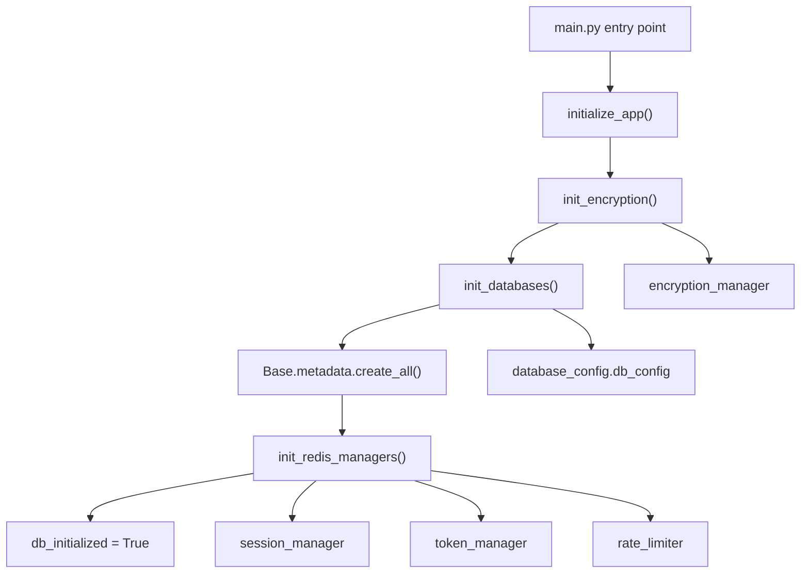

**Sources**: [back-end/main.py L39-L74](https://github.com/RogueElectron/Cypher1/blob/c60431e6/back-end/main.py#L39-L74)

The initialization process executes these steps:

| Step | Function | Purpose | Failure Behavior |
| --- | --- | --- | --- |
| 1 | `init_encryption()` | Initialize encryption service for TOTP secrets | Logs error, exits application |
| 2 | `init_databases()` | Connect to PostgreSQL | Returns False, exits application |
| 3 | `Base.metadata.create_all()` | Create/verify database tables | Exception logged, exits application |
| 4 | `init_redis_managers()` | Initialize Redis connection pools | Logs error, exits application |

**Sources**: [back-end/main.py L39-L74](https://github.com/RogueElectron/Cypher1/blob/c60431e6/back-end/main.py#L39-L74)

### Key Dependencies and Imports

The application imports critical modules for token management and database operations:

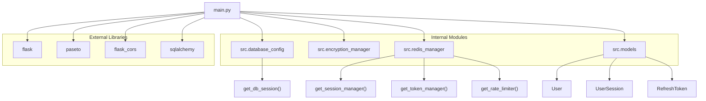

**Sources**: [back-end/main.py L1-L22](https://github.com/RogueElectron/Cypher1/blob/c60431e6/back-end/main.py#L1-L22)

---

## PASETO Token System

The Flask service uses three distinct PASETO symmetric keys to prevent token type confusion attacks. Each key generates tokens with different claims and lifetimes.

### Token Type Architecture

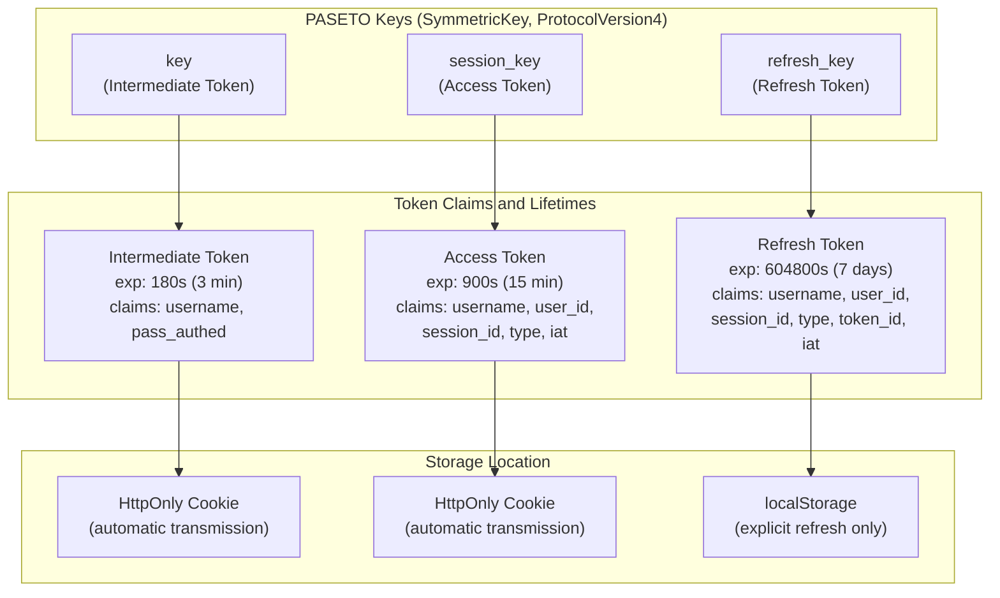

**Sources**: [back-end/main.py L31-L34](https://github.com/RogueElectron/Cypher1/blob/c60431e6/back-end/main.py#L31-L34)

 [back-end/main.py L100-L112](https://github.com/RogueElectron/Cypher1/blob/c60431e6/back-end/main.py#L100-L112)

 [back-end/main.py L216-L249](https://github.com/RogueElectron/Cypher1/blob/c60431e6/back-end/main.py#L216-L249)

### Token Type Specifications

| Token Type | Symmetric Key | Lifetime | Purpose | Created By | Validated By |
| --- | --- | --- | --- | --- | --- |
| **Intermediate** | `key` | 3 minutes | Bridge OPAQUE authentication to TOTP verification | `create_token()` endpoint | `verify_token()` endpoint |
| **Access** | `session_key` | 15 minutes | Authorize API requests | `create_session()` endpoint | `verify_access()` endpoint |
| **Refresh** | `refresh_key` | 7 days | Issue new access/refresh token pairs | `create_session()` endpoint | `refresh_token()` endpoint |

**Sources**: [back-end/main.py L31-L34](https://github.com/RogueElectron/Cypher1/blob/c60431e6/back-end/main.py#L31-L34)

 [back-end/main.py L92-L112](https://github.com/RogueElectron/Cypher1/blob/c60431e6/back-end/main.py#L92-L112)

 [back-end/main.py L150-L304](https://github.com/RogueElectron/Cypher1/blob/c60431e6/back-end/main.py#L150-L304)

 [back-end/main.py L388-L512](https://github.com/RogueElectron/Cypher1/blob/c60431e6/back-end/main.py#L388-L512)

### Intermediate Token Claims

Created after successful OPAQUE authentication, before TOTP verification:

```css
claims = {
    'username': username,
    'pass_authed': True  # Indicates password authentication succeeded
}
```

**Sources**: [back-end/main.py L100-L103](https://github.com/RogueElectron/Cypher1/blob/c60431e6/back-end/main.py#L100-L103)

### Access Token Claims

Created after full authentication (OPAQUE + TOTP):

```css
access_claims = {
    'username': username,
    'user_id': str(user.id),
    'session_id': session_id,  # Links to Redis and PostgreSQL sessions
    'type': 'access',           # Prevents token type confusion
    'iat': current_time         # Issued-at timestamp
}
```

**Sources**: [back-end/main.py L216-L222](https://github.com/RogueElectron/Cypher1/blob/c60431e6/back-end/main.py#L216-L222)

### Refresh Token Claims

One-time-use tokens for rotating credentials:

```css
refresh_claims = {
    'username': username,
    'user_id': str(user.id),
    'session_id': session_id,
    'type': 'refresh',
    'token_id': refresh_token_id,  # Unique identifier for tracking
    'iat': current_time
}
```

**Sources**: [back-end/main.py L234-L241](https://github.com/RogueElectron/Cypher1/blob/c60431e6/back-end/main.py#L234-L241)

---

## API Endpoints

### Frontend Serving Routes

The Flask service serves HTML templates for the web interface:

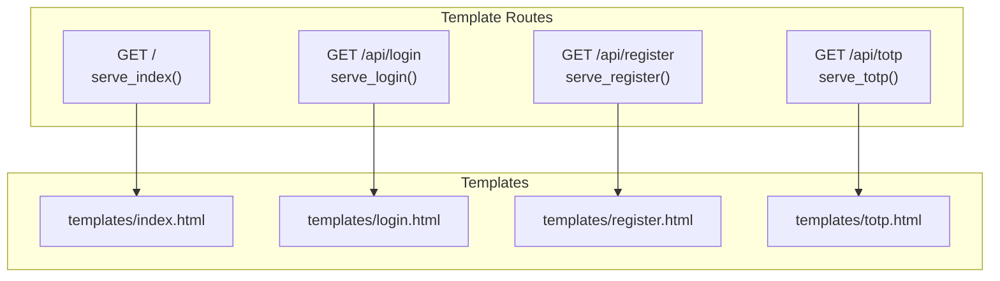

**Sources**: [back-end/main.py L76-L90](https://github.com/RogueElectron/Cypher1/blob/c60431e6/back-end/main.py#L76-L90)

### Token Management Endpoints

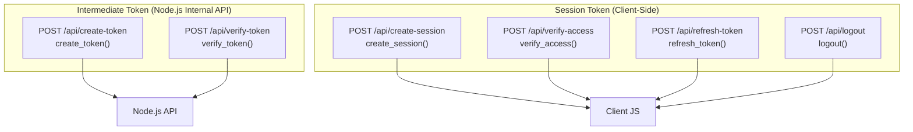

**Sources**: [back-end/main.py L92-L560](https://github.com/RogueElectron/Cypher1/blob/c60431e6/back-end/main.py#L92-L560)

### Endpoint Summary Table

| Endpoint | Method | Handler Function | Request Body | Response | Purpose |
| --- | --- | --- | --- | --- | --- |
| `/api/create-token` | POST | `create_token()` | `{username}` | `{token}` | Issue intermediate token after OPAQUE |
| `/api/verify-token` | POST | `verify_token()` | `{token, username}` | `{valid, claims}` | Validate intermediate token |
| `/api/create-session` | POST | `create_session()` | `{username, device_fingerprint?}` | `{access_token, refresh_token, expires_in}` | Create session after TOTP |
| `/api/verify-access` | POST | `verify_access()` | `{access_token}` | `{valid, username, user_id, session_id}` | Validate access token |
| `/api/refresh-token` | POST | `refresh_token()` | `{refresh_token}` | `{access_token, refresh_token, expires_in}` | Rotate tokens |
| `/api/logout` | POST | `logout()` | `{access_token, refresh_token}` | `{success}` | Terminate session |

**Sources**: [back-end/main.py L92-L560](https://github.com/RogueElectron/Cypher1/blob/c60431e6/back-end/main.py#L92-L560)

---

## Session Management

### Session Creation Flow

The `create_session()` endpoint implements a multi-step process that spans Redis caching, PostgreSQL persistence, and token generation.

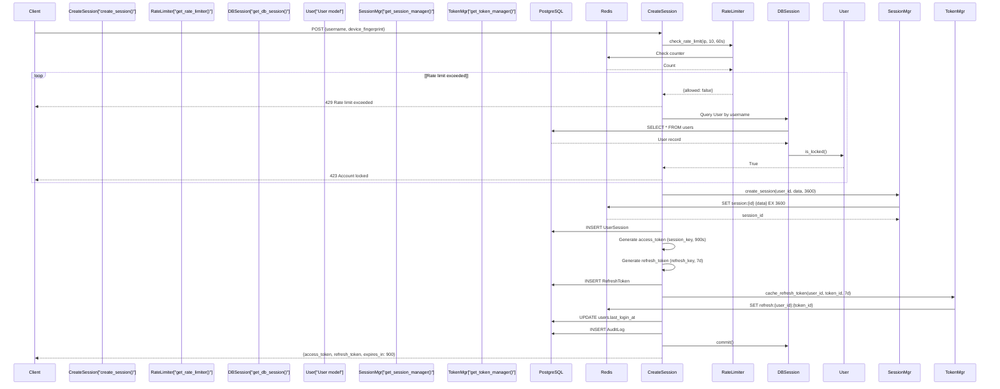

**Sources**: [back-end/main.py L150-L304](https://github.com/RogueElectron/Cypher1/blob/c60431e6/back-end/main.py#L150-L304)

### Critical Session Creation Details

**Session ID Synchronization**: The service uses the `session_id` returned by Redis as the canonical identifier. This prevents "session mismatch" errors that occur when different IDs are used for Redis and PostgreSQL:

```markdown
# IMPORTANT: use the returned session_id for everything
session_id = get_session_manager().create_session(
    user_id=str(user.id),
    session_data=session_data,
    ttl=3600
)

# PostgreSQL session uses the same ID
db_session_obj = UserSession(
    session_id=session_id,  # Matches Redis
    user_id=user.id,
    # ...
)
```

**Sources**: [back-end/main.py L195-L206](https://github.com/RogueElectron/Cypher1/blob/c60431e6/back-end/main.py#L195-L206)

**Session Data Structure**: Both Redis and PostgreSQL store enriched session metadata:

| Field | Source | Purpose |
| --- | --- | --- |
| `user_id` | Database lookup | Link to user record |
| `username` | Request body | Quick username access |
| `ip_address` | `request.remote_addr` | Security monitoring |
| `user_agent` | Request headers | Device identification |
| `device_fingerprint` | Request body (optional) | Multi-device tracking |

**Sources**: [back-end/main.py L187-L193](https://github.com/RogueElectron/Cypher1/blob/c60431e6/back-end/main.py#L187-L193)

---

## Session Verification

The `verify_access()` endpoint implements a two-tier verification strategy: fast Redis lookup with PostgreSQL fallback.

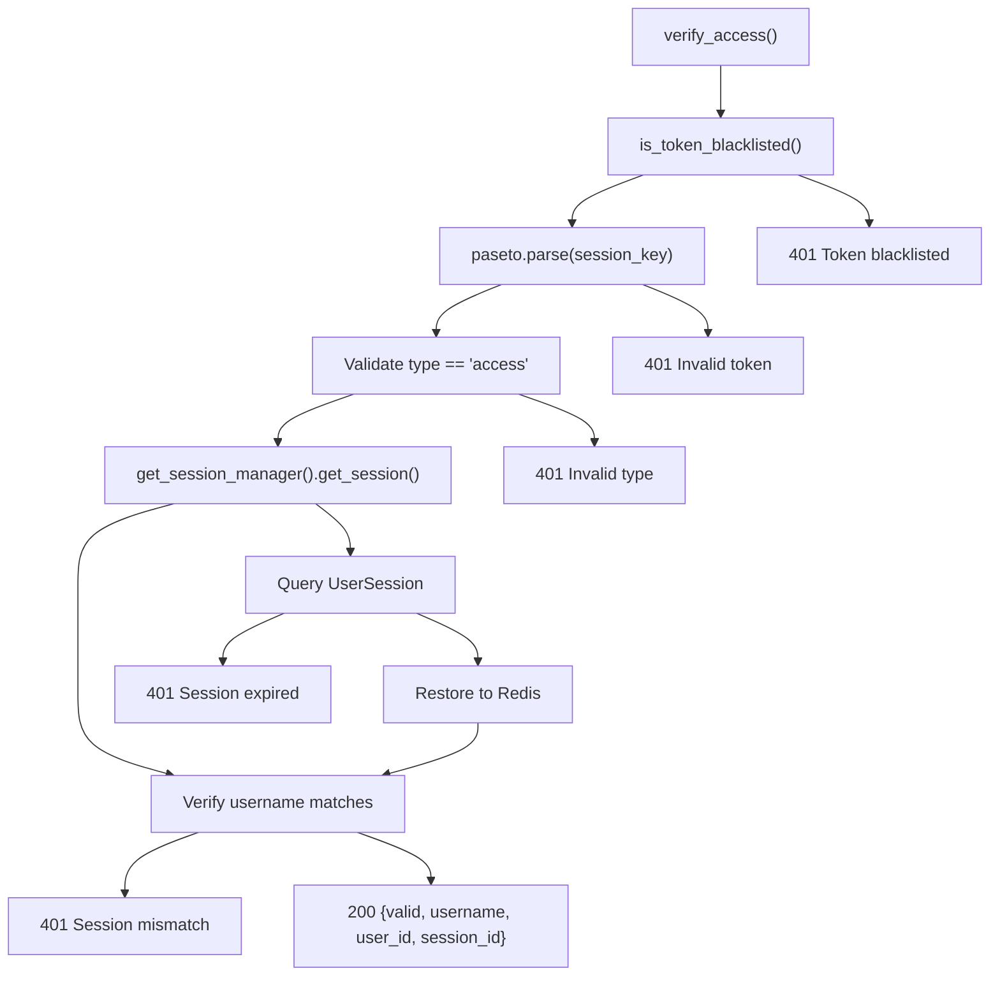

**Sources**: [back-end/main.py L307-L385](https://github.com/RogueElectron/Cypher1/blob/c60431e6/back-end/main.py#L307-L385)

### Token Blacklist Check

Before parsing, the service checks if the token was revoked during logout:

```
if get_token_manager().is_token_blacklisted(access_token):
    return jsonify({'valid': False, 'error': 'Token blacklisted'}), 401
```

**Sources**: [back-end/main.py L317-L319](https://github.com/RogueElectron/Cypher1/blob/c60431e6/back-end/main.py#L317-L319)

### Redis-First Verification with PostgreSQL Fallback

The verification prioritizes Redis for speed but falls back to PostgreSQL for durability:

```css
redis_session = get_session_manager().get_session(session_id)
if not redis_session:
    # Fallback to database check
    with get_db_session() as db_session:
        db_session_obj = db_session.query(UserSession).filter_by(
            session_id=session_id, 
            is_active=True
        ).first()
        
        if not db_session_obj or db_session_obj.is_expired():
            return jsonify({'valid': False, 'error': 'Session expired'}), 401
        
        # Restore session to Redis
        session_data = db_session_obj.get_session_data()
        get_session_manager().create_session(
            user_id=str(db_session_obj.user_id),
            session_data=session_data,
            ttl=3600
        )
```

**Sources**: [back-end/main.py L343-L362](https://github.com/RogueElectron/Cypher1/blob/c60431e6/back-end/main.py#L343-L362)

---

## Token Refresh Mechanism

The `refresh_token()` endpoint implements one-time-use token rotation, invalidating the old refresh token immediately upon use.

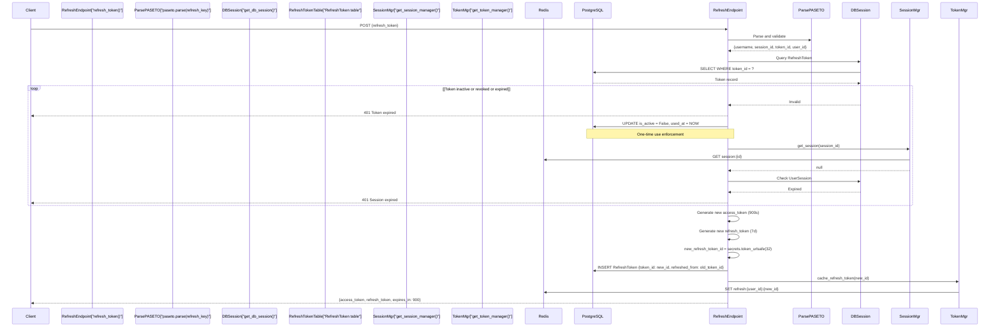

**Sources**: [back-end/main.py L388-L512](https://github.com/RogueElectron/Cypher1/blob/c60431e6/back-end/main.py#L388-L512)

### Refresh Token Rotation Details

**Token Invalidation**: The old refresh token is immediately marked as used:

```markdown
# Mark token as used (one-time use)
db_token.is_active = False
db_token.used_at = datetime.datetime.utcnow()
```

**Sources**: [back-end/main.py L429-L430](https://github.com/RogueElectron/Cypher1/blob/c60431e6/back-end/main.py#L429-L430)

**Token Ancestry Tracking**: The new token records which token it replaced:

```css
new_db_token.set_token_data({
    'refreshed_from': token_id  # Links to parent token
})
```

**Sources**: [back-end/main.py L489-L491](https://github.com/RogueElectron/Cypher1/blob/c60431e6/back-end/main.py#L489-L491)

**Automatic Session Schedule**: Client receives new tokens and schedules the next refresh at 12 minutes (3 minutes before the 15-minute expiry). See [Session Manager Module](/RogueElectron/Cypher1/5.3-session-manager-module) for client-side implementation.

**Sources**: [back-end/src/session-manager.js L73-L75](https://github.com/RogueElectron/Cypher1/blob/c60431e6/back-end/src/session-manager.js#L73-L75)

---

## Logout and Session Cleanup

The `logout()` endpoint performs comprehensive cleanup across multiple storage layers.

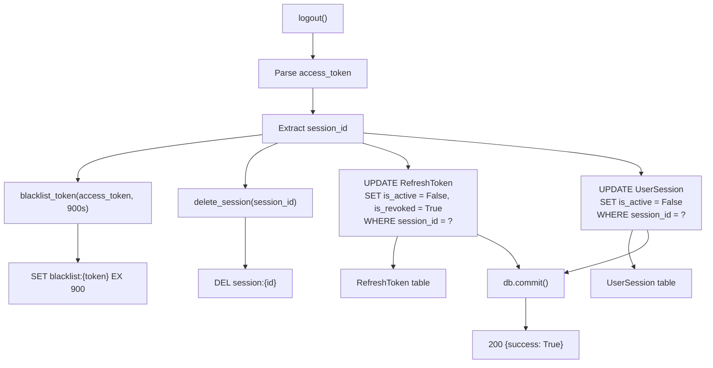

**Sources**: [back-end/main.py L515-L560](https://github.com/RogueElectron/Cypher1/blob/c60431e6/back-end/main.py#L515-L560)

### Multi-Layer Cleanup Process

The logout operation ensures tokens cannot be reused:

| Cleanup Action | Target | Duration | Purpose |
| --- | --- | --- | --- |
| Blacklist access token | Redis `token_blacklist:{token}` | 900s (remaining token lifetime) | Prevent reuse of current access token |
| Delete session | Redis `session:{id}` | Immediate | Invalidate cached session data |
| Revoke refresh tokens | PostgreSQL `RefreshToken.is_revoked = True` | Permanent | Prevent refresh token rotation |
| Deactivate session | PostgreSQL `UserSession.is_active = False` | Permanent | Mark session as terminated |

**Sources**: [back-end/main.py L536-L553](https://github.com/RogueElectron/Cypher1/blob/c60431e6/back-end/main.py#L536-L553)

### Error Resilience

The logout handler catches exceptions during cleanup but still returns success to ensure the client clears local state:

```css
except Exception as e:
    logger.warning(f"Logout cleanup error: {e}")
    # ignore errors during cleanup - still return success
    pass

return jsonify({'success': True})
```

**Sources**: [back-end/main.py L555-L560](https://github.com/RogueElectron/Cypher1/blob/c60431e6/back-end/main.py#L555-L560)

---

## Rate Limiting

The `create_session()` endpoint implements per-IP rate limiting using Redis counters.

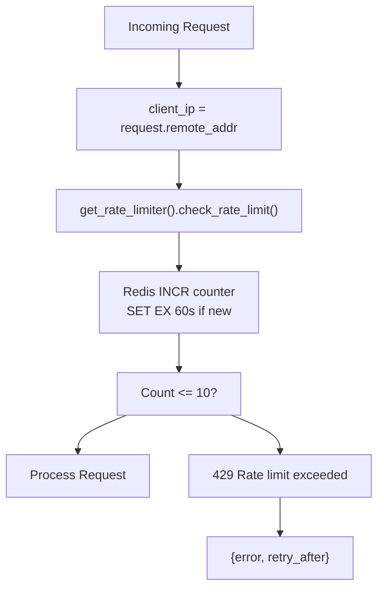

**Sources**: [back-end/main.py L160-L172](https://github.com/RogueElectron/Cypher1/blob/c60431e6/back-end/main.py#L160-L172)

### Rate Limit Configuration

```css
rate_limit = get_rate_limiter().check_rate_limit(
    identifier=client_ip,
    limit=10,              # Maximum requests
    window_seconds=60,     # Per 60-second window
    category="session_creation"
)

if not rate_limit['allowed']:
    return jsonify({
        'error': 'Rate limit exceeded',
        'retry_after': rate_limit['reset_time']
    }), 429
```

**Sources**: [back-end/main.py L161-L172](https://github.com/RogueElectron/Cypher1/blob/c60431e6/back-end/main.py#L161-L172)

### Rate Limiter Response Structure

| Field | Type | Description |
| --- | --- | --- |
| `allowed` | boolean | Whether request should be processed |
| `reset_time` | integer | Seconds until counter resets |
| `current_count` | integer | Number of requests in current window |

**Sources**: [back-end/main.py L161-L172](https://github.com/RogueElectron/Cypher1/blob/c60431e6/back-end/main.py#L161-L172)

---

## Database Integration

### PostgreSQL Session Management

The Flask service uses SQLAlchemy ORM to interact with four primary tables:

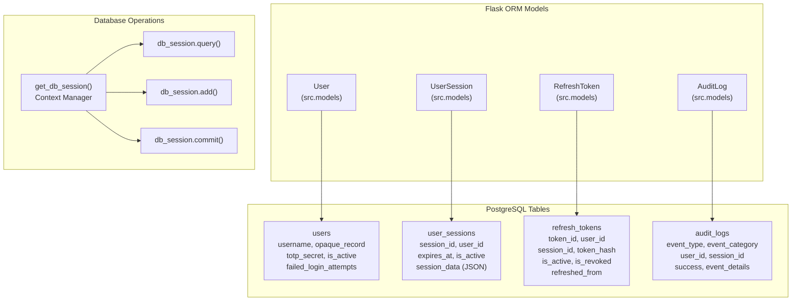

**Sources**: [back-end/main.py L18-L21](https://github.com/RogueElectron/Cypher1/blob/c60431e6/back-end/main.py#L18-L21)

 [back-end/main.py L177-L293](https://github.com/RogueElectron/Cypher1/blob/c60431e6/back-end/main.py#L177-L293)

### Context Manager Pattern

All database operations use the `get_db_session()` context manager for automatic transaction handling:

```markdown
with get_db_session() as db_session:
    user = db_session.query(User).filter_by(username=username, is_active=True).first()
    # ... operations ...
    db_session.commit()
```

**Sources**: [back-end/main.py L177-L293](https://github.com/RogueElectron/Cypher1/blob/c60431e6/back-end/main.py#L177-L293)

### Redis Integration

The Flask service accesses three Redis managers through factory functions:

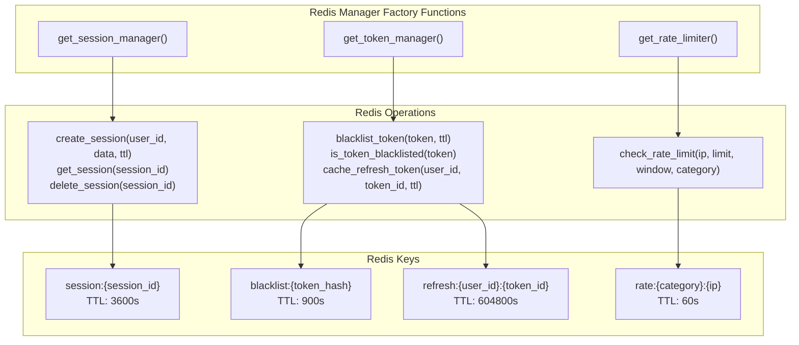

**Sources**: [back-end/main.py L20](https://github.com/RogueElectron/Cypher1/blob/c60431e6/back-end/main.py#L20-L20)

 [back-end/main.py L161-L166](https://github.com/RogueElectron/Cypher1/blob/c60431e6/back-end/main.py#L161-L166)

 [back-end/main.py L197-L201](https://github.com/RogueElectron/Cypher1/blob/c60431e6/back-end/main.py#L197-L201)

 [back-end/main.py L266-L271](https://github.com/RogueElectron/Cypher1/blob/c60431e6/back-end/main.py#L266-L271)

 [back-end/main.py L317-L319](https://github.com/RogueElectron/Cypher1/blob/c60431e6/back-end/main.py#L317-L319)

 [back-end/main.py L343-L362](https://github.com/RogueElectron/Cypher1/blob/c60431e6/back-end/main.py#L343-L362)

 [back-end/main.py L536-L539](https://github.com/RogueElectron/Cypher1/blob/c60431e6/back-end/main.py#L536-L539)

### Dual Storage Strategy

The service maintains session data in both Redis (performance) and PostgreSQL (durability):

| Operation | Redis | PostgreSQL |
| --- | --- | --- |
| Session Creation | `create_session()` sets TTL 3600s | `INSERT UserSession` with `expires_at` |
| Session Verification | `get_session()` fast lookup | Fallback query if Redis miss |
| Session Restoration | Re-populate from PostgreSQL | Source of truth for expired Redis keys |
| Session Deletion | `delete_session()` immediate | `UPDATE is_active = False` |

**Sources**: [back-end/main.py L197-L213](https://github.com/RogueElectron/Cypher1/blob/c60431e6/back-end/main.py#L197-L213)

 [back-end/main.py L343-L362](https://github.com/RogueElectron/Cypher1/blob/c60431e6/back-end/main.py#L343-L362)

---

## Security Considerations

### Token Type Validation

Every token parsing operation validates the `type` claim to prevent type confusion attacks:

```
if access_claims.get('type') != 'access':
    return jsonify({'valid': False, 'error': 'Invalid token type'}), 401
```

**Sources**: [back-end/main.py L332-L333](https://github.com/RogueElectron/Cypher1/blob/c60431e6/back-end/main.py#L332-L333)

 [back-end/main.py L406-L407](https://github.com/RogueElectron/Cypher1/blob/c60431e6/back-end/main.py#L406-L407)

### CORS Configuration

The application restricts origins to localhost addresses only:

```
CORS(app, origins=['http://127.0.0.1:5000', 'http://localhost:5000'], 
     supports_credentials=True)
```

**Sources**: [back-end/main.py L29](https://github.com/RogueElectron/Cypher1/blob/c60431e6/back-end/main.py#L29-L29)

### Account Lockout Check

Session creation verifies the user account is not locked before proceeding:

```
if user.is_locked():
    return jsonify({'error': 'Account temporarily locked'}), 423
```

**Sources**: [back-end/main.py L183-L184](https://github.com/RogueElectron/Cypher1/blob/c60431e6/back-end/main.py#L183-L184)

### Audit Logging

All session creation events are logged to the `audit_logs` table for compliance:

```
audit_log = AuditLog(
    event_type='session_created',
    event_category='AUTH',
    severity='INFO',
    user_id=user.id,
    session_id=session_id,
    ip_address=client_ip,
    user_agent=request.headers.get('User-Agent', ''),
    success=True
)
audit_log.set_event_details({
    'session_duration': '15 minutes',
    'refresh_token_duration': '7 days'
})
db_session.add(audit_log)
```

**Sources**: [back-end/main.py L277-L291](https://github.com/RogueElectron/Cypher1/blob/c60431e6/back-end/main.py#L277-L291)