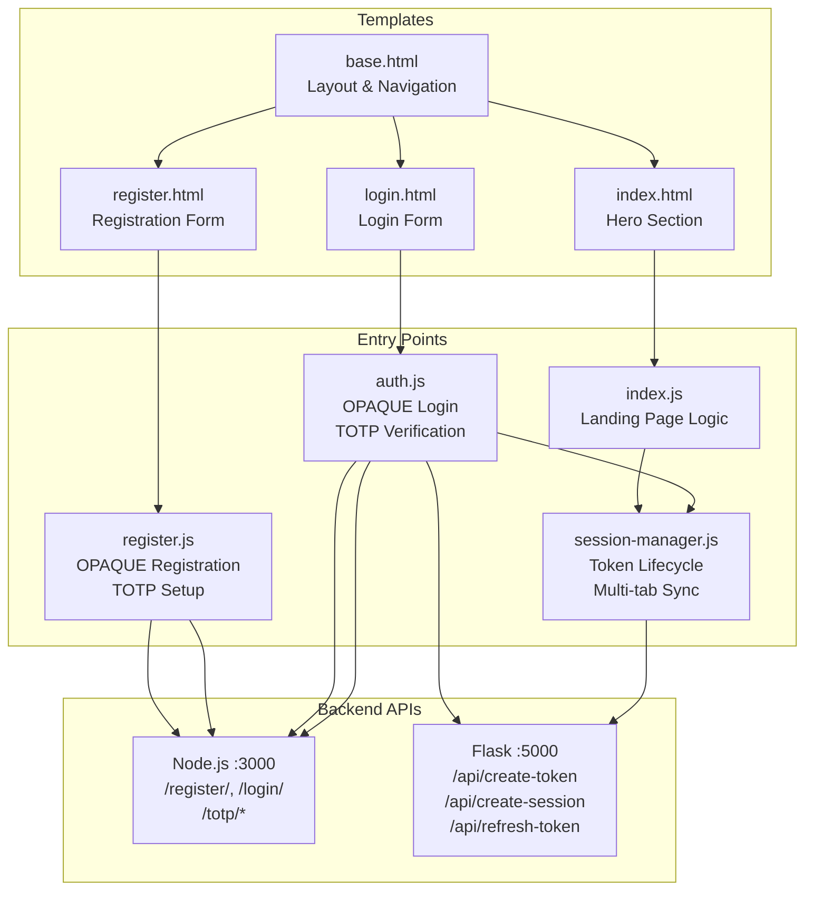
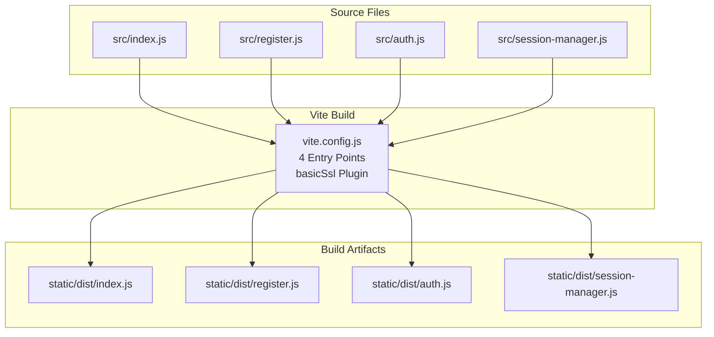
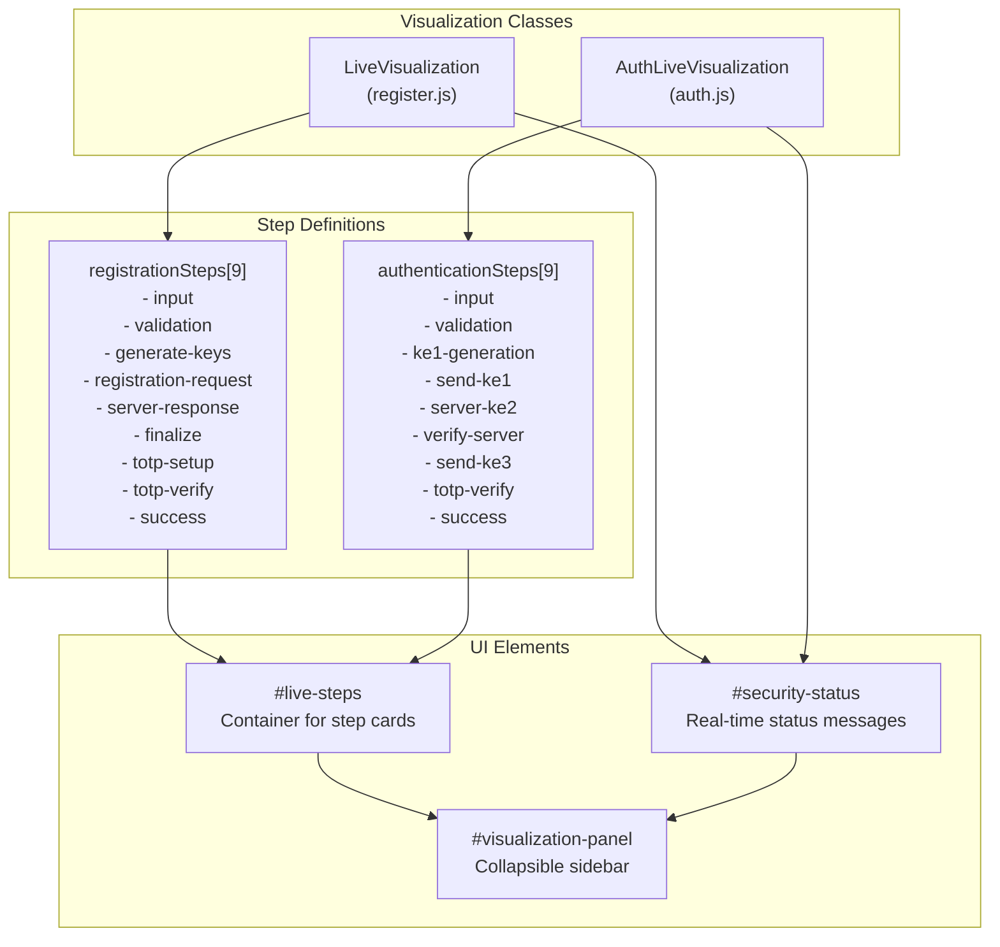
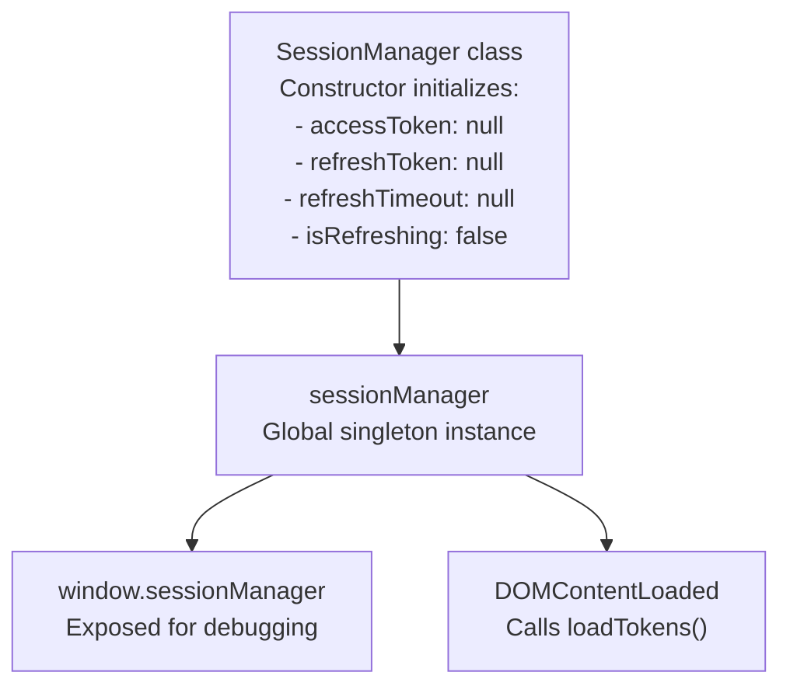
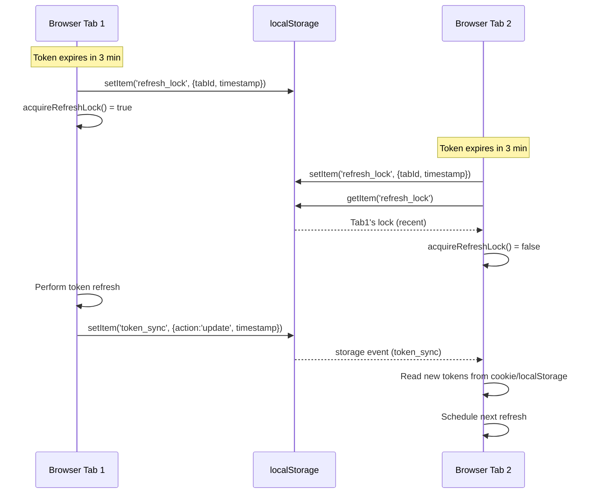
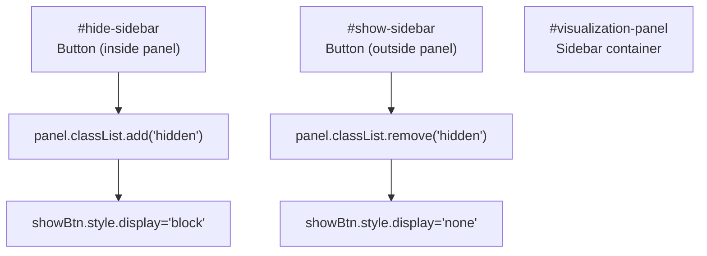

# Frontend Components

> **Relevant source files**
> * [back-end/src/auth.js](https://github.com/RogueElectron/Cypher1/blob/c60431e6/back-end/src/auth.js)
> * [back-end/src/index.js](https://github.com/RogueElectron/Cypher1/blob/c60431e6/back-end/src/index.js)
> * [back-end/src/register.js](https://github.com/RogueElectron/Cypher1/blob/c60431e6/back-end/src/register.js)
> * [back-end/src/session-manager.js](https://github.com/RogueElectron/Cypher1/blob/c60431e6/back-end/src/session-manager.js)
> * [back-end/static/dist/index.js](https://github.com/RogueElectron/Cypher1/blob/c60431e6/back-end/static/dist/index.js)
> * [back-end/static/dist/session-manager.js](https://github.com/RogueElectron/Cypher1/blob/c60431e6/back-end/static/dist/session-manager.js)
> * [back-end/static/svg/cypher.svg](https://github.com/RogueElectron/Cypher1/blob/c60431e6/back-end/static/svg/cypher.svg)
> * [back-end/templates/base.html](https://github.com/RogueElectron/Cypher1/blob/c60431e6/back-end/templates/base.html)
> * [back-end/templates/index.html](https://github.com/RogueElectron/Cypher1/blob/c60431e6/back-end/templates/index.html)

## Purpose and Scope

This document provides an overview of the client-side architecture of the Cypher authentication platform. It covers the JavaScript module structure, template hierarchy, live visualization system, and build configuration. Detailed walkthroughs of specific workflows are covered in child pages: [Registration Flow](/RogueElectron/Cypher1/5.1-registration-flow-(client-side)), [Login Flow](/RogueElectron/Cypher1/5.2-login-flow-(client-side)), [Session Manager](/RogueElectron/Cypher1/5.3-session-manager-module), and [UI Templates](/RogueElectron/Cypher1/5.4-ui-templates-and-visualization).

## Module Architecture

The frontend consists of four primary JavaScript modules that are built using Vite and served as ES6 modules. Each module has a distinct responsibility in the authentication workflow.

### Module Overview



**Sources:** [back-end/src/index.js L1-L155](https://github.com/RogueElectron/Cypher1/blob/c60431e6/back-end/src/index.js#L1-L155)

 [back-end/src/auth.js L1-L471](https://github.com/RogueElectron/Cypher1/blob/c60431e6/back-end/src/auth.js#L1-L471)

 [back-end/src/register.js L1-L508](https://github.com/RogueElectron/Cypher1/blob/c60431e6/back-end/src/register.js#L1-L508)

 [back-end/src/session-manager.js L1-L355](https://github.com/RogueElectron/Cypher1/blob/c60431e6/back-end/src/session-manager.js#L1-L355)

 [back-end/templates/base.html L1-L51](https://github.com/RogueElectron/Cypher1/blob/c60431e6/back-end/templates/base.html#L1-L51)

### Module Responsibilities

| Module | File | Primary Responsibility | Key Classes/Functions |
| --- | --- | --- | --- |
| **index.js** | [back-end/src/index.js](https://github.com/RogueElectron/Cypher1/blob/c60431e6/back-end/src/index.js) | Landing page session detection and authenticated UI | `showAuthenticatedView()`, `showUnauthenticatedView()`, `handleLogout()` |
| **register.js** | [back-end/src/register.js](https://github.com/RogueElectron/Cypher1/blob/c60431e6/back-end/src/register.js) | OPAQUE registration and TOTP setup orchestration | `LiveVisualization`, `generateTotpSecret()`, `displayServerQrCode()` |
| **auth.js** | [back-end/src/auth.js](https://github.com/RogueElectron/Cypher1/blob/c60431e6/back-end/src/auth.js) | OPAQUE login and TOTP verification orchestration | `AuthLiveVisualization`, form handlers for login and TOTP |
| **session-manager.js** | [back-end/src/session-manager.js](https://github.com/RogueElectron/Cypher1/blob/c60431e6/back-end/src/session-manager.js) | Token storage, automatic refresh, multi-tab synchronization | `SessionManager` class |

**Sources:** [back-end/src/index.js L1-L155](https://github.com/RogueElectron/Cypher1/blob/c60431e6/back-end/src/index.js#L1-L155)

 [back-end/src/register.js L1-L508](https://github.com/RogueElectron/Cypher1/blob/c60431e6/back-end/src/register.js#L1-L508)

 [back-end/src/auth.js L1-L471](https://github.com/RogueElectron/Cypher1/blob/c60431e6/back-end/src/auth.js#L1-L471)

 [back-end/src/session-manager.js L1-L355](https://github.com/RogueElectron/Cypher1/blob/c60431e6/back-end/src/session-manager.js#L1-L355)

## Build System and Entry Points

The frontend uses Vite for module bundling. Four entry points are configured to produce standalone JavaScript bundles.

### Vite Entry Points



The built artifacts are minified ES6 modules served by Flask at `/static/dist/*.js`. Each template loads only the module it requires.

**Sources:** [back-end/static/dist/index.js L1-L72](https://github.com/RogueElectron/Cypher1/blob/c60431e6/back-end/static/dist/index.js#L1-L72)

 [back-end/static/dist/session-manager.js L1-L2](https://github.com/RogueElectron/Cypher1/blob/c60431e6/back-end/static/dist/session-manager.js#L1-L2)

## Template Structure

The frontend uses Jinja2 templates served by Flask. All templates extend `base.html` which provides the layout, navigation, and global styles.

### Template Hierarchy

| Template | Route | Script Loaded | Purpose |
| --- | --- | --- | --- |
| **base.html** | N/A (base) | Bootstrap 5, Bootstrap Icons | Navigation bar, dark theme, animated background |
| **index.html** | `/` | `dist/index.js` | Landing page with session detection |
| **login.html** | `/api/login` | `dist/auth.js` | Login form with OPAQUE/TOTP workflow |
| **register.html** | `/api/register` | `dist/register.js` | Registration form with OPAQUE/TOTP setup |

**Sources:** [back-end/templates/base.html L1-L51](https://github.com/RogueElectron/Cypher1/blob/c60431e6/back-end/templates/base.html#L1-L51)

 [back-end/templates/index.html L1-L36](https://github.com/RogueElectron/Cypher1/blob/c60431e6/back-end/templates/index.html#L1-L36)

### Base Template Features

The `base.html` template provides:

* **Dark theme** via Bootstrap 5 dark mode (`data-bs-theme="dark"`)
* **Navigation bar** with Home, Login, Register links at [back-end/templates/base.html L20-L44](https://github.com/RogueElectron/Cypher1/blob/c60431e6/back-end/templates/base.html#L20-L44)
* **Animated background** using CSS gradient animations
* **Global fonts** (Inter font family via Google Fonts)
* **Block system** for child templates to override `` and ``

**Sources:** [back-end/templates/base.html L1-L51](https://github.com/RogueElectron/Cypher1/blob/c60431e6/back-end/templates/base.html#L1-L51)

## Live Visualization System

Both registration and login workflows feature a live visualization sidebar that displays the current step in the authentication process. This is implemented as a client-side component that updates the UI in real-time.

### Visualization Architecture



**Sources:** [back-end/src/register.js L13-L147](https://github.com/RogueElectron/Cypher1/blob/c60431e6/back-end/src/register.js#L13-L147)

 [back-end/src/auth.js L19-L153](https://github.com/RogueElectron/Cypher1/blob/c60431e6/back-end/src/auth.js#L19-L153)

### Visualization Methods

Both `LiveVisualization` and `AuthLiveVisualization` classes share the same interface:

| Method | Parameters | Purpose |
| --- | --- | --- |
| `renderSteps()` | None | Generates HTML for all steps in `#live-steps` container |
| `activateStep(stepId)` | `stepId: string` | Marks step as active, marks previous steps as completed |
| `completeStep(stepId)` | `stepId: string` | Marks step as completed (green checkmark) |
| `updateSecurityStatus(message, type)` | `message: string`, `type: 'success'\|'error'` | Updates security status banner |

**Sources:** [back-end/src/register.js L86-L147](https://github.com/RogueElectron/Cypher1/blob/c60431e6/back-end/src/register.js#L86-L147)

 [back-end/src/auth.js L86-L153](https://github.com/RogueElectron/Cypher1/blob/c60431e6/back-end/src/auth.js#L86-L153)

### Step State Management

Each visualization step has three possible states indicated by CSS classes:

* **Default**: Inactive step (gray icon)
* **`.active`**: Currently executing step (blue highlight)
* **`.completed`**: Successfully completed step (green checkmark)

The `activateStep()` method performs batch DOM updates to avoid layout thrashing at [back-end/src/register.js L108-L123](https://github.com/RogueElectron/Cypher1/blob/c60431e6/back-end/src/register.js#L108-L123)

 and [back-end/src/auth.js L114-L129](https://github.com/RogueElectron/Cypher1/blob/c60431e6/back-end/src/auth.js#L114-L129)

**Sources:** [back-end/src/register.js L108-L147](https://github.com/RogueElectron/Cypher1/blob/c60431e6/back-end/src/register.js#L108-L147)

 [back-end/src/auth.js L114-L153](https://github.com/RogueElectron/Cypher1/blob/c60431e6/back-end/src/auth.js#L114-L153)

## Session Manager Integration

The `SessionManager` class is a singleton that manages the entire token lifecycle. It is imported by both `index.js` and `auth.js` but is designed as a standalone module.

### SessionManager Singleton Pattern



The instance is created at [back-end/src/session-manager.js L344](https://github.com/RogueElectron/Cypher1/blob/c60431e6/back-end/src/session-manager.js#L344-L344)

 and exposed globally at [back-end/src/session-manager.js L347](https://github.com/RogueElectron/Cypher1/blob/c60431e6/back-end/src/session-manager.js#L347-L347)

 Automatic token loading occurs at [back-end/src/session-manager.js L350-L352](https://github.com/RogueElectron/Cypher1/blob/c60431e6/back-end/src/session-manager.js#L350-L352)

**Sources:** [back-end/src/session-manager.js L1-L355](https://github.com/RogueElectron/Cypher1/blob/c60431e6/back-end/src/session-manager.js#L1-L355)

## Cookie and Storage Strategy

The frontend uses a dual-storage strategy for security and performance:

| Storage Type | Data Stored | Purpose | Lifetime |
| --- | --- | --- | --- |
| **HttpOnly Cookie** | `access_token` | Sent automatically with requests | 15 minutes (900s) |
| **localStorage** | `refresh_token` | Manual token rotation | 7 days |
| **Cookie** | `pass_auth_token` | Intermediate token after OPAQUE | 3 minutes (180s) |
| **localStorage** | `token_sync` | Multi-tab synchronization events | N/A (ephemeral) |
| **localStorage** | `refresh_lock` | Prevents duplicate refresh attempts | N/A (ephemeral) |

**Access Token**: Stored as an HttpOnly cookie via `setCookie()` at [back-end/src/session-manager.js L39-L43](https://github.com/RogueElectron/Cypher1/blob/c60431e6/back-end/src/session-manager.js#L39-L43)

 Set during `setTokens()` at [back-end/src/session-manager.js L61](https://github.com/RogueElectron/Cypher1/blob/c60431e6/back-end/src/session-manager.js#L61-L61)

**Refresh Token**: Stored in `localStorage` at [back-end/src/session-manager.js L64](https://github.com/RogueElectron/Cypher1/blob/c60431e6/back-end/src/session-manager.js#L64-L64)

 to avoid sending with every HTTP request (security measure).

**Pass Auth Token**: Temporary cookie created after OPAQUE completion at [back-end/src/auth.js L313-L314](https://github.com/RogueElectron/Cypher1/blob/c60431e6/back-end/src/auth.js#L313-L314)

 expires after 180 seconds. Deleted after session creation at [back-end/src/auth.js L446](https://github.com/RogueElectron/Cypher1/blob/c60431e6/back-end/src/auth.js#L446-L446)

**Sources:** [back-end/src/session-manager.js L39-L64](https://github.com/RogueElectron/Cypher1/blob/c60431e6/back-end/src/session-manager.js#L39-L64)

 [back-end/src/auth.js L313-L314](https://github.com/RogueElectron/Cypher1/blob/c60431e6/back-end/src/auth.js#L313-L314)

 [back-end/src/auth.js L446](https://github.com/RogueElectron/Cypher1/blob/c60431e6/back-end/src/auth.js#L446-L446)

## Multi-Tab Synchronization

The `SessionManager` synchronizes tokens across multiple browser tabs using `localStorage` events. This prevents duplicate token refresh operations and ensures consistent session state.

### Synchronization Mechanism



The lock acquisition logic is at [back-end/src/session-manager.js L159-L192](https://github.com/RogueElectron/Cypher1/blob/c60431e6/back-end/src/session-manager.js#L159-L192)

 Storage event listeners are registered at [back-end/src/session-manager.js L13-L37](https://github.com/RogueElectron/Cypher1/blob/c60431e6/back-end/src/session-manager.js#L13-L37)

**Sources:** [back-end/src/session-manager.js L13-L37](https://github.com/RogueElectron/Cypher1/blob/c60431e6/back-end/src/session-manager.js#L13-L37)

 [back-end/src/session-manager.js L159-L192](https://github.com/RogueElectron/Cypher1/blob/c60431e6/back-end/src/session-manager.js#L159-L192)

## Alert and Notification System

Both registration and login flows use a Bootstrap-based alert system for user feedback.

### Alert Utilities

The `showAlert()` function is defined identically in both modules:

**Function Signature**: `showAlert(message, type='success', containerId='alert-container')`

**Parameters**:

* `message`: Text to display
* `type`: `'success'` (green) or `'error'` (red)
* `containerId`: Target DOM element (default: `'alert-container'`)

**Auto-dismiss**: Success alerts are automatically dismissed after 5 seconds at [back-end/src/register.js L188-L197](https://github.com/RogueElectron/Cypher1/blob/c60431e6/back-end/src/register.js#L188-L197)

 and [back-end/src/auth.js L188-L197](https://github.com/RogueElectron/Cypher1/blob/c60431e6/back-end/src/auth.js#L188-L197)

**Sources:** [back-end/src/register.js L172-L198](https://github.com/RogueElectron/Cypher1/blob/c60431e6/back-end/src/register.js#L172-L198)

 [back-end/src/auth.js L175-L198](https://github.com/RogueElectron/Cypher1/blob/c60431e6/back-end/src/auth.js#L175-L198)

## OPAQUE Client Integration

Both registration and login modules import the OPAQUE client library from `@cloudflare/opaque-ts`. The configuration uses the P-256 elliptic curve.

### OPAQUE Configuration

```javascript
import { 
    OpaqueClient,
    getOpaqueConfig,
    OpaqueID
} from '@cloudflare/opaque-ts';

const cfg = getOpaqueConfig(OpaqueID.OPAQUE_P256);
```

This configuration is identical in both [back-end/src/register.js L3-L11](https://github.com/RogueElectron/Cypher1/blob/c60431e6/back-end/src/register.js#L3-L11)

 and [back-end/src/auth.js L1-L9](https://github.com/RogueElectron/Cypher1/blob/c60431e6/back-end/src/auth.js#L1-L9)

### Key Exchange Message Types

| Type | Used In | Serialization | Purpose |
| --- | --- | --- | --- |
| `RegistrationRequest` | register.js | `request.serialize()` | Client's initial registration message |
| `RegistrationResponse` | register.js | `RegistrationResponse.deserialize()` | Server's registration response |
| `RegistrationRecord` | register.js | `record.serialize()` | Final credential record |
| `KE1` | auth.js | `ke1.serialize()` | First key exchange message (client) |
| `KE2` | auth.js | `KE2.deserialize()` | Second key exchange message (server) |
| `KE3` | auth.js | `ke3.serialize()` | Third key exchange message (client proof) |

**Sources:** [back-end/src/register.js L3-L11](https://github.com/RogueElectron/Cypher1/blob/c60431e6/back-end/src/register.js#L3-L11)

 [back-end/src/register.js L264-L308](https://github.com/RogueElectron/Cypher1/blob/c60431e6/back-end/src/register.js#L264-L308)

 [back-end/src/auth.js L1-L9](https://github.com/RogueElectron/Cypher1/blob/c60431e6/back-end/src/auth.js#L1-L9)

 [back-end/src/auth.js L243-L286](https://github.com/RogueElectron/Cypher1/blob/c60431e6/back-end/src/auth.js#L243-L286)

## Form Input Validation

TOTP code inputs are restricted to exactly 6 numeric digits using input event listeners.

### TOTP Input Sanitization

Both registration and login implement identical input filtering:

```javascript
totpInput.addEventListener('input', () => {
    totpInput.value = totpInput.value.replace(/[^0-9]/g, '');
    if (totpInput.value.length > 6) {
        totpInput.value = totpInput.value.slice(0, 6);
    }
});
```

Implementation at [back-end/src/register.js L496-L507](https://github.com/RogueElectron/Cypher1/blob/c60431e6/back-end/src/register.js#L496-L507)

 and [back-end/src/auth.js L461-L469](https://github.com/RogueElectron/Cypher1/blob/c60431e6/back-end/src/auth.js#L461-L469)

**Sources:** [back-end/src/register.js L496-L507](https://github.com/RogueElectron/Cypher1/blob/c60431e6/back-end/src/register.js#L496-L507)

 [back-end/src/auth.js L461-L469](https://github.com/RogueElectron/Cypher1/blob/c60431e6/back-end/src/auth.js#L461-L469)

## Sidebar Toggle Functionality

The live visualization panel is collapsible to maximize screen real estate. The toggle is managed by `initSidebarToggle()`.

### Toggle Implementation



The function is defined at [back-end/src/register.js L153-L169](https://github.com/RogueElectron/Cypher1/blob/c60431e6/back-end/src/register.js#L153-L169)

 and [back-end/src/auth.js L156-L172](https://github.com/RogueElectron/Cypher1/blob/c60431e6/back-end/src/auth.js#L156-L172)

**Sources:** [back-end/src/register.js L153-L169](https://github.com/RogueElectron/Cypher1/blob/c60431e6/back-end/src/register.js#L153-L169)

 [back-end/src/auth.js L156-L172](https://github.com/RogueElectron/Cypher1/blob/c60431e6/back-end/src/auth.js#L156-L172)

## Error Handling Patterns

Error messages are user-friendly translations of technical errors.

### Error Message Mapping

In `auth.js`, OPAQUE-specific errors are translated:

| Technical Error | User-Friendly Message |
| --- | --- |
| `"client not registered"` | "User not found. Please register first." |
| `"Authentication failed"` | "Invalid username or password." |
| Generic exception | `"Login failed: {error.message}"` |

This mapping occurs at [back-end/src/auth.js L357-L367](https://github.com/RogueElectron/Cypher1/blob/c60431e6/back-end/src/auth.js#L357-L367)

**Sources:** [back-end/src/auth.js L357-L367](https://github.com/RogueElectron/Cypher1/blob/c60431e6/back-end/src/auth.js#L357-L367)

## Summary

The frontend is structured as four independent ES6 modules coordinated by the Vite build system:

1. **index.js** - Session-aware landing page
2. **register.js** - Registration workflow with live visualization
3. **auth.js** - Login workflow with live visualization
4. **session-manager.js** - Token lifecycle and multi-tab synchronization

Each module is self-contained with its own UI components, event handlers, and API communication logic. The `SessionManager` provides shared session state management across all modules, while the live visualization classes provide real-time feedback during cryptographic operations.