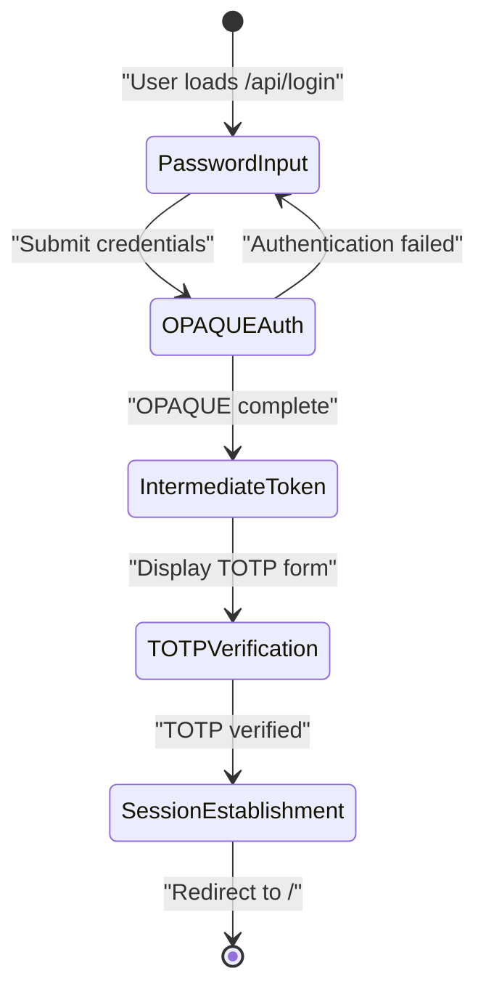
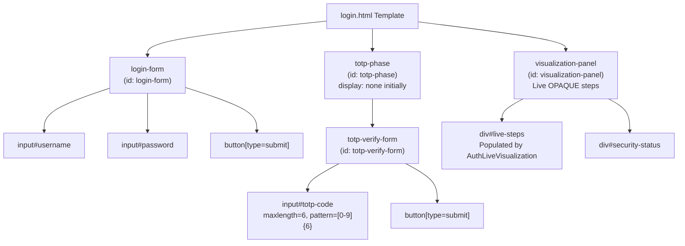
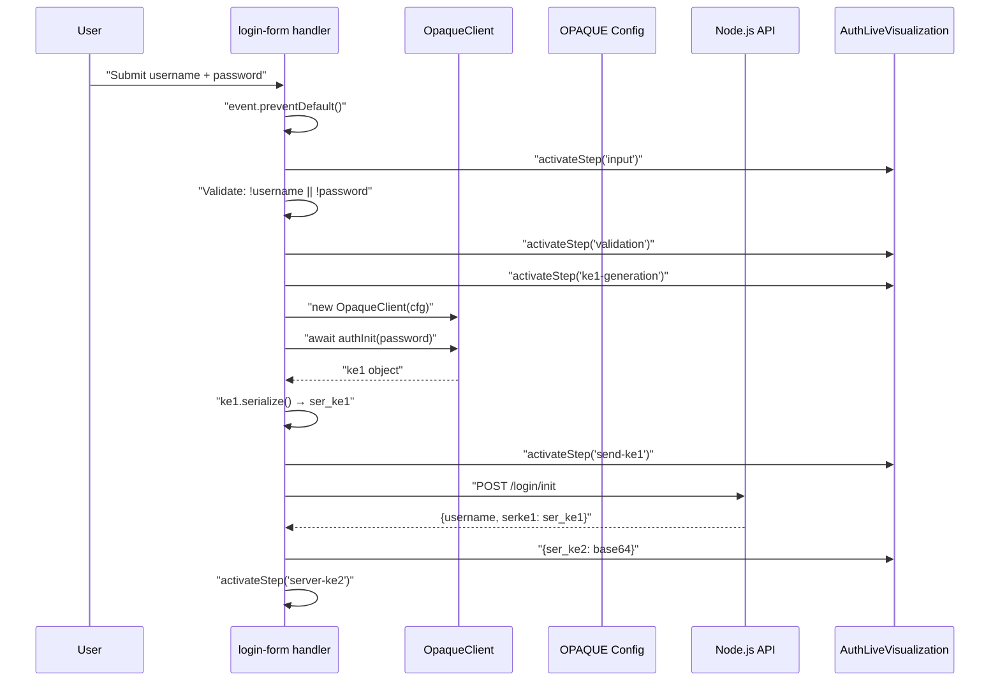
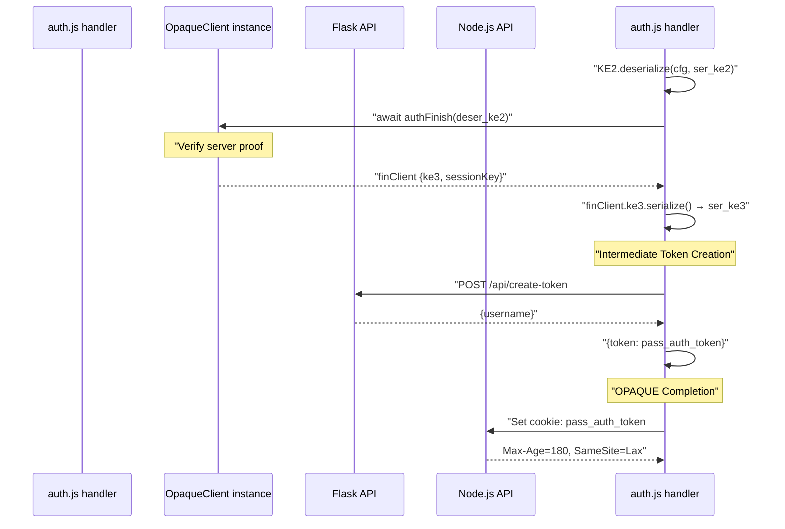
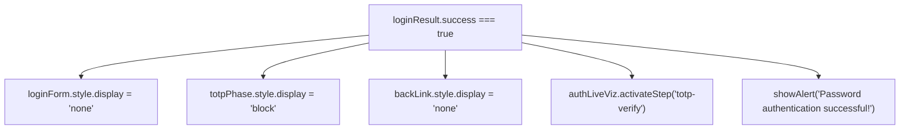
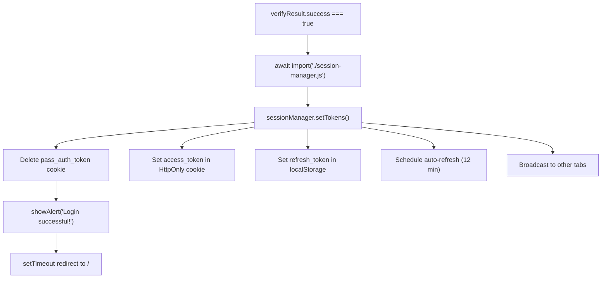
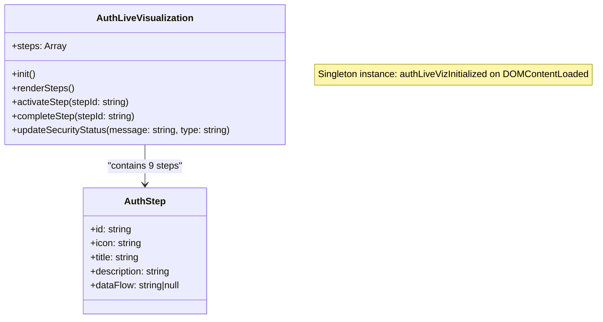
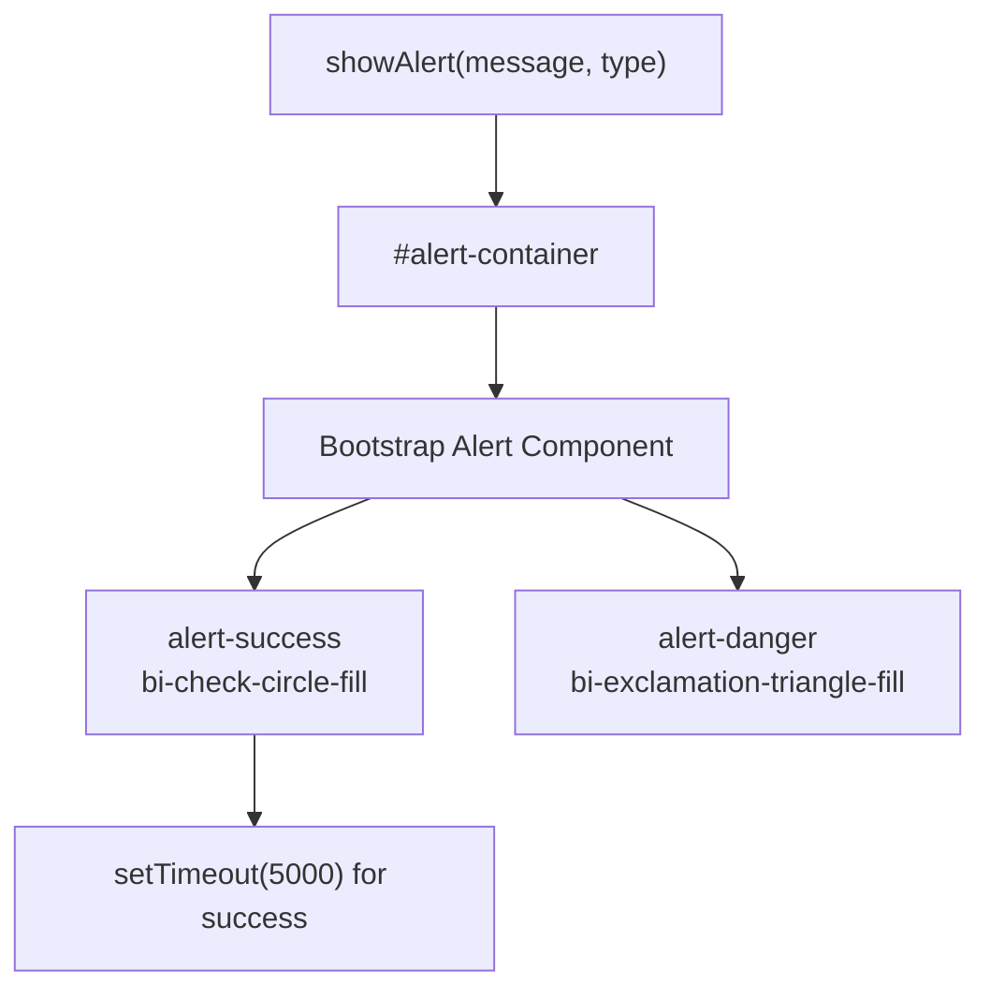
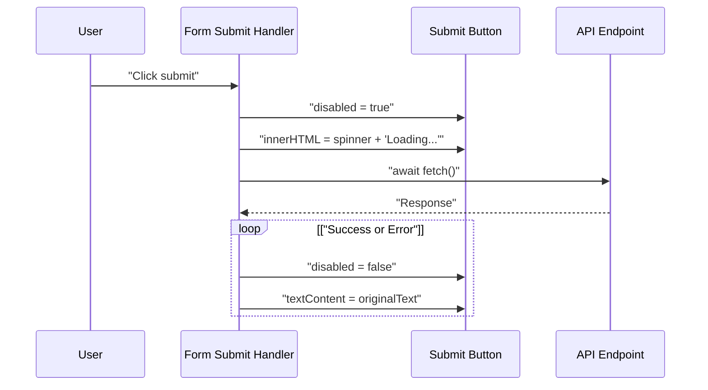
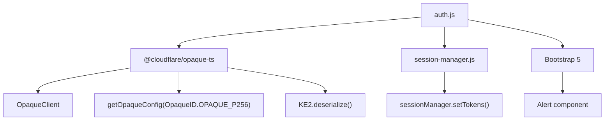

# Login Flow (Client-Side)

> **Relevant source files**
> * [back-end/src/auth.js](https://github.com/RogueElectron/Cypher1/blob/c60431e6/back-end/src/auth.js)
> * [back-end/static/dist/auth.js](https://github.com/RogueElectron/Cypher1/blob/c60431e6/back-end/static/dist/auth.js)
> * [back-end/templates/login.html](https://github.com/RogueElectron/Cypher1/blob/c60431e6/back-end/templates/login.html)
> * [back-end/templates/register.html](https://github.com/RogueElectron/Cypher1/blob/c60431e6/back-end/templates/register.html)

## Purpose and Scope

This document details the client-side implementation of the login workflow, covering the user interface, OPAQUE authentication protocol execution, TOTP two-factor verification, and session token management. The login process is implemented in `auth.js` and rendered through `login.html`.

For server-side login endpoints and OPAQUE server operations, see [Node.js Internal API](/RogueElectron/Cypher1/4.2-node.js-internal-api). For session token management after login, see [Session Manager Module](/RogueElectron/Cypher1/5.3-session-manager-module). For high-level authentication workflows, see [Authentication Workflows](/RogueElectron/Cypher1/3.4-authentication-workflows).

**Sources:** [back-end/src/auth.js L1-L471](https://github.com/RogueElectron/Cypher1/blob/c60431e6/back-end/src/auth.js#L1-L471)

 [back-end/templates/login.html L1-L248](https://github.com/RogueElectron/Cypher1/blob/c60431e6/back-end/templates/login.html#L1-L248)

---

## Login Flow Overview

The login process executes in four distinct phases, each with specific client-side operations and server communication:



**Phase Breakdown:**

| Phase | Duration | Client Operations | Server Communication |
| --- | --- | --- | --- |
| **OPAQUE Authentication** | ~500ms | KE1 generation, KE3 proof | `/login/init`, `/login/finish` |
| **Intermediate Token** | <100ms | Cookie storage | `/api/create-token` |
| **TOTP Verification** | User-dependent | UI switch, input validation | `/totp/verify-login` |
| **Session Establishment** | <100ms | Token storage via SessionManager | Returns tokens from TOTP verify |

**Sources:** [back-end/src/auth.js L205-L460](https://github.com/RogueElectron/Cypher1/blob/c60431e6/back-end/src/auth.js#L205-L460)

---

## UI Components and Templates

### Login Template Structure

The `login.html` template implements a two-phase UI that transitions from password authentication to TOTP verification:



**Key UI Elements:**

* **Alert Container** (`#alert-container`): Displays success/error messages via `showAlert()` function
* **Form Toggle**: Login form hides and TOTP phase displays after successful OPAQUE authentication [auth.js L342-L349](https://github.com/RogueElectron/Cypher1/blob/c60431e6/auth.js#L342-L349)
* **Back Link** (`#back-link`): Registration link, hidden during TOTP phase [auth.js L349](https://github.com/RogueElectron/Cypher1/blob/c60431e6/auth.js#L349-L349)

**Sources:** [back-end/templates/login.html L10-L106](https://github.com/RogueElectron/Cypher1/blob/c60431e6/back-end/templates/login.html#L10-L106)

 [back-end/src/auth.js L174-L203](https://github.com/RogueElectron/Cypher1/blob/c60431e6/back-end/src/auth.js#L174-L203)

---

## OPAQUE Authentication Phase

### KE1 Generation and Server Challenge

The OPAQUE authentication initiates when the user submits the login form:



**Critical Implementation Details:**

1. **OpaqueClient Initialization** [auth.js L243](https://github.com/RogueElectron/Cypher1/blob/c60431e6/auth.js#L243-L243) : Uses P-256 curve configuration from `@cloudflare/opaque-ts`
2. **authInit()** [auth.js L244](https://github.com/RogueElectron/Cypher1/blob/c60431e6/auth.js#L244-L244) : Generates KE1 message without transmitting plaintext password
3. **Serialization** [auth.js L245](https://github.com/RogueElectron/Cypher1/blob/c60431e6/auth.js#L245-L245) : Converts `Uint8Array` to base64 for JSON transport
4. **Credentials Include** [auth.js L257](https://github.com/RogueElectron/Cypher1/blob/c60431e6/auth.js#L257-L257) : Ensures cookies are sent with cross-origin requests

**Sources:** [back-end/src/auth.js L239-L277](https://github.com/RogueElectron/Cypher1/blob/c60431e6/back-end/src/auth.js#L239-L277)

---

### Server Verification and KE3 Proof

After receiving KE2 from the server, the client verifies server authenticity and generates proof:



**Intermediate Token Flow:**

The `pass_auth_token` serves as a time-limited bridge between OPAQUE completion and TOTP verification:

| Property | Value | Purpose |
| --- | --- | --- |
| **Token Name** | `pass_auth_token` | Proves password authentication success |
| **Lifetime** | 180 seconds (3 minutes) | Limited window for TOTP entry |
| **Storage** | HTTP Cookie, `SameSite=Lax` | Automatic inclusion in TOTP request |
| **Creation** | Flask `/api/create-token` | Intermediate token type |

**Sources:** [back-end/src/auth.js L280-L355](https://github.com/RogueElectron/Cypher1/blob/c60431e6/back-end/src/auth.js#L280-L355)

---

## TOTP Verification Phase

### UI Transition and Input Validation

After successful OPAQUE authentication, the UI transitions to TOTP input:



**TOTP Input Validation** [auth.js L461-L469](https://github.com/RogueElectron/Cypher1/blob/c60431e6/auth.js#L461-L469)

:

The TOTP input field enforces strict validation to prevent invalid submissions:

* **Pattern Enforcement**: Only numeric characters (0-9) allowed
* **Length Restriction**: Automatically truncates to 6 digits
* **Real-time Filtering**: `input` event strips non-numeric characters

```javascript
// Implemented in auth.js:461-469
totpInput.addEventListener('input', () => {
    totpInput.value = totpInput.value.replace(/[^0-9]/g, '');
    if (totpInput.value.length > 6) {
        totpInput.value = totpInput.value.slice(0, 6);
    }
});
```

**Sources:** [back-end/src/auth.js L342-L352](https://github.com/RogueElectron/Cypher1/blob/c60431e6/back-end/src/auth.js#L342-L352)

 [back-end/src/auth.js L461-L469](https://github.com/RogueElectron/Cypher1/blob/c60431e6/back-end/src/auth.js#L461-L469)

---

### TOTP Verification and Token Exchange

The TOTP verification form handler executes the final authentication step:

```mermaid
sequenceDiagram
  participant User
  participant totp-verify-form handler
  participant getCookieValue()
  participant NodeAPI as Node.js API
  participant SessionMgr as session-manager.js
  participant SessionManager

  User->>totp-verify-form handler: "Submit 6-digit code"
  totp-verify-form handler->>totp-verify-form handler: "Validate: length === 6"
  totp-verify-form handler->>totp-verify-form handler: "Get username from input
  totp-verify-form handler->>getCookieValue(): "getCookieValue('pass_auth_token')"
  getCookieValue()-->>totp-verify-form handler: "passAuthFromCookie or null"
  loop ["Token not found or
    totp-verify-form handler->>totp-verify-form handler: "throw Error('Token expired')"
    totp-verify-form handler->>NodeAPI: "POST /totp/verify-login
    NodeAPI-->>totp-verify-form handler: {username, token, passAuthToken}"
    totp-verify-form handler->>totp-verify-form handler: "{success, access_token, refresh_token, expires_in}"
    totp-verify-form handler->>SessionMgr: "showAlert('Invalid TOTP code', 'error')"
    totp-verify-form handler->>SessionMgr: "import('./session-manager.js')"
    totp-verify-form handler->>totp-verify-form handler: "setTokens(access_token, refresh_token, expires_in)"
    totp-verify-form handler->>totp-verify-form handler: "Delete cookie: pass_auth_token"
  end
```

**getCookieValue() Utility** [auth.js L11-L16](https://github.com/RogueElectron/Cypher1/blob/c60431e6/auth.js#L11-L16)

:

```javascript
function getCookieValue(name) {
    const value = `; ${document.cookie}`;
    const parts = value.split(`; ${name}=`);
    if (parts.length === 2) return parts.pop().split(';').shift();
    return null;
}
```

**Token Exchange Response:**

| Field | Type | Description |
| --- | --- | --- |
| `success` | boolean | TOTP verification result |
| `access_token` | string | PASETO v4.public token (15 min) |
| `refresh_token` | string | PASETO refresh token (7 days) |
| `expires_in` | number | Access token TTL in seconds (900) |

**Sources:** [back-end/src/auth.js L376-L458](https://github.com/RogueElectron/Cypher1/blob/c60431e6/back-end/src/auth.js#L376-L458)

 [back-end/src/auth.js L11-L16](https://github.com/RogueElectron/Cypher1/blob/c60431e6/back-end/src/auth.js#L11-L16)

---

## Session Establishment and Redirect

### SessionManager Integration

After successful TOTP verification, the client establishes a persistent session using the SessionManager:



**setTokens() Parameters** [auth.js L439-L443](https://github.com/RogueElectron/Cypher1/blob/c60431e6/auth.js#L439-L443)

:

1. **access_token**: Stored in HttpOnly cookie via SessionManager
2. **refresh_token**: Stored in `localStorage` for token rotation
3. **expires_in**: Used to calculate refresh schedule (typically 900 seconds)

**Cookie Cleanup** [auth.js L446](https://github.com/RogueElectron/Cypher1/blob/c60431e6/auth.js#L446-L446)

:

```
document.cookie = 'pass_auth_token=; Max-Age=0; Path=/; SameSite=Lax';
```

The intermediate token is explicitly deleted to prevent replay attacks after session establishment.

**Sources:** [back-end/src/auth.js L436-L453](https://github.com/RogueElectron/Cypher1/blob/c60431e6/back-end/src/auth.js#L436-L453)

---

## Live Visualization System

### AuthLiveVisualization Class

The `AuthLiveVisualization` class provides real-time visual feedback during the login process:



**Authentication Step Definitions** [auth.js L19-L83](https://github.com/RogueElectron/Cypher1/blob/c60431e6/auth.js#L19-L83)

:

| Step ID | Icon | Title | Data Flow |
| --- | --- | --- | --- |
| `input` | `bi-keyboard` | Password Input | null |
| `validation` | `bi-check-circle` | Input Validation | null |
| `ke1-generation` | `bi-cpu` | Generate KE1 | null |
| `send-ke1` | `bi-arrow-up-circle` | Send Authentication Request | "KE1 Message → Server" |
| `server-ke2` | `bi-server` | Server Response | "KE2 Message ← Server" |
| `verify-server` | `bi-shield-check` | Verify Server | null |
| `send-ke3` | `bi-arrow-up-circle` | Send Authentication Proof | "KE3 Proof → Server" |
| `totp-verify` | `bi-shield-lock` | 2FA Verification | null |
| `success` | `bi-check-circle-fill` | Authentication Complete | null |

**Sources:** [back-end/src/auth.js L86-L153](https://github.com/RogueElectron/Cypher1/blob/c60431e6/back-end/src/auth.js#L86-L153)

---

### Step Activation and State Management

The visualization system updates step states throughout the login process:

```

```

**activateStep() Implementation** [auth.js L114-L129](https://github.com/RogueElectron/Cypher1/blob/c60431e6/auth.js#L114-L129)

:

1. Find current step index in the `steps` array
2. Iterate through all steps: * Steps before current: Add `completed` class * Current step: Add `active` class * Future steps: Remain in default state
3. Batch DOM updates for performance

**updateSecurityStatus()** [auth.js L139-L152](https://github.com/RogueElectron/Cypher1/blob/c60431e6/auth.js#L139-L152)

:

Updates the security status indicator with contextual messages:

* Success icon: `bi-shield-check` with `text-success` class
* Warning icon: `bi-shield-exclamation` with `text-warning` class

**Sources:** [back-end/src/auth.js L114-L152](https://github.com/RogueElectron/Cypher1/blob/c60431e6/back-end/src/auth.js#L114-L152)

---

## Error Handling and User Feedback

### Alert System

The login flow uses a unified alert system for user feedback:



**showAlert() Function** [auth.js L175-L198](https://github.com/RogueElectron/Cypher1/blob/c60431e6/auth.js#L175-L198)

:

* **Success Alerts**: Green with checkmark icon, auto-dismiss after 5 seconds
* **Error Alerts**: Red with warning icon, manual dismissal required
* **Bootstrap Integration**: Uses Bootstrap 5 Alert component with fade animation

**Error Message Mapping** [auth.js L357-L366](https://github.com/RogueElectron/Cypher1/blob/c60431e6/auth.js#L357-L366)

:

| Server Error | Client-Friendly Message |
| --- | --- |
| "client not registered" | "User not found. Please register first." |
| "Authentication failed" | "Invalid username or password." |
| Generic error | Original error message displayed |

**Sources:** [back-end/src/auth.js L175-L203](https://github.com/RogueElectron/Cypher1/blob/c60431e6/back-end/src/auth.js#L175-L203)

 [back-end/src/auth.js L357-L370](https://github.com/RogueElectron/Cypher1/blob/c60431e6/back-end/src/auth.js#L357-L370)

---

### Form State Management

Both login and TOTP forms implement loading states to prevent duplicate submissions:



**Login Button States** [auth.js L234-L370](https://github.com/RogueElectron/Cypher1/blob/c60431e6/auth.js#L234-L370)

:

* **Original**: "Sign In" with icon
* **Loading**: Spinner + "Logging in..."
* **Restored**: Original text after completion

**TOTP Button States** [auth.js L391-L456](https://github.com/RogueElectron/Cypher1/blob/c60431e6/auth.js#L391-L456)

:

* **Original**: "verify and sign in" with icon
* **Loading**: Spinner + "verifying..."
* **Restored**: Original HTML after completion

**Sources:** [back-end/src/auth.js L234-L237](https://github.com/RogueElectron/Cypher1/blob/c60431e6/back-end/src/auth.js#L234-L237)

 [back-end/src/auth.js L391-L394](https://github.com/RogueElectron/Cypher1/blob/c60431e6/back-end/src/auth.js#L391-L394)

 [back-end/src/auth.js L455-L456](https://github.com/RogueElectron/Cypher1/blob/c60431e6/back-end/src/auth.js#L455-L456)

---

## Code Entity Reference

### Key Functions and Event Handlers

| Function/Handler | File | Lines | Purpose |
| --- | --- | --- | --- |
| `getCookieValue(name)` | auth.js | 11-16 | Extract cookie value by name |
| `AuthLiveVisualization` constructor | auth.js | 87-90 | Initialize visualization system |
| `renderSteps()` | auth.js | 96-112 | Render step elements in DOM |
| `activateStep(stepId)` | auth.js | 114-129 | Update step visual state |
| `completeStep(stepId)` | auth.js | 131-137 | Mark step as completed |
| `updateSecurityStatus(message, type)` | auth.js | 139-152 | Update security indicator |
| `showAlert(message, type)` | auth.js | 175-198 | Display Bootstrap alerts |
| `clearAlerts()` | auth.js | 200-203 | Clear alert container |
| Login form submit handler | auth.js | 214-372 | OPAQUE authentication flow |
| TOTP form submit handler | auth.js | 379-458 | TOTP verification flow |
| TOTP input validation | auth.js | 461-469 | Restrict to 6 numeric digits |

**Sources:** [back-end/src/auth.js L1-L471](https://github.com/RogueElectron/Cypher1/blob/c60431e6/back-end/src/auth.js#L1-L471)

---

### API Endpoints Called

| Endpoint | Method | Request Body | Response | Purpose |
| --- | --- | --- | --- | --- |
| `/login/init` | POST | `{username, serke1}` | `{ser_ke2}` | OPAQUE KE1 exchange |
| `/api/create-token` | POST | `{username}` | `{token}` | Create intermediate token |
| `/login/finish` | POST | `{username, serke3}` | `{success}` | OPAQUE KE3 verification |
| `/totp/verify-login` | POST | `{username, token, passAuthToken}` | `{success, access_token, refresh_token, expires_in}` | TOTP verification + session |

**Sources:** [back-end/src/auth.js L252-L262](https://github.com/RogueElectron/Cypher1/blob/c60431e6/back-end/src/auth.js#L252-L262)

 [back-end/src/auth.js L293-L302](https://github.com/RogueElectron/Cypher1/blob/c60431e6/back-end/src/auth.js#L293-L302)

 [back-end/src/auth.js L316-L331](https://github.com/RogueElectron/Cypher1/blob/c60431e6/back-end/src/auth.js#L316-L331)

 [back-end/src/auth.js L410-L421](https://github.com/RogueElectron/Cypher1/blob/c60431e6/back-end/src/auth.js#L410-L421)

---

### Module Dependencies



**Import Statements:**

* **Static Imports** [auth.js L1-L7](https://github.com/RogueElectron/Cypher1/blob/c60431e6/auth.js#L1-L7) : OPAQUE protocol classes
* **Dynamic Import** [auth.js L437](https://github.com/RogueElectron/Cypher1/blob/c60431e6/auth.js#L437-L437) : Session manager loaded only after TOTP success

**Sources:** [back-end/src/auth.js L1-L7](https://github.com/RogueElectron/Cypher1/blob/c60431e6/back-end/src/auth.js#L1-L7)

 [back-end/src/auth.js L437-L443](https://github.com/RogueElectron/Cypher1/blob/c60431e6/back-end/src/auth.js#L437-L443)