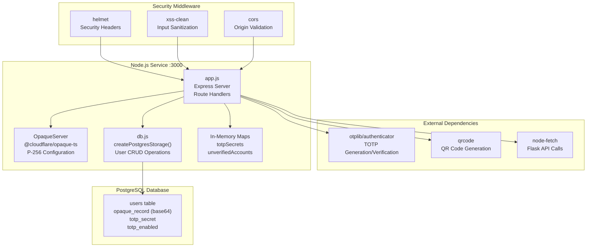
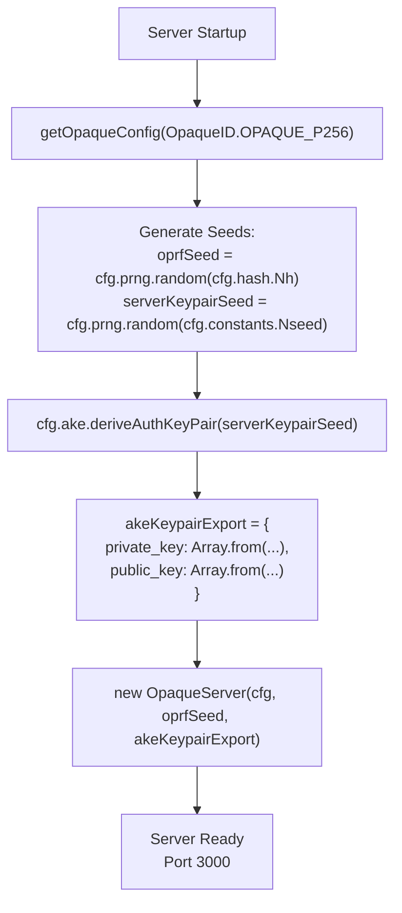
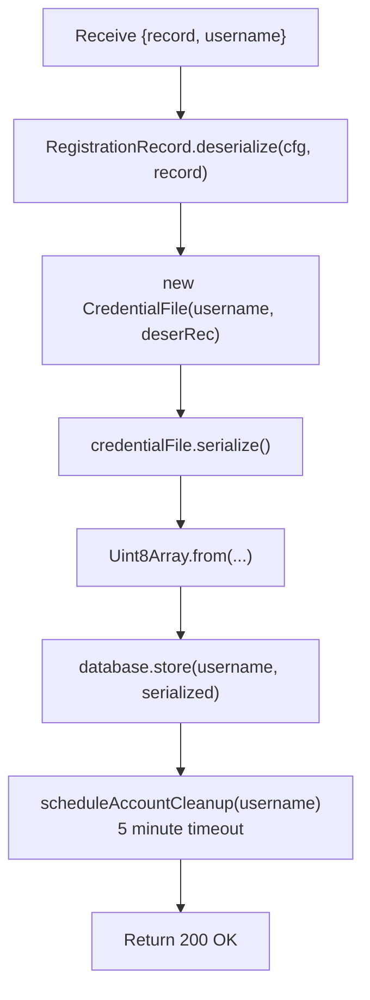
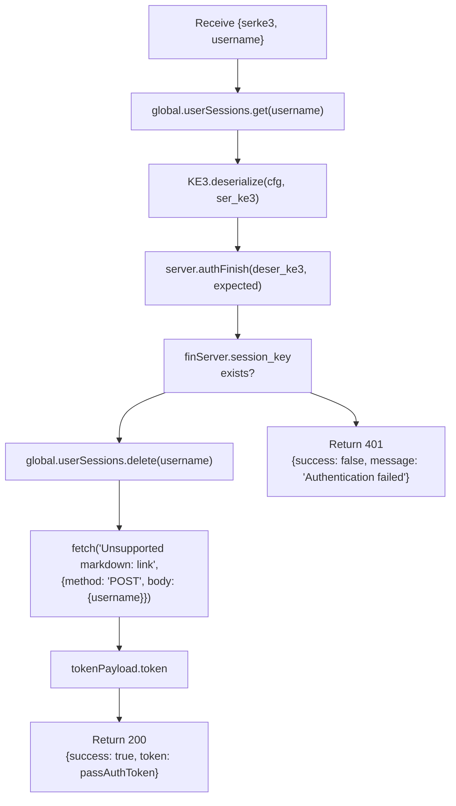
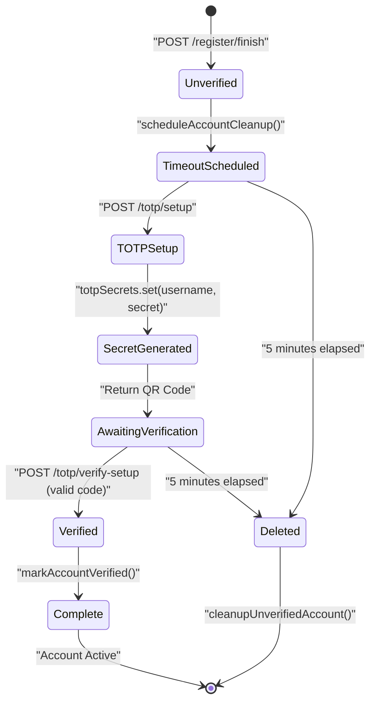
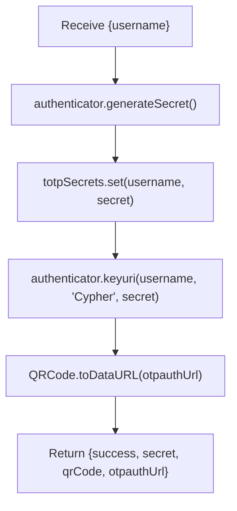
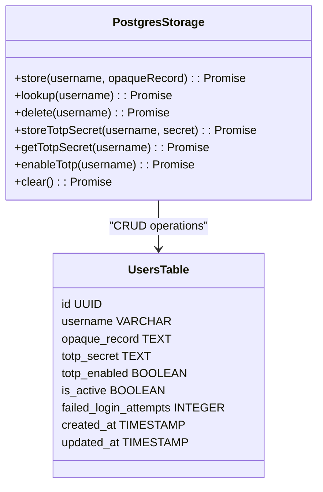
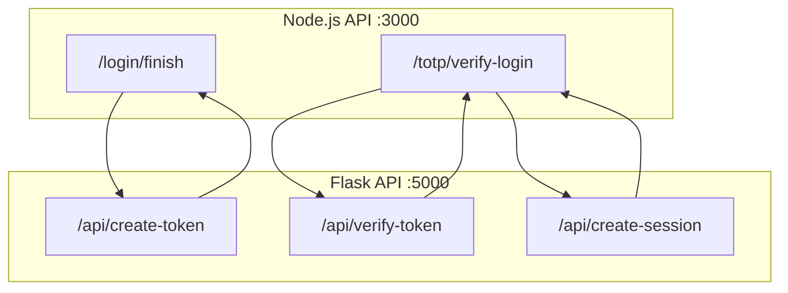

# Node.js Internal API

> **Relevant source files**
> * [back-end/node_internal_api/app.js](https://github.com/RogueElectron/Cypher1/blob/c60431e6/back-end/node_internal_api/app.js)
> * [back-end/node_internal_api/db.js](https://github.com/RogueElectron/Cypher1/blob/c60431e6/back-end/node_internal_api/db.js)
> * [back-end/node_internal_api/package-lock.json](https://github.com/RogueElectron/Cypher1/blob/c60431e6/back-end/node_internal_api/package-lock.json)
> * [back-end/node_internal_api/package.json](https://github.com/RogueElectron/Cypher1/blob/c60431e6/back-end/node_internal_api/package.json)
> * [back-end/package-lock.json](https://github.com/RogueElectron/Cypher1/blob/c60431e6/back-end/package-lock.json)
> * [back-end/package.json](https://github.com/RogueElectron/Cypher1/blob/c60431e6/back-end/package.json)

## Purpose and Scope

The Node.js Internal API is a dedicated cryptographic service running on port 3000 that handles all password-related operations using the OPAQUE protocol and manages TOTP-based two-factor authentication. This service isolates sensitive cryptographic operations from session management, ensuring that passwords and TOTP secrets are never exposed to the main Flask application.

This document covers the Node.js service architecture, OPAQUE server implementation, TOTP operations, and the PostgreSQL storage layer. For information about token management and session creation, see [Flask Session Service](/RogueElectron/Cypher1/4.1-flask-session-service). For client-side cryptographic operations, see [Registration Flow (Client-Side)](/RogueElectron/Cypher1/5.1-registration-flow-(client-side)) and [Login Flow (Client-Side)](/RogueElectron/Cypher1/5.2-login-flow-(client-side)).

**Sources:** [back-end/node_internal_api/app.js L1-L502](https://github.com/RogueElectron/Cypher1/blob/c60431e6/back-end/node_internal_api/app.js#L1-L502)

---

## Service Architecture

### Component Structure



**Sources:** [back-end/node_internal_api/app.js L1-L89](https://github.com/RogueElectron/Cypher1/blob/c60431e6/back-end/node_internal_api/app.js#L1-L89)

 [back-end/node_internal_api/db.js L1-L151](https://github.com/RogueElectron/Cypher1/blob/c60431e6/back-end/node_internal_api/db.js#L1-L151)

 [back-end/node_internal_api/package.json L1-L30](https://github.com/RogueElectron/Cypher1/blob/c60431e6/back-end/node_internal_api/package.json#L1-L30)

---

## Server Initialization

### Express Configuration

The service initializes an Express server with comprehensive security middleware before setting up cryptographic components.

| Middleware | Purpose | Configuration |
| --- | --- | --- |
| `helmet` | Security headers | CSP enabled, HSTS disabled (development), CORP same-origin |
| `xss-clean` | XSS protection | Sanitizes request body, query, and params |
| `cors` | Origin validation | Allows `localhost:5000` and `127.0.0.1:5000` |
| `express.json()` | JSON parsing | Parses incoming JSON request bodies |

**Sources:** [back-end/node_internal_api/app.js L26-L79](https://github.com/RogueElectron/Cypher1/blob/c60431e6/back-end/node_internal_api/app.js#L26-L79)

### OPAQUE Server Initialization



The OPAQUE server uses the P-256 elliptic curve configuration and generates a server authentication keypair on startup. This keypair remains constant for the lifetime of the process and is used in all OPAQUE authentication exchanges.

**Sources:** [back-end/node_internal_api/app.js L82-L137](https://github.com/RogueElectron/Cypher1/blob/c60431e6/back-end/node_internal_api/app.js#L82-L137)

### Storage Initialization

Three storage mechanisms are initialized:

1. **PostgreSQL Connection Pool** (`database`): Persistent storage for OPAQUE records and TOTP secrets via `createPostgresStorage()`
2. **In-Memory TOTP Secrets** (`totpSecrets`): Temporary storage for TOTP secrets during setup phase
3. **Unverified Accounts** (`unverifiedAccounts`): Tracks accounts with pending TOTP verification with 5-minute timeout

**Sources:** [back-end/node_internal_api/app.js L89-L126](https://github.com/RogueElectron/Cypher1/blob/c60431e6/back-end/node_internal_api/app.js#L89-L126)

 [back-end/node_internal_api/db.js L10-L28](https://github.com/RogueElectron/Cypher1/blob/c60431e6/back-end/node_internal_api/db.js#L10-L28)

---

## OPAQUE Protocol Implementation

### Registration Endpoints

#### POST /register/init

Initiates OPAQUE registration by generating a server response to the client's registration request.

```mermaid
sequenceDiagram
  participant Client
  participant app.js
  participant /register/init
  participant OpaqueServer
  participant registerInit()
  participant database.lookup()

  Client->>app.js: "POST /register/init
  app.js->>database.lookup(): {username, registrationRequest}"
  database.lookup()-->>app.js: "lookup(username)"
  app.js->>app.js: "false (user does not exist)"
  app.js->>OpaqueServer: "RegistrationRequest.deserialize(cfg, serRegistrationRequest)"
  OpaqueServer-->>app.js: "registerInit(deSerReq, username)"
  app.js->>app.js: "RegistrationResponse"
  app.js-->>Client: "regResponse.serialize()"
```

**Request Body:**

```yaml
{
  username: string,
  registrationRequest: Uint8Array (serialized)
}
```

**Response Body:**

```yaml
{
  registrationResponse: Uint8Array (serialized)
}
```

**Error Handling:**

* Returns `409 Conflict` if username already exists
* Returns `400 Bad Request` if fields are missing
* Returns `503 Service Unavailable` if OPAQUE server not initialized

**Sources:** [back-end/node_internal_api/app.js L143-L175](https://github.com/RogueElectron/Cypher1/blob/c60431e6/back-end/node_internal_api/app.js#L143-L175)

#### POST /register/finish

Completes OPAQUE registration by storing the user's OPAQUE record and scheduling TOTP setup timeout.



The `scheduleAccountCleanup()` function sets a 5-minute timer that will delete the account if TOTP setup is not completed.

**Sources:** [back-end/node_internal_api/app.js L177-L220](https://github.com/RogueElectron/Cypher1/blob/c60431e6/back-end/node_internal_api/app.js#L177-L220)

 [back-end/node_internal_api/app.js L94-L111](https://github.com/RogueElectron/Cypher1/blob/c60431e6/back-end/node_internal_api/app.js#L94-L111)

### Login Endpoints

#### POST /login/init

Initiates OPAQUE authentication by retrieving the user's credential file and generating KE2.

```mermaid
sequenceDiagram
  participant Client
  participant app.js
  participant /login/init
  participant database.lookup()
  participant OpaqueServer
  participant authInit()

  Client->>app.js: "POST /login/init
  app.js->>database.lookup(): {serke1, username}"
  database.lookup()-->>app.js: "lookup(username)"
  app.js->>app.js: "credFileBytes (Uint8Array)"
  app.js->>app.js: "CredentialFile.deserialize(cfg, Array.from(credFileBytes))"
  app.js->>OpaqueServer: "KE1.deserialize(cfg, serke1)"
  OpaqueServer-->>app.js: "authInit(deser_ke1, credential_file.record, credential_file.credential_identifier)"
  app.js->>app.js: "{ke2, expected}"
  app.js->>app.js: "global.userSessions.set(username, expected)"
  app.js-->>Client: "ke2.serialize()"
```

The `expected` value is stored in `global.userSessions` and will be used to verify the client's KE3 in the finish step.

**Sources:** [back-end/node_internal_api/app.js L222-L259](https://github.com/RogueElectron/Cypher1/blob/c60431e6/back-end/node_internal_api/app.js#L222-L259)

#### POST /login/finish

Completes OPAQUE authentication and issues an intermediate token upon successful verification.



On success, this endpoint makes an internal call to the Flask service to create a short-lived (3-minute) `pass_auth_token` that bridges OPAQUE authentication and TOTP verification.

**Sources:** [back-end/node_internal_api/app.js L263-L325](https://github.com/RogueElectron/Cypher1/blob/c60431e6/back-end/node_internal_api/app.js#L263-L325)

---

## TOTP Operations

### Account Verification Flow



**Sources:** [back-end/node_internal_api/app.js L94-L126](https://github.com/RogueElectron/Cypher1/blob/c60431e6/back-end/node_internal_api/app.js#L94-L126)

### POST /totp/setup

Generates a TOTP secret and creates a QR code for authenticator app enrollment.



The secret is stored in the in-memory `totpSecrets` map until verification completes. The `otplib/authenticator` library generates a base32-encoded secret compatible with standard authenticator apps (Google Authenticator, Authy, etc.).

**Sources:** [back-end/node_internal_api/app.js L329-L361](https://github.com/RogueElectron/Cypher1/blob/c60431e6/back-end/node_internal_api/app.js#L329-L361)

### POST /totp/verify-setup

Verifies the TOTP code during initial setup and enables TOTP for the account.

**Request Body:**

```yaml
{
  username: string,
  token: string  // 6-digit TOTP code
}
```

**Verification Process:**

1. Retrieve secret from `totpSecrets.get(username)`
2. Verify TOTP code using `authenticator.verify({ token, secret })`
3. If valid, call `markAccountVerified(username)`: * Cancel cleanup timeout * Store TOTP secret in database via `database.storeTotpSecret()` * Enable TOTP via `database.enableTotp()` * Remove secret from temporary storage

**Sources:** [back-end/node_internal_api/app.js L363-L389](https://github.com/RogueElectron/Cypher1/blob/c60431e6/back-end/node_internal_api/app.js#L363-L389)

 [back-end/node_internal_api/app.js L113-L126](https://github.com/RogueElectron/Cypher1/blob/c60431e6/back-end/node_internal_api/app.js#L113-L126)

### POST /totp/verify-login

Verifies TOTP code during login and creates a full session if successful.

```mermaid
sequenceDiagram
  participant Client
  participant app.js
  participant /totp/verify-login
  participant Flask API
  participant :5000
  participant database
  participant authenticator.verify()

  Client->>app.js: "POST /totp/verify-login
  app.js->>Flask API: {username, token, passAuthToken}"
  Flask API-->>app.js: "POST /api/verify-token
  app.js->>app.js: {token: passAuthToken, username}"
  app.js->>authenticator.verify(): "{valid: true}"
  authenticator.verify()-->>app.js: "secret = totpSecrets.get(username) || database.getTotpSecret(username)"
  loop ["isValid = true"]
    app.js->>app.js: "verify({token, secret, window: 1})"
    app.js->>Flask API: "isValid = true/false"
    Flask API-->>app.js: "markAccountVerified(username)"
    app.js-->>Client: "POST /api/create-session
    app.js-->>Client: {username}"
  end
```

This endpoint accepts codes within a 30-second window (`window: 1` parameter) to account for clock drift.

**Sources:** [back-end/node_internal_api/app.js L391-L496](https://github.com/RogueElectron/Cypher1/blob/c60431e6/back-end/node_internal_api/app.js#L391-L496)

---

## Database Storage Layer

### PostgreSQL Connection Pool

The `db.js` module creates a PostgreSQL connection pool with the following configuration:

| Parameter | Default | Description |
| --- | --- | --- |
| `host` | `localhost` | PostgreSQL server host |
| `port` | `5432` | PostgreSQL server port |
| `database` | `cypher_db` | Database name |
| `user` | `cypher_user` | Database user |
| `max` | `20` | Maximum pool connections |
| `idleTimeoutMillis` | `30000` | Idle connection timeout |
| `connectionTimeoutMillis` | `2000` | Connection attempt timeout |

**Sources:** [back-end/node_internal_api/db.js L10-L28](https://github.com/RogueElectron/Cypher1/blob/c60431e6/back-end/node_internal_api/db.js#L10-L28)

### Storage Interface

The `createPostgresStorage()` function returns an object with the following methods:



**Sources:** [back-end/node_internal_api/db.js L30-L148](https://github.com/RogueElectron/Cypher1/blob/c60431e6/back-end/node_internal_api/db.js#L30-L148)

### Key Implementation Details

#### OPAQUE Record Storage

OPAQUE records are stored as base64-encoded text in PostgreSQL:

```javascript
// Encoding: Uint8Array -> Base64
const opaqueRecordB64 = Buffer.from(opaqueRecord).toString('base64');

// Decoding: Base64 -> Uint8Array
const buffer = Buffer.from(opaqueRecordB64, 'base64');
return new Uint8Array(buffer);
```

**Sources:** [back-end/node_internal_api/db.js L36-L81](https://github.com/RogueElectron/Cypher1/blob/c60431e6/back-end/node_internal_api/db.js#L36-L81)

#### INSERT ON CONFLICT Strategy

The `store()` method uses `ON CONFLICT` to handle duplicate usernames:

```sql
INSERT INTO users (
    id, username, opaque_record, is_active, 
    email_verified, totp_enabled, failed_login_attempts,
    created_at, updated_at, password_changed_at
) VALUES (
    gen_random_uuid(), $1, $2, true, 
    false, false, 0,
    NOW(), NOW(), NOW()
)
ON CONFLICT (username) DO UPDATE 
SET opaque_record = EXCLUDED.opaque_record
```

This allows re-registration attempts to update the OPAQUE record without creating duplicate users.

**Sources:** [back-end/node_internal_api/db.js L38-L62](https://github.com/RogueElectron/Cypher1/blob/c60431e6/back-end/node_internal_api/db.js#L38-L62)

#### TOTP Secret Management

TOTP secrets are stored in plaintext in PostgreSQL but are intended to be encrypted by an external Python service (as noted in the architecture diagrams). The current implementation stores secrets directly:

```sql
-- Store TOTP secret
UPDATE users SET totp_secret = $1 WHERE username = $2

-- Enable TOTP flag
UPDATE users SET totp_enabled = true WHERE username = $1
```

**Sources:** [back-end/node_internal_api/db.js L99-L136](https://github.com/RogueElectron/Cypher1/blob/c60431e6/back-end/node_internal_api/db.js#L99-L136)

---

## Security Middleware

### Helmet Configuration

The `helmet` middleware applies the following security headers:

| Header | Configuration | Purpose |
| --- | --- | --- |
| Content-Security-Policy | `default-src 'self'`, `script-src 'self'`, `img-src 'self' data:` | Restricts resource loading |
| X-Frame-Options | DENY | Prevents clickjacking |
| HSTS | Disabled | Development mode (should be enabled in production) |
| Cross-Origin-Embedder-Policy | Disabled | Allows embedding |
| Cross-Origin-Opener-Policy | Disabled | Standard window handling |
| Cross-Origin-Resource-Policy | same-origin | Restricts cross-origin requests |

**Sources:** [back-end/node_internal_api/app.js L27-L46](https://github.com/RogueElectron/Cypher1/blob/c60431e6/back-end/node_internal_api/app.js#L27-L46)

### CORS Configuration

CORS is configured to allow only the Flask frontend:

```sql
cors({
    origin: ['http://127.0.0.1:5000', 'http://localhost:5000'],
    methods: ['GET', 'POST', 'PUT', 'DELETE'],
    allowedHeaders: ['Content-Type', 'Authorization'],
    credentials: true
})
```

This ensures that only the Flask service can make requests to the Node.js API, preventing unauthorized access from other origins.

**Sources:** [back-end/node_internal_api/app.js L72-L77](https://github.com/RogueElectron/Cypher1/blob/c60431e6/back-end/node_internal_api/app.js#L72-L77)

### XSS Protection

The `xss-clean` middleware sanitizes all incoming request data to prevent XSS attacks by escaping HTML entities in:

* Request body
* Query parameters
* URL parameters

**Sources:** [back-end/node_internal_api/app.js L27](https://github.com/RogueElectron/Cypher1/blob/c60431e6/back-end/node_internal_api/app.js#L27-L27)

---

## Inter-Service Communication

### Flask API Integration

The Node.js service makes three types of calls to the Flask service:



**Sources:** [back-end/node_internal_api/app.js L284-L302](https://github.com/RogueElectron/Cypher1/blob/c60431e6/back-end/node_internal_api/app.js#L284-L302)

 [back-end/node_internal_api/app.js L405-L428](https://github.com/RogueElectron/Cypher1/blob/c60431e6/back-end/node_internal_api/app.js#L405-L428)

 [back-end/node_internal_api/app.js L453-L487](https://github.com/RogueElectron/Cypher1/blob/c60431e6/back-end/node_internal_api/app.js#L453-L487)

### Token Flow

1. **POST /login/finish**: Creates a 3-minute `pass_auth_token` after successful OPAQUE authentication
2. **POST /totp/verify-login**: Validates the `pass_auth_token` before TOTP verification
3. **POST /totp/verify-login**: Creates full session tokens (access + refresh) after successful TOTP verification

This multi-stage token issuance ensures that each authentication phase is verified before proceeding to the next.

**Sources:** [back-end/node_internal_api/app.js L263-L325](https://github.com/RogueElectron/Cypher1/blob/c60431e6/back-end/node_internal_api/app.js#L263-L325)

 [back-end/node_internal_api/app.js L391-L496](https://github.com/RogueElectron/Cypher1/blob/c60431e6/back-end/node_internal_api/app.js#L391-L496)

---

## API Endpoints Reference

### Complete Endpoint Table

| Method | Endpoint | Request Body | Response | Status Codes |
| --- | --- | --- | --- | --- |
| POST | `/register/init` | `{username, registrationRequest}` | `{registrationResponse}` | 200, 400, 409, 503 |
| POST | `/register/finish` | `{record, username}` | `{success, message}` | 200, 400, 409, 500 |
| POST | `/login/init` | `{serke1, username}` | `{ser_ke2}` | 200, 400, 404, 500 |
| POST | `/login/finish` | `{serke3, username}` | `{success, message, token?}` | 200, 400, 401, 500 |
| POST | `/totp/setup` | `{username}` | `{success, secret, qrCode, otpauthUrl}` | 200, 400, 500 |
| POST | `/totp/verify-setup` | `{username, token}` | `{success, message}` | 200, 400, 500 |
| POST | `/totp/verify-login` | `{username, token, passAuthToken}` | `{success, message, access_token?, refresh_token?, expires_in?}` | 200, 400, 401, 500 |

**Sources:** [back-end/node_internal_api/app.js L143-L496](https://github.com/RogueElectron/Cypher1/blob/c60431e6/back-end/node_internal_api/app.js#L143-L496)

### Error Response Format

All error responses follow a consistent format:

```yaml
{
  error: string,          // Error message
  success?: false        // Optional success flag for certain endpoints
}
```

**Sources:** [back-end/node_internal_api/app.js L152-L495](https://github.com/RogueElectron/Cypher1/blob/c60431e6/back-end/node_internal_api/app.js#L152-L495)

---

## Dependencies

### Core Dependencies

| Package | Version | Purpose |
| --- | --- | --- |
| `@cloudflare/opaque-ts` | ^0.7.5 | OPAQUE protocol implementation |
| `express` | ^4.18.2 | HTTP server framework |
| `pg` | ^8.11.3 | PostgreSQL client |
| `otplib` | ^12.0.1 | TOTP generation and verification |
| `qrcode` | ^1.5.3 | QR code generation for TOTP |
| `node-fetch` | ^3.3.2 | HTTP client for Flask API calls |
| `cors` | ^2.8.5 | Cross-origin resource sharing |
| `helmet` | ^8.1.0 | Security headers middleware |
| `xss-clean` | ^0.1.4 | XSS sanitization middleware |
| `dotenv` | ^17.2.2 | Environment variable management |

**Sources:** [back-end/node_internal_api/package.json L11-L23](https://github.com/RogueElectron/Cypher1/blob/c60431e6/back-end/node_internal_api/package.json#L11-L23)

### Development Dependencies

| Package | Version | Purpose |
| --- | --- | --- |
| `nodemon` | ^3.0.1 | Automatic server restart on file changes |

**Sources:** [back-end/node_internal_api/package.json L24-L26](https://github.com/RogueElectron/Cypher1/blob/c60431e6/back-end/node_internal_api/package.json#L24-L26)