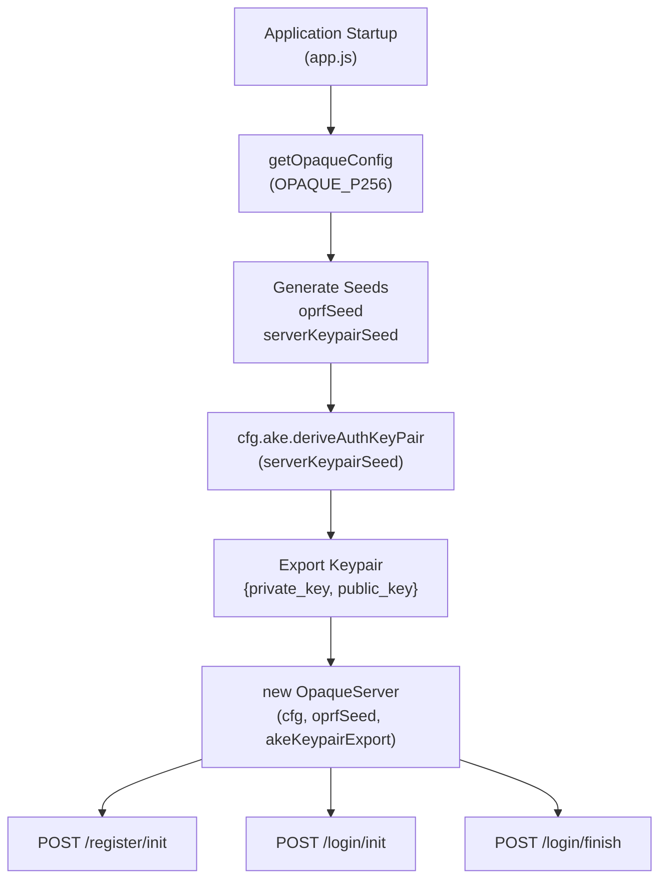
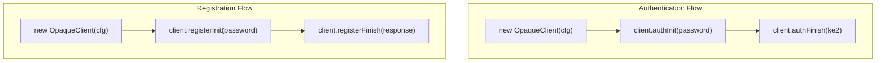
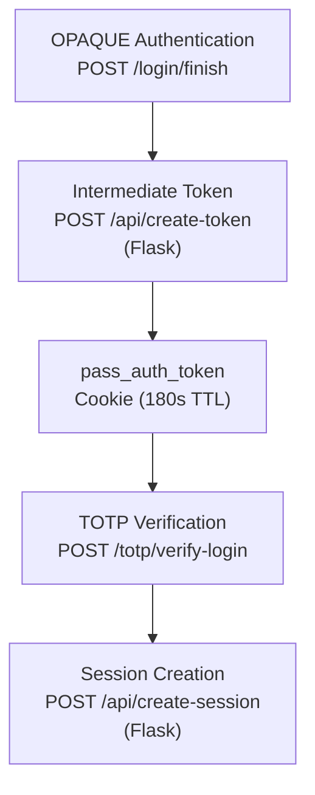

# OPAQUE Protocol Implementation

> **Relevant source files**
> * [back-end/node_internal_api/app.js](https://github.com/RogueElectron/Cypher1/blob/c60431e6/back-end/node_internal_api/app.js)
> * [back-end/src/auth.js](https://github.com/RogueElectron/Cypher1/blob/c60431e6/back-end/src/auth.js)
> * [back-end/src/register.js](https://github.com/RogueElectron/Cypher1/blob/c60431e6/back-end/src/register.js)
> * [back-end/static/dist/auth.js](https://github.com/RogueElectron/Cypher1/blob/c60431e6/back-end/static/dist/auth.js)

## Purpose and Scope

This document provides a technical specification of the OPAQUE (Oblivious Pseudorandom Function Authentication Key Exchange) protocol implementation in the Cypher authentication platform. OPAQUE is a zero-knowledge password-authenticated key exchange (PAKE) protocol that ensures the server never learns the user's password, even during registration or authentication.

This page covers the cryptographic protocol implementation, message flows, client and server operations, and data serialization. For the complete authentication workflows including TOTP integration, see [Authentication Workflows](/RogueElectron/Cypher1/3.4-authentication-workflows). For session token management that occurs after OPAQUE authentication, see [Session and Token Management](/RogueElectron/Cypher1/3.3-session-and-token-management).

---

## Protocol Overview

The Cypher platform implements OPAQUE using the `@cloudflare/opaque-ts` library with the P-256 elliptic curve configuration (`OpaqueID.OPAQUE_P256`). The protocol operates in two distinct phases:

| Phase | Purpose | Client Operations | Server Operations |
| --- | --- | --- | --- |
| **Registration** | Establish user credentials | Generate blinded password, finalize credential record | Process registration request, create registration response |
| **Authentication** | Verify user identity | Initiate key exchange, verify server, send proof | Process authentication request, verify client proof |

The protocol ensures that:

* Passwords are never transmitted over the network in plaintext
* The server stores only cryptographic commitments (`opaque_record`), not passwords
* Both client and server authenticate each other (mutual authentication)
* A shared session key is established upon successful authentication

**Sources:** [back-end/node_internal_api/app.js L1-L12](https://github.com/RogueElectron/Cypher1/blob/c60431e6/back-end/node_internal_api/app.js#L1-L12)

 [back-end/src/auth.js L1-L9](https://github.com/RogueElectron/Cypher1/blob/c60431e6/back-end/src/auth.js#L1-L9)

 [back-end/src/register.js L1-L11](https://github.com/RogueElectron/Cypher1/blob/c60431e6/back-end/src/register.js#L1-L11)

---

## Cryptographic Configuration

### Configuration Initialization

The OPAQUE protocol uses a consistent configuration across both client and server:

```javascript
// Client-side (auth.js and register.js)
const cfg = getOpaqueConfig(OpaqueID.OPAQUE_P256);

// Server-side (app.js)
const cfg = getOpaqueConfig(OpaqueID.OPAQUE_P256);
```

### Server Keypair Generation

The Node.js API generates a long-lived server authentication keypair during initialization:

[back-end/node_internal_api/app.js L81-L86](https://github.com/RogueElectron/Cypher1/blob/c60431e6/back-end/node_internal_api/app.js#L81-L86)

```
Configuration Parameters:
- Curve: P-256 (NIST curve)
- OPRF Seed: Random seed for oblivious PRF operations
- Server AKE Keypair: Used for authenticated key exchange
```

The server keypair is generated from a cryptographically secure seed (`serverKeypairSeed`) and converted to a serializable format for the `OpaqueServer` constructor:

[back-end/node_internal_api/app.js L128-L137](https://github.com/RogueElectron/Cypher1/blob/c60431e6/back-end/node_internal_api/app.js#L128-L137)

**Sources:** [back-end/node_internal_api/app.js L81-L137](https://github.com/RogueElectron/Cypher1/blob/c60431e6/back-end/node_internal_api/app.js#L81-L137)

 [back-end/src/auth.js L9](https://github.com/RogueElectron/Cypher1/blob/c60431e6/back-end/src/auth.js#L9-L9)

 [back-end/src/register.js L11](https://github.com/RogueElectron/Cypher1/blob/c60431e6/back-end/src/register.js#L11-L11)

---

## Registration Flow

### Registration Protocol Sequence

```mermaid
sequenceDiagram
  participant OpaqueClient
  participant (register.js)
  participant NodeAPI as Node.js API
  participant POST /register/*
  participant OpaqueServer
  participant (app.js)
  participant PostgreSQL
  participant (users table)

  note over OpaqueClient,(register.js): User enters password locally
  OpaqueClient->>OpaqueClient: "client.registerInit(password)"
  OpaqueClient->>OpaqueClient: "Generate RegistrationRequest"
  OpaqueClient->>OpaqueClient: "Serialize request"
  OpaqueClient->>Node.js API: "POST /register/init
  Node.js API->>PostgreSQL: {username, registrationRequest}"
  PostgreSQL-->>Node.js API: "Lookup existing username"
  Node.js API->>OpaqueServer: "false (user doesn't exist)"
  OpaqueServer-->>Node.js API: "server.registerInit(request, username)"
  Node.js API->>Node.js API: "RegistrationResponse"
  Node.js API-->>OpaqueClient: "Serialize response"
  OpaqueClient->>OpaqueClient: "{registrationResponse}"
  OpaqueClient->>OpaqueClient: "RegistrationResponse.deserialize()"
  OpaqueClient->>OpaqueClient: "client.registerFinish(response)"
  OpaqueClient->>OpaqueClient: "Generate RegistrationRecord"
  OpaqueClient->>Node.js API: "Serialize record"
  Node.js API->>Node.js API: "POST /register/finish
  Node.js API->>Node.js API: {username, record}"
  Node.js API->>Node.js API: "RegistrationRecord.deserialize()"
  Node.js API->>PostgreSQL: "Create CredentialFile"
  PostgreSQL-->>Node.js API: "Serialize CredentialFile"
  Node.js API-->>OpaqueClient: "Store opaque_record (base64)"
  note over OpaqueClient,(users table): Account created - TOTP setup required
```

**Sources:** [back-end/src/register.js L260-L348](https://github.com/RogueElectron/Cypher1/blob/c60431e6/back-end/src/register.js#L260-L348)

 [back-end/node_internal_api/app.js L143-L220](https://github.com/RogueElectron/Cypher1/blob/c60431e6/back-end/node_internal_api/app.js#L143-L220)

### Client-Side Registration Operations

The client performs the following operations in [`src/register.js`](https://github.com/RogueElectron/Cypher1/blob/c60431e6/`src/register.js`)

:

#### Step 1: Registration Initialization

[back-end/src/register.js L264-L267](https://github.com/RogueElectron/Cypher1/blob/c60431e6/back-end/src/register.js#L264-L267)

The `OpaqueClient.registerInit()` method:

* Takes the password as input (never transmitted)
* Applies cryptographic blinding to the password
* Generates a `RegistrationRequest` message
* Returns the blinded request for transmission to the server

#### Step 2: Registration Finalization

[back-end/src/register.js L296-L308](https://github.com/RogueElectron/Cypher1/blob/c60431e6/back-end/src/register.js#L296-L308)

The `OpaqueClient.registerFinish()` method:

* Receives the `RegistrationResponse` from the server
* Completes the OPAQUE protocol locally
* Generates a `RegistrationRecord` containing the credential file
* This record is what gets stored in the database

### Server-Side Registration Operations

The Node.js API implements two registration endpoints:

#### Endpoint: POST /register/init

[back-end/node_internal_api/app.js L143-L175](https://github.com/RogueElectron/Cypher1/blob/c60431e6/back-end/node_internal_api/app.js#L143-L175)

**Request Body:**

```json
{
  "username": "string",
  "registrationRequest": "serialized RegistrationRequest"
}
```

**Operations:**

1. Checks for existing username in database
2. Deserializes the `RegistrationRequest`
3. Calls `server.registerInit(deSerReq, username)`
4. Serializes and returns the `RegistrationResponse`

**Response:**

```json
{
  "registrationResponse": "serialized RegistrationResponse"
}
```

#### Endpoint: POST /register/finish

[back-end/node_internal_api/app.js L177-L220](https://github.com/RogueElectron/Cypher1/blob/c60431e6/back-end/node_internal_api/app.js#L177-L220)

**Request Body:**

```json
{
  "username": "string",
  "record": "serialized RegistrationRecord"
}
```

**Operations:**

1. Deserializes the `RegistrationRecord`
2. Creates a `CredentialFile` object
3. Serializes the credential file to `Uint8Array`
4. Stores in database via `database.store(username, credentialBytes)`
5. Schedules account cleanup if TOTP not verified within 5 minutes

**Sources:** [back-end/node_internal_api/app.js L143-L220](https://github.com/RogueElectron/Cypher1/blob/c60431e6/back-end/node_internal_api/app.js#L143-L220)

 [back-end/src/register.js L260-L348](https://github.com/RogueElectron/Cypher1/blob/c60431e6/back-end/src/register.js#L260-L348)

---

## Authentication Flow

### Authentication Protocol Sequence

```mermaid
sequenceDiagram
  participant OpaqueClient
  participant (auth.js)
  participant NodeAPI as Node.js API
  participant POST /login/*
  participant OpaqueServer
  participant (app.js)
  participant PostgreSQL
  participant (users table)
  participant FlaskAPI as Flask API
  participant /api/create-token

  note over OpaqueClient,(auth.js): User enters password locally
  OpaqueClient->>OpaqueClient: "client.authInit(password)"
  OpaqueClient->>OpaqueClient: "Generate KE1 message"
  OpaqueClient->>OpaqueClient: "Serialize KE1"
  OpaqueClient->>Node.js API: "POST /login/init
  Node.js API->>PostgreSQL: {username, serke1}"
  PostgreSQL-->>Node.js API: "Lookup opaque_record (CredentialFile)"
  Node.js API->>Node.js API: "credFileBytes"
  Node.js API->>Node.js API: "CredentialFile.deserialize()"
  Node.js API->>OpaqueServer: "KE1.deserialize()"
  OpaqueServer-->>Node.js API: "server.authInit(ke1, record, credential_id)"
  Node.js API->>Node.js API: "{ke2, expected}"
  Node.js API->>Node.js API: "Store expected in global.userSessions"
  Node.js API-->>OpaqueClient: "Serialize KE2"
  OpaqueClient->>OpaqueClient: "{ser_ke2}"
  OpaqueClient->>OpaqueClient: "KE2.deserialize()"
  OpaqueClient->>OpaqueClient: "client.authFinish(ke2)"
  OpaqueClient->>OpaqueClient: "Verify server authenticity"
  OpaqueClient->>OpaqueClient: "Generate KE3 proof"
  OpaqueClient->>Node.js API: "Derive session_key locally"
  Node.js API->>Node.js API: "POST /login/finish
  Node.js API->>Node.js API: {username, serke3}"
  Node.js API->>OpaqueServer: "Retrieve expected from global.userSessions"
  OpaqueServer-->>Node.js API: "KE3.deserialize()"
  loop [Authentication Success]
    Node.js API->>Flask API: "server.authFinish(ke3, expected)"
    Flask API-->>Node.js API: "{session_key}"
    Node.js API-->>OpaqueClient: "POST /api/create-token {username}"
    note over OpaqueClient,(auth.js): Store pass_auth_token cookie (180s TTL)
    Node.js API-->>OpaqueClient: "{token: pass_auth_token}"
  end
```

**Sources:** [back-end/src/auth.js L239-L356](https://github.com/RogueElectron/Cypher1/blob/c60431e6/back-end/src/auth.js#L239-L356)

 [back-end/node_internal_api/app.js L222-L325](https://github.com/RogueElectron/Cypher1/blob/c60431e6/back-end/node_internal_api/app.js#L222-L325)

### Client-Side Authentication Operations

The client authentication process in [`src/auth.js`](https://github.com/RogueElectron/Cypher1/blob/c60431e6/`src/auth.js`)

 consists of three phases:

#### Phase 1: Authentication Initialization (KE1 Generation)

[back-end/src/auth.js L240-L246](https://github.com/RogueElectron/Cypher1/blob/c60431e6/back-end/src/auth.js#L240-L246)

**Operations:**

* Creates a new `OpaqueClient` instance
* Calls `client.authInit(password)` with the user's password
* Generates the first key exchange message (KE1)
* Serializes KE1 for transmission

**Key Property:** The password is used locally to blind cryptographic values but is never transmitted.

#### Phase 2: Server Verification (KE2 Processing)

[back-end/src/auth.js L274-L285](https://github.com/RogueElectron/Cypher1/blob/c60431e6/back-end/src/auth.js#L274-L285)

**Operations:**

* Receives serialized KE2 from server
* Deserializes KE2 message
* Calls `client.authFinish(deser_ke2)` to: * Verify the server's authenticity * Derive a shared session key * Generate KE3 proof message

#### Phase 3: Proof Transmission (KE3 Sending)

[back-end/src/auth.js L316-L326](https://github.com/RogueElectron/Cypher1/blob/c60431e6/back-end/src/auth.js#L316-L326)

**Operations:**

* Sends KE3 proof to server
* Awaits authentication result
* If successful, receives `pass_auth_token` for TOTP phase

### Server-Side Authentication Operations

#### Endpoint: POST /login/init

[back-end/node_internal_api/app.js L222-L259](https://github.com/RogueElectron/Cypher1/blob/c60431e6/back-end/node_internal_api/app.js#L222-L259)

**Request Body:**

```json
{
  "username": "string",
  "serke1": "serialized KE1"
}
```

**Operations:**

1. Retrieves user's `CredentialFile` from database
2. Deserializes the credential file and KE1 message
3. Calls `server.authInit(deser_ke1, credential_file.record, credential_file.credential_identifier)`
4. Stores the `expected` value in `global.userSessions` for later verification
5. Returns serialized KE2

**Response:**

```json
{
  "ser_ke2": "serialized KE2"
}
```

#### Endpoint: POST /login/finish

[back-end/node_internal_api/app.js L263-L325](https://github.com/RogueElectron/Cypher1/blob/c60431e6/back-end/node_internal_api/app.js#L263-L325)

**Request Body:**

```json
{
  "username": "string",
  "serke3": "serialized KE3"
}
```

**Operations:**

1. Retrieves `expected` value from `global.userSessions`
2. Deserializes KE3
3. Calls `server.authFinish(deser_ke3, expected)` to verify the proof
4. Checks if `session_key` was successfully derived
5. If successful: * Calls Flask API to create intermediate token: `POST /api/create-token` * Returns `pass_auth_token` with 3-minute lifetime
6. Cleans up session state from `global.userSessions`

**Success Response:**

```json
{
  "success": true,
  "message": "Login successful",
  "token": "pass_auth_token (PASETO v4.public)"
}
```

**Sources:** [back-end/node_internal_api/app.js L222-L325](https://github.com/RogueElectron/Cypher1/blob/c60431e6/back-end/node_internal_api/app.js#L222-L325)

 [back-end/src/auth.js L239-L356](https://github.com/RogueElectron/Cypher1/blob/c60431e6/back-end/src/auth.js#L239-L356)

---

## Protocol Messages

### Message Types and Structures

| Message Type | Direction | Phase | Purpose | Serialization |
| --- | --- | --- | --- | --- |
| `RegistrationRequest` | Client → Server | Registration Init | Blinded password data | `request.serialize()` |
| `RegistrationResponse` | Server → Client | Registration Init | Server's OPAQUE response | `regResponse.serialize()` |
| `RegistrationRecord` | Client → Server | Registration Finish | Final credential record | `record.serialize()` |
| `KE1` | Client → Server | Auth Init | First key exchange message | `ke1.serialize()` |
| `KE2` | Server → Client | Auth Init | Server's challenge response | `ke2.serialize()` |
| `KE3` | Client → Server | Auth Finish | Client's authentication proof | `ke3.serialize()` |

### Serialization and Deserialization

All OPAQUE protocol messages are serialized to arrays/buffers for network transmission:

**Client-Side Serialization:**

```javascript
// Registration
const request = await client.registerInit(password);
const serRequest = request.serialize();

// Authentication
const ke1 = await client.authInit(password);
const ser_ke1 = ke1.serialize();
```

**Server-Side Deserialization:**

```javascript
// Registration
const deSerReq = RegistrationRequest.deserialize(cfg, serRegistrationRequest);

// Authentication
const deser_ke1 = KE1.deserialize(cfg, serke1);
const deser_ke2 = KE2.deserialize(cfg, ser_ke2);
```

**Sources:** [back-end/src/register.js L264-L267](https://github.com/RogueElectron/Cypher1/blob/c60431e6/back-end/src/register.js#L264-L267)

 [back-end/src/auth.js L240-L285](https://github.com/RogueElectron/Cypher1/blob/c60431e6/back-end/src/auth.js#L240-L285)

 [back-end/node_internal_api/app.js L166-L168](https://github.com/RogueElectron/Cypher1/blob/c60431e6/back-end/node_internal_api/app.js#L166-L168)

 [back-end/node_internal_api/app.js L240-L243](https://github.com/RogueElectron/Cypher1/blob/c60431e6/back-end/node_internal_api/app.js#L240-L243)

---

## Server Implementation Details

### OpaqueServer Initialization

The server component is initialized once during application startup:



**Sources:** [back-end/node_internal_api/app.js L81-L137](https://github.com/RogueElectron/Cypher1/blob/c60431e6/back-end/node_internal_api/app.js#L81-L137)

### Credential Storage Layer

The server uses a PostgreSQL storage implementation via `createPostgresStorage()`:

[back-end/node_internal_api/app.js L89](https://github.com/RogueElectron/Cypher1/blob/c60431e6/back-end/node_internal_api/app.js#L89-L89)

**Storage Interface:**

```javascript
const database = createPostgresStorage();

// Methods used by OPAQUE:
database.store(username, credentialBytes)      // Store CredentialFile
database.lookup(username)                       // Retrieve CredentialFile
database.delete(username)                       // Remove credentials
```

### CredentialFile Structure

The `CredentialFile` class encapsulates the OPAQUE record:

[back-end/node_internal_api/app.js L197-L200](https://github.com/RogueElectron/Cypher1/blob/c60431e6/back-end/node_internal_api/app.js#L197-L200)

**Components:**

* `credential_identifier`: Username/user identifier
* `record`: `RegistrationRecord` containing cryptographic commitments

**Serialization to Database:**
The `CredentialFile` is serialized to `Uint8Array` and stored in the `users.opaque_record` column as base64-encoded text.

**Sources:** [back-end/node_internal_api/app.js L89](https://github.com/RogueElectron/Cypher1/blob/c60431e6/back-end/node_internal_api/app.js#L89-L89)

 [back-end/node_internal_api/app.js L197-L200](https://github.com/RogueElectron/Cypher1/blob/c60431e6/back-end/node_internal_api/app.js#L197-L200)

---

## Client Implementation Details

### OpaqueClient Lifecycle

Each authentication or registration attempt creates a new `OpaqueClient` instance:



**Sources:** [back-end/src/register.js L265](https://github.com/RogueElectron/Cypher1/blob/c60431e6/back-end/src/register.js#L265-L265)

 [back-end/src/auth.js L243](https://github.com/RogueElectron/Cypher1/blob/c60431e6/back-end/src/auth.js#L243-L243)

### Password Handling

The client ensures passwords never leave the browser:

**Input Handling:**
[back-end/src/auth.js L221-L228](https://github.com/RogueElectron/Cypher1/blob/c60431e6/back-end/src/auth.js#L221-L228)

**Local Processing:**

1. Password is read from form input
2. Passed directly to `client.authInit()` or `client.registerInit()`
3. OPAQUE library applies cryptographic blinding locally
4. Only blinded values are sent to the server

**Visualization Integration:**
The client-side code includes live visualization of the OPAQUE protocol steps:

[back-end/src/auth.js L19-L83](https://github.com/RogueElectron/Cypher1/blob/c60431e6/back-end/src/auth.js#L19-L83)

**Visualization Steps:**

* `input`: Password entered locally
* `validation`: Credential validation
* `ke1-generation`: Generate KE1 without exposing password
* `send-ke1`: Send authentication request
* `server-ke2`: Server response processing
* `verify-server`: Server verification and session key generation
* `send-ke3`: Send authentication proof

**Sources:** [back-end/src/auth.js L19-L153](https://github.com/RogueElectron/Cypher1/blob/c60431e6/back-end/src/auth.js#L19-L153)

 [back-end/src/register.js L13-L77](https://github.com/RogueElectron/Cypher1/blob/c60431e6/back-end/src/register.js#L13-L77)

---

## State Management

### Temporary Session State

The server maintains temporary state during the authentication process:

[back-end/node_internal_api/app.js L247-L248](https://github.com/RogueElectron/Cypher1/blob/c60431e6/back-end/node_internal_api/app.js#L247-L248)

**Storage:**

```
global.userSessions = global.userSessions || new Map();
global.userSessions.set(username, expected);
```

**Purpose:** The `expected` value from `server.authInit()` must be retained between `/login/init` and `/login/finish` requests to verify the KE3 proof.

**Cleanup:**
[back-end/node_internal_api/app.js L278](https://github.com/RogueElectron/Cypher1/blob/c60431e6/back-end/node_internal_api/app.js#L278-L278)

The state is removed immediately after verification to prevent memory leaks.

### Unverified Account Management

For registration, the server tracks accounts pending TOTP verification:

[back-end/node_internal_api/app.js L91-L126](https://github.com/RogueElectron/Cypher1/blob/c60431e6/back-end/node_internal_api/app.js#L91-L126)

**Key Components:**

* `unverifiedAccounts`: Map of username → cleanup timeout ID
* `totpSecrets`: Map of username → temporary TOTP secret
* `VERIFICATION_TIMEOUT`: 5 minutes (300,000 ms)

**Cleanup Flow:**

1. After successful OPAQUE registration, `scheduleAccountCleanup()` is called
2. If TOTP not verified within 5 minutes, account is deleted
3. On TOTP verification, `markAccountVerified()` clears timeout and persists TOTP secret

**Sources:** [back-end/node_internal_api/app.js L91-L126](https://github.com/RogueElectron/Cypher1/blob/c60431e6/back-end/node_internal_api/app.js#L91-L126)

 [back-end/node_internal_api/app.js L247-L278](https://github.com/RogueElectron/Cypher1/blob/c60431e6/back-end/node_internal_api/app.js#L247-L278)

---

## Integration with Authentication System

### Bridging OPAQUE to TOTP

The OPAQUE protocol establishes password-based authentication, which is then bridged to the TOTP 2FA phase:



**Intermediate Token Creation:**
[back-end/node_internal_api/app.js L284-L307](https://github.com/RogueElectron/Cypher1/blob/c60431e6/back-end/node_internal_api/app.js#L284-L307)

**Flow:**

1. OPAQUE authentication succeeds (`finServer.session_key` exists)
2. Node.js API calls Flask: `POST http://localhost:5000/api/create-token`
3. Flask returns a `pass_auth_token` (PASETO v4.public, 3-minute lifetime)
4. Token is returned to client and stored as a cookie
5. Client uses this token to prove password authentication when submitting TOTP code

**Client-Side Token Storage:**
[back-end/src/auth.js L313-L314](https://github.com/RogueElectron/Cypher1/blob/c60431e6/back-end/src/auth.js#L313-L314)

**TOTP Verification:**
[back-end/src/auth.js L405-L419](https://github.com/RogueElectron/Cypher1/blob/c60431e6/back-end/src/auth.js#L405-L419)

The `pass_auth_token` is retrieved from the cookie and sent to the TOTP verification endpoint to prove that password authentication was successful before requesting session tokens.

**Sources:** [back-end/node_internal_api/app.js L284-L314](https://github.com/RogueElectron/Cypher1/blob/c60431e6/back-end/node_internal_api/app.js#L284-L314)

 [back-end/src/auth.js L313-L314](https://github.com/RogueElectron/Cypher1/blob/c60431e6/back-end/src/auth.js#L313-L314)

 [back-end/src/auth.js L405-L419](https://github.com/RogueElectron/Cypher1/blob/c60431e6/back-end/src/auth.js#L405-L419)

---

## Security Properties

### Zero-Knowledge Guarantee

The OPAQUE protocol implementation ensures:

1. **Password Never Transmitted:** The password remains in the browser and is only used for local cryptographic operations
2. **Server Never Learns Password:** The server stores only `opaque_record`, which cannot be reversed to obtain the password
3. **Breach-Proof:** Even if the database is compromised, attackers cannot recover passwords

### Mutual Authentication

Both client and server authenticate each other:

* **Client authenticates server:** During `client.authFinish(ke2)`, the client verifies the server possesses the correct credentials
* **Server authenticates client:** During `server.authFinish(ke3, expected)`, the server verifies the client's proof

### Session Key Derivation

Upon successful authentication, both parties independently derive the same `session_key`:

* **Client:** Derives session key in `client.authFinish()`
* **Server:** Derives session key in `server.authFinish()`

**Note:** While the session key is derived, the Cypher platform does not use it directly. Instead, it transitions to PASETO tokens managed by the Flask service for stateless session management.

**Sources:** [back-end/node_internal_api/app.js L275-L319](https://github.com/RogueElectron/Cypher1/blob/c60431e6/back-end/node_internal_api/app.js#L275-L319)

 [back-end/src/auth.js L283-L288](https://github.com/RogueElectron/Cypher1/blob/c60431e6/back-end/src/auth.js#L283-L288)

---

## API Endpoints Summary

### Registration Endpoints

| Endpoint | Method | Input | Output | Handler |
| --- | --- | --- | --- | --- |
| `/register/init` | POST | `{username, registrationRequest}` | `{registrationResponse}` | [app.js L143-L175](https://github.com/RogueElectron/Cypher1/blob/c60431e6/app.js#L143-L175) |
| `/register/finish` | POST | `{username, record}` | `{success, message}` | [app.js L177-L220](https://github.com/RogueElectron/Cypher1/blob/c60431e6/app.js#L177-L220) |

### Authentication Endpoints

| Endpoint | Method | Input | Output | Handler |
| --- | --- | --- | --- | --- |
| `/login/init` | POST | `{username, serke1}` | `{ser_ke2}` | [app.js L222-L259](https://github.com/RogueElectron/Cypher1/blob/c60431e6/app.js#L222-L259) |
| `/login/finish` | POST | `{username, serke3}` | `{success, token}` | [app.js L263-L325](https://github.com/RogueElectron/Cypher1/blob/c60431e6/app.js#L263-L325) |

**Sources:** [back-end/node_internal_api/app.js L143-L325](https://github.com/RogueElectron/Cypher1/blob/c60431e6/back-end/node_internal_api/app.js#L143-L325)

---

## Error Handling

### Common Error Scenarios

**Username Already Exists:**
[back-end/node_internal_api/app.js L158-L163](https://github.com/RogueElectron/Cypher1/blob/c60431e6/back-end/node_internal_api/app.js#L158-L163)

**User Not Found:**
[back-end/node_internal_api/app.js L235-L238](https://github.com/RogueElectron/Cypher1/blob/c60431e6/back-end/node_internal_api/app.js#L235-L238)

**No Active Session:**
[back-end/node_internal_api/app.js L270-L272](https://github.com/RogueElectron/Cypher1/blob/c60431e6/back-end/node_internal_api/app.js#L270-L272)

**Authentication Failure:**
[back-end/node_internal_api/app.js L316-L319](https://github.com/RogueElectron/Cypher1/blob/c60431e6/back-end/node_internal_api/app.js#L316-L319)

### Client-Side Error Translation

The client translates low-level errors to user-friendly messages:

[back-end/src/auth.js L357-L367](https://github.com/RogueElectron/Cypher1/blob/c60431e6/back-end/src/auth.js#L357-L367)

**Mappings:**

* `"client not registered"` → `"User not found. Please register first."`
* `"Authentication failed"` → `"Invalid username or password."`

**Sources:** [back-end/node_internal_api/app.js L158-L319](https://github.com/RogueElectron/Cypher1/blob/c60431e6/back-end/node_internal_api/app.js#L158-L319)

 [back-end/src/auth.js L357-L367](https://github.com/RogueElectron/Cypher1/blob/c60431e6/back-end/src/auth.js#L357-L367)