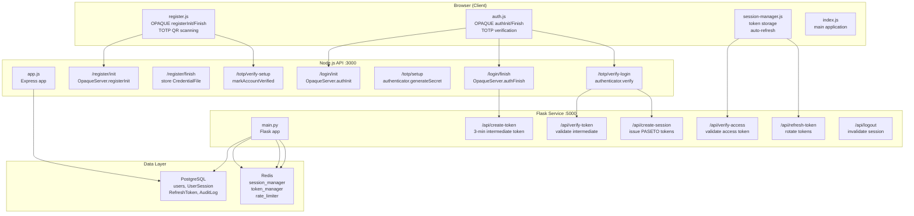
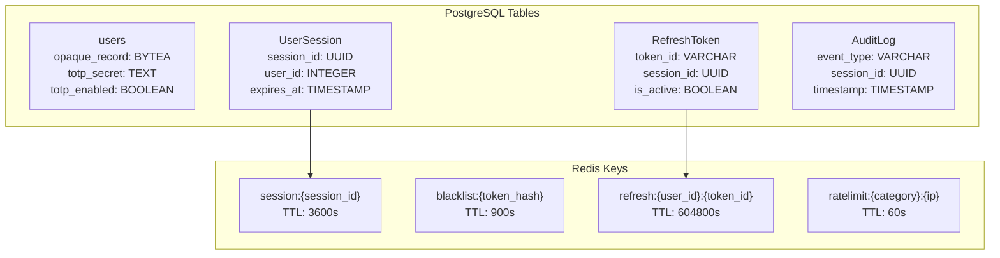

# Overview

> **Relevant source files**
> * [Documentation/Business-Model.md](https://github.com/RogueElectron/Cypher1/blob/c60431e6/Documentation/Business-Model.md)
> * [Documentation/Team-Roles.md](https://github.com/RogueElectron/Cypher1/blob/c60431e6/Documentation/Team-Roles.md)
> * [README.md](https://github.com/RogueElectron/Cypher1/blob/c60431e6/README.md)
> * [back-end/main.py](https://github.com/RogueElectron/Cypher1/blob/c60431e6/back-end/main.py)
> * [back-end/node_internal_api/app.js](https://github.com/RogueElectron/Cypher1/blob/c60431e6/back-end/node_internal_api/app.js)

## Purpose and Scope

This page provides a high-level introduction to the Cypher authentication platform, explaining its purpose, architecture, and core components. It serves as the entry point for understanding how the system works and how its parts fit together.

For detailed information about specific subsystems, see:

* System architecture and component relationships: [System Architecture](/RogueElectron/Cypher1/2-system-architecture)
* Authentication protocols and workflows: [Authentication System](/RogueElectron/Cypher1/3-authentication-system)
* Backend service implementation: [Backend Services](/RogueElectron/Cypher1/4-backend-services)
* Client-side components: [Frontend Components](/RogueElectron/Cypher1/5-frontend-components)
* Database design and caching: [Data Layer](/RogueElectron/Cypher1/6-data-layer)
* Business model and market strategy: [Business Model and Strategy](/RogueElectron/Cypher1/9-business-model-and-strategy)

**Sources:** [README.md L1-L68](https://github.com/RogueElectron/Cypher1/blob/c60431e6/README.md#L1-L68)

 [Documentation/Business-Model.md L1-L300](https://github.com/RogueElectron/Cypher1/blob/c60431e6/Documentation/Business-Model.md#L1-L300)

---

## What is Cypher?

Cypher is a **zero-knowledge authentication platform** that implements mathematically provable password security using the OPAQUE protocol, combined with TOTP two-factor authentication and PASETO stateless token management. The system ensures that user passwords never exist in plaintext on the server, even during registration, creating a breach-proof authentication architecture.

The platform consists of two backend services, a client-side JavaScript application, and a dual-storage data layer:

| Component | Technology | Port | Responsibility |
| --- | --- | --- | --- |
| Flask Session Service | Python 3, Flask | 5000 | PASETO token management, session lifecycle, rate limiting |
| Node.js Internal API | Node.js, Express | 3000 | OPAQUE protocol, TOTP operations, credential storage |
| Client Application | Vite-bundled JavaScript | - | OPAQUE client operations, token management, UI |
| PostgreSQL | PostgreSQL 15+ | 5432 | Persistent storage for users, sessions, tokens, audit logs |
| Redis | Redis 7+ | 6379 | Session cache, token blacklist, rate limiting |

**Sources:** [back-end/main.py L1-L75](https://github.com/RogueElectron/Cypher1/blob/c60431e6/back-end/main.py#L1-L75)

 [back-end/node_internal_api/app.js L1-L102](https://github.com/RogueElectron/Cypher1/blob/c60431e6/back-end/node_internal_api/app.js#L1-L102)

 [README.md L7-L16](https://github.com/RogueElectron/Cypher1/blob/c60431e6/README.md#L7-L16)

---

## System Architecture Overview

The following diagram shows the complete system architecture with actual code entities and their relationships:



**Sources:** [back-end/main.py L76-L564](https://github.com/RogueElectron/Cypher1/blob/c60431e6/back-end/main.py#L76-L564)

 [back-end/node_internal_api/app.js L143-L501](https://github.com/RogueElectron/Cypher1/blob/c60431e6/back-end/node_internal_api/app.js#L143-L501)

---

## Core Components

### Flask Session Service (Port 5000)

The Flask service manages **stateless session lifecycle** using PASETO tokens. It handles three types of tokens:

| Token Type | Key Used | Lifetime | Purpose | Storage Location |
| --- | --- | --- | --- | --- |
| Intermediate Token | `key` | 3 minutes | Bridges OPAQUE and TOTP phases | HttpOnly cookie |
| Access Token | `session_key` | 15 minutes | Authorizes API requests | HttpOnly cookie |
| Refresh Token | `refresh_key` | 7 days | One-time use token rotation | localStorage |

The service implements rate limiting, session caching, and token blacklisting through Redis managers initialized in `initialize_app()`.

**Key endpoints:**

* `/api/create-token`: Issues intermediate token after OPAQUE success [main.py L92-L112](https://github.com/RogueElectron/Cypher1/blob/c60431e6/main.py#L92-L112)
* `/api/verify-token`: Validates intermediate token before TOTP [main.py L114-L148](https://github.com/RogueElectron/Cypher1/blob/c60431e6/main.py#L114-L148)
* `/api/create-session`: Issues access and refresh tokens after TOTP [main.py L150-L304](https://github.com/RogueElectron/Cypher1/blob/c60431e6/main.py#L150-L304)
* `/api/verify-access`: Validates access tokens with Redis cache fallback [main.py L307-L385](https://github.com/RogueElectron/Cypher1/blob/c60431e6/main.py#L307-L385)
* `/api/refresh-token`: Rotates tokens using one-time refresh tokens [main.py L388-L512](https://github.com/RogueElectron/Cypher1/blob/c60431e6/main.py#L388-L512)
* `/api/logout`: Blacklists tokens and deletes sessions [main.py L515-L560](https://github.com/RogueElectron/Cypher1/blob/c60431e6/main.py#L515-L560)

**Sources:** [back-end/main.py L28-L74](https://github.com/RogueElectron/Cypher1/blob/c60431e6/back-end/main.py#L28-L74)

 [back-end/main.py L92-L564](https://github.com/RogueElectron/Cypher1/blob/c60431e6/back-end/main.py#L92-L564)

### Node.js Internal API (Port 3000)

The Node.js service handles **cryptographic operations** using the OPAQUE protocol and TOTP verification. It never stores or transmits plaintext passwords.

**OPAQUE server initialization:**

```javascript
const cfg = getOpaqueConfig(OpaqueID.OPAQUE_P256);
const oprfSeed = cfg.prng.random(cfg.hash.Nh);
const serverKeypairSeed = cfg.prng.random(cfg.constants.Nseed);
const serverAkeKeypair = await cfg.ake.deriveAuthKeyPair(serverKeypairSeed);
const server = new OpaqueServer(cfg, oprfSeed, akeKeypairExport);
```

**Key endpoints:**

* `/register/init`: Initiates OPAQUE registration, returns `RegistrationResponse` [app.js L143-L175](https://github.com/RogueElectron/Cypher1/blob/c60431e6/app.js#L143-L175)
* `/register/finish`: Stores `CredentialFile` as serialized `Uint8Array` [app.js L177-L220](https://github.com/RogueElectron/Cypher1/blob/c60431e6/app.js#L177-L220)
* `/login/init`: Returns `KE2` challenge, stores expected value in `global.userSessions` [app.js L222-L259](https://github.com/RogueElectron/Cypher1/blob/c60431e6/app.js#L222-L259)
* `/login/finish`: Verifies `KE3`, calls Flask `/api/create-token` [app.js L263-L325](https://github.com/RogueElectron/Cypher1/blob/c60431e6/app.js#L263-L325)
* `/totp/setup`: Generates TOTP secret, creates QR code [app.js L329-L361](https://github.com/RogueElectron/Cypher1/blob/c60431e6/app.js#L329-L361)
* `/totp/verify-setup`: Validates TOTP during registration, calls `markAccountVerified()` [app.js L363-L389](https://github.com/RogueElectron/Cypher1/blob/c60431e6/app.js#L363-L389)
* `/totp/verify-login`: Validates TOTP during login, calls Flask `/api/create-session` [app.js L391-L496](https://github.com/RogueElectron/Cypher1/blob/c60431e6/app.js#L391-L496)

**Database integration:** Uses `createPostgresStorage()` from `db.js` to store OPAQUE records as base64-encoded byte arrays in PostgreSQL.

**Sources:** [back-end/node_internal_api/app.js L1-L137](https://github.com/RogueElectron/Cypher1/blob/c60431e6/back-end/node_internal_api/app.js#L1-L137)

 [back-end/node_internal_api/app.js L143-L501](https://github.com/RogueElectron/Cypher1/blob/c60431e6/back-end/node_internal_api/app.js#L143-L501)

### Client-Side Modules

The client application is built using Vite and consists of four entry points:

| Module | Entry Point | Primary Classes/Functions | Purpose |
| --- | --- | --- | --- |
| Registration | `register.js` | `OpaqueClient.registerInit()`, `registerFinish()` | OPAQUE registration + TOTP setup |
| Login | `auth.js` | `OpaqueClient.authInit()`, `authFinish()` | OPAQUE login + TOTP verification |
| Session Manager | `session-manager.js` | `SessionManager` class | Token lifecycle, auto-refresh |
| Main App | `index.js` | Application logic | Protected content |

The modules are compiled to `static/dist/` by Vite and served by the Flask application.

**Sources:** [README.md L50-L53](https://github.com/RogueElectron/Cypher1/blob/c60431e6/README.md#L50-L53)

 [vite.config.js] (referenced in diagrams)

### Data Layer

The data layer implements a **write-through cache pattern** with PostgreSQL as the source of truth and Redis for performance.



**PostgreSQL:** Managed through SQLAlchemy ORM with models defined in `src/models.py`. The `users` table stores OPAQUE records as `BYTEA` columns containing serialized `CredentialFile` objects.

**Redis:** Managed through three manager classes:

* `get_session_manager()`: Session CRUD operations with TTL
* `get_token_manager()`: Token blacklisting and refresh token caching
* `get_rate_limiter()`: Request counting with sliding windows

**Sources:** [back-end/main.py L17-L22](https://github.com/RogueElectron/Cypher1/blob/c60431e6/back-end/main.py#L17-L22)

 [back-end/node_internal_api/app.js L89-L91](https://github.com/RogueElectron/Cypher1/blob/c60431e6/back-end/node_internal_api/app.js#L89-L91)

---

## Technology Stack

The following table summarizes the key technologies and their roles:

| Category | Technology | Version/Protocol | Usage |
| --- | --- | --- | --- |
| **Cryptography** | OPAQUE | P-256 curve | Zero-knowledge password authentication |
|  | PASETO | v4.local | Stateless token authentication |
|  | TOTP | RFC 6238 | Time-based one-time passwords |
| **Backend** | Flask | 2.x | HTTP server, token management |
|  | Node.js | 18+ | OPAQUE server, TOTP operations |
|  | Express | 4.x | HTTP routing for Node.js API |
| **Database** | PostgreSQL | 15+ | Persistent storage |
|  | Redis | 7+ | Cache and rate limiting |
| **Frontend** | Vite | 4.x | Build system and bundler |
|  | Vanilla JavaScript | ES6+ | Client-side logic |
| **Libraries** | @cloudflare/opaque-ts | Latest | OPAQUE client and server |
|  | paseto | 3.x | PASETO token creation/parsing |
|  | otplib | 12.x | TOTP generation/verification |
|  | SQLAlchemy | 2.x | PostgreSQL ORM |

**Sources:** [back-end/node_internal_api/app.js L1-L21](https://github.com/RogueElectron/Cypher1/blob/c60431e6/back-end/node_internal_api/app.js#L1-L21)

 [back-end/main.py L1-L22](https://github.com/RogueElectron/Cypher1/blob/c60431e6/back-end/main.py#L1-L22)

 [README.md L15-L16](https://github.com/RogueElectron/Cypher1/blob/c60431e6/README.md#L15-L16)

---

## Key Security Features

### Zero-Knowledge Password Authentication

The OPAQUE protocol ensures that:

1. **Passwords never leave the client in plaintext** - only cryptographic commitments are transmitted
2. **Server learns nothing about passwords** - even during registration
3. **Breached databases reveal no authentication secrets** - OPAQUE records are useless without the password

The protocol uses a three-message exchange:

* **Registration:** Client sends blinded registration request → Server responds → Client sends final record
* **Authentication:** Client sends KE1 → Server responds with KE2 → Client sends KE3

**Sources:** [back-end/node_internal_api/app.js L82-L137](https://github.com/RogueElectron/Cypher1/blob/c60431e6/back-end/node_internal_api/app.js#L82-L137)

 [Documentation/Business-Model.md L38-L42](https://github.com/RogueElectron/Cypher1/blob/c60431e6/Documentation/Business-Model.md#L38-L42)

### Multi-Phase Authentication Flow

Authentication proceeds through four distinct phases, each with different security guarantees:

```mermaid
sequenceDiagram
  participant Client
  participant (auth.js)
  participant Node.js API :3000
  participant (app.js)
  participant Flask API :5000
  participant (main.py)

  note over Client,(main.py): Phase 1: OPAQUE Authentication
  Client->>Node.js API :3000: "POST /login/init {username, KE1}"
  Node.js API :3000->>Node.js API :3000: "OpaqueServer.authInit()"
  Node.js API :3000-->>Client: "{KE2}"
  Client->>Client: "verify server, generate KE3"
  Client->>Node.js API :3000: "POST /login/finish {username, KE3}"
  Node.js API :3000->>Node.js API :3000: "OpaqueServer.authFinish()"
  note over Client,(main.py): Phase 2: Intermediate Token
  Node.js API :3000->>Flask API :5000: "POST /api/create-token"
  Flask API :5000-->>Node.js API :3000: "{token: pass_auth_token}"
  Node.js API :3000-->>Client: "{success: true, token}"
  note over Client,(main.py): Phase 3: TOTP Verification
  Client->>Node.js API :3000: "POST /totp/verify-login {code, pass_auth_token}"
  Node.js API :3000->>Flask API :5000: "POST /api/verify-token"
  Flask API :5000-->>Node.js API :3000: "{valid: true}"
  Node.js API :3000->>Node.js API :3000: "authenticator.verify()"
  note over Client,(main.py): Phase 4: Session Creation
  Node.js API :3000->>Flask API :5000: "POST /api/create-session"
  Flask API :5000->>Flask API :5000: "paseto.create() x2"
  Flask API :5000-->>Node.js API :3000: "{access_token, refresh_token}"
  Node.js API :3000-->>Client: "return tokens"
  Client->>Client: "SessionManager.setTokens()"
```

Each phase gates access to the next:

1. **OPAQUE** proves password knowledge without revealing it
2. **Intermediate token** bridges password verification and 2FA (3-minute TTL)
3. **TOTP** adds second factor verification
4. **Session tokens** enable ongoing authenticated requests (15-minute access, 7-day refresh)

**Sources:** [back-end/node_internal_api/app.js L263-L325](https://github.com/RogueElectron/Cypher1/blob/c60431e6/back-end/node_internal_api/app.js#L263-L325)

 [back-end/node_internal_api/app.js L391-L496](https://github.com/RogueElectron/Cypher1/blob/c60431e6/back-end/node_internal_api/app.js#L391-L496)

 [back-end/main.py L150-L304](https://github.com/RogueElectron/Cypher1/blob/c60431e6/back-end/main.py#L150-L304)

### Token Rotation and Security

The system implements **one-time-use refresh tokens** with automatic rotation:

1. Each refresh token has a unique `token_id` stored in both PostgreSQL and Redis
2. When used, the token is marked `is_active=False` in the database [main.py L429](https://github.com/RogueElectron/Cypher1/blob/c60431e6/main.py#L429-L429)
3. A new refresh token with a different `token_id` is generated [main.py L462-L478](https://github.com/RogueElectron/Cypher1/blob/c60431e6/main.py#L462-L478)
4. The new token includes a `refreshed_from` audit trail pointing to the old token [main.py L490](https://github.com/RogueElectron/Cypher1/blob/c60431e6/main.py#L490-L490)

Access tokens are **blacklisted on logout** for their remaining lifetime (15 minutes) to prevent replay attacks [main.py L536](https://github.com/RogueElectron/Cypher1/blob/c60431e6/main.py#L536-L536)

**Sources:** [back-end/main.py L388-L512](https://github.com/RogueElectron/Cypher1/blob/c60431e6/back-end/main.py#L388-L512)

 [back-end/main.py L515-L560](https://github.com/RogueElectron/Cypher1/blob/c60431e6/back-end/main.py#L515-L560)

---

## Development and Deployment

The platform uses automated setup scripts that handle prerequisites, dependencies, database initialization, and service orchestration.

**Setup process:**

1. Run `setup.sh` (Linux/macOS) or `setup.ps1` (Windows)
2. Script validates prerequisites (Python 3, Node.js, npm, Docker)
3. Installs Python dependencies in `../cyvenv` virtual environment
4. Installs Node.js dependencies for main app and `node_internal_api/`
5. Builds frontend assets using Vite → `static/dist/`
6. Starts Docker Compose (PostgreSQL + Redis)
7. Initializes database schemas
8. Generates `start.sh` and `dev.sh` scripts

**Running the application:**

* Production: `./start.sh` starts Flask (:5000) and Node.js (:3000) in parallel
* Development: `./dev.sh` enables Flask debug mode and nodemon hot-reload

For detailed setup instructions, see [Installation and Setup](/RogueElectron/Cypher1/7.1-installation-and-setup).

**Sources:** [README.md L54-L61](https://github.com/RogueElectron/Cypher1/blob/c60431e6/README.md#L54-L61)

---

## Next Steps

This overview provides the foundational understanding of Cypher's architecture. For deeper exploration:

* **Understanding the architecture:** See [System Architecture](/RogueElectron/Cypher1/2-system-architecture) for detailed component interactions
* **Authentication internals:** See [Authentication System](/RogueElectron/Cypher1/3-authentication-system) for OPAQUE, TOTP, and token management details
* **Backend implementation:** See [Backend Services](/RogueElectron/Cypher1/4-backend-services) for Flask and Node.js service documentation
* **Client-side code:** See [Frontend Components](/RogueElectron/Cypher1/5-frontend-components) for JavaScript module documentation
* **Database design:** See [Data Layer](/RogueElectron/Cypher1/6-data-layer) for schema and caching strategies
* **Getting started:** See [Development and Deployment](/RogueElectron/Cypher1/7-development-and-deployment) for setup and build instructions
* **Security model:** See [Security Architecture](/RogueElectron/Cypher1/8-security-architecture) for threat model and cryptographic foundations
* **Business context:** See [Business Model and Strategy](/RogueElectron/Cypher1/9-business-model-and-strategy) for market positioning

**Sources:** [README.md L26-L68](https://github.com/RogueElectron/Cypher1/blob/c60431e6/README.md#L26-L68)