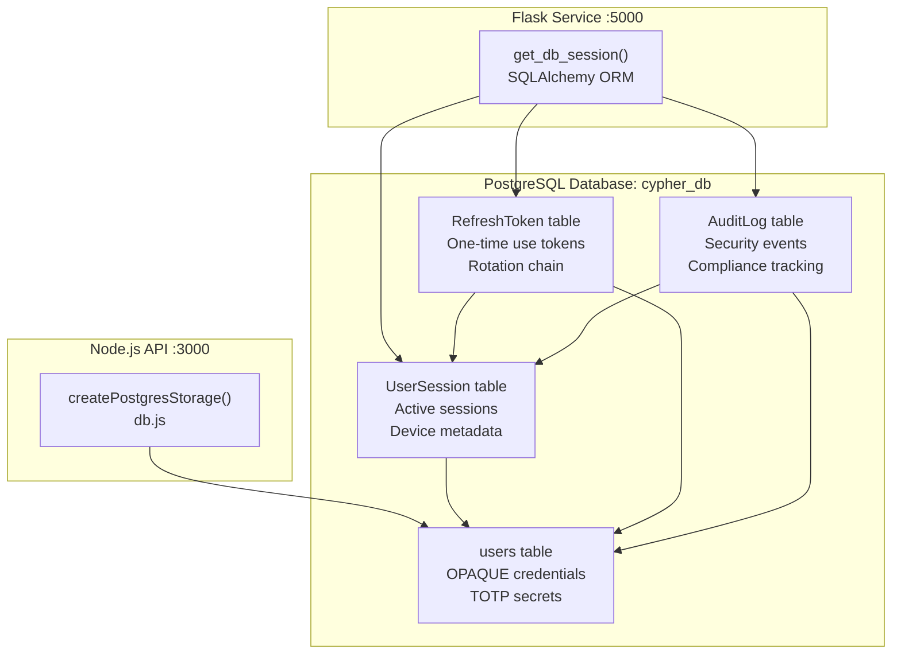

# PostgreSQL Schema

> **Relevant source files**
> * [back-end/main.py](https://github.com/RogueElectron/Cypher1/blob/c60431e6/back-end/main.py)
> * [back-end/node_internal_api/app.js](https://github.com/RogueElectron/Cypher1/blob/c60431e6/back-end/node_internal_api/app.js)
> * [back-end/node_internal_api/db.js](https://github.com/RogueElectron/Cypher1/blob/c60431e6/back-end/node_internal_api/db.js)
> * [back-end/node_internal_api/package-lock.json](https://github.com/RogueElectron/Cypher1/blob/c60431e6/back-end/node_internal_api/package-lock.json)
> * [back-end/node_internal_api/package.json](https://github.com/RogueElectron/Cypher1/blob/c60431e6/back-end/node_internal_api/package.json)
> * [back-end/package-lock.json](https://github.com/RogueElectron/Cypher1/blob/c60431e6/back-end/package-lock.json)
> * [back-end/package.json](https://github.com/RogueElectron/Cypher1/blob/c60431e6/back-end/package.json)

## Purpose and Scope

This document provides a comprehensive reference for the PostgreSQL database schema used in the Cypher authentication platform. It details all database tables, their columns, data types, relationships, and storage formats.

For information about Redis caching and session management, see [Redis Caching and Rate Limiting](/RogueElectron/Cypher1/6.2-redis-caching-and-rate-limiting). For details about how the Node.js API interacts with the database, see [Node.js Internal API](/RogueElectron/Cypher1/4.2-node.js-internal-api). For Flask service database operations, see [Flask Session Service](/RogueElectron/Cypher1/4.1-flask-session-service).

---

## Database Overview

The PostgreSQL database (`cypher_db`) serves as the source of truth for all persistent authentication data. It stores user credentials (OPAQUE records), session information, refresh tokens, and audit logs. The database is accessed by both the Node.js API (for OPAQUE and TOTP operations) and the Flask service (for session and token management).

**Sources:** [back-end/node_internal_api/db.js L10-L19](https://github.com/RogueElectron/Cypher1/blob/c60431e6/back-end/node_internal_api/db.js#L10-L19)

---

## Database Architecture



**Sources:** [back-end/node_internal_api/db.js L30-L148](https://github.com/RogueElectron/Cypher1/blob/c60431e6/back-end/node_internal_api/db.js#L30-L148)

 [back-end/main.py L177-L304](https://github.com/RogueElectron/Cypher1/blob/c60431e6/back-end/main.py#L177-L304)

---

## Table: users

The `users` table stores user account information, including OPAQUE cryptographic records and TOTP secrets. This table is primarily managed by the Node.js API.

### Schema Structure

```css
#mermaid-9wktubmhal{font-family:ui-sans-serif,-apple-system,system-ui,Segoe UI,Helvetica;font-size:16px;fill:#ccc;}@keyframes edge-animation-frame{from{stroke-dashoffset:0;}}@keyframes dash{to{stroke-dashoffset:0;}}#mermaid-9wktubmhal .edge-animation-slow{stroke-dasharray:9,5!important;stroke-dashoffset:900;animation:dash 50s linear infinite;stroke-linecap:round;}#mermaid-9wktubmhal .edge-animation-fast{stroke-dasharray:9,5!important;stroke-dashoffset:900;animation:dash 20s linear infinite;stroke-linecap:round;}#mermaid-9wktubmhal .error-icon{fill:#333;}#mermaid-9wktubmhal .error-text{fill:#cccccc;stroke:#cccccc;}#mermaid-9wktubmhal .edge-thickness-normal{stroke-width:1px;}#mermaid-9wktubmhal .edge-thickness-thick{stroke-width:3.5px;}#mermaid-9wktubmhal .edge-pattern-solid{stroke-dasharray:0;}#mermaid-9wktubmhal .edge-thickness-invisible{stroke-width:0;fill:none;}#mermaid-9wktubmhal .edge-pattern-dashed{stroke-dasharray:3;}#mermaid-9wktubmhal .edge-pattern-dotted{stroke-dasharray:2;}#mermaid-9wktubmhal .marker{fill:#666;stroke:#666;}#mermaid-9wktubmhal .marker.cross{stroke:#666;}#mermaid-9wktubmhal svg{font-family:ui-sans-serif,-apple-system,system-ui,Segoe UI,Helvetica;font-size:16px;}#mermaid-9wktubmhal p{margin:0;}#mermaid-9wktubmhal .entityBox{fill:#111;stroke:#222;}#mermaid-9wktubmhal .relationshipLabelBox{fill:#333;opacity:0.7;background-color:#333;}#mermaid-9wktubmhal .relationshipLabelBox rect{opacity:0.5;}#mermaid-9wktubmhal .labelBkg{background-color:rgba(51, 51, 51, 0.5);}#mermaid-9wktubmhal .edgeLabel .label{fill:#222;font-size:14px;}#mermaid-9wktubmhal .label{font-family:ui-sans-serif,-apple-system,system-ui,Segoe UI,Helvetica;color:#fff;}#mermaid-9wktubmhal .edge-pattern-dashed{stroke-dasharray:8,8;}#mermaid-9wktubmhal .node rect,#mermaid-9wktubmhal .node circle,#mermaid-9wktubmhal .node ellipse,#mermaid-9wktubmhal .node polygon{fill:#111;stroke:#222;stroke-width:1px;}#mermaid-9wktubmhal .relationshipLine{stroke:#666;stroke-width:1;fill:none;}#mermaid-9wktubmhal .marker{fill:none!important;stroke:#666!important;stroke-width:1;}#mermaid-9wktubmhal :root{--mermaid-font-family:"trebuchet ms",verdana,arial,sans-serif;}usersUUIDidPKgen_random_uuid()VARCHARusernameUKUnique identifierTEXTopaque_recordBase64-encoded OPAQUE RegistrationRecordTEXTtotp_secretEncrypted TOTP secretBOOLEANis_activeAccount enabled flagBOOLEANemail_verifiedEmail verification statusBOOLEANtotp_enabled2FA enabled flagINTEGERfailed_login_attemptsFailed login counterTIMESTAMPcreated_atAccount creation timeTIMESTAMPupdated_atLast modification timeTIMESTAMPpassword_changed_atLast password changeTIMESTAMPlocked_untilAccount lock expirationTIMESTAMPlast_login_atLast successful login
```

### Column Definitions

| Column | Type | Constraints | Description |
| --- | --- | --- | --- |
| `id` | UUID | PRIMARY KEY | Auto-generated via `gen_random_uuid()` |
| `username` | VARCHAR | UNIQUE, NOT NULL | User's unique identifier |
| `opaque_record` | TEXT | NOT NULL | Base64-encoded `CredentialFile.serialize()` output |
| `totp_secret` | TEXT | NULL | Encrypted TOTP secret (encrypted by Python service) |
| `is_active` | BOOLEAN | NOT NULL, DEFAULT true | Account enabled/disabled flag |
| `email_verified` | BOOLEAN | NOT NULL, DEFAULT false | Email verification status |
| `totp_enabled` | BOOLEAN | NOT NULL, DEFAULT false | Whether TOTP 2FA is enabled |
| `failed_login_attempts` | INTEGER | NOT NULL, DEFAULT 0 | Counter for failed logins |
| `created_at` | TIMESTAMP | NOT NULL, DEFAULT NOW() | Account creation timestamp |
| `updated_at` | TIMESTAMP | NOT NULL, DEFAULT NOW() | Last update timestamp |
| `password_changed_at` | TIMESTAMP | NOT NULL, DEFAULT NOW() | Last password change |
| `locked_until` | TIMESTAMP | NULL | Account lock expiration (if locked) |
| `last_login_at` | TIMESTAMP | NULL | Last successful login time |

### Storage Format: OPAQUE Record

The `opaque_record` column stores the serialized OPAQUE `CredentialFile` as base64-encoded text:

```javascript
// Conversion: Uint8Array → Base64
const opaqueRecordB64 = Buffer.from(opaqueRecord).toString('base64');

// Retrieval: Base64 → Uint8Array
const buffer = Buffer.from(opaqueRecordB64, 'base64');
return new Uint8Array(buffer);
```

This format conversion is necessary because PostgreSQL's TEXT type cannot store raw binary data. The OPAQUE record contains the user's password verification data encrypted using the OPAQUE protocol.

**Sources:** [back-end/node_internal_api/db.js L32-L62](https://github.com/RogueElectron/Cypher1/blob/c60431e6/back-end/node_internal_api/db.js#L32-L62)

 [back-end/node_internal_api/db.js L65-L86](https://github.com/RogueElectron/Cypher1/blob/c60431e6/back-end/node_internal_api/db.js#L65-L86)

### Storage Format: TOTP Secret

The `totp_secret` column stores the TOTP shared secret that generates 6-digit time-based one-time passwords. The secret is encrypted by an external Python encryption service before storage.

**Sources:** [back-end/node_internal_api/db.js L99-L109](https://github.com/RogueElectron/Cypher1/blob/c60431e6/back-end/node_internal_api/db.js#L99-L109)

 [back-end/node_internal_api/db.js L111-L125](https://github.com/RogueElectron/Cypher1/blob/c60431e6/back-end/node_internal_api/db.js#L111-L125)

### Account Locking Logic

The `is_locked()` method checks if an account is temporarily locked due to failed login attempts:

```python
# Inferred from line 184 in main.py
if user.is_locked():
    return jsonify({'error': 'Account temporarily locked'}), 423
```

The `locked_until` timestamp determines when the account becomes available again.

**Sources:** [back-end/main.py L183-L184](https://github.com/RogueElectron/Cypher1/blob/c60431e6/back-end/main.py#L183-L184)

---

## Table: UserSession

The `UserSession` table tracks active user sessions, including device metadata and expiration times. Each session corresponds to a pair of access/refresh tokens.

### Schema Structure

```css
#mermaid-c91xa2ttkth{font-family:ui-sans-serif,-apple-system,system-ui,Segoe UI,Helvetica;font-size:16px;fill:#ccc;}@keyframes edge-animation-frame{from{stroke-dashoffset:0;}}@keyframes dash{to{stroke-dashoffset:0;}}#mermaid-c91xa2ttkth .edge-animation-slow{stroke-dasharray:9,5!important;stroke-dashoffset:900;animation:dash 50s linear infinite;stroke-linecap:round;}#mermaid-c91xa2ttkth .edge-animation-fast{stroke-dasharray:9,5!important;stroke-dashoffset:900;animation:dash 20s linear infinite;stroke-linecap:round;}#mermaid-c91xa2ttkth .error-icon{fill:#333;}#mermaid-c91xa2ttkth .error-text{fill:#cccccc;stroke:#cccccc;}#mermaid-c91xa2ttkth .edge-thickness-normal{stroke-width:1px;}#mermaid-c91xa2ttkth .edge-thickness-thick{stroke-width:3.5px;}#mermaid-c91xa2ttkth .edge-pattern-solid{stroke-dasharray:0;}#mermaid-c91xa2ttkth .edge-thickness-invisible{stroke-width:0;fill:none;}#mermaid-c91xa2ttkth .edge-pattern-dashed{stroke-dasharray:3;}#mermaid-c91xa2ttkth .edge-pattern-dotted{stroke-dasharray:2;}#mermaid-c91xa2ttkth .marker{fill:#666;stroke:#666;}#mermaid-c91xa2ttkth .marker.cross{stroke:#666;}#mermaid-c91xa2ttkth svg{font-family:ui-sans-serif,-apple-system,system-ui,Segoe UI,Helvetica;font-size:16px;}#mermaid-c91xa2ttkth p{margin:0;}#mermaid-c91xa2ttkth .entityBox{fill:#111;stroke:#222;}#mermaid-c91xa2ttkth .relationshipLabelBox{fill:#333;opacity:0.7;background-color:#333;}#mermaid-c91xa2ttkth .relationshipLabelBox rect{opacity:0.5;}#mermaid-c91xa2ttkth .labelBkg{background-color:rgba(51, 51, 51, 0.5);}#mermaid-c91xa2ttkth .edgeLabel .label{fill:#222;font-size:14px;}#mermaid-c91xa2ttkth .label{font-family:ui-sans-serif,-apple-system,system-ui,Segoe UI,Helvetica;color:#fff;}#mermaid-c91xa2ttkth .edge-pattern-dashed{stroke-dasharray:8,8;}#mermaid-c91xa2ttkth .node rect,#mermaid-c91xa2ttkth .node circle,#mermaid-c91xa2ttkth .node ellipse,#mermaid-c91xa2ttkth .node polygon{fill:#111;stroke:#222;stroke-width:1px;}#mermaid-c91xa2ttkth .relationshipLine{stroke:#666;stroke-width:1;fill:none;}#mermaid-c91xa2ttkth .marker{fill:none!important;stroke:#666!important;stroke-width:1;}#mermaid-c91xa2ttkth :root{--mermaid-font-family:"trebuchet ms",verdana,arial,sans-serif;}user_idUserSessionVARCHARsession_idPKUnique session identifierUUIDuser_idFKReferences users.idTIMESTAMPcreated_atSession creation timeTIMESTAMPexpires_atSession expiration timeVARCHARip_addressClient IP addressTEXTuser_agentClient user agent stringVARCHARdevice_fingerprintBrowser/device fingerprintBOOLEANis_activeSession active flagJSONsession_dataAdditional session metadatausers
```

### Column Definitions

| Column | Type | Constraints | Description |
| --- | --- | --- | --- |
| `session_id` | VARCHAR | PRIMARY KEY | Unique session identifier (from Redis or generated) |
| `user_id` | UUID | FOREIGN KEY → `users.id`, NOT NULL | User who owns this session |
| `created_at` | TIMESTAMP | NOT NULL, DEFAULT NOW() | Session creation timestamp |
| `expires_at` | TIMESTAMP | NOT NULL | Session expiration timestamp (typically +1 hour) |
| `ip_address` | VARCHAR | NOT NULL | Client's IP address |
| `user_agent` | TEXT | NOT NULL | Client's User-Agent header |
| `device_fingerprint` | VARCHAR | NULL | Browser/device fingerprint for multi-device tracking |
| `is_active` | BOOLEAN | NOT NULL, DEFAULT true | Whether session is currently active |
| `session_data` | JSON | NULL | Additional session metadata (stored via `set_session_data()`) |

### Session Lifecycle

Sessions are created with a 1-hour TTL and stored in both Redis (for fast access) and PostgreSQL (for persistence):

```markdown
# Session creation flow
session_id = get_session_manager().create_session(
    user_id=str(user.id),
    session_data=session_data,
    ttl=3600  # 1 hour
)

db_session_obj = UserSession(
    session_id=session_id,  # IMPORTANT: Use same session_id
    user_id=user.id,
    ip_address=client_ip,
    expires_at=datetime.datetime.utcnow() + datetime.timedelta(hours=1)
)
```

**Critical Design Note:** The `session_id` from Redis must match the `session_id` in PostgreSQL to prevent "session mismatch" errors. This was a bug that was fixed in the code (see comment at line 195-196).

**Sources:** [back-end/main.py L195-L213](https://github.com/RogueElectron/Cypher1/blob/c60431e6/back-end/main.py#L195-L213)

 [back-end/main.py L346-L366](https://github.com/RogueElectron/Cypher1/blob/c60431e6/back-end/main.py#L346-L366)

### Session Data JSON Structure

The `session_data` JSON field stores metadata via the `set_session_data()` method:

```
session_data = {
    'user_id': str(user.id),
    'username': username,
    'ip_address': client_ip,
    'user_agent': request.headers.get('User-Agent', ''),
    'device_fingerprint': data.get('device_fingerprint', '')
}
db_session_obj.set_session_data(session_data)
```

**Sources:** [back-end/main.py L187-L193](https://github.com/RogueElectron/Cypher1/blob/c60431e6/back-end/main.py#L187-L193)

 [back-end/main.py L212](https://github.com/RogueElectron/Cypher1/blob/c60431e6/back-end/main.py#L212-L212)

---

## Table: RefreshToken

The `RefreshToken` table implements one-time-use refresh tokens with rotation. Each refresh operation invalidates the old token and creates a new one.

### Schema Structure

```css
#mermaid-vzw9y6v3efb{font-family:ui-sans-serif,-apple-system,system-ui,Segoe UI,Helvetica;font-size:16px;fill:#ccc;}@keyframes edge-animation-frame{from{stroke-dashoffset:0;}}@keyframes dash{to{stroke-dashoffset:0;}}#mermaid-vzw9y6v3efb .edge-animation-slow{stroke-dasharray:9,5!important;stroke-dashoffset:900;animation:dash 50s linear infinite;stroke-linecap:round;}#mermaid-vzw9y6v3efb .edge-animation-fast{stroke-dasharray:9,5!important;stroke-dashoffset:900;animation:dash 20s linear infinite;stroke-linecap:round;}#mermaid-vzw9y6v3efb .error-icon{fill:#333;}#mermaid-vzw9y6v3efb .error-text{fill:#cccccc;stroke:#cccccc;}#mermaid-vzw9y6v3efb .edge-thickness-normal{stroke-width:1px;}#mermaid-vzw9y6v3efb .edge-thickness-thick{stroke-width:3.5px;}#mermaid-vzw9y6v3efb .edge-pattern-solid{stroke-dasharray:0;}#mermaid-vzw9y6v3efb .edge-thickness-invisible{stroke-width:0;fill:none;}#mermaid-vzw9y6v3efb .edge-pattern-dashed{stroke-dasharray:3;}#mermaid-vzw9y6v3efb .edge-pattern-dotted{stroke-dasharray:2;}#mermaid-vzw9y6v3efb .marker{fill:#666;stroke:#666;}#mermaid-vzw9y6v3efb .marker.cross{stroke:#666;}#mermaid-vzw9y6v3efb svg{font-family:ui-sans-serif,-apple-system,system-ui,Segoe UI,Helvetica;font-size:16px;}#mermaid-vzw9y6v3efb p{margin:0;}#mermaid-vzw9y6v3efb .entityBox{fill:#111;stroke:#222;}#mermaid-vzw9y6v3efb .relationshipLabelBox{fill:#333;opacity:0.7;background-color:#333;}#mermaid-vzw9y6v3efb .relationshipLabelBox rect{opacity:0.5;}#mermaid-vzw9y6v3efb .labelBkg{background-color:rgba(51, 51, 51, 0.5);}#mermaid-vzw9y6v3efb .edgeLabel .label{fill:#222;font-size:14px;}#mermaid-vzw9y6v3efb .label{font-family:ui-sans-serif,-apple-system,system-ui,Segoe UI,Helvetica;color:#fff;}#mermaid-vzw9y6v3efb .edge-pattern-dashed{stroke-dasharray:8,8;}#mermaid-vzw9y6v3efb .node rect,#mermaid-vzw9y6v3efb .node circle,#mermaid-vzw9y6v3efb .node ellipse,#mermaid-vzw9y6v3efb .node polygon{fill:#111;stroke:#222;stroke-width:1px;}#mermaid-vzw9y6v3efb .relationshipLine{stroke:#666;stroke-width:1;fill:none;}#mermaid-vzw9y6v3efb .marker{fill:none!important;stroke:#666!important;stroke-width:1;}#mermaid-vzw9y6v3efb :root{--mermaid-font-family:"trebuchet ms",verdana,arial,sans-serif;}user_idsession_idRefreshTokenVARCHARtoken_idPKUnique token identifierUUIDuser_idFKReferences users.idVARCHARsession_idFKReferences UserSession.session_idVARCHARtoken_hashHashed token valueTIMESTAMPcreated_atToken creation timeTIMESTAMPexpires_atToken expiration (7 days)BOOLEANis_activeToken usable flagBOOLEANis_revokedToken revoked flagTIMESTAMPused_atWhen token was consumedJSONtoken_dataMetadata including refreshed_fromusersUserSession
```

### Column Definitions

| Column | Type | Constraints | Description |
| --- | --- | --- | --- |
| `token_id` | VARCHAR | PRIMARY KEY | Unique token identifier (from PASETO claims) |
| `user_id` | UUID | FOREIGN KEY → `users.id`, NOT NULL | Token owner |
| `session_id` | VARCHAR | FOREIGN KEY → `UserSession.session_id`, NOT NULL | Associated session |
| `token_hash` | VARCHAR | NOT NULL | Hashed token value (not the actual token) |
| `created_at` | TIMESTAMP | NOT NULL, DEFAULT NOW() | Token creation time |
| `expires_at` | TIMESTAMP | NOT NULL | Token expiration (7 days from creation) |
| `is_active` | BOOLEAN | NOT NULL, DEFAULT true | Whether token can be used |
| `is_revoked` | BOOLEAN | NOT NULL, DEFAULT false | Whether token was explicitly revoked |
| `used_at` | TIMESTAMP | NULL | When token was consumed for refresh |
| `token_data` | JSON | NULL | Metadata including `refreshed_from` chain |

### Token Rotation Chain

Refresh tokens are one-time-use and create an audit trail via the `refreshed_from` field:

```css
# When creating a new refresh token after refresh
new_db_token.set_token_data({
    'refreshed_from': token_id  # Links to previous token
})
```

This creates a chain: Token A → Token B → Token C, allowing detection of token reuse attacks.

**Sources:** [back-end/main.py L252-L263](https://github.com/RogueElectron/Cypher1/blob/c60431e6/back-end/main.py#L252-L263)

 [back-end/main.py L481-L493](https://github.com/RogueElectron/Cypher1/blob/c60431e6/back-end/main.py#L481-L493)

 [back-end/main.py L489-L491](https://github.com/RogueElectron/Cypher1/blob/c60431e6/back-end/main.py#L489-L491)

### Token Security

The `token_hash` column stores a hash (not the actual token) for additional security. The actual PASETO token is never stored in the database:

```markdown
db_refresh_token = RefreshToken(
    token_id=refresh_token_id,
    token_hash=secrets.token_hex(16),  # Store hash, not actual token
    ...
)
```

**Sources:** [back-end/main.py L256](https://github.com/RogueElectron/Cypher1/blob/c60431e6/back-end/main.py#L256-L256)

### Token Lifecycle

1. **Creation**: Generated with 7-day expiration during session creation
2. **Usage**: Consumed during `/api/refresh-token` to get new access token
3. **Invalidation**: `is_active` set to `false`, `used_at` timestamp recorded
4. **Rotation**: New token created with `refreshed_from` pointing to old token
5. **Revocation**: All tokens for a session marked `is_revoked=true` on logout

**Sources:** [back-end/main.py L233-L263](https://github.com/RogueElectron/Cypher1/blob/c60431e6/back-end/main.py#L233-L263)

 [back-end/main.py L418-L493](https://github.com/RogueElectron/Cypher1/blob/c60431e6/back-end/main.py#L418-L493)

 [back-end/main.py L542-L553](https://github.com/RogueElectron/Cypher1/blob/c60431e6/back-end/main.py#L542-L553)

---

## Table: AuditLog

The `AuditLog` table records security-relevant events for compliance and forensic analysis.

### Schema Structure

```css
#mermaid-ho6ohk2y01{font-family:ui-sans-serif,-apple-system,system-ui,Segoe UI,Helvetica;font-size:16px;fill:#ccc;}@keyframes edge-animation-frame{from{stroke-dashoffset:0;}}@keyframes dash{to{stroke-dashoffset:0;}}#mermaid-ho6ohk2y01 .edge-animation-slow{stroke-dasharray:9,5!important;stroke-dashoffset:900;animation:dash 50s linear infinite;stroke-linecap:round;}#mermaid-ho6ohk2y01 .edge-animation-fast{stroke-dasharray:9,5!important;stroke-dashoffset:900;animation:dash 20s linear infinite;stroke-linecap:round;}#mermaid-ho6ohk2y01 .error-icon{fill:#333;}#mermaid-ho6ohk2y01 .error-text{fill:#cccccc;stroke:#cccccc;}#mermaid-ho6ohk2y01 .edge-thickness-normal{stroke-width:1px;}#mermaid-ho6ohk2y01 .edge-thickness-thick{stroke-width:3.5px;}#mermaid-ho6ohk2y01 .edge-pattern-solid{stroke-dasharray:0;}#mermaid-ho6ohk2y01 .edge-thickness-invisible{stroke-width:0;fill:none;}#mermaid-ho6ohk2y01 .edge-pattern-dashed{stroke-dasharray:3;}#mermaid-ho6ohk2y01 .edge-pattern-dotted{stroke-dasharray:2;}#mermaid-ho6ohk2y01 .marker{fill:#666;stroke:#666;}#mermaid-ho6ohk2y01 .marker.cross{stroke:#666;}#mermaid-ho6ohk2y01 svg{font-family:ui-sans-serif,-apple-system,system-ui,Segoe UI,Helvetica;font-size:16px;}#mermaid-ho6ohk2y01 p{margin:0;}#mermaid-ho6ohk2y01 .entityBox{fill:#111;stroke:#222;}#mermaid-ho6ohk2y01 .relationshipLabelBox{fill:#333;opacity:0.7;background-color:#333;}#mermaid-ho6ohk2y01 .relationshipLabelBox rect{opacity:0.5;}#mermaid-ho6ohk2y01 .labelBkg{background-color:rgba(51, 51, 51, 0.5);}#mermaid-ho6ohk2y01 .edgeLabel .label{fill:#222;font-size:14px;}#mermaid-ho6ohk2y01 .label{font-family:ui-sans-serif,-apple-system,system-ui,Segoe UI,Helvetica;color:#fff;}#mermaid-ho6ohk2y01 .edge-pattern-dashed{stroke-dasharray:8,8;}#mermaid-ho6ohk2y01 .node rect,#mermaid-ho6ohk2y01 .node circle,#mermaid-ho6ohk2y01 .node ellipse,#mermaid-ho6ohk2y01 .node polygon{fill:#111;stroke:#222;stroke-width:1px;}#mermaid-ho6ohk2y01 .relationshipLine{stroke:#666;stroke-width:1;fill:none;}#mermaid-ho6ohk2y01 .marker{fill:none!important;stroke:#666!important;stroke-width:1;}#mermaid-ho6ohk2y01 :root{--mermaid-font-family:"trebuchet ms",verdana,arial,sans-serif;}user_idsession_idAuditLogBIGSERIALidPKAuto-incrementing log IDVARCHARevent_typeEvent classificationVARCHARevent_categoryEvent category (AUTH, SESSION, etc)VARCHARseverityLog severity (INFO, WARNING, ERROR)UUIDuser_idFKReferences users.id (nullable)VARCHARsession_idFKReferences UserSession.session_id (nullable)VARCHARip_addressClient IP addressTEXTuser_agentClient user agentBOOLEANsuccessOperation success flagJSONevent_detailsAdditional event metadataTIMESTAMPcreated_atEvent timestampusersUserSession
```

### Column Definitions

| Column | Type | Constraints | Description |
| --- | --- | --- | --- |
| `id` | BIGSERIAL | PRIMARY KEY | Auto-incrementing log entry ID |
| `event_type` | VARCHAR | NOT NULL | Event classification (e.g., `session_created`) |
| `event_category` | VARCHAR | NOT NULL | High-level category (e.g., `AUTH`, `SESSION`) |
| `severity` | VARCHAR | NOT NULL | Log level (`INFO`, `WARNING`, `ERROR`) |
| `user_id` | UUID | FOREIGN KEY → `users.id`, NULL | User associated with event (if applicable) |
| `session_id` | VARCHAR | FOREIGN KEY → `UserSession.session_id`, NULL | Session associated with event (if applicable) |
| `ip_address` | VARCHAR | NULL | Client IP address |
| `user_agent` | TEXT | NULL | Client User-Agent header |
| `success` | BOOLEAN | NOT NULL | Whether operation succeeded |
| `event_details` | JSON | NULL | Additional event metadata |
| `created_at` | TIMESTAMP | NOT NULL, DEFAULT NOW() | Event timestamp |

### Audit Event Example

```
audit_log = AuditLog(
    event_type='session_created',
    event_category='AUTH',
    severity='INFO',
    user_id=user.id,
    session_id=session_id,
    ip_address=client_ip,
    user_agent=request.headers.get('User-Agent', ''),
    success=True
)
audit_log.set_event_details({
    'session_duration': '15 minutes',
    'refresh_token_duration': '7 days'
})
```

**Sources:** [back-end/main.py L277-L291](https://github.com/RogueElectron/Cypher1/blob/c60431e6/back-end/main.py#L277-L291)

---

## Entity Relationships

```css
#mermaid-pym4s7439t{font-family:ui-sans-serif,-apple-system,system-ui,Segoe UI,Helvetica;font-size:16px;fill:#ccc;}@keyframes edge-animation-frame{from{stroke-dashoffset:0;}}@keyframes dash{to{stroke-dashoffset:0;}}#mermaid-pym4s7439t .edge-animation-slow{stroke-dasharray:9,5!important;stroke-dashoffset:900;animation:dash 50s linear infinite;stroke-linecap:round;}#mermaid-pym4s7439t .edge-animation-fast{stroke-dasharray:9,5!important;stroke-dashoffset:900;animation:dash 20s linear infinite;stroke-linecap:round;}#mermaid-pym4s7439t .error-icon{fill:#333;}#mermaid-pym4s7439t .error-text{fill:#cccccc;stroke:#cccccc;}#mermaid-pym4s7439t .edge-thickness-normal{stroke-width:1px;}#mermaid-pym4s7439t .edge-thickness-thick{stroke-width:3.5px;}#mermaid-pym4s7439t .edge-pattern-solid{stroke-dasharray:0;}#mermaid-pym4s7439t .edge-thickness-invisible{stroke-width:0;fill:none;}#mermaid-pym4s7439t .edge-pattern-dashed{stroke-dasharray:3;}#mermaid-pym4s7439t .edge-pattern-dotted{stroke-dasharray:2;}#mermaid-pym4s7439t .marker{fill:#666;stroke:#666;}#mermaid-pym4s7439t .marker.cross{stroke:#666;}#mermaid-pym4s7439t svg{font-family:ui-sans-serif,-apple-system,system-ui,Segoe UI,Helvetica;font-size:16px;}#mermaid-pym4s7439t p{margin:0;}#mermaid-pym4s7439t .entityBox{fill:#111;stroke:#222;}#mermaid-pym4s7439t .relationshipLabelBox{fill:#333;opacity:0.7;background-color:#333;}#mermaid-pym4s7439t .relationshipLabelBox rect{opacity:0.5;}#mermaid-pym4s7439t .labelBkg{background-color:rgba(51, 51, 51, 0.5);}#mermaid-pym4s7439t .edgeLabel .label{fill:#222;font-size:14px;}#mermaid-pym4s7439t .label{font-family:ui-sans-serif,-apple-system,system-ui,Segoe UI,Helvetica;color:#fff;}#mermaid-pym4s7439t .edge-pattern-dashed{stroke-dasharray:8,8;}#mermaid-pym4s7439t .node rect,#mermaid-pym4s7439t .node circle,#mermaid-pym4s7439t .node ellipse,#mermaid-pym4s7439t .node polygon{fill:#111;stroke:#222;stroke-width:1px;}#mermaid-pym4s7439t .relationshipLine{stroke:#666;stroke-width:1;fill:none;}#mermaid-pym4s7439t .marker{fill:none!important;stroke:#666!important;stroke-width:1;}#mermaid-pym4s7439t :root{--mermaid-font-family:"trebuchet ms",verdana,arial,sans-serif;}has many sessionshas many tokenshas many log entrieshas many tokenshas many log entriesusersUUIDidPKVARCHARusernameUKTEXTopaque_recordTEXTtotp_secretBOOLEANtotp_enabledINTEGERfailed_login_attemptsUserSessionVARCHARsession_idPKUUIDuser_idFKTIMESTAMPexpires_atBOOLEANis_activeJSONsession_dataRefreshTokenVARCHARtoken_idPKUUIDuser_idFKVARCHARsession_idFKTIMESTAMPexpires_atBOOLEANis_activeBOOLEANis_revokedJSONtoken_dataAuditLogBIGSERIALidPKUUIDuser_idFKVARCHARsession_idFKVARCHARevent_typeBOOLEANsuccessJSONevent_details
```

**Sources:** [back-end/main.py L177-L293](https://github.com/RogueElectron/Cypher1/blob/c60431e6/back-end/main.py#L177-L293)

---

## Database Connection Configuration

### Node.js Connection Pool

The Node.js API uses the `pg` library with connection pooling:

```javascript
const pool = new Pool({
    host: process.env.POSTGRES_HOST || 'localhost',
    port: parseInt(process.env.POSTGRES_PORT) || 5432,
    database: process.env.POSTGRES_DB || 'cypher_db',
    user: process.env.POSTGRES_USER || 'cypher_user',
    password: process.env.POSTGRES_PASSWORD || 'cypher_password',
    max: 20,  // Maximum pool size
    idleTimeoutMillis: 30000,  // 30 seconds
    connectionTimeoutMillis: 2000  // 2 seconds
});
```

**Sources:** [back-end/node_internal_api/db.js L10-L19](https://github.com/RogueElectron/Cypher1/blob/c60431e6/back-end/node_internal_api/db.js#L10-L19)

### Flask SQLAlchemy Configuration

The Flask service uses SQLAlchemy ORM with session management via the `get_db_session()` context manager:

```markdown
with get_db_session() as db_session:
    user = db_session.query(User).filter_by(username=username, is_active=True).first()
    # ... perform operations
    db_session.commit()
```

**Sources:** [back-end/main.py L177](https://github.com/RogueElectron/Cypher1/blob/c60431e6/back-end/main.py#L177-L177)

 [back-end/main.py L18](https://github.com/RogueElectron/Cypher1/blob/c60431e6/back-end/main.py#L18-L18)

---

## Data Access Patterns

### Node.js API Operations

The `createPostgresStorage()` factory returns an object with methods for OPAQUE and TOTP operations:

| Method | Purpose | Usage |
| --- | --- | --- |
| `store(username, opaqueRecord)` | Insert/update OPAQUE record | Registration flow |
| `lookup(username)` | Retrieve OPAQUE record | Login flow |
| `delete(username)` | Remove user account | Account cleanup |
| `storeTotpSecret(username, secret)` | Save TOTP secret | TOTP setup |
| `getTotpSecret(username)` | Retrieve TOTP secret | TOTP verification |
| `enableTotp(username)` | Set `totp_enabled = true` | Complete TOTP setup |
| `clear()` | Delete all users | Testing/development |

**Sources:** [back-end/node_internal_api/db.js L30-L148](https://github.com/RogueElectron/Cypher1/blob/c60431e6/back-end/node_internal_api/db.js#L30-L148)

### Flask Service Operations

The Flask service uses SQLAlchemy ORM for session and token management:

```sql
# Query example
user = db_session.query(User).filter_by(username=username, is_active=True).first()

# Insert example
db_session.add(db_session_obj)
db_session.commit()

# Update example
db_session.query(RefreshToken).filter_by(session_id=session_id).update({
    'is_active': False,
    'is_revoked': True
})
```

**Sources:** [back-end/main.py L178-L180](https://github.com/RogueElectron/Cypher1/blob/c60431e6/back-end/main.py#L178-L180)

 [back-end/main.py L213](https://github.com/RogueElectron/Cypher1/blob/c60431e6/back-end/main.py#L213-L213)

 [back-end/main.py L542-L553](https://github.com/RogueElectron/Cypher1/blob/c60431e6/back-end/main.py#L542-L553)

---

## Key Design Decisions

### 1. OPAQUE Record Storage Format

**Decision:** Store OPAQUE records as base64-encoded TEXT instead of BYTEA.

**Rationale:** JavaScript `Uint8Array` serialization is simpler with base64 encoding, and TEXT fields are easier to inspect for debugging.

**Sources:** [back-end/node_internal_api/db.js L36](https://github.com/RogueElectron/Cypher1/blob/c60431e6/back-end/node_internal_api/db.js#L36-L36)

 [back-end/node_internal_api/db.js L80](https://github.com/RogueElectron/Cypher1/blob/c60431e6/back-end/node_internal_api/db.js#L80-L80)

### 2. Token Hash Storage

**Decision:** Store `token_hash` (a separate hash) instead of the actual PASETO token.

**Rationale:** Defense-in-depth security measure. Even if the database is compromised, actual tokens cannot be extracted.

**Sources:** [back-end/main.py L256](https://github.com/RogueElectron/Cypher1/blob/c60431e6/back-end/main.py#L256-L256)

### 3. Session ID Consistency

**Decision:** Use the same `session_id` value in both Redis and PostgreSQL.

**Rationale:** Prevents "session mismatch" errors during token verification. The session_id from `create_session()` must be used for all subsequent operations.

**Sources:** [back-end/main.py L195-L219](https://github.com/RogueElectron/Cypher1/blob/c60431e6/back-end/main.py#L195-L219)

### 4. One-Time-Use Refresh Tokens

**Decision:** Mark refresh tokens as `is_active = false` immediately after use.

**Rationale:** Prevents replay attacks. The `refreshed_from` chain provides an audit trail for token rotation.

**Sources:** [back-end/main.py L429-L430](https://github.com/RogueElectron/Cypher1/blob/c60431e6/back-end/main.py#L429-L430)

 [back-end/main.py L489-L491](https://github.com/RogueElectron/Cypher1/blob/c60431e6/back-end/main.py#L489-L491)

### 5. Dual Storage (PostgreSQL + Redis)

**Decision:** Store sessions in both PostgreSQL and Redis.

**Rationale:** Redis provides fast access, PostgreSQL provides persistence. If Redis cache is cleared, sessions can be restored from PostgreSQL.

**Sources:** [back-end/main.py L197-L213](https://github.com/RogueElectron/Cypher1/blob/c60431e6/back-end/main.py#L197-L213)

 [back-end/main.py L346-L362](https://github.com/RogueElectron/Cypher1/blob/c60431e6/back-end/main.py#L346-L362)

---

## Database Initialization

The database schema is initialized via SQLAlchemy's `create_all()` method during application startup:

```javascript
from src.database_config import db_config, Base

Base.metadata.create_all(bind=db_config.engine)
logger.info("Database tables created/verified")
```

This creates all tables defined in the `src.models` module if they don't already exist.

**Sources:** [back-end/main.py L62-L63](https://github.com/RogueElectron/Cypher1/blob/c60431e6/back-end/main.py#L62-L63)