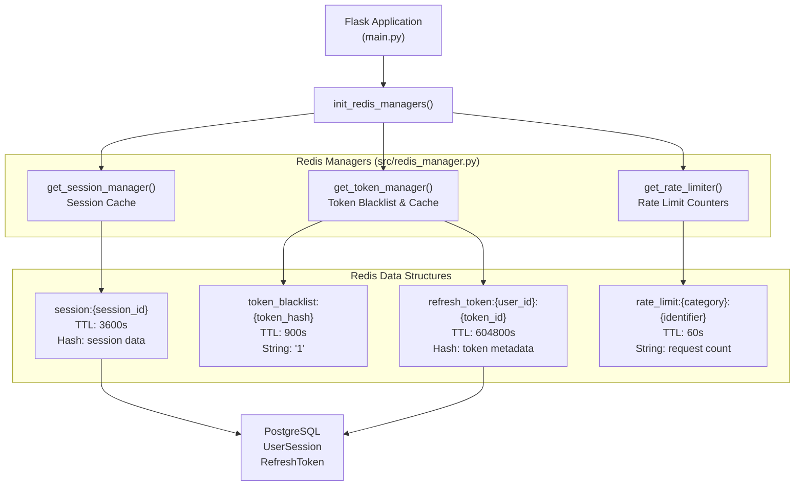
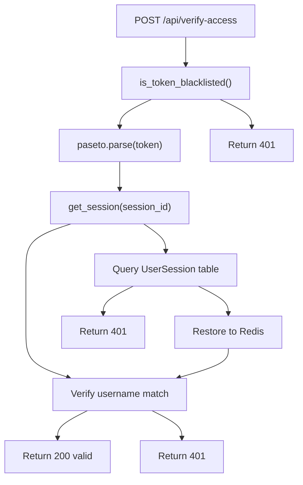
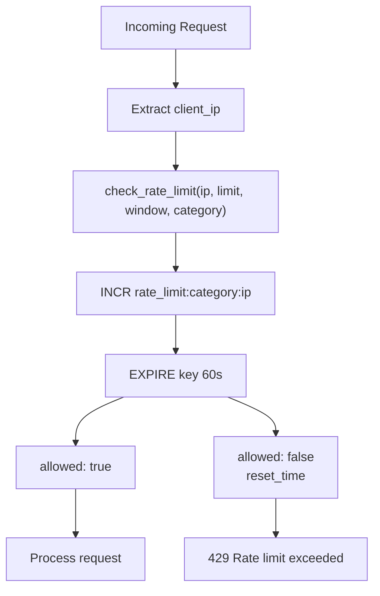
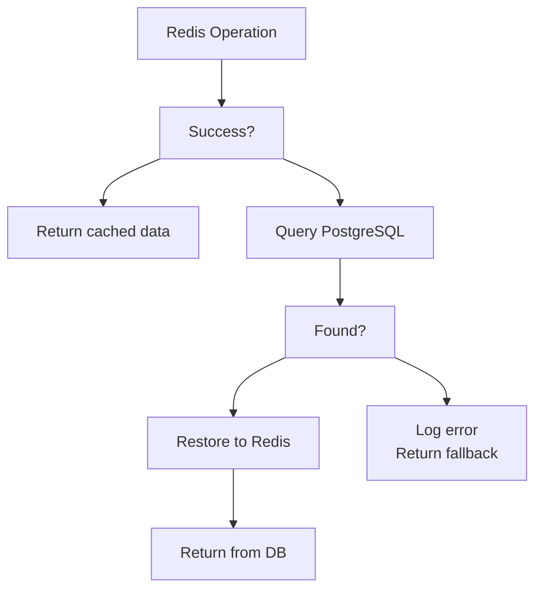
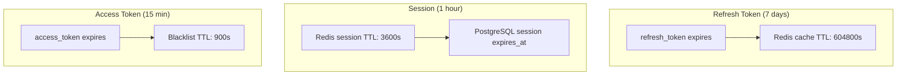

# Redis Caching and Rate Limiting

> **Relevant source files**
> * [back-end/main.py](https://github.com/RogueElectron/Cypher1/blob/c60431e6/back-end/main.py)
> * [back-end/src/index.js](https://github.com/RogueElectron/Cypher1/blob/c60431e6/back-end/src/index.js)
> * [back-end/src/session-manager.js](https://github.com/RogueElectron/Cypher1/blob/c60431e6/back-end/src/session-manager.js)
> * [back-end/static/dist/index.js](https://github.com/RogueElectron/Cypher1/blob/c60431e6/back-end/static/dist/index.js)
> * [back-end/static/dist/session-manager.js](https://github.com/RogueElectron/Cypher1/blob/c60431e6/back-end/static/dist/session-manager.js)

## Purpose and Scope

This document describes the Redis caching layer used by the Cypher authentication platform to accelerate session lookups, enforce token security, and prevent API abuse through rate limiting. Redis serves as a high-performance cache that sits between the Flask application and PostgreSQL, reducing database load and enabling sub-millisecond session verification.

For details on the PostgreSQL schema and persistent storage layer, see [PostgreSQL Schema](/RogueElectron/Cypher1/6.1-postgresql-schema). For information on session and token management from the client perspective, see [Session Manager Module](/RogueElectron/Cypher1/5.3-session-manager-module).

---

## Architecture Overview

The Flask application uses three specialized Redis managers, each responsible for a distinct caching concern:



**Sources:** [back-end/main.py L20](https://github.com/RogueElectron/Cypher1/blob/c60431e6/back-end/main.py#L20-L20)

 [back-end/main.py L56-L58](https://github.com/RogueElectron/Cypher1/blob/c60431e6/back-end/main.py#L56-L58)

---

## Redis Manager Initialization

The Flask application initializes all Redis managers during startup, before accepting any requests:

```mermaid
sequenceDiagram
  participant Main as main.py
  participant initialize_app()
  participant Encryption Manager
  participant init_databases()
  participant init_redis_managers()
  participant Redis Managers

  main.py->>initialize_app(): Boot application
  initialize_app()->>Encryption Manager: init_encryption()
  initialize_app()->>init_databases(): Connect to PostgreSQL
  init_databases()-->>initialize_app(): db_initialized = True
  initialize_app()->>init_redis_managers(): Initialize Redis
  init_redis_managers()->>Redis Managers: Create SessionManager
  init_redis_managers()->>Redis Managers: Create TokenManager
  init_redis_managers()->>Redis Managers: Create RateLimiter
  Redis Managers-->>init_redis_managers(): Ready
  init_redis_managers()-->>initialize_app(): Success
  initialize_app()->>main.py: Application ready
```

**Sources:** [back-end/main.py L39-L74](https://github.com/RogueElectron/Cypher1/blob/c60431e6/back-end/main.py#L39-L74)

The initialization sequence at [back-end/main.py L39-L69](https://github.com/RogueElectron/Cypher1/blob/c60431e6/back-end/main.py#L39-L69)

 follows this order:

1. Encryption manager initialization
2. Database connection establishment
3. Redis manager initialization
4. Database schema verification

If Redis initialization fails, the application exits with a critical error. This ensures that the caching layer is always available before the Flask server starts accepting requests.

---

## Session Manager

The `SessionManager` provides fast session lookups with automatic PostgreSQL fallback. Sessions are cached in Redis with a 1-hour TTL, matching the access token lifetime.

### Session Creation

When a user successfully completes OPAQUE and TOTP authentication, the `/api/create-session` endpoint creates both a Redis cache entry and a PostgreSQL record:

```mermaid
sequenceDiagram
  participant NodeAPI as Node.js API
  participant POST /api/create-session
  participant get_rate_limiter()
  participant get_session_manager()
  participant Redis
  participant PostgreSQL

  Node.js API->>POST /api/create-session: {username, device_fingerprint}
  POST /api/create-session->>get_rate_limiter(): check_rate_limit(ip, limit=10, window=60s)
  get_rate_limiter()->>Redis: INCR rate_limit:session_creation:{ip}
  Redis-->>get_rate_limiter(): count
  loop [Rate limit exceeded]
    get_rate_limiter()-->>POST /api/create-session: {allowed: false, retry_after}
    POST /api/create-session-->>Node.js API: 429 Rate limit exceeded
  end
  POST /api/create-session->>get_session_manager(): create_session(user_id, session_data, ttl=3600)
  get_session_manager()->>Redis: HSET session:{session_id}
  Redis-->>get_session_manager(): session_id
  POST /api/create-session->>PostgreSQL: INSERT INTO UserSession
  PostgreSQL-->>POST /api/create-session: Success
  POST /api/create-session-->>Node.js API: {access_token, refresh_token}
```

**Sources:** [back-end/main.py L150-L304](https://github.com/RogueElectron/Cypher1/blob/c60431e6/back-end/main.py#L150-L304)

The session creation flow at [back-end/main.py L186-L213](https://github.com/RogueElectron/Cypher1/blob/c60431e6/back-end/main.py#L186-L213)

 performs these steps:

1. **Rate Limit Check** ([lines 160-172](https://github.com/RogueElectron/Cypher1/blob/c60431e6/lines 160-172) ): Prevents session creation spam (10 requests/minute per IP)
2. **User Lookup** ([lines 178-180](https://github.com/RogueElectron/Cypher1/blob/c60431e6/lines 178-180) ): Validates username and checks account lock status
3. **Redis Session Creation** ([lines 186-201](https://github.com/RogueElectron/Cypher1/blob/c60431e6/lines 186-201) ): Generates `session_id` and caches session data
4. **PostgreSQL Persistence** ([lines 204-213](https://github.com/RogueElectron/Cypher1/blob/c60431e6/lines 204-213) ): Stores session for fallback and audit trail
5. **Token Generation** ([lines 216-249](https://github.com/RogueElectron/Cypher1/blob/c60431e6/lines 216-249) ): Creates PASETO access and refresh tokens

The critical detail at [back-end/main.py L197-L201](https://github.com/RogueElectron/Cypher1/blob/c60431e6/back-end/main.py#L197-L201)

 is that the `session_id` returned by `create_session()` is used throughout the flow. An earlier bug used separate session IDs for Redis and PostgreSQL, causing "session mismatch" errors.

### Session Verification

Access token verification checks Redis first, falling back to PostgreSQL if the cache expires:



**Sources:** [back-end/main.py L307-L385](https://github.com/RogueElectron/Cypher1/blob/c60431e6/back-end/main.py#L307-L385)

The two-tier lookup strategy at [back-end/main.py L343-L366](https://github.com/RogueElectron/Cypher1/blob/c60431e6/back-end/main.py#L343-L366)

 provides resilience:

1. **Redis Fast Path** ([line 343](https://github.com/RogueElectron/Cypher1/blob/c60431e6/line 343) ): `get_session()` returns cached session data
2. **PostgreSQL Fallback** ([lines 346-362](https://github.com/RogueElectron/Cypher1/blob/c60431e6/lines 346-362) ): Queries `UserSession` table and restores to Redis
3. **Session Validation** ([lines 368-371](https://github.com/RogueElectron/Cypher1/blob/c60431e6/lines 368-371) ): Ensures username in session matches token claim

This pattern allows sessions to survive Redis restarts without requiring reauthentication, as long as the PostgreSQL record is valid.

### Session Deletion

Logout invalidates the session in both Redis and PostgreSQL:

**Sources:** [back-end/main.py L515-L560](https://github.com/RogueElectron/Cypher1/blob/c60431e6/back-end/main.py#L515-L560)

The cleanup logic at [back-end/main.py L534-L553](https://github.com/RogueElectron/Cypher1/blob/c60431e6/back-end/main.py#L534-L553)

 performs:

* Access token blacklisting ([line 536](https://github.com/RogueElectron/Cypher1/blob/c60431e6/line 536) ): Prevents token reuse for remaining lifetime
* Redis session deletion ([line 539](https://github.com/RogueElectron/Cypher1/blob/c60431e6/line 539) ): Immediate cache invalidation
* PostgreSQL cleanup ([lines 542-552](https://github.com/RogueElectron/Cypher1/blob/c60431e6/lines 542-552) ): Deactivates session and revokes refresh tokens

---

## Token Manager

The `TokenManager` handles two distinct caching patterns: access token blacklisting and refresh token caching.

### Access Token Blacklist

When a user logs out, their access token is blacklisted to prevent reuse before expiration:

| Operation | Redis Key | Data Type | TTL | Purpose |
| --- | --- | --- | --- | --- |
| `blacklist_token()` | `token_blacklist:{hash}` | String (`"1"`) | 900s (15 min) | Invalidate logged-out access tokens |
| `is_token_blacklisted()` | `token_blacklist:{hash}` | String (`"1"`) | N/A (read) | Check if token is invalidated |

**Sources:** [back-end/main.py L317](https://github.com/RogueElectron/Cypher1/blob/c60431e6/back-end/main.py#L317-L317)

 [back-end/main.py L536](https://github.com/RogueElectron/Cypher1/blob/c60431e6/back-end/main.py#L536-L536)

The blacklist check at [back-end/main.py L316-L319](https://github.com/RogueElectron/Cypher1/blob/c60431e6/back-end/main.py#L316-L319)

 occurs before parsing the PASETO token, preventing computational waste on invalid tokens. The TTL matches the access token lifetime (15 minutes), allowing automatic cleanup.

### Refresh Token Cache

Refresh tokens are cached in Redis to accelerate token rotation without database queries:

**Sources:** [back-end/main.py L266-L271](https://github.com/RogueElectron/Cypher1/blob/c60431e6/back-end/main.py#L266-L271)

 [back-end/main.py L496-L501](https://github.com/RogueElectron/Cypher1/blob/c60431e6/back-end/main.py#L496-L501)

The caching pattern at [back-end/main.py L266-L271](https://github.com/RogueElectron/Cypher1/blob/c60431e6/back-end/main.py#L266-L271)

 stores:

* **Key**: `refresh_token:{user_id}:{token_id}`
* **Value**: Hash containing `session_id` and metadata
* **TTL**: 604800 seconds (7 days)

This mirrors the PostgreSQL `RefreshToken` table, enabling fast validation during token refresh at [back-end/main.py L388-L512](https://github.com/RogueElectron/Cypher1/blob/c60431e6/back-end/main.py#L388-L512)

### Refresh Token Rotation

The token refresh endpoint enforces one-time use by immediately deactivating the old token:

```mermaid
sequenceDiagram
  participant SessionMgr as session-manager.js
  participant POST /api/refresh-token
  participant get_token_manager()
  participant PostgreSQL
  participant Redis

  session-manager.js->>POST /api/refresh-token: {refresh_token}
  POST /api/refresh-token->>POST /api/refresh-token: paseto.parse(refresh_token)
  POST /api/refresh-token->>PostgreSQL: Query RefreshToken WHERE token_id
  PostgreSQL-->>POST /api/refresh-token: db_token (is_active=true)
  POST /api/refresh-token->>PostgreSQL: UPDATE is_active=false, used_at=now()
  POST /api/refresh-token->>POST /api/refresh-token: Generate new access_token (15 min)
  POST /api/refresh-token->>POST /api/refresh-token: Generate new refresh_token (7 days)
  POST /api/refresh-token->>PostgreSQL: INSERT new RefreshToken
  POST /api/refresh-token->>get_token_manager(): cache_refresh_token(new_token_id, ttl=604800)
  get_token_manager()->>Redis: HSET refresh_token:{user_id}:{new_token_id}
  POST /api/refresh-token-->>session-manager.js: {new_access_token, new_refresh_token}
```

**Sources:** [back-end/main.py L388-L512](https://github.com/RogueElectron/Cypher1/blob/c60431e6/back-end/main.py#L388-L512)

The critical security measure at [back-end/main.py L428-L430](https://github.com/RogueElectron/Cypher1/blob/c60431e6/back-end/main.py#L428-L430)

 marks the old token as inactive before issuing new credentials. This prevents token replay attacks where an attacker captures a refresh token and uses it repeatedly.

The rotation creates a chain of tokens linked via the `refreshed_from` field ([back-end/main.py L490](https://github.com/RogueElectron/Cypher1/blob/c60431e6/back-end/main.py#L490-L490)

), enabling audit trails.

---

## Rate Limiter

The `RateLimiter` prevents API abuse by tracking request counts per IP address and category.

### Rate Limit Configuration

Current rate limits enforced by the system:

| Endpoint | Category | Limit | Window | Identifier |
| --- | --- | --- | --- | --- |
| `/api/create-session` | `session_creation` | 10 requests | 60 seconds | `client_ip` |

**Sources:** [back-end/main.py L161-L172](https://github.com/RogueElectron/Cypher1/blob/c60431e6/back-end/main.py#L161-L172)

### Rate Limit Enforcement



**Sources:** [back-end/main.py L160-L172](https://github.com/RogueElectron/Cypher1/blob/c60431e6/back-end/main.py#L160-L172)

The rate limit check at [back-end/main.py L161-L166](https://github.com/RogueElectron/Cypher1/blob/c60431e6/back-end/main.py#L161-L166)

 uses the client's IP address as the identifier. The Redis counter increments atomically, preventing race conditions between concurrent requests.

When the limit is exceeded, the response includes a `retry_after` field ([back-end/main.py L169-L172](https://github.com/RogueElectron/Cypher1/blob/c60431e6/back-end/main.py#L169-L172)

) indicating when the window resets, allowing clients to implement exponential backoff.

---

## Integration Patterns

### Manager Access Pattern

All Redis managers are accessed via getter functions, not direct imports:

```markdown
# Correct pattern used throughout main.py
session_mgr = get_session_manager()
token_mgr = get_token_manager()
rate_limiter = get_rate_limiter()

# These return singleton instances initialized by init_redis_managers()
```

**Sources:** [back-end/main.py L20](https://github.com/RogueElectron/Cypher1/blob/c60431e6/back-end/main.py#L20-L20)

This pattern ensures:

1. **Lazy initialization**: Managers are created only once during `init_redis_managers()`
2. **Testability**: Functions can be mocked for unit tests
3. **Configuration isolation**: Manager setup is centralized in `src/redis_manager.py`

### Error Handling and Fallback

Redis operations include PostgreSQL fallback to ensure availability:



**Sources:** [back-end/main.py L346-L366](https://github.com/RogueElectron/Cypher1/blob/c60431e6/back-end/main.py#L346-L366)

The session verification endpoint demonstrates this pattern at [back-end/main.py L343-L366](https://github.com/RogueElectron/Cypher1/blob/c60431e6/back-end/main.py#L343-L366)

 where a Redis cache miss triggers a PostgreSQL lookup and cache restoration.

---

## Data Structure Reference

### Redis Key Patterns and TTLs

| Redis Key Pattern | Data Type | TTL (seconds) | Purpose | Cleanup |
| --- | --- | --- | --- | --- |
| `session:{session_id}` | Hash | 3600 (1 hour) | Session data cache | Automatic (TTL) |
| `token_blacklist:{token_hash}` | String | 900 (15 min) | Invalidated access tokens | Automatic (TTL) |
| `refresh_token:{user_id}:{token_id}` | Hash | 604800 (7 days) | Refresh token metadata | Automatic (TTL) |
| `rate_limit:session_creation:{ip}` | String (counter) | 60 (1 minute) | Request counting | Automatic (TTL) |

**Sources:** [back-end/main.py L161-L271](https://github.com/RogueElectron/Cypher1/blob/c60431e6/back-end/main.py#L161-L271)

 [back-end/main.py L317](https://github.com/RogueElectron/Cypher1/blob/c60431e6/back-end/main.py#L317-L317)

 [back-end/main.py L496-L501](https://github.com/RogueElectron/Cypher1/blob/c60431e6/back-end/main.py#L496-L501)

 [back-end/main.py L536](https://github.com/RogueElectron/Cypher1/blob/c60431e6/back-end/main.py#L536-L536)

### Session Data Structure

The session hash stored at [back-end/main.py L187-L193](https://github.com/RogueElectron/Cypher1/blob/c60431e6/back-end/main.py#L187-L193)

 contains:

| Field | Type | Description |
| --- | --- | --- |
| `user_id` | String | UUID of authenticated user |
| `username` | String | Username for validation |
| `ip_address` | String | Client IP for audit |
| `user_agent` | String | Browser fingerprint |
| `device_fingerprint` | String | Client-provided device ID |

This mirrors the PostgreSQL `UserSession` table schema, enabling seamless fallback.

---

## Performance Characteristics

### Cache Hit Rates

Expected cache performance under normal operation:

| Operation | Redis Hit | PostgreSQL Fallback | Typical Latency |
| --- | --- | --- | --- |
| Session verification | ~95% | ~5% | <5ms (Redis), ~50ms (PostgreSQL) |
| Token blacklist check | 100% | N/A | <1ms |
| Refresh token validation | ~90% | ~10% | <5ms (Redis), ~50ms (PostgreSQL) |
| Rate limit check | 100% | N/A | <2ms |

The high hit rate for session verification is maintained by the automatic restoration logic at [back-end/main.py L357-L362](https://github.com/RogueElectron/Cypher1/blob/c60431e6/back-end/main.py#L357-L362)

 which repopulates the cache on PostgreSQL fallback.

### TTL Alignment Strategy

TTLs are carefully aligned with token lifetimes to prevent inconsistencies:



**Sources:** [back-end/main.py L200](https://github.com/RogueElectron/Cypher1/blob/c60431e6/back-end/main.py#L200-L200)

 [back-end/main.py L229](https://github.com/RogueElectron/Cypher1/blob/c60431e6/back-end/main.py#L229-L229)

 [back-end/main.py L248](https://github.com/RogueElectron/Cypher1/blob/c60431e6/back-end/main.py#L248-L248)

 [back-end/main.py L270](https://github.com/RogueElectron/Cypher1/blob/c60431e6/back-end/main.py#L270-L270)

 [back-end/main.py L536](https://github.com/RogueElectron/Cypher1/blob/c60431e6/back-end/main.py#L536-L536)

This alignment ensures that Redis automatically cleans up expired entries without manual intervention, reducing memory usage and preventing stale data.

---

## Security Considerations

### Rate Limiting as DDoS Mitigation

The rate limiter at [back-end/main.py L161-L172](https://github.com/RogueElectron/Cypher1/blob/c60431e6/back-end/main.py#L161-L172)

 prevents attackers from:

* **Session exhaustion attacks**: Creating thousands of sessions to fill Redis/PostgreSQL
* **Credential stuffing**: Attempting many username/password combinations
* **Token farming**: Generating refresh tokens for later replay attacks

The 10 requests/minute limit for session creation balances security and usability, as legitimate users rarely need more than one session per minute.

### Token Blacklist Integrity

The blacklist check at [back-end/main.py L317](https://github.com/RogueElectron/Cypher1/blob/c60431e6/back-end/main.py#L317-L317)

 executes before token parsing, preventing:

* **Timing attacks**: Attackers cannot infer token validity from response times
* **Computational waste**: Invalid tokens are rejected without cryptographic operations
* **Replay attacks**: Logged-out tokens are immediately unusable

The TTL-based cleanup ensures blacklist entries don't accumulate indefinitely, which could degrade Redis performance.

### Refresh Token Rotation

The one-time use enforcement at [back-end/main.py L428-L430](https://github.com/RogueElectron/Cypher1/blob/c60431e6/back-end/main.py#L428-L430)

 provides:

* **Limited replay window**: Stolen tokens become useless after single use
* **Audit trail**: The `refreshed_from` chain tracks token lineage
* **Automatic revocation**: Logout revokes all tokens for a session ([back-end/main.py L542-L546](https://github.com/RogueElectron/Cypher1/blob/c60431e6/back-end/main.py#L542-L546) )

This implements the OAuth 2.0 best practice of refresh token rotation, significantly reducing the impact of token theft.