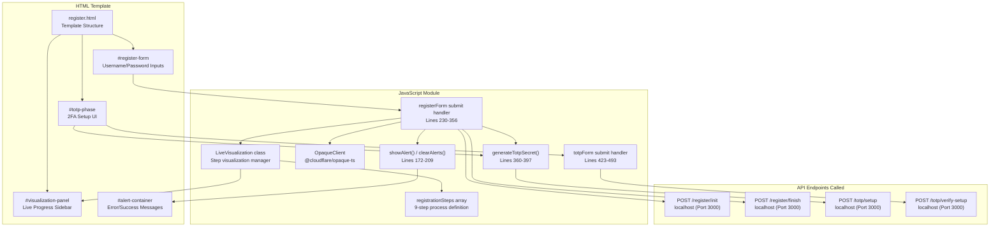
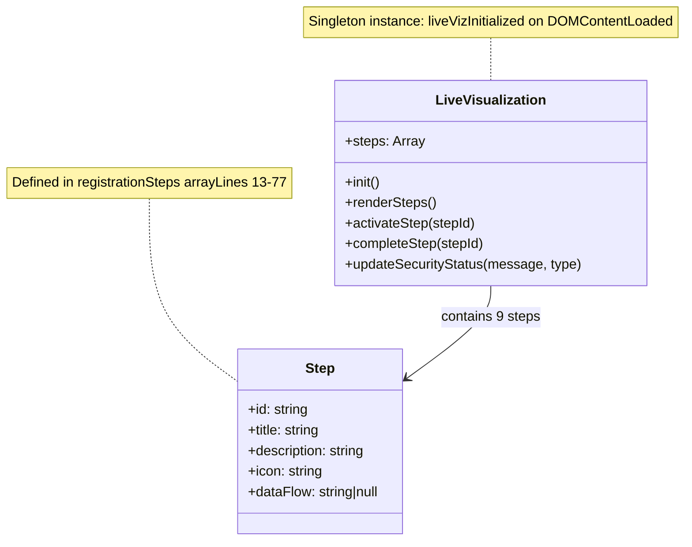
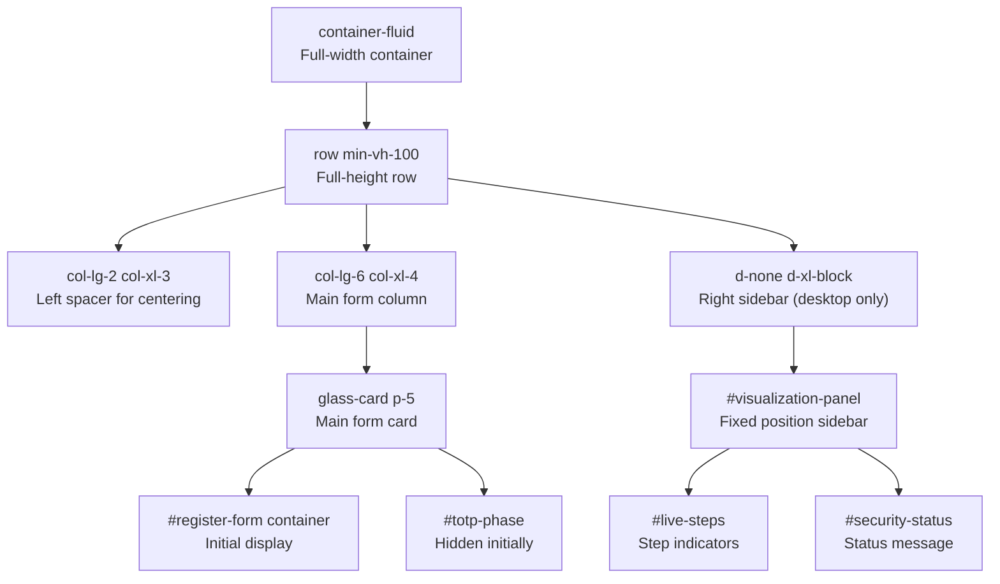

# Registration Flow (Client-Side)

> **Relevant source files**
> * [back-end/src/register.js](https://github.com/RogueElectron/Cypher1/blob/c60431e6/back-end/src/register.js)
> * [back-end/static/dist/register.js](https://github.com/RogueElectron/Cypher1/blob/c60431e6/back-end/static/dist/register.js)
> * [back-end/templates/login.html](https://github.com/RogueElectron/Cypher1/blob/c60431e6/back-end/templates/login.html)
> * [back-end/templates/register.html](https://github.com/RogueElectron/Cypher1/blob/c60431e6/back-end/templates/register.html)

## Purpose and Scope

This document provides a detailed technical walkthrough of the client-side registration process, focusing on the JavaScript implementation that orchestrates OPAQUE protocol operations and TOTP two-factor authentication setup. The registration flow is implemented in [back-end/src/register.js](https://github.com/RogueElectron/Cypher1/blob/c60431e6/back-end/src/register.js)

 and rendered through [back-end/templates/register.html](https://github.com/RogueElectron/Cypher1/blob/c60431e6/back-end/templates/register.html)

**Related Pages:**

* For server-side registration endpoints (Node.js API), see [4.2](/RogueElectron/Cypher1/4.2-node.js-internal-api)
* For OPAQUE protocol details and cryptographic foundations, see [3.1](/RogueElectron/Cypher1/3.1-opaque-protocol-implementation)
* For TOTP setup mechanics, see [3.2](/RogueElectron/Cypher1/3.2-totp-two-factor-authentication)
* For the client-side login flow, see [5.2](/RogueElectron/Cypher1/5.2-login-flow-(client-side))

---

## Registration Flow Overview

The registration process executes in two distinct phases orchestrated entirely from the client side:

**Phase 1: OPAQUE Password Registration**

* Client-side password blinding using `OpaqueClient.registerInit()`
* Server-side OPAQUE record generation via `/register/init` and `/register/finish` endpoints
* No plaintext password transmission

**Phase 2: TOTP Two-Factor Setup**

* TOTP secret generation via `/totp/setup` endpoint
* QR code display for authenticator app enrollment
* Code verification via `/totp/verify-setup` endpoint

The entire workflow is managed by a single-page application that transitions between form states without page reloads.

**Sources:** [back-end/src/register.js L1-L508](https://github.com/RogueElectron/Cypher1/blob/c60431e6/back-end/src/register.js#L1-L508)

---

## Component Architecture

The following diagram maps the client-side registration components to their code entities:



**Sources:** [back-end/src/register.js L1-L508](https://github.com/RogueElectron/Cypher1/blob/c60431e6/back-end/src/register.js#L1-L508)

 [back-end/templates/register.html L1-L269](https://github.com/RogueElectron/Cypher1/blob/c60431e6/back-end/templates/register.html#L1-L269)

---

## Registration Workflow Sequence

The following sequence diagram details the complete registration flow with precise API endpoint references:

```mermaid
sequenceDiagram
  participant User
  participant Browser
  participant Register as register.js
  participant LiveVisualization
  participant instance
  participant OpaqueClient
  participant @cloudflare/opaque-ts
  participant NodeAPI as Node.js API

  note over User, NodeAPI: Phase 1: Password Registration (OPAQUE Protocol)
  User->>Browser: Enter username, password, confirm_password
  Browser->>Browser: validatePasswords()
  Browser->>LiveVisualization: Check length >= 8
  Browser->>LiveVisualization: activateStep("validation")
  Browser->>OpaqueClient: activateStep("generate-keys")
  OpaqueClient-->>Browser: registerInit(password)
  Browser->>LiveVisualization: {request, serialize()}
  Browser->>LiveVisualization: completeStep("generate-keys")
  Browser->>NodeAPI: activateStep("registration-request")
  NodeAPI-->>Browser: POST /register/init
  Browser->>LiveVisualization: {username, registrationRequest}
  Browser->>LiveVisualization: {registrationResponse}
  Browser->>OpaqueClient: completeStep("registration-request")
  Browser->>LiveVisualization: activateStep("server-response")
  Browser->>LiveVisualization: RegistrationResponse.deserialize()
  Browser->>OpaqueClient: completeStep("server-response")
  OpaqueClient-->>Browser: activateStep("finalize")
  Browser->>LiveVisualization: registerFinish(deSerRegResponse)
  Browser->>NodeAPI: {record.serialize()}
  NodeAPI-->>Browser: completeStep("finalize")
  note over User, NodeAPI: Phase 2: TOTP Two-Factor Setup
  Browser->>Browser: POST /register/finish
  Browser->>LiveVisualization: {username, record}
  Browser->>Browser: {success: true}
  Browser->>NodeAPI: Switch UI:
  NodeAPI-->>Browser: hide
  Browser->>Browser: activateStep("totp-setup")
  Browser->>Browser: generateTotpSecret()
  User->>Browser: POST /totp/setup
  User->>Browser: {username}
  Browser->>LiveVisualization: {secret, qrCode, otpauthUrl}
  Browser->>NodeAPI: displayServerQrCode()
  NodeAPI-->>Browser: Store window.currentUsername
  Browser->>LiveVisualization: Scan QR code with authenticator app
  Browser->>Browser: Enter 6-digit TOTP code
```

**Sources:** [back-end/src/register.js L230-L493](https://github.com/RogueElectron/Cypher1/blob/c60431e6/back-end/src/register.js#L230-L493)

---

## Phase 1: OPAQUE Password Registration

### OPAQUE Configuration and Initialization

The registration module imports and configures the OPAQUE protocol using the P-256 elliptic curve:

```javascript
// Lines 3-11
import { 
  OpaqueClient,
  getOpaqueConfig,
  OpaqueID,
  RegistrationResponse
} from '@cloudflare/opaque-ts';

const cfg = getOpaqueConfig(OpaqueID.OPAQUE_P256);
```

**Sources:** [back-end/src/register.js L3-L11](https://github.com/RogueElectron/Cypher1/blob/c60431e6/back-end/src/register.js#L3-L11)

### Form Submission and Password Validation

The registration form handler performs client-side validation before initiating OPAQUE:

| Validation Check | Implementation | Error Message |
| --- | --- | --- |
| **All fields present** | `!username \|\| !password \|\| !confirmPassword` | "Please fill in all fields!" |
| **Passwords match** | `password !== confirmPassword` | "Passwords do not match!" |
| **Minimum length** | `password.length < 8` | "Password must be at least 8 characters long!" |

**Sources:** [back-end/src/register.js L237-L254](https://github.com/RogueElectron/Cypher1/blob/c60431e6/back-end/src/register.js#L237-L254)

 [back-end/src/register.js L211-L221](https://github.com/RogueElectron/Cypher1/blob/c60431e6/back-end/src/register.js#L211-L221)

### OPAQUE Registration Initialization

The client generates cryptographic blinding material without transmitting the plaintext password:

```javascript
// Lines 261-268
liveViz.activateStep('generate-keys');
liveViz.updateSecurityStatus('Generating cryptographic blinding - your password stays secure');

const client = new OpaqueClient(cfg);
const request = await client.registerInit(password);
const serRequest = request.serialize();
```

The serialized blinded request is then sent to the Node.js API:

```javascript
// Lines 271-284
const response = await fetch('http://localhost:3000/register/init', {
    method: 'POST',
    headers: {
        'Content-Type': 'application/json',
    },
    body: JSON.stringify({
        username: username,
        registrationRequest: serRequest
    })
});
```

**Sources:** [back-end/src/register.js L261-L284](https://github.com/RogueElectron/Cypher1/blob/c60431e6/back-end/src/register.js#L261-L284)

### OPAQUE Registration Finalization

The server's response is deserialized and used to complete the OPAQUE protocol:

```javascript
// Lines 296-308
const { registrationResponse } = await response.json();
const deSerRegResponse = RegistrationResponse.deserialize(cfg, registrationResponse);

liveViz.activateStep('finalize');
liveViz.updateSecurityStatus('Creating your secure credential file locally');

const rec = await client.registerFinish(deSerRegResponse);
const record = rec.record;
const serRec = record.serialize();
```

The final OPAQUE record is then transmitted to the server for storage:

```javascript
// Lines 312-321
const finishResponse = await fetch('http://localhost:3000/register/finish', {
    method: 'POST',
    headers: {
        'Content-Type': 'application/json'
    },
    body: JSON.stringify({
        username: username,
        record: serRec
    })
});
```

**Sources:** [back-end/src/register.js L296-L327](https://github.com/RogueElectron/Cypher1/blob/c60431e6/back-end/src/register.js#L296-L327)

---

## Phase 2: TOTP Two-Factor Setup

### UI Transition

Upon successful OPAQUE registration, the form transitions from password entry to TOTP setup:

```
// Lines 332-343
if (finishResult.success) {
    liveViz.activateStep('totp-setup');
    liveViz.updateSecurityStatus('OPAQUE registration complete! Now setting up 2FA...');
    
    // Switch UI states
    document.getElementById('register-form').parentElement.style.display = 'none';
    document.getElementById('totp-phase').style.display = 'block';
    document.getElementById('back-link').style.display = 'none';
    
    generateTotpSecret();
}
```

**Sources:** [back-end/src/register.js L330-L343](https://github.com/RogueElectron/Cypher1/blob/c60431e6/back-end/src/register.js#L330-L343)

### TOTP Secret Generation and QR Code Display

The `generateTotpSecret()` function requests a new TOTP secret from the server:

// Lines 360-396
async function generateTotpSecret() {
    const username = document.getElementById('username').value;
    
    const response = await fetch('http://localhost:3000/totp/setup', {
        method: 'POST',
        headers: {
            'Content-Type': 'application/json'
        },
        body: JSON.stringify({ username })
    });
    
    const result = await response.json();
    
    // Display secret for manual entry
    document.getElementById('totp-secret').textContent = result.secret;
    
    // Store username for verification
    window.currentUsername = username;
    
    // Display QR code
    displayServerQrCode(result.qrCode, result.otpauthUrl);
}
```

The QR code is rendered using a server-generated data URL:

```javascript
// Lines 399-415
function displayServerQrCode(qrCodeDataURL, otpauthUrl) {
    const qrContainer = document.getElementById('qr-code');
    qrContainer.innerHTML = `
        <div class="text-center p-4" style="background: rgba(255,255,255,0.1); border-radius: 8px;">
            <div class="mb-3">
                
            </div>
            <small class="text-secondary">Scan with Google Authenticator, Authy, or similar app</small>
            <div class="mt-2">
                <small class="text-muted">Or copy this URI:</small>
                <div class="mt-1">
                    <input type="text" class="form-control form-control-sm" value="${otpauthUrl}" readonly onclick="this.select()" style="font-size: 10px;">
                </div>
            </div>
        </div>
    `;
}
```

**Sources:** [back-end/src/register.js L360-L415](https://github.com/RogueElectron/Cypher1/blob/c60431e6/back-end/src/register.js#L360-L415)

### TOTP Code Verification

The verification form handler validates the user's authenticator app setup:

```javascript
// Lines 423-493
const totpForm = document.getElementById('totp-verify-form');
totpForm.addEventListener('submit', async (event) => {
    event.preventDefault();
    
    const formData = new FormData(totpForm);
    const totpCode = formData.get('totp_code');
    
    // Validate 6-digit code format
    if (!totpCode || totpCode.length !== 6) {
        showAlert('Please enter a valid 6-digit code!', 'error');
        return;
    }
    
    const username = window.currentUsername;
    
    // Verify code with server
    const verifyResponse = await fetch('http://localhost:3000/totp/verify-setup', {
        method: 'POST',
        headers: {
            'Content-Type': 'application/json'
        },
        body: JSON.stringify({
            username,
            token: totpCode
        })
    });
    
    const verifyResult = await verifyResponse.json();
    
    if (verifyResponse.ok && verifyResult.success) {
        liveViz.activateStep('success');
        liveViz.updateSecurityStatus('Registration complete! Account secured with 2FA.');
        showAlert('Registration complete! You can now log in with your credentials and 2FA.', 'success', 'totp-alert-container');
        
        setTimeout(() => {
            window.location.href = '/api/login';
        }, 2000);
    }
});
```

**Input restriction** ensures only numeric codes are accepted:

```javascript
// Lines 496-507
const totpInput = document.getElementById('totp-code');
totpInput.addEventListener('input', () => {
    totpInput.value = totpInput.value.replace(/[^0-9]/g, '');
    
    if (totpInput.value.length > 6) {
        totpInput.value = totpInput.value.slice(0, 6);
    }
});
```

**Sources:** [back-end/src/register.js L423-L507](https://github.com/RogueElectron/Cypher1/blob/c60431e6/back-end/src/register.js#L423-L507)

---

## Live Visualization System

### LiveVisualization Class

The `LiveVisualization` class provides real-time visual feedback throughout the registration process:



**Sources:** [back-end/src/register.js L80-L147](https://github.com/RogueElectron/Cypher1/blob/c60431e6/back-end/src/register.js#L80-L147)

### Registration Step Definitions

The complete registration process is defined as 9 sequential steps:

| Step ID | Title | Description | Icon | Data Flow |
| --- | --- | --- | --- | --- |
| `input` | Password Input | Your password is entered locally and never transmitted | `bi-keyboard` | null |
| `validation` | Input Validation | Validating password strength and confirmation | `bi-check-circle` | null |
| `generate-keys` | Generate Keys | Creating cryptographic keypair for secure registration | `bi-cpu` | null |
| `registration-request` | Registration Request | Sending encrypted registration data to server | `bi-arrow-up-circle` | "Registration Request → Server" |
| `server-response` | Server Response | Server processing registration with OPAQUE protocol | `bi-server` | "Registration Response ← Server" |
| `finalize` | Finalize Registration | Completing OPAQUE protocol and storing credentials | `bi-shield-check` | null |
| `totp-setup` | 2FA Setup | Configuring time-based authentication | `bi-shield-lock` | null |
| `totp-verify` | Verify 2FA | Confirming TOTP code functionality | `bi-check-circle-fill` | null |
| `success` | Registration Complete | Account created successfully with 2FA enabled | `bi-check-circle-fill` | null |

**Sources:** [back-end/src/register.js L13-L77](https://github.com/RogueElectron/Cypher1/blob/c60431e6/back-end/src/register.js#L13-L77)

### Step State Management

The `activateStep()` method manages visual states across all steps:

```javascript
// Lines 108-123
activateStep(stepId) {
    const currentIndex = this.steps.findIndex(step => step.id === stepId);
    
    // Update all step states in one pass
    this.steps.forEach((step, index) => {
        const element = document.getElementById(`step-${step.id}`);
        if (element) {
            element.className = element.className.replace(/\b(active|processing|completed)\b/g, '').trim();
            if (index < currentIndex) {
                element.classList.add('completed');
            } else if (index === currentIndex) {
                element.classList.add('active');
            }
        }
    });
}
```

**CSS classes applied:**

* `.active`: Currently executing step (blue border: `#667eea`)
* `.completed`: Already finished step (cyan border: `#4facfe`)
* `.processing`: Step in progress with animation (red border: `#f5576c`)

**Sources:** [back-end/src/register.js L108-L131](https://github.com/RogueElectron/Cypher1/blob/c60431e6/back-end/src/register.js#L108-L131)

 [back-end/templates/register.html L150-L186](https://github.com/RogueElectron/Cypher1/blob/c60431e6/back-end/templates/register.html#L150-L186)

---

## Alert and Notification System

### Alert Display Function

The `showAlert()` function creates Bootstrap-styled alerts:

```typescript
// Lines 172-198
function showAlert(message, type = 'success', containerId = 'alert-container') {
    const alertContainer = document.getElementById(containerId);
    const alertClass = type === 'success' ? 'alert-success' : 'alert-danger';
    const iconClass = type === 'success' ? 'bi-check-circle-fill' : 'bi-exclamation-triangle-fill';
    
    alertContainer.innerHTML = `
        <div class="alert ${alertClass} alert-dismissible fade show" role="alert">
            <i class="${iconClass} me-2"></i>
            ${message}
            <button type="button" class="btn-close" data-bs-dismiss="alert" aria-label="Close"></button>
        </div>
    `;
    
    // Auto-dismiss success messages after 5 seconds
    if (type === 'success') {
        setTimeout(() => {
            const alert = alertContainer.querySelector('.alert');
            if (alert) {
                const bsAlert = new bootstrap.Alert(alert);
                bsAlert.close();
            }
        }, 5000);
    }
}
```

**Alert containers used:**

* `#alert-container`: Primary alerts during password registration phase
* `#totp-alert-container`: Alerts during TOTP verification phase

**Sources:** [back-end/src/register.js L172-L209](https://github.com/RogueElectron/Cypher1/blob/c60431e6/back-end/src/register.js#L172-L209)

---

## UI Component Structure

### HTML Template Layout

The registration page uses a three-column responsive layout:



**Sources:** [back-end/templates/register.html L10-L126](https://github.com/RogueElectron/Cypher1/blob/c60431e6/back-end/templates/register.html#L10-L126)

### Form Elements

**Password Registration Form:**

```sql
<!-- Lines 26-42 -->
<form id="register-form" action="javascript:void(0);" method="post">
    <div class="mb-4">
        <label for="username" class="form-label">Username</label>
        <input type="text" class="form-control" id="username" name="username" required>
    </div>
    <div class="mb-4">
        <label for="password" class="form-label">Password</label>
        <input type="password" class="form-control" id="password" name="password" required>
    </div>
    <div class="mb-4">
        <label for="confirm_password" class="form-label">Confirm Password</label>
        <input type="password" class="form-control" id="confirm_password" name="confirm_password" required>
    </div>
    <div class="d-grid mb-4">
        <button type="submit" class="btn btn-primary btn-lg">Create Account</button>
    </div>
</form>
```

**TOTP Verification Form:**

```python
<!-- Lines 69-80 -->
<form id="totp-verify-form" action="javascript:void(0);" method="post">
    <div class="mb-4">
        <label for="totp-code" class="form-label">enter verification code</label>
        <input type="text" class="form-control text-center" id="totp-code" name="totp_code" 
               placeholder="000000" maxlength="6" pattern="[0-9]{6}" required>
        <small class="text-secondary">enter the 6-digit code from your app</small>
    </div>
    
    <button type="submit" class="btn btn-primary w-100">
        <i class="bi bi-shield-check me-2"></i>complete registration
    </button>
</form>
```

**Sources:** [back-end/templates/register.html L26-L80](https://github.com/RogueElectron/Cypher1/blob/c60431e6/back-end/templates/register.html#L26-L80)

### Sidebar Toggle Functionality

The visualization sidebar can be collapsed on desktop devices:

```javascript
// Lines 153-169
function initSidebarToggle() {
    const hideBtn = document.getElementById('hide-sidebar');
    const showBtn = document.getElementById('show-sidebar');
    const panel = document.getElementById('visualization-panel');
    
    if (hideBtn && showBtn && panel) {
        hideBtn.addEventListener('click', () => {
            panel.classList.add('hidden');
            showBtn.style.display = 'block';
        });
        
        showBtn.addEventListener('click', () => {
            panel.classList.remove('hidden');
            showBtn.style.display = 'none';
        });
    }
}
```

The `.hidden` class applies a CSS transform:

```
/* Line 147 */
.visualization-sidebar.hidden {
    transform: translateX(320px);
}
```

**Sources:** [back-end/src/register.js L153-L169](https://github.com/RogueElectron/Cypher1/blob/c60431e6/back-end/src/register.js#L153-L169)

 [back-end/templates/register.html L146-L148](https://github.com/RogueElectron/Cypher1/blob/c60431e6/back-end/templates/register.html#L146-L148)

---

## Error Handling and Recovery

### Error Scenarios

The registration flow handles multiple error conditions:

| Error Type | Detection Point | User Feedback | Recovery Action |
| --- | --- | --- | --- |
| **Empty fields** | Form submission | "Please fill in all fields!" | User corrects input |
| **Password mismatch** | `validatePasswords()` | "Passwords do not match!" | User re-enters password |
| **Short password** | `validatePasswords()` | "Password must be at least 8 characters long!" | User creates longer password |
| **OPAQUE init failure** | `/register/init` response | "Registration failed: [error]" | User retries registration |
| **OPAQUE finish failure** | `/register/finish` response | "Registration completion failed" | User retries registration |
| **TOTP setup failure** | `/totp/setup` response | "TOTP setup failed: [error]" | User refreshes and restarts |
| **Invalid TOTP code** | `/totp/verify-setup` response | "2FA verification failed: Invalid code" | User enters new code from app |
| **Missing username** | TOTP verification | "Username not found. Please restart registration." | User must restart registration |

**Sources:** [back-end/src/register.js L211-L221](https://github.com/RogueElectron/Cypher1/blob/c60431e6/back-end/src/register.js#L211-L221)

 [back-end/src/register.js L242-L254](https://github.com/RogueElectron/Cypher1/blob/c60431e6/back-end/src/register.js#L242-L254)

 [back-end/src/register.js L286-L289](https://github.com/RogueElectron/Cypher1/blob/c60431e6/back-end/src/register.js#L286-L289)

 [back-end/src/register.js L323-L326](https://github.com/RogueElectron/Cypher1/blob/c60431e6/back-end/src/register.js#L323-L326)

 [back-end/src/register.js L392-L395](https://github.com/RogueElectron/Cypher1/blob/c60431e6/back-end/src/register.js#L392-L395)

 [back-end/src/register.js L469-L474](https://github.com/RogueElectron/Cypher1/blob/c60431e6/back-end/src/register.js#L469-L474)

### Button State Management

Submit buttons are disabled during async operations to prevent double-submission:

```javascript
// Lines 255-258, 353-354
const submitButton = registerForm.querySelector('button[type="submit"]');
const originalText = submitButton.textContent;
submitButton.disabled = true;
submitButton.innerHTML = '<span class="spinner-border spinner-border-sm me-2" role="status"></span>Registering...';

// ... async operations ...

submitButton.disabled = false;
submitButton.textContent = originalText;
```

**Sources:** [back-end/src/register.js L255-L258](https://github.com/RogueElectron/Cypher1/blob/c60431e6/back-end/src/register.js#L255-L258)

 [back-end/src/register.js L353-L354](https://github.com/RogueElectron/Cypher1/blob/c60431e6/back-end/src/register.js#L353-L354)

 [back-end/src/register.js L439-L442](https://github.com/RogueElectron/Cypher1/blob/c60431e6/back-end/src/register.js#L439-L442)

 [back-end/src/register.js L488-L490](https://github.com/RogueElectron/Cypher1/blob/c60431e6/back-end/src/register.js#L488-L490)

---

## API Endpoint Summary

### Registration Endpoints

| Endpoint | Method | Request Body | Response | Purpose |
| --- | --- | --- | --- | --- |
| `/register/init` | POST | `{username, registrationRequest}` | `{registrationResponse}` | OPAQUE protocol initialization |
| `/register/finish` | POST | `{username, record}` | `{success: boolean}` | OPAQUE record storage |

### TOTP Endpoints

| Endpoint | Method | Request Body | Response | Purpose |
| --- | --- | --- | --- | --- |
| `/totp/setup` | POST | `{username}` | `{secret, qrCode, otpauthUrl}` | Generate TOTP secret and QR code |
| `/totp/verify-setup` | POST | `{username, token}` | `{success: boolean, error?}` | Verify TOTP code during setup |

**All endpoints target:** `http://localhost (Port 3000)`

**Sources:** [back-end/src/register.js L275-L284](https://github.com/RogueElectron/Cypher1/blob/c60431e6/back-end/src/register.js#L275-L284)

 [back-end/src/register.js L312-L321](https://github.com/RogueElectron/Cypher1/blob/c60431e6/back-end/src/register.js#L312-L321)

 [back-end/src/register.js L365-L371](https://github.com/RogueElectron/Cypher1/blob/c60431e6/back-end/src/register.js#L365-L371)

 [back-end/src/register.js L456-L465](https://github.com/RogueElectron/Cypher1/blob/c60431e6/back-end/src/register.js#L456-L465)

---

## Security Properties

### Zero-Knowledge Password Handling

The registration flow ensures passwords never leave the browser in plaintext:

1. **Password entry:** User types password into browser memory
2. **Local blinding:** `OpaqueClient.registerInit(password)` performs cryptographic blinding
3. **Transmission:** Only the blinded `registrationRequest` is sent to the server
4. **Server processing:** Server never sees the plaintext password
5. **Local finalization:** `OpaqueClient.registerFinish()` completes the protocol locally

**Key guarantee:** The plaintext password exists only in browser memory and is never serialized for network transmission.

**Sources:** [back-end/src/register.js L265-L268](https://github.com/RogueElectron/Cypher1/blob/c60431e6/back-end/src/register.js#L265-L268)

 [back-end/src/register.js L305-L308](https://github.com/RogueElectron/Cypher1/blob/c60431e6/back-end/src/register.js#L305-L308)

### TOTP Secret Protection

The TOTP secret is:

* Generated server-side using cryptographically secure random number generation
* Encrypted before database storage (handled by Node.js API)
* Transmitted to the client only once during setup
* Displayed to the user for manual entry as a fallback to QR scanning

**Sources:** [back-end/src/register.js L360-L397](https://github.com/RogueElectron/Cypher1/blob/c60431e6/back-end/src/register.js#L360-L397)

### UI Security Indicators

The live visualization provides continuous security status updates:

```
// Example security messages
liveViz.updateSecurityStatus('Password entered locally - never transmitted in plaintext');
liveViz.updateSecurityStatus('Generating cryptographic blinding - your password stays secure');
liveViz.updateSecurityStatus('Sending blinded password to server - original password never leaves this device');
liveViz.updateSecurityStatus('Server processing blinded password - your actual password remains unknown');
liveViz.updateSecurityStatus('Creating your secure credential file locally');
```

**Sources:** [back-end/src/register.js L235](https://github.com/RogueElectron/Cypher1/blob/c60431e6/back-end/src/register.js#L235-L235)

 [back-end/src/register.js L262](https://github.com/RogueElectron/Cypher1/blob/c60431e6/back-end/src/register.js#L262-L262)

 [back-end/src/register.js L272](https://github.com/RogueElectron/Cypher1/blob/c60431e6/back-end/src/register.js#L272-L272)

 [back-end/src/register.js L294](https://github.com/RogueElectron/Cypher1/blob/c60431e6/back-end/src/register.js#L294-L294)

 [back-end/src/register.js L303](https://github.com/RogueElectron/Cypher1/blob/c60431e6/back-end/src/register.js#L303-L303)