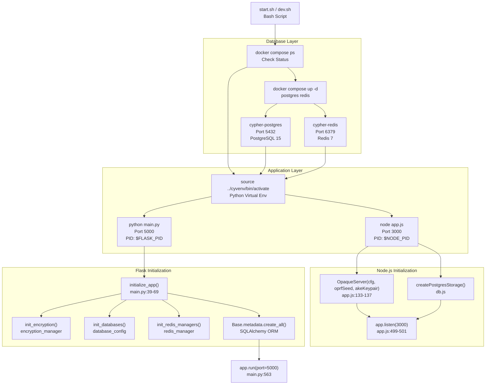
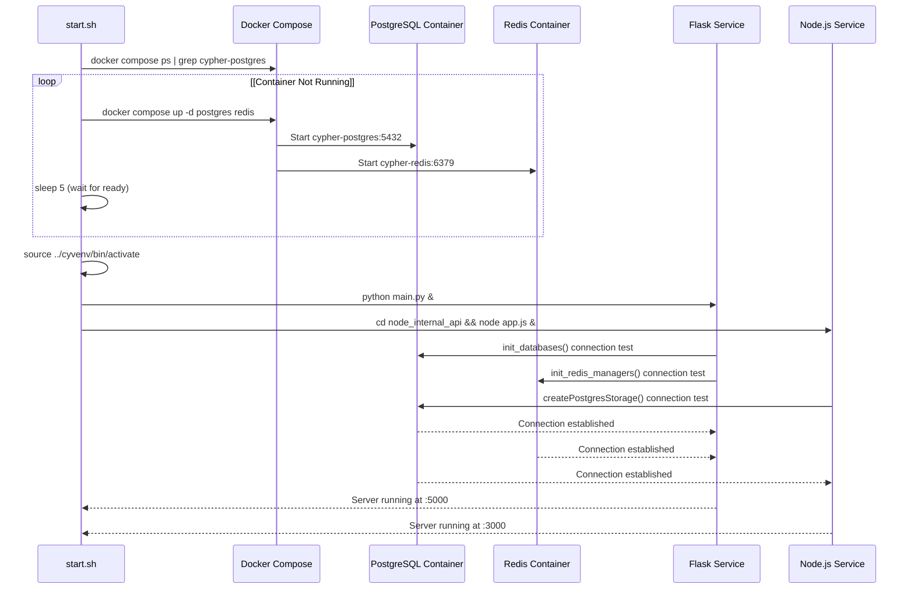
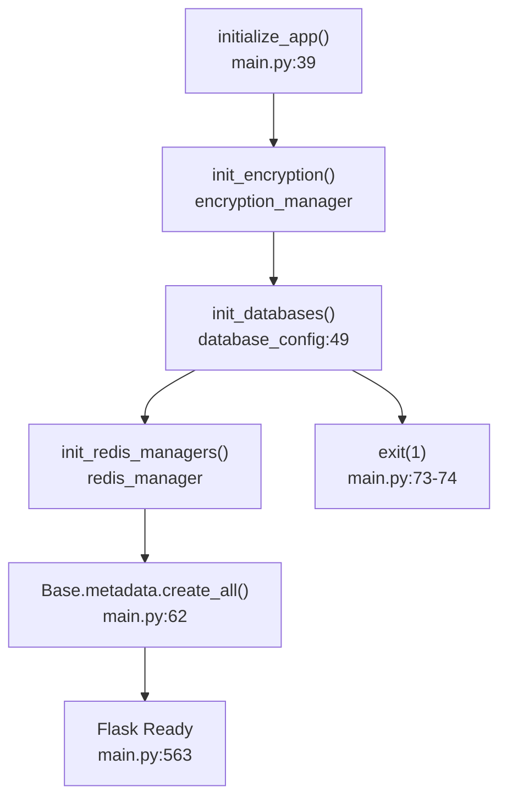
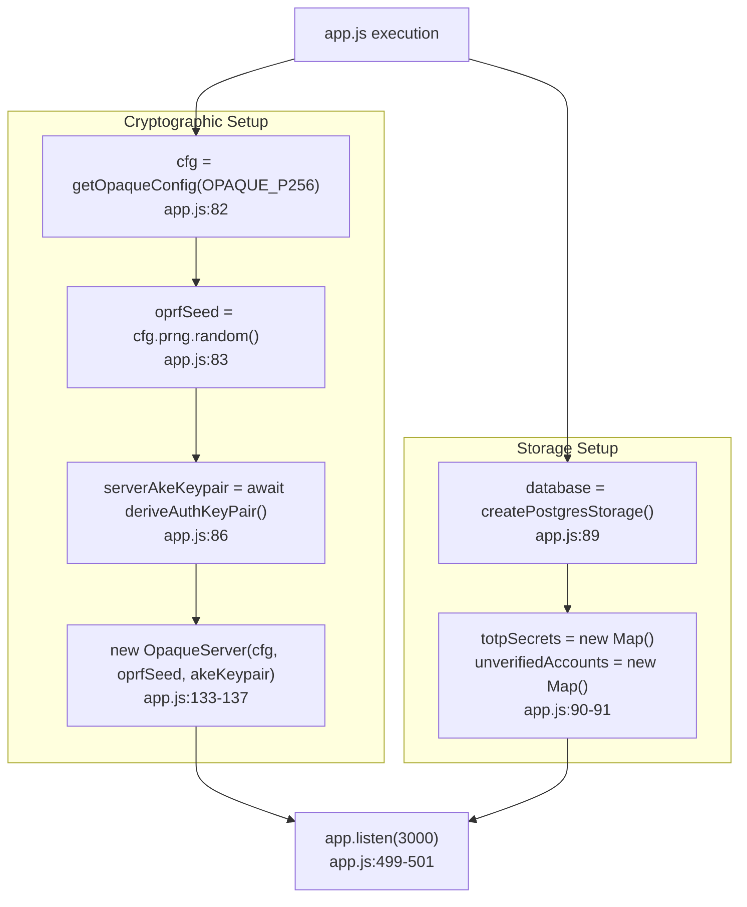

# Running the Application

> **Relevant source files**
> * [back-end/main.py](https://github.com/RogueElectron/Cypher1/blob/c60431e6/back-end/main.py)
> * [back-end/node_internal_api/app.js](https://github.com/RogueElectron/Cypher1/blob/c60431e6/back-end/node_internal_api/app.js)
> * [back-end/setup.sh](https://github.com/RogueElectron/Cypher1/blob/c60431e6/back-end/setup.sh)
> * [back-end/start.sh](https://github.com/RogueElectron/Cypher1/blob/c60431e6/back-end/start.sh)

## Purpose and Scope

This document provides instructions for starting and managing the Cypher authentication platform services. It covers both production and development execution modes, Docker Compose database orchestration, service startup sequences, and troubleshooting procedures.

For initial installation and dependency setup, see [Installation and Setup](/RogueElectron/Cypher1/7.1-installation-and-setup). For details on how frontend assets are built, see [Build System](/RogueElectron/Cypher1/7.2-build-system).

---

## Prerequisites

Before running the application, ensure that:

1. All dependencies have been installed via `setup.sh` (see [7.1](/RogueElectron/Cypher1/7.1-installation-and-setup))
2. Frontend assets have been built to `static/dist/` via Vite
3. Docker and Docker Compose are installed and running
4. PostgreSQL and Redis containers are configured in `docker-compose.yml`
5. Environment variables are set in `.env` file

**Sources:** [back-end/setup.sh L1-L153](https://github.com/RogueElectron/Cypher1/blob/c60431e6/back-end/setup.sh#L1-L153)

 [back-end/start.sh L1-L23](https://github.com/RogueElectron/Cypher1/blob/c60431e6/back-end/start.sh#L1-L23)

---

## Production Mode

### Starting with start.sh

Production mode uses the `start.sh` script generated during setup. This script:

1. Verifies database services are running
2. Activates the Python virtual environment
3. Launches Flask and Node.js services in parallel
4. Captures process IDs for graceful shutdown

**Execution:**

```
cd back-end
./start.sh
```

**Output:**

```
checking database services...
cypher running - flask: http://127.0.0.1:5000 | node: http://localhost:3000
press ctrl+c to stop
Access cypher by going to http://localhost:5000
```

### Script Behavior

| Line | Action | Details |
| --- | --- | --- |
| [4-9](https://github.com/RogueElectron/Cypher1/blob/c60431e6/4-9) | Database Check | Verifies `cypher-postgres` container status; starts if down |
| [11](https://github.com/RogueElectron/Cypher1/blob/c60431e6/11) | Virtual Environment | Activates `../cyvenv/bin/activate` |
| [12-13](https://github.com/RogueElectron/Cypher1/blob/c60431e6/12-13) | Flask Service | Launches `python main.py` on port 5000 |
| [14-16](https://github.com/RogueElectron/Cypher1/blob/c60431e6/14-16) | Node.js Service | Launches `node app.js` on port 3000 |
| [21](https://github.com/RogueElectron/Cypher1/blob/c60431e6/21) | Graceful Shutdown | Trap handles Ctrl+C to kill both PIDs |

**Sources:** [back-end/start.sh L1-L23](https://github.com/RogueElectron/Cypher1/blob/c60431e6/back-end/start.sh#L1-L23)

---

## Development Mode

### Starting with dev.sh

Development mode enables debugging features and automatic code reloading:

```
cd back-end
./dev.sh
```

**Key Differences from Production:**

| Feature | Production (`start.sh`) | Development (`dev.sh`) |
| --- | --- | --- |
| Flask Debug | Disabled | `FLASK_DEBUG=1` enabled |
| Node.js Reload | Manual restart required | `nodemon` auto-restart on file changes |
| Logging | Standard output | Enhanced debug logs |
| Error Pages | Generic 500 errors | Detailed stack traces |

### Hot Reload Configuration

The development script uses **nodemon** for the Node.js API, which watches:

* `node_internal_api/*.js` files
* Automatically restarts on changes
* Preserves in-memory state in PostgreSQL/Redis

Flask's debug mode provides:

* Automatic reloading on Python file changes
* Interactive debugger in browser
* Detailed error pages with stack traces

**Sources:** [back-end/setup.sh L112-L135](https://github.com/RogueElectron/Cypher1/blob/c60431e6/back-end/setup.sh#L112-L135)

 [back-end/start.sh L1-L23](https://github.com/RogueElectron/Cypher1/blob/c60431e6/back-end/start.sh#L1-L23)

---

## Service Architecture and Startup Flow



**Sources:** [back-end/start.sh L1-L23](https://github.com/RogueElectron/Cypher1/blob/c60431e6/back-end/start.sh#L1-L23)

 [back-end/main.py L39-L74](https://github.com/RogueElectron/Cypher1/blob/c60431e6/back-end/main.py#L39-L74)

 [back-end/node_internal_api/app.js L82-L137](https://github.com/RogueElectron/Cypher1/blob/c60431e6/back-end/node_internal_api/app.js#L82-L137)

 [back-end/node_internal_api/app.js L499-L501](https://github.com/RogueElectron/Cypher1/blob/c60431e6/back-end/node_internal_api/app.js#L499-L501)

---

## Docker Compose Database Infrastructure

### Container Management

The application uses Docker Compose to manage PostgreSQL and Redis containers. The startup scripts automatically handle container lifecycle:



### Container Configuration

| Service | Container Name | Port Mapping | Volume | Defined In |
| --- | --- | --- | --- | --- |
| PostgreSQL | `cypher-postgres` | `5432:5432` | `postgres_data:/var/lib/postgresql/data` | `docker-compose.yml` |
| Redis | `cypher-redis` | `6379:6379` | `redis_data:/data` | `docker-compose.yml` |

### Manual Container Control

While the startup scripts handle containers automatically, manual control is available:

```markdown
# Start containers
docker compose up -d postgres redis

# Check container status
docker compose ps

# View logs
docker compose logs postgres
docker compose logs redis

# Stop containers
docker compose down

# Stop and remove volumes
docker compose down -v
```

**Sources:** [back-end/start.sh L4-L9](https://github.com/RogueElectron/Cypher1/blob/c60431e6/back-end/start.sh#L4-L9)

 [back-end/setup.sh L76-L80](https://github.com/RogueElectron/Cypher1/blob/c60431e6/back-end/setup.sh#L76-L80)

---

## Service Startup Sequence

### 1. Database Initialization (Flask)

When Flask starts, `initialize_app()` executes in sequence:



**Critical Failure Points:**

| Function | Failure Condition | Result |
| --- | --- | --- |
| `init_encryption()` | Encryption service unavailable | Exception logged, app exits |
| `init_databases()` | PostgreSQL connection failed | `db_initialized = False`, app exits |
| `init_redis_managers()` | Redis connection failed | Exception logged, app exits |
| `create_all()` | Schema creation failed | Exception logged, app exits |

**Sources:** [back-end/main.py L39-L74](https://github.com/RogueElectron/Cypher1/blob/c60431e6/back-end/main.py#L39-L74)

### 2. OPAQUE Server Initialization (Node.js)

The Node.js API initializes cryptographic components before listening for requests:



**Sources:** [back-end/node_internal_api/app.js L82-L137](https://github.com/RogueElectron/Cypher1/blob/c60431e6/back-end/node_internal_api/app.js#L82-L137)

 [back-end/node_internal_api/app.js L499-L501](https://github.com/RogueElectron/Cypher1/blob/c60431e6/back-end/node_internal_api/app.js#L499-L501)

---

## Service Endpoints and Availability

After successful startup, the following endpoints become available:

### Flask Service (Port 5000)

| Route | Purpose | Handler Function |
| --- | --- | --- |
| `GET /` | Serve main application page | `serve_index()` [main.py L76-L78](https://github.com/RogueElectron/Cypher1/blob/c60431e6/main.py#L76-L78) |
| `GET /api/login` | Serve login page | `serve_login()` [main.py L80-L82](https://github.com/RogueElectron/Cypher1/blob/c60431e6/main.py#L80-L82) |
| `GET /api/register` | Serve registration page | `serve_register()` [main.py L84-L86](https://github.com/RogueElectron/Cypher1/blob/c60431e6/main.py#L84-L86) |
| `POST /api/create-token` | Issue intermediate auth token | `create_token()` [main.py L92-L112](https://github.com/RogueElectron/Cypher1/blob/c60431e6/main.py#L92-L112) |
| `POST /api/verify-token` | Validate intermediate token | `verify_token()` [main.py L114-L148](https://github.com/RogueElectron/Cypher1/blob/c60431e6/main.py#L114-L148) |
| `POST /api/create-session` | Create user session with PASETO tokens | `create_session()` [main.py L150-L304](https://github.com/RogueElectron/Cypher1/blob/c60431e6/main.py#L150-L304) |
| `POST /api/verify-access` | Validate access token | `verify_access()` [main.py L307-L385](https://github.com/RogueElectron/Cypher1/blob/c60431e6/main.py#L307-L385) |
| `POST /api/refresh-token` | Rotate tokens | `refresh_token()` [main.py L388-L512](https://github.com/RogueElectron/Cypher1/blob/c60431e6/main.py#L388-L512) |
| `POST /api/logout` | Invalidate session | `logout()` [main.py L515-L560](https://github.com/RogueElectron/Cypher1/blob/c60431e6/main.py#L515-L560) |

### Node.js API (Port 3000)

| Route | Purpose | Handler Function |
| --- | --- | --- |
| `POST /register/init` | OPAQUE registration phase 1 | `app.post('/register/init')` [app.js L143-L175](https://github.com/RogueElectron/Cypher1/blob/c60431e6/app.js#L143-L175) |
| `POST /register/finish` | OPAQUE registration phase 2 | `app.post('/register/finish')` [app.js L177-L220](https://github.com/RogueElectron/Cypher1/blob/c60431e6/app.js#L177-L220) |
| `POST /login/init` | OPAQUE authentication phase 1 | `app.post('/login/init')` [app.js L222-L259](https://github.com/RogueElectron/Cypher1/blob/c60431e6/app.js#L222-L259) |
| `POST /login/finish` | OPAQUE authentication phase 2 | `app.post('/login/finish')` [app.js L263-L325](https://github.com/RogueElectron/Cypher1/blob/c60431e6/app.js#L263-L325) |
| `POST /totp/setup` | Generate TOTP secret and QR code | `app.post('/totp/setup')` [app.js L329-L361](https://github.com/RogueElectron/Cypher1/blob/c60431e6/app.js#L329-L361) |
| `POST /totp/verify-setup` | Verify TOTP during registration | `app.post('/totp/verify-setup')` [app.js L363-L389](https://github.com/RogueElectron/Cypher1/blob/c60431e6/app.js#L363-L389) |
| `POST /totp/verify-login` | Verify TOTP during login | `app.post('/totp/verify-login')` [app.js L391-L496](https://github.com/RogueElectron/Cypher1/blob/c60431e6/app.js#L391-L496) |

**Sources:** [back-end/main.py L76-L560](https://github.com/RogueElectron/Cypher1/blob/c60431e6/back-end/main.py#L76-L560)

 [back-end/node_internal_api/app.js L143-L501](https://github.com/RogueElectron/Cypher1/blob/c60431e6/back-end/node_internal_api/app.js#L143-L501)

---

## Verifying Successful Startup

### Console Output Validation

**Expected Flask Output:**

```yaml
INFO:src.encryption_manager:Encryption manager initialized
INFO:__main__:Databases initialized successfully
INFO:__main__:Redis managers initialized
INFO:__main__:Database tables created/verified
 * Serving Flask app 'main'
 * Debug mode: off
WARNING: This is a development server. Do not use it in a production deployment.
 * Running on http://127.0.0.1:5000
```

**Expected Node.js Output:**

```
Server running at http://localhost:3000
```

### Health Check Requests

Test service availability using curl or browser:

```sql
# Test Flask frontend (should return HTML)
curl http://localhost:5000/

# Test Flask API endpoint (should return 400 for missing params)
curl -X POST http://localhost:5000/api/create-token \
  -H "Content-Type: application/json"

# Test Node.js API (should return 400 for missing params)
curl -X POST http://localhost:3000/login/init \
  -H "Content-Type: application/json"
```

### Database Connection Verification

```sql
# Check PostgreSQL
docker exec -it cypher-postgres psql -U postgres -d cypher -c "SELECT count(*) FROM users;"

# Check Redis
docker exec -it cypher-redis redis-cli PING
# Expected: PONG
```

**Sources:** [back-end/main.py L39-L74](https://github.com/RogueElectron/Cypher1/blob/c60431e6/back-end/main.py#L39-L74)

 [back-end/node_internal_api/app.js L499-L501](https://github.com/RogueElectron/Cypher1/blob/c60431e6/back-end/node_internal_api/app.js#L499-L501)

---

## Stopping the Application

### Graceful Shutdown

The startup scripts handle graceful shutdown via signal trapping:

```markdown
# Press Ctrl+C in the terminal running start.sh or dev.sh
^C
# Both Flask and Node.js processes receive SIGINT and terminate cleanly
```

**Shutdown Mechanism:**

```
trap 'kill $FLASK_PID $NODE_PID 2>/dev/null; exit' INT
```

This sends `SIGTERM` to both processes, allowing them to:

* Close database connections
* Flush Redis caches
* Complete in-flight requests
* Release file handles

### Manual Process Termination

If graceful shutdown fails:

```markdown
# Find process IDs
ps aux | grep "python main.py"
ps aux | grep "node app.js"

# Kill processes
kill -9 <FLASK_PID>
kill -9 <NODE_PID>
```

### Stopping Database Containers

```markdown
# Stop containers but preserve data
docker compose stop postgres redis

# Stop and remove containers (data volumes persist)
docker compose down

# Stop and remove containers AND data
docker compose down -v
```

**Warning:** Using `docker compose down -v` deletes all database data. Use only when resetting the entire system.

**Sources:** [back-end/start.sh L21](https://github.com/RogueElectron/Cypher1/blob/c60431e6/back-end/start.sh#L21-L21)

 [back-end/setup.sh L108](https://github.com/RogueElectron/Cypher1/blob/c60431e6/back-end/setup.sh#L108-L108)

---

## Troubleshooting

### Database Connection Failures

**Symptom:** Flask fails with `"Failed to initialize databases"`

**Diagnosis:**

```markdown
# Check if containers are running
docker compose ps

# Check PostgreSQL logs
docker compose logs postgres | tail -20

# Test connection manually
docker exec -it cypher-postgres psql -U postgres -d cypher
```

**Common Causes:**

| Issue | Solution |
| --- | --- |
| Containers not started | Run `docker compose up -d postgres redis` |
| Wrong credentials in `.env` | Verify `DATABASE_URL` matches `docker-compose.yml` settings |
| Port 5432 already in use | Stop conflicting PostgreSQL instance or change port mapping |
| Insufficient Docker resources | Increase Docker memory/CPU allocation |

### Redis Connection Failures

**Symptom:** `init_redis_managers()` raises exception

**Diagnosis:**

```markdown
# Test Redis connection
docker exec -it cypher-redis redis-cli PING

# Check Redis logs
docker compose logs redis
```

**Solution:** Verify Redis is running and accessible at `localhost:6379`

### Port Conflicts

**Symptom:** `Address already in use` error

**Diagnosis:**

```markdown
# Check what's using port 5000
lsof -i :5000

# Check what's using port 3000
lsof -i :3000
```

**Solution:**

* Stop conflicting process, OR
* Change Flask port in `main.py:563` and Node.js port in `app.js:499`

### OPAQUE Server Not Ready

**Symptom:** `POST /register/init` returns `"Server not initialized yet"`

**Cause:** Node.js API received request before OPAQUE server initialization completed

**Solution:** Wait 2-3 seconds after `"Server running at http://localhost:3000"` message appears

### Missing Frontend Assets

**Symptom:** 404 errors for `/static/dist/*.js` files

**Diagnosis:**

```markdown
# Check if build artifacts exist
ls -la back-end/static/dist/

# Should show:
# register.js
# auth.js
# session-manager.js
# index.js
```

**Solution:** Rebuild frontend assets:

```
cd back-end
npx vite build
```

**Sources:** [back-end/main.py L39-L74](https://github.com/RogueElectron/Cypher1/blob/c60431e6/back-end/main.py#L39-L74)

 [back-end/node_internal_api/app.js L145-L147](https://github.com/RogueElectron/Cypher1/blob/c60431e6/back-end/node_internal_api/app.js#L145-L147)

 [back-end/setup.sh L66-L67](https://github.com/RogueElectron/Cypher1/blob/c60431e6/back-end/setup.sh#L66-L67)

---

## Environment-Specific Considerations

### Development Mode Specifics

* **FLASK_DEBUG=1** exposes detailed error pages with source code
* **Never use in production** - presents security risk
* `nodemon` may restart Node.js API during active OPAQUE sessions, causing `"No active session found"` errors

### Production Mode Recommendations

* Deploy behind reverse proxy (nginx/Apache) for HTTPS
* Use production WSGI server (Gunicorn/uWSGI) instead of Flask's development server
* Set `FLASK_DEBUG=0` in environment
* Configure proper logging to files instead of stdout
* Implement process supervisor (systemd/supervisord) instead of bash script

**Note:** The current `start.sh` script uses Flask's built-in development server (`app.run()`), which is **not suitable for production deployments**. See [8](/RogueElectron/Cypher1/8-security-architecture) for production security considerations.

**Sources:** [back-end/main.py L563](https://github.com/RogueElectron/Cypher1/blob/c60431e6/back-end/main.py#L563-L563)

 [back-end/setup.sh L112-L135](https://github.com/RogueElectron/Cypher1/blob/c60431e6/back-end/setup.sh#L112-L135)

---

## Process Management

### Background Execution

To run services in detached mode:

```
nohup ./start.sh > cypher.log 2>&1 &
```

This allows:

* Services to continue after terminal closes
* Output captured to `cypher.log`
* Process runs in background

**Stop detached services:**

```markdown
# Find process
ps aux | grep start.sh

# Kill the start.sh process
kill <PID_OF_START_SH>

# Or kill Flask and Node.js directly
pkill -f "python main.py"
pkill -f "node app.js"
```

### systemd Service Configuration

For persistent service management on Linux:

```markdown
# /etc/systemd/system/cypher.service
[Unit]
Description=Cypher Authentication Platform
After=docker.service
Requires=docker.service

[Service]
Type=forking
User=cypher
WorkingDirectory=/opt/cypher/back-end
ExecStart=/opt/cypher/back-end/start.sh
Restart=on-failure

[Install]
WantedBy=multi-user.target
```

**Sources:** [back-end/start.sh L1-L23](https://github.com/RogueElectron/Cypher1/blob/c60431e6/back-end/start.sh#L1-L23)