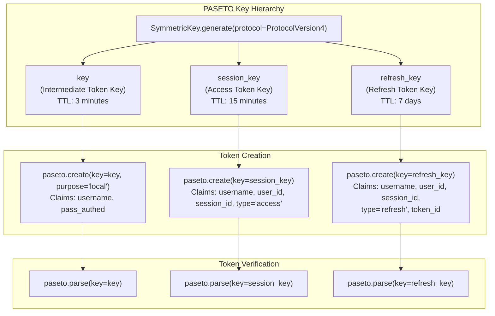
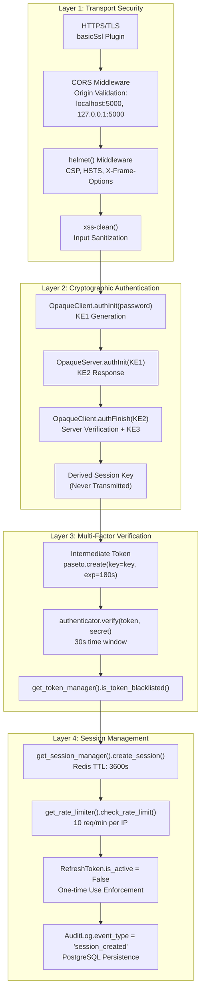
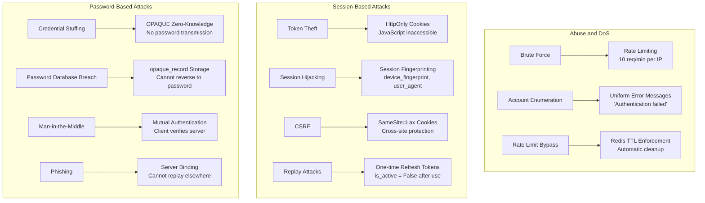
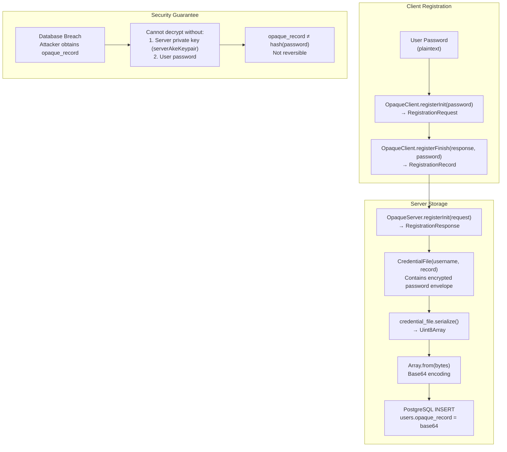
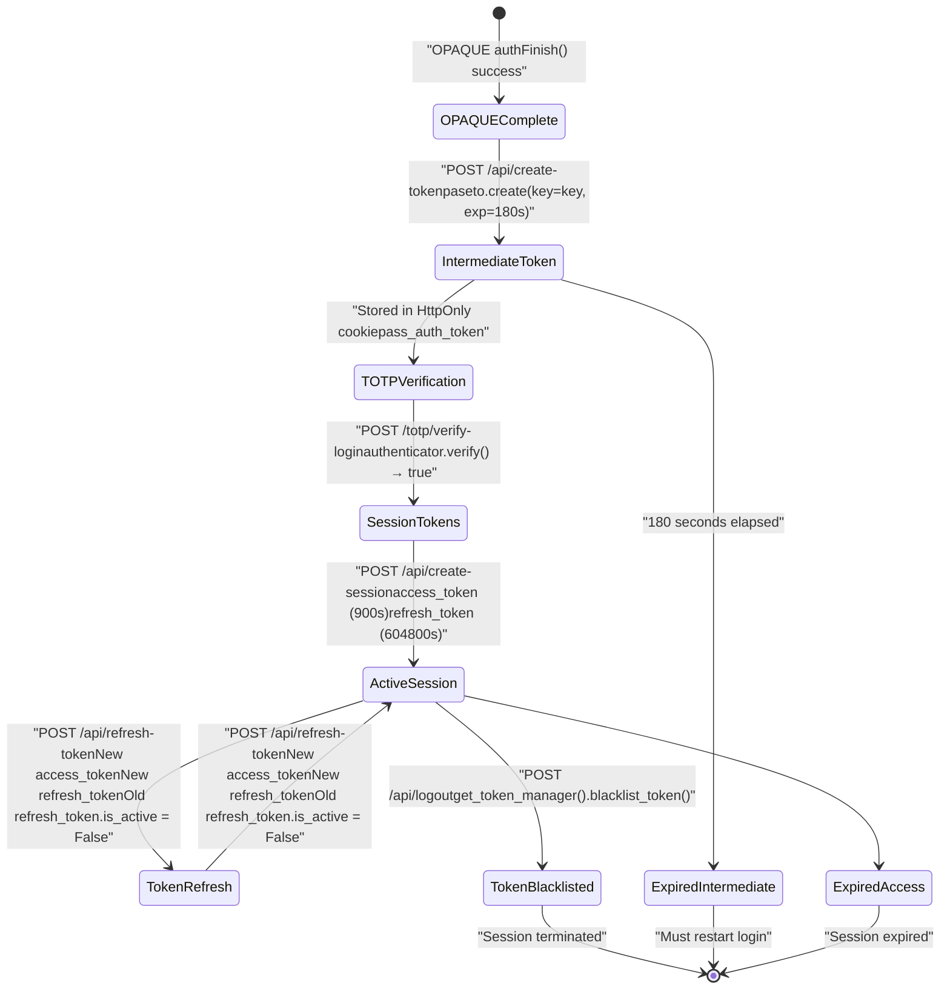
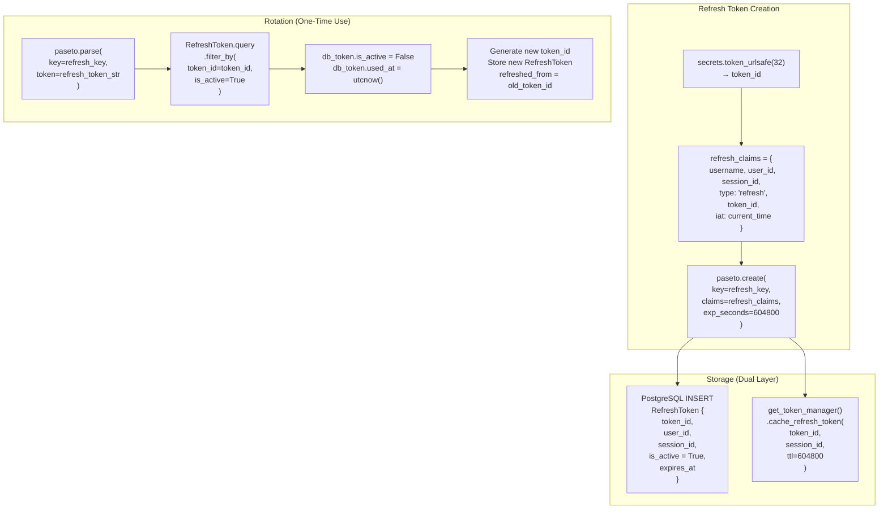
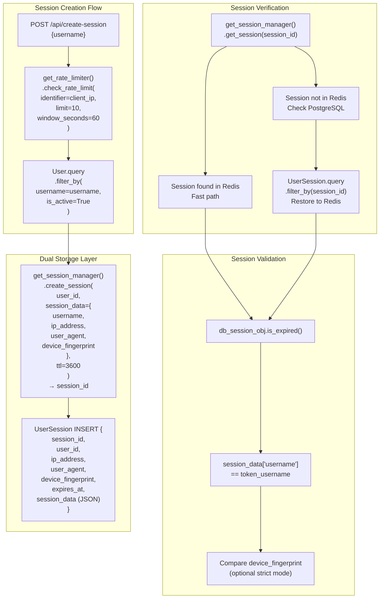
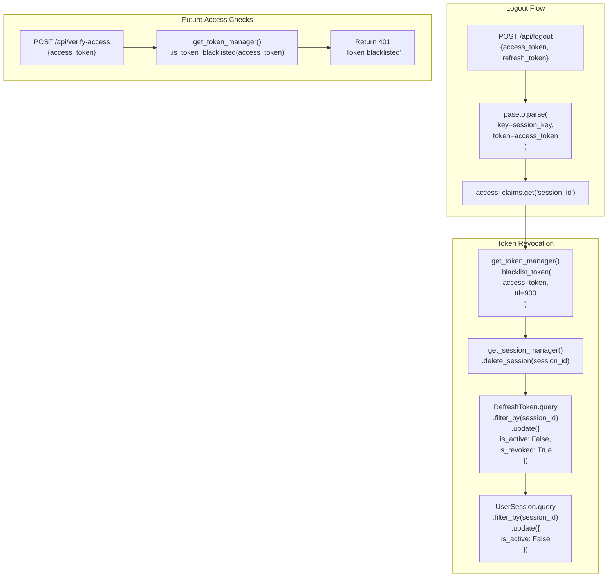
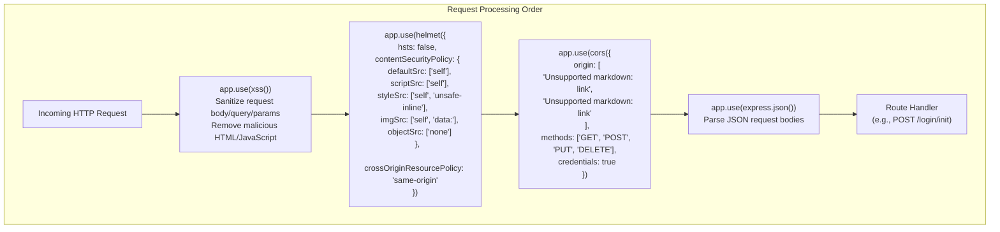
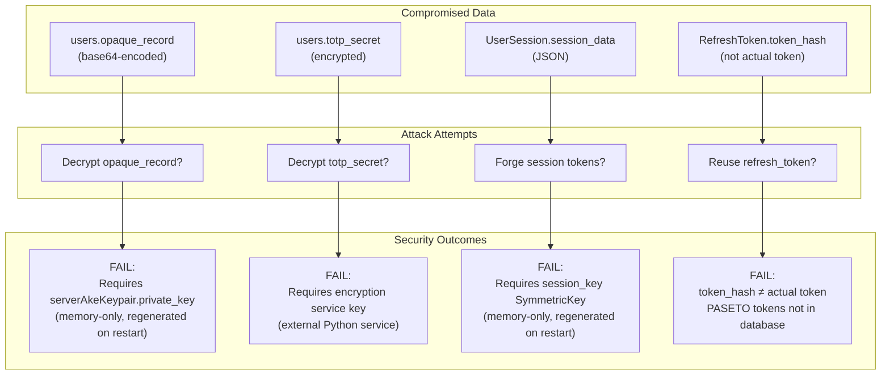

# Security Architecture

> **Relevant source files**
> * [Documentation/Business-Model.md](https://github.com/RogueElectron/Cypher1/blob/c60431e6/Documentation/Business-Model.md)
> * [Documentation/Team-Roles.md](https://github.com/RogueElectron/Cypher1/blob/c60431e6/Documentation/Team-Roles.md)
> * [README.md](https://github.com/RogueElectron/Cypher1/blob/c60431e6/README.md)
> * [back-end/main.py](https://github.com/RogueElectron/Cypher1/blob/c60431e6/back-end/main.py)
> * [back-end/node_internal_api/app.js](https://github.com/RogueElectron/Cypher1/blob/c60431e6/back-end/node_internal_api/app.js)
> * [back-end/src/auth.js](https://github.com/RogueElectron/Cypher1/blob/c60431e6/back-end/src/auth.js)

## Purpose and Scope

This document provides a comprehensive analysis of the security architecture underlying the Cypher authentication platform. It examines the cryptographic foundations, defense-in-depth mechanisms, threat model, and security guarantees that enable zero-knowledge authentication.

For implementation details of specific authentication flows, see [Authentication System](/RogueElectron/Cypher1/3-authentication-system). For session and token lifecycle management, see [Session and Token Management](/RogueElectron/Cypher1/3.3-session-and-token-management). For API endpoint security, see [API Reference](/RogueElectron/Cypher1/4.3-api-reference).

---

## Cryptographic Foundations

The Cypher platform builds on three cryptographic pillars, each addressing a distinct security domain: password authentication (OPAQUE), session management (PASETO), and second-factor verification (TOTP).

### OPAQUE Protocol Configuration

The system uses the **OPAQUE-P256** configuration, which implements the OPAQUE protocol specification using the P-256 elliptic curve.

**Key Configuration Parameters:**

| Parameter | Value | Purpose |
| --- | --- | --- |
| Protocol ID | `OpaqueID.OPAQUE_P256` | P-256 curve-based OPAQUE |
| OPRF Seed | `cfg.prng.random(cfg.hash.Nh)` | Oblivious PRF randomization |
| Server Keypair Seed | `cfg.prng.random(cfg.constants.Nseed)` | Authenticated key exchange |
| Hash Function | `cfg.hash` | Cryptographic hash operations |
| Key Derivation | `cfg.ake.deriveAuthKeyPair()` | Server authentication keypair |

The OPAQUE protocol ensures that:

1. **Server never learns password**: Password-based key is derived client-side only
2. **Mutual authentication**: Client authenticates server before revealing credentials
3. **Session key establishment**: Secure shared secret derived without password transmission

**Sources:** [back-end/node_internal_api/app.js L1-L86](https://github.com/RogueElectron/Cypher1/blob/c60431e6/back-end/node_internal_api/app.js#L1-L86)

 [back-end/src/auth.js L1-L10](https://github.com/RogueElectron/Cypher1/blob/c60431e6/back-end/src/auth.js#L1-L10)

### PASETO Token Architecture

The platform uses **PASETO v4.public** tokens with three cryptographically isolated symmetric keys to prevent token type confusion attacks.



**Token Type Isolation:**

| Token Type | Symmetric Key | Lifetime | Storage Location | Purpose |
| --- | --- | --- | --- | --- |
| Intermediate | `key` | 180 seconds | HttpOnly cookie | Bridge OPAQUE → TOTP |
| Access | `session_key` | 900 seconds | HttpOnly cookie | API authorization |
| Refresh | `refresh_key` | 604800 seconds | localStorage | Token rotation |

The three-key architecture ensures that:

* A stolen access token cannot be used to generate refresh tokens
* A compromised refresh token cannot forge access tokens
* Intermediate tokens are isolated from session establishment

**Sources:** [back-end/main.py L32-L34](https://github.com/RogueElectron/Cypher1/blob/c60431e6/back-end/main.py#L32-L34)

 [back-end/main.py L92-L112](https://github.com/RogueElectron/Cypher1/blob/c60431e6/back-end/main.py#L92-L112)

 [back-end/main.py L215-L249](https://github.com/RogueElectron/Cypher1/blob/c60431e6/back-end/main.py#L215-L249)

### TOTP Secret Management

Time-based one-time passwords use the **otplib** library with standardized parameters:

**TOTP Configuration:**

| Parameter | Value | Security Rationale |
| --- | --- | --- |
| Algorithm | SHA-1 (RFC 6238) | Authenticator app compatibility |
| Time Step | 30 seconds | Standard TOTP window |
| Verification Window | ±1 step (60s total) | Clock skew tolerance |
| Secret Length | `authenticator.generateSecret()` | Cryptographically random |
| Secret Storage | Encrypted via external service | Database compromise protection |

**Secret Lifecycle:**

1. **Generation**: `authenticator.generateSecret()` creates cryptographically random secret
2. **Temporary Storage**: Held in `totpSecrets` Map during setup (max 5 minutes)
3. **Verification**: `authenticator.verify({ token, secret, window: 1 })`
4. **Persistent Storage**: `database.storeTotpSecret(username, secret)` encrypts before PostgreSQL storage
5. **Retrieval**: `database.getTotpSecret(username)` decrypts on demand

**Sources:** [back-end/node_internal_api/app.js L16](https://github.com/RogueElectron/Cypher1/blob/c60431e6/back-end/node_internal_api/app.js#L16-L16)

 [back-end/node_internal_api/app.js L329-L361](https://github.com/RogueElectron/Cypher1/blob/c60431e6/back-end/node_internal_api/app.js#L329-L361)

 [back-end/node_internal_api/app.js L391-L496](https://github.com/RogueElectron/Cypher1/blob/c60431e6/back-end/node_internal_api/app.js#L391-L496)

---

## Security Layers and Defense-in-Depth

The platform implements a **four-layer security model** where compromise of any single layer does not compromise the entire authentication system.



**Layer Responsibilities:**

1. **Transport Security**: Prevents man-in-the-middle attacks, XSS injection, and cross-origin abuse
2. **Cryptographic Authentication**: Zero-knowledge password verification with mutual authentication
3. **Multi-Factor Verification**: Time-based second factor prevents replay and credential stuffing
4. **Session Management**: Rate limiting, token rotation, and audit trails prevent session hijacking

**Sources:** [back-end/node_internal_api/app.js L27-L46](https://github.com/RogueElectron/Cypher1/blob/c60431e6/back-end/node_internal_api/app.js#L27-L46)

 [back-end/node_internal_api/app.js L72-L77](https://github.com/RogueElectron/Cypher1/blob/c60431e6/back-end/node_internal_api/app.js#L72-L77)

 [back-end/main.py L159-L173](https://github.com/RogueElectron/Cypher1/blob/c60431e6/back-end/main.py#L159-L173)

 [back-end/main.py L535-L560](https://github.com/RogueElectron/Cypher1/blob/c60431e6/back-end/main.py#L535-L560)

---

## Threat Model and Attack Mitigation

### Threats Defended Against



**Sources:** [back-end/node_internal_api/app.js L222-L259](https://github.com/RogueElectron/Cypher1/blob/c60431e6/back-end/node_internal_api/app.js#L222-L259)

 [back-end/main.py L307-L386](https://github.com/RogueElectron/Cypher1/blob/c60431e6/back-end/main.py#L307-L386)

 [back-end/main.py L159-L173](https://github.com/RogueElectron/Cypher1/blob/c60431e6/back-end/main.py#L159-L173)

### Attack Surface Analysis

| Attack Vector | Vulnerable Component | Mitigation Mechanism | Code Reference |
| --- | --- | --- | --- |
| **Password Interception** | Network layer | OPAQUE never transmits password | [app.js L243-L250](https://github.com/RogueElectron/Cypher1/blob/c60431e6/app.js#L243-L250) |
| **Database Breach** | PostgreSQL `users` table | Only `opaque_record` stored (irreversible) | [app.js L197-L200](https://github.com/RogueElectron/Cypher1/blob/c60431e6/app.js#L197-L200) |
| **Token Forgery** | PASETO tokens | Cryptographically signed with `SymmetricKey` | [main.py L225-L230](https://github.com/RogueElectron/Cypher1/blob/c60431e6/main.py#L225-L230) |
| **Session Fixation** | Session creation | Randomized `session_id = secrets.token_urlsafe(32)` | [main.py L195-L201](https://github.com/RogueElectron/Cypher1/blob/c60431e6/main.py#L195-L201) |
| **Replay Attacks** | Refresh token reuse | `is_active = False` after use | [main.py L429](https://github.com/RogueElectron/Cypher1/blob/c60431e6/main.py#L429-L429) |
| **TOTP Brute Force** | 6-digit code space | Rate limiting + time window expiry | [main.py L161-L172](https://github.com/RogueElectron/Cypher1/blob/c60431e6/main.py#L161-L172) |
| **Cross-Origin Abuse** | API endpoints | CORS restricted to `localhost:5000` | [app.js L72-L77](https://github.com/RogueElectron/Cypher1/blob/c60431e6/app.js#L72-L77) |
| **XSS Injection** | Form inputs | `xss-clean()` middleware | [app.js L27](https://github.com/RogueElectron/Cypher1/blob/c60431e6/app.js#L27-L27) |
| **Account Lockout DoS** | Failed login attempts | 5-minute unverified account cleanup | [app.js L92-L111](https://github.com/RogueElectron/Cypher1/blob/c60431e6/app.js#L92-L111) |

**Sources:** [back-end/node_internal_api/app.js L27-L77](https://github.com/RogueElectron/Cypher1/blob/c60431e6/back-end/node_internal_api/app.js#L27-L77)

 [back-end/main.py L252-L271](https://github.com/RogueElectron/Cypher1/blob/c60431e6/back-end/main.py#L252-L271)

 [back-end/main.py L418-L429](https://github.com/RogueElectron/Cypher1/blob/c60431e6/back-end/main.py#L418-L429)

---

## OPAQUE Protocol Security Properties

### Zero-Knowledge Guarantee

The OPAQUE implementation ensures **true zero-knowledge** through the following protocol flow:

```mermaid
sequenceDiagram
  participant OpaqueClient
  participant (Browser)
  participant OpaqueServer
  participant (Node.js)
  participant PostgreSQL
  participant users.opaque_record

  note over OpaqueClient,users.opaque_record: Registration Phase
  OpaqueClient->>OpaqueClient: "client.registerInit(password)
  OpaqueClient->>OpaqueServer: → RegistrationRequest"
  OpaqueServer->>OpaqueServer: "POST /register/init
  OpaqueServer->>OpaqueClient: {registrationRequest}"
  OpaqueClient->>OpaqueClient: "server.registerInit(request, username)
  OpaqueClient->>OpaqueServer: → RegistrationResponse"
  OpaqueServer->>OpaqueServer: "{registrationResponse}"
  OpaqueServer->>PostgreSQL: "client.registerFinish(response, password)
  note over OpaqueClient,users.opaque_record: Authentication Phase (Zero-Knowledge)
  OpaqueClient->>OpaqueClient: → RegistrationRecord"
  OpaqueClient->>OpaqueServer: "POST /register/finish
  OpaqueServer->>PostgreSQL: {record, username}"
  PostgreSQL->>OpaqueServer: "CredentialFile(username, record)
  OpaqueServer->>OpaqueServer: → Serialized opaque_record"
  OpaqueServer->>OpaqueClient: "INSERT opaque_record = base64(serialized)"
  OpaqueClient->>OpaqueClient: "client.authInit(password)
  OpaqueClient->>OpaqueServer: → KE1 (blinded password)"
  OpaqueServer->>OpaqueServer: "POST /login/init
  note over OpaqueClient,(Node.js): CRITICAL: Password never transmitted.
```

**Mathematical Security Properties:**

1. **Password Secrecy**: Password `p` never leaves client. Server only stores `opaque_record = Encrypt(p, server_public_key)`
2. **Forward Secrecy**: Compromised `opaque_record` cannot recover password without server private key
3. **Mutual Authentication**: `KE2` proves server possesses correct `opaque_record`; `KE3` proves client knows password
4. **Session Key Agreement**: Both parties derive identical `session_key` using Diffie-Hellman, but key is never transmitted

**Sources:** [back-end/node_internal_api/app.js L143-L220](https://github.com/RogueElectron/Cypher1/blob/c60431e6/back-end/node_internal_api/app.js#L143-L220)

 [back-end/node_internal_api/app.js L222-L325](https://github.com/RogueElectron/Cypher1/blob/c60431e6/back-end/node_internal_api/app.js#L222-L325)

 [back-end/src/auth.js L239-L293](https://github.com/RogueElectron/Cypher1/blob/c60431e6/back-end/src/auth.js#L239-L293)

### Credential Storage Security

The `opaque_record` stored in PostgreSQL is cryptographically protected:



**Key Security Feature:** The `opaque_record` is **not a password hash**. It is an encrypted envelope that requires both the server's private key and the user's password to decrypt. A database breach reveals neither passwords nor session keys.

**Sources:** [back-end/node_internal_api/app.js L177-L220](https://github.com/RogueElectron/Cypher1/blob/c60431e6/back-end/node_internal_api/app.js#L177-L220)

 [back-end/node_internal_api/app.js L232-L241](https://github.com/RogueElectron/Cypher1/blob/c60431e6/back-end/node_internal_api/app.js#L232-L241)

---

## Token Security and Lifecycle Management

### Multi-Phase Token Strategy

The platform uses a **three-token system** to isolate authentication phases and minimize exposure windows:



**Token Lifecycle Security:**

| Phase | Token Type | Key | Lifetime | Invalidation Mechanism |
| --- | --- | --- | --- | --- |
| **Phase 1** | Intermediate | `key` | 180s | Automatic expiry via PASETO `exp_seconds` |
| **Phase 2** | Access | `session_key` | 900s | Blacklist in Redis + PASETO expiry |
| **Phase 3** | Refresh | `refresh_key` | 604800s | Database `is_active = False` + Redis cache |

**Sources:** [back-end/main.py L92-L112](https://github.com/RogueElectron/Cypher1/blob/c60431e6/back-end/main.py#L92-L112)

 [back-end/main.py L215-L249](https://github.com/RogueElectron/Cypher1/blob/c60431e6/back-end/main.py#L215-L249)

 [back-end/main.py L388-L512](https://github.com/RogueElectron/Cypher1/blob/c60431e6/back-end/main.py#L388-L512)

 [back-end/main.py L515-L560](https://github.com/RogueElectron/Cypher1/blob/c60431e6/back-end/main.py#L515-L560)

### Refresh Token Rotation Security

The platform enforces **one-time use** refresh tokens with database-backed rotation:



**Security Properties:**

1. **Replay Prevention**: Each refresh token can only be used once (`is_active = False` after use)
2. **Audit Trail**: `refreshed_from` column tracks token rotation lineage
3. **Immediate Revocation**: Logout sets `is_revoked = True` for all session tokens
4. **Dual Storage**: Redis provides fast validation; PostgreSQL ensures persistence

**Critical Implementation Detail:** The `token_id` claim inside the PASETO token is **not the token itself** - it's a unique identifier that maps to a database record. This prevents token forgery since attackers cannot create valid `token_id` values.

**Sources:** [back-end/main.py L232-L271](https://github.com/RogueElectron/Cypher1/blob/c60431e6/back-end/main.py#L232-L271)

 [back-end/main.py L388-L512](https://github.com/RogueElectron/Cypher1/blob/c60431e6/back-end/main.py#L388-L512)

 [back-end/main.py L542-L553](https://github.com/RogueElectron/Cypher1/blob/c60431e6/back-end/main.py#L542-L553)

---

## Session Security Mechanisms

### Redis-Backed Session Management

Sessions are stored in **Redis with PostgreSQL fallback** for performance and durability:



**Session Security Properties:**

| Security Control | Implementation | Purpose |
| --- | --- | --- |
| **Rate Limiting** | `get_rate_limiter().check_rate_limit(client_ip, 10, 60)` | Prevent session creation abuse |
| **Account Locking** | `user.is_locked()` checks `failed_login_attempts` | Brute force protection |
| **Session Isolation** | Unique `session_id` per login | Prevent session fixation |
| **Device Binding** | `device_fingerprint` in session data | Detect session hijacking |
| **Automatic Expiry** | Redis TTL 3600s + PostgreSQL `expires_at` | Limit exposure window |

**Sources:** [back-end/main.py L150-L304](https://github.com/RogueElectron/Cypher1/blob/c60431e6/back-end/main.py#L150-L304)

 [back-end/main.py L343-L366](https://github.com/RogueElectron/Cypher1/blob/c60431e6/back-end/main.py#L343-L366)

### Token Blacklisting and Revocation

Access tokens are blacklisted in Redis upon logout to prevent use of unexpired tokens:



**Blacklist Strategy:**

* **Storage**: Redis with TTL matching token lifetime (900s for access tokens)
* **Scope**: Only active tokens need blacklisting; expired tokens rejected by PASETO parser
* **Cleanup**: Automatic via Redis TTL expiration

**Sources:** [back-end/main.py L515-L560](https://github.com/RogueElectron/Cypher1/blob/c60431e6/back-end/main.py#L515-L560)

 [back-end/main.py L317-L319](https://github.com/RogueElectron/Cypher1/blob/c60431e6/back-end/main.py#L317-L319)

---

## Transport and Communication Security

### Middleware Stack

The Node.js API implements a comprehensive security middleware stack:



**Middleware Security Functions:**

| Middleware | Purpose | Configuration | Attack Vector Mitigated |
| --- | --- | --- | --- |
| `xss-clean()` | Sanitize inputs | Default settings | XSS injection, HTML injection |
| `helmet()` | Security headers | CSP, X-Frame-Options, HSTS | Clickjacking, MIME sniffing, XSS |
| `cors()` | Origin validation | Whitelist localhost:5000 | Cross-origin abuse, CSRF |
| `express.json()` | Body parsing | Size limits (default) | JSON bomb DoS |

**Content Security Policy (CSP):**

* `defaultSrc: ['self']` - Only load resources from same origin
* `scriptSrc: ['self']` - No inline scripts or external script domains
* `styleSrc: ['self', 'unsafe-inline']` - Inline styles allowed for UI flexibility
* `imgSrc: ['self', 'data:']` - Support QR code data URLs for TOTP setup
* `objectSrc: ['none']` - Block plugins and embedded objects

**Sources:** [back-end/node_internal_api/app.js L27-L79](https://github.com/RogueElectron/Cypher1/blob/c60431e6/back-end/node_internal_api/app.js#L27-L79)

### Cookie Security Configuration

Access tokens and intermediate tokens use secure cookie attributes:

| Cookie Attribute | Value | Security Purpose |
| --- | --- | --- |
| `HttpOnly` | True (implicit via Flask) | Prevent JavaScript access |
| `SameSite` | `Lax` | CSRF protection (cross-site read-only) |
| `Max-Age` | 180s (intermediate), 900s (access) | Automatic expiry |
| `Secure` | True (production HTTPS) | Encrypt in transit |
| `Path` | `/` | Scope to entire application |

**Client-Side Cookie Management:**

```javascript
// Intermediate token storage (auth.js:313-314)
const passAuthCookie = `pass_auth_token=${tokenResult.token}; Max-Age=180; SameSite=Lax; Path=/`;
document.cookie = passAuthCookie;

// Cookie cleanup after session creation (auth.js:446)
document.cookie = 'pass_auth_token=; Max-Age=0; Path=/; SameSite=Lax';
```

**Sources:** [back-end/src/auth.js L313-L314](https://github.com/RogueElectron/Cypher1/blob/c60431e6/back-end/src/auth.js#L313-L314)

 [back-end/src/auth.js L446](https://github.com/RogueElectron/Cypher1/blob/c60431e6/back-end/src/auth.js#L446-L446)

---

## Security Properties and Guarantees

### Mathematical Security Guarantees

The Cypher platform provides **provable security properties** based on cryptographic foundations:

| Security Property | Cryptographic Basis | Implementation | Guarantee |
| --- | --- | --- | --- |
| **Password Secrecy** | OPAQUE protocol (RFC draft) | `OpaqueClient.authInit()` never transmits password | Server cannot learn password, even with MitM |
| **Forward Secrecy** | P-256 ECDH key exchange | `cfg.ake.deriveAuthKeyPair()` ephemeral keys | Compromised long-term keys don't reveal past sessions |
| **Mutual Authentication** | OPAQUE KE2/KE3 messages | `client.authFinish(ke2)` verifies server | Client proves server holds correct `opaque_record` |
| **Token Integrity** | PASETO v4 AEAD | `paseto.create()` with `SymmetricKey` | Tokens tamper-evident and authenticated |
| **Session Isolation** | Cryptographic randomness | `secrets.token_urlsafe(32)` for session/token IDs | Session IDs unguessable (256-bit entropy) |

**Sources:** [back-end/node_internal_api/app.js L82-L86](https://github.com/RogueElectron/Cypher1/blob/c60431e6/back-end/node_internal_api/app.js#L82-L86)

 [back-end/src/auth.js L243-L286](https://github.com/RogueElectron/Cypher1/blob/c60431e6/back-end/src/auth.js#L243-L286)

### Breach Resistance Analysis

**Database Breach Scenario:**



**Key Security Feature:** All cryptographic keys (`key`, `session_key`, `refresh_key`, `serverAkeKeypair`) are **generated at runtime and never persisted**. A database breach reveals no usable secrets.

**Sources:** [back-end/main.py L32-L34](https://github.com/RogueElectron/Cypher1/blob/c60431e6/back-end/main.py#L32-L34)

 [back-end/node_internal_api/app.js L82-L86](https://github.com/RogueElectron/Cypher1/blob/c60431e6/back-end/node_internal_api/app.js#L82-L86)

### Time-Bound Security Model

All security mechanisms enforce **strict time limits** to minimize exposure:

| Component | Lifetime | Enforcement Mechanism | Rationale |
| --- | --- | --- | --- |
| **Unverified Account** | 300s | `setTimeout()` cleanup | Prevent incomplete registration abuse |
| **Intermediate Token** | 180s | PASETO `exp_seconds` | Bridge OPAQUE → TOTP only |
| **Access Token** | 900s | PASETO `exp_seconds` + blacklist | Limit stolen token impact |
| **Refresh Token** | 604800s | Database `expires_at` + one-time use | Balance usability and security |
| **Redis Session** | 3600s | Redis TTL | Automatic cache invalidation |
| **TOTP Code** | 60s | `authenticator.verify(window=1)` | Standard time-based window |
| **Rate Limit Window** | 60s | Redis counter TTL | Per-minute request limits |

**Automatic Cleanup:** The system uses **zero-maintenance expiry** - Redis TTLs and PASETO expiration eliminate the need for background cleanup jobs.

**Sources:** [back-end/node_internal_api/app.js L92-L111](https://github.com/RogueElectron/Cypher1/blob/c60431e6/back-end/node_internal_api/app.js#L92-L111)

 [back-end/main.py L109](https://github.com/RogueElectron/Cypher1/blob/c60431e6/back-end/main.py#L109-L109)

 [back-end/main.py L228-L229](https://github.com/RogueElectron/Cypher1/blob/c60431e6/back-end/main.py#L228-L229)

 [back-end/node_internal_api/app.js L441-L445](https://github.com/RogueElectron/Cypher1/blob/c60431e6/back-end/node_internal_api/app.js#L441-L445)

---

## Security Audit and Monitoring

### Audit Logging

All authentication events are logged to the `AuditLog` table for compliance and forensics:

```css
# Session creation audit (main.py:277-291)
audit_log = AuditLog(
    event_type='session_created',
    event_category='AUTH',
    severity='INFO',
    user_id=user.id,
    session_id=session_id,
    ip_address=client_ip,
    user_agent=request.headers.get('User-Agent', ''),
    success=True
)
audit_log.set_event_details({
    'session_duration': '15 minutes',
    'refresh_token_duration': '7 days'
})
```

**Audit Event Categories:**

| Event Type | Trigger | Information Captured |
| --- | --- | --- |
| `session_created` | Successful TOTP verification | user_id, session_id, IP, user agent |
| `token_refreshed` | Access token refresh | old_token_id → new_token_id lineage |
| `session_terminated` | Logout | session_id, termination reason |
| `auth_failed` | Invalid OPAQUE/TOTP | username, IP (no password data) |
| `rate_limit_exceeded` | Abuse detection | IP, endpoint, violation count |

**Sources:** [back-end/main.py L277-L291](https://github.com/RogueElectron/Cypher1/blob/c60431e6/back-end/main.py#L277-L291)

### Security Monitoring Points

Key monitoring metrics for security operations:

1. **Failed Authentication Rate**: Unusual spike indicates brute force or credential stuffing
2. **Token Refresh Patterns**: Abnormal refresh frequency suggests token theft
3. **Session Fingerprint Changes**: Device fingerprint mismatch during token refresh
4. **Rate Limit Violations**: Per-IP abuse tracking via `get_rate_limiter()`
5. **Unverified Account Accumulation**: Monitor `unverifiedAccounts` Map size
6. **Redis Cache Miss Rate**: High miss rate on `get_session()` suggests DoS or cache poisoning

**Sources:** [back-end/main.py L159-L173](https://github.com/RogueElectron/Cypher1/blob/c60431e6/back-end/main.py#L159-L173)

 [back-end/node_internal_api/app.js L90-L111](https://github.com/RogueElectron/Cypher1/blob/c60431e6/back-end/node_internal_api/app.js#L90-L111)

---

This security architecture establishes **defense-in-depth** through cryptographic isolation, time-bound tokens, and comprehensive audit trails. The mathematical guarantees of OPAQUE, combined with PASETO's stateless verification and TOTP's second factor, create a system where compromise of any single component does not compromise overall security.