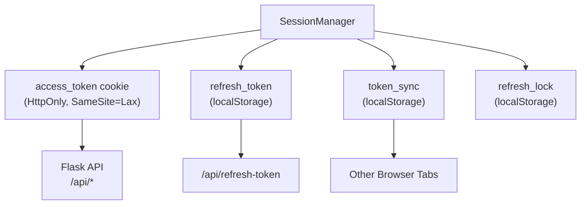
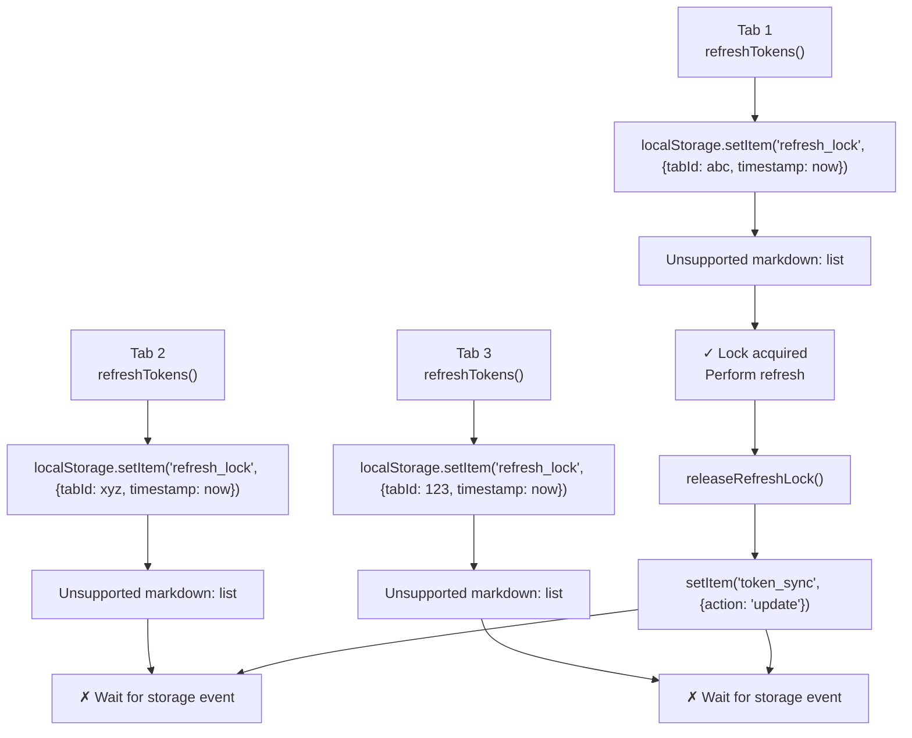
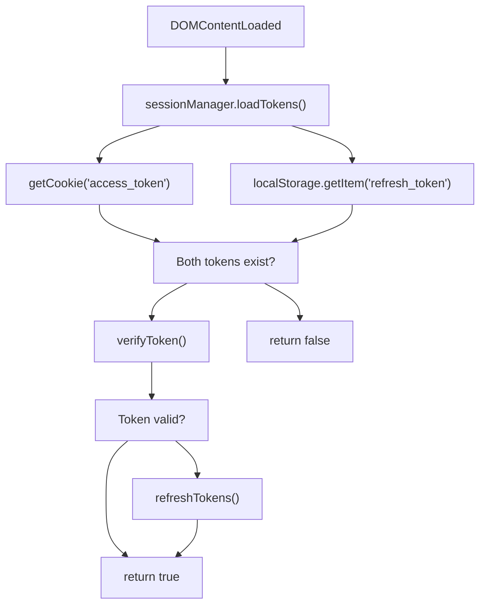
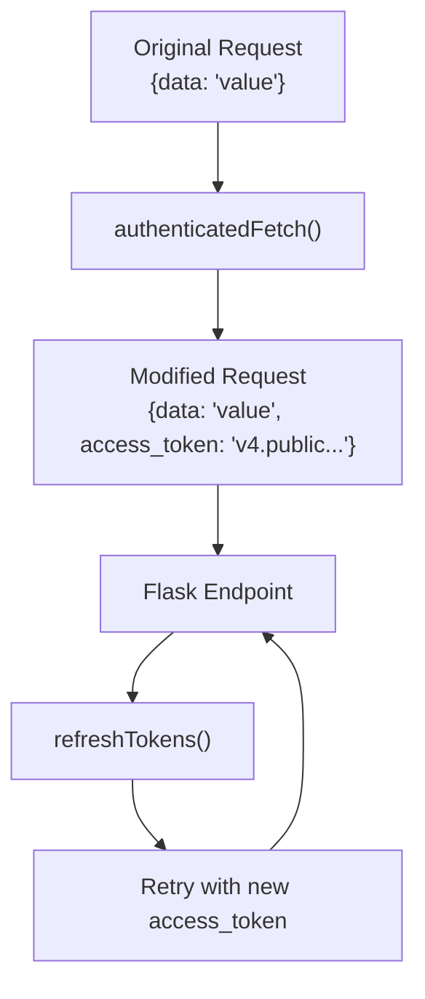

# Session Manager Module

> **Relevant source files**
> * [back-end/src/index.js](https://github.com/RogueElectron/Cypher1/blob/c60431e6/back-end/src/index.js)
> * [back-end/src/session-manager.js](https://github.com/RogueElectron/Cypher1/blob/c60431e6/back-end/src/session-manager.js)
> * [back-end/static/dist/index.js](https://github.com/RogueElectron/Cypher1/blob/c60431e6/back-end/static/dist/index.js)
> * [back-end/static/dist/session-manager.js](https://github.com/RogueElectron/Cypher1/blob/c60431e6/back-end/static/dist/session-manager.js)

## Purpose and Scope

The Session Manager Module is a client-side JavaScript singleton that manages PASETO token lifecycle, automatic token refresh, and multi-tab session synchronization. It provides the primary interface for maintaining authenticated state in the browser after successful login.

This document covers token storage, automatic refresh scheduling, multi-tab coordination, and the authenticated fetch API. For the authentication flow that creates these tokens, see [Login Flow (Client-Side)](/RogueElectron/Cypher1/5.2-login-flow-(client-side)). For server-side token creation and verification, see [Flask Session Service](/RogueElectron/Cypher1/4.1-flask-session-service).

**Sources:** [back-end/src/session-manager.js L1-L355](https://github.com/RogueElectron/Cypher1/blob/c60431e6/back-end/src/session-manager.js#L1-L355)

---

## Architecture and Responsibilities

The `SessionManager` class is instantiated as a singleton (`sessionManager`) and handles:

| Responsibility | Implementation |
| --- | --- |
| **Token Storage** | Access tokens in HttpOnly cookies, refresh tokens in localStorage |
| **Automatic Refresh** | Scheduled refresh 12 minutes after token issuance (3 minutes before expiry) |
| **Multi-Tab Sync** | localStorage events coordinate token state across browser tabs |
| **Refresh Locking** | Distributed lock prevents multiple tabs from refreshing simultaneously |
| **Authenticated Requests** | Wrapper around `fetch()` that auto-injects access tokens and handles 401 errors |
| **Session Verification** | Validates access tokens with Flask `/api/verify-access` endpoint |
| **Logout** | Invalidates tokens server-side and clears local state |

The session manager acts as the bridge between authentication completion (handled by `auth.js`) and ongoing authenticated API usage (handled by `index.js` and future application modules).

**Sources:** [back-end/src/session-manager.js L1-L12](https://github.com/RogueElectron/Cypher1/blob/c60431e6/back-end/src/session-manager.js#L1-L12)

 [back-end/src/session-manager.js L56-L76](https://github.com/RogueElectron/Cypher1/blob/c60431e6/back-end/src/session-manager.js#L56-L76)

---

## Token Storage Strategy

### Storage Mechanism



### Token Placement Rationale

**Access Token** (stored in cookie):

* Automatically sent with every request to Flask endpoints
* HttpOnly flag prevents JavaScript access (XSS protection)
* SameSite=Lax prevents CSRF attacks
* Short lifetime (15 minutes) limits exposure window

**Refresh Token** (stored in localStorage):

* Not sent automatically with requests (prevents unnecessary exposure)
* Only transmitted during explicit refresh operations
* Longer lifetime (7 days) enables persistent sessions
* One-time use with rotation (see [Session and Token Management](/RogueElectron/Cypher1/3.3-session-and-token-management))

**Sources:** [back-end/src/session-manager.js L39-L76](https://github.com/RogueElectron/Cypher1/blob/c60431e6/back-end/src/session-manager.js#L39-L76)

### Cookie Management

The session manager implements custom cookie handling to support both HTTPS and HTTP development environments:

| Method | Purpose | Key Logic |
| --- | --- | --- |
| `setCookie(name, value, maxAge)` | Creates cookie with Secure flag on HTTPS | Detects protocol via `location.protocol` |
| `getCookie(name)` | Parses cookie string to extract value | Splits on `; ${name}=` delimiter |
| `deleteCookie(name)` | Invalidates cookie by setting Max-Age=0 | Path and SameSite must match creation |

**Sources:** [back-end/src/session-manager.js L39-L54](https://github.com/RogueElectron/Cypher1/blob/c60431e6/back-end/src/session-manager.js#L39-L54)

---

## Automatic Token Refresh

### Refresh Scheduling

The session manager proactively refreshes tokens **12 minutes** after issuance, providing a 3-minute buffer before the 15-minute access token expiry. This prevents users from encountering 401 errors during active sessions.

```mermaid
sequenceDiagram
  participant User
  participant SessionManager
  participant setTimeout()
  participant /api/refresh-token

  note over SessionManager: setTokens() called after login
  SessionManager->>SessionManager: ROTATION_INTERVAL = 720s
  SessionManager->>SessionManager: jitter = random(0-60s)
  SessionManager->>setTimeout(): scheduleRefresh(720 + jitter)
  note over setTimeout(): Wait 12-13 minutes
  setTimeout()->>SessionManager: refreshTokens()
  SessionManager->>SessionManager: acquireRefreshLock()
  SessionManager->>/api/refresh-token: POST {refresh_token}
  /api/refresh-token-->>SessionManager: {access_token, refresh_token, expires_in}
  SessionManager->>SessionManager: setTokens(...)
  SessionManager->>setTimeout(): scheduleRefresh(720 + jitter)
  note over SessionManager: Cycle repeats until logout
```

**Jitter**: A random 0-60 second delay is added to prevent thundering herd problems when multiple tabs refresh simultaneously.

**Sources:** [back-end/src/session-manager.js L56-L107](https://github.com/RogueElectron/Cypher1/blob/c60431e6/back-end/src/session-manager.js#L56-L107)

 [back-end/src/session-manager.js L198-L227](https://github.com/RogueElectron/Cypher1/blob/c60431e6/back-end/src/session-manager.js#L198-L227)

### Refresh Token Rotation

Each refresh operation follows the one-time-use pattern:

1. Client sends old `refresh_token` to `/api/refresh-token`
2. Flask validates and invalidates the old refresh token
3. Flask issues new `access_token` and new `refresh_token`
4. Client stores new tokens and schedules next refresh

This rotation limits replay attack windows to a single use. See [Session and Token Management](/RogueElectron/Cypher1/3.3-session-and-token-management) for server-side rotation logic.

**Sources:** [back-end/src/session-manager.js L198-L227](https://github.com/RogueElectron/Cypher1/blob/c60431e6/back-end/src/session-manager.js#L198-L227)

---

## Multi-Tab Synchronization

### Problem Statement

When a user opens the application in multiple browser tabs, naive implementations encounter race conditions:

* Multiple tabs simultaneously refresh tokens
* One tab logs out while others remain authenticated
* Token updates in one tab are not reflected in others

### Solution: localStorage Events

The session manager uses the `storage` event API to broadcast token state changes:

```

```

**Sources:** [back-end/src/session-manager.js L13-L37](https://github.com/RogueElectron/Cypher1/blob/c60431e6/back-end/src/session-manager.js#L13-L37)

### Synchronization Events

The `token_sync` localStorage key stores JSON payloads:

**Update Event** (token refresh completed):

```sql
{
    action: 'update',
    timestamp: Date.now()
}
```

**Clear Event** (logout):

```yaml
{
    action: 'clear',
    timestamp: Date.now()
}
```

When tab A writes to `localStorage`, tab B receives a `storage` event and synchronizes state:

```mermaid
sequenceDiagram
  participant Tab A
  participant (Active)
  participant LocalStorage
  participant Browser Storage API
  participant Tab B
  participant (Background)

  Tab A->>Tab A: refreshTokens()
  Tab A->>LocalStorage: setItem('refresh_token', new_token)
  Tab A->>LocalStorage: setItem('token_sync', {action: 'update'})
  LocalStorage->>Browser Storage API: Trigger storage event
  Browser Storage API-->>Tab B: storage event
  Tab B->>Tab B: getCookie('access_token')
  Tab B->>Tab B: clearTimeout(refreshTimeout)
  Tab B->>Tab B: scheduleRefresh(720 + jitter)
  note over Tab B,(Background): Synchronized without API call
```

**Sources:** [back-end/src/session-manager.js L13-L37](https://github.com/RogueElectron/Cypher1/blob/c60431e6/back-end/src/session-manager.js#L13-L37)

 [back-end/src/session-manager.js L66-L70](https://github.com/RogueElectron/Cypher1/blob/c60431e6/back-end/src/session-manager.js#L66-L70)

 [back-end/src/session-manager.js L316-L319](https://github.com/RogueElectron/Cypher1/blob/c60431e6/back-end/src/session-manager.js#L316-L319)

---

## Refresh Lock Mechanism

### Distributed Lock Protocol

To prevent multiple tabs from calling `/api/refresh-token` simultaneously (wasting server resources and potentially invalidating each other's tokens), the session manager implements a distributed lock using localStorage:



**Sources:** [back-end/src/session-manager.js L159-L196](https://github.com/RogueElectron/Cypher1/blob/c60431e6/back-end/src/session-manager.js#L159-L196)

### Lock Acquisition Logic

The `acquireRefreshLock()` method implements a compare-and-swap pattern:

1. Generate unique `tabId` using `Math.random().toString(36)`
2. Write `{timestamp, tabId}` to `refresh_lock`
3. Immediately read back `refresh_lock`
4. If read value matches written value, lock acquired
5. If mismatch, check if existing lock is stale (>10 seconds)
6. Steal stale locks, otherwise return `false`

**Stale Lock Recovery**: If a tab crashes while holding the lock, other tabs can claim it after 10 seconds. This prevents permanent deadlock.

**Sources:** [back-end/src/session-manager.js L159-L192](https://github.com/RogueElectron/Cypher1/blob/c60431e6/back-end/src/session-manager.js#L159-L192)

### Non-Lock Holder Behavior

Tabs that fail to acquire the lock enter a passive wait state:

```javascript
return new Promise((resolve) => {
    const handleTokenSync = (event) => {
        if (event.key === 'token_sync' && 
            JSON.parse(event.newValue).action === 'update') {
            // Winner finished, load new tokens
            this.accessToken = this.getCookie('access_token');
            this.refreshToken = localStorage.getItem('refresh_token');
            resolve();
        }
    };
    window.addEventListener('storage', handleTokenSync);
    setTimeout(() => resolve(), 10000); // Timeout failsafe
});
```

**Sources:** [back-end/src/session-manager.js L119-L144](https://github.com/RogueElectron/Cypher1/blob/c60431e6/back-end/src/session-manager.js#L119-L144)

---

## Session Lifecycle Operations

### Initial Session Load

On page load, `index.js` calls `sessionManager.loadTokens()`:



**Sources:** [back-end/src/session-manager.js L78-L89](https://github.com/RogueElectron/Cypher1/blob/c60431e6/back-end/src/session-manager.js#L78-L89)

 [back-end/src/index.js L5-L29](https://github.com/RogueElectron/Cypher1/blob/c60431e6/back-end/src/index.js#L5-L29)

### Token Verification

The `verifyToken()` method calls Flask's `/api/verify-access` endpoint:

**Request:**

```json
{
    "access_token": "v4.public.eyJ..."
}
```

**Response (valid):**

```json
{
    "valid": true,
    "username": "alice",
    "session_id": "550e8400-e29b-41d4-a716-446655440000"
}
```

**Response (invalid):**

```json
{
    "valid": false,
    "error": "token expired"
}
```

**Sources:** [back-end/src/session-manager.js L228-L251](https://github.com/RogueElectron/Cypher1/blob/c60431e6/back-end/src/session-manager.js#L228-L251)

### Logout Flow

The `logout()` method performs both server-side and client-side cleanup:

```mermaid
sequenceDiagram
  participant User Interface
  participant SessionManager
  participant /api/logout
  participant localStorage
  participant Other Tabs

  User Interface->>SessionManager: logout()
  note over SessionManager: Server-side cleanup (best effort)
  SessionManager->>/api/logout: POST {access_token, refresh_token}
  /api/logout-->>SessionManager: 200 OK
  note over SessionManager: Client-side cleanup (always executed)
  SessionManager->>SessionManager: clearSession()
  SessionManager->>SessionManager: accessToken = null
  SessionManager->>SessionManager: refreshToken = null
  SessionManager->>SessionManager: deleteCookie('access_token')
  SessionManager->>localStorage: removeItem('refresh_token')
  SessionManager->>localStorage: removeItem('refresh_lock')
  SessionManager->>localStorage: setItem('token_sync', {action: 'clear'})
  localStorage-->>Other Tabs: storage event
  Other Tabs->>Other Tabs: clearSession()
  SessionManager->>SessionManager: clearTimeout(refreshTimeout)
  SessionManager-->>User Interface: Complete
```

**Fault Tolerance**: The `finally` block ensures local session is cleared even if the server request fails (e.g., network error, server down).

**Sources:** [back-end/src/session-manager.js L289-L325](https://github.com/RogueElectron/Cypher1/blob/c60431e6/back-end/src/session-manager.js#L289-L325)

 [back-end/src/index.js L118-L147](https://github.com/RogueElectron/Cypher1/blob/c60431e6/back-end/src/index.js#L118-L147)

---

## Authenticated Fetch API

### Usage Pattern

The `authenticatedFetch()` method wraps the native `fetch()` API with automatic token injection and 401 retry logic:

```javascript
// Standard usage
const response = await sessionManager.authenticatedFetch('/api/protected-resource', {
    method: 'POST',
    body: JSON.stringify({ data: 'value' })
});

// Session manager automatically:
// 1. Injects access_token into request body
// 2. Retries with refreshed token if 401 received
// 3. Throws error if not authenticated
```

**Sources:** [back-end/src/session-manager.js L253-L288](https://github.com/RogueElectron/Cypher1/blob/c60431e6/back-end/src/session-manager.js#L253-L288)

### Request Transformation

The method modifies the request body to include the access token:



**Sources:** [back-end/src/session-manager.js L259-L270](https://github.com/RogueElectron/Cypher1/blob/c60431e6/back-end/src/session-manager.js#L259-L270)

### 401 Retry Logic

When receiving a 401 response:

1. Call `refreshTokens()` to get new access token
2. Update request body with new `access_token`
3. Retry original request
4. If second attempt fails, propagate error

This pattern provides transparent token refresh without requiring the caller to handle expiration explicitly.

**Sources:** [back-end/src/session-manager.js L272-L287](https://github.com/RogueElectron/Cypher1/blob/c60431e6/back-end/src/session-manager.js#L272-L287)

---

## Class Reference

### Constructor

```
constructor()
```

Initializes the session manager and sets up multi-tab synchronization listeners.

**Sources:** [back-end/src/session-manager.js L1-L11](https://github.com/RogueElectron/Cypher1/blob/c60431e6/back-end/src/session-manager.js#L1-L11)

---

### Token Management Methods

#### setTokens(accessToken, refreshToken, expiresIn)

Stores tokens and schedules automatic refresh.

**Parameters:**

* `accessToken` (string): PASETO v4.public token (15-minute lifetime)
* `refreshToken` (string): PASETO v4.public token (7-day lifetime)
* `expiresIn` (number): Access token TTL in seconds (typically 900)

**Side Effects:**

* Sets `access_token` cookie with Max-Age
* Writes `refresh_token` to localStorage
* Broadcasts `token_sync` update event
* Schedules refresh at `expiresIn - 180 + jitter` seconds

**Sources:** [back-end/src/session-manager.js L56-L76](https://github.com/RogueElectron/Cypher1/blob/c60431e6/back-end/src/session-manager.js#L56-L76)

---

#### loadTokens()

Retrieves tokens from storage and validates session.

**Returns:** `boolean` - `true` if both tokens exist and are valid

**Sources:** [back-end/src/session-manager.js L78-L89](https://github.com/RogueElectron/Cypher1/blob/c60431e6/back-end/src/session-manager.js#L78-L89)

---

#### hasValidSession()

Checks if both tokens are present (does not verify server-side validity).

**Returns:** `boolean`

**Sources:** [back-end/src/session-manager.js L91-L93](https://github.com/RogueElectron/Cypher1/blob/c60431e6/back-end/src/session-manager.js#L91-L93)

---

#### getAccessToken()

Returns the current access token.

**Returns:** `string | null`

**Sources:** [back-end/src/session-manager.js L95-L97](https://github.com/RogueElectron/Cypher1/blob/c60431e6/back-end/src/session-manager.js#L95-L97)

---

### Refresh Methods

#### refreshTokens()

Refreshes access and refresh tokens, coordinating with other tabs via distributed lock.

**Returns:** `Promise<object>` - Resolves to Flask response data

**Throws:** `Error` if no refresh token available or server request fails

**Lock Behavior:**

* If lock acquired: performs refresh via `_performRefresh()`
* If lock not acquired: waits for `token_sync` event from winning tab

**Sources:** [back-end/src/session-manager.js L109-L157](https://github.com/RogueElectron/Cypher1/blob/c60431e6/back-end/src/session-manager.js#L109-L157)

---

#### scheduleRefresh(seconds)

Sets a timeout to call `refreshTokens()` after specified delay.

**Parameters:**

* `seconds` (number): Delay before refresh (typically 720-780)

**Sources:** [back-end/src/session-manager.js L99-L107](https://github.com/RogueElectron/Cypher1/blob/c60431e6/back-end/src/session-manager.js#L99-L107)

---

#### acquireRefreshLock()

Attempts to claim distributed refresh lock.

**Returns:** `boolean` - `true` if lock acquired

**Logic:**

* Writes unique `{timestamp, tabId}` to `refresh_lock`
* Compares read-back value to detect race conditions
* Steals locks older than 10 seconds

**Sources:** [back-end/src/session-manager.js L159-L192](https://github.com/RogueElectron/Cypher1/blob/c60431e6/back-end/src/session-manager.js#L159-L192)

---

#### releaseRefreshLock()

Removes refresh lock from localStorage.

**Sources:** [back-end/src/session-manager.js L194-L196](https://github.com/RogueElectron/Cypher1/blob/c60431e6/back-end/src/session-manager.js#L194-L196)

---

### API Methods

#### verifyToken()

Validates access token with Flask server.

**Returns:** `Promise<object>` - Verification result with `username` and `session_id`

**Endpoint:** `POST /api/verify-access`

**Throws:** `Error` if token invalid or request fails

**Sources:** [back-end/src/session-manager.js L228-L251](https://github.com/RogueElectron/Cypher1/blob/c60431e6/back-end/src/session-manager.js#L228-L251)

---

#### authenticatedFetch(url, options)

Wrapper around `fetch()` that injects access token and handles 401 retries.

**Parameters:**

* `url` (string): Request URL
* `options` (object): Fetch options (method, headers, body, etc.)

**Returns:** `Promise<Response>` - Fetch response

**Throws:** `Error` if not authenticated

**Request Modification:**

* Parses `options.body` as JSON
* Injects `access_token` field
* Automatically retries once on 401 after refresh

**Sources:** [back-end/src/session-manager.js L253-L288](https://github.com/RogueElectron/Cypher1/blob/c60431e6/back-end/src/session-manager.js#L253-L288)

---

#### logout()

Invalidates session server-side and clears local state.

**Returns:** `Promise<void>`

**Endpoint:** `POST /api/logout`

**Guaranteed Side Effects (even on error):**

* Clears `access_token` and `refresh_token`
* Deletes cookie and localStorage entries
* Broadcasts logout to other tabs
* Cancels scheduled refresh

**Sources:** [back-end/src/session-manager.js L289-L305](https://github.com/RogueElectron/Cypher1/blob/c60431e6/back-end/src/session-manager.js#L289-L305)

---

#### clearSession()

Clears local session state without contacting server.

**Side Effects:**

* Sets `accessToken` and `refreshToken` to `null`
* Deletes `access_token` cookie
* Removes `refresh_token`, `refresh_lock` from localStorage
* Broadcasts `token_sync` clear event
* Cancels refresh timeout

**Sources:** [back-end/src/session-manager.js L307-L325](https://github.com/RogueElectron/Cypher1/blob/c60431e6/back-end/src/session-manager.js#L307-L325)

---

#### getCurrentUser()

Retrieves current user information from token verification.

**Returns:** `Promise<object | null>` - User object or `null` if not authenticated

**Response Shape:**

```yaml
{
    username: "alice",
    sessionId: "550e8400-e29b-41d4-a716-446655440000"
}
```

**Sources:** [back-end/src/session-manager.js L327-L342](https://github.com/RogueElectron/Cypher1/blob/c60431e6/back-end/src/session-manager.js#L327-L342)

---

### Cookie Helper Methods

#### setCookie(name, value, maxAge)

Creates a cookie with appropriate security flags.

**Parameters:**

* `name` (string): Cookie name
* `value` (string): Cookie value
* `maxAge` (number): TTL in seconds

**Flags:**

* `SameSite=Lax`: CSRF protection
* `Path=/`: Available to all routes
* `Secure`: Added on HTTPS (detected via `location.protocol`)

**Sources:** [back-end/src/session-manager.js L39-L43](https://github.com/RogueElectron/Cypher1/blob/c60431e6/back-end/src/session-manager.js#L39-L43)

---

#### getCookie(name)

Parses cookie string to extract value.

**Parameters:**

* `name` (string): Cookie name

**Returns:** `string | null`

**Sources:** [back-end/src/session-manager.js L45-L50](https://github.com/RogueElectron/Cypher1/blob/c60431e6/back-end/src/session-manager.js#L45-L50)

---

#### deleteCookie(name)

Deletes a cookie by setting Max-Age to 0.

**Parameters:**

* `name` (string): Cookie name

**Sources:** [back-end/src/session-manager.js L52-L54](https://github.com/RogueElectron/Cypher1/blob/c60431e6/back-end/src/session-manager.js#L52-L54)

---

## Singleton Instance

The module exports both the class and a singleton instance:

```javascript
const sessionManager = new SessionManager();
window.sessionManager = sessionManager;

export { sessionManager, SessionManager };
```

**Global Exposure**: The singleton is attached to `window.sessionManager` for debugging and console access.

**Auto-Initialization**: A `DOMContentLoaded` event listener automatically calls `loadTokens()` on page load.

**Sources:** [back-end/src/session-manager.js L344-L355](https://github.com/RogueElectron/Cypher1/blob/c60431e6/back-end/src/session-manager.js#L344-L355)

---

## Integration Examples

### Basic Usage in Application Code

```javascript
import { sessionManager } from './session-manager.js';

// Check authentication status
if (sessionManager.hasValidSession()) {
    const user = await sessionManager.getCurrentUser();
    console.log(`Logged in as ${user.username}`);
}

// Make authenticated API call
const response = await sessionManager.authenticatedFetch('/api/user/profile', {
    method: 'GET'
});
const profile = await response.json();

// Logout
await sessionManager.logout();
window.location.href = '/';
```

**Sources:** [back-end/src/index.js L1-L29](https://github.com/RogueElectron/Cypher1/blob/c60431e6/back-end/src/index.js#L1-L29)

### Token Refresh Timing

| Event | Time (minutes:seconds) | Action |
| --- | --- | --- |
| Login completion | 00:00 | `setTokens()` called, access token valid until 15:00 |
| Scheduled refresh | 12:00-13:00 | `refreshTokens()` called (with jitter) |
| New tokens issued | 12:00-13:00 | New access token valid until 27:00-28:00 |
| Next refresh | 24:00-26:00 | Cycle repeats |

**Buffer Strategy**: The 3-minute buffer (refresh at 12 min, expiry at 15 min) ensures tokens never expire during active sessions, even with network delays or server processing time.

**Sources:** [back-end/src/session-manager.js L29-L31](https://github.com/RogueElectron/Cypher1/blob/c60431e6/back-end/src/session-manager.js#L29-L31)

 [back-end/src/session-manager.js L73-L75](https://github.com/RogueElectron/Cypher1/blob/c60431e6/back-end/src/session-manager.js#L73-L75)