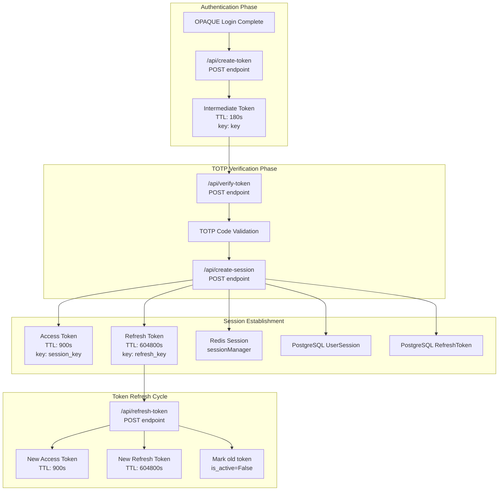
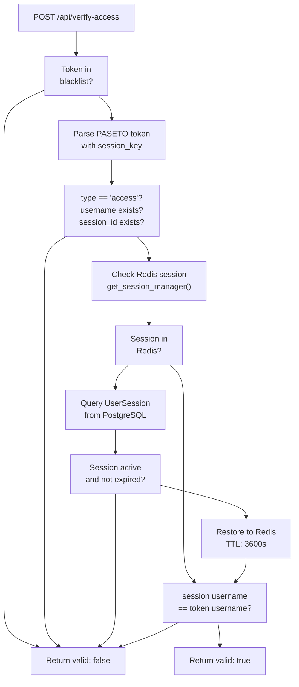
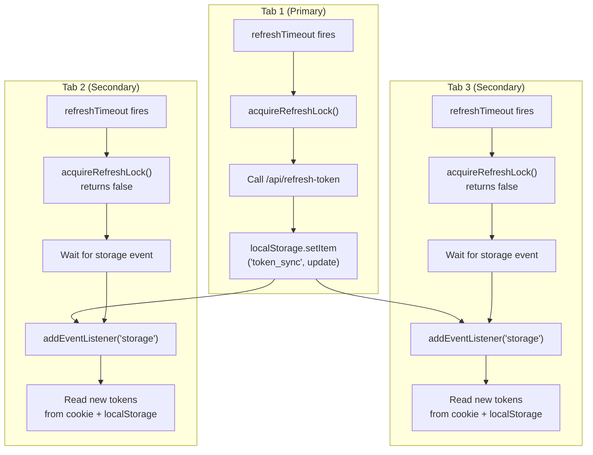
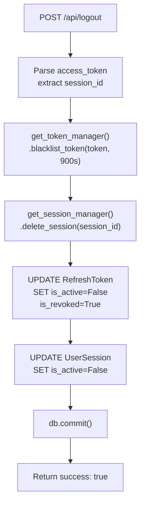

# Session and Token Management

> **Relevant source files**
> * [back-end/main.py](https://github.com/RogueElectron/Cypher1/blob/c60431e6/back-end/main.py)
> * [back-end/node_internal_api/app.js](https://github.com/RogueElectron/Cypher1/blob/c60431e6/back-end/node_internal_api/app.js)
> * [back-end/src/index.js](https://github.com/RogueElectron/Cypher1/blob/c60431e6/back-end/src/index.js)
> * [back-end/src/session-manager.js](https://github.com/RogueElectron/Cypher1/blob/c60431e6/back-end/src/session-manager.js)
> * [back-end/static/dist/index.js](https://github.com/RogueElectron/Cypher1/blob/c60431e6/back-end/static/dist/index.js)
> * [back-end/static/dist/session-manager.js](https://github.com/RogueElectron/Cypher1/blob/c60431e6/back-end/static/dist/session-manager.js)

## Purpose and Scope

This document describes the stateless session management system in the Cypher platform, which uses PASETO tokens to maintain authenticated user sessions. The system manages three distinct token types with different lifetimes and purposes, implements automatic token rotation, and coordinates session state across multiple browser tabs.

For information about the authentication workflows that create these sessions, see [Authentication Workflows](/RogueElectron/Cypher1/3.4-authentication-workflows). For client-side authentication logic, see [Session Manager Module](/RogueElectron/Cypher1/5.3-session-manager-module). For data storage details, see [PostgreSQL Schema](/RogueElectron/Cypher1/6.1-postgresql-schema) and [Redis Caching and Rate Limiting](/RogueElectron/Cypher1/6.2-redis-caching-and-rate-limiting).

---

## Token Architecture

The Cypher platform implements a three-tier token system using PASETO (Platform-Agnostic Security Tokens) v4 with local (symmetric) mode. Each token type serves a specific purpose in the authentication and session lifecycle.

### Token Types

| Token Type | Lifetime | Purpose | Storage Location | Key Used |
| --- | --- | --- | --- | --- |
| Intermediate Token (`pass_auth_token`) | 3 minutes | Bridge between OPAQUE authentication and TOTP verification | HttpOnly cookie | `key` |
| Access Token | 15 minutes | Authorize API requests and validate active sessions | HttpOnly cookie | `session_key` |
| Refresh Token | 7 days | Generate new access tokens without re-authentication | `localStorage` | `refresh_key` |

### PASETO Token Structure

All tokens are created using the `paseto.create()` function with symmetric encryption. Each token type contains specific claims:

**Intermediate Token Claims** ([main.py L100-L110](https://github.com/RogueElectron/Cypher1/blob/c60431e6/main.py#L100-L110)

):

```
{
  "username": string,
  "pass_authed": boolean
}
```

**Access Token Claims** ([main.py L216-L222](https://github.com/RogueElectron/Cypher1/blob/c60431e6/main.py#L216-L222)

):

```
{
  "username": string,
  "user_id": string,
  "session_id": string,
  "type": "access",
  "iat": timestamp
}
```

**Refresh Token Claims** ([main.py L234-L241](https://github.com/RogueElectron/Cypher1/blob/c60431e6/main.py#L234-L241)

):

```
{
  "username": string,
  "user_id": string,
  "session_id": string,
  "type": "refresh",
  "token_id": string,
  "iat": timestamp
}
```

### Symmetric Key Management

Three separate symmetric keys prevent token type confusion attacks. Keys are generated at application startup using `SymmetricKey.generate(protocol=ProtocolVersion4)` ([main.py L32-L34](https://github.com/RogueElectron/Cypher1/blob/c60431e6/main.py#L32-L34)

):

* `key`: Used for intermediate tokens during the authentication bridge phase
* `session_key`: Used for access tokens that authorize requests
* `refresh_key`: Used for refresh tokens that enable token rotation

**Sources:** [back-end/main.py L32-L34](https://github.com/RogueElectron/Cypher1/blob/c60431e6/back-end/main.py#L32-L34)

 [back-end/main.py L100-L110](https://github.com/RogueElectron/Cypher1/blob/c60431e6/back-end/main.py#L100-L110)

 [back-end/main.py L216-L241](https://github.com/RogueElectron/Cypher1/blob/c60431e6/back-end/main.py#L216-L241)

---

## Token Flow Diagram



**Sources:** [back-end/node_internal_api/app.js L283-L314](https://github.com/RogueElectron/Cypher1/blob/c60431e6/back-end/node_internal_api/app.js#L283-L314)

 [back-end/main.py L92-L112](https://github.com/RogueElectron/Cypher1/blob/c60431e6/back-end/main.py#L92-L112)

 [back-end/main.py L150-L304](https://github.com/RogueElectron/Cypher1/blob/c60431e6/back-end/main.py#L150-L304)

 [back-end/main.py L388-L512](https://github.com/RogueElectron/Cypher1/blob/c60431e6/back-end/main.py#L388-L512)

---

## Session Lifecycle

### Session Creation

Session creation occurs after successful TOTP verification via the `/api/create-session` endpoint. The process involves multiple storage layers and security checks.

#### Rate Limiting

Before creating a session, the system enforces rate limits to prevent abuse ([main.py L161-L172](https://github.com/RogueElectron/Cypher1/blob/c60431e6/main.py#L161-L172)

):

```markdown
rate_limit = get_rate_limiter().check_rate_limit(
    identifier=client_ip,
    limit=10,  # 10 requests per minute
    window_seconds=60,
    category="session_creation"
)
```

#### Dual Storage Strategy

Sessions are stored in both Redis (for performance) and PostgreSQL (for durability):

**Redis Session** ([main.py L187-L201](https://github.com/RogueElectron/Cypher1/blob/c60431e6/main.py#L187-L201)

):

* TTL: 3600 seconds (1 hour)
* Contains user metadata and device fingerprint
* Managed by `sessionManager` from `get_session_manager()`
* Returns `session_id` which must be used consistently

**PostgreSQL UserSession** ([main.py L204-L213](https://github.com/RogueElectron/Cypher1/blob/c60431e6/main.py#L204-L213)

):

* Persistent record with `expires_at` timestamp
* Stores encrypted session data via `set_session_data()`
* Linked to user via `user_id` foreign key

#### Token Generation

After session creation, the system generates both access and refresh tokens with the same `session_id` ([main.py L216-L249](https://github.com/RogueElectron/Cypher1/blob/c60431e6/main.py#L216-L249)

):

1. **Access Token**: 15-minute lifetime, stored in HttpOnly cookie
2. **Refresh Token**: 7-day lifetime, stored in `localStorage`
3. **Refresh Token Record**: Saved to PostgreSQL with `token_id` and `token_hash`

#### Audit Logging

Each session creation is recorded in the `AuditLog` table ([main.py L277-L291](https://github.com/RogueElectron/Cypher1/blob/c60431e6/main.py#L277-L291)

):

```
audit_log = AuditLog(
    event_type='session_created',
    event_category='AUTH',
    severity='INFO',
    user_id=user.id,
    session_id=session_id,
    ip_address=client_ip,
    user_agent=request.headers.get('User-Agent', ''),
    success=True
)
```

**Sources:** [back-end/main.py L150-L304](https://github.com/RogueElectron/Cypher1/blob/c60431e6/back-end/main.py#L150-L304)

---

## Session Validation

### Access Token Verification

The `/api/verify-access` endpoint validates access tokens through a multi-layer check ([main.py L307-L385](https://github.com/RogueElectron/Cypher1/blob/c60431e6/main.py#L307-L385)

):



#### Blacklist Check

Before parsing, the system checks if the token has been blacklisted ([main.py L317-L319](https://github.com/RogueElectron/Cypher1/blob/c60431e6/main.py#L317-L319)

):

```
if get_token_manager().is_token_blacklisted(access_token):
    return jsonify({'valid': False, 'error': 'Token blacklisted'}), 401
```

#### Session Validation Layers

1. **Redis Check**: Fast lookup using `get_session_manager().get_session(session_id)` ([main.py L343-L344](https://github.com/RogueElectron/Cypher1/blob/c60431e6/main.py#L343-L344) )
2. **PostgreSQL Fallback**: Query `UserSession` table if Redis cache miss ([main.py L347-L355](https://github.com/RogueElectron/Cypher1/blob/c60431e6/main.py#L347-L355) )
3. **Session Restoration**: Re-populate Redis cache from PostgreSQL if session is valid ([main.py L357-L362](https://github.com/RogueElectron/Cypher1/blob/c60431e6/main.py#L357-L362) )

#### Session-Username Verification

Critical security check ensures the session belongs to the claimed user ([main.py L369-L371](https://github.com/RogueElectron/Cypher1/blob/c60431e6/main.py#L369-L371)

):

```
session_data = redis_session.get('data', {}) if redis_session else {}
if session_data.get('username') != username:
    return jsonify({'valid': False, 'error': 'Session mismatch'}), 401
```

**Sources:** [back-end/main.py L307-L385](https://github.com/RogueElectron/Cypher1/blob/c60431e6/back-end/main.py#L307-L385)

---

## Token Refresh Mechanism

### Automatic Refresh Scheduling

The client-side `SessionManager` schedules automatic token refresh 12 minutes after receiving tokens (3 minutes before the 15-minute expiry) with randomized jitter to prevent thundering herd effects ([session-manager.js L72-L75](https://github.com/RogueElectron/Cypher1/blob/c60431e6/session-manager.js#L72-L75)

):

```javascript
const ROTATION_INTERVAL = 720; // 12 minutes  
const jitter = Math.random() * 60; // random 0-60 seconds
this.scheduleRefresh(ROTATION_INTERVAL + jitter);
```

### Token Rotation Flow

```mermaid
sequenceDiagram
  participant SessionManager
  participant /api/refresh-token
  participant PostgreSQL
  participant Redis

  SessionManager->>SessionManager: "refreshTimeout fires
  SessionManager->>SessionManager: (12 min + jitter)"
  note over SessionManager: "Lock prevents multiple
  SessionManager->>/api/refresh-token: "acquireRefreshLock()"
  /api/refresh-token->>/api/refresh-token: "POST refresh_token"
  /api/refresh-token->>PostgreSQL: "Parse with refresh_key"
  loop [Token Valid and Active]
    /api/refresh-token->>PostgreSQL: "Query RefreshToken
    /api/refresh-token->>PostgreSQL: by token_id"
    /api/refresh-token->>/api/refresh-token: "Mark token is_active=False
    /api/refresh-token->>/api/refresh-token: used_at=now()"
    /api/refresh-token->>PostgreSQL: "Verify UserSession still active"
    /api/refresh-token->>Redis: "Generate new access token
    /api/refresh-token-->>SessionManager: (900s TTL)"
    SessionManager->>SessionManager: "Generate new refresh token
    SessionManager->>SessionManager: (604800s TTL)"
    SessionManager->>SessionManager: "Insert new RefreshToken
    /api/refresh-token-->>SessionManager: refreshed_from=old_token_id"
    SessionManager->>SessionManager: "Cache new refresh token
  end
```

### One-Time Use Refresh Tokens

Refresh tokens are single-use only. The `/api/refresh-token` endpoint marks the old token as inactive before issuing new tokens ([main.py L429-L430](https://github.com/RogueElectron/Cypher1/blob/c60431e6/main.py#L429-L430)

):

```
db_token.is_active = False
db_token.used_at = datetime.datetime.utcnow()
```

The new refresh token maintains an audit trail by storing the previous token ID ([main.py L489-L491](https://github.com/RogueElectron/Cypher1/blob/c60431e6/main.py#L489-L491)

):

```
new_db_token.set_token_data({
    'refreshed_from': token_id
})
```

### Session Continuity Check

Before issuing new tokens, the system verifies the session still exists and is active ([main.py L433-L442](https://github.com/RogueElectron/Cypher1/blob/c60431e6/main.py#L433-L442)

):

```
redis_session = get_session_manager().get_session(session_id)
if not redis_session:
    db_session_obj = db.query(UserSession).filter_by(
        session_id=session_id,
        is_active=True
    ).first()
    
    if not db_session_obj or db_session_obj.is_expired():
        return jsonify({'error': 'Session expired'}), 401
```

**Sources:** [back-end/main.py L388-L512](https://github.com/RogueElectron/Cypher1/blob/c60431e6/back-end/main.py#L388-L512)

 [back-end/src/session-manager.js L99-L227](https://github.com/RogueElectron/Cypher1/blob/c60431e6/back-end/src/session-manager.js#L99-L227)

---

## Multi-Tab Synchronization

The client-side `SessionManager` uses `localStorage` events to coordinate token state across multiple browser tabs, preventing duplicate refresh requests and ensuring consistent session state.

### Storage Event Synchronization



### Refresh Lock Mechanism

The `acquireRefreshLock()` function uses `localStorage` as a distributed lock ([session-manager.js L159-L192](https://github.com/RogueElectron/Cypher1/blob/c60431e6/session-manager.js#L159-L192)

):

1. **Lock Creation**: Each tab generates a unique `tabId` and timestamp
2. **Atomic Check**: Use `localStorage.setItem()` followed by `getItem()` to detect race conditions
3. **Stale Lock Handling**: Locks older than 10 seconds are considered stale and can be stolen
4. **Lock Release**: Winner tab calls `releaseRefreshLock()` after refresh completes

```javascript
const lockValue = JSON.stringify({
    timestamp: now,
    tabId: tabId
});

localStorage.setItem('refresh_lock', lockValue);
const actualLock = localStorage.getItem('refresh_lock');

if (actualLock !== lockValue) {
    // Another tab won, check if their lock is stale
    const lockData = JSON.parse(actualLock);
    if (now - lockData.timestamp > 10000) {
        // Steal stale lock
    }
    return false;
}
```

### Token Sync Protocol

The `token_sync` localStorage key broadcasts token updates ([session-manager.js L13-L36](https://github.com/RogueElectron/Cypher1/blob/c60431e6/session-manager.js#L13-L36)

):

**Update Event** (sent by tab that refreshed tokens):

```sql
{
  "action": "update",
  "timestamp": 1234567890
}
```

**Clear Event** (sent during logout):

```json
{
  "action": "clear",
  "timestamp": 1234567890
}
```

### Passive Tab Behavior

Tabs that lose the refresh lock wait for the winner to complete ([session-manager.js L122-L143](https://github.com/RogueElectron/Cypher1/blob/c60431e6/session-manager.js#L122-L143)

):

```javascript
return new Promise((resolve) => {
    const handleTokenSync = (event) => {
        if (event.key === 'token_sync') {
            const syncData = JSON.parse(event.newValue || '{}');
            if (syncData.action === 'update') {
                this.accessToken = this.getCookie('access_token');
                this.refreshToken = localStorage.getItem('refresh_token');
                window.removeEventListener('storage', handleTokenSync);
                resolve();
            }
        }
    };
    
    window.addEventListener('storage', handleTokenSync);
    
    // Timeout after 10 seconds
    setTimeout(() => {
        window.removeEventListener('storage', handleTokenSync);
        resolve();
    }, 10000);
});
```

**Sources:** [back-end/src/session-manager.js L9-L157](https://github.com/RogueElectron/Cypher1/blob/c60431e6/back-end/src/session-manager.js#L9-L157)

 [back-end/src/session-manager.js L159-L196](https://github.com/RogueElectron/Cypher1/blob/c60431e6/back-end/src/session-manager.js#L159-L196)

---

## Client-Side Session Manager

The `SessionManager` class ([session-manager.js L1-L355](https://github.com/RogueElectron/Cypher1/blob/c60431e6/session-manager.js#L1-L355)

) orchestrates all client-side session operations, token storage, and authenticated API requests.

### Token Storage Strategy

| Token Type | Storage Method | Reason |
| --- | --- | --- |
| Access Token | HttpOnly Cookie (`access_token`) | Automatically sent with requests; protected from XSS |
| Refresh Token | `localStorage` (`refresh_token`) | Long-lived; not sent with every request; accessible to JavaScript |

### Cookie Management

The `SessionManager` implements cookie helpers that respect the transport security context ([session-manager.js L39-L54](https://github.com/RogueElectron/Cypher1/blob/c60431e6/session-manager.js#L39-L54)

):

```javascript
setCookie(name, value, maxAge) {
    const secure = location.protocol === 'https:' ? '; Secure' : '';
    const cookie = `${name}=${value}; Max-Age=${maxAge}; SameSite=Lax; Path=/${secure}`;
    document.cookie = cookie;
}

getCookie(name) {
    const value = `; ${document.cookie}`;
    const parts = value.split(`; ${name}=`);
    if (parts.length === 2) return parts.pop().split(';').shift();
    return null;
}
```

### Session Loading on Page Load

The `SessionManager` automatically loads and verifies tokens when the page loads ([index.js L9-L28](https://github.com/RogueElectron/Cypher1/blob/c60431e6/index.js#L9-L28)

):

```javascript
document.addEventListener('DOMContentLoaded', async () => {
    const hasSession = sessionManager.loadTokens();
    
    if (hasSession) {
        try {
            const currentUser = await sessionManager.getCurrentUser();
            if (currentUser) {
                showAuthenticatedView(currentUser.username, container);
            } else {
                showUnauthenticatedView(container);
            }
        } catch (error) {
            showUnauthenticatedView(container);
        }
    }
});
```

The `loadTokens()` method ([session-manager.js L78-L89](https://github.com/RogueElectron/Cypher1/blob/c60431e6/session-manager.js#L78-L89)

):

1. Retrieves access token from cookie
2. Retrieves refresh token from localStorage
3. Verifies token validity with server
4. Falls back to refresh if verification fails

### Authenticated Fetch Wrapper

The `authenticatedFetch()` method automatically handles token injection and refresh on 401 responses ([session-manager.js L254-L288](https://github.com/RogueElectron/Cypher1/blob/c60431e6/session-manager.js#L254-L288)

):

```javascript
async authenticatedFetch(url, options = {}) {
    const body = options.body ? JSON.parse(options.body) : {};
    body.access_token = this.accessToken;

    const authOptions = {
        ...options,
        headers: {
            'Content-Type': 'application/json',
            ...options.headers
        },
        body: JSON.stringify(body)
    };

    const response = await fetch(url, authOptions);
    
    if (response.status === 401) {
        // Token expired, refresh and retry
        await this.refreshTokens();
        const newBody = JSON.parse(authOptions.body);
        newBody.access_token = this.accessToken;
        authOptions.body = JSON.stringify(newBody);
        return fetch(url, authOptions);
    }
    
    return response;
}
```

**Sources:** [back-end/src/session-manager.js L1-L342](https://github.com/RogueElectron/Cypher1/blob/c60431e6/back-end/src/session-manager.js#L1-L342)

 [back-end/src/index.js L5-L29](https://github.com/RogueElectron/Cypher1/blob/c60431e6/back-end/src/index.js#L5-L29)

---

## Session Termination

### Logout Endpoint

The `/api/logout` endpoint ([main.py L515-L560](https://github.com/RogueElectron/Cypher1/blob/c60431e6/main.py#L515-L560)

) performs comprehensive cleanup across all storage layers:



#### Token Blacklisting

Access tokens are blacklisted in Redis with TTL matching their remaining lifetime ([main.py L536](https://github.com/RogueElectron/Cypher1/blob/c60431e6/main.py#L536-L536)

):

```
get_token_manager().blacklist_token(access_token, ttl=900)
```

This prevents revoked tokens from being used even if they haven't expired.

#### Session Cleanup Steps

1. **Blacklist Access Token**: Add to Redis blacklist for 15 minutes
2. **Delete Redis Session**: Remove from `sessionManager` cache
3. **Revoke Refresh Tokens**: Mark all session's refresh tokens as `is_revoked=True` ([main.py L543-L546](https://github.com/RogueElectron/Cypher1/blob/c60431e6/main.py#L543-L546) )
4. **Deactivate Session**: Set `is_active=False` in `UserSession` table ([main.py L549-L551](https://github.com/RogueElectron/Cypher1/blob/c60431e6/main.py#L549-L551) )

### Client-Side Cleanup

The `SessionManager.logout()` method ([session-manager.js L289-L305](https://github.com/RogueElectron/Cypher1/blob/c60431e6/session-manager.js#L289-L305)

) calls the server endpoint then performs local cleanup:

```yaml
async logout() {
    try {
        await fetch('/api/logout', {
            method: 'POST',
            headers: { 'Content-Type': 'application/json' },
            credentials: 'include',
            body: JSON.stringify({
                access_token: this.accessToken,
                refresh_token: this.refreshToken
            })
        });
    } finally {
        this.clearSession();
    }
}
```

The `clearSession()` method ([session-manager.js L307-L325](https://github.com/RogueElectron/Cypher1/blob/c60431e6/session-manager.js#L307-L325)

):

* Nulls in-memory token references
* Deletes access token cookie
* Removes refresh token from localStorage
* Removes refresh lock if held
* Broadcasts clear event to other tabs
* Cancels scheduled refresh timeout

**Sources:** [back-end/main.py L515-L560](https://github.com/RogueElectron/Cypher1/blob/c60431e6/back-end/main.py#L515-L560)

 [back-end/src/session-manager.js L289-L325](https://github.com/RogueElectron/Cypher1/blob/c60431e6/back-end/src/session-manager.js#L289-L325)

---

## Security Features

### Token Type Validation

Each endpoint validates the `type` claim to prevent token type confusion attacks:

**Access Token Validation** ([main.py L332-L333](https://github.com/RogueElectron/Cypher1/blob/c60431e6/main.py#L332-L333)

):

```
if access_claims.get('type') != 'access':
    return jsonify({'valid': False, 'error': 'Invalid token type'}), 401
```

**Refresh Token Validation** ([main.py L406-L407](https://github.com/RogueElectron/Cypher1/blob/c60431e6/main.py#L406-L407)

):

```
if refresh_claims.get('type') != 'refresh':
    return jsonify({'error': 'Invalid token type'}), 401
```

### Rate Limiting

Session creation is rate-limited per client IP address ([main.py L161-L172](https://github.com/RogueElectron/Cypher1/blob/c60431e6/main.py#L161-L172)

):

* **Limit**: 10 requests per minute
* **Category**: `"session_creation"`
* **Implementation**: Redis-backed rate limiter via `get_rate_limiter()`

### Session Fingerprinting

Each session records device metadata for anomaly detection ([main.py L187-L193](https://github.com/RogueElectron/Cypher1/blob/c60431e6/main.py#L187-L193)

):

```
session_data = {
    'user_id': str(user.id),
    'username': username,
    'ip_address': client_ip,
    'user_agent': request.headers.get('User-Agent', ''),
    'device_fingerprint': data.get('device_fingerprint', '')
}
```

### Refresh Token Audit Trail

The `RefreshToken` table maintains a chain of token generations via the `refreshed_from` field ([main.py L489-L491](https://github.com/RogueElectron/Cypher1/blob/c60431e6/main.py#L489-L491)

), enabling:

* Token family tracking
* Breach detection (reuse of revoked refresh token indicates compromise)
* Forensic analysis of session hijacking attempts

### Expiration Checks

All token operations verify expiration:

* **PASETO Built-in**: `paseto.parse()` raises `paseto.ExpireError` for expired tokens
* **Database Expiration**: `UserSession.is_expired()` and `RefreshToken.is_expired()` check `expires_at` timestamps
* **Redis TTL**: Automatic expiration via time-to-live values

**Sources:** [back-end/main.py L161-L172](https://github.com/RogueElectron/Cypher1/blob/c60431e6/back-end/main.py#L161-L172)

 [back-end/main.py L317-L333](https://github.com/RogueElectron/Cypher1/blob/c60431e6/back-end/main.py#L317-L333)

 [back-end/main.py L406-L407](https://github.com/RogueElectron/Cypher1/blob/c60431e6/back-end/main.py#L406-L407)

 [back-end/main.py L425-L426](https://github.com/RogueElectron/Cypher1/blob/c60431e6/back-end/main.py#L425-L426)

 [back-end/main.py L441-L442](https://github.com/RogueElectron/Cypher1/blob/c60431e6/back-end/main.py#L441-L442)

---

## Storage Architecture Summary

### Redis Keys and Managers

| Manager | Keys | TTL | Purpose |
| --- | --- | --- | --- |
| `sessionManager` | `session:{session_id}` | 3600s | Fast session lookup |
| `tokenManager` | `token_blacklist:{token_hash}` | 900s | Revoked access tokens |
| `tokenManager` | `refresh_token:{user_id}:{token_id}` | 604800s | Cached refresh tokens |
| `rateLimiter` | `rate_limit:{category}:{identifier}` | 60s | Request counting |

### PostgreSQL Tables

| Table | Key Columns | Indexes | Purpose |
| --- | --- | --- | --- |
| `UserSession` | `session_id` (PK), `user_id` (FK) | `user_id`, `is_active` | Durable session records |
| `RefreshToken` | `token_id` (PK), `user_id` (FK), `session_id` (FK) | `user_id`, `session_id`, `is_active` | Refresh token lifecycle |
| `AuditLog` | `id` (PK), `user_id` (FK), `session_id` | `user_id`, `event_type`, `timestamp` | Security audit trail |

### Cache Fallback Pattern

The system implements a **cache-aside** pattern where Redis serves as a performance layer with PostgreSQL as the source of truth:

1. **Read**: Check Redis → On miss, query PostgreSQL → Restore to Redis
2. **Write**: Write to PostgreSQL → Cache in Redis
3. **Delete**: Remove from Redis → Mark inactive in PostgreSQL

This pattern is visible in the access token verification flow ([main.py L343-L362](https://github.com/RogueElectron/Cypher1/blob/c60431e6/main.py#L343-L362)

) where a Redis cache miss triggers a PostgreSQL lookup and cache restoration.

**Sources:** [back-end/main.py L187-L201](https://github.com/RogueElectron/Cypher1/blob/c60431e6/back-end/main.py#L187-L201)

 [back-end/main.py L204-L213](https://github.com/RogueElectron/Cypher1/blob/c60431e6/back-end/main.py#L204-L213)

 [back-end/main.py L252-L263](https://github.com/RogueElectron/Cypher1/blob/c60431e6/back-end/main.py#L252-L263)

 [back-end/main.py L266-L271](https://github.com/RogueElectron/Cypher1/blob/c60431e6/back-end/main.py#L266-L271)

 [back-end/main.py L343-L362](https://github.com/RogueElectron/Cypher1/blob/c60431e6/back-end/main.py#L343-L362)