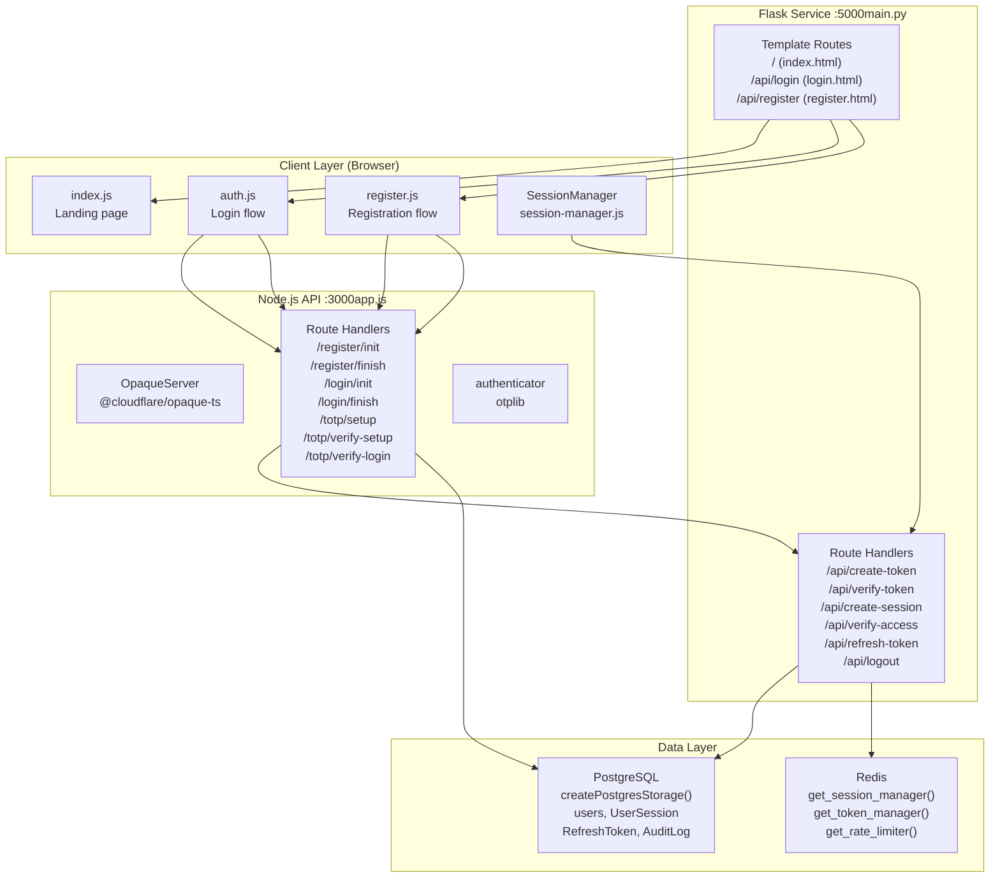
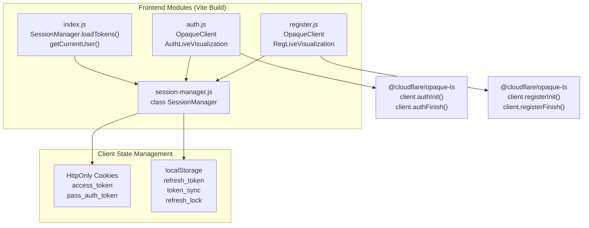
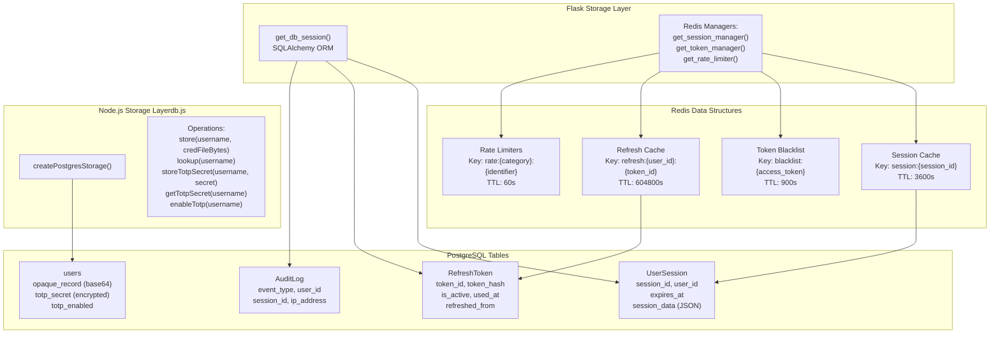

# System Architecture

> **Relevant source files**
> * [back-end/main.py](https://github.com/RogueElectron/Cypher1/blob/c60431e6/back-end/main.py)
> * [back-end/node_internal_api/app.js](https://github.com/RogueElectron/Cypher1/blob/c60431e6/back-end/node_internal_api/app.js)
> * [back-end/src/auth.js](https://github.com/RogueElectron/Cypher1/blob/c60431e6/back-end/src/auth.js)
> * [back-end/src/index.js](https://github.com/RogueElectron/Cypher1/blob/c60431e6/back-end/src/index.js)
> * [back-end/src/session-manager.js](https://github.com/RogueElectron/Cypher1/blob/c60431e6/back-end/src/session-manager.js)
> * [back-end/static/dist/index.js](https://github.com/RogueElectron/Cypher1/blob/c60431e6/back-end/static/dist/index.js)
> * [back-end/static/dist/session-manager.js](https://github.com/RogueElectron/Cypher1/blob/c60431e6/back-end/static/dist/session-manager.js)

## Purpose and Scope

This document describes the high-level system design of the Cypher authentication platform, detailing the relationships between major components, inter-service communication patterns, and key architectural decisions. For details on specific authentication workflows, see [Authentication Workflows](/RogueElectron/Cypher1/3.4-authentication-workflows). For information on individual backend services, see [Flask Session Service](/RogueElectron/Cypher1/4.1-flask-session-service) and [Node.js Internal API](/RogueElectron/Cypher1/4.2-node.js-internal-api). For data storage implementation details, see [Data Layer](/RogueElectron/Cypher1/6-data-layer).

---

## High-Level Architecture Overview

The Cypher platform implements a **three-tier architecture** with clear separation of concerns across cryptographic operations, session management, and data persistence. The system consists of two backend services (Flask and Node.js), a compiled JavaScript frontend, and a dual-storage data layer (PostgreSQL + Redis).

### Component Architecture Diagram



**Sources:** [back-end/main.py L1-L564](https://github.com/RogueElectron/Cypher1/blob/c60431e6/back-end/main.py#L1-L564)

 [back-end/node_internal_api/app.js L1-L502](https://github.com/RogueElectron/Cypher1/blob/c60431e6/back-end/node_internal_api/app.js#L1-L502)

 [back-end/src/session-manager.js L1-L355](https://github.com/RogueElectron/Cypher1/blob/c60431e6/back-end/src/session-manager.js#L1-L355)

 [back-end/src/auth.js L1-L471](https://github.com/RogueElectron/Cypher1/blob/c60431e6/back-end/src/auth.js#L1-L471)

---

## Service Layer Architecture

The backend consists of two independent services that communicate via HTTP. This separation ensures cryptographic operations remain isolated from session management logic.

### Flask Session Service

The Flask service (`main.py`) operates on **port 5000** and serves three primary roles:

| Responsibility | Implementation | Key Functions |
| --- | --- | --- |
| Token Management | PASETO v4.public tokens with three symmetric keys | `create_token()`, `verify_token()`, `create_session()`, `refresh_token()` |
| Session Lifecycle | Redis cache + PostgreSQL persistence | `get_session_manager()`, `get_db_session()` |
| Rate Limiting | Per-IP request counters via Redis | `get_rate_limiter().check_rate_limit()` |
| Frontend Serving | Jinja2 templates + static assets | `serve_index()`, `serve_login()`, `serve_register()` |

**Token Types:**

* **Intermediate Token** (`key`): 180-second lifetime, bridges OPAQUE completion to TOTP verification [main.py L100-L112](https://github.com/RogueElectron/Cypher1/blob/c60431e6/main.py#L100-L112)
* **Access Token** (`session_key`): 900-second lifetime, stored in HttpOnly cookie [main.py L216-L230](https://github.com/RogueElectron/Cypher1/blob/c60431e6/main.py#L216-L230)
* **Refresh Token** (`refresh_key`): 7-day lifetime, one-time use, stored in localStorage [main.py L233-L250](https://github.com/RogueElectron/Cypher1/blob/c60431e6/main.py#L233-L250)

**Sources:** [back-end/main.py L1-L564](https://github.com/RogueElectron/Cypher1/blob/c60431e6/back-end/main.py#L1-L564)

### Node.js Internal API

The Node.js service (`app.js`) operates on **port 3000** and handles all cryptographic operations:

| Responsibility | Implementation | Key Objects |
| --- | --- | --- |
| OPAQUE Protocol | Server-side OPAQUE with P-256 curve | `OpaqueServer`, `cfg`, `serverAkeKeypair` |
| TOTP Generation | Secret generation and QR code creation | `authenticator.generateSecret()`, `QRCode.toDataURL()` |
| Credential Storage | PostgreSQL via custom storage layer | `database.store()`, `database.lookup()`, `database.storeTotpSecret()` |
| Account Verification | Cleanup timer for unverified accounts | `scheduleAccountCleanup()`, `markAccountVerified()` |

**OPAQUE Configuration:**

```javascript
const cfg = getOpaqueConfig(OpaqueID.OPAQUE_P256);  // [app.js:82]
const oprfSeed = cfg.prng.random(cfg.hash.Nh);
const serverAkeKeypair = await cfg.ake.deriveAuthKeyPair(serverKeypairSeed);
const server = new OpaqueServer(cfg, oprfSeed, akeKeypairExport);
```

**Sources:** [back-end/node_internal_api/app.js L1-L502](https://github.com/RogueElectron/Cypher1/blob/c60431e6/back-end/node_internal_api/app.js#L1-L502)

### Service Communication Pattern

Inter-service communication occurs via internal HTTP calls from Node.js to Flask:

```mermaid
sequenceDiagram
  participant Client Browser
  participant NodeAPI as Node.js API
  participant app.js
  participant FlaskAPI as Flask API
  participant main.py
  participant Redis
  participant get_session_manager()
  participant PostgreSQL
  participant get_db_session()

  note over Client Browser,get_db_session(): OPAQUE Authentication Phase
  Client Browser->>Node.js :3000: "POST /login/finish
  Node.js :3000->>Node.js :3000: {username, serke3}"
  note over Client Browser,get_db_session(): Internal Token Creation
  Node.js :3000->>Flask :5000: "server.authFinish(deser_ke3, expected)"
  Flask :5000->>Flask :5000: "fetch('http://localhost:5000/api/create-token')"
  Flask :5000-->>Node.js :3000: "paseto.create(key=key, exp_seconds=180)"
  Node.js :3000-->>Client Browser: "{token: pass_auth_token}"
  note over Client Browser,get_db_session(): TOTP Verification Phase
  Client Browser->>Node.js :3000: "{success: true, token: pass_auth_token}"
  Node.js :3000->>Flask :5000: "POST /totp/verify-login
  Flask :5000->>Flask :5000: {username, token, passAuthToken}"
  Flask :5000-->>Node.js :3000: "fetch('http://localhost:5000/api/verify-token')"
  Node.js :3000->>Node.js :3000: "paseto.parse(key=key, token=token)"
  note over Client Browser,get_db_session(): Session Creation
  Node.js :3000->>Flask :5000: "{valid: true}"
  Flask :5000->>Redis: "authenticator.verify({token, secret})"
  Flask :5000->>PostgreSQL: "fetch('http://localhost:5000/api/create-session')"
  Flask :5000->>Flask :5000: "create_session(user_id, session_data, ttl=3600)"
  Flask :5000-->>Node.js :3000: "db_session.add(UserSession)
  Node.js :3000-->>Client Browser: db_session.add(RefreshToken)"
```

**Key Internal Endpoints:**

* **`POST /api/create-token`**: Creates 3-minute intermediate token after OPAQUE success [main.py L92-L112](https://github.com/RogueElectron/Cypher1/blob/c60431e6/main.py#L92-L112)
* **`POST /api/verify-token`**: Validates intermediate token during TOTP phase [main.py L114-L149](https://github.com/RogueElectron/Cypher1/blob/c60431e6/main.py#L114-L149)
* **`POST /api/create-session`**: Issues PASETO access/refresh tokens after 2FA [main.py L150-L304](https://github.com/RogueElectron/Cypher1/blob/c60431e6/main.py#L150-L304)

**Sources:** [back-end/node_internal_api/app.js L284-L314](https://github.com/RogueElectron/Cypher1/blob/c60431e6/back-end/node_internal_api/app.js#L284-L314)

 [back-end/node_internal_api/app.js L405-L428](https://github.com/RogueElectron/Cypher1/blob/c60431e6/back-end/node_internal_api/app.js#L405-L428)

 [back-end/node_internal_api/app.js L453-L487](https://github.com/RogueElectron/Cypher1/blob/c60431e6/back-end/node_internal_api/app.js#L453-L487)

 [back-end/main.py L92-L304](https://github.com/RogueElectron/Cypher1/blob/c60431e6/back-end/main.py#L92-L304)

---

## Client-Side Architecture

The frontend consists of four compiled JavaScript modules built via Vite. Each module has specific responsibilities in the authentication lifecycle.

### Module Responsibilities



**Sources:** [back-end/src/index.js L1-L155](https://github.com/RogueElectron/Cypher1/blob/c60431e6/back-end/src/index.js#L1-L155)

 [back-end/src/auth.js L1-L471](https://github.com/RogueElectron/Cypher1/blob/c60431e6/back-end/src/auth.js#L1-L471)

 [back-end/src/session-manager.js L1-L355](https://github.com/RogueElectron/Cypher1/blob/c60431e6/back-end/src/session-manager.js#L1-L355)

### SessionManager Class

The `SessionManager` class in `session-manager.js` manages token lifecycle and multi-tab synchronization:

| Method | Purpose | Key Implementation |
| --- | --- | --- |
| `setTokens()` | Store new tokens and schedule refresh | Sets `access_token` cookie, `refresh_token` in localStorage, schedules refresh in 720s + jitter [session-manager.js L56-L76](https://github.com/RogueElectron/Cypher1/blob/c60431e6/session-manager.js#L56-L76) |
| `loadTokens()` | Restore tokens on page load | Reads cookie and localStorage, verifies token validity [session-manager.js L78-L89](https://github.com/RogueElectron/Cypher1/blob/c60431e6/session-manager.js#L78-L89) |
| `refreshTokens()` | Rotate tokens before expiry | Acquires lock, calls `/api/refresh-token`, updates all tabs [session-manager.js L109-L157](https://github.com/RogueElectron/Cypher1/blob/c60431e6/session-manager.js#L109-L157) |
| `authenticatedFetch()` | Wrapper for authenticated API calls | Injects `access_token` in request body, handles 401 responses [session-manager.js L254-L288](https://github.com/RogueElectron/Cypher1/blob/c60431e6/session-manager.js#L254-L288) |
| `setupStorageSync()` | Synchronize state across browser tabs | Listens to `storage` events for `token_sync` and `refresh_token` changes [session-manager.js L13-L37](https://github.com/RogueElectron/Cypher1/blob/c60431e6/session-manager.js#L13-L37) |

**Multi-Tab Coordination:**

* **Refresh Lock**: Uses `localStorage` item `refresh_lock` with timestamp and random `tabId` to prevent concurrent refresh attempts [session-manager.js L159-L196](https://github.com/RogueElectron/Cypher1/blob/c60431e6/session-manager.js#L159-L196)
* **Token Sync**: Broadcasts token updates via `localStorage.setItem('token_sync', ...)` which triggers `storage` events in other tabs [session-manager.js L67-L70](https://github.com/RogueElectron/Cypher1/blob/c60431e6/session-manager.js#L67-L70)

**Sources:** [back-end/src/session-manager.js L1-L355](https://github.com/RogueElectron/Cypher1/blob/c60431e6/back-end/src/session-manager.js#L1-L355)

---

## Data Layer Architecture

The system employs a **dual-storage strategy** optimizing for both durability (PostgreSQL) and performance (Redis).

### Storage Allocation



**Sources:** [back-end/node_internal_api/db.js](https://github.com/RogueElectron/Cypher1/blob/c60431e6/back-end/node_internal_api/db.js)

 [back-end/main.py L177-L211](https://github.com/RogueElectron/Cypher1/blob/c60431e6/back-end/main.py#L177-L211)

 [back-end/main.py L306-L385](https://github.com/RogueElectron/Cypher1/blob/c60431e6/back-end/main.py#L306-L385)

 [back-end/src/redis_manager.py](https://github.com/RogueElectron/Cypher1/blob/c60431e6/back-end/src/redis_manager.py)

### Database Models

**User Credential Storage** (`users` table):

* **OPAQUE Record**: Serialized `CredentialFile` stored as base64-encoded string [app.js L200](https://github.com/RogueElectron/Cypher1/blob/c60431e6/app.js#L200-L200)
* **TOTP Secret**: Encrypted by external Python service before database storage [app.js L122](https://github.com/RogueElectron/Cypher1/blob/c60431e6/app.js#L122-L122)
* **Account Lockout**: `failed_login_attempts` counter with `is_locked()` method

**Session Persistence** (`UserSession` table):

* **Session Data**: JSON blob containing `username`, `ip_address`, `user_agent`, `device_fingerprint` [main.py L187-L212](https://github.com/RogueElectron/Cypher1/blob/c60431e6/main.py#L187-L212)
* **Expiration**: `expires_at` timestamp checked via `is_expired()` method
* **Cache Strategy**: Redis primary, PostgreSQL fallback [main.py L343-L362](https://github.com/RogueElectron/Cypher1/blob/c60431e6/main.py#L343-L362)

**Token Rotation** (`RefreshToken` table):

* **One-Time Use**: `is_active` flag set to `False` after use, `used_at` timestamp recorded [main.py L429-L430](https://github.com/RogueElectron/Cypher1/blob/c60431e6/main.py#L429-L430)
* **Audit Trail**: `refreshed_from` field links token generations [main.py L490](https://github.com/RogueElectron/Cypher1/blob/c60431e6/main.py#L490-L490)
* **Revocation**: `is_revoked` flag for explicit invalidation [main.py L543-L546](https://github.com/RogueElectron/Cypher1/blob/c60431e6/main.py#L543-L546)

**Sources:** [back-end/src/models.py](https://github.com/RogueElectron/Cypher1/blob/c60431e6/back-end/src/models.py)

 [back-end/main.py L204-L263](https://github.com/RogueElectron/Cypher1/blob/c60431e6/back-end/main.py#L204-L263)

 [back-end/main.py L418-L426](https://github.com/RogueElectron/Cypher1/blob/c60431e6/back-end/main.py#L418-L426)

---

## Key Architectural Decisions

### 1. Service Separation by Cryptographic Boundary

**Decision**: Isolate OPAQUE protocol operations (Node.js) from PASETO token management (Flask).

**Rationale**:

* Zero-knowledge cryptography requires specialized libraries (`@cloudflare/opaque-ts`) with TypeScript bindings
* Session management logic fits naturally in Flask's request/response model
* Prevents credential exposure to token service

**Implementation**: Node.js calls Flask endpoints internally for token operations [app.js L284-L290](https://github.com/RogueElectron/Cypher1/blob/c60431e6/app.js#L284-L290)

 [app.js L453-L461](https://github.com/RogueElectron/Cypher1/blob/c60431e6/app.js#L453-L461)

**Sources:** [back-end/node_internal_api/app.js L284-L314](https://github.com/RogueElectron/Cypher1/blob/c60431e6/back-end/node_internal_api/app.js#L284-L314)

 [back-end/main.py L92-L149](https://github.com/RogueElectron/Cypher1/blob/c60431e6/back-end/main.py#L92-L149)

### 2. Multi-Phase Authentication Pipeline

**Decision**: Four distinct phases - OPAQUE → Intermediate Token → TOTP → Session Tokens.

**Rationale**:

* **OPAQUE Phase**: Proves password knowledge without transmission
* **Intermediate Token**: 3-minute bridge proves OPAQUE success before TOTP [main.py L100-L112](https://github.com/RogueElectron/Cypher1/blob/c60431e6/main.py#L100-L112)
* **TOTP Phase**: Second factor independent of password [app.js L391-L496](https://github.com/RogueElectron/Cypher1/blob/c60431e6/app.js#L391-L496)
* **Session Tokens**: Final tokens only issued after complete authentication

**Security Property**: Compromising one phase doesn't compromise others. TOTP verification requires valid intermediate token [app.js L400-L428](https://github.com/RogueElectron/Cypher1/blob/c60431e6/app.js#L400-L428)

**Sources:** [back-end/node_internal_api/app.js L263-L325](https://github.com/RogueElectron/Cypher1/blob/c60431e6/back-end/node_internal_api/app.js#L263-L325)

 [back-end/node_internal_api/app.js L391-L496](https://github.com/RogueElectron/Cypher1/blob/c60431e6/back-end/node_internal_api/app.js#L391-L496)

 [back-end/main.py L92-L149](https://github.com/RogueElectron/Cypher1/blob/c60431e6/back-end/main.py#L92-L149)

 [back-end/main.py L150-L304](https://github.com/RogueElectron/Cypher1/blob/c60431e6/back-end/main.py#L150-L304)

### 3. PASETO Instead of JWT

**Decision**: Use PASETO v4.public protocol with three separate symmetric keys.

**Rationale**:

* **No Algorithm Confusion**: PASETO has single protocol per token type
* **Built-in Expiration**: Mandatory expiration handling [main.py L109](https://github.com/RogueElectron/Cypher1/blob/c60431e6/main.py#L109-L109)  [main.py L229](https://github.com/RogueElectron/Cypher1/blob/c60431e6/main.py#L229-L229)
* **Symmetric Keys**: Better performance than asymmetric JWT signing
* **Key Separation**: Different keys for intermediate, access, and refresh tokens prevent type confusion attacks

**Implementation**: Three `SymmetricKey` instances: `key` (intermediate), `session_key` (access), `refresh_key` (refresh) [main.py L32-L34](https://github.com/RogueElectron/Cypher1/blob/c60431e6/main.py#L32-L34)

**Sources:** [back-end/main.py L32-L34](https://github.com/RogueElectron/Cypher1/blob/c60431e6/back-end/main.py#L32-L34)

 [back-end/main.py L100-L112](https://github.com/RogueElectron/Cypher1/blob/c60431e6/back-end/main.py#L100-L112)

 [back-end/main.py L216-L249](https://github.com/RogueElectron/Cypher1/blob/c60431e6/back-end/main.py#L216-L249)

### 4. Dual-Storage Strategy

**Decision**: Redis for hot cache, PostgreSQL for durable storage.

**Rationale**:

* **Session Lookups**: Redis provides sub-millisecond `get_session()` calls [main.py L343](https://github.com/RogueElectron/Cypher1/blob/c60431e6/main.py#L343-L343)
* **Fallback Recovery**: PostgreSQL restores Redis sessions on cache miss [main.py L346-L362](https://github.com/RogueElectron/Cypher1/blob/c60431e6/main.py#L346-L362)
* **Token Blacklist**: Redis TTL auto-expires blacklisted tokens [main.py L536](https://github.com/RogueElectron/Cypher1/blob/c60431e6/main.py#L536-L536)
* **Rate Limiting**: Redis atomic operations for per-IP counters [main.py L161-L166](https://github.com/RogueElectron/Cypher1/blob/c60431e6/main.py#L161-L166)

**Implementation**:

* `SessionManager.create_session()` writes to both Redis and PostgreSQL [main.py L195-L213](https://github.com/RogueElectron/Cypher1/blob/c60431e6/main.py#L195-L213)
* `verify_access()` checks Redis first, falls back to database [main.py L343-L366](https://github.com/RogueElectron/Cypher1/blob/c60431e6/main.py#L343-L366)

**Sources:** [back-end/main.py L195-L213](https://github.com/RogueElectron/Cypher1/blob/c60431e6/back-end/main.py#L195-L213)

 [back-end/main.py L343-L366](https://github.com/RogueElectron/Cypher1/blob/c60431e6/back-end/main.py#L343-L366)

 [back-end/src/redis_manager.py](https://github.com/RogueElectron/Cypher1/blob/c60431e6/back-end/src/redis_manager.py)

### 5. Client-Side Token Lifecycle Management

**Decision**: Automatic token refresh 12 minutes before expiry, with multi-tab coordination.

**Rationale**:

* **Seamless UX**: Users never experience expired sessions during active use
* **Jitter**: Random 0-60 second delay prevents thundering herd [session-manager.js L74](https://github.com/RogueElectron/Cypher1/blob/c60431e6/session-manager.js#L74-L74)
* **Multi-Tab Sync**: Distributed lock prevents concurrent refreshes from multiple tabs [session-manager.js L159-L196](https://github.com/RogueElectron/Cypher1/blob/c60431e6/session-manager.js#L159-L196)

**Implementation**:

* `scheduleRefresh(720 + jitter)` sets timeout for token rotation [session-manager.js L73-L76](https://github.com/RogueElectron/Cypher1/blob/c60431e6/session-manager.js#L73-L76)
* `acquireRefreshLock()` uses localStorage with timestamp+tabId for coordination [session-manager.js L159-L192](https://github.com/RogueElectron/Cypher1/blob/c60431e6/session-manager.js#L159-L192)
* `storage` event listener synchronizes tokens across tabs [session-manager.js L13-L37](https://github.com/RogueElectron/Cypher1/blob/c60431e6/session-manager.js#L13-L37)

**Sources:** [back-end/src/session-manager.js L56-L76](https://github.com/RogueElectron/Cypher1/blob/c60431e6/back-end/src/session-manager.js#L56-L76)

 [back-end/src/session-manager.js L109-L157](https://github.com/RogueElectron/Cypher1/blob/c60431e6/back-end/src/session-manager.js#L109-L157)

 [back-end/src/session-manager.js L159-L196](https://github.com/RogueElectron/Cypher1/blob/c60431e6/back-end/src/session-manager.js#L159-L196)

### 6. Zero-Knowledge Password Handling

**Decision**: OPAQUE protocol runs entirely in browser, password never leaves client.

**Rationale**:

* **Zero-Knowledge**: Server cannot learn password even if database compromised
* **Client-Side Blinding**: `OpaqueClient` generates KE1 message without sending password [auth.js L244](https://github.com/RogueElectron/Cypher1/blob/c60431e6/auth.js#L244-L244)
* **Mutual Authentication**: Client verifies server identity via KE2 response [auth.js L283](https://github.com/RogueElectron/Cypher1/blob/c60431e6/auth.js#L283-L283)

**Implementation**:

* Client: `client.authInit(password)` generates KE1 locally [auth.js L244](https://github.com/RogueElectron/Cypher1/blob/c60431e6/auth.js#L244-L244)
* Server: `server.authInit(deser_ke1, credential_file.record, ...)` responds with KE2 [app.js L243](https://github.com/RogueElectron/Cypher1/blob/c60431e6/app.js#L243-L243)
* Client: `client.authFinish(deser_ke2)` verifies server and generates KE3 [auth.js L283](https://github.com/RogueElectron/Cypher1/blob/c60431e6/auth.js#L283-L283)
* Server: `server.authFinish(deser_ke3, expected)` validates proof [app.js L275](https://github.com/RogueElectron/Cypher1/blob/c60431e6/app.js#L275-L275)

**Sources:** [back-end/src/auth.js L240-L286](https://github.com/RogueElectron/Cypher1/blob/c60431e6/back-end/src/auth.js#L240-L286)

 [back-end/node_internal_api/app.js L222-L259](https://github.com/RogueElectron/Cypher1/blob/c60431e6/back-end/node_internal_api/app.js#L222-L259)

 [back-end/node_internal_api/app.js L263-L325](https://github.com/RogueElectron/Cypher1/blob/c60431e6/back-end/node_internal_api/app.js#L263-L325)

---

## Architecture Trade-offs

| Decision | Benefit | Cost |
| --- | --- | --- |
| **Two-Service Architecture** | Cryptographic isolation, independent scaling | Network latency for inter-service calls, operational complexity |
| **Multi-Phase Authentication** | Defense-in-depth, breach containment | Increased round-trips (4 phases), complex state management |
| **Redis + PostgreSQL** | Fast reads, cache miss resilience | Cache invalidation complexity, storage duplication |
| **PASETO Tokens** | No algorithm confusion, mandatory expiration | Less ecosystem tooling than JWT |
| **Client-Side OPAQUE** | Zero-knowledge guarantee | Requires JavaScript, larger client bundle (~200KB @cloudflare/opaque-ts) |
| **Automatic Token Refresh** | Seamless UX, no interruptions | Browser timer management, multi-tab coordination overhead |

**Sources:** [back-end/main.py L1-L564](https://github.com/RogueElectron/Cypher1/blob/c60431e6/back-end/main.py#L1-L564)

 [back-end/node_internal_api/app.js L1-L502](https://github.com/RogueElectron/Cypher1/blob/c60431e6/back-end/node_internal_api/app.js#L1-L502)

 [back-end/src/session-manager.js L1-L355](https://github.com/RogueElectron/Cypher1/blob/c60431e6/back-end/src/session-manager.js#L1-L355)