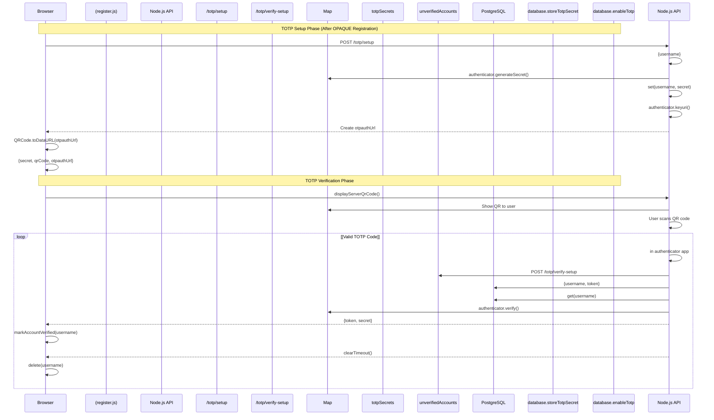
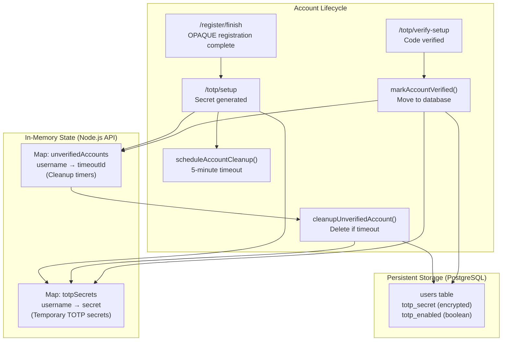
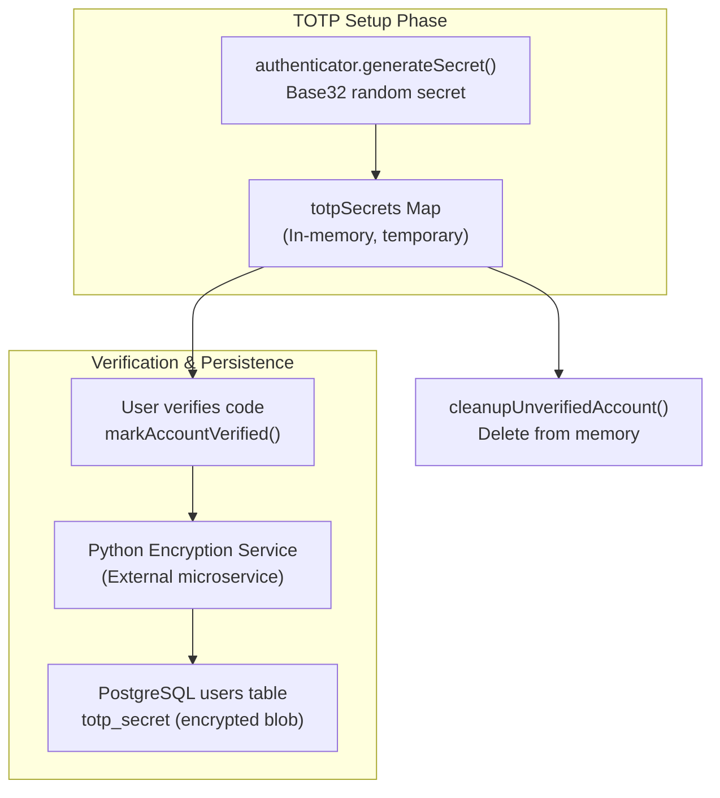

# TOTP Two-Factor Authentication

> **Relevant source files**
> * [back-end/node_internal_api/app.js](https://github.com/RogueElectron/Cypher1/blob/c60431e6/back-end/node_internal_api/app.js)
> * [back-end/src/auth.js](https://github.com/RogueElectron/Cypher1/blob/c60431e6/back-end/src/auth.js)
> * [back-end/src/register.js](https://github.com/RogueElectron/Cypher1/blob/c60431e6/back-end/src/register.js)

## Purpose and Scope

This document describes the Time-based One-Time Password (TOTP) two-factor authentication system implemented in the Cypher platform. TOTP provides a second authentication factor beyond password-based authentication, requiring users to present a time-synchronized 6-digit code generated by an authenticator app.

This page covers TOTP secret generation, QR code creation, verification during registration and login, and the account verification state management system. For the overall authentication workflow that combines OPAQUE and TOTP, see [Authentication Workflows](/RogueElectron/Cypher1/3.4-authentication-workflows). For PASETO session token management that occurs after successful TOTP verification, see [Session and Token Management](/RogueElectron/Cypher1/3.3-session-and-token-management). For OPAQUE password authentication, see [OPAQUE Protocol Implementation](/RogueElectron/Cypher1/3.1-opaque-protocol-implementation).

---

## Overview

The Cypher platform uses TOTP as a mandatory second factor for all user accounts. The TOTP implementation follows the RFC 6238 standard and integrates tightly with the OPAQUE password authentication protocol to create a multi-phase authentication system.

**Key Characteristics:**

* 6-digit codes with 30-second time windows
* QR code enrollment for authenticator apps (Google Authenticator, Authy, etc.)
* Temporary secret storage during registration with 5-minute cleanup timeout
* Encrypted secret storage in PostgreSQL after verification
* Verification window of ±1 time step (±30 seconds) for clock drift tolerance
* Mandatory 2FA during both registration and login

**Sources:** [back-end/node_internal_api/app.js L1-L502](https://github.com/RogueElectron/Cypher1/blob/c60431e6/back-end/node_internal_api/app.js#L1-L502)

---

## TOTP Library and Configuration

The Node.js Internal API uses the `otplib` library for TOTP operations and the `qrcode` library for QR code generation.

### Library Imports

```javascript
import { authenticator } from 'otplib';
import QRCode from 'qrcode';
```

**Sources:** [back-end/node_internal_api/app.js L16-L17](https://github.com/RogueElectron/Cypher1/blob/c60431e6/back-end/node_internal_api/app.js#L16-L17)

### TOTP Parameters

| Parameter | Value | Purpose |
| --- | --- | --- |
| Code Length | 6 digits | Standard TOTP code format |
| Time Step | 30 seconds | Synchronization window (RFC 6238 default) |
| Verification Window | ±1 step | Allows for ±30 seconds clock drift |
| Service Name | "Cypher" | Displayed in authenticator apps |
| Algorithm | SHA-1 | Default HMAC algorithm for TOTP |

The `authenticator.generateSecret()` method creates a base32-encoded secret compatible with standard authenticator applications.

**Sources:** [back-end/node_internal_api/app.js L329-L361](https://github.com/RogueElectron/Cypher1/blob/c60431e6/back-end/node_internal_api/app.js#L329-L361)

 [back-end/node_internal_api/app.js L441-L445](https://github.com/RogueElectron/Cypher1/blob/c60431e6/back-end/node_internal_api/app.js#L441-L445)

---

## TOTP Setup Flow (Registration)

### Registration TOTP Setup Sequence



**Sources:** [back-end/node_internal_api/app.js L329-L389](https://github.com/RogueElectron/Cypher1/blob/c60431e6/back-end/node_internal_api/app.js#L329-L389)

 [back-end/src/register.js L360-L397](https://github.com/RogueElectron/Cypher1/blob/c60431e6/back-end/src/register.js#L360-L397)

 [back-end/src/register.js L422-L492](https://github.com/RogueElectron/Cypher1/blob/c60431e6/back-end/src/register.js#L422-L492)

### TOTP Setup Implementation

#### Server-Side: /totp/setup Endpoint

The endpoint generates a new TOTP secret and creates a QR code for user enrollment:

```javascript
app.post('/totp/setup', async (req, res) => {
    const { username } = req.body;
    const secret = authenticator.generateSecret();
    totpSecrets.set(username, secret);
    
    const service = 'Cypher';
    const otpauthUrl = authenticator.keyuri(username, service, secret);
    const qrCodeDataURL = await QRCode.toDataURL(otpauthUrl);
    
    res.status(200).json({
        success: true,
        secret: secret,
        qrCode: qrCodeDataURL,
        otpauthUrl: otpauthUrl
    });
});
```

**Key Operations:**

1. **Secret Generation**: `authenticator.generateSecret()` creates a base32-encoded random secret
2. **OTPAuth URL**: `authenticator.keyuri()` constructs a URI in the format `otpauth://totp/Cypher:username?secret=...&issuer=Cypher`
3. **QR Code**: `QRCode.toDataURL()` converts the URI to a data URL for display
4. **Temporary Storage**: Secret stored in `totpSecrets` Map until verification completes

**Sources:** [back-end/node_internal_api/app.js L329-L361](https://github.com/RogueElectron/Cypher1/blob/c60431e6/back-end/node_internal_api/app.js#L329-L361)

#### Client-Side: generateTotpSecret() Function

After OPAQUE registration completes, the client requests TOTP setup:

```javascript
async function generateTotpSecret() {
    const username = document.getElementById('username').value;
    
    const response = await fetch('http://localhost:3000/totp/setup', {
        method: 'POST',
        headers: { 'Content-Type': 'application/json' },
        body: JSON.stringify({ username })
    });
    
    const result = await response.json();
    
    document.getElementById('totp-secret').textContent = result.secret;
    window.currentUsername = username;
    displayServerQrCode(result.qrCode, result.otpauthUrl);
    
    return result.secret;
}
```

The `displayServerQrCode()` function renders the QR code and provides alternative manual entry options.

**Sources:** [back-end/src/register.js L360-L397](https://github.com/RogueElectron/Cypher1/blob/c60431e6/back-end/src/register.js#L360-L397)

 [back-end/src/register.js L399-L415](https://github.com/RogueElectron/Cypher1/blob/c60431e6/back-end/src/register.js#L399-L415)

#### Server-Side: /totp/verify-setup Endpoint

The endpoint verifies the TOTP code and marks the account as fully registered:

```javascript
app.post('/totp/verify-setup', async (req, res) => {
    const { username, token } = req.body;
    const secret = totpSecrets.get(username);
    
    const isValid = authenticator.verify({ token, secret });
    
    if (isValid) {
        await markAccountVerified(username);
        res.status(200).json({ success: true, message: 'TOTP verification successful' });
    } else {
        res.status(400).json({ success: false, error: 'Invalid TOTP code' });
    }
});
```

The `markAccountVerified()` function moves the secret from temporary storage to permanent database storage.

**Sources:** [back-end/node_internal_api/app.js L363-L389](https://github.com/RogueElectron/Cypher1/blob/c60431e6/back-end/node_internal_api/app.js#L363-L389)

 [back-end/node_internal_api/app.js L113-L126](https://github.com/RogueElectron/Cypher1/blob/c60431e6/back-end/node_internal_api/app.js#L113-L126)

---

## TOTP Verification During Login

### Login TOTP Verification Sequence

```mermaid
sequenceDiagram
  participant Browser
  participant (auth.js)
  participant Cookie
  participant pass_auth_token
  participant NodeAPI as Node.js API
  participant /totp/verify-login
  participant Flask Service
  participant /api/verify-token
  participant /api/create-session
  participant PostgreSQL
  participant database.getTotpSecret
  participant SessionMgr as session-manager.js
  participant setTokens()

  note over Browser,setTokens(): TOTP Login Verification Phase
  Browser->>Browser: User enters 6-digit code
  Browser->>Cookie: getCookieValue('pass_auth_token')
  Cookie-->>Browser: passAuthToken (3-min TTL)
  Browser->>Node.js API: POST /totp/verify-login
  Node.js API->>Flask Service: {username, token, passAuthToken}
  Flask Service-->>Node.js API: POST /api/verify-token
  loop [TOTP Code Valid]
    Node.js API->>PostgreSQL: {token: passAuthToken, username}
    PostgreSQL-->>Node.js API: {valid: true}
    Node.js API->>Node.js API: getTotpSecret(username)
    Node.js API->>Flask Service: decrypted TOTP secret
    Flask Service-->>Node.js API: authenticator.verify()
    Node.js API-->>Browser: {token, secret, window: 1}
    Browser->>session-manager.js: POST /api/create-session
    Browser->>Cookie: {username}
    Browser->>Browser: {access_token, refresh_token, expires_in}
    Node.js API-->>Browser: {success: true, access_token, refresh_token}
    Flask Service-->>Node.js API: setTokens(access_token, refresh_token, expires_in)
    Node.js API-->>Browser: delete pass_auth_token
  end
```

**Sources:** [back-end/node_internal_api/app.js L391-L496](https://github.com/RogueElectron/Cypher1/blob/c60431e6/back-end/node_internal_api/app.js#L391-L496)

 [back-end/src/auth.js L376-L459](https://github.com/RogueElectron/Cypher1/blob/c60431e6/back-end/src/auth.js#L376-L459)

### Login Verification Implementation

#### Server-Side: /totp/verify-login Endpoint

The endpoint performs a two-stage verification: intermediate token validation followed by TOTP code verification:

```javascript
app.post('/totp/verify-login', async (req, res) => {
    const { username, token, passAuthToken } = req.body;
    
    // Stage 1: Verify intermediate token with Flask
    const verifyResponse = await fetch('http://localhost:5000/api/verify-token', {
        method: 'POST',
        headers: { 'Content-Type': 'application/json' },
        body: JSON.stringify({ token: passAuthToken, username })
    });
    
    const verifyData = await verifyResponse.json();
    if (!verifyData.valid) {
        return res.status(401).json({ error: 'Invalid or expired authentication token' });
    }
    
    // Stage 2: Verify TOTP code
    let secret = totpSecrets.get(username);  // Check temp storage first
    if (!secret) {
        secret = await database.getTotpSecret(username);  // Then check database
    }
    
    const isValid = authenticator.verify({ 
        token, 
        secret,
        window: 1  // Allow ±30 seconds clock drift
    });
    
    if (isValid) {
        markAccountVerified(username);
        
        // Create session tokens
        const sessionResponse = await fetch('http://localhost:5000/api/create-session', {
            method: 'POST',
            headers: { 'Content-Type': 'application/json' },
            body: JSON.stringify({ username: username })
        });
        
        const sessionData = await sessionResponse.json();
        
        res.status(200).json({ 
            success: true, 
            message: 'TOTP login verification successful - session created',
            access_token: sessionData.access_token,
            refresh_token: sessionData.refresh_token,
            expires_in: sessionData.expires_in
        });
    } else {
        res.status(400).json({ success: false, error: 'Invalid TOTP code' });
    }
});
```

**Key Operations:**

1. **Intermediate Token Validation**: Verifies `pass_auth_token` received after OPAQUE authentication
2. **Secret Retrieval**: Checks temporary storage first (for fresh registrations), then database
3. **TOTP Verification**: Uses `window: 1` to tolerate ±30 seconds clock drift
4. **Session Creation**: Requests PASETO tokens from Flask service
5. **Account Finalization**: Calls `markAccountVerified()` to move any temporary secrets to database

**Sources:** [back-end/node_internal_api/app.js L391-L496](https://github.com/RogueElectron/Cypher1/blob/c60431e6/back-end/node_internal_api/app.js#L391-L496)

#### Client-Side: TOTP Form Handler

After OPAQUE completes and the intermediate token is set, the client displays the TOTP input form:

```javascript
const totpForm = document.getElementById('totp-verify-form');
totpForm.addEventListener('submit', async (event) => {
    event.preventDefault();
    
    const totpCode = formData.get('totp_code');
    const username = document.getElementById('username').value;
    const passAuthFromCookie = getCookieValue('pass_auth_token');
    
    const verifyResponse = await fetch('http://localhost:3000/totp/verify-login', {
        method: 'POST',
        headers: { 'Content-Type': 'application/json' },
        credentials: 'include',
        body: JSON.stringify({
            username: username,
            token: totpCode,
            passAuthToken: passAuthFromCookie
        })
    });
    
    const verifyResult = await verifyResponse.json();
    
    if (verifyResult.access_token && verifyResult.refresh_token) {
        const { sessionManager } = await import('./session-manager.js');
        sessionManager.setTokens(
            verifyResult.access_token,
            verifyResult.refresh_token,
            verifyResult.expires_in || 900
        );
        
        // Clean up intermediate token
        document.cookie = 'pass_auth_token=; Max-Age=0; Path=/; SameSite=Lax';
    }
    
    window.location.href = '/';
});
```

**Sources:** [back-end/src/auth.js L376-L459](https://github.com/RogueElectron/Cypher1/blob/c60431e6/back-end/src/auth.js#L376-L459)

---

## Account Verification State Management

### State Management Data Structures



**Sources:** [back-end/node_internal_api/app.js L90-L126](https://github.com/RogueElectron/Cypher1/blob/c60431e6/back-end/node_internal_api/app.js#L90-L126)

### Verification State Functions

#### Account Cleanup Scheduling

When OPAQUE registration completes, a 5-minute cleanup timer starts:

```javascript
const VERIFICATION_TIMEOUT = 5 * 60 * 1000;  // 5 minutes

function scheduleAccountCleanup(username) {
    const timeoutId = setTimeout(() => {
        if (unverifiedAccounts.has(username)) {
            cleanupUnverifiedAccount(username);
        }
    }, VERIFICATION_TIMEOUT);
    
    unverifiedAccounts.set(username, timeoutId);
}
```

Called from the `/register/finish` endpoint after storing the OPAQUE record.

**Sources:** [back-end/node_internal_api/app.js L92-L111](https://github.com/RogueElectron/Cypher1/blob/c60431e6/back-end/node_internal_api/app.js#L92-L111)

 [back-end/node_internal_api/app.js L203-L206](https://github.com/RogueElectron/Cypher1/blob/c60431e6/back-end/node_internal_api/app.js#L203-L206)

#### Automatic Cleanup

If the user fails to complete TOTP setup within 5 minutes, the account is deleted:

```javascript
async function cleanupUnverifiedAccount(username) {
    const userData = await database.lookup(username);
    if (userData !== false) {
        await database.delete(username);
    }
    totpSecrets.delete(username);
    unverifiedAccounts.delete(username);
}
```

This prevents orphaned accounts with OPAQUE credentials but no 2FA.

**Sources:** [back-end/node_internal_api/app.js L94-L101](https://github.com/RogueElectron/Cypher1/blob/c60431e6/back-end/node_internal_api/app.js#L94-L101)

#### Account Verification

When TOTP verification succeeds, the account is permanently enabled:

```javascript
async function markAccountVerified(username) {
    if (unverifiedAccounts.has(username)) {
        clearTimeout(unverifiedAccounts.get(username));
        unverifiedAccounts.delete(username);
    }
    
    const secret = totpSecrets.get(username);
    if (secret) {
        await database.storeTotpSecret(username, secret);
        await database.enableTotp(username);
        totpSecrets.delete(username);
    }
}
```

**Key Operations:**

1. **Cancel Cleanup Timer**: Removes timeout to prevent deletion
2. **Persist Secret**: Calls `database.storeTotpSecret()` which encrypts and stores the secret
3. **Enable TOTP**: Sets `totp_enabled` flag in database
4. **Clear Temporary Storage**: Removes secret from `totpSecrets` Map

**Sources:** [back-end/node_internal_api/app.js L113-L126](https://github.com/RogueElectron/Cypher1/blob/c60431e6/back-end/node_internal_api/app.js#L113-L126)

---

## QR Code Generation

### OTPAuth URL Format

The TOTP secret is encoded into an `otpauth://` URL that authenticator apps can parse:

```javascript
const service = 'Cypher';
const otpauthUrl = authenticator.keyuri(username, service, secret);
// Format: otpauth://totp/Cypher:username?secret=BASE32SECRET&issuer=Cypher
```

**URL Components:**

| Component | Example Value | Purpose |
| --- | --- | --- |
| Scheme | `otpauth://totp` | Identifies TOTP protocol |
| Label | `Cypher:username` | Service and account identifier |
| Secret | `?secret=JBSWY3DPEHPK3PXP` | Base32-encoded secret |
| Issuer | `&issuer=Cypher` | Service name displayed in app |

**Sources:** [back-end/node_internal_api/app.js L342-L343](https://github.com/RogueElectron/Cypher1/blob/c60431e6/back-end/node_internal_api/app.js#L342-L343)

### QR Code Data URL Generation

The `qrcode` library converts the OTPAuth URL to a PNG data URL:

```javascript
const qrCodeDataURL = await QRCode.toDataURL(otpauthUrl);
// Returns: data:image/png;base64,iVBORw0KGgoAAAANSUhEUgAA...
```

The data URL is embedded directly in the HTML `` tag for display:

```

```

**Sources:** [back-end/node_internal_api/app.js L346](https://github.com/RogueElectron/Cypher1/blob/c60431e6/back-end/node_internal_api/app.js#L346-L346)

 [back-end/src/register.js L399-L415](https://github.com/RogueElectron/Cypher1/blob/c60431e6/back-end/src/register.js#L399-L415)

---

## Security Considerations

### Secret Storage Architecture



**Sources:** [back-end/node_internal_api/app.js L90-L126](https://github.com/RogueElectron/Cypher1/blob/c60431e6/back-end/node_internal_api/app.js#L90-L126)

 [back-end/node_internal_api/app.js L329-L361](https://github.com/RogueElectron/Cypher1/blob/c60431e6/back-end/node_internal_api/app.js#L329-L361)

### Security Properties

#### 1. Temporary Secret Storage

TOTP secrets are stored in the `totpSecrets` Map only during the registration window. This in-memory storage:

* Expires after 5 minutes via `scheduleAccountCleanup()`
* Is cleared immediately upon successful verification
* Is not persisted to disk
* Is lost if the Node.js process restarts

**Sources:** [back-end/node_internal_api/app.js L90-L92](https://github.com/RogueElectron/Cypher1/blob/c60431e6/back-end/node_internal_api/app.js#L90-L92)

 [back-end/node_internal_api/app.js L103-L111](https://github.com/RogueElectron/Cypher1/blob/c60431e6/back-end/node_internal_api/app.js#L103-L111)

#### 2. Encrypted Database Storage

After verification, secrets are encrypted before database storage:

* `database.storeTotpSecret(username, secret)` calls an external Python encryption service
* Only encrypted blobs are stored in PostgreSQL
* Decryption occurs in-memory during verification via `database.getTotpSecret(username)`

**Sources:** [back-end/node_internal_api/app.js L122-L123](https://github.com/RogueElectron/Cypher1/blob/c60431e6/back-end/node_internal_api/app.js#L122-L123)

 [back-end/node_internal_api/app.js L434](https://github.com/RogueElectron/Cypher1/blob/c60431e6/back-end/node_internal_api/app.js#L434-L434)

#### 3. Clock Drift Tolerance

TOTP verification uses a `window: 1` parameter to accept codes from adjacent time steps:

```javascript
const isValid = authenticator.verify({ 
    token, 
    secret,
    window: 1  // Accept current time ±30 seconds
});
```

This tolerates up to ±30 seconds of clock drift between client and server while maintaining security.

**Sources:** [back-end/node_internal_api/app.js L441-L445](https://github.com/RogueElectron/Cypher1/blob/c60431e6/back-end/node_internal_api/app.js#L441-L445)

#### 4. Intermediate Token Bridge

The TOTP verification phase requires a valid `pass_auth_token` from the OPAQUE authentication:

* 3-minute TTL prevents replay attacks
* Validates password authentication before TOTP
* Stored as HttpOnly cookie to prevent XSS access
* Deleted after session creation

This ensures TOTP verification cannot be performed without prior password authentication.

**Sources:** [back-end/src/auth.js L312-L314](https://github.com/RogueElectron/Cypher1/blob/c60431e6/back-end/src/auth.js#L312-L314)

 [back-end/src/auth.js L404-L408](https://github.com/RogueElectron/Cypher1/blob/c60431e6/back-end/src/auth.js#L404-L408)

 [back-end/src/auth.js L446](https://github.com/RogueElectron/Cypher1/blob/c60431e6/back-end/src/auth.js#L446-L446)

#### 5. Mandatory 2FA Enforcement

All accounts require TOTP setup:

* Registration cannot complete without TOTP verification
* Login flow blocks until TOTP code is validated
* No mechanism exists to disable TOTP for existing accounts
* Unverified accounts are automatically deleted after 5 minutes

**Sources:** [back-end/node_internal_api/app.js L103-L111](https://github.com/RogueElectron/Cypher1/blob/c60431e6/back-end/node_internal_api/app.js#L103-L111)

 [back-end/node_internal_api/app.js L449](https://github.com/RogueElectron/Cypher1/blob/c60431e6/back-end/node_internal_api/app.js#L449-L449)

---

## TOTP API Endpoints Reference

### POST /totp/setup

**Purpose:** Generates a new TOTP secret and QR code for account enrollment.

**Request Body:**

```json
{
    "username": "string"
}
```

**Response (200 OK):**

```json
{
    "success": true,
    "secret": "JBSWY3DPEHPK3PXP",
    "qrCode": "data:image/png;base64,iVBORw0KGgo...",
    "otpauthUrl": "otpauth://totp/Cypher:username?secret=JBSWY3DPEHPK3PXP&issuer=Cypher"
}
```

**Side Effects:**

* Stores secret in `totpSecrets` Map
* Does NOT start cleanup timer (timer starts after `/register/finish`)

**Sources:** [back-end/node_internal_api/app.js L329-L361](https://github.com/RogueElectron/Cypher1/blob/c60431e6/back-end/node_internal_api/app.js#L329-L361)

---

### POST /totp/verify-setup

**Purpose:** Verifies TOTP code during initial registration setup.

**Request Body:**

```json
{
    "username": "string",
    "token": "123456"
}
```

**Response (200 OK):**

```json
{
    "success": true,
    "message": "TOTP verification successful"
}
```

**Response (400 Bad Request):**

```json
{
    "success": false,
    "error": "Invalid TOTP code"
}
```

**Side Effects:**

* Calls `markAccountVerified()` on success
* Moves secret from `totpSecrets` to encrypted database storage
* Cancels cleanup timer from `unverifiedAccounts`
* Sets `totp_enabled = true` in database

**Sources:** [back-end/node_internal_api/app.js L363-L389](https://github.com/RogueElectron/Cypher1/blob/c60431e6/back-end/node_internal_api/app.js#L363-L389)

---

### POST /totp/verify-login

**Purpose:** Verifies TOTP code during login and creates session tokens.

**Request Body:**

```json
{
    "username": "string",
    "token": "123456",
    "passAuthToken": "v4.public.eyJ..."
}
```

**Response (200 OK):**

```json
{
    "success": true,
    "message": "TOTP login verification successful - session created",
    "access_token": "v4.public.eyJleHAiOjE3M...",
    "refresh_token": "v4.public.eyJleHAiOjE3M...",
    "expires_in": 900
}
```

**Response (401 Unauthorized):**

```json
{
    "error": "Invalid or expired authentication token"
}
```

**Response (400 Bad Request):**

```json
{
    "success": false,
    "error": "Invalid TOTP code"
}
```

**Internal Operations:**

1. Validates `passAuthToken` with Flask `/api/verify-token`
2. Retrieves TOTP secret from `totpSecrets` or database
3. Verifies TOTP code with `window: 1`
4. Calls Flask `/api/create-session` to generate tokens
5. Returns access and refresh tokens to client

**Sources:** [back-end/node_internal_api/app.js L391-L496](https://github.com/RogueElectron/Cypher1/blob/c60431e6/back-end/node_internal_api/app.js#L391-L496)

---

## Integration with Authentication Flow

The TOTP system integrates into the overall authentication workflow as follows:

**Registration Flow:**

1. OPAQUE registration completes → `/register/finish`
2. Cleanup timer starts → 5 minutes to complete setup
3. TOTP setup → `/totp/setup` generates secret and QR code
4. User scans QR code in authenticator app
5. User enters first TOTP code → `/totp/verify-setup`
6. Account fully activated → secret encrypted and stored

**Login Flow:**

1. OPAQUE authentication completes → intermediate `pass_auth_token` created
2. TOTP verification UI displayed
3. User enters current TOTP code from authenticator app
4. `/totp/verify-login` validates intermediate token and TOTP code
5. Session tokens created and returned
6. Client stores tokens via `sessionManager.setTokens()`

For complete authentication workflow details, see [Authentication Workflows](/RogueElectron/Cypher1/3.4-authentication-workflows).

**Sources:** [back-end/node_internal_api/app.js L203-L220](https://github.com/RogueElectron/Cypher1/blob/c60431e6/back-end/node_internal_api/app.js#L203-L220)

 [back-end/node_internal_api/app.js L263-L325](https://github.com/RogueElectron/Cypher1/blob/c60431e6/back-end/node_internal_api/app.js#L263-L325)

 [back-end/src/register.js L330-L347](https://github.com/RogueElectron/Cypher1/blob/c60431e6/back-end/src/register.js#L330-L347)

 [back-end/src/auth.js L335-L353](https://github.com/RogueElectron/Cypher1/blob/c60431e6/back-end/src/auth.js#L335-L353)