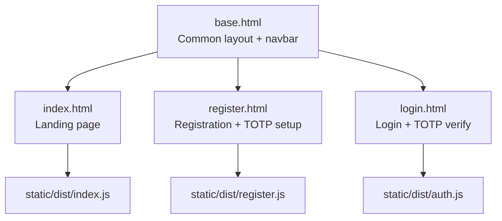
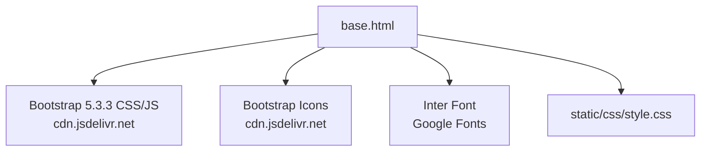
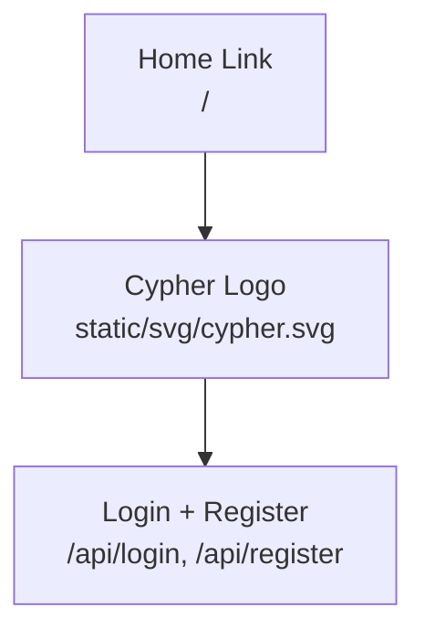
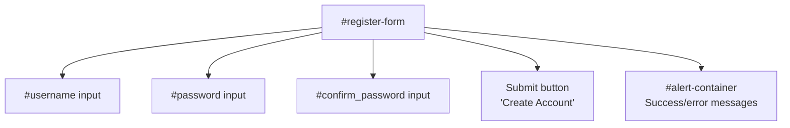
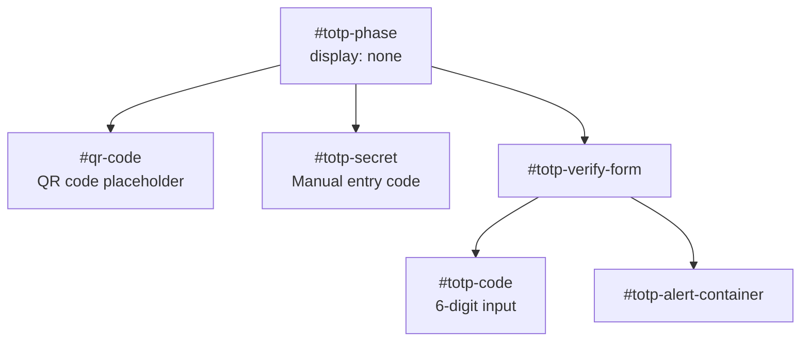
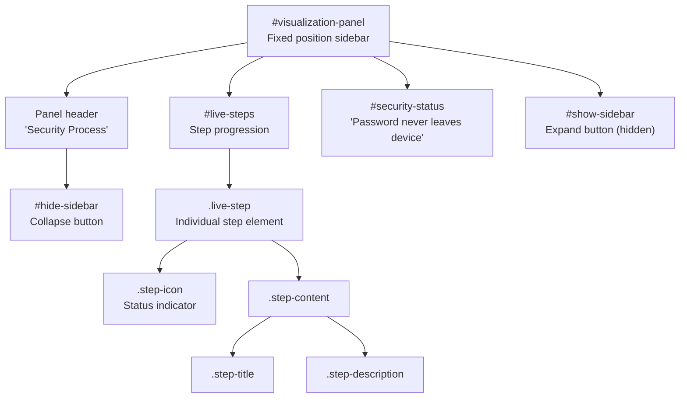
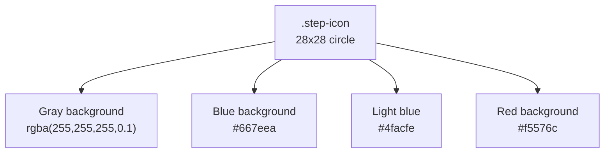
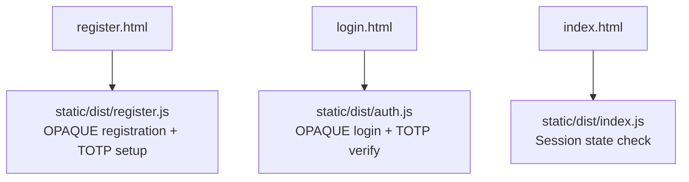

# UI Templates and Visualization

> **Relevant source files**
> * [back-end/static/svg/cypher.svg](https://github.com/RogueElectron/Cypher1/blob/c60431e6/back-end/static/svg/cypher.svg)
> * [back-end/templates/base.html](https://github.com/RogueElectron/Cypher1/blob/c60431e6/back-end/templates/base.html)
> * [back-end/templates/index.html](https://github.com/RogueElectron/Cypher1/blob/c60431e6/back-end/templates/index.html)
> * [back-end/templates/login.html](https://github.com/RogueElectron/Cypher1/blob/c60431e6/back-end/templates/login.html)
> * [back-end/templates/register.html](https://github.com/RogueElectron/Cypher1/blob/c60431e6/back-end/templates/register.html)

**Purpose**: This document covers the HTML template structure, UI components, and the live OPAQUE visualization system that provides real-time feedback during authentication flows. The templates use Jinja2 templating with Bootstrap 5 for styling and integrate with client-side JavaScript modules to create an interactive, educational authentication experience.

For client-side authentication logic, see [Login Flow (Client-Side)](/RogueElectron/Cypher1/5.2-login-flow-(client-side)) and [Registration Flow (Client-Side)](/RogueElectron/Cypher1/5.1-registration-flow-(client-side)). For JavaScript module documentation, see [Session Manager Module](/RogueElectron/Cypher1/5.3-session-manager-module).

---

## Template Architecture

The Cypher platform uses a **Jinja2 template inheritance** model served by the Flask application. All page templates extend from `base.html`, which provides the common layout, navigation, and styling infrastructure.

### Template Hierarchy



**Sources**: [back-end/templates/base.html L1-L51](https://github.com/RogueElectron/Cypher1/blob/c60431e6/back-end/templates/base.html#L1-L51)

 [back-end/templates/register.html L1-L7](https://github.com/RogueElectron/Cypher1/blob/c60431e6/back-end/templates/register.html#L1-L7)

 [back-end/templates/login.html L1-L7](https://github.com/RogueElectron/Cypher1/blob/c60431e6/back-end/templates/login.html#L1-L7)

 [back-end/templates/index.html L1-L4](https://github.com/RogueElectron/Cypher1/blob/c60431e6/back-end/templates/index.html#L1-L4)

---

## Base Layout (base.html)

The base template provides the foundational structure shared across all pages, including the navigation bar, external dependencies, and theming.

### Key Components

| Component | Purpose | Lines |
| --- | --- | --- |
| **Dark Theme** | Bootstrap dark mode via `data-bs-theme="dark"` | [2](https://github.com/RogueElectron/Cypher1/blob/c60431e6/2) |
| **Animated Background** | `.animated-bg` div for visual effects | [17](https://github.com/RogueElectron/Cypher1/blob/c60431e6/17) |
| **Navigation Bar** | Responsive navbar with logo and auth links | [20-44](https://github.com/RogueElectron/Cypher1/blob/c60431e6/20-44) |
| **Content Block** | `` for page-specific content | [45](https://github.com/RogueElectron/Cypher1/blob/c60431e6/45) |
| **External Dependencies** | Bootstrap 5.3.3, Bootstrap Icons, Inter font | [8-11](https://github.com/RogueElectron/Cypher1/blob/c60431e6/8-11) |

### External Resources



**Sources**: [back-end/templates/base.html L8-L11](https://github.com/RogueElectron/Cypher1/blob/c60431e6/back-end/templates/base.html#L8-L11)

 [back-end/templates/base.html L47](https://github.com/RogueElectron/Cypher1/blob/c60431e6/back-end/templates/base.html#L47-L47)

### Navigation Structure

The navbar is centered around the Cypher logo with authentication links on both sides:



The logo is positioned absolutely at the center using Bootstrap utility classes `position-absolute start-50 translate-middle-x` [back-end/templates/base.html L31-L33](https://github.com/RogueElectron/Cypher1/blob/c60431e6/back-end/templates/base.html#L31-L33)

**Sources**: [back-end/templates/base.html L20-L44](https://github.com/RogueElectron/Cypher1/blob/c60431e6/back-end/templates/base.html#L20-L44)

---

## Page Templates

### index.html - Landing Page

The home page presents a minimal hero section with call-to-action buttons and a brief security statement.

**Key Elements**:

* **Hero Title**: Cypher logo displayed at 120px height [back-end/templates/index.html L11](https://github.com/RogueElectron/Cypher1/blob/c60431e6/back-end/templates/index.html#L11-L11)
* **Subtitle**: "Next-generation authentication platform with zero-knowledge security" [13](https://github.com/RogueElectron/Cypher1/blob/c60431e6/13)
* **CTA Buttons**: "Sign In" (outline) and "Get Started" (primary with glow effect) [15-16](https://github.com/RogueElectron/Cypher1/blob/c60431e6/15-16)
* **Security Message**: Glass card explaining OPAQUE protocol [24-28](https://github.com/RogueElectron/Cypher1/blob/c60431e6/24-28)

The page loads `static/dist/index.js` for session state checking [back-end/templates/index.html L34](https://github.com/RogueElectron/Cypher1/blob/c60431e6/back-end/templates/index.html#L34-L34)

**Sources**: [back-end/templates/index.html L1-L36](https://github.com/RogueElectron/Cypher1/blob/c60431e6/back-end/templates/index.html#L1-L36)

### register.html - Registration Flow

The registration template implements a **two-phase UI** that transitions from account creation to TOTP setup.

#### Phase 1: Account Creation Form



The form prevents default submission with `action="javascript:void(0);"` [back-end/templates/register.html L26](https://github.com/RogueElectron/Cypher1/blob/c60431e6/back-end/templates/register.html#L26-L26)

 allowing JavaScript to handle the OPAQUE protocol flow.

**Sources**: [back-end/templates/register.html L17-L43](https://github.com/RogueElectron/Cypher1/blob/c60431e6/back-end/templates/register.html#L17-L43)

#### Phase 2: TOTP Setup (Hidden Initially)



The TOTP phase becomes visible after successful OPAQUE registration [back-end/templates/register.html L46-L81](https://github.com/RogueElectron/Cypher1/blob/c60431e6/back-end/templates/register.html#L46-L81)

 The QR code and secret are populated dynamically by `register.js`.

**Input Styling**: The TOTP code input uses monospace font with letter spacing for better readability [back-end/templates/register.html L246-L251](https://github.com/RogueElectron/Cypher1/blob/c60431e6/back-end/templates/register.html#L246-L251)

**Sources**: [back-end/templates/register.html L46-L81](https://github.com/RogueElectron/Cypher1/blob/c60431e6/back-end/templates/register.html#L46-L81)

 [back-end/templates/register.html L246-L251](https://github.com/RogueElectron/Cypher1/blob/c60431e6/back-end/templates/register.html#L246-L251)

### login.html - Login Flow

Similar to registration, the login template implements a two-phase UI for password authentication followed by TOTP verification.

#### Phase 1: Credential Input

| Element ID | Purpose | Type |
| --- | --- | --- |
| `#login-form` | OPAQUE login form | Form |
| `#username` | Username input | Text input |
| `#password` | Password input | Password input |
| `#alert-container` | Error messages | Div |

**Sources**: [back-end/templates/login.html L17-L40](https://github.com/RogueElectron/Cypher1/blob/c60431e6/back-end/templates/login.html#L17-L40)

#### Phase 2: TOTP Verification

After successful OPAQUE authentication, the form is hidden and `#totp-phase` is displayed [back-end/templates/login.html L43-L61](https://github.com/RogueElectron/Cypher1/blob/c60431e6/back-end/templates/login.html#L43-L61)

 The user enters their 6-digit authenticator code to complete login.

**Sources**: [back-end/templates/login.html L43-L61](https://github.com/RogueElectron/Cypher1/blob/c60431e6/back-end/templates/login.html#L43-L61)

---

## Live OPAQUE Visualization Sidebar

Both `register.html` and `login.html` include an **educational visualization panel** that shows real-time progress through the OPAQUE protocol. This feature is only visible on extra-large screens (`d-none d-xl-block`).

### Visualization Architecture



**Sources**: [back-end/templates/register.html L92-L124](https://github.com/RogueElectron/Cypher1/blob/c60431e6/back-end/templates/register.html#L92-L124)

 [back-end/templates/login.html L72-L104](https://github.com/RogueElectron/Cypher1/blob/c60431e6/back-end/templates/login.html#L72-L104)

### Visualization States

The sidebar steps dynamically change appearance based on their state, controlled by JavaScript:

| CSS Class | Visual Appearance | Meaning |
| --- | --- | --- |
| `.live-step` (default) | Opacity 0.5, gray border | Pending step |
| `.live-step.active` | Border `#667eea`, scale 1.02 | Currently executing |
| `.live-step.completed` | Border `#4facfe`, blue background | Finished step |
| `.live-step.processing` | Border `#f5576c`, pulsing animation | Server processing |

The processing state includes a subtle pulse animation [back-end/templates/register.html L182-L185](https://github.com/RogueElectron/Cypher1/blob/c60431e6/back-end/templates/register.html#L182-L185)

:

```
@keyframes subtle-pulse {
    0%, 100% { opacity: 1; }
    50% { opacity: 0.7; }
}
```

**Sources**: [back-end/templates/register.html L150-L180](https://github.com/RogueElectron/Cypher1/blob/c60431e6/back-end/templates/register.html#L150-L180)

 [back-end/templates/login.html L130-L160](https://github.com/RogueElectron/Cypher1/blob/c60431e6/back-end/templates/login.html#L130-L160)

### Step Icon Rendering



**Sources**: [back-end/templates/register.html L187-L217](https://github.com/RogueElectron/Cypher1/blob/c60431e6/back-end/templates/register.html#L187-L217)

 [back-end/templates/login.html L167-L197](https://github.com/RogueElectron/Cypher1/blob/c60431e6/back-end/templates/login.html#L167-L197)

### Positioning and Responsiveness

The visualization panel is positioned using fixed positioning:

* **Right offset**: 20px from viewport edge
* **Top offset**: 80px (below navbar)
* **Width**: 300px
* **Max height**: `calc(100vh - 120px)` with scroll overflow
* **Z-index**: 1000 (above content, below modals)

When hidden via the hide button, the panel transforms off-screen: `transform: translateX(320px)` [back-end/templates/register.html L147-L148](https://github.com/RogueElectron/Cypher1/blob/c60431e6/back-end/templates/register.html#L147-L148)

**Sources**: [back-end/templates/register.html L93](https://github.com/RogueElectron/Cypher1/blob/c60431e6/back-end/templates/register.html#L93-L93)

 [back-end/templates/register.html L146-L148](https://github.com/RogueElectron/Cypher1/blob/c60431e6/back-end/templates/register.html#L146-L148)

---

## Styling System

### Glass Morphism Design

The UI implements a **glass card** design pattern throughout:

```
.glass-card {
    background: rgba(255, 255, 255, 0.03);
    border: 1px solid rgba(255, 255, 255, 0.08);
    box-shadow: 0 10px 20px rgba(0, 0, 0, 0.2);
}
```

Different cards have enhanced styling:

* **Main form card**: Stronger shadow `0 20px 40px rgba(0, 0, 0, 0.4)` and thicker border [back-end/templates/register.html L130-L133](https://github.com/RogueElectron/Cypher1/blob/c60431e6/back-end/templates/register.html#L130-L133)
* **Visualization sidebar**: Lighter background [back-end/templates/register.html L136-L139](https://github.com/RogueElectron/Cypher1/blob/c60431e6/back-end/templates/register.html#L136-L139)

**Sources**: [back-end/templates/register.html L130-L139](https://github.com/RogueElectron/Cypher1/blob/c60431e6/back-end/templates/register.html#L130-L139)

 [back-end/static/css/style.css](https://github.com/RogueElectron/Cypher1/blob/c60431e6/back-end/static/css/style.css)

### Form Input Styling

Special styling is applied to specific inputs:

| Input | Style Feature | Purpose |
| --- | --- | --- |
| `#totp-code` | Monospace font, 18px, 4px letter spacing | Improve readability of 6-digit codes |
| `code` elements | Blue background `rgba(102, 126, 234, 0.1)` | Highlight TOTP secrets |

**Sources**: [back-end/templates/register.html L246-L259](https://github.com/RogueElectron/Cypher1/blob/c60431e6/back-end/templates/register.html#L246-L259)

 [back-end/templates/login.html L226-L239](https://github.com/RogueElectron/Cypher1/blob/c60431e6/back-end/templates/login.html#L226-L239)

### Security Status Indicator

The security status box at the bottom of the visualization uses a blue color scheme to emphasize zero-knowledge properties:

```
.security-status {
    background: rgba(75, 172, 254, 0.1);
    border: 1px solid rgba(75, 172, 254, 0.2);
}
```

**Sources**: [back-end/templates/register.html L241-L244](https://github.com/RogueElectron/Cypher1/blob/c60431e6/back-end/templates/register.html#L241-L244)

 [back-end/templates/login.html L221-L224](https://github.com/RogueElectron/Cypher1/blob/c60431e6/back-end/templates/login.html#L221-L224)

---

## JavaScript Integration Points

### Module Loading Strategy

Each template loads its corresponding JavaScript module via `<script type="module">`:



The `` in the `<head>` section ensures JavaScript loads before the DOM [back-end/templates/register.html L3-L5](https://github.com/RogueElectron/Cypher1/blob/c60431e6/back-end/templates/register.html#L3-L5)

 [back-end/templates/login.html L3-L5](https://github.com/RogueElectron/Cypher1/blob/c60431e6/back-end/templates/login.html#L3-L5)

**Sources**: [back-end/templates/register.html L3-L5](https://github.com/RogueElectron/Cypher1/blob/c60431e6/back-end/templates/register.html#L3-L5)

 [back-end/templates/login.html L3-L5](https://github.com/RogueElectron/Cypher1/blob/c60431e6/back-end/templates/login.html#L3-L5)

 [back-end/templates/index.html L34](https://github.com/RogueElectron/Cypher1/blob/c60431e6/back-end/templates/index.html#L34-L34)

### DOM Element Contract

JavaScript modules expect specific DOM element IDs to exist:

#### Registration Page Elements

| Element ID | Used By | Purpose |
| --- | --- | --- |
| `#register-form` | `register.js` | Form submission handler |
| `#username`, `#password`, `#confirm_password` | `register.js` | Input value extraction |
| `#totp-phase` | `register.js` | Show/hide TOTP setup |
| `#qr-code` | `register.js` | QR code rendering target |
| `#totp-secret` | `register.js` | Display secret for manual entry |
| `#totp-verify-form` | `register.js` | TOTP verification submission |
| `#live-steps` | `register.js` | Visualization step injection |
| `#alert-container` | `register.js` | Error/success messages |

#### Login Page Elements

| Element ID | Used By | Purpose |
| --- | --- | --- |
| `#login-form` | `auth.js` | Form submission handler |
| `#username`, `#password` | `auth.js` | Credential extraction |
| `#totp-phase` | `auth.js` | Show/hide TOTP verification |
| `#totp-verify-form` | `auth.js` | TOTP submission |
| `#live-steps` | `auth.js` | Visualization updates |
| `#alert-container` | `auth.js` | Error messages |

**Sources**: [back-end/templates/register.html L26-L81](https://github.com/RogueElectron/Cypher1/blob/c60431e6/back-end/templates/register.html#L26-L81)

 [back-end/templates/login.html L26-L61](https://github.com/RogueElectron/Cypher1/blob/c60431e6/back-end/templates/login.html#L26-L61)

### Visualization Update Interface

The JavaScript modules populate `#live-steps` with dynamically generated step elements following this structure:

```html
<div class="live-step" id="step-{index}">
    <div class="step-icon">
        <i class="bi bi-{icon}"></i>
    </div>
    <div class="step-content">
        <div class="step-title">{title}</div>
        <div class="step-description">{description}</div>
    </div>
</div>
```

The JavaScript then adds/removes CSS classes (`.active`, `.completed`, `.processing`) to update visual state as the authentication flow progresses.

**Sources**: [back-end/templates/register.html L150-L240](https://github.com/RogueElectron/Cypher1/blob/c60431e6/back-end/templates/register.html#L150-L240)

 [back-end/templates/login.html L130-L220](https://github.com/RogueElectron/Cypher1/blob/c60431e6/back-end/templates/login.html#L130-L220)

---

## Template Routing

The Flask application serves these templates via the following routes:

| Route | Template | View Function |
| --- | --- | --- |
| `GET /` | `index.html` | `serve_index` |
| `GET /api/login` | `login.html` | `serve_login` |
| `GET /api/register` | `register.html` | `serve_register` |

Flask's `url_for()` function generates URLs throughout the templates:

* `{{ url_for('static', filename='...') }}` - Static asset URLs
* `{{ url_for('serve_index') }}` - Home page link
* `{{ url_for('serve_login') }}` - Login page link
* `{{ url_for('serve_register') }}` - Registration page link

**Sources**: [back-end/templates/base.html L11](https://github.com/RogueElectron/Cypher1/blob/c60431e6/back-end/templates/base.html#L11-L11)

 [back-end/templates/base.html L28](https://github.com/RogueElectron/Cypher1/blob/c60431e6/back-end/templates/base.html#L28-L28)

 [back-end/templates/base.html L31-L39](https://github.com/RogueElectron/Cypher1/blob/c60431e6/back-end/templates/base.html#L31-L39)

---

## Summary

The UI template system provides a cohesive, educational authentication experience through:

1. **Template Inheritance**: Jinja2 blocks for consistent layout
2. **Responsive Design**: Bootstrap 5 grid system with mobile-first approach
3. **Live Visualization**: Real-time OPAQUE protocol feedback (XL screens only)
4. **Glass Morphism**: Modern semi-transparent UI aesthetic
5. **JavaScript Integration**: Well-defined DOM element contracts for client-side modules

The visualization sidebar is a unique educational feature that demystifies the zero-knowledge authentication process, showing users exactly what happens during OPAQUE registration and login flows.