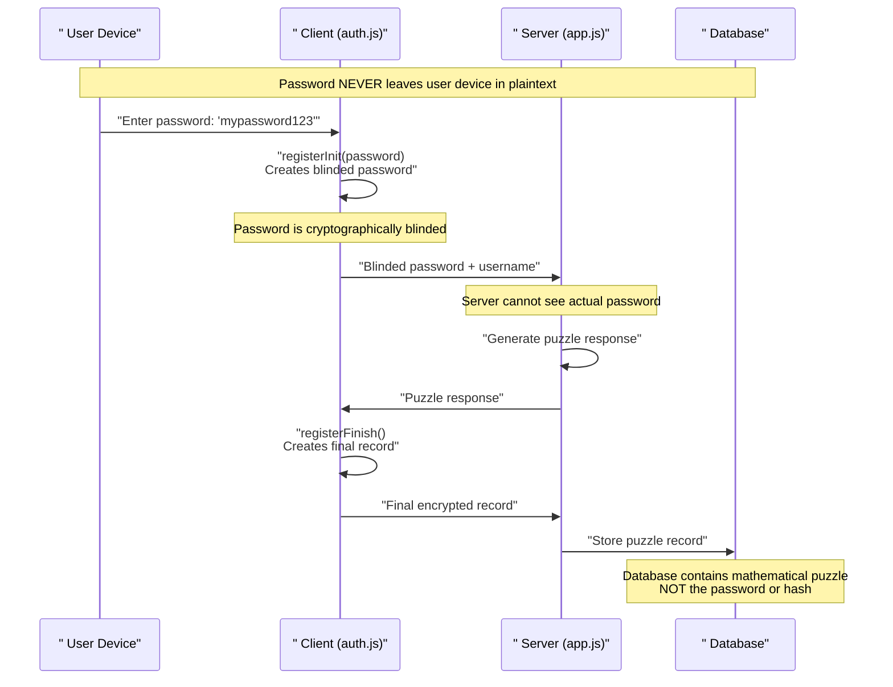
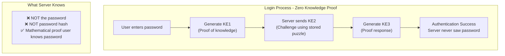
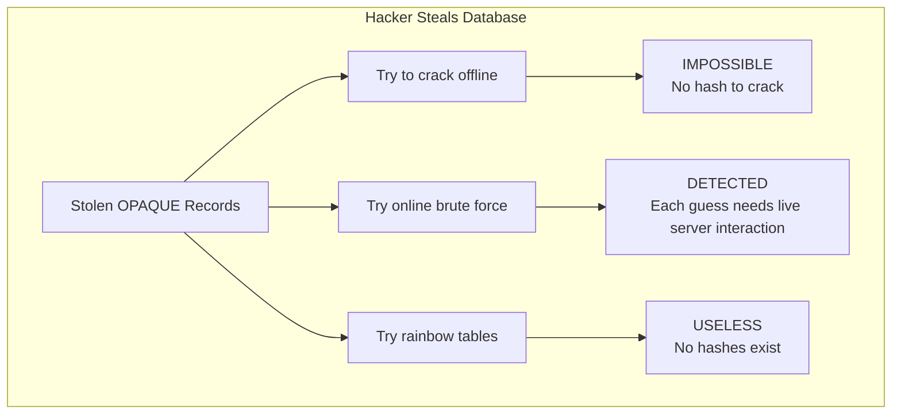
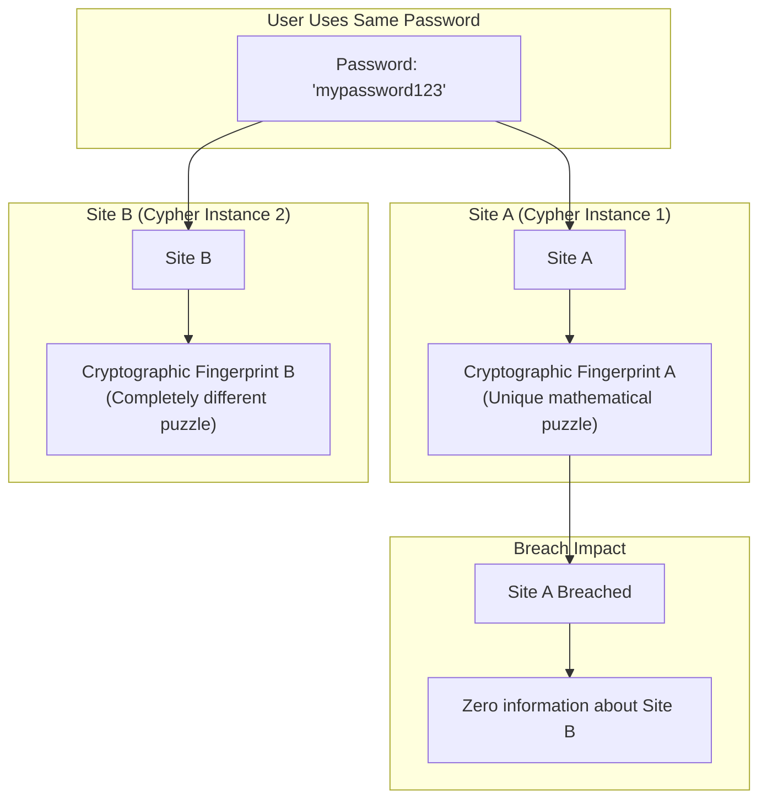
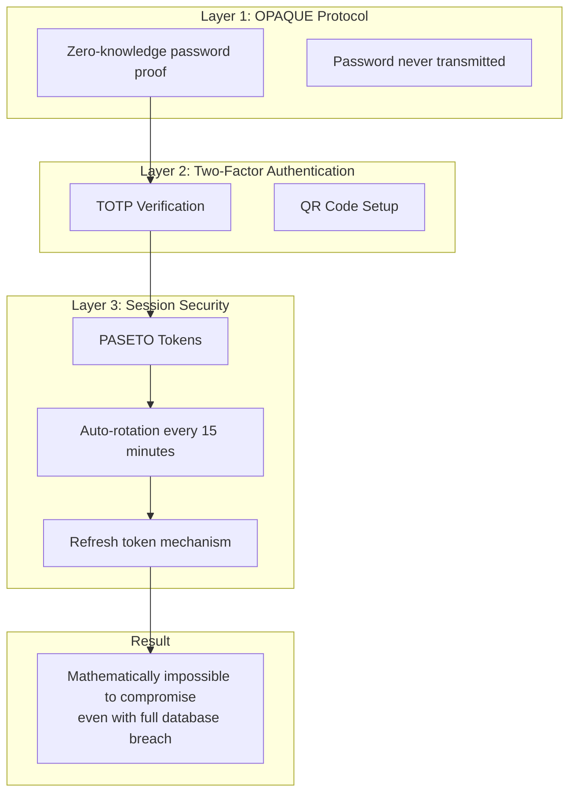

# Cypher Simple Guide

This is quick guide if you want to understand how cypher works and the benefits of it, without diving into too much technical details

### 1. Traditional vs OPAQUE Password Storage

```mermaid
graph TB
    subgraph "Traditional Password System"
        UserPass1["User Password: 'mypassword123'"]
        Hash1["Server Stores: hash('mypassword123')"]
        Breach1[" Database Breach"]
        Crack1["Hackers can crack offline:<br/>billions of guesses per second"]
        
        UserPass1 --> Hash1
        Hash1 --> Breach1
        Breach1 --> Crack1
    end
    
    subgraph "OPAQUE System (Cypher)"
        UserPass2["User Password: 'mypassword123'"]
        Envelope["Cryptographic Envelope<br/>(Mathematical Puzzle)"]
        ServerRecord["Server Stores: Puzzle Record<br/>(reveals nothing about password)"]
        Breach2[" Database Breach"]
        Useless["Stolen data is mathematically useless<br/>No offline cracking possible"]
        
        UserPass2 --> Envelope
        Envelope --> ServerRecord
        ServerRecord --> Breach2
        Breach2 --> Useless
    end
```

### 2. OPAQUE Registration Process

The registration process ensures your password never leaves your device in plaintext.

### 3. Zero-Knowledge Authentication

The authentication steps are visualized in real-time for users.

### 4. Why Breaches Become Useless

Unlike traditional password hashes, OPAQUE records stored in the database cannot be cracked offline.

### 5. Same Password, Different Sites = Different Fingerprints

Each OPAQUE server instance uses unique cryptographic seeds, ensuring different fingerprints even with identical passwords.

### 6. Complete Security Architecture

